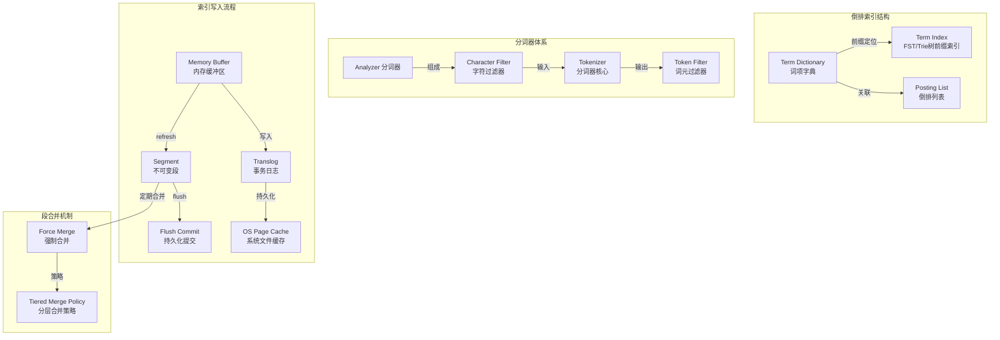

# 倒排索引与分词

## 概述
倒排索引是 Elasticsearch 实现高性能全文搜索的基石。本模块深入讲解倒排索引的底层数据结构、分词器的选择与原理、索引写入的完整链路，以及 Segment 合并和 FST 压缩等核心机制，帮助建立对搜索引擎内部运作的完整认知。

---

## 一、知识图谱



---

## 二、基础到进阶学习路线

- **阶段一：基础入门**：理解倒排索引的基本概念（Term Dictionary + Posting List），会用 IK 分词器进行中文分词。
- **阶段二：原理深入**：掌握索引写入链路（Buffer → Refresh → Segment → Flush → Translog）、FST 压缩原理、段合并策略。
- **阶段三：实战优化**：根据业务场景定制分词器、优化 Segment 数量、调优 Refresh 和 Flush 参数。

---

## 三、核心知识详解

### 3.1 倒排索引结构

倒排索引（Inverted Index）是现代搜索引擎的核心数据结构。传统数据库使用正向索引（Page Table）：根据文档 ID 查找文档内容。倒排索引反过来：根据词条（Term）查找包含它的文档列表。

**核心组成：**

```
倒排索引结构示意：

文档集合：
  Doc1: "Elasticsearch is a search engine"
  Doc2: "Elasticsearch is fast"
  Doc3: "Search is important"

倒排索引：
┌──────────────────┬──────────────┐
│   Term Dictionary │ Posting List │
├──────────────────┼──────────────┤
│ "Elasticsearch"   │ [1, 2]       │
│ "is"              │ [1, 2, 3]    │
│ "a"               │ [1]          │
│ "search"          │ [1, 3]       │
│ "engine"          │ [1]          │
│ "fast"            │ [2]          │
│ "important"       │ [3]          │
└──────────────────┴──────────────┘
```

Term 按字典序排序后，Posting List 中每个文档 ID 还会附带：

| 信息 | 用途 | 存储文件 |
|------|------|----------|
| Document ID | 文档唯一标识 | .doc |
| Term Frequency (TF) | 词条在文档中出现次数 | .doc |
| Position | 词条在文档中的位置偏移 | .pos |
| Offset | 词条的起止字符偏移 | .pay |
| Payload | 自定义附加信息 | .pay |

::: tip 关键理解
倒排索引 = Term Dictionary（快速定位词条） + Posting List（文档 ID 列表 + 频率 + 位置信息）
:::

### 3.2 分词器（Analyzer）

分词器负责将原始文本转换为一系列 Token（词元），是倒排索引构建前的关键步骤。

**Analyzer 三段式结构：**

```json
{
  "settings": {
    "analysis": {
      "analyzer": {
        "my_custom_analyzer": {
          "type": "custom",
          "char_filter": ["html_strip"],        // 阶段1: 去除HTML标签
          "tokenizer": "ik_max_word",           // 阶段2: 按词典切分词元
          "filter": ["lowercase", "stop"]       // 阶段3: 转小写、去除停用词
        }
      }
    }
  }
}
```

**三段处理流程：**

| 阶段 | 组件 | 作用 | 示例 |
|------|------|------|------|
| Char Filter | 字符过滤器 | 预处理原始文本（去除HTML标签、替换字符） | `<p>Hello</p>` → `Hello` |
| Tokenizer | 分词器 | 将文本切分为词元列表 | `Hello World` → [`Hello`, `World`] |
| Token Filter | 词元过滤器 | 对词元进行后处理（大小写转换、停用词、同义词） | [`Hello`, `World`] → [`hello`, `world`] |

**常用分词器对比：**

| 分词器 | 类型 | 适用场景 | 分词示例（"中华人民共和国"） |
|--------|------|----------|---------------------------|
| Standard | 标准分词器 | 英文通用 | 不适用于中文 |
| Whitespace | 空白分隔 | 按空格分词 | 不适用 |
| IK Analyzer (ik_max_word) | 中文细粒度 | 索引阶段，尽可能多分 | `中华人民共和国` → [`中华人民共和国`, `中华人民`, `中华`, `华人`, `人民共和国`, `人民`, `共和国`, `共和`, `国`] |
| IK Analyzer (ik_smart) | 中文粗粒度 | 搜索阶段，召回更精准 | `中华人民共和国` → [`中华人民共和国`] |
| Pinyin | 拼音分词 | 拼音搜索 | `中国` → [`zhongguo`, `zg`] |
| NGram | N元语法 | 前缀/模糊匹配 | `hello` → [`he`, `el`, `ll`, `lo`] |

::: warning IK 分词器注意
1. IK 分词器为第三方插件，需要单独安装：`elasticsearch-plugin install analysis-ik`
2. 索引时建议使用 `ik_max_word`（细粒度），搜索时使用 `ik_smart`（粗粒度），兼顾召回率和精度
3. 自定义词典放在 `{ES_HOME}/config/analysis-ik/` 目录下，修改后需重启或触发热更新
:::

### 3.3 索引创建流程

ES 的文档写入经历以下完整链路：

```
客户端
  │
  ▼
┌──────────────────┐
│ 1. Ingest Pipeline │  ← 预处理管道（可选）
│   字段转换、管道处理  │
└──────┬───────────┘
       │
       ▼
┌──────────────────┐
│ 2. Routing        │  ← 路由到目标分片
│   hash(_id) % N   │
└──────┬───────────┘
       │
       ▼
┌──────────────────┐
│ 3. Memory Buffer  │  ← 先写入内存缓冲区（JVM Heap）
│   倒排索引构建      │    同时写入 Translog
└──────┬───────────┘
       │  refresh（默认1s）
       ▼
┌──────────────────┐
│ 4. Segment        │  ← 生成新的不可变 Segment
│   可被搜索          │    写入 OS Page Cache
└──────┬───────────┘
       │  flush（默认30min 或 translog > 512MB）
       ▼
┌──────────────────┐
│ 5. Commit         │  ← Segment fsync 到磁盘
│   持久化            │    Translog 清空
└──────────────────┘
```

**关键时间节点：**

| 操作 | 触发条件 | 默认值 | 作用 |
|------|----------|--------|------|
| Refresh | 定时触发 | `index.refresh_interval = 1s` | 将 Buffer 数据生成新 Segment，使其可被搜索 |
| Flush | 定时/大小触发 | 30min 或 Translog 达 512MB | 执行 fsync 持久化，清空 Translog |
| Translog fsync | 每次写请求 | `index.translog.durability = request` | 保证数据不丢失（每次写都 fsync） |

**Translog（事务日志）机制：**
- 类似 MySQL 的 binlog，记录所有未持久化的写操作
- 写入 Buffer 的同时写入 Translog，节点崩溃后可通过 Translog 恢复
- Flush 成功后清空 Translog

::: danger 数据安全提示
如果设置 `index.translog.durability = async`（异步），写入性能会大幅提升，但节点崩溃可能丢失最多 5s 的数据。金融、订单等场景必须使用 `request` 级别。
:::

### 3.4 段合并机制（Segment Merge）

由于每次 Refresh 都生成一个新的 Segment，Segment 数量会快速增长。过多的 Segment 会拖慢搜索速度（每个搜索请求需要遍历所有 Segment）。

**合并流程：**

```
┌──────┐ ┌──────┐ ┌──────┐ ┌──────┐ ┌──────┐
│ Seg1 │ │ Seg2 │ │ Seg3 │ │ Seg4 │ │ Seg5 │  ... 大量小 Segment
└──┬───┘ └──┬───┘ └──┬───┘ └──┬───┘ └──┬───┘
   │        │        │        │        │
   └────────┴────────┘        └────────┴────────┘
            │                          │
            ▼                          ▼
      ┌──────────┐              ┌──────────┐
      │ Merged A │              │ Merged B │
      └────┬─────┘              └────┬─────┘
           │                         │
           └───────────┬─────────────┘
                       ▼
                 ┌──────────┐
                 │ Merged C │
                 └──────────┘
```

**Tiered Merge Policy（分层合并策略）**：
1. 按 Segment 大小分层，每层的 Segment 数量有上限
2. 同一层内超过阈值时触发合并
3. 优先合并较小的 Segment（合并成本低）
4. 单次合并大小有上限（默认 5GB），避免合并过大的 Segment

**Force Merge（强制合并）：**

```json
// 将索引强制合并为 1 个 Segment（仅建议对不再写入的索引执行）
POST /logs-2024/_forcemerge?max_num_segments=1
```

::: warning Force Merge 注意事项
- Force Merge 是非常消耗 IO 和 CPU 的操作，不要在业务高峰期执行
- 只对只读索引（不再写入）执行 Force Merge，否则合并完又会产生新 Segment
- 合并过程中磁盘占用会翻倍（需要同时存在旧 Segment 和合并后的新 Segment）
:::

### 3.5 FST 前缀压缩

**FST（Finite State Transducer）** 是 Lucene 用于存储 Term Dictionary 的核心数据结构，替代了传统的 B-Tree 或 HashMap。

**FST 的优势：**

| 特性 | FST | HashMap | B-Tree |
|------|-----|---------|--------|
| 内存占用 | 极低（公共前缀共享） | 高 | 中 |
| 前缀搜索 | O(len) 原生支持 | 不支持，需遍历 | 支持，O(logN) |
| 范围扫描 | 支持 | 不支持 | 支持 |
| 构建速度 | 中 | 快 | 中 |

**FST 如何压缩？**

假设 Term Dictionary 中有以下词条：
```
mon, monday, month, monday, moon
```

FST 会将这些词条的前缀 `mon` 存储为共享路径，只在分叉处（`day` / `th` / `oon`）展开。相比于 HashMap 每个词条独立存储，FST 能压缩 80%-90% 的内存占用。

**Term Index（Trie 树）加速：**
- FST 自身是线性的（虽然紧凑），Term 达到亿级别时遍历仍然慢
- Term Index 在 FST 之上建立 Trie 树索引，按前缀跳转
- 类似数据库 B+Tree 的非叶子节点，快速定位到目标前缀所在范围

### 3.6 倒排索引压缩

Posting List 中存储大量文档 ID，Lucene 使用两种压缩算法减少存储：

**FOR（Frame of Reference）压缩：**
- 将文档 ID 转为增量编码（delta encoding）：`[100, 108, 115, 200]` → `[100, 8, 7, 85]`
- 将增量分为固定大小的 Frame（如 128 个），每个 Frame 使用刚好够用的位宽
- 增量值越小，需要的位宽越少，压缩率越高

**RBM（Roaring Bitmap）压缩：**
- 当文档 ID 稀疏分布时，使用 Roaring Bitmap
- 将 32 位整数按高 16 位分桶（container），低 16 位在桶内存储
- 桶内根据密度自动选择 Array Container（稀疏）或 Bitmap Container（密集）

::: tip 性能要点
Posting List 的压缩率直接影响磁盘 IO 和内存占用，Lucene 的 FOR+RBM 双策略确保在各种数据分布下都能达到较好的压缩效果。
:::

---

## 四、经典应用场景与解决方案

### 场景：中文电商搜索分词优化

**问题背景**
某电商平台的商品搜索使用 Standard 分词器，导致中文搜索效果极差：
- 搜索"苹果手机"匹配到了"苹果水果"和"手机壳"
- 搜索"华为mate60"无法召回正确商品
- 品牌名"耐克"和"Nike"无法互通

**完整方案**

**步骤一：安装和配置 IK 分词器**
```bash
# 安装 IK 分词器插件
./bin/elasticsearch-plugin install analysis-ik
```

**步骤二：配置自定义词典和同义词**

`IKAnalyzer.cfg.xml`：
```xml
<?xml version="1.0" encoding="UTF-8"?>
<!DOCTYPE properties SYSTEM "http://java.sun.com/dtd/properties.dtd">
<properties>
    <entry key="ext_dict">custom/mydict.dic</entry>
    <entry key="ext_stopwords">custom/stopword.dic</entry>
</properties>
```

`custom/mydict.dic`（自定义词典）：
```
华为mate60
苹果手机
无线蓝牙耳机
```

**步骤三：定义索引 Mapping**

```json
{
  "settings": {
    "analysis": {
      "filter": {
        "my_synonym_filter": {
          "type": "synonym",
          "synonyms": [
            "耐克,Nike",
            "苹果,Apple",
            "华为,Huawei,华为手机"
          ]
        }
      },
      "analyzer": {
        "ik_smart_synonym": {
          "type": "custom",
          "tokenizer": "ik_smart",
          "filter": ["lowercase", "my_synonym_filter"]
        }
      }
    }
  },
  "mappings": {
    "properties": {
      "title": {
        "type": "text",
        "analyzer": "ik_max_word",
        "search_analyzer": "ik_smart_synonym"
      },
      "brand": {
        "type": "text",
        "analyzer": "ik_max_word",
        "search_analyzer": "ik_smart_synonym",
        "fields": {
          "keyword": { "type": "keyword" }
        }
      },
      "description": {
        "type": "text",
        "analyzer": "ik_max_word"
      }
    }
  }
}
```

**步骤四：验证分词效果**

```json
// 使用 _analyze API 验证分词
GET /products/_analyze
{
  "analyzer": "ik_max_word",
  "text": "华为mate60手机"
}

// 返回：["华为", "mate60", "手机"]
```

**优化效果：**
- 索引使用 `ik_max_word`：尽可能多分词，提高召回率
- 搜索使用 `ik_smart_synonym`：粗粒度分词 + 同义词，提高精度和品牌互通
- 品牌字段增加 `.keyword` 子字段，支持精确聚合和排序
- 同义词允许中英文品牌互通搜索

---

## 五、高频面试题

### Q1: 倒排索引的原理是什么？相比正向索引有什么优势？

::: details 答案
**倒排索引原理：**

倒排索引将"文档 → 词条"的映射反转为"词条 → 文档列表"的映射。构建过程：
1. 对每个文档进行分词，得到一系列 Term
2. 记录每个 Term 出现在哪些文档中，以及出现的位置和频率
3. 将所有 Term 按字典序排序，构建 Term Dictionary
4. 每个 Term 关联一个 Posting List（文档 ID 列表 + 频率 + 位置）

**与正向索引的对比：**

正向索引：`文档 ID → (字段1值, 字段2值, ...)`，适合按 ID 精确查找。
倒排索引：`词条 → [文档ID列表]`，适合按关键词搜索。

**优势：**
- 关键字搜索时，正向索引需要扫描所有文档匹配内容，O(n) 复杂度
- 倒排索引直接通过 Term Dictionary 定位，O(1) 到 O(log n) 复杂度
- 多个关键词组合查询时，倒排索引对 Posting List 做交集运算即可，极其高效

**典型案例：**
在 1 亿文档中搜索"Elasticsearch 倒排索引"，正向索引需要扫描 1 亿条记录逐一匹配；倒排索引只需要分别查找"Elasticsearch"和"倒排索引"两个 Term 的 Posting List，然后取交集，整个过程可能只需要几十毫秒。
:::

### Q2: 什么是分词器（Analyzer）？ES 内置哪些分词器？IK 分词器的原理是什么？

::: details 答案
**分词器定义：**

Analyzer 是将原始文本转换为 Token（词元）序列的组件。每个 Token 包含词条文本、位置、偏移量等信息，用于构建倒排索引。

**三段式处理流程：**
1. Char Filter（0 或多个）：预处理字符（去 HTML、替换）
2. Tokenizer（1 个）：切分文本为 Token（核心步骤）
3. Token Filter（0 或多个）：对 Token 进行处理（大小写、停用词、同义词）

**ES 内置分词器：**

| 分词器 | 特点 |
|--------|------|
| Standard | 基于 Unicode 文本分割算法，通用英文 |
| Simple | 非字母字符分割，转小写 |
| Whitespace | 空白字符分割 |
| Stop | 类似 Simple，增加停用词过滤 |
| Keyword | 不分割，整个文本作为一个 Token |
| Pattern | 正则表达式分割 |
| NGram / Edge NGram | N 元语法，前缀匹配 |

**IK 分词器原理：**
IK 分词器是第三方中文分词插件，基于词典匹配 + 歧义消解算法：
1. 加载主词典（内置 27 万+ 中文词条）、停用词词典、量词词典
2. 对文本进行正向最大匹配和反向最大匹配扫描
3. 通过歧义消解算法（IK 的智能模式）处理交叉歧义和组合歧义
4. `ik_max_word`：输出所有可能的切分结果（最细粒度），适合索引
5. `ik_smart`：输出最优切分结果（最粗粒度），适合搜索

IK 支持热更新远程词典，无需重启节点即可更新自定义词库。
:::

### Q3: 段合并机制（Segment Merge）是什么？为什么需要？

::: details 答案
**为什么需要段合并：**

ES 每次 Refresh 都会生成一个新的不可变 Segment。随着写入持续，Segment 数量会不断增长。过多的 Segment 带来三个问题：
1. **搜索变慢**：每次查询需要遍历所有 Segment 的倒排索引，Segment 越多，搜索越慢
2. **文件句柄耗尽**：每个 Segment 有多个文件，操作系统文件句柄有限
3. **内存浪费**：每个 Segment 有自己的元数据缓存

**段合并原理：**

后台 Merge 线程将多个小 Segment 合并为一个大 Segment：
```
旧: [Seg1, Seg2, Seg3, Seg4] → 新: [Merged_AB, Merged_CD]
```
合并过程中，被标记删除的文档（`.del`）会被物理清除，真正回收磁盘空间。

**Tiered Merge Policy 策略：**
- 按大小将 Segment 分层，每层 Segment 数量有上限
- 优先合并小 Segment（IO 开销最小）
- 单次合并上限 5GB（`index.merge.policy.max_merged_segment`）
- 每次 Refresh 后可能触发，在后台异步执行

**Force Merge：**
手动触发强制合并（`POST /_forcemerge?max_num_segments=1`），用于只读索引优化，合并到最少 Segment 数。生产环境要在低峰期执行，且只对不再写入的索引操作。
:::

### Q4: FST 是什么？它在 Elasticsearch 中有什么作用？

::: details 答案
**FST（Finite State Transducer）** 是一种有限状态转换器，在 Lucene/ES 中用于存储 Term Dictionary。

**数据结构特点：**
- FST 可以看作是一个带输出的有向无环图（DAG）
- 每个边代表一个字符，节点代表状态，边上的"输出"代表累积值
- 共享公共前缀路径——`mon`, `monday`, `month` 共享 `mon` 前缀，只在分叉处展开

**在 ES 中的作用：**
Lucene 使用 FST 存储 Term Dictionary（词条字典），替代了传统的 B-Tree 或 HashMap。FST 在 ES 中的核心优势：

1. **极致的内存压缩**：公共前缀共享使得 FST 比 HashMap 节省 10-20 倍内存。1 亿个 Term 用 HashMap 需要约 4-8GB，FST 仅需几百 MB。

2. **前缀搜索原生支持**：FST 天然支持前缀查询（Prefix Query），时间复杂度 O(len(prefix))。

3. **范围扫描**：支持按字典序的范围查询（Range Query）。

**Term Index 加速层：**
当 Term 数量达到亿级别时，FST 本身的线性遍历也不够快。Lucene 在 FST 之上构建 Term Index（Trie 树），通过前缀跳转快速定位到目标位置，本质是一个二级索引结构。

**总结：FST = 前缀压缩的内存高效 Term Dictionary，是 ES 能将海量索引常驻内存的关键技术。**
:::

### Q5: Refresh 和 Flush 的区别是什么？

::: details 答案
Refresh 和 Flush 是 ES 中两个不同层次的数据可见性和持久化操作。

| 维度 | Refresh | Flush |
|------|---------|-------|
| 触发频率 | 默认 1 秒 | 默认 30 分钟或 Translog > 512MB |
| 配置项 | `index.refresh_interval` | `index.translog.flush_threshold_size` |
| 操作内容 | 将 Memory Buffer 数据生成 Segment，写入 OS Cache | 将所有 Segment fsync 到磁盘，清空 Translog |
| 数据可见性 | 数据变为可搜索 | 不影响可见性，仅涉及持久化 |
| 数据安全性 | 不保证数据不丢 | 保证数据持久化 |
| 性能影响 | 中等（定期生成 Segment） | 较高（强制磁盘 fsync） |

**详细流程：**

**Refresh 流程：**
1. Memory Buffer 中的文档被写入一个新 Segment（在内存中构建倒排索引）
2. 新 Segment 被打开，加入搜索范围
3. 此 Segment 的数据在 OS Page Cache 中（未 fsync），断电可能丢失
4. 内存 Buffer 清空，准备接收新数据

**Flush 流程：**
1. 执行一次 Refresh（确保 Buffer 清空）
2. 调用 fsync 将所有 Segment 文件持久化到磁盘
3. 生成新的 Commit Point（记录所有已持久化的 Segment）
4. 清空 Translog（旧 Translog 可以删除）

**类比理解：**
- Refresh 类似 MySQL 的 `commit` 写入 Redo Log（数据可见但未持久化）
- Flush 类似 MySQL 的 Checkpoint（Redo Log 对应的脏页刷盘）
:::

### Q6: 中文分词器的选择策略是什么？

::: details 答案
中文分词器选择的三个核心考量：

**1. IK Analyzer（最常用）**
- 特点：基于词典 + 双向最大匹配 + 歧义消解
- 索引策略：`ik_max_word`（细粒度，最大化召回）
- 搜索策略：`ik_smart`（粗粒度，提高精度）
- 优点：成熟稳定，社区活跃，支持自定义词典热更新
- 缺点：词典质量决定分词效果，需要持续维护

**2. HanLP（NLP 分词）**
- 特点：基于深度学习模型（CRF/HMM/BiLSTM）
- 优点：分词精度更高，能识别新词、人名、地名
- 缺点：性能开销大，模型加载慢，内存占用高

**3. Jieba（结巴分词）**
- 特点：Python 社区广泛使用，有 ES 插件
- 优点：词典轻量，使用简单
- 缺点：精度不如 IK 和 HanLP

**选型建议：**
- 通用电商/资讯搜索 → IK Analyzer（性价比最高）
- 高精度要求（医疗、法律、金融） → HanLP
- 快速原型验证 → Standard + NGram 兜底
- 无论选择哪个分词器，都需要持续维护自定义词典（专有名词、新词、品牌词）
:::

---

## 六、选型指南

- **适用场景**：中文全文搜索必须使用专业分词器（IK/HanLP）；英文搜索 Standard 基本够用；多语言搜索需配置多字段不同分词器。
- **不适用场景**：纯 ID 精确查找（直接用 Key-Value 数据库更快）；不需要分词的字段（设置为 `keyword` 类型跳过分词）。
- **配置建议**：生产索引 `refresh_interval` 建议设为 5s-30s（根据实时性需求权衡）；Segment 数控制在 100 以内（通过 Force Merge）；Translog 使用 `request` 级别确保数据安全。

---

## 相关文档

- [ES 核心概念与架构](./index)
- [查询与聚合](./dsl-query)
- [集群架构](./cluster)
- [性能优化](./performance)
- [ES 选型指南](./selection)
- [返回数据库目录](../index)