# 性能优化

## 概述
性能优化是 Elasticsearch 生产运维的核心技能。本模块系统梳理写入优化、查询优化、索引设计优化、冷热分离架构和慢查询排查方法，帮助你从全方位提升 ES 集群的吞吐量和响应速度。

---

## 一、知识图谱

```mermaid
graph TB
    subgraph 写入优化
        BULK[批量写入 bulk]
        SHARD_COUNT[合理分片数]
        REFRESH[增大 refresh_interval]
        SWAP[禁用 swap]
        DISK[使用 SSD]
        TRANSLOG[Translog 配置]
    end

    subgraph 查询优化
        FILTER_CTX[Filter Context]
        DISABLE_SOURCE[禁用 _source 按需存储]
        AVOID_DEEP[避免深分页]
        ROUTING[路由优化]
        PREFERENCE[偏好特定分片]
        CACHE[Query Cache + FBCache]
    end

    subgraph 索引设计优化
        FIELD_TYPE[字段类型选择]
        MAPPING_OPT[Mapping 优化]
        DISABLE_UNUSED[禁用不需要的功能]
        DOC_VALUE[Doc Values]
    end

    subgraph 架构优化
        LOAD_BALANCE[分片负载均衡]
        HOT_WARM[冷热分离架构]
        ILM[索引生命周期管理]
    end

    subgraph 问题排查
        SLOW_LOG[慢查询日志]
        PROFILE[Profile API]
        MONITOR[Cluster Stats]
    end

    SHARD_COUNT --> REFRESH
    REFRESH --> DISK
    DISK --> TRANSLOG
    FILTER_CTX --> CACHE
    CACHE --> AVOID_DEEP
    AVOID_DEEP --> ROUTING
    FIELD_TYPE --> MAPPING_OPT
    MAPPING_OPT --> DISABLE_UNUSED
    LOAD_BALANCE --> HOT_WARM
    HOT_WARM --> ILM
    SLOW_LOG --> PROFILE
    PROFILE --> MONITOR
```



---

## 二、基础到进阶学习路线

- **阶段一：基础入门**：了解各种性能优化参数的位置和含义，学会使用慢查询日志排查问题。
- **阶段二：原理深入**：理解为什么这些优化能起作用，掌握不同场景下的优先级。
- **阶段三：实战优化**：针对具体生产场景组合多种优化手段，设计冷热分离架构。

---

## 三、核心知识详解

### 3.1 写入优化

#### （1）批量写入（Bulk）
**单次批量大小：** 推荐 5-15MB，而不是越多越好。

```json
// 批量请求示例
POST /_bulk
{ "index": { "_index": "logs", "_id": "1" } }
{ "@timestamp": "2024-06-01T10:00:00Z", "message": "..." }
{ "index": { "_index": "logs", "_id": "2" } }
{ "@timestamp": "2024-06-01T10:01:00Z", "message": "..." }
// ... 每批约 1000-5000 文档，总大小控制在 5-15MB
```

**最佳实践：**
- 使用多个线程并发 bulk（5-10 个线程，根据节点 CPU 调整）
- 异步 bulk 写入
- 避免单个 bulk 超过 100MB，会导致 JVM GC 压力大

#### （2）合理分片数
- 单分片大小控制在 10GB - 50GB
- 分片总数不宜过多（每个分片都有 overhead）
- 主分片数创建后不可改，规划时留有余量

#### （3）增大 `refresh_interval`
```json
// 设置 refresh_interval 为 30s（对于日志场景）
PUT /logs-2024-*/_settings
{
  "index.refresh_interval": "30s"
}
```

**原理：**
- 每次 refresh 生成新 Segment，小 refresh 间隔（默认 1s）导致大量小 Segment，频繁触发 Segment Merge
- 增大间隔减少 Segment 数量，降低 Merge 压力，提升写入吞吐量
- 代价：数据可搜索延迟变大（但大多数场景可以接受 30s）

#### （4）禁用 swap
内存交换会严重拖慢 ES 性能。
```bash
# 禁用 swap（Linux）
sudo swapoff -a
# /etc/fstab 注释掉 swap 行
```
```yaml
# elasticsearch.yml
bootstrap.memory_lock: true
```

**效果：** 锁定内存到物理内存，不使用 swap，响应更稳定。

#### （5）使用 SSD
SSD 随机读写性能比 HDD 好 100 倍以上。热数据必须用 SSD。HDD 只适合冷数据。

#### （6）Translog 配置
```json
PUT /_settings
{
  "index.translog.durability": "async",
  "index.translog.sync_interval": "10s"
}
```
- `async` 模式：每 10s fsync，写入吞吐量提升明显
- 代价：断电可能丢失最近 10s 数据，适合日志等非敏感场景
- 金融、订单等场景必须保留 `request` 模式

#### （7）其他写入优化要点
- 索引创建完成后关闭 refresh：`index.number_of_replicas: 0` → bulk 写入完成后再增加副本（副本同步会拖慢写入）
- 使用离线 bulk → 调整 merge 策略，避免小 merge
- 使用 ILM 滚动索引，每个索引只保留热数据写入期

### 3.2 查询优化

#### （1）优先使用 Filter Context
```json
{
  "query": {
    "bool": {
      "must": [
        { "match": { "title": "Elasticsearch" } }
      ],
      "filter": [        // 不评分，结果自动缓存
        { "term": { "status": "published" } },
        { "range": { "price": { "gte": 100 } } }
      ]
    }
  }
}
```

- Filter 不计算相关性评分，且结果自动缓存为 BitSet
- 相同 Filter 下次直接复用缓存，速度快 10 倍以上
- 能用 Filter 的条件尽量放 Filter

#### （2）禁用 `_source`，按需存储
```json
{
  "mappings": {
    "_source": {
      "enabled": false    // 完全禁用 _source，节省空间
    }
  }
}
```

或者包含/排除特定字段：
```json
{
  "mappings": {
    "_source": {
      "includes": ["title", "price", "image"],
      "excludes": ["raw_data", "description", "full_text"]
    }
  }
}
```

**效果：** 减少磁盘 IO，加快 _source 加载，节省磁盘空间。

#### （3）避免深分页
- `from + size` 只适合前 10000 条
- 超过 10000 使用 Search After（实时）或 Scroll（导出）
- 产品设计上尽量避免深度跳页

#### （4）路由优化（Custom Routing）
如果你知道查询只会命中特定分片，可以指定 `routing`：
```json
GET /products/_search?routing=user_123
{
  "query": { "match": { "user_id": "123" } }
}
```

**原理：** 只查询命中分片，减少跨分片查询开销。适合分片按 tenant/user 划分的场景。

#### （5）Preference 优化缓存命中率
```json
GET /products/_search?preference=_local
```
- `_local`：优先查询本地节点的分片，充分利用本地缓存
- 减少跨节点网络 IO，提升缓存命中率
- 适合读写分离架构

#### （6）避免正则和通配符开头
```json
// 非常慢！不要这么写
{
  "wildcard": {
    "title": "*elasticsearch*"
  }
}
```
前缀为 `*` 的通配符查询需要遍历所有 Term，性能极差。需要模糊匹配改用 NGram。

### 3.3 索引设计优化

#### （1）字段类型选择
| 场景 | 推荐类型 | 不推荐 |
|------|----------|--------|
| 精确匹配（ID、分类、标签） | `keyword` | `text` |
| 全文搜索（标题、描述） | `text` | `keyword` |
| 整数/浮点数 | `integer` / `float` / `double` | `keyword` |
| 金额 | `scaled_float` | `float` |
| IP 地址 | `ip` | `keyword` |
| 地理位置 | `geo_point` / `geo_shape` | `text` |
| 日期 | `date` | `long` 或 `text` |

**示例：**
```json
{
  "mappings": {
    "properties": {
      "product_id": { "type": "keyword" },      // 精确匹配
      "title": { "type": "text" },              // 全文搜索
      "price": { "type": "scaled_float", "scaling_factor": 100 },  // 金额
      "create_time": { "type": "date" },        // 日期
      "tags": { "type": "keyword" }            // 标签，按标签聚合
    }
  }
}
```

#### （2）Mapping 优化要点

**禁用不需要的 Doc Values：**
```json
{
  "properties": {
    "full_text": {
      "type": "text",
      "doc_values": false          // 不需要对 full_text 排序/聚合，禁用 Doc Values 节省空间
    }
  }
}
```

**禁用不需要的 Norms：**
```json
{
  "properties": {
    "category": {
      "type": "text",
      "norms": false              // category 不需要 TF-IDF 评分，禁用 Norms
    }
  }
}
```

**对不索引的字段禁用：**
```json
{
  "properties": {
    "internal_id": {
      "type": "keyword",
      "index": false              // 从不用于查询，禁用索引
    }
  }
}
```

#### （3）常见映射优化
- 对不需要分词的字段一定要用 `keyword`，不要用 `text`
- 不需要聚合/排序的字段禁用 `doc_values: false`
- 不需要评分的字段禁用 `norms: false`
- 删除不用的字段，不要在索引中保留冗余字段

### 3.4 分片间负载均衡

**分片分配原则：**
- 每个节点上的分片数尽量均匀
- 同一索引的主分片和副本尽量不要分配到同一个节点
- 避免某些节点分片数过多，成为热点

**负载不均排查：**
```json
// 查看各节点分片数
GET /_cat/allocation?v

// 查看分片分布
GET /_cat/shards?v

// 强制重新分片平衡
POST /_cluster/reroute?explain
```

**动态平衡：** ES 自动进行分片再平衡，通过以下配置：
```yaml
cluster.routing.allocation.allow_rebalance: always
cluster.routing.allocation.cluster_concurrent_rebalance: 2
```

### 3.5 冷热分离架构（Hot-Warm-Cold）

冷热分离是根据数据访问频率分层存储的架构，大幅降低成本并保持性能。

```
┌───────────────────┐     ┌───────────────────┐     ┌───────────────────┐
│  Hot Node         │  →  │  Warm Node        │  →  │  Cold Node        │
│  (SSD)            │     │  (SSD / SATA SSD) │     │  (HDD)            │
│  高 IO，内存大     │     │  中等 IO           │     │  大容量，低 IO    │
│  最近 7 天数据     │     │  最近 30-90 天数据 │     │  90 天以上数据    │
│  高频写入/查询     │     │  偶尔查询          │     │  几乎不查询        │
└───────────────────┘     └───────────────────┘     └───────────────────┘

       ↓  ILM（索引生命周期管理）自动流转
```

**节点角色配置（ES 8.x）：**

```yaml
# Hot 节点配置
node.roles: [data_hot, master?]
node.attr.box_type: hot
# SSD 磁盘，高 CPU/内存

# Warm 节点配置
node.roles: [data_warm]
node.attr.box_type: warm
# SATA SSD 或大容量 SSD

# Cold 节点配置
node.roles: [data_cold]
node.attr.box_type: cold
# HDD 大容量磁盘

# Frozen 节点配置
node.roles: [data_frozen]
# 几乎不访问，使用对象存储（如 S3）
```

**ILM 策略配置：**

```json
PUT /_ilm/policy/hot_warm_cold
{
  "policy": {
    "phases": {
      "hot": {
        "actions": {
          "rollover": {
            "max_age": "7d",
            "max_size": "50GB"
          },
          "set_priority": { "priority": 100 }
        }
      },
      "warm": {
        "min_age": "7d",
        "actions": {
          "allocate": { "require": { "box_type": "warm" } },
          "forcemerge": { "max_num_segments": 1 },
          "set_priority": { "priority": 50 }
        }
      },
      "cold": {
        "min_age": "30d",
        "actions": {
          "allocate": { "require": { "box_type": "cold" } },
          "set_priority": { "priority": 0 }
        }
      },
      "delete": {
        "min_age": "90d",
        "actions": { "delete": {} }
      }
    }
  }
}
```

**优势：**
- 热数据用 SSD，保持高性能
- 冷数据用 HDD，大幅降低存储成本
- ILM 自动流转，运维自动化
- 可以基于时间窗口进行索引生命周期管理

### 3.6 慢查询排查

#### （1）开启慢查询日志

```json
PUT /products/_settings
{
  "index": {
    "search.slowlog": {
      "threshold": {
        "query": "500ms",
        "fetch": "1s"
      },
      "level": "warn"
    },
    "indexing.slowlog": {
      "threshold": {
        "index": "500ms"
      },
      "level": "warn"
    }
  }
}
```

| 日志类型 | 记录内容 | 阈值建议 |
|----------|----------|----------|
| `search.slowlog` | 慢搜索 | query > 500ms，fetch > 1s |
| `indexing.slowlog` | 慢索引 | index > 500ms |

慢查询日志输出到 ES logs 目录，格式包含：`took`、`took_millis`、`total_hits`、`types`、`stats`、`search_type`、`total_shards`、源查询。

#### （2）Profile API

Profile API 可以分析查询在每个分片上每个阶段的耗时：

```json
GET /products/_search
{
  "profile": true,
  "query": {
    "bool": {
      "must": [
        { "match": { "title": "Elasticsearch" } }
      ],
      "filter": [
        { "range": { "price": { "gte": 100 } } }
      ]
    }
  }
}
```

返回结果中会包含：
- 每个分片的查询耗时分解
- 每个查询子句的耗时
- 每个阶段（构建 Query、收集文档、评分）的耗时
- 哪一步成为瓶颈一目了然

**示例瓶颈：**
- `TermQuery` 耗时高 → 分片过多
- `ScoreQuery` 耗时高 → 复杂评分规则

#### （3）Cluster Stats API
```json
// 查看集群整体统计
GET /_cluster/stats?human

// 查看节点级别统计
GET /_nodes/stats

// 查看索引级别统计
GET /_stats
```

可以查看：
- JVM 内存使用
- 磁盘使用
- 搜索/索引耗时分布
- 分段合并耗时

---

## 四、经典应用场景与解决方案

### 场景：日志写入性能优化（ELK Stack）

**问题背景**
某系统使用 Elastic Stack 存储日志，每天产生 100GB 日志，当前写入速度跟不上产生速度，经常出现 bulk 超时、Segment Merge 排队，集群 IO 利用率持续 100%。

**完整优化方案**

**步骤一：批量写入优化**
```json
// Filebeat → Logstash → ES，调整 bulk 大小
// logstash.yml
output {
  elasticsearch {
    hosts => ["http://es:9200"]
    bulk_max_size => 2000
    flush_size => 1000
    idle_flush_time => 30
  }
}
```

**步骤二：索引模板配置**
```json
PUT /_template/logs-template
{
  "index_patterns": ["logs-*"],
  "settings": {
    "number_of_shards": 5,
    "number_of_replicas": 1,
    "refresh_interval": "30s",           // 增大 refresh 间隔，减少 segment 生成
    "number_of_routing_shards": 5
  },
  "mappings": {
    "_source": {
      "excludes": ["raw_message_full"]     // 排除大字段不存 _source
    },
    "properties": {
      "message": { "type": "text" },
      "@timestamp": { "type": "date" },
      "level": { "type": "keyword" },      // 精确匹配用 keyword
      "host": { "type": "keyword" },
      "ip": { "type": "ip" },
      "raw_message_full": {
        "type": "text",
        "index": false,                    // 从不查询，禁用索引
        "doc_values": false                // 不需要聚合，禁用 Doc Values
      }
    }
  }
}
```

**步骤三：Translog 配置**
```json
PUT /_template/logs-template
{
  "settings": {
    "index.translog.durability": "async",
    "index.translog.sync_interval": "10s",
    "index.translog.flush_threshold_size": "1gb"
  }
}
```

**步骤四：冷热分离架构 + ILM**
```json
// 配置 ILM 策略，日志自动流转和删除
PUT /_ilm/policy/logs_policy
{
  "policy": {
    "phases": {
      "hot": {
        "actions": {
          "rollover": {
            "max_size": "50GB",
            "max_age": "1d"
          },
          "set_priority": { "priority": 100 }
        }
      },
      "warm": {
        "min_age": "1d",
        "actions": {
          "allocate": { "require": { "data": "warm" } },
          "forcemerge": { "max_num_segments": 1 },
          "set_priority": { "priority": 50 }
        }
      },
      "delete": {
        "min_age": "30d",
        "actions": { "delete": {} }
      }
    }
  }
}
```

**优化效果：**
- 写入吞吐量提升 2-3 倍
- 磁盘 IO 从 100% 降到 30% 左右
- Segment Merge 排队消失
- 存储成本降低（冷数据用 HDD）
- 自动删除过期数据，运维成本降低

---

## 五、高频面试题

### Q1: 写入性能怎么优化？有哪些核心手段？

::: details 答案
写入性能优化可以从多个层面入手：

**1. 客户端层面：**
- 使用批量写入（bulk），每批 5-15MB，多个线程并发（5-10 线程）
- 避免单批次过大（> 100MB 会导致 GC 压力）
- 使用异步 bulk 写入，不要同步等待

**2. 索引层面：**
- 合理规划分片数，单分片控制在 10-50GB，避免分片过多
- 增大 `refresh_interval`（默认 1s → 日志场景 30s），减少 Segment 生成频率
- 初始 `number_of_replicas: 0`，写入完成后再增加副本（减少副本同步开销）
- 使用 `async` Translog（仅适合非核心数据），减少 fsync 次数

**3. 硬件层面：**
- 使用 SSD 存储，随机读写快
- 禁用 swap，锁定物理内存（`bootstrap.memory_lock: true`）
- 足够的内存（堆 + 文件缓存）
- 足够的磁盘带宽

**4. 架构层面：**
- 使用 ILM 滚动索引，避免索引无限增长
- 冷热分离，热数据（SSD）承担写入，避免冷数据占资源
- 节点数水平扩展，写入分散到多个节点

**5. 合并优化：**
- 调整 `index.merge.policy.max_merged_segment` 避免频繁合并
- 写入完成后执行 `_forcemerge?max_num_segments=1`（仅对只读索引）

**核心逻辑：** 写入性能瓶颈大多在磁盘 IO 和 Segment Merge。减少 IO 次数、减少 Merge 频率、使用更快的磁盘，这三点能解决 80% 的写入性能问题。
:::

### Q2: 查询性能优化有哪些手段？

::: details 答案
查询性能优化可从以下几个方面入手：

**1. 查询结构优化：**
- 尽可能将条件放在 `filter` 上下文，Filter 不评分且自动缓存，性能高很多
- 避免对大结果集排序，使用更简单的排序规则
- 避免 `wildcard` 前缀 `*`（如 `*keyword*`），这需要遍历所有 Term
- 分页超过 10000 条使用 Search After 或 Scroll，避免 `from + size` 深度分页

**2. 索引设计优化：**
- 正确选择字段类型：精确匹配用 `keyword`，全文搜索用 `text`
- 禁用不需要的字段，移除冗余数据
- 对不需要聚合排序的字段设置 `doc_values: false`，节省空间和加载时间
- 对不需要评分的字段设置 `norms: false`
- 对不需要查询的字段设置 `index: false`

**3. 存储优化：**
- `_source` 排除不返回的大字段，节省磁盘 IO
- 使用 SSD 存储索引文件，随机访问速度快很多
- 分片均匀分布，避免热点分片

**4. 路由与缓存优化：**
- 对于分片明确的查询使用 `?routing=xxx`，减少跨分片查询
- 使用 `?preference=_local` 提高缓存命中率，减少跨节点网络 IO
- Query Cache 自动缓存 Filter 结果，善用 Filter 自动享受缓存

**5. 结果裁剪优化：**
- 只请求需要的字段：`{ "_source": ["title", "price"] }`，减少传输和解析
- 聚合 size 不要太大（`terms.size` 默认 10，不需要就不要调很大）

**总结：** 查询性能优化的核心是减少磁盘 IO、减少网络 IO、充分利用缓存。Filter 上下文是最容易获得性能提升的地方。
:::

### Q3: 冷热分离架构是什么？适用什么场景？有什么优势？

::: details 答案
**冷热分离架构定义：**
根据数据访问频率将数据分为不同层级，使用不同性能和成本的存储介质，同时通过索引生命周期管理（ILM）自动流转。

**典型分层：**

| 层级 | 节点类型 | 存储 | 数据生命周期 | 访问频率 |
|------|----------|------|--------------|----------|
| Hot | data_hot | SSD | 最近 7 天 | 高频写入 + 高频查询 |
| Warm | data_warm | SSD/SATA SSD | 最近 30-90 天 | 偶尔查询 |
| Cold | data_cold | HDD | 90 天以上 | 很少查询 |
| Frozen | data_frozen | 对象存储 | 1 年以上 | 几乎不访问 |

**流转机制：**
通过 ILM（索引生命周期管理）配置策略，新索引创建在 Hot 节点，达到一定大小或年龄后自动滚动，转移到 Warm，再到 Cold，最终自动删除。

**适用场景：**
- 日志分析（ELK Stack）：最近几天日志访问频繁，过期日志很少访问
- 时序数据（APM、监控、IoT）：时间越久访问越少
- 新闻文章：新文章访问频繁，旧文章很少访问
- 电商订单：新订单查询多，历史订单查询少

**优势：**
1. **成本优化**：热数据用 SSD 保持性能，冷数据用 HDD 降低成本，总体存储成本可降低 50%-70%
2. **性能提升**：热节点只需要承担热数据，不被冷数据占资源，IO 和内存压力更小
3. **运维自动化**：ILM 自动流转和删除，不需要人工清理索引
4. **弹性扩展**：分层架构方便按需扩展冷节点容量

**ES 8.x 增强：**
ES 8.x 将角色细化为 `data_hot`、`data_warm`、`data_cold`、`data_frozen`，原生支持更精细的冷热分层。
:::

### Q4: 慢查询怎么排查？步骤是什么？

::: details 答案
慢查询排查的标准流程：

**第一步：开启慢查询日志**
在索引级别配置慢查询阈值，让慢查询自动记录到日志文件：
```json
PUT /index/_settings
{
  "index.search.slowlog.threshold.query.warn": 500ms,
  "index.search.slowlog.threshold.fetch.warn": 1s
}
```
从日志中可以拿到具体是哪个索引、哪个查询、耗时多少。

**第二步：使用 Profile API 分析查询每个阶段的耗时**
在查询请求中加上 `"profile": true`，返回结果会详细分解每个分片、每个查询子句、每个阶段的耗时：
```json
GET /products/_search
{
  "profile": true,
  "query": { ... }
}
```
Profile API 会告诉你：
- 哪个分片耗时最长
- 哪个查询子句成为瓶颈
- 构建查询、收集文档、评分哪一步慢

**第三步：检查资源瓶颈**
```json
// 查看节点和集群统计
GET /_nodes/stats
GET /_cluster/stats?human
```
检查：
- CPU 是否饱和？
- 磁盘 IO 利用率是否 100%？
- JVM 内存是否接近最大值？是否频繁 GC？
- 是否有热点分片/节点？

**第四步：定位原因并优化：**

| 常见瓶颈 | 优化方案 |
|----------|----------|
| 全表扫描 | 添加 Filter 条件缩小范围，使用 Filter 上下文 |
| 深度分页 | 改用 Search After |
| 通配符前缀匹配 | 改用 NGram 分词 |
| 分片过多 | 合并小分片，Force Merge |
| 磁盘 IO 瓶颈 | 升级 SSD，冷热分离 |
| JVM 内存不足 | 增加堆内存，调整堆大小（不超过 31GB） |

**经验：** 大多数慢查询问题都是：没有用 Filter、不合理的字段类型、分片过多、磁盘 IO 慢。按这个顺序排查通常很快定位。
:::

### Q5: 索引设计优化有哪些要点？

::: details 答案
索引设计优化是最重要也是最容易被忽视的环节。要点如下：

**1. 正确选择字段类型**
- 精确匹配（ID、分类、标签）：必须用 `keyword`，不要用 `text`
- 全文搜索：必须用 `text`
- 金额：用 `scaled_float` 而不是 `float`/`double`
- 日期：用 `date`，不要用 `keyword` 或 `long`
- IP：用 `ip` 类型，不要用 `keyword`
- 地理位置：用 `geo_point`

**2. 禁用不需要的功能**
```json
// 不需要聚合/排序 → 禁用 doc_values
"field": { "type": "text", "doc_values": false }

// 不需要评分 → 禁用 norms
"field": { "type": "text", "norms": false }

// 从不查询 → 禁用 index
"field": { "type": "keyword", "index": false }
```
每个功能都会占用磁盘和内存，禁用不需要的功能能显著节省空间，提升性能。

**3. _source 优化**
- 如果不需要返回文档原始内容，可以完全禁用 `_source.enabled: false`
- 如果只需要返回部分字段，使用 `_source.includes/excludes` 只保留需要的字段
- 大的文本字段如果不需要返回，排除在 _source 之外，节省磁盘 IO

**4. Mapping 设计**
- 不要让动态映射自动猜测（动态映射会把数字识别为 text，导致浪费空间）
- 明确声明每个字段的类型，不要依赖动态映射
- 删除不用的字段，不要在索引中保留冗余数据

**5. 分片和副本规划**
- 主分片数创建后不能改，必须规划好
- 单分片 10-50GB，分片数不要过多也不要过少
- 副本数根据高可用要求设置，一般 1 副本足够

**总结：** 索引设计优化是"一次设计，终身受益"，做好索引设计比后续调优更重要。错误的字段类型会导致巨大的空间浪费和性能下降，优化起来也更难。
:::

### Q6: Doc Values 是什么？为什么需要？什么时候禁用？

::: details 答案
**Doc Values 定义：**
Doc Values 是 Lucene 在索引时构建的列式存储结构，用于排序和聚合。

**为什么需要 Doc Values：**
默认倒排索引适合词条 → 文档的查找，但排序和聚合需要"文档 → 字段值"的查找。倒排索引不适合这种访问模式。

Doc Values 将字段值按文档 ID 顺序列式存储：

```
Doc ID  →  字段值
  1     →  100
  2     →  200
  3     →  150
...
```

这种列式存储适合聚合和排序，因为只需要加载该字段的数据，不需要加载其他字段。

**优势：**
- 聚合、排序性能比基于倒排索引 + 内存排序快很多
- 列式存储压缩率高，节省磁盘空间
- 在操作系统文件缓存中可以高效加载

**什么时候禁用 Doc Values：**
- 该字段永远不用于排序或聚合
- 该字段只用于搜索，不需要聚合
- 大文本字段（如完整文章内容），几乎不会聚合

示例：
```json
{
  "full_text": {
    "type": "text",
    "doc_values": false  // 不需要对全文聚合，禁用节省空间
  }
}
```

**代价：**
- 索引时间稍长一点
- 磁盘空间增加一点（如果开启的话）
:::

---

## 六、选型指南

- **适用场景**：任何生产级 ES 集群都需要性能调优；写入密集型场景（日志、监控）必须进行写入优化；高并发查询场景必须进行查询优化。
- **不适用场景**：小规模单节点测试环境不需要过度优化，先满足功能再优化。
- **配置建议**：热数据必须 SSD；堆内存不超过 31GB（JVM 压缩指针）；开启 `bootstrap.memory_lock` 禁用 swap；冷热分离架构在 TB 级以上数据量强烈推荐；ILM 自动化管理索引生命周期。

---

## 相关文档

- [ES 核心概念与架构](./index)
- [倒排索引与分词](./inverted-index)
- [查询与聚合](./dsl-query)
- [集群架构](./cluster)
- [ES 选型指南](./selection)
- [返回数据库目录](../index)