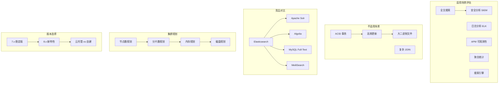

# ES 选型指南

## 概述
本模块面向技术选型决策，系统梳理 Elasticsearch 的适用场景与边界、与同类产品的横向对比、集群规模规划方法、版本选择策略以及云服务选型决策，帮助你在不同业务场景下做出正确的技术选型判断。

---

## 一、知识图谱



---

## 二、基础到进阶学习路线

- **阶段一：基础入门**：了解 ES 的核心能力边界，知道什么时候该用 ES，什么时候不该用。
- **阶段二：原理深入**：理解 ES 与其他搜索引擎的架构差异，掌握集群规模规划的方法论。
- **阶段三：实战选型**：根据具体业务场景，结合团队能力、预算、运维能力，做出最优决策。

---

## 三、核心知识详解

### 3.1 ES 适用场景

| 场景 | 典型应用 | 核心优势 | 案例 |
|------|----------|----------|------|
| 全文搜索 | 电商搜索、站内搜索、文档检索 | 倒排索引 + 分词 + 相关性评分 | 京东商品搜索、GitHub 代码搜索 |
| 日志分析（ELK） | 应用日志、服务器日志、审计日志 | 横向扩展 + 时序索引 + 聚合分析 | 运维监控、故障排查 |
| APM 可观测性 | 链路追踪、性能监控、基础设施监控 | Elastic APM + Kibana 可视化 | 微服务架构的可观测性 |
| 聚合统计 | 用户行为分析、业务报表、漏斗分析 | Bucket + Metrics + Pipeline 聚合 | 用户画像、BI 报表 |
| 搜索引擎（站内） | 知识库搜索、文档搜索、内容搜索 | 全文检索 + 高亮 + 分面搜索 | Confluence、WordPress 搜索 |
| 安全分析（SIEM） | 威胁检测、安全事件分析、异常检测 | 实时索引 + ML 异常检测 | Elastic Security、SIEM |

**ES 的核心能力矩阵：**

```
                  高频写入
                     │
                     ▼
       ┌─────────────────────────────┐
       │        ES 核心优势区         │
       │  全文搜索 + 聚合分析 + 时序   │
       │  适用：日志、搜索、APM、报表  │
       └─────────────────────────────┘
                     │
         ┌───────────┴───────────┐
         ▼                       ▼
   低频查询                  高频查询
         │                       │
         ▼                       ▼
   对象存储/归档              传统数据库
```

### 3.2 ES 不适用场景

| 场景 | 为什么不适合 | 替代方案 |
|------|-------------|----------|
| ACID 事务（订单扣库存、账户转账） | ES 不支持跨文档事务，写入不是即时的（refresh 延迟） | MySQL、PostgreSQL、TiDB |
| 高频更新（如每秒更新计数器） | ES 的更新 = 删除 + 新增，代价高，且会产生大量 Segment 碎片 | Redis、MongoDB |
| 存储超大二进制文件（图片、视频、PDF） | 倒排索引不适合存储 Blob，Base64 编码会严重拖慢索引 | 对象存储（MinIO、S3）+ ES 存元数据 |
| 复杂 JOIN 查询 | ES 不支持跨索引 JOIN，Nested/Object 有性能和嵌套限制 | PostgreSQL、ClickHouse |
| 主键精确查找（Key-Value 场景） | 倒排索引的 KV 查找不如真正的 KV 引擎高效 | Redis、RocksDB |
| 一致性要求极高的数据 | ES 是最终一致性（副本异步同步），不是强一致性 | etcd、ZooKeeper、Consul |

::: danger 选型警示
最常见的错误：把 ES 当数据库用。ES 是搜索引擎，不是关系型数据库。它没有事务，没有 JOIN，没有约束。如果业务需要这些，请用数据库；如果业务需要搜索，请用 ES。两者可以配合使用（数据库做存储，ES 做搜索索引）。
:::

### 3.3 ES vs Solr vs Algolia vs 其他 对比

#### 核心竞品对比

| 维度 | Elasticsearch | Apache Solr | Algolia | MeiliSearch | MySQL Full-Text |
|------|--------------|-------------|---------|-------------|-----------------|
| **类型** | 自建搜索引擎 | 自建搜索引擎 | SaaS 搜索服务 | 自建搜索引擎 | 数据库内置 |
| **底层** | Lucene | Lucene | 自研引擎 | 自研引擎 | InnoDB |
| **分布式** | 天然内置 | 依赖 ZooKeeper | 托管（无需运维） | 内置 | 单机 |
| **中文分词** | IK/HanLP 插件 | 自带 SmartChinese | 内置多语言 | 插件支持 | 不支持 |
| **实时性** | 近实时（1s） | 近实时（soft commit） | 实时 | 实时 | 实时 |
| **聚合分析** | 强大（三级聚合） | Facet + JSON Facet | 基础 Facet | 基础聚合 | 无 |
| **运维成本** | 高（需要专业团队） | 中-高 | 无（全托管） | 低 | 中 |
| **定价** | 免费（开源） | 免费（开源） | 按请求数计费（贵） | 免费（开源） | 免费（数据库自带） |
| **社区生态** | 极活跃，ELK 生态 | 较传统 | 商业支持好 | 新兴社区 | 数据库生态 |
| **适用规模** | 任意规模 | 中小规模 | 不限（弹性） | 中小规模 | 小规模 |

#### 详细分析

**Elasticsearch vs Solr：**

| 选 ES 的理由 | 选 Solr 的理由 |
|-------------|---------------|
| 需要分布式集群（天然支持） | 已有 ZooKeeper 基础设施 |
| 需要 ELK 生态（Logstash + Kibana） | 需要 XML/SolrJ 接口 |
| 需要强大的聚合分析 | 团队已有 Solr 经验 |
| 社区活跃，文档丰富 | 企业级搜索（传统 IT 环境） |
| Kubernetes 云原生部署 | 需要 SolrCloud 的特定功能 |

**Elasticsearch vs Algolia：**

| 选 ES 的理由 | 选 Algolia 的理由 |
|-------------|-----------------|
| 团队有运维能力 | 不想运维搜索引擎 |
| 数据量大，需要控制成本 | 搜索量小，按请求计费划算 |
| 需要日志分析、APM 等附加功能 | 只做站内搜索，追求极致体验 |
| 数据敏感，不能上云 | 接受 SaaS 服务 |
| 预算有限（开源免费） | 预算充足，愿意为体验付费 |

**Elasticsearch vs MeiliSearch：**

| 选 ES 的理由 | 选 MeiliSearch 的理由 |
|-------------|---------------------|
| 大规模数据（TB 级以上） | 中小规模数据（GB 级） |
| 需要复杂聚合分析 | 只需简单搜索 |
| 需要日志分析、时序数据 | 只需要站内搜索 |
| 生产环境需要高可用 | 开发/测试环境快速验证 |

### 3.4 集群规模规划

#### 节点数规划

| 数据量 | 节点数（Data） | Master 节点 | 总节点数 | 说明 |
|--------|---------------|-------------|----------|------|
| < 100GB | 1-3 | 3 | 3-5 | 小型集群，Master 和 Data 可混合 |
| 100GB-1TB | 3-6 | 3 | 6-10 | 中型集群，建议分离 Master 和 Data |
| 1TB-10TB | 6-12 | 3 | 10-18 | 大型集群，必须分离，考虑冷热分层 |
| 10TB-50TB | 12-30 | 3-5 | 20-40 | 大型集群，冷热分离 + ILM 自动化 |
| > 50TB | 30+ | 5 | 40+ | 超大规模，需要专业运维团队 |

#### 分片数规划

```
总数据量 / 节点数 / 单分片目标大小 = 建议分片数

示例：
- 1TB 数据，5 个 Data 节点，单分片目标 30GB
- 分片数 = 1TB / 30GB ≈ 34 个主分片
- 每个节点约 7 个分片（合理范围）
```

#### 内存规划

| 参数 | 建议值 | 说明 |
|------|--------|------|
| JVM 堆大小 | 不超过 31GB（建议 50% 物理内存，最多 31GB） | 超过 31GB 禁用压缩指针，内存浪费 |
| OS Cache | 剩余 50% 物理内存用于 OS 文件缓存 | Lucene 严重依赖文件缓存 |
| 物理内存 | 建议 64GB 起（Data 节点） | 32GB 给 JVM，32GB 给 OS Cache |
| Master 节点内存 | 8-16GB 足够 | Master 不存储数据，轻量 |
| 磁盘缓存 | 使用 SSD，避免 IO 瓶颈 | HDD 只适合 Cold 节点 |

#### 磁盘规划

| 数据层级 | 磁盘类型 | 容量规划 | 说明 |
|----------|----------|----------|------|
| Hot | NVMe SSD / SATA SSD | 原始数据 × 1.3（副本 + 开销） | 高 IOPS，低延迟 |
| Warm | SATA SSD | 原始数据 × 1.1 | 均衡性能 |
| Cold | HDD（7200RPM） | 原始数据 × 1.05 | 大容量，低成本 |
| Frozen | 对象存储（S3/MinIO） | 按需 | 极低成本 |

### 3.5 ES 版本选择

#### 7.x vs 8.x

| 维度 | 7.x（7.17 LTS） | 8.x（8.x Latest） |
|------|-----------------|-------------------|
| **稳定性** | 成熟稳定，生产验证 | 较新，持续迭代 |
| **安全默认** | 需手动配置 X-Pack | 自动开启 TLS + 密码 |
| **向量搜索** | 插件支持 | 原生 kNN 向量搜索 |
| **时序数据** | Data Stream（7.9+） | TSDS 时序数据流 + Downsampling |
| **角色粒度** | data, master, ingest | 细分 data_hot/warm/cold/frozen |
| **Type 支持** | 单 Type（_doc） | 完全移除 Type |
| **Java 客户端** | High Level REST Client | Java API Client |
| **NLP 模型** | 有限 | 支持 PyTorch 模型 |
| **推荐场景** | 生产环境保守选择 | 新项目，需向量搜索/时序优化 |

::: tip 版本选择建议
- **新项目**：直接上 8.x 最新版，享受向量搜索、时序优化等新特性
- **已有 7.x 集群**：如果稳定运行，不需要急于升级；等 8.x 更成熟后再考虑
- **保守策略**：等待 8.x 的 LTS（长期支持）版本发布
- **关键业务**：优先选择 7.17 LTS（有长期支持，安全补丁持续更新）
:::

#### 8.x 关键新特性

| 特性 | 说明 | 价值 |
|------|------|------|
| 安全默认开启 | 启动时自动配置 TLS 和密码 | 减少安全配置遗漏 |
| kNN 向量搜索 | 原生支持向量相似性检索 | 语义搜索、推荐系统、RAG |
| TSDS 时序数据流 | 专门为时间序列设计的索引类型 | 监控、IoT 数据更高效 |
| Downsampling | 自动降采样减少存储 | 时序数据存储成本降低 50%+ |
| 合成 `_source` | 按需重建 _source，减少存储 | 适合日志等大字段场景 |
| `match_only_text` | 不存储位置信息，节省空间 | 日志全文搜索 |
| PyTorch 模型 | 内置 NLP 模型推理 | 文本分类、命名实体识别 |

### 3.6 云托管选择

| 服务 | 提供商 | 优点 | 缺点 | 适用场景 |
|------|--------|------|------|----------|
| Elastic Cloud | Elastic 官方 | 功能最全，版本最新，官方支持 | 价格较高，国内访问慢 | 海外业务，需要最新功能 |
| 阿里云 ES | 阿里云 | 国内访问快，阿里云生态集成 | 版本滞后，定制功能受限 | 国内业务，阿里云用户 |
| 腾讯云 ES | 腾讯云 | 国内访问快，腾讯云生态集成 | 服务稳定性需关注 | 国内业务，腾讯云用户 |
| 自建 ES | 自建 | 完全控制，成本可控 | 需要专业运维团队 | 数据敏感，有运维能力 |

**自建 vs 云托管决策：**

```
选择自建 ES 的理由：
├── 数据安全要求极高（不能出内网）
├── 有专业 ES 运维团队
├── 数据量极大（云托管成本高）
├── 需要深度定制（插件、内核修改）
└── 预算有限（开源免费）

选择云托管 ES 的理由：
├── 不想运维搜索引擎
├── 团队没有 ES 专家
├── 需要弹性伸缩（按需扩容）
├── 需要 SLA 保障（99.95% 可用性）
└── 需要快速上线（开箱即用）
```

---

## 四、经典应用场景与解决方案

### 场景：创业公司技术选型 - 搜索方案决策

**问题背景**
某创业公司正在搭建电商平台，需要在以下三种方案中选择搜索引擎：

- 方案 A：Elasticsearch 自建
- 方案 B：Algolia SaaS 服务
- 方案 C：MySQL 自带 Full-Text 搜索

团队有 5 名后端工程师，但没有专业的搜索引擎运维经验。日均搜索量预估 5000 次，商品数量约 10 万。

**完整决策方案**

**关键决策因素分析：**

| 因素 | 方案 A：ES | 方案 B：Algolia | 方案 C：MySQL |
|------|-----------|----------------|---------------|
| 搜索质量 | 高（中文分词+相关性） | 极高（typo容错+同义词+排名） | 低（无中文分词） |
| 开发成本 | 中（需要学习 ES DSL） | 低（REST API + SDK） | 低（SQL 熟悉） |
| 运维成本 | 高（需要运维 ES 集群） | 无（全托管） | 中（MySQL 运维） |
| 每月费用 | 约 2000 元（2 台云服务器） | 约 5000-10000 元（按请求数） | 0（已有 MySQL） |
| 扩展性 | 优秀（水平扩展） | 无限（弹性） | 差（单机限制） |
| 学习曲线 | 陡峭 | 平缓 | 平缓 |

**决策流程：**

```
1. 搜索质量要求？
   ├── 高 → 排除 MySQL（无中文分词，搜索质量差）
   └── 低 → 可以考虑 MySQL

2. 团队有运维能力吗？
   ├── 有 → ES 自建（成本低，可控）
   └── 无 → 云托管或 Algolia

3. 预算充足吗？
   ├── 充足 → Algolia（体验最好，开发最快）
   └── 紧张 → ES 自建（成本可控）

4. 数据量预期？
   ├── < 50 万 → Algolia 或 ES 都可以
   ├── 50 万 - 1000 万 → ES 自建（Algolia 成本上升）
   └── > 1000 万 → ES 自建（Algolia 成本过高）
```

**推荐方案：Elasticsearch 自建（方案 A）**

理由：
- 10 万商品量级，ES 完全胜任
- 日均 5000 次搜索，非常轻量
- 2 台服务器即可起步（1 主 1 从，约 2000 元/月）
- 5 人团队，可以安排 1 人学习 ES 运维
- 未来数据量增长，ES 可以水平扩展
- 开源免费，没有供应商锁定风险

**实施步骤：**
1. 使用 MySQL 做主存储，ES 做搜索索引（双写或 CDC 同步）
2. 初期使用 Docker Compose 部署单节点 ES（快速验证）
3. 验证通过后升级到 3 节点集群（生产环境）
4. 配置 IK 中文分词器 + 自定义词典
5. 编写搜索服务封装 ES 查询

---

## 五、高频面试题

### Q1: 什么时候选 Elasticsearch？什么时候不选？

::: details 答案
**选 Elasticsearch 的场景：**

1. **全文搜索**：需要中文分词、相关性评分、高亮、模糊匹配等全文搜索能力，ES 是业界标准。
2. **日志分析（ELK Stack）**：需要集中收集、存储、分析海量日志，ES + Logstash + Kibana 是成熟方案。
3. **APM 可观测性**：需要链路追踪、性能监控、基础设施监控，ES 有完整的 Elastic APM 生态。
4. **聚合分析**：需要多维度的分组统计、时序分析、漏斗分析，ES 的聚合框架非常强大。
5. **时序数据**：需要存储和查询带时间戳的数据（监控指标、IoT 传感器、用户行为），ES 8.x 有专门的 TSDS。

**不选 Elasticsearch 的场景：**

1. **需要 ACID 事务**：ES 不支持跨文档事务，订单、支付、库存等场景必须用关系型数据库。
2. **高频更新**：ES 的更新 = 删除 + 新增，代价高且会产生碎片。计数器、实时状态等场景用 Redis。
3. **存储大文件**：图片、视频、PDF 等二进制文件不适合 ES，应该用对象存储 + ES 存元数据。
4. **复杂 JOIN**：ES 不支持跨索引 JOIN，需要多表关联查询的场景用关系型数据库。
5. **纯 Key-Value 查询**：ES 的倒排索引在 KV 查询上不如 Redis/RocksDB 高效。
6. **强一致性要求**：ES 是最终一致性，不适合需要强一致性的场景（如分布式锁、配置中心）。

**核心判断原则：** ES 是搜索引擎，不是数据库。需要搜索 → 用 ES；需要事务 → 用数据库；两者可以配合使用。
:::

### Q2: Elasticsearch 和 Solr 怎么选？

::: details 答案
ES 和 Solr 都是基于 Lucene 的搜索引擎，但设计理念和生态有显著差异。

**选择 Elasticsearch 的理由：**

1. **分布式原生**：ES 的分布式集群内置于核心，不需要额外依赖（Solr 依赖 ZooKeeper），配置和运维更简单。
2. **ELK 生态**：ES + Logstash + Kibana 形成完整的数据采集、存储、分析、可视化链路，Solr 没有同等生态。
3. **聚合能力**：ES 的 Bucket + Metrics + Pipeline 三级聚合体系比 Solr 的 Facet 更灵活强大。
4. **社区活跃度**：ES 的 GitHub Star 数、提交频率、插件数量、文档质量都远超 Solr。
5. **云原生**：ES 在 Kubernetes 上的部署和运维更成熟（ECk Operator），Solr 的云原生支持较弱。
6. **实时分析**：ES 的聚合分析、时序数据处理能力在日志分析、APM 场景中表现更好。

**选择 Solr 的理由：**

1. **已有 ZooKeeper 基础设施**：如果团队已经维护 ZooKeeper 集群，Solr 的运维成本降低。
2. **XML/SolrJ 接口**：一些传统企业系统使用 SolrJ 进行集成，迁移成本高。
3. **团队经验**：如果团队有 Solr 深度使用经验，继续使用 Solr 比学习 ES 更高效。
4. **企业搜索**：Solr 在传统企业内网搜索（文档管理、知识库）场景中有较多成熟案例。

**现实趋势：** 近年来 ES 市场份额持续增长，Solr 逐渐萎缩。除非有特殊理由，新项目一般推荐 ES。
:::

### Q3: 集群规模怎么规划？节点数、分片数、内存怎么定？

::: details 答案
集群规模规划需要综合考虑数据量、性能要求、可用性要求和预算。

**节点数规划：**

| 数据量 | 建议 Data 节点数 | 说明 |
|--------|-----------------|------|
| < 100GB | 1-3 | 小规模，Master 和 Data 可混合 |
| 100GB-1TB | 3-6 | 中等规模，建议 Master 分离 |
| 1TB-10TB | 6-12 | 大集群，建议冷热分层 |
| 10TB-50TB | 12-30 | 大规模，需要 ILM 自动化 |
| > 50TB | 30+ | 超大规模，需要专业团队 |

Master 节点：至少 3 个（奇数），轻量级，不存储数据。

**分片数规划：**
- 单分片大小：建议 10-50GB（搜索类偏小，日志类可偏大）
- 分片数 = 总数据量 / 单分片目标大小
- 每个 Data 节点分片数不超过 20-30 个
- 主分片数创建后不可修改，需要预留增长空间

**内存规划：**
- JVM 堆：不超过 31GB（建议物理内存的 50%，最多 31GB）
- 原因：超过 31GB 后 JVM 禁用压缩指针（Compressed OOP），内存浪费 30-40%
- OS Cache：剩余 50% 物理内存用于 Lucene 文件缓存
- Data 节点建议 64GB 物理内存起（32GB 堆 + 32GB OS Cache）
- Master 节点 8-16GB 足够

**磁盘规划：**
- Hot 数据：NVMe SSD 或 SATA SSD（高 IOPS）
- Warm 数据：SATA SSD
- Cold 数据：HDD 7200RPM
- 容量规划：原始数据 × 1.3（副本 + 索引开销 + 预留空间）

**经验公式：**
```
总存储需求 = 原始数据量 × (1 + 副本数) × 1.15（预留空间）
每节点磁盘 = 总存储需求 / Data节点数
```

**示例：**
- 业务：日志分析，每天 100GB，保留 30 天
- 原始数据：3TB
- 架构：Hot(7天) + Warm(23天) + Cold(30天+)
- Hot 节点：3 个 × 64GB × 2TB SSD
- Warm 节点：3 个 × 32GB × 4TB SATA SSD
- Cold 节点：2 个 × 16GB × 8TB HDD
- Master 节点：3 个 × 16GB
- 总分片数：Hot 每个索引 3-5 分片 × 1 副本
:::

### Q4: Elasticsearch 8.x 有哪些新特性？值得升级吗？

::: details 答案
ES 8.x 相比 7.x 有多个重要新特性：

**1. 安全默认开启**
- 8.x 启动时自动配置 TLS 和密码，不需要手动配置 X-Pack Security
- 减少了安全配置遗漏的风险
- 开发环境可以通过 `DISABLE_SECURITY=true` 禁用

**2. 原生 kNN 向量搜索**
- 支持向量相似性检索（K-Nearest Neighbor）
- 适用于语义搜索、推荐系统、RAG（检索增强生成）
- 支持 HNSW 算法，搜索性能好
- 这是 8.x 最大的差异化特性

**3. TSDS 时序数据流**
- 专门为时间序列数据设计的索引类型
- 支持自动降采样（Downsampling），减少存储成本
- 适合监控指标、IoT 传感器数据

**4. 角色细化**
- Data 角色细分为 `data_hot`、`data_warm`、`data_cold`、`data_frozen`
- 原生支持更精细的冷热分层架构

**5. NLP 模型集成**
- 支持加载 PyTorch NLP 模型进行推理
- 内置命名实体识别、文本分类等功能

**6. 存储优化**
- `match_only_text` 字段类型：不存储位置信息，适合日志全文搜索
- 合成 `_source`：按需重建 _source，减少存储

**7. 移除 Type**
- 完全移除 `_type` 概念，API 更简洁

**是否值得升级的判断：**

| 场景 | 建议 |
|------|------|
| 需要向量搜索（语义搜索/RAG） | 强烈推荐升级 8.x |
| 时序数据量大，需要存储优化 | 推荐升级 8.x |
| 7.x 集群稳定运行，无特殊需求 | 可以等待 8.x 更成熟 |
| 新项目启动 | 直接上 8.x 最新版 |
| 安全合规要求 | 8.x 的默认安全更省心 |

**升级注意事项：**
- 7.x 到 8.x 的升级需要先升级到 7.17，再升级到 8.x
- 检查插件兼容性（部分 7.x 插件不兼容 8.x）
- Type 移除可能导致旧代码报错
- High Level REST Client 替换为 Java API Client
:::

### Q5: 什么时候不适合用 Elasticsearch？

::: details 答案
ES 虽然强大，但并非万能。以下场景不适合使用 ES：

**1. 需要 ACID 事务**
- ES 不支持跨文档的原子操作
- 订单扣库存、账户转账等场景必须用关系型数据库
- 替代方案：MySQL、PostgreSQL、TiDB

**2. 高频更新**
- ES 的更新操作本质是删除旧文档 + 插入新文档
- 频繁更新会产生大量 Segment 碎片，触发频繁 Merge，严重影响性能
- 替代方案：Redis（计数器、会话）、MongoDB（文档更新）

**3. 存储大二进制文件**
- 图片、视频、PDF 等二进制内容不适合存储在 ES 中
- Base64 编码会使索引体积暴增，拖慢搜索
- 替代方案：对象存储（MinIO、S3）+ ES 存元数据

**4. 复杂 JOIN 查询**
- ES 不支持跨索引的 JOIN 操作
- Nested 和 Parent-Child 有性能限制和嵌套深度限制
- 替代方案：PostgreSQL、ClickHouse（宽表）、Doris/StarRocks

**5. 纯 Key-Value 查询**
- 虽然 ES 可以按 ID 查找文档，但倒排索引的 KV 查找不如专门的 KV 引擎高效
- 替代方案：Redis、RocksDB、LevelDB

**6. 强一致性要求**
- ES 是最终一致性（副本异步同步），可能存在短暂的数据不一致
- 分布式锁、配置中心、选举等场景需要强一致性
- 替代方案：etcd、ZooKeeper、Consul

**7. 团队没有运维能力**
- ES 的生产运维需要专业知识（分片、集群、JVM、GC）
- 如果团队没有 ES 运维经验，建议使用云托管服务

**核心原则：ES 是专业的搜索引擎，不是通用数据库。需要搜索用 ES，需要事务用数据库，两者可以配合使用（数据库做主存储，ES 做搜索索引）。**
:::

### Q6: 自建 ES 还是用云托管？各有什么优劣？

::: details 答案
自建 ES 和云托管 ES 各有优劣，需要根据团队能力、业务需求、预算综合决策。

**自建 ES 的优势：**

1. **完全控制**：可以自由选择版本、插件、配置，不受云厂商限制
2. **成本可控**：数据量越大，自建的成本优势越明显
3. **数据安全**：数据不出内网，适合金融、政府等合规要求高的场景
4. **深度定制**：可以修改配置、安装自定义插件、调整 JVM 参数
5. **无供应商锁定**：不会绑定特定云厂商

**自建 ES 的劣势：**
- 需要专业运维团队（ES 集群管理、JVM 调优、故障恢复）
- 需要自己处理备份、监控、安全
- 需要自己规划硬件和扩容

**云托管 ES 的优势：**

1. **零运维**：开箱即用，不需要运维 ES 集群
2. **弹性伸缩**：按需扩容，不需要提前规划硬件
3. **SLA 保障**：云厂商提供可用性保证（如 99.95%）
4. **快速上线**：几分钟创建集群，快速验证
5. **集成生态**：与云厂商的其他服务（监控、日志、告警）集成

**云托管 ES 的劣势：**
- 成本较高（特别是数据量大时）
- 版本滞后（云厂商通常落后 1-2 个版本）
- 定制能力有限（不能安装所有插件，不能修改内核参数）
- 供应商锁定风险
- 数据出境风险（海外云厂商）

**决策建议：**

| 场景 | 推荐方案 |
|------|----------|
| 创业公司，无运维团队 | 云托管（快速上线） |
| 中大型企业，有运维团队 | 自建（成本可控） |
| 数据敏感，合规要求高 | 自建（数据不出内网） |
| 海量数据（> 10TB） | 自建（云托管成本高） |
| 临时测试/验证 | 云托管（快速创建销毁） |
| 需要最新功能（向量搜索等） | 自建（云托管版本滞后） |
| 需要 SLA 保障 | 云托管（有专业运维） |

**混合方案：** 核心业务自建 ES，日志分析使用云托管 ES，也是一种常见策略。
:::

---

## 六、选型指南

- **适用场景**：全文搜索、日志分析（ELK）、APM 可观测性、时序数据分析、聚合统计、安全分析（SIEM）。
- **不适用场景**：ACID 事务、高频更新、存储大文件、复杂 JOIN、纯 KV 查询、强一致性要求。
- **配置建议**：
  - 小规模（< 100GB）：2-3 节点，ES 可以混合 Master 和 Data
  - 中规模（100GB-1TB）：5-8 节点，Master 分离，2 副本
  - 大规模（> 1TB）：冷热分离 + ILM 自动化，专业运维团队
  - 版本选择：新项目直接 8.x，存量项目稳定在 7.17 LTS
  - 云服务：国内优先阿里云/腾讯云 ES，海外考虑 Elastic Cloud

---

## 相关文档

- [ES 核心概念与架构](./index)
- [倒排索引与分词](./inverted-index)
- [查询与聚合](./dsl-query)
- [集群架构](./cluster)
- [性能优化](./performance)
- [返回数据库目录](../index)