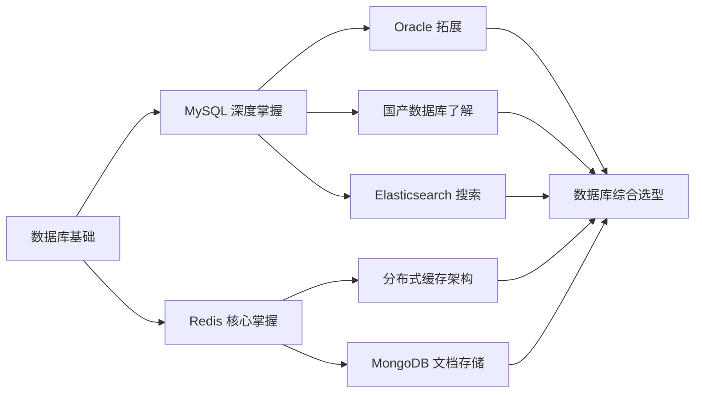

# 数据库

## 模块概述

数据库模块是后端开发者的必修课，覆盖 **关系型数据库（MySQL、Oracle、国产数据库）**、**缓存数据库（Redis）**、**搜索引擎（Elasticsearch）** 以及 **文档数据库（MongoDB）**。数据库知识的考察贯穿面试全程——从基础 SQL 能力到架构设计题，几乎每轮都会涉及。

::: tip 学习目标
从 CRUD 工程师进阶为能分析慢查询、设计高性能表结构、解决缓存一致性问题的专业开发者，并具备数据库选型决策能力。
:::

::: info 关注层次
应用层（SQL 优化 / 缓存设计） → 架构层（主从复制 / 分库分表 / 集群） → 原理层（索引结构 / 存储引擎 / 分布式协议）
:::

## 六大板块概览

| 板块 | 类型 | 核心能力 | 面试权重 |
|------|------|----------|----------|
| [MySQL](./mysql/) | 关系型数据库 | 索引优化、SQL 调优、事务与锁、分库分表 | ⭐⭐⭐⭐⭐ |
| [Oracle](./oracle/) | 关系型数据库 | 架构理解、CBO 优化器、RMAN 备份恢复、AWR 调优 | ⭐⭐⭐ |
| [国产数据库](./domestic/) | 关系型/分布式 | OceanBase、TiDB、openGauss、达梦 DM8 架构与选型 | ⭐⭐⭐ |
| [Redis](./redis/) | 缓存数据库 | 数据结构底层、缓存策略、分布式锁、集群方案 | ⭐⭐⭐⭐⭐ |
| [Elasticsearch](./elasticsearch/) | 搜索引擎 | 倒排索引、DSL 查询、集群架构、性能优化 | ⭐⭐⭐ |
| [MongoDB](./mongodb/) | 文档数据库 | 文档模型设计、副本集与分片、事务支持 | ⭐⭐ |

## 数据库选型速查

```
┌─────────────────────────────────────────────────────────────────┐
│                    数据库选型决策矩阵                              │
├──────────────┬────────────┬──────────┬──────────┬───────────────┤
│   场景        │ 首选方案    │ 备选方案  │ 缓存层   │ 搜索层        │
├──────────────┼────────────┼──────────┼──────────┼───────────────┤
│ 电商交易系统  │ MySQL      │ TiDB     │ Redis    │ ES (商品搜索)  │
│ 金融核心系统  │ Oracle     │ OceanBase│ Redis    │ -             │
│ 内容管理 CMS  │ MongoDB    │ MySQL    │ Redis    │ ES (全文搜索)  │
│ 日志分析平台  │ -          │ -        │ -        │ ES + Kibana   │
│ 信创国产替代  │ 达梦/openGauss│ TiDB  │ Redis    │ ES            │
│ 实时排行榜    │ Redis      │ -        │ Redis    │ -             │
│ 物联网时序数据│ MongoDB    │ TDengine │ Redis    │ -             │
│ 高并发缓存    │ Redis      │ -        │ Redis    │ -             │
└──────────────┴────────────┴──────────┴──────────┴───────────────┘
```

## 学习路径总览



## 面试重点

::: warning 高频考点
1. **MySQL 索引优化**：给出慢 SQL，分析 EXPLAIN 结果，给出优化方案
2. **事务隔离级别**：每个级别解决的问题（脏读/不可重复读/幻读），MVCC 如何实现 RC 和 RR
3. **缓存三兄弟**：穿透/击穿/雪崩各自的场景和解决方案，布隆过滤器原理
4. **分布式锁**：Redis 实现分布式锁的演进过程（单机 → RedLock → Redisson），生产环境注意事项
5. **redo log 与 binlog 区别**：两阶段提交为什么需要？崩溃恢复流程是怎样的？
6. **分库分表后如何查询**：跨库 Join 解决方案、全局唯一 ID 生成方案（雪花算法）
7. **数据库选型**：为什么选 MySQL 而不是 Oracle？什么时候用 MongoDB？
8. **ES 倒排索引**：为什么 ES 搜索比 MySQL LIKE 快？深分页怎么解决？
:::

::: danger 容易翻车的点
- 索引只背最左前缀法则，换个查询场景就无法分析
- Redis 五大数据结构会用但不知道底层编码，被问 ZSet 为什么用跳表答不上来
- MVCC 和锁的关系混淆，不理解快照读为什么不需要加锁
- 分布式锁只停留在 SET NX EX，不知道 Redisson 的续期机制
- 只会用 MySQL，面对"为什么不用 Oracle/MongoDB/ES"的问题无法回答
:::

## 学习建议

### 阶段一：MySQL 原理与优化（3 周）
1. 搭建测试环境，用存储过程造百万级数据，实际执行 EXPLAIN 分析
2. 画出 B+Tree 的页结构，手动演示插入和查找过程
3. 用两个 Session 复现各种锁场景（间隙锁在 RR 下的表现）
4. 阅读 InnoDB 关键源码（Buffer Pool、B+Tree 索引）

### 阶段二：Redis 深度掌握（2 周）
5. 手动用 Redis 实现延迟队列、排行榜、分布式 Session
6. 搭建 Redis Cluster 环境，演练节点扩容和数据迁移
7. 阅读 skiplist 源码，理解跳表的插入与查找算法

### 阶段三：Elasticsearch 入门（1 周）
8. 搭建 ES 集群，用 Logstash 同步 MySQL 数据，实现搜索功能
9. 使用 Kibana 进行查询调试与分析

### 阶段四：综合实战（1 周）
10. 设计一个高并发秒杀场景的数据库与缓存方案，画出时序图

### 阶段五：拓展与选型（1 周）
11. 了解 Oracle 核心架构与国产数据库生态
12. 掌握 MongoDB 文档模型设计方法论
13. 建立数据库选型决策框架

::: details 推荐书单
- 《高性能 MySQL（第4版）》—— Silvia Botros
- 《MySQL 技术内幕：InnoDB 存储引擎（第2版）》—— 姜承尧
- 《Redis 设计与实现》—— 黄健宏
- 《Redis 开发与运维》—— 付磊
- 《Elasticsearch 权威指南》
- 《MongoDB 权威指南（第3版）》
- 《Oracle Database 12c 完全参考手册》
:::