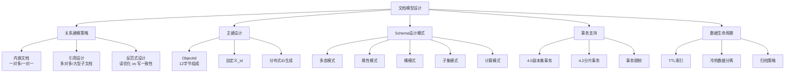

# 文档模型设计

## 概述
文档模型设计是 MongoDB 使用中最关键的一环，直接决定了查询性能和系统可维护性。本模块系统讲解内嵌与引用的选择策略、常见的 Schema 设计模式、ObjectId 内部结构，以及 MongoDB 事务的演进历史，帮助读者掌握从需求到数据模型的完整设计方法。

---

## 一、知识图谱



---

## 二、基础到进阶学习路线
- 阶段一：基础入门：理解内嵌和引用的基本区别，能根据业务关系选择合适策略
- 阶段二：原理深入：掌握 ObjectId 组成原理，理解反范式设计的 trade-off，熟悉各个设计模式
- 阶段三：实战优化：能在真实业务场景中综合运用多种设计模式，处理事务边界和数据生命周期

---

## 三、核心知识详解

### 1. 内嵌文档设计

内嵌文档（Embedding）是将相关子数据直接嵌套在父文档中，适用于 **一对少** 或 **数据紧密关联且一起查询** 的场景。

```javascript
// 一对一内嵌：用户地址信息
db.users.insertOne({
  _id: ObjectId(),
  name: "张三",
  email: "zhangsan@example.com",
  address: {         // 地址与用户一对一
    city: "上海",
    district: "浦东新区",
    detail: "张江路100号"
  }
})

// 一对少内嵌：文章评论（评论量可控）
db.articles.insertOne({
  _id: ObjectId(),
  title: "文档模型设计",
  comments: [        // 评论控制在几十条以内
    { user: "李四", content: "写得好", createdAt: ISODate() },
    { user: "王五", content: "学习了", createdAt: ISODate() }
  ]
})
```

::: tip 内嵌设计的适用判断
- 子数据是否**总是**随父数据一起查询？
- 子数据数量是否**可控**（不会无限增长）？
- 子数据的变更是否和父数据有**相同的生命周期**？

三个问题都回答"是"，则优先考虑内嵌。
:::

### 2. 引用设计

引用（Referencing）是在文档中存储关联文档的标识符，通过 `$lookup` 或应用层二次查询组装数据。

```javascript
// 多对多引用：用户与角色
db.users.insertOne({
  _id: ObjectId(),
  name: "张三",
  roleIds: [ObjectId("...1"), ObjectId("...2")]  // 引用角色ID
})

db.roles.insertMany([
  { _id: ObjectId("...1"), name: "管理员", permissions: ["read", "write", "delete"] },
  { _id: ObjectId("...2"), name: "编辑", permissions: ["read", "write"] }
])

// 一对多引用：作者与书籍（书籍量大且独立查询）
db.authors.insertOne({
  _id: ObjectId(),
  name: "某知名作者"
})

db.books.insertMany([
  { _id: ObjectId(), title: "书A", authorId: ObjectId("...") },
  { _id: ObjectId(), title: "书B", authorId: ObjectId("...") }
])
```

::: warning 引用 vs 内嵌决策矩阵

| 维度 | 内嵌 | 引用 |
|------|------|------|
| 读性能 | 单次查询，无 JOIN 开销 | 需要 `$lookup` 或多次查询 |
| 写性能 | 更新父文档时写入更大 | 各自独立更新 |
| 数据一致性 | 天然一致（同一文档） | 需要事务或应用层保证 |
| 灵活性 | 结构耦合 | 各自独立演化 |
| 子数据上限 | 限制 16MB | 无限制（需防数组膨胀） |

:::

### 3. 反范式设计

反范式（Denormalization）是将经常需要一起读取的数据冗余存储在同一文档中。

::: tip 反范式设计的典型场景
**场景**：商品详情页需要展示商品基本信息和所属分类名称。

**范式化（引用）**：需要两次查询或 `$lookup`，增加延迟。

**反范式（冗余）**：在商品文档中直接冗余分类名称，一次查询搞定。
:::

```javascript
// 反范式设计：冗余分类名称
db.products.insertOne({
  _id: ObjectId(),
  name: "华为手机",
  categoryId: ObjectId("..."),
  categoryName: "智能手机"  // 冗余字段，避免 $lookup
})
```

::: danger 反范式的代价
- **写一致性挑战**：分类改名时需要更新所有关联商品文档
- **存储空间增加**：冗余数据占用额外存储
- **维护复杂度**：需要在应用层或通过 change stream 同步变更

**建议**：只有在读性能瓶颈明显且写频率相对于读频率很低时，才使用反范式。
:::

### 4. `_id` 主键与 ObjectId

MongoDB 默认的主键生成器是 **ObjectId**，12 字节组成：

```
┌──────────┬──────────┬──────────┬──────────┐
│ 时间戳   │ 机器ID   │ 进程ID   │ 计数器   │
│ 4字节    │ 5字节    │ 1字节  　│ 2字节    │
│ Unix秒   │ MAC+INFO │ PID随机  │ 递增序列 │
└──────────┴──────────┴──────────┴──────────┘
```

| 字段 | 大小 | 说明 |
|------|------|------|
| 时间戳 | 4 字节 | Unix 时间戳（秒级），可以提取创建时间 |
| 机器标识 | 5 字节 | 基于机器 MAC 地址和主机名哈希生成 |
| 进程 ID | 1 字节 | 当前 MongoDB 进程 PID 随机化 |
| 计数器 | 2 字节 | 随机起始值 + 递增，同秒内保证唯一 |

```javascript
// 从 ObjectId 提取创建时间（无需存储 createTime 字段）
const objectId = ObjectId("667a1b2c3d4e5f6a7b8c9d0e")
objectId.getTimestamp()  // => ISODate("2024-06-25T...")
```

### 5. Schema 设计模式

#### 5.1 多态模式（Polymorphic Pattern）

适合同一集合中存储多种类似但有差异的文档类型。

```javascript
// 不同的支付记录结构
db.payments.insertMany([
  { type: "credit_card", amount: 299, cardNo: "****1234", cvv: "***" },
  { type: "wechat", amount: 299, openid: "oABC123...", nonceStr: "xyz" },
  { type: "alipay", amount: 299, tradeNo: "20240625...", status: "SUCCESS" }
])

// 创建复合索引优化查询
db.payments.createIndex({ type: 1, amount: 1 })
```

#### 5.2 属性模式（Attribute Pattern）

适合具有大量可选或动态属性的文档（如 IoT 传感器数据）。

```javascript
// IoT设备上报的动态属性
db.sensor_readings.insertOne({
  deviceId: "DEV-001",
  timestamp: ISODate(),
  attributes: [
    { k: "temperature", v: 25.5, u: "celsius" },
    { k: "humidity", v: 68, u: "percent" },
    { k: "pressure", v: 1013, u: "hPa" }
  ]
})

// 查询特定属性：索引 attributes.k 和 attributes.v
db.sensor_readings.createIndex({ "attributes.k": 1, "attributes.v": 1 })
```

#### 5.3 桶模式（Bucket Pattern）

适合高频写入的时序数据，将一段时间的数据聚合为一个文档。

```javascript
// 按小时桶聚合温度读数
db.temp_buckets.insertOne({
  deviceId: "DEV-001",
  bucketHour: ISODate("2024-06-25T10:00:00Z"),  // 整点桶标识
  readings: [
    { t: ISODate("2024-06-25T10:01:00Z"), v: 25.1 },
    { t: ISODate("2024-06-25T10:01:30Z"), v: 25.2 }
    // ... 本小时的更多读数
  ],
  count: 120,       // 读数数量
  sum: 3024,        // 总和（方便聚合计算）
  min: 24.8,        // 预聚合：最小值
  max: 25.6         // 预聚合：最大值
})

// 创建桶索引
db.temp_buckets.createIndex({ deviceId: 1, bucketHour: 1 })
```

::: info 桶模式的优势
- 减少文档数量（从每秒1个文档到每小时1个文档）
- 减少索引量，降低内存占用
- 通过预聚合字段 `sum/min/max` 支持快速统计
:::

#### 5.4 子集模式（Subset Pattern）

将热点数据和冷数据分离，减少工作集大小。

```javascript
// 主文档：只存储热点数据
db.products.insertOne({
  _id: ObjectId(),
  name: "商品名",
  price: 299,
  stock: 100,
  rating: 4.5
})

// 详情文档：存储大字段和冷数据
db.product_details.insertOne({
  productId: ObjectId("..."),
  description: "超长的富文本描述...",
  specJson: { /* 大量规格参数 */ },
  historyPrices: [ /* 历史价格 */ ]
})
```

#### 5.5 计算模式（Computed Pattern）

存储预先计算好的聚合数据，避免实时计算开销。

```javascript
// 在父文档中直接存储评论区统计数据
db.articles.insertOne({
  _id: ObjectId(),
  title: "文章标题",
  commentStats: {
    totalCount: 128,
    lastCommentAt: ISODate("2024-06-25T15:00:00Z"),
    topUsers: [
      { user: "张三", count: 15 },
      { user: "李四", count: 12 }
    ] // 预计算的热门评论者
  }
})
```

### 6. 事务支持演进

| 版本 | 事务能力 | 说明 |
|------|---------|------|
| 所有版本 | 单文档原子性 | 更新单个文档时保证原子性 |
| 4.0 | 副本集多文档事务 | 同一副本集内的跨文档事务 |
| 4.2 | 分片集群分布式事务 | 跨分片的 ACID 事务 |
| 5.0+ | 事务性能优化 | 降低事务延迟，增加超时控制 |

```javascript
// 4.0+ 多文档事务示例
const session = client.startSession()
session.startTransaction()

try {
  const orders = session.client.db("shop").collection("orders")
  const inventory = session.client.db("shop").collection("inventory")

  await orders.insertOne({ item: "手机", qty: 1, status: "pending" })
  await inventory.updateOne(
    { item: "手机" },
    { $inc: { stock: -1 } }
  )

  await session.commitTransaction()
} catch (error) {
  await session.abortTransaction()
} finally {
  session.endSession()
}
```

### 7. 数据生命周期管理 - TTL 索引

```javascript
// 7天后自动删除日志
db.logs.createIndex({ createdAt: 1 }, { expireAfterSeconds: 604800 })

// TTL 索引要求：字段必须是 Date 类型
// 文档过期后 60 秒内被后台线程删除（非实时）
```

---

## 四、经典应用场景与解决方案

### 场景：电商商品库存扣减

**问题背景**：
电商系统的商品详情页需要展示商品信息、库存、最新评价、分类名称。如果用关系型数据库需要至少 4 张表的 join 查询，高并发场景下性能压力大。

**完整方案**：
采用反范式 + 子集模式结合：
1. 商品主文档存储热数据（名称、价格、库存、冗余的分类名、最新 3 条评价）
2. 商品详情文档存储冷数据（长描述、规格参数、历史价格、全部评价）
3. 库存扣减利用单文档原子性保证安全

**代码示例**：

```javascript
// 商品主文档（热点数据）
db.products.insertOne({
  _id: ObjectId(),
  name: "iPhone 16",
  price: 6999,
  stock: 500,           // 单文档原子更新
  categoryName: "手机",  // 反范式：冗余分类名
  latestReviews: [       // 子集：仅最新3条评价
    { user: "张三", rating: 5, content: "很好用", date: ISODate() }
  ],
  reviewStats: {         // 计算模式：预聚合评分
    avgRating: 4.8,
    totalCount: 2340
  }
})

// 库存扣减 - 单文档原子操作保证线程安全
const result = db.products.findOneAndUpdate(
  { _id: productId, stock: { $gte: 1 } },  // 关键：检查库存条件
  { $inc: { stock: -1 } },
  { returnDocument: "after" }
)

if (!result) {
  throw new Error("库存不足")
}
```

---

## 五、高频面试题

### Q1: 内嵌和引用怎么选择？

::: details 答案
判断内嵌还是引用，需要同时考虑**数据关系**和**读写模式**：

**优先使用内嵌的情况**：
1. 一对少（子数据数量可控，不会无限增长）：如收货地址、订单项
2. 数据总是一起查询：如文章和标签、用户和偏好设置
3. 子数据独立查询意义不大：如评论的点赞列表

**优先使用引用的情况**：
1. 一对多（子数据可能无限增长）：如帖子和评论
2. 多对多关系：如用户和角色、学生和课程
3. 子数据需要独立查询和分页：如需要单独检索评论
4. 子文档大小不可控：如文章内容可能超过 16MB

**经验法则**：
- 子数据上限在百级且固定跟着父数据查询：内嵌
- 子数据可能上千甚至无限增长：引用
- 不确定时，先从引用开始，出现性能瓶颈再考虑反范式内嵌
:::

### Q2: ObjectId 的结构是什么？各字段的作用？

::: details 答案
ObjectId 是 12 字节的 BSON 类型，格式为：

```
5f3b2a1c 4d6e78 9012 ab3456
|--------|------|----|------|
 时间戳  机器ID  进程ID 计数器
 4字节   5字节   1字节  2字节
```

**各字段详解**：

1. **时间戳（4 字节）**：Unix 时间戳（大端序），精确到秒。这意味着：
   - 可以根据 ObjectId 排序，即为按创建时间排序
   - 可以直接调用 `.getTimestamp()` 获取创建时间，无需额外存储 `createdAt`
   - 秒级精度意味着同一秒内的多个 ObjectId 无法保证时间顺序

2. **机器标识（5 字节）**：由主机名和 MAC 地址的 MD5 哈希生成前 5 字节，保证不同机器的全局唯一性

3. **进程 ID（1 字节）**：MongoDB 进程的 PID，同一台机器上不同进程可以区分

4. **计数器（2 字节）**：随机起始值 + 递增。同一进程同一秒内保证唯一，最多支持 2^16 = 65536 个不同的 ObjectId（当然过了一秒就重置了）

**关键特性**：
- 天然具有时间排序能力，免去单独建时间索引
- 分布式环境全局唯一，无需中心化 ID 生成器
- 12 字节相比 UUID 的 16 字节更紧凑，且信息量更大
:::

### Q3: 反范式设计适合什么场景？有什么风险？

::: details 答案
**适合反范式设计的场景**：
1. **读远多于写**：数据变动频率远低于读取频率，比如商品分类信息
2. **读性能要求极高**：需要毫秒级响应，不允许多次查询或 `$lookup`
3. **冗余数据不会频繁变更**：比如行政区划、产品类型等相对固定的枚举值
4. **数据一致性要求不那么严格**：可以接受短暂的不一致窗口

**反范式的风险**：
1. **写一致性挑战**：冗余数据变更时，需要更新所有包含该数据的文档。比如分类改名需要更新所有关联商品
2. **存储膨胀**：同样的数据存储多次，占用额外磁盘空间
3. **维护成本增加**：需要额外的机制（批量更新脚本、Change Stream 监听）来同步冗余数据
4. **数据不一致风险**：如果同步不及时，就会出现部分文档是新值、部分文档是旧值的情况

**缓解措施**：
- 使用 `updateMany()` 批量更新冗余字段
- 配合 Change Stream 监听源数据变更，异步同步
- 设置合理的 TTL 或定期全量修复任务
- 只反范式那些几乎不变的数据
:::

### Q4: MongoDB 有哪些文档设计模式？分别适合什么场景？

::: details 答案
MongoDB 官方和社区总结出以下常用设计模式：

| 模式 | 核心思想 | 适用场景 |
|------|---------|---------|
| **多态模式** | 同一集合存储不同结构文档 | 支付记录（信用卡/微信/支付宝）、活动日志 |
| **属性模式** | 数组存储 key-value 动态属性 | IoT 传感器多维数据、用户自定义属性 |
| **桶模式** | 按时间段聚合数据为文档 | 高频时序数据（每秒上报的温度、日志） |
| **子集模式** | 热点数据和冷数据分离 | 商品详情页（基本信息 vs 规格参数）、文章列表 vs 正文 |
| **计算模式** | 预存储聚合计算结果 | 评分统计、排行榜、dashboard 仪表盘 |
| **树形模式** | 存储层级树形数据 | 组织架构、分类树、文件目录 |
| **近似模式** | 牺牲精度换性能 | 页面访问计数、缓存统计 |

**总结**：选模式的核心是理解**数据的读写比例**和**查询模式**。读多写少优先考虑计算模式和子集模式，写多优先考虑桶模式。
:::

### Q5: MongoDB 的事务支持程度是怎样的？

::: details 答案
MongoDB 的事务支持经历了三个阶段：

**阶段一（3.x 及以前）：仅单文档原子性**
- 对单个文档的写入操作天然是原子的，不需要显式开启事务
- 不保证跨文档的原子性，多文档写入可能部分成功部分失败

**阶段二（4.0）：副本集多文档事务**
- 引入多文档事务，支持对同一副本集中多个文档的原子性操作
- 支持 `startTransaction() / commitTransaction() / abortTransaction()` 编程模型
- 底层使用 WiredTiger 存储引擎的 snapshot 机制实现
- 限制：仅在副本集内有效，不支持分片集群

**阶段三（4.2+）：分片集群分布式事务**
- 支持跨分片的多文档事务
- 采用两阶段提交协议保证分布式原子性
- 性能有一定开销，建议仅在必要时使用

**当前限制（5.0/6.0/7.0）**：
- 事务超时默认 60 秒，超时自动回滚
- 不能对系统集合（admin、local、config 库）执行事务写操作
- 事务中不能执行枚举集合、创建索引等 DDL 操作
- 长事务会持有锁，影响并发性能

**最佳实践**：优先利用**单文档原子性**设计模型，减少跨文档事务的使用。
:::

### Q6: TTL 索引的工作原理和注意事项是什么？

::: details 答案
TTL（Time To Live）索引是 MongoDB 提供的自动文档过期删除功能。

**工作原理**：
1. TTL 索引本质上是一个特殊的单字段索引，指定了 `expireAfterSeconds` 属性
2. 索引字段必须是 Date 类型或包含 Date 的数组
3. 后台任务 `TTLMonitor` 每 60 秒扫描一次 TTL 索引，删除过期文档
4. 删除操作在后台异步执行，不会阻塞正常的读写操作

**注意事项**：
1. **不是实时删除**：文档过期后最多 60 秒内被删除，不能依赖 millisecond 级的精确过期
2. **不支持复合 TTL 索引**：一个集合可以有 TTL 索引，但不能和其他字段组成复合 TTL 索引
3. **性能影响**：大量过期文档删除时会增加 I/O 负担，建议在低峰期迁移（通过调整过期时间控制删除窗口）
4. **不支持固定集合**：capped collections 不能创建 TTL 索引
5. **日期格式**：字段值必须是 BSON Date 类型，字符串日期无效

```javascript
// 正确方式：使用 ISODate 类型
db.sessions.createIndex({ lastAccess: 1 }, { expireAfterSeconds: 1800 })

// 错误方式：字符串日期无效
db.sessions.createIndex({ lastAccess: 1 }, { expireAfterSeconds: 1800 })
// 如果 lastAccess 存的是 "2024-01-01T00:00:00Z"，TTL 不会生效
```
:::

---

## 六、选型指南

### 适用场景

- **灵活多变的数据结构**：如 CMS、用户画像、自定义表单
- **高并发读多写少场景**：内嵌 + 反范式设计，一次查询获取全部数据
- **高频时序数据**：桶模式极大减少文档数和索引量
- **需要快速原型开发的互联网项目**：schema 灵活，迭代效率高

### 不适用场景

- **强关联的数据模型**：数据之间有复杂的多表 join 关系
- **写入一致性要求极高**：反范式冗余数据维护成本高
- **数据结构已经高度标准化且不会变化**：传统关系型更合适

### 配置建议

- **默认使用内嵌设计**，遇到问题再调整，不要过早优化
- **使用 `_id` 的 ObjectId**，不要自定义分布式 ID，除非有特殊需求
- **合理使用 TTL 索引**清理临时数据和会话，避免数据无限制增长
- **事务只在必要时使用**，优先设计单文档原子操作

---

## 相关文档
- [上一级相关文档](../index)
- [MongoDB 核心概念](./index)
- [查询与索引](./query-index)
- [事务支持](./transaction)