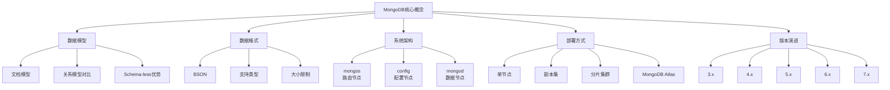

# MongoDB 核心概念

## 概述
本文档系统梳理 MongoDB 的核心概念体系，帮助读者建立对文档型数据库的整体认知。学习目标包括理解文档模型与关系模型的本质区别，掌握 BSON 数据格式特点，熟悉 MongoDB 分片集群架构，并能够基于业务场景判断是否适用 MongoDB。

---

## 一、知识图谱



---

## 二、基础到进阶学习路线
- 阶段一：基础入门：理解文档模型概念，安装启动 MongoDB，基本 CRUD 操作
- 阶段二：原理深入：掌握 BSON 结构，分析整体架构，理解各组件职责
- 阶段三：实战优化：结合场景选型，性能调优，云服务部署架构设计

---

## 三、核心知识详解

### 1. 文档模型 vs 关系模型对比

| 特性 | 文档模型（MongoDB） | 关系模型（MySQL） |
|------|-------------------|-----------------|
| 数据结构 | 灵活嵌套文档，Schema 动态 | 固定表结构，Schema 静态 |
| 关联关系 | 支持内嵌和引用两种方式 | 外键连接，多表查询 |
| 扩展性 | 水平扩展天生友好 | 水平扩展需要额外分库分表 |
| ACID 事务 | 单文档原子性，4.0+支持多文档 | 完整支持多语句事务 |
| 读性能 | 反范式设计避免 join，单次查询快 | 需要 join，多表查询开销大 |
| 写性能 | 灵活写入，无需预定义结构 | 需要严格符合 schema 约束 |

::: tip Schema-less 的优势
1. **开发效率高**：业务迭代时无需修改表结构，应用层直接新增字段
2. **适配多变需求**：不同文档可以有不同字段，适合业务快速迭代
3. **减少 join 操作**：通过内嵌文档将关联数据聚合，提升查询性能
:::

### 2. BSON 数据格式

**BSON**（Binary JSON）是 MongoDB 存储数据的二进制格式，特点：

- **支持更多数据类型**：除了 JSON 基本类型，还支持 `ObjectId`、`Date`、`Binary`、`Decimal128`、`Regular Expression`、`JavaScript` 等
- **大小限制**：单个文档最大 16MB（从 MongoDB 1.8 开始），这个限制保留是为了避免大文档占用过多内存影响性能
- **常见数据类型大小**：
  - ObjectId: 12 字节
  - Int32: 4 字节
  - Int64: 8 字节
  - Double: 8 字节
  - Decimal128: 16 字节

::: info 为什么 16MB 限制？
16MB 是经验值，这个大小平衡了单文档数据密度和内存换页性能。如果需要更大存储，建议使用 GridFS 分片存储文件。

### 3. MongoDB 整体架构（分片集群）

```
┌─────────────────────────────────────────────────────┐
│                    客户端应用                         │
└────────────────┬────────────────────────────────────┘
                 │
         ┌───────▼──────────┐
         │    mongos        │  ← 路由节点：转发请求，合并结果
         │  (1~N个节点)     │
         └─────────┬───────┘
                   │
     ┌─────────────┼─────────────┐
     │             │             │
┌────▼─────┐ ┌────▼─────┐   ┌────▼─────┐
│ config   │ │  shard1  │   │  shard2  │  ...
│  server  │ │  mongod  │   │  mongod  │
│ (副本集) │ │ (副本集) │   │ (副本集) │
└──────────┘ └──────────┘   └──────────┘
```

**各组件职责**：

| 组件 | 职责 | 部署建议 |
|------|------|---------|
| `mongos` | 请求路由，将查询转发到对应分片，聚合结果返回客户端 | 通常部署多个节点做负载均衡 |
| `config server` | 存储集群元数据：分片信息、chunk 范围、数据库集合配置 | 必须以副本集部署，3 节点 |
| `mongod` | 实际存储数据，每个分片是一个独立的 mongod 副本集 | 根据数据量扩展分片数量 |

### 4. MongoDB Atlas 云服务

MongoDB Atlas 是官方提供的全托管云数据库服务，主要优势：

- 自动化运维：备份、补丁升级、故障转移、扩容自动完成
- 全球分布：支持多区域部署，跨区域灾备
- 弹性扩容：一键从免费的共享实例扩展到数千核集群
- 内置功能：全文搜索、GraphQL API、实时同步、权限管理
- 免费层：永久免费 512MB 存储，适合开发测试

### 5. 版本演进

| 版本 | 关键特性 |
|------|---------|
| 3.x | 引入 WiredTiger 存储引擎，文档验证 |
| 4.0 | 副本集多文档事务，改变流，SASL 认证改进 |
| 4.2 | 分片集群分布式事务，客户端字段级加密 |
| 5.0 | 可查询加密，时间序列集合，API 版本化 |
| 6.0 | 可查询加密全面 GA，增强分片能力，性能提升 |
| 7.0 | 更快的分片迁移，改进查询计划缓存，降低 oplog 写入开销，Queryable Encryption GA |

---

## 四、经典应用场景与解决方案

### 场景：CMS 内容管理系统

**问题背景**：
传统 CMS 使用关系型数据库存储文章、页面、自定义字段，业务迭代需要频繁修改表结构，内容模型变化时 DDL 操作风险高，文章扩展字段很难灵活添加。

**完整方案**：
使用 MongoDB 的动态 schema 特性，每个内容类型可以自定义字段结构，无需提前定义表结构。文章的标签、附件、作者信息可以内嵌存储，一次查询获取全部数据。

**代码示例**：

```javascript
// 文章文档结构示例
db.articles.insertOne({
  title: "MongoDB 核心概念",
  content: "...",
  author: {
    name: "张三",
    avatar: "https://..."
  },
  tags: ["数据库", "NoSQL", "MongoDB"],
  attachments: [
    { name: "slide.pdf", size: 1024000, url: "https://..." },
    { name: "code.zip", size: 2048000, url: "https://..." }
  ],
  customFields: {
    seoTitle: "MongoDB 入门指南",
    publishDate: ISODate("2024-01-01T00:00:00Z"),
    isPublished: true
  },
  createdAt: ISODate(),
  updatedAt: ISODate()
})

// 根据标签查询文章
db.articles.find({ tags: "MongoDB" }).sort({ createdAt: -1 })
```

---

## 五、高频面试题

### Q1: 文档模型相比关系模型有什么优势？

::: details 答案
文档模型相比关系模型的核心优势体现在三个方面：

1. **开发效率与灵活性**：文档模型支持动态 schema，业务迭代时不需要提前修改表结构，新增字段直接写入即可，减少了 DDL 操作成本和风险，特别适合需求快速变化的互联网业务。

2. **查询性能优势**：通过内嵌文档可以将关联数据一次性存储，查询时避免了多表 join 操作，单次 I/O 就能获取所有需要的数据，在读取密集型场景下性能更好。

3. **水平扩展性好**：文档模型天生适合分片，数据按分片键分布在不同节点，不需要像关系型数据库那样做复杂的分库分表，业务增长时可以通过增加分片节点线性扩展能力。

当然，文档模型也有劣势，比如不适合强一致性要求的复杂事务场景，关联查询不如关系模型方便。选型时需要根据业务特点判断。
:::

### Q2: MongoDB 和 MySQL 核心区别是什么？

::: details 答案
MongoDB 和 MySQL 的核心区别主要体现在以下几个方面：

| 维度 | MongoDB | MySQL |
|------|---------|-------|
| 数据模型 | 文档模型，动态 schema，支持嵌套 | 关系模型，固定 schema，表结构预定义 |
| 事务支持 | 单文档原子性，4.0+支持多文档分布式事务 | 完整 ACID 事务，支持各种隔离级别 |
| 扩展性 | 天生支持分片，水平扩展简单 | 垂直扩展方便，水平分库分表需要业务改造 |
| 查询模式 | 适合简单查询+聚合，复杂 join 能力弱 | 支持复杂 SQL，多表 join 优化成熟 |
| 一致性 | 默认最终一致性，可配置读偏好 | 强一致性 |

核心区别本质上是设计目标不同：MongoDB 为了可扩展性和开发灵活性，牺牲了部分事务和复杂查询能力；MySQL 为了强一致性和复杂查询，牺牲了扩展灵活性。
:::

### Q3: BSON 是什么？和 JSON 有什么区别？

::: details 答案
BSON（Binary JSON）是 MongoDB 使用的二进制编码序列化格式，用于存储文档和远程过程调用。

**和 JSON 的主要区别**：

1. **存储方式**：JSON 是纯文本编码，BSON 是二进制编码
2. **数据类型**：JSON 只支持基本的 string、number、boolean、null、array、object，BSON 额外支持 `ObjectId`、`Date`、`Binary`、`Decimal128`、`Regex` 等类型
3. **遍历性能**：BSON 每个元素有长度前缀，可以快速跳过不需要的元素，遍历速度更快
4. **空间占用**：BSON 为了快速遍历，用空间换时间，通常比 JSON 占用空间略大
5. **可读性**：JSON 人类可读，BSON 是二进制格式，不可直接阅读

MongoDB 选择 BSON 的原因：支持额外数据类型，编解码速度快，适合数据库场景频繁的增删改查操作。
:::

### Q4: mongos 在分片集群中的作用是什么？

::: details 答案
`mongos` 是 MongoDB 分片集群的路由节点，主要作用包括：

1. **请求路由**：接收客户端请求，根据分片键判断请求应该路由到哪个分片，只访问需要的分片，避免广播到所有节点
2. **元数据缓存**：从 config server 获取并缓存分片元数据（chunk 范围分布），加速路由判断
3. **结果聚合**：当查询涉及多个分片时，`mongos` 从各个分片获取部分结果，在内存中合并排序后返回给客户端
4. **协调元数据变更**：当 chunk 分裂、迁移时，`mongos` 负责协调各个分片完成操作，并更新 config server 的元数据
5. **负载均衡入口**：通常部署多个 `mongos` 节点，客户端通过负载均衡连接到多个 `mongos`，分担请求压力

`mongos` 本身是无状态的，不存储数据，重启不会影响集群可用性。
:::

### Q5: 什么场景下应该选择 MongoDB？

::: details 答案
**适合使用 MongoDB 的场景**：

1. **内容管理 CMS**：内容模型多变，需要灵活添加字段，文章、商品、页面都适合
2. **用户画像/标签系统**：每个用户标签不同，维度多变，需要灵活扩展
3. **IoT 时序数据**：设备数据上报，结构可变，写入量大，天然适合分片扩展
4. **日志/事件数据**：日志格式不固定，写入量大，查询需求相对简单
5. **事件溯源**：每个事件作为独立文档存储，天然适配事件溯源模式
6. **移动应用后端**：业务快速迭代，需要灵活 schema，需要快速扩展

**不适合使用 MongoDB 的场景**：

1. 强一致性要求的金融系统，比如账户交易
2. 需要复杂多表关联查询的报表系统
3. 数据结构高度结构化且长期不变的业务

:::

### Q6: MongoDB 分片集群中 config server 的作用是什么？

::: details 答案
config server（配置服务器）存储分片集群的所有元数据，包括：

1. 数据库和集合的分片配置信息
2. 每个分片的地址和状态信息
3. chunk 的范围分布：每个 chunk 包含哪些 key 范围，存储在哪个分片
4. zone（区域）分片配置信息

**关键点**：
- config server 必须以副本集方式部署（至少 3 节点），保证高可用
- config server 的数据非常重要，一旦丢失整个集群无法工作，必须做好备份
- 只有元数据变更才会写入 config server，普通读写请求不会访问 config server（mongos 会缓存元数据）
:::

---

## 六、选型指南

### 适用场景

- **内容管理系统**：灵活字段，快速迭代
- **用户画像与标签系统**：动态属性，多维查询
- **IoT 设备数据采集**：高写入吞吐量，水平扩展
- **日志与事件存储**： schema 不固定，写入量大
- **移动应用 / 互联网创业项目**：业务快速变化，需要灵活迭代
- **实时分析场景**：聚合管道支持多维分析

### 不适用场景

- **强一致性事务系统**：如金融交易、账户系统
- **复杂多表关联查询**：如复杂报表、BI 分析
- **极小数据量固定结构**：关系型数据库已经能很好满足，没必要引入 MongoDB
- **需要跨文档复杂 join 的业务**：MongoDB join 性能不如关系型数据库

### 配置建议

- **开发测试**：使用 MongoDB Atlas 免费层，无需运维
- **生产中小规模**：使用云厂商托管的 MongoDB 服务，节省运维成本
- **大规模数据**：部署分片集群，分片键选择遵循高基数、均匀分布原则
- **版本选择**：优先选择 6.0+ 版本，7.0 已经 GA，有更好的性能和分片能力
- **存储引擎**：默认使用 WiredTiger，不需要再考虑 MMAPv1

---

## 相关文档
- [上一级相关文档](../index)
- [文档模型设计](./data-model)
- [查询与索引](./query-index)
