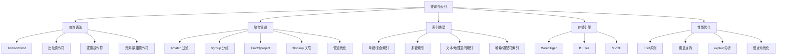
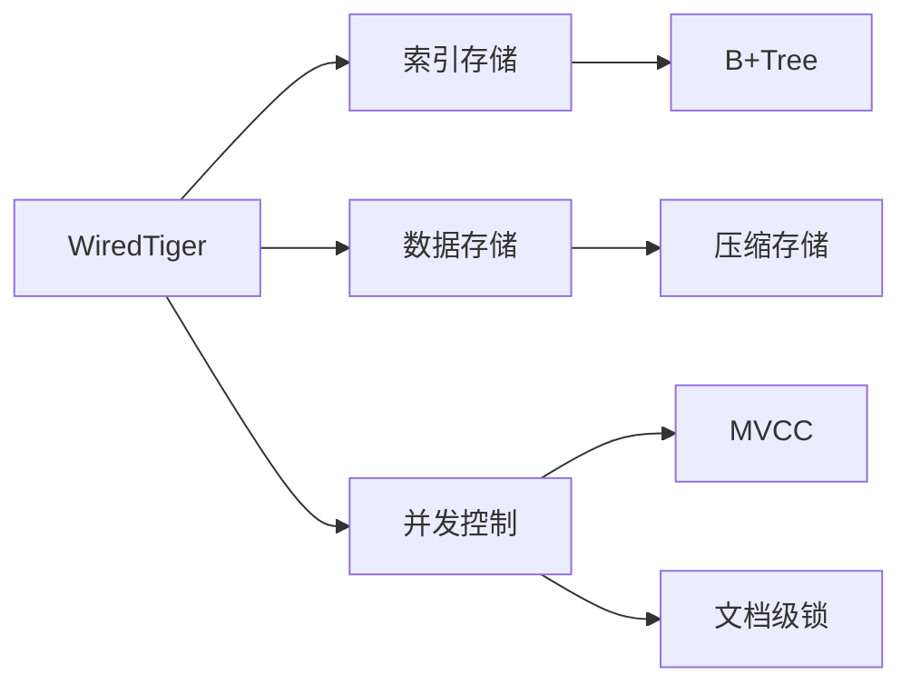

# 查询与索引

## 概述
查询与索引是 MongoDB 性能优化的核心主题。本模块从基本查询语法出发，深入聚合管道的设计思想和执行机制，全面梳理 8 种索引类型的使用场景，并系统讲解 WiredTiger 存储引擎的底层原理与索引优化策略，帮助读者具备从慢查询分析到索引优化的完整能力。

---

## 一、知识图谱



---

## 二、基础到进阶学习路线
- 阶段一：基础入门：掌握基本 CRUD 语法，理解常用操作符，能独立完成简单查询
- 阶段二：原理深入：理解聚合管道执行流程，掌握 WiredTiger 引擎的 B+Tree 和 MVCC 机制
- 阶段三：实战优化：熟练使用 explain 分析执行计划，能够根据 ESR 原则设计最优索引

---

## 三、核心知识详解

### 1. 基本查询语法

```javascript
// 基本查询
db.collection.find({ status: "active" })

// 比较操作符
db.collection.find({ age: { $gte: 18, $lte: 60 } })
db.collection.find({ name: { $ne: "admin" } })

// 逻辑操作符
db.collection.find({
  $and: [{ status: "active" }, { age: { $gte: 18 } }]
})
db.collection.find({
  $or: [{ status: "active" }, { vip: true }]
})
db.collection.find({ status: { $not: { $eq: "deleted" } } })

// 元素操作符
db.collection.find({ phone: { $exists: true } })
db.collection.find({ status: { $type: "string" } })

// 数组操作符
db.collection.find({ tags: "mongodb" })              // 数组包含
db.collection.find({ tags: { $all: ["a", "b"] } })   // 数组包含全部
db.collection.find({ tags: { $size: 3 } })           // 数组长度
db.collection.find({ "scores.0": { $gte: 80 } })     // 数组位置
db.collection.find({ scores: { $elemMatch: { $gte: 80, $lt: 90 } } })
```

### 2. 聚合管道

聚合管道（Aggregation Pipeline）是 MongoDB 的数据处理流水线，文档依次通过多个阶段进行处理。

```javascript
// 经典聚合管道示例：统计每个分类的订单总额
db.orders.aggregate([
  // 阶段1：过滤待处理订单
  { $match: { status: { $in: ["pending", "processing"] } } },

  // 阶段2：按分类和日期分组
  { $group: {
      _id: { category: "$category", date: { $dateToString: { format: "%Y-%m-%d", date: "$createdAt" } } },
      totalAmount: { $sum: "$amount" },
      orderCount: { $sum: 1 },
      avgAmount: { $avg: "$amount" }
  } },

  // 阶段3：过滤大于1000的分组
  { $match: { totalAmount: { $gte: 1000 } } },

  // 阶段4：排序
  { $sort: { totalAmount: -1 } },

  // 阶段5：关联查询 - 查分类详细信息
  { $lookup: {
      from: "categories",
      localField: "_id.category",
      foreignField: "_id",
      as: "categoryInfo"
  } },

  // 阶段6：扁平化
  { $unwind: "$categoryInfo" },

  // 阶段7：投影
  { $project: {
      _id: 0,
      category: "$_id.category",
      date: "$_id.date",
      totalAmount: 1,
      orderCount: 1,
      avgAmount: 1,
      categoryName: "$categoryInfo.name"
  } }
])
```

::: tip 聚合管道优化原则
1. **`$match` 和 `$sort` 尽早执行**：管道的早期阶段如果能利用索引，尽量放在前面
2. **`$match` 在 `$group` 之前**：减少进入分组阶段的文档数量
3. **`$project` 尽可能晚**：减少传递字段，但不要过早丢弃后续需要的字段
4. **避免 `$lookup` 过多**：`$lookup` 本质上是左外连接，成本高，尽量用反范式替代
:::

```javascript
// 聚合管道关键操作符速查
// $group 累加器
{ $sum: "$field" }      // 求和
{ $avg: "$field" }      // 平均
{ $min: "$field" }      // 最小值
{ $max: "$field" }      // 最大值
{ $push: "$field" }     // 推入数组
{ $addToSet: "$field" } // 去重推入数组
{ $first: "$field" }    // 第一个
{ $last: "$field" }     // 最后一个

// $project 表达式
{ $add: ["$a", "$b"] }           // 加法
{ $subtract: ["$a", "$b"] }      // 减法
{ $multiply: ["$a", "$b"] }      // 乘法
{ $divide: ["$a", "$b"] }        // 除法
{ $cond: { if, then, else } }    // 条件
{ $concat: ["$a", "-", "$b"] }   // 字符串拼接
{ $substr: ["$field", 0, 10] }   // 截取子串
```

### 3. 索引类型

| 索引类型 | 说明 | 创建语法 | 适用场景 |
|---------|------|---------|---------|
| 单键索引 | 单个字段 | `createIndex({ field: 1 })` | 简单查询 |
| 复合索引 | 多个字段 | `createIndex({ a: 1, b: -1 })` | 组合条件查询 |
| 多键索引 | 数组字段 | 自动创建 | 数组元素查询 |
| 文本索引 | 全文搜索 | `createIndex({ field: "text" })` | 模糊全文搜索 |
| 地理空间索引 | 2d/2dsphere | `createIndex({ loc: "2dsphere" })` | 地理位置查询 |
| 哈希索引 | 哈希分片 | `createIndex({ field: "hashed" })` | 哈希分片键 |
| 通配符索引 | 未知字段 | `createIndex({ "$**": 1 })` | 灵活查询场景 |
| 唯一索引 | 值唯一 | `createIndex({ field: 1 }, { unique: true })` | 唯一约束 |
| 部分索引 | 条件过滤 | `createIndex({ field: 1 }, { partialFilterExpression: { status: "active" } })` | 子集索引 |
| TTL 索引 | 自动过期 | `createIndex({ field: 1 }, { expireAfterSeconds: 3600 })` | 自动清理 |

```javascript
// 创建复合索引，注意字段顺序
db.orders.createIndex({ userId: 1, createdAt: -1, status: 1 })

// 创建地理空间索引
db.locations.createIndex({ position: "2dsphere" })

// 创建文本索引
db.articles.createIndex({ title: "text", content: "text" })

// 创建通配符索引（谨慎使用）
db.products.createIndex({ "$**": 1 })

// 创建唯一索引
db.users.createIndex({ email: 1 }, { unique: true })

// 创建部分索引（仅活跃用户）
db.users.createIndex(
  { lastLogin: 1 },
  { partialFilterExpression: { status: "active" } }
)
```

::: warning 索引注意事项
- 复合索引的字段顺序至关重要，遵循 **ESR 原则**
- 每个集合最多 64 个索引，但通常不超过 5 个
- 索引在提高读性能的同时会降低写性能
- 多键索引每个文档中数组的每个元素都会生成一个索引条目
- 通配符索引会较大增加索引大小，谨慎使用
:::

### 4. WiredTiger 存储引擎

WiredTiger 是 MongoDB 3.2 起默认的存储引擎，底层使用 **B+Tree** 数据结构存储索引，使用 **MVCC** 实现并发控制。



**核心特性**：

| 特性 | 说明 |
|------|------|
| 数据压缩 | 支持 snappy（默认）和 zlib 两种压缩算法，典型压缩比 3-6 倍 |
| 文档级锁 | 并发写操作粒度是文档级别，高并发下性能好 |
| MVCC | 多版本并发控制，读操作不会被写操作阻塞 |
| 写缓存 | 默认用 60% 内存作为写缓存（可配置），支持 checkpoint 机制 |
| 预写日志 | WAL 保证 crash-safe，断电后通过日志恢复 |

### 5. 覆盖查询 vs 回表

```javascript
// 假设索引：{ userId: 1, status: 1, createdAt: 1 }

// 覆盖查询：所有查询字段和返回字段都在索引中
// 不需要回表读取文档，效率最高
db.orders.find(
  { userId: "u123", status: "completed" },
  { userId: 1, status: 1, createdAt: 1, _id: 0 }
)

// 非覆盖查询：需要 amount 字段，但不在索引中
// 需要回表，效率较低
db.orders.find(
  { userId: "u123", status: "completed" },
  { userId: 1, status: 1, createdAt: 1, amount: 1, _id: 0 }
)
```

::: info 覆盖查询条件
要成为覆盖查询，必须满足：
1. 查询条件中的所有字段都在索引中
2. 返回字段（projection）中的所有字段都在索引中
3. 不能返回 `_id`（除非 `_id` 也在索引中）
4. 结果集不能有数组字段（多键索引不能覆盖）
:::

### 6. ESR 原则

**ESR 原则**是 MongoDB 复合索引字段顺序设计的黄金法则：

| 优先级 | 含义 | 英文 | 说明 |
|--------|------|------|------|
| 1 | 等值过滤 | **E**quality | 等值查询的字段放在最前面 |
| 2 | 排序 | **S**ort | 排序字段放在中间 |
| 3 | 范围过滤 | **R**ange | 范围查询的字段放在最后 |

```javascript
// 查询条件：userId = "u123" AND status = "completed" AND createdAt > ISODate("2024-01-01")
// 排序：createdAt DESC

// 正确的 ESR 顺序：
// E: userId, status（等值）
// S: createdAt（排序字段，同时也是范围查询）
db.orders.createIndex({ userId: 1, status: 1, createdAt: -1 })

// 错误的顺序（范围查询在前，后续索引字段无法使用）：
db.orders.createIndex({ createdAt: -1, userId: 1, status: 1 })
```

### 7. 执行计划解读

```javascript
// 使用 explain 分析查询
db.orders.find({ userId: "u123", createdAt: { $gte: ISODate("2024-01-01") } })
  .sort({ createdAt: -1 })
  .explain("executionStats")

// 关键输出解读
{
  "executionStats": {
    "executionSuccess": true,
    "nReturned": 500,           // 返回文档数
    "totalKeysExamined": 500,   // 扫描索引条目数
    "totalDocsExamined": 500,   // 扫描文档数（如果 > nReturned 说明有回表或扫描无效数据）
    "executionTimeMillis": 12,  // 执行耗时（毫秒）
    "executionStages": {
      "stage": "IXSCAN",        // 索引扫描（IXSCAN）
      "indexName": "userId_1_createdAt_-1",
      "direction": "forward"    // 正向/反向扫描
    }
  }
}
```

::: danger 需要关注的执行计划信号

| 信号 | 含义 | 措施 |
|------|------|------|
| `stage: "COLLSCAN"` | 全表扫描 | 必须创建索引 |
| `totalDocsExamined >> nReturned` | 大量无效文档扫描 | 优化索引或查询条件 |
| `totalKeysExamined >> nReturned` | 扫描了大量索引条目但匹配少 | 优化索引字段顺序 |
| `stage: "SORT"` (in memory) | 内存排序 | 添加排序字段索引 |
| `stage: "SORT"` (on disk) | 磁盘排序（超过 32MB） | 必须添加索引 |
:::

---

## 四、经典应用场景与解决方案

### 场景：电商订单列表查询优化

**问题背景**：
订单表有 5000 万文档，订单列表常见查询条件为：指定用户、按时间范围筛选、按状态过滤、按创建时间倒序排列。最初使用默认索引，查询每次需要 3 秒以上。

**完整方案**：

```javascript
// 1. 分析查询模式
// 常见查询：userId = ? AND status IN (?,?) AND createdAt BETWEEN ? AND ?
// 排序：createdAt DESC

// 2. 按 ESR 原则创建复合索引
db.orders.createIndex(
  { userId: 1, status: 1, createdAt: -1 },
  { name: "idx_user_status_created" }
)

// 3. 验证优化效果
db.orders.find({
  userId: "u123",
  status: { $in: ["pending", "completed"] },
  createdAt: { $gte: ISODate("2024-01-01"), $lte: ISODate("2024-03-31") }
}).sort({ createdAt: -1 }).explain("executionStats")

// 优化前：COLLSCAN，扫描 5000 万文档，耗时 3200ms
// 优化后：IXSCAN，扫描 1200 条索引，耗时 15ms

// 4. 进阶优化：使用覆盖查询（如果不需要返回文档全部字段）
db.orders.find(
  { userId: "u123", status: "completed", createdAt: { $gte: ISODate("2024-01-01") } },
  { userId: 1, status: 1, createdAt: 1, _id: 0 }
).sort({ createdAt: -1 })
// 此时 totalDocsExamined: 0，完全覆盖查询
```

---

## 五、高频面试题

### Q1: MongoDB 有哪些索引类型？各自适用场景？

::: details 答案
MongoDB 支持以下主要索引类型：

1. **单键索引**：最基础的索引，对单个字段建索引。适用所有简单查询场景。

2. **复合索引**：对多个字段建索引，字段顺序至关重要。适用组合条件查询，应遵循 ESR 原则。

3. **多键索引**：自动为数组字段创建的索引，数组中的每个元素都会生成一个索引条目。适用数组元素查询（如 `tags: ["mongodb"]`）。

4. **文本索引**：支持对字符串字段进行全文搜索，支持分词和权重。一个集合只能有一个文本索引，但可以包含多个字段。适用模糊搜索、文章搜索。

5. **地理空间索引**：`2d` 用于平面地图，`2dsphere` 用于球面（地球）。适用 LBS 附近搜索、地图应用。

6. **哈希索引**：对字段值进行哈希，索引条目按哈希值分布。只支持等值查询，不支持范围查询。适用哈希分片键。

7. **通配符索引**：`$**` 匹配所有字段，对未知查询模式有用。但会显著增加索引大小，谨慎使用。

8. **唯一索引**：确保索引字段值唯一，拒绝重复值插入。适用 email、用户名等唯一约束。

9. **部分索引**：仅对满足条件的文档创建索引，减少索引大小。适用大量文档中只有少数符合条件的场景。

10. **TTL 索引**：自动过期删除文档。适用会话、临时数据、缓存。
:::

### Q2: 聚合管道怎么用？`$lookup` 有什么问题？

::: details 答案
聚合管道是 MongoDB 的数据处理流水线，文档依次经过多个阶段，每个阶段对文档进行变换：

**常用阶段**：
- `$match`：过滤文档，类似 SQL 的 WHERE
- `$group`：分组聚合，类似 SQL 的 GROUP BY
- `$sort`：排序
- `$project`：投影，选择/计算输出字段
- `$lookup`：左外连接，关联其他集合
- `$unwind`：将数组字段展开为多行
- `$facet`：在一个管道中执行多个并行聚合

**`$lookup` 的问题和优化**：

1. **性能问题**：`$lookup` 本质上是左外连接，每次都要访问被关联集合，在数据量大时性能很差
2. **索引依赖**：`$lookup` 的 `foreignField` 必须要有索引，否则触发 COLLSCAN
3. **内存限制**：`$lookup` 结果集不能超过 100MB 内存限制（可以用 `$unwind` 缓解）
4. **管道限制**：在 `$lookup` 中再次使用管道会进一步降低性能

**优化建议**：
- 优先使用反范式设计，将关联数据冗余存储，避免 `$lookup`
- 如果必须使用 `$lookup`，确保 `foreignField` 有索引
- 使用 `$match` 在 `$lookup` 之前和之后过滤，减少数据量
- 考虑使用 `$lookup` 的子管道（pipeline）进一步过滤被关联集合
:::

### Q3: WiredTiger 引擎的核心特点是什么？

::: details 答案
WiredTiger 是 MongoDB 3.2 版本开始成为默认的存储引擎，其核心特点包括：

**1. 数据压缩**：
- 支持 snappy（默认，压缩比约 3-5 倍）和 zlib（压缩比更高但 CPU 开销大）两种压缩算法
- 索引也支持 prefix compression（前缀压缩），实际存储空间远小于原始数据
- 压缩后不但节省磁盘，还能增加缓存中可容纳的数据量

**2. 文档级并发控制（MVCC）**：
- 写操作锁粒度是文档级别，而非集合级别，高并发下性能远优于 MMAPv1 的集合级锁
- 读操作使用快照读，不会被写操作阻塞（Read Uncommitted 级别）
- 通过 MVCC 实现"读不阻塞写，写不阻塞读"

**3. 内存管理**：
- 默认使用 60% 的可用内存（0.5 * RAM）作为写缓存
- 支持 checkpoint 机制，定期将内存数据持久化到磁盘
- 写缓存满时触发 eviction 淘汰，将脏页刷盘

**4. Checkpoint 与 WAL**：
- 定期（默认 60 秒）创建 checkpoint，确保数据一致性
- 使用 Write-Ahead Log（WAL）保证 crash-safe，断电后恢复
- 结合 checkpoint 和 WAL 实现快速恢复

**5. B+Tree 索引**：
- 索引底层使用 B+Tree 存储，支持范围查询和排序
- 相比 LSM Tree 的写优化，B+Tree 更均衡，读性能更好
:::

### Q4: ESR 原则是什么？举例说明。

::: details 答案
ESR 原则是 MongoDB 复合索引字段顺序设计的核心法则，三个字母分别代表：

- **E（Equality）**：等值查询字段，放在最前面
- **S（Sort）**：排序字段，放在中间
- **R（Range）**：范围查询字段，放在最后

**为什么这个顺序重要？**
MongoDB 复合索引是一个 B+Tree，按索引字段顺序组织。如果范围查询出现在排序字段之前，索引就无法利用排序字段来避免内存排序。

**示例**：

```javascript
// 查询：userId = "u123" AND status = "active" AND createdAt > "2024-01-01"
// 排序：createdAt DESC

// 正确顺序（ESR）
db.orders.createIndex({ userId: 1, status: 1, createdAt: -1 })
// 索引可以用到：userID（等值）、status（等值）、createdAt（范围+排序）
// stage: IXSCAN，无 SORT 阶段

// 错误顺序1（范围在前）
db.orders.createIndex({ createdAt: -1, userId: 1, status: 1 })
// 索引只能用到：createdAt（范围），后续字段无法使用
// 需要额外扫描大量文档

// 错误顺序2（排序字段不在最后）
db.orders.createIndex({ userId: 1, createdAt: -1, status: 1 })
// status 是等值查询，但放在 createdAt（排序+范围）之后
// 索引在 createdAt 之后就停止了，status 无法使用
```

**特殊情况**：当排序字段和范围查询字段是同一个字段时，可以同时满足 ESR 中的 S 和 R，仍然放在最后。
:::

### Q5: 如何分析 MongoDB 慢查询？

::: details 答案
分析 MongoDB 慢查询需要一个系统化的流程：

**第一步：启用慢查询日志**

```javascript
// 设置慢查询阈值（毫秒）
db.setProfilingLevel(1, { slowms: 100 })

// 查看最近的慢查询
db.system.profile.find().sort({ ts: -1 }).limit(10).pretty()
```

**第二步：使用 explain() 分析执行计划**

```javascript
db.collection.find(query).explain("executionStats")
```

**关键指标**：
- `executionTimeMillis`：执行耗时
- `totalKeysExamined` vs `nReturned`：索引扫描效率，比值越大说明索引选择性越差
- `totalDocsExamined` vs `nReturned`：文档扫描效率，比值大说明有大量无效扫描
- `stage`：`IXSCAN`（索引扫描）正常，`COLLSCAN`（全表扫描）需要优化
- `SORT` stage：如果在内存排序，可以接受；如果 on disk 排序（超过 32MB），必须优化

**第三步：常见问题诊断**

| 现象 | 原因 | 解决方案 |
|------|------|---------|
| COLLSCAN | 未使用索引 | 创建合适的索引 |
| totalDocsExamined >> nReturned | 索引选择性差 | 优化索引字段顺序，添加更多过滤字段 |
| SORT (on disk) | 排序无索引 | 按 ESR 原则添加索引 |
| 大量 rejectedPlans | 索引选择不当 | 使用 hint 指定索引或重建索引 |

**第四步：使用 `$indexStats` 查看索引使用情况**

```javascript
// 查看哪些索引从未被使用
db.collection.aggregate([{ $indexStats: {} }])
```
:::

### Q6: 覆盖查询是什么？如何实现？

::: details 答案
覆盖查询（Covered Query）是指查询的所有字段（包括查询条件和返回字段）都包含在索引中，MongoDB 可以直接从索引返回结果，**不需要回表访问实际文档**。

**实现条件**：
1. 查询条件中的所有字段都在索引中
2. 返回字段（projection）中的所有字段都在索引中
3. 不能返回 `_id` 字段（除非 `_id` 也在索引中明确列出）
4. 查询结果不能包含数组字段（多键索引不支持覆盖）

**示例**：

```javascript
// 假设索引：{ userId: 1, status: 1, createdAt: 1 }

// 覆盖查询
db.orders.find(
  { userId: "u123", status: "completed" },
  { userId: 1, status: 1, createdAt: 1, _id: 0 }
).explain("executionStats")
// 结果：totalDocsExamined: 0（完全覆盖，无需回表）

// 非覆盖查询（amount 不在索引中）
db.orders.find(
  { userId: "u123", status: "completed" },
  { userId: 1, amount: 1, _id: 0 }
)
// 结果：totalDocsExamined > 0（需要回表读取 amount）
```

**性能对比**：
- 覆盖查询：只需读取索引，一次 I/O
- 普通索引查询：读取索引 + 回表读取文档，至少两次 I/O
- 全表扫描：最差情况

**最佳实践**：在经常查询的列表页面，只返回必要的字段，配合复合索引实现覆盖查询，性能提升可达 10 倍以上。
:::

---

## 六、选型指南

### 适用场景

- **高性能读场景**：覆盖查询 + 复合索引，单次查询毫秒级
- **多维数据分析**：聚合管道支持复杂分组、聚合计算
- **地理位置查询**：内建 2dsphere 索引，LBS 应用首选
- **全文搜索**：文本索引支持基础全文搜索需求

### 不适用场景

- **复杂多表关联查询**：`$lookup` 性能不如 SQL JOIN
- **需要严格 SQL 标准的报表系统**：聚合管道虽然功能强大，但学习曲线陡峭
- **需要精确控制索引的 DBA 团队**：MongoDB 的索引优化器有时会选错索引

### 配置建议

- **索引数量**：每个集合不超过 5 个索引，索引太多会拖累写性能
- **复合索引顺序**：严格遵循 ESR 原则，避免索引浪费
- **定期监控**：使用 `$indexStats` 和 `explain` 定期检查索引使用情况
- **内存分配**：WiredTiger 缓存建议设为可用内存的 50%-60%

---

## 相关文档
- [上一级相关文档](../index)
- [MongoDB 核心概念](./index)
- [文档模型设计](./data-model)
- [副本集与分片](./replication-sharding)