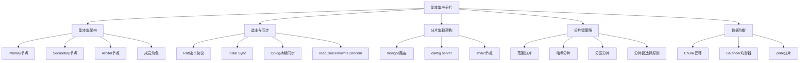

# 副本集与分片

## 概述
副本集和分片是 MongoDB 高可用与水平扩展的两大核心机制。本模块深入讲解副本集的 Raft 选举协议、Oplog 同步原理，以及分片集群的分片键选择策略、Chunk 迁移机制和 Zone 分片实践，帮助读者掌握从单节点到分布式集群的完整架构设计能力。

---

## 一、知识图谱



---

## 二、基础到进阶学习路线
- 阶段一：基础入门：理解副本集的基本概念，掌握 Primary/Secondary/Arbiter 角色
- 阶段二：原理深入：深入 Raft 选举协议，理解 Oplog 同步机制，掌握分片键选择策略
- 阶段三：实战优化：设计生产级副本集拓扑，合理配置 writeConcern 和 readConcern，实践 Zone 分片

---

## 三、核心知识详解

### 1. 副本集架构

副本集是一组维护相同数据集的 mongod 实例，提供数据冗余和高可用。

```
┌──────────────────────────────────────────────┐
│                 副本集架构                     │
│                                              │
│   ┌─────────┐    心跳检测     ┌─────────┐    │
│   │ Primary │◄──────────────►│Secondary│    │
│   │ (读写)  │                │  (只读) │    │
│   └────┬────┘                └─────────┘    │
│        │ 复制数据                              │
│   ┌────▼────┐    投票      ┌─────────┐       │
│   │Secondary│◄────────────►│ Arbiter │       │
│   │  (只读) │              │ (仅投票) │       │
│   └─────────┘              └─────────┘       │
└──────────────────────────────────────────────┘
```

**节点角色**：

| 角色 | 职责 | 数据存储 | 投票权 |
|------|------|---------|--------|
| Primary | 接收所有写操作，记录 Oplog | 有 | 有（1 票） |
| Secondary | 复制 Primary 的 Oplog 并应用，可提供读服务 | 有 | 有（1 票） |
| Arbiter | 参与选举投票，打破平票 | 无 | 有（1 票） |
| Hidden | 备份/报表专用，不参与选主，不提供读 | 有 | 有（1 票） |
| Delayed | 延迟复制，用于灾难恢复回滚 | 有 | 有（1 票） |

::: tip 生产环境推荐配置
- 至少 3 个数据节点（P-S-S），实现高可用
- 奇数个投票节点，避免平票
- 不要在 P-S-A（1 主 1 从 1 仲裁）架构下把 writeConcern 设为 "majority"，否则 Arbiter 宕机会导致无法写入
:::

### 2. 选主协议 - Raft 实现

MongoDB 从 3.2 版本开始使用 Raft 协议的变体实现副本集选举。

**选举触发条件**：
1. Primary 节点心跳超时（默认 10 秒）
2. Primary 主动降级（`rs.stepDown()`）
3. 初始化副本集时

**选举流程**：

```
┌──────────┐   心跳超时    ┌──────────┐   发起选举    ┌──────────┐
│ Primary  │ ──────────► │Secondary │ ──────────► │ 候选节点 │
│  宕机    │             │ 检测到   │             │ 请求投票 │
└──────────┘             └──────────┘             └────┬─────┘
                                                       │
                                           ┌───────────┴───────────┐
                                           ▼                       ▼
                                    ┌──────────┐            ┌──────────┐
                                    │ 获得多数 │            │ 未获多数 │
                                    │ 票当选   │            │ 票等待   │
                                    └──────────┘            └──────────┘
```

**选举优先级**：
- `priority` 参数控制优先级（0-1000），高优先级节点优先当选
- `priority: 0` 的节点永远不参与选举（如 Hidden 节点）
- 复制延迟小的节点优先（Oplog 最新）

### 3. 数据同步

**Initial Sync（初始同步）**：
1. 新节点加入副本集，选择距离最近的源节点
2. 克隆源节点的所有数据库和数据
3. 应用克隆期间产生的 Oplog
4. 创建索引（所有索引一次性创建）
5. 切换到 Secondary 状态，开始持续同步

**Oplog 持续同步**：

Oplog（操作日志）是一个有上限的固定集合（capped collection），存储所有写操作。

```javascript
// Oplog 条目示例
{
  "ts": Timestamp(1719302400, 1),  // 操作时间戳
  "h": NumberLong("..."),           // 操作哈希
  "v": 2,                          // Oplog 版本
  "op": "i",                       // 操作类型：i=insert, u=update, d=delete, c=command
  "ns": "shop.orders",             // 命名空间
  "o": {                           // 操作文档
    "_id": ObjectId("..."),
    "item": "phone",
    "qty": 1
  }
}
```

**Oplog 大小配置**：

```javascript
// Oplog 默认是磁盘的 5%（最小 990MB，最大 50GB）
// 生产环境建议手动设置
// 原则：Oplog 窗口 >= 故障恢复窗口 + 维护窗口
// 例如：需要 24 小时的恢复窗口，每天写入 100GB，则需要约 100GB Oplog
```

### 4. 分片集群架构

```
                     ┌───────────────────┐
                     │    Client App     │
                     └────────┬──────────┘
                              │
                ┌─────────────┼─────────────┐
                │             │             │
          ┌─────▼─────┐ ┌─────▼─────┐ ┌─────▼─────┐
          │  mongos   │ │  mongos   │ │  mongos   │
          │  节点1    │ │  节点2    │ │  节点3    │
          └─────┬─────┘ └─────┬─────┘ └─────┬─────┘
                │             │             │
                └─────────────┼─────────────┘
                              │
              ┌───────────────┼───────────────┐
              │               │               │
        ┌─────▼─────┐   ┌─────▼─────┐   ┌─────▼─────┐
        │  config   │   │  shard1   │   │  shard2   │
        │  server   │   │ (副本集)  │   │ (副本集)  │
        │ (副本集)  │   └───────────┘   └───────────┘
        └───────────┘
```

**各组件详解**：

| 组件 | 数量 | 部署形式 | 说明 |
|------|------|---------|------|
| mongos | 2+ | 无状态 | 路由节点，转发请求，聚合结果 |
| config server | 3 | 副本集 | 存储集群元数据，chunk 分布信息 |
| shard | 2+ | 副本集 | 实际存储数据，每个分片独立副本集 |

### 5. 分片键选择原则

分片键是决定数据如何分布到各个分片的字段，选择分片键是分片集群设计中最关键的决策。

::: danger 分片键选择核心原则

| 原则 | 说明 | 好例子 | 坏例子 |
|------|------|--------|--------|
| **高基数** | 字段值足够多，能均匀分布 | userId, orderId | gender, status |
| **均匀分布** | 值不会集中在某个分片 | 哈希后均匀分布 | 时间戳（范围分片） |
| **查询模式** | 查询条件包含分片键 | userId 作为查询条件 | 随机字段 |
| **无单调性** | 避免持续向同一分片写入 | 哈希 userId | 自增 ID（范围分片） |

:::

### 6. 分片策略对比

```javascript
// 范围分片（Range Sharding）
// 按分片键值范围分布数据，适合范围查询
sh.shardCollection("shop.orders", { orderDate: 1 })

// 哈希分片（Hashed Sharding）
// 按分片键哈希值分布，适合均匀分布、避免热点
sh.shardCollection("shop.users", { userId: "hashed" })

// 分区分片（Zone Sharding） - 4.0+
// 按地域、业务等维度将数据固定在某分片
sh.addShardToZone("shard-beijing", "CN-North")
sh.addShardToZone("shard-shanghai", "CN-East")
sh.updateZoneKeyRange("shop.orders",
  { region: MinKey }, { region: "CN-North" }, "CN-North"
)
```

| 对比维度 | 范围分片 | 哈希分片 | 分区分片 |
|---------|---------|---------|---------|
| 数据分布 | 相邻值在同一分片 | 均匀分布 | 按业务规则 |
| 范围查询 | 优秀（可定位到具体分片） | 差（需广播） | 取决于规则 |
| 写热点 | 可能（单调递增的分片键） | 无 | 取决于规则 |
| 均衡器开销 | 可能有 | 几乎没有 | 几乎没有 |
| 适用场景 | 时间序列、范围查询 | 高并发均匀写入 | 多地域/合规 |

### 7. Chunk 迁移与均衡器

**Chunk 的概念**：
- 分片键的一个连续范围的数据为一个 Chunk
- 默认 Chunk 大小：128MB（可配置，范围 1-1024MB）
- 当 Chunk 超过阈值时自动分裂（split）

**均衡器（Balancer）**：
- 后台进程，运行在 config server 的主节点上
- 检测各分片 Chunk 数量差异，超过阈值触发迁移
- 迁移阈值：分片间 Chunk 数差异 >= 2（分片数 < 20 时）

**Chunk 迁移流程**：

```
源分片                          目标分片
  │                               │
  │  1. Balancer 发起迁移命令      │
  │◄──────────────────────────────│
  │                               │
  │  2. 目标分片开始克隆数据       │
  ├──────────────────────────────►│
  │                               │
  │  3. 迁移期间增量 Oplog 同步    │
  ├──────────────────────────────►│
  │                               │
  │  4. 迁移完成，等待关键时间窗口  │
  │                               │
  │  5. 源分片提交，切换路由       │
  │◄──────────────────────────────│
  │                               │
  │  6. 源分片异步清理旧数据       │
```

### 8. Zone 分片

Zone 分片（4.0+ 版本）允许将数据按业务规则固定到特定分片。

```javascript
// 场景：按地域将用户数据存储到对应数据中心

// 1. 定义 Zone
sh.addShardToZone("shard-beijing", "zone-cn-north")
sh.addShardToZone("shard-shanghai", "zone-cn-east")
sh.addShardToZone("shard-guangzhou", "zone-cn-south")

// 2. 定义 Zone 数据范围
sh.updateZoneKeyRange("app.users",
  { region: "BJ" }, { region: "TJ" }, "zone-cn-north"
)
sh.updateZoneKeyRange("app.users",
  { region: "SH" }, { region: "ZJ" }, "zone-cn-east"
)
sh.updateZoneKeyRange("app.users",
  { region: "GD" }, { region: "GX" }, "zone-cn-south"
)

// 3. 结果：北京用户的数据自动存储在北京分片
// 满足数据本地化合规要求，同时降低访问延迟
```

---

## 四、经典应用场景与解决方案

### 场景：电商订单系统水平扩展

**问题背景**：
电商订单系统日增百万订单，单节点数据库已无法承载。需要设计分片集群方案，同时满足：
1. 按用户 ID 查询订单列表（高频）
2. 按订单 ID 查询单个订单（高频）
3. 按时间范围统计分析（中频）
4. 避免写热点

**完整方案**：

```javascript
// 1. 选择分片键：userId 哈希分片
// 原因：按用户查询是最高频场景，哈希分片避免热点
sh.shardCollection("ecommerce.orders", { userId: "hashed" })

// 2. 创建复合索引支持各类查询
// 按用户查询（命中分片键）
db.orders.createIndex({ userId: 1, createdAt: -1 })

// 按订单 ID 查询（散布查询，但只需查一个分片）
// 需要一个 userId 到 orderId 的映射
db.orders.createIndex({ _id: 1 })

// 3. 订单 ID 设计：在 _id 中嵌入 userId 信息
// 这样可以从 orderId 推导出 userId，定位分片
function generateOrderId(userId) {
  const timestamp = Math.floor(Date.now() / 1000).toString(16).padStart(8, '0')
  const userIdHash = crypto.createHash('md5').update(userId).digest('hex').substring(0, 8)
  return ObjectId(timestamp + userIdHash + randomHex(8))
}

// 4. 配置均衡策略
// 设置 Chunk 大小为 256MB（大数据量场景）
sh.setBalancerState(true)
// 限制均衡器在业务低峰期运行
sh.startBalancer(3600) // 3600 秒后自动停止
```

---

## 五、高频面试题

### Q1: MongoDB 副本集选举机制是怎样的？

::: details 答案
MongoDB 副本集使用 Raft 协议的变体实现选举，核心流程如下：

**选举触发条件**：
1. Primary 节点心跳超时（默认 10 秒无响应）
2. 节点启动初始化时
3. 手动执行 `rs.stepDown()` 降级

**选举流程**：
1. 检测到 Primary 不可用后，有资格的 Secondary 节点将自己的 term 加 1，并向其他节点发起投票请求
2. 每个节点在每个 term 最多投一票，遵循"先到先得"原则
3. 获得 **超过半数** 投票的节点当选为新 Primary
4. 新 Primary 广播自己的任期号，其他节点确认新主

**优先级规则**：
- `priority` 值越高越优先当选（0-1000，默认 1）
- `priority: 0` 的节点永不参与选举（如 Hidden、Delayed 节点）
- 数据最新的节点（Oplog 时间戳最大）会被优先考虑

**特殊机制**：
- 如果同票（如 2 个节点的 P-S 架构），没有一个节点获得超过半数票，选举失败，保持 Secondary 状态
- 引入了 `electionTimeoutMillis`（默认 10 秒）和 `catchUpTimeoutMillis` 等参数控制选举行为
- 新主选出后有 catch-up 阶段，从其他节点拉取可能遗漏的 Oplog 条目
:::

### Q2: Oplog 是什么？Oplog 大小如何计算？

::: details 答案
Oplog（Operation Log）是 MongoDB 副本集的核心同步机制，它是一个有上限的固定集合（capped collection），存储了 Primary 节点的所有写操作记录。

**Oplog 的作用**：
1. **数据同步**：Secondary 节点通过 tail 主节点的 Oplog 来复制数据变更
2. **故障恢复**：当 Secondary 追上 Oplog 后，可以参与选举成为新 Primary
3. **Change Stream 的基础**：MongoDB 的 Change Stream 功能底层依赖 Oplog

**Oplog 条目操作类型**：
- `i`（insert）：插入文档
- `u`（update）：更新文档
- `d`（delete）：删除文档
- `c`（command）：数据库命令（如创建索引、删除集合）

**Oplog 大小计算**：

```javascript
// 公式：Oplog 大小 >= 写速率 × 恢复窗口
// 恢复窗口 = 故障恢复时间 + 维护窗口时间

// 示例：
// 每天写入 100GB 数据
// 需要 24 小时恢复窗口
// 则 Oplog 至少需要 100GB

// 但 Oplog 最大 50GB（硬限制）
// 如果 100GB > 50GB，需要：
// 1. 缩短恢复窗口
// 2. 增加节点数，减少单个节点恢复时间
// 3. 使用更快的磁盘和网络加速恢复
```

**默认大小**：
- 磁盘可用空间的 5%
- 最小 990MB，最大 50GB
- 生产环境建议根据写入量手动设置
:::

### Q3: 分片键如何选择？有哪些原则？

::: details 答案
分片键的选择是 MongoDB 分片集群设计中最关键也是最难逆转的决策，一旦选定无法更改（只能重建集合）。

**核心原则**：

1. **高基数**：分片键的值域要足够大，能够产生足够多的 chunk。例如 `userId` 有上百万个值，而 `gender` 只有 2-3 个值，后者不适合作为分片键。

2. **均匀分布**：所有分片键的值应该均匀分布，避免某些分片数据过多。例如自增的 `orderId` 在范围分片下会持续写入最后一个分片，造成热点。

3. **查询模式**：查询条件应尽量包含分片键，这样 mongos 可以精准路由到目标分片，避免广播查询。例如按 `userId` 查询是核心场景，则 `userId` 是好的分片键。

4. **避免单调递增**：范围分片下，单调递增的分片键会导致所有新数据写入同一个分片。解决方案是使用哈希分片，或选择非单调字段。

**选择策略**：

```javascript
// 场景：用户中心系统
// 核心查询：按 userId 查用户信息、按 userId 查订单
// 推荐：userId 哈希分片
sh.shardCollection("app.users", { userId: "hashed" })
sh.shardCollection("app.orders", { userId: "hashed" })

// 场景：IoT 时序数据
// 核心查询：按时间范围查询
// 推荐：deviceId 哈希分片（避免热点）+ 时间范围查询
sh.shardCollection("iot.readings", { deviceId: "hashed" })
// 查询时带上 deviceId，精准定位分片

// 场景：多租户 SaaS
// 核心查询：按 tenantId 查询
// 推荐：tenantId 哈希分片
sh.shardCollection("saas.documents", { tenantId: "hashed" })
```

**如果分片键选错了怎么办？**
- 只能通过创建新集合、迁移数据的方式修正
- 使用 `mongodump` / `mongorestore` 导出重新建表
- 或通过 Change Stream + 双写方案渐进迁移
:::

### Q4: 范围分片和哈希分片的区别是什么？

::: details 答案

| 对比维度 | 范围分片 | 哈希分片 |
|---------|---------|---------|
| **数据分布** | 相邻分片键值的文档在同一分片 | 值均匀分布到各分片 |
| **范围查询** | 优秀，可精准定位到特定分片 | 差，需要广播到所有分片 |
| **写热点** | 可能（单调递增的键） | 无（哈希打散） |
| **均衡器开销** | 数据倾斜时需要频繁迁移 | 天然均衡，迁移少 |
| **分片键选择** | 需要选非单调的键 | 几乎任何高基数键都适合 |
| **适用场景** | 时序数据、范围查询频繁 | 高并发写入、分片键单调 |

**范围分片示例**：

```javascript
// 分片键：{ orderDate: 1 }
// 2024-01 的数据在 shard1，2024-02 的数据在 shard2
// 查询"2024年1月所有订单"只需访问 shard1
// 但新订单总是写入最新日期所在的分片，形成热点
```

**哈希分片示例**：

```javascript
// 分片键：{ userId: "hashed" }
// userId 的哈希值均匀分布到各分片
// 写入负载均匀分布，无热点
// 但查询"所有用户"需要广播到所有分片
```

**选择建议**：
- 查询模式以范围查询为主，且分片键不会单调递增 → 范围分片
- 写入量大，需要避免热点 → 哈希分片
- 两者结合：使用 `{ userId: "hashed", createdAt: 1 }` 复合分片键，既打散写入又支持同一用户的时间范围查询
:::

### Q5: Chunk 迁移的流程是怎样的？

::: details 答案
Chunk 迁移是 MongoDB 分片集群中数据重新分布的核心机制，由均衡器（Balancer）触发。

**完整迁移流程**：

1. **均衡器决策**：配置服务器上的 Balancer 检测到各分片 Chunk 数量差异超过阈值，决定迁移 Chunk

2. **发起迁移**：Balancer 向源分片（donor）发送 `moveChunk` 命令，指定目标分片（recipient）

3. **目标分片克隆数据**：目标分片开始从源分片复制 Chunk 范围内的所有文档（全量同步）

4. **增量同步**：在克隆期间，源分片持续接收写入，产生的 Oplog 变更同步到目标分片

5. **等待关键窗口**：迁移进入关键阶段前，等待一个时间窗口确保增量 Oplog 追平

6. **提交切换**：源分片暂停该 Chunk 的写入，将最后一批 Oplog 同步到目标分片，然后更新 config server 的元数据，将 Chunk 路由指向目标分片

7. **清理**：源分片异步删除已迁移的 Chunk 数据

**关键参数**：
- `_secondaryThrottle`：控制迁移时是否等待 Secondary 节点确认，false 时迁移更快但可能丢数据
- `_waitForDelete`：迁移完成后是否等待源分片删除数据，false 为异步删除

**性能影响**：
- 迁移期间源分片和目标分片都有额外的 I/O 和 CPU 开销
- 迁移完成后，mongos 缓存需要刷新（默认 30 秒），期间可能路由到旧分片
- 迁移频繁时建议在业务低峰期执行，或使用 `sh.stopBalancer()` 暂停均衡器
:::

### Q6: writeConcern 和 readConcern 的作用是什么？

::: details 答案
`writeConcern` 和 `readConcern` 是 MongoDB 副本集环境下控制一致性的两个关键参数。

**writeConcern（写关注）**：
控制写操作需要被多少个节点确认后才返回成功。

| 级别 | 含义 | 可用性 | 性能 |
|------|------|--------|------|
| `{ w: 0 }` | 不等待确认 | 最高 | 最快 |
| `{ w: 1 }` | 仅 Primary 确认 | 高 | 快 |
| `{ w: "majority" }` | 多数节点确认 | 中 | 中 |
| `{ w: N }` | N 个节点确认 | 低 | 慢 |

```javascript
// 关键数据：多数节点确认
db.orders.insertOne(doc, { writeConcern: { w: "majority", wtimeout: 5000 } })

// 日志数据：仅 Primary 确认
db.logs.insertOne(doc, { writeConcern: { w: 1 } })
```

**readConcern（读关注）**：
控制读取数据的持久性级别。

| 级别 | 含义 | 说明 |
|------|------|------|
| `local` | 读取节点最新数据 | 可能读到未多数确认的数据（回滚风险） |
| `available` | 读取节点可用数据 | 可能读到孤儿文档 |
| `majority` | 读取多数确认数据 | 不会读到回滚数据，但可能不是最新 |
| `linearizable` | 线性一致性读 | 最强，读 Primary 且确认是 Primary |
| `snapshot` | 快照读 | 事务中使用，读取事务开始时的快照 |

```javascript
// 读自己刚写入的数据：majority 保证不丢
db.orders.find(
  { userId: "u123" },
  { readConcern: { level: "majority" } }
)

// 读历史数据（报表）：secondary 即可
db.orders.find(
  { createdAt: { $gte: startDate } },
  { readConcern: { level: "local" } }
)
```

**最佳实践**：
- 核心业务数据：`writeConcern: "majority"` + `readConcern: "majority"`
- 不重要数据（日志/缓存）：`writeConcern: 1` + `readConcern: "local"`
- 读从节点：设置 `readPreference: "secondary"` + `readConcern: "local"`
:::

---

## 六、选型指南

### 适用场景

- **高可用要求**：副本集提供自动故障转移，RPO=0
- **大数据量场景**：分片集群支持 PB 级数据存储
- **高并发写入**：哈希分片均匀分布写入负载
- **多地域部署**：Zone 分片满足数据本地化合规要求
- **读写分离**：副本集 Secondary 提供读服务，分担 Primary 压力

### 不适用场景

- **小数据量应用**：数据量 < 10GB，单节点足够
- **不需要高可用的开发环境**：副本集运维成本高于单节点
- **复杂的跨分片事务**：分布式事务性能开销大

### 配置建议

- **副本集节点数**：生产环境 P-S-S（3 节点），跨地域加 1 个异地节点
- **Oplog 大小**：根据每日写入量和恢复窗口计算，建议 20-50GB
- **分片数**：从 2-3 个分片开始，按需扩展（提前规划，避免后期迁移成本高）
- **Chunk 大小**：大数据量设为 256MB，中等数据量保持 128MB 默认值
- **均衡器窗口**：配置在业务低峰期运行（如凌晨 2-5 点）

---

## 相关文档
- [上一级相关文档](../index)
- [MongoDB 核心概念](./index)
- [查询与索引](./query-index)
- [事务支持](./transaction)