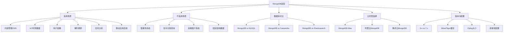

# MongoDB 选型指南

## 概述
选型是技术决策中最关键也最容易出错的环节。本模块从业务场景出发，系统对比 MongoDB 与 MySQL、Cassandra 等数据库的差异，详细分析 MongoDB 的适用与不适用场景，并提供云托管选择、版本选择和生产配置的完整建议，帮助读者在面试和工作中做出有理有据的数据库选型决策。

---

## 一、知识图谱



---

## 二、基础到进阶学习路线
- 阶段一：基础入门：了解 MongoDB 的典型适用场景，能判断什么业务适合 MongoDB
- 阶段二：原理深入：深入对比 MongoDB 与 MySQL/Cassandra，理解各数据库的定位差异
- 阶段三：实战优化：掌握生产配置要点，能做出合理的云托管和版本选择

---

## 三、核心知识详解

### 1. MongoDB 适用场景

#### 1.1 内容管理 CMS

```javascript
// 不同内容类型，字段差异大，Schema 灵活
// 文章类型
db.pages.insertOne({
  type: "article",
  title: "MongoDB选型指南",
  author: "张三",
  body: "...",
  tags: ["数据库", "MongoDB"],
  seoMeta: { title: "...", description: "..." }
})

// 产品类型
db.pages.insertOne({
  type: "product",
  name: "某商品",
  price: 299,
  images: ["url1", "url2"],
  specs: { color: "red", size: "XL" },
  inventory: 100
})
```

#### 1.2 IoT 时序数据

```javascript
// 不同设备上报的字段完全不同
// 温度传感器
db.sensor_data.insertOne({
  deviceId: "DEV-TEMP-001",
  deviceType: "temperature",
  ts: ISODate("2024-06-25T10:00:00Z"),
  temperature: 25.5,
  humidity: 68
})

// GPS 传感器
db.sensor_data.insertOne({
  deviceId: "DEV-GPS-001",
  deviceType: "gps",
  ts: ISODate("2024-06-25T10:00:00Z"),
  location: { type: "Point", coordinates: [121.47, 31.23] },
  speed: 60
})
```

#### 1.3 用户画像 / 标签系统

```javascript
// 用户画像字段差异大，不同用户标签完全不同
db.user_profiles.insertOne({
  userId: "u123",
  basicInfo: { age: 25, gender: "male", city: "上海" },
  tags: {
    interests: ["数码", "游戏", "篮球"],
    consumption: { level: "high", category: ["电子产品", "运动"] },
    behavior: { lastLogin: ISODate(), avgSession: 300 }
  },
  // 电商平台用户额外字段
  ecommerce: {
    favoriteBrands: ["Apple", "Nike"],
    avgOrderValue: 500,
    refundRate: 0.02
  }
})
```

#### 1.4 事件溯源

```javascript
// 用户行为事件流，不可变追加
db.user_events.insertOne({
  userId: "u123",
  eventType: "page_view",
  payload: { page: "/product/123", referrer: "/search", duration: 45 },
  timestamp: ISODate()
})

db.user_events.insertOne({
  userId: "u123",
  eventType: "add_to_cart",
  payload: { productId: "p001", qty: 1, price: 299 },
  timestamp: ISODate()
})
```

### 2. MongoDB 不适用场景

::: danger 不适合使用 MongoDB 的场景

| 场景 | 原因 | 替代方案 |
|------|------|---------|
| **强事务一致性系统** | MongoDB 只支持 Snapshot 隔离级别，不支持 SERIALIZABLE | MySQL / PostgreSQL |
| **金融账户系统** | 需要严格的复式记账和事务保证 | MySQL / PostgreSQL |
| **复杂多表关联查询** | `$lookup` 性能不如 SQL JOIN，查询表达能力弱 | MySQL / PostgreSQL |
| **高度结构化且长期不变的数据** | 不需要 Schema 灵活性，关系型更成熟 | MySQL |
| **需要精确 SQL 标准的报表** | SQL 标准化程度高，生态工具丰富 | MySQL / ClickHouse |
| **小数据量 + 固定结构** | 引入 MongoDB 增加运维成本但无收益 | MySQL / SQLite |

:::

### 3. 数据库对比分析

#### 3.1 MongoDB vs MySQL

| 对比维度 | MongoDB | MySQL | 胜出 |
|---------|---------|-------|------|
| 数据模型灵活性 | 极高，动态 Schema | 低，需要 DDL 变更 | **MongoDB** |
| 水平扩展 | 原生分片，简单 | 需要分库分表中间件 | **MongoDB** |
| 事务成熟度 | 4.0+ 支持，功能有限 | 20+ 年积累，功能完善 | **MySQL** |
| 复杂查询 | 聚合管道，学习成本高 | SQL 成熟，生态完善 | **MySQL** |
| 写入性能 | 高，文档级锁 | 中，行级锁 | **MongoDB** |
| 运维成熟度 | 工具链在完善中 | 工具链非常成熟 | **MySQL** |
| 人才市场 | 需求增长快 | 需求量大，供给充足 | 平手 |
| 社区生态 | 活跃，增长快 | 最成熟，资源最丰富 | **MySQL** |

**选型建议**：

```javascript
// 决策矩阵
const decisionMatrix = {
  // 选 MongoDB 的场景
  mongoDB: {
    when: "数据结构多变、需要水平扩展、读写模式简单",
    typical: "CMS、用户画像、IoT、日志、事件溯源",
    teamSize: "适合中小团队快速迭代",
    risk: "事务能力有限，复杂查询弱"
  },

  // 选 MySQL 的场景
  mySQL: {
    when: "数据结构固定、事务要求高、查询复杂",
    typical: "电商交易、金融系统、ERP、BI 报表",
    teamSize: "适合有 DBA 的团队",
    risk: "水平扩展复杂，Schema 变更风险高"
  },

  // 混合使用的场景
  hybrid: {
    when: "核心交易用 MySQL，内容管理/日志用 MongoDB",
    typical: "电商（商品详情 MongoDB + 订单 MySQL）",
    risk: "数据同步和一致性维护成本"
  }
}
```

#### 3.2 MongoDB vs Cassandra

| 对比维度 | MongoDB | Cassandra |
|---------|---------|-----------|
| 数据模型 | 文档模型（JSON/BSON） | 宽列模型（Wide Column） |
| 一致性模型 | 强一致性（可配置） | 最终一致性（可调） |
| 查询能力 | 强大（聚合管道、索引） | 有限（CQL + 二级索引） |
| 写入性能 | 高 | 极高 |
| 水平扩展 | 好（分片集群） | 极好（无中心节点） |
| 运维复杂度 | 中 | 高 |
| 典型场景 | 通用应用 | 超大规模写入、时序数据 |

**选择建议**：
- 需要灵活查询 + 聚合分析 → MongoDB
- 需要极致写入吞吐量 + 多数据中心 → Cassandra

#### 3.3 MongoDB vs Elasticsearch

| 对比维度 | MongoDB | Elasticsearch |
|---------|---------|---------------|
| 核心定位 | 文档数据库（OLTP） | 搜索引擎（OLAP） |
| 数据存储 | 主存储 | 辅助存储（通常从 MongoDB 同步） |
| 全文搜索 | 文本索引（基础） | 极强（分词、排序、相关性） |
| 聚合分析 | 聚合管道 | 聚合 DSL（更强） |
| 事务支持 | 支持（4.0+） | 不支持 |

**常见组合**：MongoDB 作为主存储 + Elasticsearch 作为搜索层，通过 Change Stream 或 Logstash 同步。

### 4. 云托管选择

| 云服务 | 优势 | 适用场景 |
|--------|------|---------|
| **MongoDB Atlas** | 官方托管，功能最新，全球部署，免费层 | 全球业务、需要最新特性 |
| **阿里云 MongoDB** | 国内部署快，与阿里云生态集成好 | 国内业务、阿里云用户 |
| **腾讯云 MongoDB** | 腾讯云生态，微信生态集成 | 微信小程序、腾讯云用户 |
| **AWS DocumentDB** | 与 MongoDB 3.6 兼容，AWS 生态 | AWS 深度用户 |

::: warning AWS DocumentDB 注意事项
AWS DocumentDB 声称兼容 MongoDB 3.6 API，但底层实现完全不同（基于 Aurora PostgreSQL），存在以下差异：
- 不支持 Change Stream
- 部分聚合操作符不支持
- 性能特征与原生 MongoDB 差异大
- 不支持事务

**建议**：如果不是必须使用 AWS 生态，优先选择 MongoDB Atlas。
:::

### 5. 版本选择

**6.x vs 7.x 新特性对比**：

| 特性 | 6.0 | 7.0 |
|------|-----|-----|
| 分片迁移 | 标准迁移 | 更快的分片迁移（无需 drain 阶段） |
| 查询计划缓存 | 基础缓存 | 改进的 slot-based 缓存 |
| Oplog 写入 | 标准写入 | 减少 Oplog 写入开销 |
| 可查询加密 | GA | 进一步优化 |
| 时间序列 | 支持 | 增强（复合索引、排序） |
| 聚合管道 | 支持 | 增强（`$percentile`、`$median`） |

**版本选择建议**：

```javascript
// 生产环境版本选择
const versionGuide = {
  production: {
    stable: "6.0.x",  // 当前最稳定版本，适合生产
    latest: "7.0.x",  // 最新版本，适合新项目
    legacy: "5.0.x"   // 存量项目，保持稳定
  },
  recommendation: "新项目优先选择 7.0，存量项目至少升级到 6.0"
}
```

### 6. 生产配置建议

#### 6.1 WiredTiger 缓存

```yaml
# mongod.conf
storage:
  wiredTiger:
    engineConfig:
      cacheSizeGB: 8  # 建议设为可用内存的 50%-60%
      # 例如：16GB 内存服务器，设为 8-10GB

# 验证当前缓存配置
db.serverStatus().wiredTiger.cache
# 关注指标：
# "maximum bytes configured" - 缓存大小
# "bytes currently in the cache" - 当前缓存使用
# "tracked dirty bytes in the cache" - 脏数据量
```

#### 6.2 Oplog 大小

```javascript
// 计算 Oplog 大小
// 公式：Oplog >= 每小时写入量 × 恢复窗口（小时）

// 示例：每天写入 50GB，需要 24 小时恢复窗口
// 50GB / 24h = 2.08GB/h
// Oplog >= 2.08GB × 24h = 50GB（但最大 50GB）

// 如果 50GB 不够，需要：
// 1. 缩短恢复窗口（如 12 小时）
// 2. 增加节点数加快恢复
// 3. 使用更快的磁盘

// 修改 Oplog 大小（需要重启）
// mongod.conf
replication:
  oplogSizeMB: 51200  # 50GB
```

#### 6.3 连接池配置

```javascript
// 应用层连接池配置（以 Node.js 驱动为例）
const client = new MongoClient(uri, {
  maxPoolSize: 100,           // 最大连接数，默认 100
  minPoolSize: 10,            // 最小连接数，默认 0
  maxIdleTimeMS: 60000,       // 空闲连接最大存活时间
  waitQueueTimeoutMS: 5000,   // 连接池满时等待超时

  // 连接超时配置
  connectTimeoutMS: 10000,    // 连接超时
  socketTimeoutMS: 45000,     // Socket 超时
  serverSelectionTimeoutMS: 30000  // 服务器选择超时
})

// 连接数计算
// 总连接数 = maxPoolSize × 应用实例数
// 需要确保总连接数 < mongod 最大连接数（默认 65536）
// 同时考虑每个连接的资源开销（约 1MB 内存）
```

#### 6.4 完整生产配置示例

```yaml
# mongod.conf - 生产环境推荐配置
systemLog:
  destination: file
  path: /var/log/mongodb/mongod.log
  logAppend: true
  logRotate: reopen

storage:
  dbPath: /data/mongodb
  journal:
    enabled: true
  wiredTiger:
    engineConfig:
      cacheSizeGB: 8
    collectionConfig:
      blockCompressor: snappy  # 默认 snappy，可选 zlib
    indexConfig:
      prefixCompression: true

processManagement:
  fork: true
  pidFilePath: /var/run/mongodb/mongod.pid

net:
  port: 27017
  bindIp: 0.0.0.0
  maxIncomingConnections: 65536

replication:
  replSetName: rs0
  oplogSizeMB: 20480  # 20GB

security:
  authorization: enabled
  # keyFile: /path/to/keyfile

setParameter:
  transactionLifetimeLimitSeconds: 60  # 事务超时
  maxTransactionLockRequestTimeoutMillis: 5
```

---

## 四、经典应用场景与解决方案

### 场景：电商平台数据库选型

**问题背景**：
一个中大型电商平台需要选择数据库，业务包含：
- 商品管理：商品信息、SKU、分类、规格
- 订单系统：订单创建、状态流转、库存扣减
- 用户系统：用户基本信息、收货地址、浏览历史
- 内容管理：帮助中心、活动页面、Banner 管理
- 日志系统：用户行为日志、系统日志

**完整方案**：采用混合数据库架构：

```
┌──────────────────────────────────────────────────┐
│                   电商平台数据库架构               │
├──────────────────────────────────────────────────┤
│                                                  │
│  ┌──────────────┐    ┌──────────────┐            │
│  │   MongoDB    │    │    MySQL     │            │
│  │              │    │              │            │
│  │ • 商品信息   │    │ • 订单系统   │            │
│  │ • 用户画像   │    │ • 支付系统   │            │
│  │ • 内容管理   │    │ • 账户余额   │            │
│  │ • 行为日志   │    │ • 优惠券     │            │
│  │ • 活动页面   │    │ • 库存扣减   │            │
│  └──────┬───────┘    └──────┬───────┘            │
│         │                   │                    │
│         │    ┌──────────────┴──────────┐         │
│         └───►│    Elasticsearch        │         │
│              │    • 商品搜索           │         │
│              │    • 全文检索           │         │
│              └─────────────────────────┘         │
│                                                  │
│  ┌──────────────┐    ┌──────────────┐            │
│  │    Redis     │    │ ClickHouse   │            │
│  │ • 热点缓存   │    │ • 数据分析   │            │
│  │ • 会话管理   │    │ • 实时报表   │            │
│  └──────────────┘    └──────────────┘            │
└──────────────────────────────────────────────────┘
```

**选择理由**：
- **商品信息用 MongoDB**：商品 SKU 多、规格多变、需要灵活 Schema
- **订单/支付用 MySQL**：强事务一致性要求，需要复杂状态机
- **搜索用 Elasticsearch**：分词搜索、相关性排序是 Elasticsearch 的强项
- **缓存用 Redis**：热点数据缓存、分布式锁
- **分析用 ClickHouse**：海量数据实时分析

---

## 五、高频面试题

### Q1: 什么时候选择 MongoDB 而不是 MySQL？

::: details 答案
选择 MongoDB 而不是 MySQL 的核心判断依据是**数据模型灵活性**和**水平扩展需求**：

**明确选择 MongoDB 的场景**：

1. **数据结构多变**：业务需求频繁变化，Schema 需要灵活调整。如 CMS 系统、用户自定义表单、IoT 数据采集。MongoDB 的动态 Schema 不需要 DDL 操作，应用层直接新增字段。

2. **数据量巨大，需要水平扩展**：单表数据量超 1TB，MySQL 需要复杂的分库分表方案，而 MongoDB 原生分片集群可以平滑扩展。

3. **读写模式简单，以按主键/索引查询为主**：不涉及复杂的多表 JOIN，查询模式简单清晰。MongoDB 的文档模型天然适合这种场景。

4. **写入吞吐量高**：日志系统、用户行为采集、事件流等场景，MongoDB 文档级锁和 Write Concern 的灵活性提供更好的写入性能。

5. **开发团队快速迭代**：创业公司或敏捷团队，需要快速验证业务假设，MongoDB 的灵活 Schema 让开发效率更高。

**明确选择 MySQL 的场景**：
- 需要强事务一致性（如金融交易）
- 数据结构固定，不会频繁变化
- 需要复杂 SQL 查询和报表
- 团队有成熟的 MySQL 运维经验

**混合使用策略**：
很多中大型系统采用"MySQL 管钱，MongoDB 管内容"的策略，核心交易数据用 MySQL，非核心内容数据用 MongoDB。
:::

### Q2: MongoDB vs MySQL 在选型时如何决策？

::: details 答案
MongoDB 和 MySQL 的选型决策需要从多个维度综合评估：

**评估框架**：

| 评估维度 | MongoDB | MySQL |
|---------|---------|-------|
| 数据模型变化频率 | 频繁变化 → MongoDB | 相对稳定 → MySQL |
| 数据规模 | 超 1TB → MongoDB | 百 GB 以内 → MySQL |
| 扩展需求 | 需要水平扩展 → MongoDB | 垂直扩展够用 → MySQL |
| 事务要求 | 偶尔需要 → MongoDB | 频繁需要 → MySQL |
| 查询复杂度 | 简单查询为主 → MongoDB | 复杂 JOIN → MySQL |
| 团队能力 | 偏好灵活开发 → MongoDB | 有 DBA 经验 → MySQL |
| 运维能力 | 可接受云服务 → MongoDB | 有自建运维经验 → MySQL |

**决策流程**：

```
1. 数据模型是否频繁变化？
   ├─ 是 → MongoDB
   └─ 否 → 继续

2. 是否需要强事务和复杂查询？
   ├─ 是 → MySQL
   └─ 否 → 继续

3. 数据量是否超过 1TB 或需要水平扩展？
   ├─ 是 → MongoDB
   └─ 否 → 继续

4. 团队是否有 MongoDB 经验？
   ├─ 是 → MongoDB
   └─ 否 → MySQL（降低学习成本）
```

**反模式**：
- 不要因为"MongoDB 流行"而盲目选择
- 不要因为"MySQL 稳定"而拒绝 MongoDB
- 不要用 MongoDB 做 OLAP 分析（应使用 ClickHouse 等专用数据库）
- 不要用 MySQL 存储大量 JSON 数据（违背了关系模型的设计初衷）
:::

### Q3: MongoDB Atlas 的优势是什么？

::: details 答案
MongoDB Atlas 是 MongoDB 官方提供的全托管云数据库服务，相比自建 MongoDB 有以下核心优势：

**1. 免运维**：
- 自动化部署、备份、补丁升级、安全加固
- 自动故障检测和转移，无需人工干预
- 自动扩容：根据负载自动调整实例规格

**2. 全球部署**：
- 支持 AWS、Azure、GCP 三大云平台，覆盖全球 80+ 区域
- 跨区域副本集，降低全球用户的访问延迟
- 全球集群（Global Clusters）：数据自动分布到就近区域

**3. 企业级安全**：
- 网络隔离（VPC Peering、Private Link）
- 端到端加密（TLS 传输加密 + 静态数据加密）
- 字段级加密（Client-Side Field Level Encryption）
- 完整的审计日志
- LDAP、OAuth、SAML 多种认证方式

**4. 内置高级功能**：
- Atlas Search：基于 Lucene 的全文搜索（无需额外部署 Elasticsearch）
- Atlas Data Lake：直接查询 S3 上的数据
- Atlas Charts：可视化图表，无需额外 BI 工具
- Realm：移动端同步 SDK
- GraphQL API：自动生成 API

**5. 成本优化**：
- 免费层：512MB 永久免费，适合开发测试
- 按需付费：按小时计费，弹性伸缩
- 无隐性成本：网络、备份、监控都包含在价格中

**6. 官方支持**：
- 24/7 技术支持
- 第一时间获得最新版本和特性
- 官方 SLA 保证（99.995% 可用性）

**适合 Atlas 的场景**：
- 团队没有 MongoDB 运维经验
- 需要快速上线，不想投入运维资源
- 全球多区域部署需求
- 需要合规认证（SOC2、HIPAA、PCI DSS）
:::

### Q4: MongoDB 7.0 有哪些重要的新特性？

::: details 答案
MongoDB 7.0 于 2023 年 8 月发布，是 MongoDB 的重要版本更新，核心新特性包括：

**1. 更快的分片迁移（Fast Shard Balancing）**：
- 传统迁移需要"drain 阶段"停止写入，7.0 消除了这个阶段
- 迁移速度提升 2-3 倍
- 迁移过程中对业务影响更小

**2. 改进的查询计划缓存（Slot-based Query Plan Cache）**：
- 从旧的 LRU 缓存改为 slot-based 缓存
- 避免了"查询计划缓存抖动"问题
- 缓存命中率更高，减少不必要的查询计划重新生成

**3. 减少 Oplog 写入开销**：
- 更新操作中只记录实际变更的字段，而不是整个文档
- Oplog 大小减少 30%-50%
- 减少副本同步的网络开销

**4. Queryable Encryption GA**：
- 可查询加密正式 GA，支持对加密字段进行等值查询
- 加密在客户端完成，服务端永远看不到明文
- 满足最严格的数据安全合规要求

**5. 聚合管道增强**：
- 新增 `$percentile`、`$median` 操作符
- 支持 `$lookup` 二级索引（提升性能）
- 聚合管道可以读取多个集合

**6. 时间序列集合增强**：
- 支持复合索引
- 支持排序和分页
- 查询性能大幅提升

**7. 改进的 Change Stream**：
- 支持分片集群的 Change Stream 性能优化
- 更大的文档变更（突破 16MB）

**升级建议**：
- 新项目直接使用 7.0
- 6.0 存量项目可以评估升级，主要收益在分片迁移和查询计划缓存
- 5.0 及之前的项目建议分步升级（5.0 → 6.0 → 7.0）
:::

### Q5: 什么时候不适合使用 MongoDB？

::: details 答案
虽然 MongoDB 是优秀的文档数据库，但以下场景不适合使用：

**1. 强事务一致性要求的金融系统**：
- MongoDB 只支持 Snapshot 隔离级别，不支持 SERIALIZABLE
- 金融交易（如银行转账、证券交易）需要严格的串行化隔离
- 替代方案：MySQL / PostgreSQL

**2. 复杂多表关联查询的报表系统**：
- `$lookup` 性能不如 SQL JOIN，且不支持复杂的子查询
- 多维度交叉分析、数据透视等场景 SQL 表达能力更强
- 替代方案：MySQL / PostgreSQL / ClickHouse

**3. 数据结构高度固定且长期不变**：
- 如果数据模型已经标准化且不会变化，Schema 灵活性没有价值
- 关系型数据库的约束（外键、CHECK、触发器）更完善
- 替代方案：MySQL / PostgreSQL

**4. 需要精确 SQL 标准的场景**：
- MongoDB 的查询语言是自定义的，不是标准 SQL
- BI 工具（如 Tableau）、ETL 工具对 SQL 支持更好
- 替代方案：MySQL / PostgreSQL

**5. 团队缺乏 MongoDB 运维经验**：
- MongoDB 的运维模式与 MySQL 不同，学习成本存在
- 副本集、分片集群的故障排查需要特定经验
- 替代方案：使用 MongoDB Atlas（云托管）或选择 MySQL

**6. 极小数据量（< 10GB）且固定结构**：
- 引入 MongoDB 的运维成本（副本集、备份、监控）可能超过收益
- 替代方案：SQLite / MySQL

**总结**：MongoDB 是一个"做减法"的数据库，它放弃了复杂事务和复杂查询，换来了灵活性、扩展性和开发效率。如果你的业务不需要这些"被放弃的能力"，那 MongoDB 就是好的选择；如果业务强依赖这些能力，就应该选择关系型数据库。
:::

### Q6: 生产环境 MongoDB 应该如何配置？

::: details 答案
生产环境 MongoDB 的配置需要从多个维度综合考虑：

**1. 存储引擎配置**：

```yaml
storage:
  wiredTiger:
    engineConfig:
      cacheSizeGB: 8  # 内存的 50%-60%
    collectionConfig:
      blockCompressor: snappy  # 默认压缩，可选 zlib
```

- WiredTiger 缓存是性能关键，建议设为可用内存的 50%-60%
- 监控 `wiredTiger.cache` 指标，确保缓存命中率 > 95%

**2. Oplog 配置**：

```yaml
replication:
  oplogSizeMB: 20480  # 根据写入量计算
```

- 公式：Oplog 大小 >= 每小时写入量 x 恢复窗口（小时）
- 建议至少 20GB，大数据量场景 50GB
- 监控 `replSetGetStatus` 中的 oplog 窗口时间

**3. 连接池配置**：

```javascript
// 应用层连接池
maxPoolSize: 100     // 每实例最大连接数
minPoolSize: 10      // 最小空闲连接
```

- 总连接数 = maxPoolSize x 应用实例数 < mongod 最大连接数（默认 65536）
- 每个连接约占用 1MB 内存，需要规划

**4. 安全配置**：

```yaml
security:
  authorization: enabled
  # 启用认证和授权
net:
  tls:
    mode: requireTLS
    certificateKeyFile: /path/to/server.pem
```

- 必须启用认证
- 生产环境必须使用 TLS 加密
- 配置网络白名单，绑定内网 IP

**5. 监控告警**：
- 连接数：超过 80% 告警
- 复制延迟：超过 10 秒告警
- 缓存命中率：低于 95% 告警
- Oplog 窗口：低于 24 小时告警
- 磁盘使用率：超过 80% 告警

**6. 备份策略**：
- 每日全量备份（mongodump 或快照）
- 持续增量备份（Oplog 备份）
- 定期演练恢复流程
- 备份数据异地存储
:::

---

## 六、选型指南

### 适用场景

- **内容管理 CMS**：动态 Schema，灵活字段
- **IoT 时序数据**：不同设备不同字段，原生分片扩展
- **用户画像/标签系统**：灵活维度，快速查询
- **事件溯源**：不可变追加，事件流存储
- **实时分析**：聚合管道支持多维分析
- **移动应用后端**：快速迭代，灵活 Schema

### 不适用场景

- **强事务一致性系统**：银行转账、证券交易
- **复杂多表关联查询**：BI 报表、ERP 系统
- **高度结构化数据**：如已经标准化的行业数据模型
- **需要精确 SQL 标准的场景**：BI 工具对接、ETL 流程

### 配置建议

- **版本选择**：新项目选 7.0，存量项目至少 6.0
- **部署方式**：中小团队使用 MongoDB Atlas，大团队可自建
- **存储引擎**：WiredTiger 缓存设为内存 50%-60%
- **Oplog 大小**：至少 20GB，大数据量 50GB
- **连接池**：每实例 maxPoolSize=100，注意总连接数上限
- **监控**：缓存命中率、复制延迟、Oplog 窗口、连接数

---

## 相关文档
- [上一级相关文档](../index)
- [MongoDB 核心概念](./index)
- [文档模型设计](./data-model)
- [查询与索引](./query-index)
- [副本集与分片](./replication-sharding)
- [事务支持](./transaction)