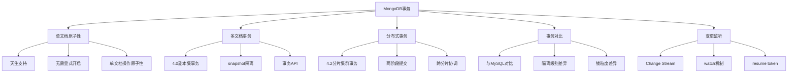

# 事务支持

## 概述
事务是 MongoDB 从单一文档原子性到多文档 ACID 保证的演进之路。本模块系统梳理 MongoDB 事务的发展历程，深入讲解分布式事务的两阶段提交实现原理，对比 MySQL 事务的差异，并介绍 Change Stream 变更监听机制，帮助读者全面理解 MongoDB 在事务方面的能力边界和最佳实践。

---

## 一、知识图谱



---

## 二、基础到进阶学习路线
- 阶段一：基础入门：理解单文档原子性，掌握 4.0+ 多文档事务 API
- 阶段二：原理深入：理解两阶段提交协议，掌握事务隔离级别和锁机制
- 阶段三：实战优化：合理设计事务边界，避免长事务，对比 MySQL 事务选型

---

## 三、核心知识详解

### 1. 单文档原子性（所有版本）

MongoDB 从第一个版本开始就支持单文档级别的原子操作，这是 MongoDB 数据一致性的基石。

```javascript
// 单文档原子操作：库存扣减，保证原子性
db.products.findOneAndUpdate(
  { _id: productId, stock: { $gte: 1 } },
  { $inc: { stock: -1 }, $push: { operationLog: { type: "sale", time: ISODate() } } },
  { returnDocument: "after" }
)

// 数组原子操作：添加评论
db.articles.updateOne(
  { _id: articleId },
  { $push: { comments: { user: "张三", content: "好文章", createdAt: ISODate() } } }
)

// 内嵌文档原子操作：更新地址
db.users.updateOne(
  { _id: userId },
  { $set: { "address.city": "上海", "address.district": "浦东新区" } }
)
```

::: tip 单文档原子性的优势
对于大多数业务场景，单文档原子性已经足够。例如：
- 库存扣减：`findOneAndUpdate` 配合 `$inc` 和条件判断
- 账户余额变动：`$inc` 原子增减
- 文档状态机：原子更新状态字段

这些场景不需要显式事务，性能更好，代码更简洁。
:::

### 2. 4.0 版本多文档事务（副本集）

MongoDB 4.0 引入了副本集内的多文档事务支持，这是 MongoDB 事务能力的重大里程碑。

```javascript
// 多文档事务示例：订单创建 + 库存扣减
const session = client.startSession()

try {
  session.startTransaction({
    readConcern: { level: "snapshot" },
    writeConcern: { w: "majority" }
  })

  const orders = session.client.db("shop").collection("orders")
  const inventory = session.client.db("shop").collection("inventory")

  // 创建订单
  await orders.insertOne({
    _id: ObjectId(),
    userId: "u123",
    items: [{ productId: "p001", qty: 2 }],
    amount: 598,
    status: "pending",
    createdAt: ISODate()
  })

  // 扣减库存
  await inventory.updateOne(
    { productId: "p001", stock: { $gte: 2 } },
    { $inc: { stock: -2 } }
  )

  await session.commitTransaction()
  console.log("事务提交成功")
} catch (error) {
  await session.abortTransaction()
  console.log("事务回滚:", error.message)
} finally {
  session.endSession()
}
```

**4.0 事务的关键特性**：

| 特性 | 说明 |
|------|------|
| 隔离级别 | Snapshot（快照隔离），事务读取开始时的数据快照 |
| 原子性 | 所有操作要么全部成功，要么全部回滚 |
| 一致性 | 事务提交后数据满足约束 |
| 持久性 | 使用 `writeConcern: "majority"` 保证 |
| 超时 | 默认 60 秒，超时自动回滚 |

### 3. 4.2 版本分布式事务（分片集群）

MongoDB 4.2 将事务支持扩展到分片集群，采用**两阶段提交（2PC）**协议实现跨分片事务。

**两阶段提交流程**：

```
协调者（mongos）            参与者（shard1）          参与者（shard2）
     │                          │                        │
     │  1. PREPARE（准备）       │                        │
     ├─────────────────────────►│                        │
     ├──────────────────────────┼───────────────────────►│
     │                          │                        │
     │  2. VOTE（投票）          │                        │
     │◄─────────────────────────┤                        │
     │◄──────────────────────────┼────────────────────────┤
     │                          │                        │
     │  3. COMMIT/ABORT（提交）  │                        │
     ├─────────────────────────►│                        │
     ├──────────────────────────┼───────────────────────►│
     │                          │                        │
     │  4. ACK（确认）           │                        │
     │◄─────────────────────────┤                        │
     │◄──────────────────────────┼────────────────────────┤
```

::: info 两阶段提交详解

**阶段一：PREPARE（准备阶段）**
1. mongos 向所有参与的分片发送 prepare 命令
2. 每个分片在本地 WiredTiger 中准备事务，但暂不提交
3. 分片返回 prepare 成功或失败

**阶段二：COMMIT/ABORT（提交/回滚阶段）**
1. 如果所有分片都 prepare 成功，mongos 发送 commit 命令
2. 如果任何分片 prepare 失败，mongos 发送 abort 命令
3. 各分片执行最终的提交或回滚

**故障恢复**：
- 如果 mongos 在 commit 阶段崩溃，config server 会尝试恢复事务状态
- 每个分片记录了 prepare 状态，reboot 后可以继续完成事务
:::

### 4. 事务使用限制

::: danger 事务使用中的重要限制

| 限制项 | 说明 |
|--------|------|
| 超时时间 | 默认 60 秒，超时自动回滚，可通过 `transactionLifetimeLimitSeconds` 调整 |
| 集合限制 | 不能对系统集合（admin、local、config 库）执行事务写操作 |
| DDL 操作 | 事务中不能执行创建/删除集合、创建索引等操作 |
| 会话限制 | 一个事务必须绑定在一个 session 上，不支持跨 session 事务 |
| 性能影响 | 长事务持有 WiredTiger 缓存和锁，影响并发性能 |
| Oplog 影响 | 事务提交时产生大量 Oplog 条目，可能影响同步 |

:::

```javascript
// 设置事务超时
const session = client.startSession()
session.startTransaction({
  readConcern: { level: "snapshot" },
  writeConcern: { w: "majority" },
  maxCommitTimeMS: 10000  // 10 秒提交超时
})

// 检查事务状态
const serverStatus = db.adminCommand({ serverStatus: 1 })
// serverStatus.transactions 包含当前活跃事务信息
```

### 5. 与 MySQL 事务对比

| 对比维度 | MongoDB | MySQL（InnoDB） |
|---------|---------|-----------------|
| **事务模型** | 单文档原子性 + 多文档事务（4.0+） | 原生多语句事务 |
| **隔离级别** | Snapshot（快照隔离） | READ UNCOMMITTED / READ COMMITTED / REPEATABLE READ / SERIALIZABLE |
| **锁粒度** | 文档级锁（WiredTiger） | 行级锁（InnoDB） |
| **死锁检测** | 有，超时自动回滚 | 有，主动检测并回滚 |
| **事务日志** | Oplog（操作日志） | Redo Log + Undo Log |
| **分布式事务** | 4.2+ 两阶段提交 | XA 事务（两阶段提交） |
| **长事务成本** | 较高（WiredTiger 缓存占用） | 中等（Undo Log 膨胀） |
| **默认自动提交** | 是 | 是 |

```javascript
// MongoDB 事务隔离级别固定为 Snapshot
// 无法像 MySQL 那样选择 READ COMMITTED 或 REPEATABLE READ

// 如果需要更低隔离级别，可以：
// 1. 使用 readConcern: "local"（非事务模式）
// 2. 减少事务范围，优先使用单文档原子操作
```

### 6. Change Stream（变更监听）

Change Stream 是 MongoDB 3.6 引入的变更数据捕获机制，基于 Oplog 实现。

```javascript
// 监听集合变更
const changeStream = db.orders.watch(
  [
    { $match: { operationType: { $in: ["insert", "update"] } } }
  ],
  { fullDocument: "updateLookup" }
)

// 持续监听
while (!changeStream.isClosed()) {
  if (await changeStream.hasNext()) {
    const change = await changeStream.next()
    console.log("变更事件:", change.operationType, change.fullDocument)

    // 记录 resume token，用于断点续传
    const resumeToken = change._id
  }
}
```

**Change Stream 事件类型**：

| 事件类型 | 说明 |
|---------|------|
| `insert` | 文档插入 |
| `update` | 文档更新 |
| `replace` | 文档替换 |
| `delete` | 文档删除 |
| `drop` | 集合删除 |
| `rename` | 集合重命名 |
| `dropDatabase` | 数据库删除 |
| `invalidate` | 变更流失效（如集合被删除） |

**Resume Token 断点续传**：

```javascript
// 保存 resume token
const resumeToken = change._id

// 从断点恢复
const resumedStream = db.orders.watch(
  [],
  { resumeAfter: { _data: resumeToken } }
)
```

::: tip Change Stream 典型应用场景
1. **跨服务数据同步**：库存变更同步到搜索服务
2. **审计日志**：记录所有数据变更
3. **缓存失效**：数据变更时通知缓存层更新
4. **事件驱动架构**：将数据变更作为事件发布到消息队列
5. **实时数据同步**：同步到数据仓库或分析平台
:::

---

## 四、经典应用场景与解决方案

### 场景：电商下单流程的事务处理

**问题背景**：
用户下单需要同时完成：创建订单、扣减库存、扣减用户余额、记录积分变更。这些操作涉及多个集合，需要保证原子性。同时，下单成功后需要通知物流系统和发送短信。

**完整方案**：

```javascript
// 1. 事务内：核心数据操作（订单、库存、余额、积分）
async function placeOrder(userId, items, couponCode) {
  const session = client.startSession()

  try {
    session.startTransaction({
      readConcern: { level: "snapshot" },
      writeConcern: { w: "majority" }
    })

    const db = session.client.db("ecommerce")

    // 1.1 创建订单
    const orderResult = await db.orders.insertOne({
      userId,
      items,
      amount: items.reduce((sum, i) => sum + i.price * i.qty, 0),
      status: "pending",
      createdAt: ISODate()
    })

    // 1.2 扣减库存（单文档原子操作 + 事务内跨文档保证）
    for (const item of items) {
      const result = await db.inventory.findOneAndUpdate(
        { productId: item.productId, stock: { $gte: item.qty } },
        { $inc: { stock: -item.qty } },
        { session }
      )
      if (!result) {
        throw new Error(`库存不足: ${item.productId}`)
      }
    }

    // 1.3 扣减余额
    const balanceResult = await db.accounts.findOneAndUpdate(
      { userId, balance: { $gte: totalAmount } },
      { $inc: { balance: -totalAmount } },
      { session }
    )
    if (!balanceResult) {
      throw new Error("余额不足")
    }

    // 1.4 记录积分
    await db.points.insertOne({
      userId,
      orderId: orderResult.insertedId,
      points: Math.floor(totalAmount / 10),
      type: "earn",
      createdAt: ISODate()
    }, { session })

    await session.commitTransaction()

    // 2. 事务外：非关键操作（通知、日志）
    // 这些操作失败不影响主流程
    await notifyLogistics(orderResult.insertedId)  // 异步通知物流
    await sendSMS(userId, "下单成功")               // 异步发送短信

    return orderResult.insertedId

  } catch (error) {
    await session.abortTransaction()
    throw error
  } finally {
    session.endSession()
  }
}
```

**设计要点**：
1. 核心数据操作（订单、库存、余额、积分）放在事务内，保证原子性
2. 非关键操作（通知物流、发送短信）放在事务外，异步执行
3. 事务尽量短小，减少锁持有时间
4. 使用 `writeConcern: "majority"` 保证持久性

---

## 五、高频面试题

### Q1: MongoDB 事务支持从什么版本开始？各版本有什么差异？

::: details 答案
MongoDB 的事务支持经历了三个关键版本：

**所有版本（1.x 起）**：
- 单文档原子性：对单个文档的所有写操作是原子的，不需要显式事务
- 包括 `findOneAndUpdate`、`updateOne`、`$inc`、`$push` 等操作
- 这是 MongoDB 最核心的一致性保证机制

**4.0 版本（2018 年 6 月）**：
- 引入副本集内多文档事务
- 支持跨多个文档、多个集合的 ACID 事务（同一副本集内）
- 使用 Snapshot 隔离级别
- 基于 WiredTiger 存储引擎的快照机制实现
- 限制：不支持分片集群

**4.2 版本（2019 年 8 月）**：
- 引入分片集群分布式事务
- 支持跨分片的多文档事务
- 使用两阶段提交（2PC）协议保证原子性
- 整体性能比副本集事务慢，但提供了完整的分布式 ACID 保证

**5.0+ 版本**：
- 事务性能持续优化
- 更灵活的超时控制
- 更好的事务监控和管理工具

**核心变化总结**：
- 3.x 及以前：单文档原子性，无跨文档事务
- 4.0：副本集内多文档事务
- 4.2+：分片集群全局分布式事务
:::

### Q2: MongoDB 分布式事务是怎么实现的？

::: details 答案
MongoDB 4.2+ 的分片集群分布式事务采用**两阶段提交（2PC）**协议实现。

**架构角色**：
- **协调者（Coordinator）**：mongos 节点，负责协调整个事务
- **参与者（Participant）**：每个涉及的分片（shard），负责执行实际的数据操作

**两阶段提交流程**：

**阶段一：PREPARE（准备阶段）**
1. mongos 向所有参与分片发送 prepare 命令
2. 每个分片在本地 WiredTiger 中准备事务：
   - 将写操作写入 WiredTiger 缓存
   - 生成 prepare 时间戳
   - 记录 prepare 状态到本地事务表
3. 分片返回 prepare 成功（vote commit）或失败（vote abort）

**阶段二：COMMIT/ABORT（提交/回滚阶段）**
1. 如果所有分片 vote commit，mongos 向所有分片发送 commit 命令
2. 如果任何分片 vote abort（或超时），mongos 向所有分片发送 abort 命令
3. 各分片执行最终提交或回滚：提交时写入 Oplog 并持久化，回滚时丢弃缓存变更

**故障恢复机制**：
- 每个分片记录了 prepare 状态，reboot 后可以继续完成
- mongos 崩溃后，新 mongos 可以从 config server 恢复事务状态
- 事务超时（默认 60 秒）后自动 abort

**性能特点**：
- 比副本集事务慢，因为需要多次网络往返和协调
- 适合低频、高价值操作（如订单创建），不适合高频更新
- 建议优先使用单文档原子性设计，减少分布式事务使用
:::

### Q3: MongoDB 事务有哪些使用限制？

::: details 答案
MongoDB 事务在使用中有以下重要限制：

**1. 超时限制**：
- 默认事务生命周期 60 秒（`transactionLifetimeLimitSeconds`），超时自动回滚
- 可调整，最大 24 小时（但强烈不建议）
- 长事务会占用 WiredTiger 缓存，影响其他操作性能

**2. 集合限制**：
- 不能对系统集合执行写操作：admin、local、config 库
- 事务中不能执行 DDL 操作：创建/删除集合、创建索引
- 不能访问 capped collections 的数据（但可以读取）

**3. 操作限制**：
- 事务中不能枚举集合（`listCollections`、`listIndexes`）
- 不能执行 `count`（已废弃的 API）
- 事务中修改的文档不能超过 16MB 限制

**4. 性能限制**：
- 事务提交时产生大量 Oplog 条目，影响副本同步
- 长事务持有 WiredTiger 快照，阻止旧数据被清理
- 分布式事务需要多次网络往返（2PC），延迟增加

**5. 会话限制**：
- 一个事务必须绑定在一个 session 上
- 同一个 session 同时只能有一个活跃事务
- 事务中不能跨 session 操作

**最佳实践**：
- 事务尽量短小：控制在毫秒级，避免秒级事务
- 事务内操作尽量少：不超过 1000 个文档修改
- 优先使用单文档原子操作替代事务
- 使用 `maxCommitTimeMS` 限制提交超时
:::

### Q4: MongoDB 和 MySQL 事务对比有什么差异？

::: details 答案
MongoDB 和 MySQL 在事务设计上有本质差异，源于两者的定位不同：

**核心差异**：

| 维度 | MongoDB | MySQL（InnoDB） |
|------|---------|-----------------|
| 事务起点 | 2009 年（单文档）→ 2018 年（多文档） | 2000 年（InnoDB） |
| 事务模型 | 单文档原子性为主，多文档事务为辅 | 多语句事务为主 |
| 隔离级别 | Snapshot 固定 | 4 级可选（RU/RC/RR/SER） |
| 锁粒度 | 文档级（WiredTiger） | 行级 + 间隙锁（InnoDB） |
| 锁释放 | 事务提交时释放 | 事务提交时释放 |
| 死锁处理 | 检测到后回滚一个事务 | 检测到后回滚一个事务 |
| 事务日志 | Oplog 操作日志 | Redo Log + Undo Log |
| 回滚段 | 无（基于快照） | Undo Log（可能膨胀） |
| 长事务影响 | 缓存占用高 | Undo Log 膨胀 + 主从延迟 |

**设计哲学差异**：
- MongoDB 的设计鼓励通过文档模型避免跨文档事务（反范式设计）
- MySQL 的设计鼓励通过事务保证多表一致性（范式设计）

**实际使用建议**：
- 如果业务以单文档操作为主（如 CMS、用户画像），MongoDB 事务能力足够
- 如果业务需要频繁跨表事务（如金融系统），MySQL 更成熟
- 如果业务需要灵活 schema + 偶尔多文档事务，MongoDB 4.2+ 可以胜任
:::

### Q5: Change Stream 是什么？有什么应用场景？

::: details 答案
Change Stream 是 MongoDB 3.6 引入的实时变更数据捕获（CDC）功能，允许应用程序订阅集合、数据库或整个集群的实时数据变更事件。

**工作原理**：
1. Change Stream 底层基于 Oplog 实现
2. 当数据发生变更时，Oplog 中产生对应记录
3. Change Stream 监听 Oplog 变更，将变更事件推送给订阅者
4. 使用 Resume Token 实现断点续传，保证不丢数据

**核心特性**：
- 实时性：秒级延迟，接近实时
- 可靠性：Resume Token 断点续传
- 顺序性：变更事件按 Oplog 顺序推送
- 过滤性：支持 `$match` 过滤特定变更

**典型应用场景**：

1. **跨服务数据同步**：
```javascript
// 订单变更 → 同步到搜索服务
db.orders.watch().on("change", (change) => {
  if (change.operationType === "insert") {
    searchService.indexDocument(change.fullDocument)
  }
})
```

2. **审计日志**：
```javascript
// 记录所有数据变更到审计日志
db.users.watch().on("change", (change) => {
  auditLog.insert({
    collection: change.ns.coll,
    operation: change.operationType,
    documentId: change.documentKey._id,
    changedBy: change.fullDocument?.updatedBy,
    timestamp: change.clusterTime
  })
})
```

3. **缓存失效**：
```javascript
// 产品变更 → 清除缓存
db.products.watch().on("change", (change) => {
  cache.del(`product:${change.documentKey._id}`)
})
```

4. **事件驱动架构**：将数据变更发布到 Kafka/RabbitMQ，触发下游业务流程

5. **实时数据同步**：同步到数据仓库、分析平台或异地灾备中心

**与 Oplog Tail 对比**：
- Change Stream 是官方 API，更稳定，不依赖内部实现
- 支持 Resume Token，而 Oplog Tail 需要自行管理时间戳
- Change Stream 支持过滤，Oplog Tail 需要自行过滤
:::

### Q6: 为什么 MongoDB 的事务隔离级别只有 Snapshot？

::: details 答案
MongoDB 的事务隔离级别固定为 Snapshot（快照隔离），这是由 WiredTiger 存储引擎的 MVCC 机制决定的，也是 MongoDB 架构设计的选择。

**为什么是 Snapshot？**

1. **WiredTiger MVCC 天然支持**：WiredTiger 内部使用 MVCC 实现并发控制，每个事务读取的数据版本由事务开始时间戳决定，天然就是 Snapshot 隔离。

2. **避免 Phantom Read 和 Non-repeatable Read**：Snapshot 隔离级别可以避免脏读（Dirty Read）、不可重复读（Non-repeatable Read）和幻读（Phantom Read），提供比 READ COMMITTED 更强的保证。

3. **与分布式架构兼容**：在分片集群中，不同分片的数据版本通过时间戳协调，Snapshot 隔离比 SERIALIZABLE 更容易实现，性能也更好。

4. **设计哲学**：MongoDB 鼓励通过文档模型减少跨文档事务，事务不是主要卖点。提供 Snapshot 作为唯一隔离级别，简化了 API 和用户选择。

**Snapshot 隔离的特点**：
- 事务读取的是事务开始时的数据快照，不看到其他事务的未提交变更
- 如果两个事务同时修改同一文档，后提交的事务会失败（Write Conflict）
- 可能出现 Write Skew（写偏斜）异常，但 MongoDB 通过文档级锁缓解

**与 MySQL 的对比**：
- MySQL 默认 REPEATABLE READ，也使用 MVCC + 快照读
- MySQL 的 SERIALIZABLE 通过共享锁实现，性能较差
- MongoDB 的 Snapshot 相当于 MySQL 的 REPEATABLE READ 加上一些额外的写冲突检测

**最佳实践**：
- 如果业务需要 SERIALIZABLE 隔离级别，MongoDB 不适合
- 绝大多数业务场景下 Snapshot 隔离已经足够
- 通过合理的文档模型设计，可以避免大部分 Write Skew 场景
:::

---

## 六、选型指南

### 适用场景

- **以单文档操作为主的业务**：利用单文档原子性，代码简洁，性能高
- **偶尔需要跨文档事务**：4.0+ 副本集事务可以满足
- **需要实时数据同步**：Change Stream 提供开箱即用的 CDC 能力
- **事件驱动架构**：Change Stream + 消息队列实现事件溯源

### 不适用场景

- **强事务一致性要求的金融系统**：如银行转账、证券交易，需要 SERIALIZABLE 隔离级别
- **频繁跨文档事务的业务**：事务开销大，不如 MySQL 高效
- **需要精细控制隔离级别的场景**：MongoDB 只支持 Snapshot

### 配置建议

- **优先使用单文档原子操作**：比事务快 10-100 倍，不需要额外开销
- **事务尽量短小**：控制在 100ms 内，不超过 1000 个文档修改
- **设置合理的超时**：使用 `maxCommitTimeMS` 限制提交超时
- **Change Stream 配合 Resume Token**：确保断点续传，不丢数据
- **监控事务指标**：关注 `serverStatus.transactions` 中的活跃事务数

---

## 相关文档
- [上一级相关文档](../index)
- [MongoDB 核心概念](./index)
- [文档模型设计](./data-model)
- [副本集与分片](./replication-sharding)
- [MongoDB 选型指南](./selection)