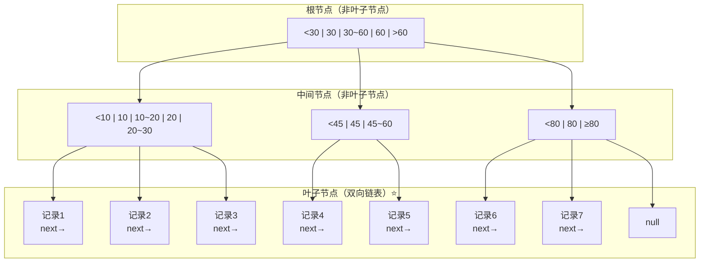
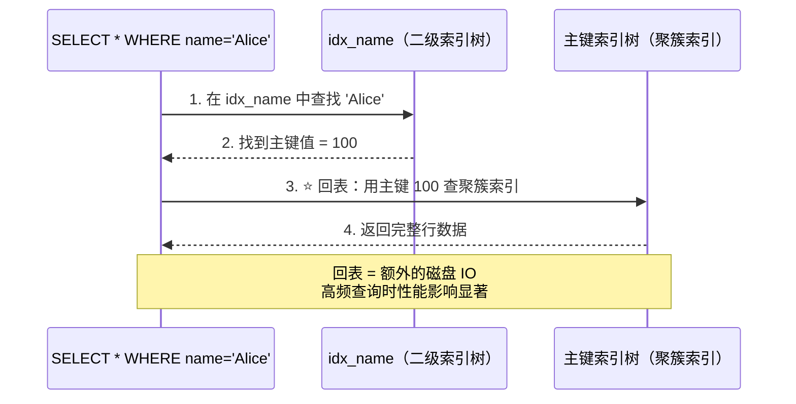
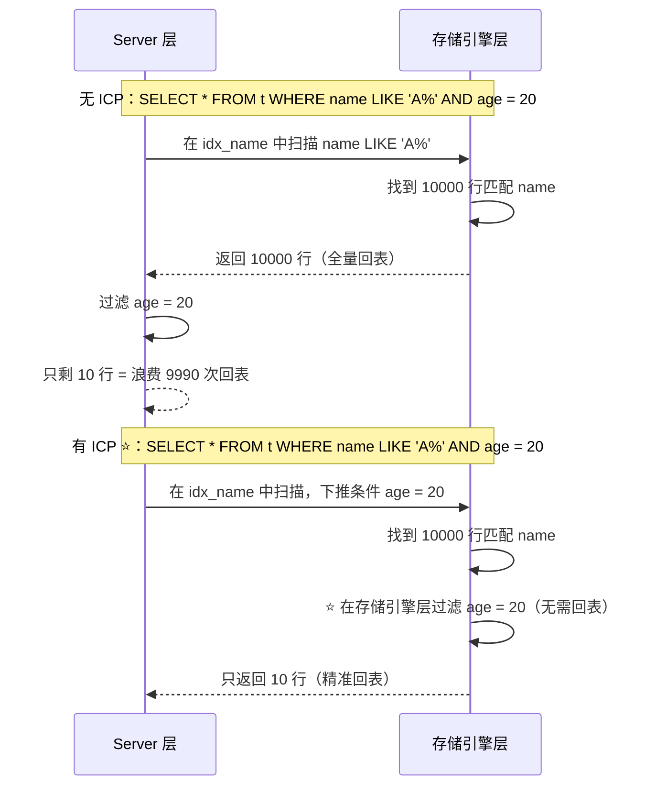

# MySQL 索引优化详解

## 概述

索引是数据库性能优化的核心手段。本章从 **B+Tree 原理** 出发，深入 **聚簇索引与非聚簇索引** 的区别，掌握 **最左前缀原则、覆盖索引、索引下推** 三大优化利器，最后通过 **EXPLAIN 详解** 让你能独立分析任何慢 SQL。

::: tip 学习目标
能够画出 B+Tree 的结构图，解释索引失效的所有场景，独立解读 EXPLAIN 输出并给出优化方案。
:::

---

## 一、B+Tree 原理

⭐ **MySQL InnoDB 默认索引结构，面试必画图。**

### 1.1 B+Tree 结构



### 1.2 B+Tree 核心特性

```
B+Tree 与 B-Tree 的关键区别：

B-Tree（B 树）：
  非叶子节点也存数据
  ├── 节点数少，高度低
  └── 范围查询需要中序遍历（多次磁盘 IO）

B+Tree（B+ 树）⭐：
  所有数据存在叶子节点
  ├── 非叶子节点只存索引（key），单个节点可存更多索引 → 高度更低
  ├── 叶子节点通过双向链表连接 → 范围查询极快
  └── 所有查询最终落到叶子节点 → 查询效率稳定（O(logN)）
```

```
InnoDB B+Tree 关键参数：

  页大小：    16KB（默认）
  一个节点 = 一个页
  
  非叶子节点存储：
    主键值（4~8字节）+ 指针（6字节）
    一个 16KB 页 ≈ 16*1024 / 14 ≈ 1170 个索引项
    
  叶子节点存储：
    完整行数据（约 1KB/行）
    一个 16KB 页 ≈ 16 行
  
  树高度计算（2千万行数据）：
    高度 3：1170 × 1170 × 16 ≈ 2千万
    即：3 次磁盘 IO 即可定位任意数据 ⭐
```

::: tip 为什么不用 B-Tree 或 Hash？

| 索引结构 | 等值查询 | 范围查询 | 排序 | 磁盘 IO |
|----------|----------|----------|------|---------|
| B+Tree | O(logN) | O(logN+M) | 天然支持 | 少（叶子链表） |
| B-Tree | O(logN) | O(NlogN) | 需额外排序 | 多（中序遍历） |
| Hash | O(1) | 不支持 | 不支持 | 最少 |
| 二叉树 | O(N) | O(N) | — | 极多（高度太高） |

Hash 索引虽然等值查询极快，但无法范围查询、无法排序、无法部分匹配，场景极其有限。
:::

### 1.3 页分裂与页合并

```
页分裂（Page Split）场景：

假设页大小为 4 条记录，主键不连续插入：

插入 10 → [10, _, _, _]
插入 30 → [10, 30, _, _]
插入 20 → [10, 20, 30, _]
插入 25 → 页已满！分裂：
  ├── 页A：[10, 20, _, _]
  └── 页B：[25, 30, _, _]

⭐ 自增主键的优势：每次插入都是追加（最右边），避免页分裂
⭐ UUID 主键的劣势：随机插入 → 频繁页分裂 → 性能下降 + 页碎片
```

::: danger 页分裂的代价
1. 磁盘 IO 翻倍（写入两个页）
2. 页利用率降低（50% 左右）
3. 产生页碎片，空间浪费
4. 影响范围查询性能（叶子链表不连续）

**解决方案**：使用自增主键，或业务主键（如订单号）保证递增。
:::

---

## 二、聚簇索引 vs 非聚簇索引

⭐ **这是理解"回表"概念的基础。**

### 2.1 聚簇索引（Clustered Index）

```
聚簇索引 = 数据本身按索引顺序存储

InnoDB 聚簇索引结构：

  B+Tree 非叶子节点：
    主键值 + 子节点指针
    
  B+Tree 叶子节点（⭐ 存完整行数据）：
    [主键] | [列1] | [列2] | [列3] | ... | [隐藏列]
    
  示例：
    主键 = 1  →  [1, '张三', 25, '北京', ...]
    主键 = 2  →  [2, '李四', 30, '上海', ...]
    主键 = 3  →  [3, '王五', 28, '广州', ...]
```

```
特点：
  1. 一张表只有一个聚簇索引（数据只能按一种顺序存储）
  2. 主键就是聚簇索引（除非没有主键，见 index.md）
  3. 叶子节点存储完整行数据
  4. 按主键查询最快（一次 B+Tree 查找即可）
```

### 2.2 非聚簇索引（二级索引 / Secondary Index）

```
非聚簇索引 = 辅助索引，叶子节点存的是主键值

结构：
  B+Tree 非叶子节点：
    索引列值 + 子节点指针
    
  B+Tree 叶子节点（⭐ 存主键值，不是行数据）：
    [索引列值] | [主键值]
    
  示例（idx_name）：
    name='Alice'  →  [Alice, 100]
    name='Bob'    →  [Bob, 200]
    name='Charlie'→  [Charlie, 150]
```

### 2.3 回表查询

⭐ **最经典的性能陷阱：索引覆盖了查询条件，但没覆盖查询结果。**



```sql
-- 回表示例
CREATE TABLE users (
    id INT PRIMARY KEY AUTO_INCREMENT,
    name VARCHAR(50),
    age INT,
    city VARCHAR(50),
    INDEX idx_name (name)       -- 二级索引：(name, id)
);

-- 这个查询会回表
SELECT * FROM users WHERE name = 'Alice';
-- 流程：idx_name 找到主键 id → 回聚簇索引取完整数据 → 返回

-- 这个查询不会回表（覆盖索引）
SELECT id, name FROM users WHERE name = 'Alice';
-- 流程：idx_name 中 name 和 id 都拿到了 → 直接返回
```

### 2.4 对比总结

```
聚簇索引 vs 非聚簇索引：

               聚簇索引              非聚簇索引
               ─────────             ──────────
数量           1个/表                多个/表
叶子节点内容   完整行数据             主键值
查询路径       直接定位数据           先找主键 → 回表
插入速度       慢（需保持物理有序）    快（只需更新索引树）
空间占用       数据本身即索引          额外索引空间
适用场景       主键查询               各种条件查询
```

---

## 三、最左前缀原则

⭐ **索引失效问题中 90% 都源于最左前缀。这是面试和调优的核心。**

### 3.1 原理

```
联合索引 (a, b, c) 在 B+Tree 中的排序规则：

  先按 a 排序 → a 相同按 b 排序 → b 相同按 c 排序

叶子节点排列：
  (1, 1, 1)
  (1, 1, 2)
  (1, 2, 1)
  (1, 2, 3)
  (2, 1, 1)
  (2, 2, 2)
  (3, 1, 1)
  ...

关键洞察：
  a 全局有序 → WHERE a = ? 能用索引
  b 在 a 确定后有序 → WHERE a = ? AND b = ? 能用索引
  c 在 a,b 确定后有序 → WHERE a = ? AND b = ? AND c = ? 能用索引
  b 单独看无序 → WHERE b = ? 无法用索引（除非 a 也参与）
```

### 3.2 实战示例

```sql
-- 联合索引：idx_abc (a, b, c)

-- ✅ 完全匹配（最左列全部使用）
SELECT * FROM t WHERE a = 1 AND b = 2 AND c = 3;
-- → 索引全命中

-- ✅ 部分匹配（从左开始连续使用）
SELECT * FROM t WHERE a = 1 AND b = 2;
-- → 索引命中 a, b（c 不参与）

-- ✅ 只有最左列
SELECT * FROM t WHERE a = 1;
-- → 索引命中 a

-- ❌ 跳过了最左列 a
SELECT * FROM t WHERE b = 2 AND c = 3;
-- → 索引完全失效！因为 b 在全局不是有序的
-- EXPLAIN 显示 type = ALL（全表扫描）

-- ❌ 跳过了中间列 b
SELECT * FROM t WHERE a = 1 AND c = 3;
-- → 索引只命中 a，c 无法使用（因为 b 不确定时 c 无序）
-- EXPLAIN 显示 key_len 只覆盖了 a 的长度

-- ✅ 范围查询后停用后续列（⭐ 重要）
SELECT * FROM t WHERE a = 1 AND b > 2 AND c = 3;
-- → 索引命中 a 和 b（范围），c 失效
-- 原因：b > 2 后，b 相同的行被取出，但 c 在 b 范围内无序

-- ✅ 范围查询若在最后，不影响
SELECT * FROM t WHERE a = 1 AND b = 2 AND c > 3;
-- → 索引全命中（a, b 等值，c 范围）

-- ✅ 等值 + IN 可以用到后续
SELECT * FROM t WHERE a = 1 AND b IN (2, 3) AND c = 4;
-- → 实际分解为：
--   a=1 AND b=2 AND c=4
--   a=1 AND b=3 AND c=4
-- 每组的 c 都能命中
```

### 3.3 key_len 验证

```sql
-- 通过 key_len 精确判断索引使用情况
EXPLAIN SELECT * FROM t WHERE a = 1 AND b = 2 AND c = 3;

-- 假设：a INT(4), b INT(4), c INT(4)，允许 NULL
-- key_len = 4 + 1(NULL) + 4 + 1(NULL) + 4 + 1(NULL) = 15 字节
-- 说明三个列全部命中

EXPLAIN SELECT * FROM t WHERE a = 1 AND c = 3;
-- key_len = 4 + 1 = 5 字节
-- 说明只有 a 列命中，c 被跳过
```

### 3.4 联合索引设计原则

```
1. ⭐ 等值查询列放最左，范围查询列放最右
   WHERE a = ? AND b > ? AND c = ? → idx(a, c, b) 比 idx(a, b, c) 更好

2. ⭐ 区分度高的列放最左
   WHERE gender = ? AND city = ?
   gender 区分度 ≈ 2（男/女），city 区分度高得多
   → idx(city, gender) 优于 idx(gender, city)

3. ⭐ 高频查询模式优先
   Q1: WHERE a = ? AND b = ?（频率 90%）
   Q2: WHERE a = ? AND c = ?（频率 10%）
   → idx(a, b, c) 或 idx(a, b) 优于 idx(a, c, b)

4. 避免冗余索引
   idx(a) + idx(a, b) → 只需 idx(a, b)（idx(a, b) 可覆盖 idx(a) 的场景）
```

---

## 四、覆盖索引

⭐ **避免回表的终极手段，性能提升显著。**

### 4.1 原理

```
覆盖索引（Covering Index）：
  查询的所有列都包含在索引中 → 无需回表

判断条件：
  SELECT 的列 + WHERE 的列 + ORDER BY 的列 + GROUP BY 的列
  全部都在同一个索引中 → 覆盖索引

EXPLAIN 标识：
  Extra 列显示 "Using index" → 覆盖索引生效
```

### 4.2 实战示例

```sql
-- 表结构
CREATE TABLE users (
    id INT PRIMARY KEY,
    name VARCHAR(50),
    age INT,
    city VARCHAR(50),
    phone VARCHAR(20),
    INDEX idx_name_age_city (name, age, city)
);

-- ❌ 需要回表（phone 不在索引中）
SELECT name, age, phone FROM users WHERE name = 'Alice';
-- Extra: NULL（需要回表取 phone）

-- ⭐ 覆盖索引（查询列全在索引中）
SELECT name, age, city FROM users WHERE name = 'Alice';
-- Extra: Using index

-- ⭐ 注意：SELECT * 永远无法覆盖索引
SELECT * FROM users WHERE name = 'Alice';
-- Extra: NULL（* 需要回表取所有列）

-- ⭐ 覆盖索引 + 范围查询
SELECT name, age FROM users WHERE name > 'Alice' AND age > 20;
-- Extra: Using index; Using where
-- 注意：虽然 age > 20 无法走索引（范围后失效），但数据仍在索引中
```

```
覆盖索引的代价：
  1. 索引变大（需要存储更多列值）
  2. 写入性能下降（每次 INSERT/UPDATE 需维护更多索引列）
  3. 内存占用增加（索引页占用 Buffer Pool）

权衡原则：
  只给高频查询建立覆盖索引，避免为每个查询都建
```

---

## 五、索引下推（ICP - Index Condition Pushdown）

⭐ **MySQL 5.6 引入的重要优化，减少回表次数。**

### 5.1 原理

```
没有 ICP 的流程：
  Server 层 → 存储引擎层 → 返回所有匹配(name)的行 → Server 层过滤(age)

  问题：name 匹配了 10000 行，但 age 过滤后只剩 10 行
        9900 次回表是浪费的！

有 ICP 的流程（⭐）：
  Server 层 → 存储引擎层 → 存储引擎层先行过滤(name + age)
         → 只返回 10 行给 Server 层

  优势：把 age 的过滤条件"下推"到存储引擎层
        减少回表次数 = 减少磁盘 IO
```



### 5.2 实战示例

```sql
-- 联合索引：idx_name_age (name, age)

-- ⭐ ICP 生效场景
EXPLAIN SELECT * FROM users 
WHERE name LIKE '张%' AND age = 25;
-- Extra: Using index condition
-- 说明：name 范围查询后 age 无法走索引，但 age 条件被下推

-- ICP 不生效的场景
EXPLAIN SELECT * FROM users 
WHERE name LIKE '%张%' AND age = 25;
-- name 前导通配符 → 索引完全失效 → ICP 无意义

-- 覆盖索引 + ICP 不共存
EXPLAIN SELECT name, age FROM users 
WHERE name LIKE '张%' AND age = 25;
-- Extra: Using where; Using index
-- 覆盖索引已经全在索引树中完成，无需 ICP
```

::: tip ICP 生效条件
1. 查询使用了二级索引
2. WHERE 条件中部分列无法使用索引（范围查询后的列）
3. 需要回表查询（非覆盖索引）
4. `index_condition_pushdown = ON`（默认开启）
:::

---

## 六、EXPLAIN 详解

⭐ **DBA 和高级开发者的必备技能，读懂 EXPLAIN 就能定位 90% 的慢查询问题。**

### 6.1 输出列速查

```sql
EXPLAIN SELECT * FROM users WHERE name = 'Alice' AND age > 20;
```

| 列名 | 含义 | 关注度 |
|------|------|--------|
| id | 查询序号（SUBQUERY/JOIN 时用到） | 中 |
| select_type | 查询类型（SIMPLE/SUBQUERY/DERIVED） | 中 |
| table | 访问的表名 | 低 |
| partitions | 分区信息 | 低 |
| **type** ⭐ | 访问方法（性能从好到差） | **极高** |
| possible_keys | 候选索引 | 中 |
| **key** ⭐ | 实际使用的索引 | **高** |
| key_len | 索引使用字节数 | 高 |
| ref | 与索引比较的列/常量 | 中 |
| **rows** ⭐ | 预估扫描行数 | **高** |
| filtered | 按条件过滤后的行数百分比 | 中 |
| **Extra** ⭐ | 额外信息（Using index/filesort/temporary） | **极高** |

### 6.2 type 访问类型（⭐ 核心）

::: danger 性能从好到差排序
**system > const > eq_ref > ref > range > index > ALL**
:::

```
⭐ system（极少见）
  表只有一行数据（系统表）
  实际生产中几乎看不到

⭐ const（主键/唯一索引等值查询）
  SELECT * FROM t WHERE id = 1;  -- 主键
  SELECT * FROM t WHERE uk = 'x';  -- 唯一索引
  最多返回一行，速度极快

⭐ eq_ref（Join 时，驱动表的每行匹配被驱动表一行）
  SELECT * FROM t1 JOIN t2 ON t1.id = t2.id;  -- 主键Join
  t2 的 type = eq_ref（通过主键唯一匹配）

⭐ ref（普通索引等值查询）
  SELECT * FROM t WHERE name = 'Alice';  -- 普通索引
  可能返回多行

⭐ range（索引范围扫描）
  SELECT * FROM t WHERE id > 10;         -- 主键范围
  SELECT * FROM t WHERE name LIKE 'A%';  -- 索引前缀范围
  SELECT * FROM t WHERE id IN (1,2,3);   -- IN 查询

⭐ index（全索引扫描）
  SELECT name FROM t ORDER BY name;
  扫描整个索引树（比全表扫描好，因为索引小）

❌ ALL（全表扫描，最差）
  SELECT * FROM t WHERE name LIKE '%张%';  -- 前导通配符
  SELECT * FROM t WHERE age + 1 = 20;      -- 索引列参与计算
```

### 6.3 Extra 关键信息

| Extra 值 | 含义 | 优化方向 |
|----------|------|----------|
| ⭐ **Using index** | 覆盖索引，无需回表 | 好，保持 |
| **Using index condition** | 索引下推生效 | 好，MySQL 5.6+ 自动优化 |
| **Using where** | Server 层过滤（非索引条件） | 检查是否可优化为索引条件 |
| ❌ **Using filesort** | 额外排序（未利用索引排序） | 建排序索引，消除 filesort |
| ❌ **Using temporary** | 使用临时表（GROUP BY/DISTINCT） | 优化索引，避免临时表 |
| ❌ **Using join buffer** | Join 使用了 Join Buffer（BNL 算法） | 给被驱动表加索引 |
| **Using index for group-by** | 索引用于 GROUP BY（松散/紧凑扫描） | 好 |

### 6.4 实战案例

```sql
-- 准备测试表
CREATE TABLE orders (
    id INT PRIMARY KEY AUTO_INCREMENT,
    user_id INT NOT NULL,
    status TINYINT NOT NULL,
    amount DECIMAL(10,2),
    created_at DATETIME,
    INDEX idx_user_status (user_id, status),
    INDEX idx_created (created_at)
);

-- ===== 案例 1：最左前缀失效 =====
EXPLAIN SELECT * FROM orders WHERE status = 1;
-- +----+------+------+-------+---------+
-- | type  | key          | rows   | Extra       |
-- +----+------+------+-------+---------+
-- | ALL   | NULL         | 100000 | Using where |  ❌
-- +----+------+------+-------+---------+
-- 问题：status 不是最左列，全表扫描
-- 优化：建 idx_status 或调整为 idx_status_user
--       或改为 WHERE user_id = ? AND status = 1

-- ===== 案例 2：函数导致索引失效 =====
EXPLAIN SELECT * FROM orders WHERE DATE(created_at) = '2024-06-06';
-- +----+------+------+-------+---------+
-- | type  | key          | rows   | Extra       |
-- +----+------+------+-------+---------+
-- | ALL   | NULL         | 100000 | Using where |  ❌
-- +----+------+------+-------+---------+
-- 问题：对索引列使用函数，索引失效
-- 优化：改为范围查询
SELECT * FROM orders 
WHERE created_at >= '2024-06-06' AND created_at < '2024-06-07';

-- ===== 案例 3：隐式类型转换 =====
EXPLAIN SELECT * FROM orders WHERE user_id = '1001';
-- 注意：user_id 是 INT，'1001' 是 VARCHAR
-- 如果 user_id 是 VARCHAR，‘1001’ 是 INT → 索引失效！
-- 本项目 user_id 是 INT，字符串会自动转为 INT → 索引正常

-- ===== 案例 4：filesort 优化 =====
EXPLAIN SELECT * FROM orders 
WHERE user_id = 1 ORDER BY created_at;
-- +----+------+---------+------+----------------+
-- | type  | key              | rows | Extra                  |
-- +----+------+---------+------+----------------+
-- | ref   | idx_user_status  | 50   | Using filesort  ❌      |
-- +----+------+---------+------+----------------+
-- 问题：ORDER BY 的列不在索引中
-- 优化：建索引 idx_user_created(user_id, created_at)

-- ===== 案例 5：覆盖索引优化 =====
-- 慢查询
EXPLAIN SELECT * FROM orders WHERE user_id = 1 AND status = 1;
-- type=ref, Extra=NULL（需要回表）

-- 优化后
EXPLAIN SELECT user_id, status FROM orders 
WHERE user_id = 1 AND status = 1;
-- type=ref, Extra=Using index ⭐（覆盖索引）
```

---

## 七、索引失效场景汇总

⭐ **面试必考的 10 大索引失效场景。**

| 序号 | 场景 | 示例 | 原因 |
|------|------|------|------|
| 1 | ⭐ 违反最左前缀 | `WHERE b = 2`（联合索引 a,b,c） | b 在全局无序 |
| 2 | ⭐ 前导通配符 | `LIKE '%abc'` | B+Tree 无法匹配前缀 |
| 3 | ⭐ 索引列计算 | `WHERE age + 1 = 20` | 索引存的是 age，不是 age+1 |
| 4 | ⭐ 索引列函数 | `WHERE DATE(created) = '2024-01-01'` | 同上 |
| 5 | 隐式类型转换 | `WHERE phone = 13800138000`（phone 是 VARCHAR） | 索引存的是字符串 |
| 6 | OR 包含非索引列 | `WHERE a = 1 OR b = 2`（b 无索引） | 需要全表扫描判断 b |
| 7 | NOT / != / <> | `WHERE status != 1` | 大多数情况走全表扫描 |
| 8 | IS NULL / IS NOT NULL | 取决于数据分布和优化器选择 | NULL 值不被索引存储 |
| 9 | 范围查询后列失效 | `WHERE a = 1 AND b > 10 AND c = 3` | b 范围后 c 无序 |
| 10 | 联合索引区分度低 | `WHERE gender = 1`（性别区分度 ≈ 2） | 优化器可能选择全表扫描 |

```sql
-- 场景 9 的详细说明（面试高频）
-- 联合索引 idx_abc (a, b, c)

-- 等值 + 范围：范围后的列停止索引
SELECT * FROM t WHERE a = 1 AND b > 10 AND c = 3;
-- key_len 只覆盖 a 和 b，c 不参与索引

-- 范围在最后：全部命中
SELECT * FROM t WHERE a = 1 AND b = 10 AND c > 3;
-- key_len 覆盖 a, b, c

-- 优化思路：把范围列放最后
-- 原索引 idx(a, b, c) 改为 idx(a, c, b)
-- WHERE a = 1 AND b > 10 AND c = 3 → 等价于 idx(a, c, b) 下 a=1, c=3 都用上
```

---

## 八、面试追问合集

### Q1: 为什么建议使用自增主键？

::: details 答案

1. **顺序插入，避免页分裂**：UUID 随机插入导致页分裂，B+Tree 频繁重平衡，性能下降
2. **空间效率**：INT(4字节) / BIGINT(8字节) 远小于 UUID 字符串(36字节)，二级索引叶子节点存储主键值，主键越小，二级索引越小
3. **缓存友好**：顺序插入 → 相邻数据在同一页 → Buffer Pool 命中率高
4. **写入性能**：自增主键每次插入到最右叶子节点，减少磁盘随机 IO

**例外**：分布式场景需要全局唯一 ID，可考虑雪花算法（Snowflake，趋势递增）或数据库号段方案。
:::

### Q2: 联合索引 (a, b, c) 可以替代哪些索引？

::: details 答案

```
索引 (a, b, c) 可以替代：
  ✅ (a)          — 最左前缀
  ✅ (a, b)       — 最左前缀
  
  不能替代：
  ❌ (b)          — 不满足最左前缀
  ❌ (b, c)       — 同上
  ❌ (c)          — 同上
  ❌ (a, c)       — 部分替代（a 可用，c 不可用）

特殊情况：
  (a, b, c) 对于 WHERE a = ? ORDER BY c → 需要 filesort
  (a, c, b) 对于 WHERE a = ? ORDER BY c → 索引天然有序
```
:::

### Q3: EXPLAIN 中 rows 是准确值吗？

::: details 答案

**不是**。rows 是**估算值**，基于统计信息（`innodb_stats_persistent`）计算得出。

```
统计信息来源：
  - 采样分析（默认采样 20 个随机页）
  - 可通过 ANALYZE TABLE t 手动更新统计信息
  - 统计信息可能不准确（特别是刚批量插入大量数据后）

生产建议：
  - 定期 ANALYZE TABLE（维护窗口执行）
  - 关注 rows 相对于实际行数的比例，而非绝对值
  - 结合 type 和 Extra 综合判断
```
:::

### Q4: 索引下推和覆盖索引有什么区别？

::: details 答案

| 维度 | 索引下推（ICP） | 覆盖索引 |
|------|----------------|----------|
| 解决问题 | 减少回表次数 | 消除回表 |
| 原理 | 存储引擎层过滤 | 索引包含所有需要的列 |
| SELECT 列 | 包含非索引列（必须回表） | 全部在索引中 |
| Extra 标识 | Using index condition | Using index |
| 性能 | 优于普通查询，差于覆盖索引 | 最优 |

```
关系：非包含关系，但可共存
  - ICP 存在时，说明没有覆盖索引（需要回表）
  - 覆盖索引存在时，ICP 无意义（已无需回表）
```
:::

### Q5: 什么情况下索引反而会降低性能？

::: details 答案

1. **写多读少**：每次 INSERT/UPDATE/DELETE 都需要维护索引，索引越多代价越大
2. **数据量小**：全表扫描比走索引更快（减少一次 B+Tree 查找）
3. **区分度低**：如 `gender` 只有 0/1，索引无意义，优化器可能直接跳过
4. **索引过多**：占用磁盘空间和 Buffer Pool，降低缓存命中率
5. **冗余索引**：`idx(a)` + `idx(a,b)` 同时存在，浪费空间

```
生产建议：
  - 单表索引数量控制在 5 个以内
  - 定期检查冗余索引：pt-duplicate-key-checker
  - 监控未使用的索引：sys.schema_unused_indexes（MySQL 8.0）
```
:::

---

## 九、生产实践速查

::: tip EXPLAIN 优化决策树

```
EXPLAIN 结果出来 → 先看 type → 再看 Extra → 再看 rows

type = ALL（全表扫描）
  ├── 有索引但没用 → 检查索引失效原因（最左前缀/函数/类型转换）
  ├── 没索引 → 建索引
  └── 数据量太小 → 可以不优化

type = ref / range（索引正常）
  ├── Extra = Using filesort → 优化 ORDER BY（建联合索引覆盖排序）
  ├── Extra = Using temporary → 优化 GROUP BY/DISTINCT
  ├── Extra = NULL → 检查是否需要覆盖索引
  └── Extra = Using index → 已经是覆盖索引，无需优化

type = index（全索引扫描）
  └── 检查是否可以加 WHERE 条件转为 range
```
:::

::: danger 索引优化核心原则
1. **等值条件放前面，范围条件放后面**（联合索引列顺序）
2. **高频查询优先建覆盖索引**
3. **避免 SELECT ***（永远无法覆盖索引）
4. **单表索引 3~5 个最佳**
5. **区分度高的列优先建索引**
6. **定期分析慢查询日志，持续优化**
:::