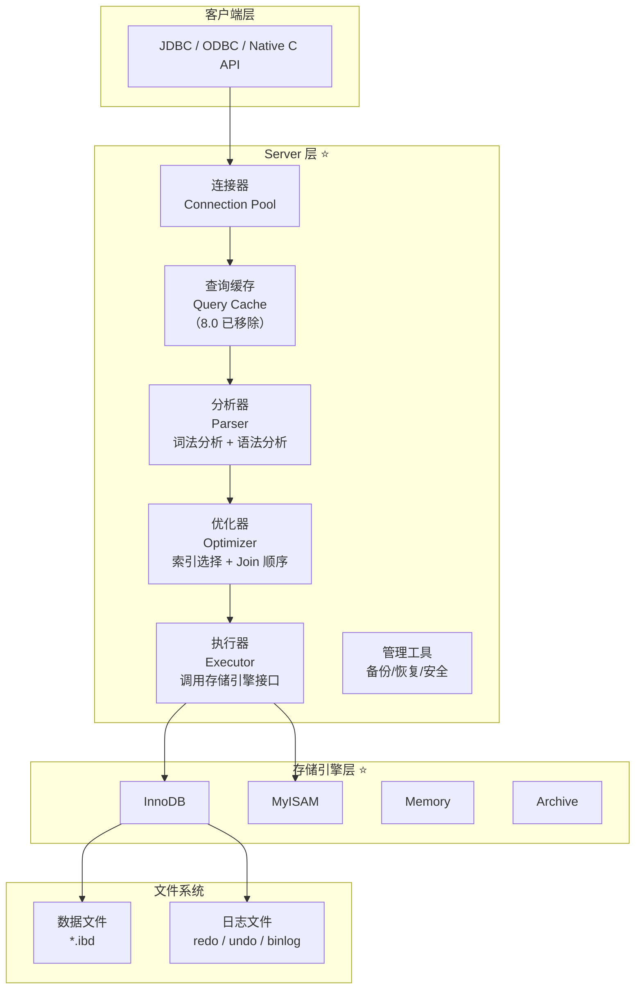
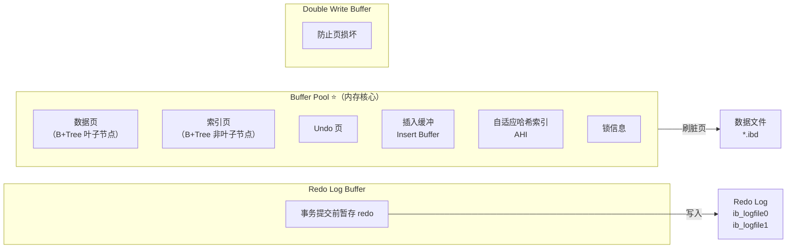
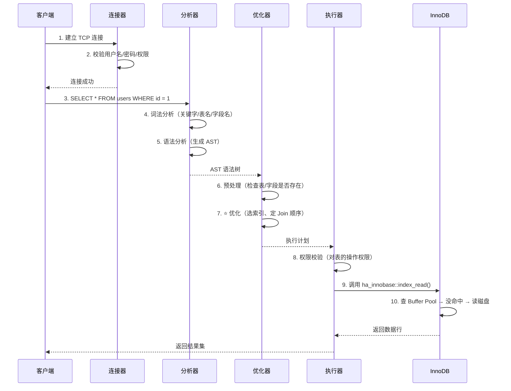
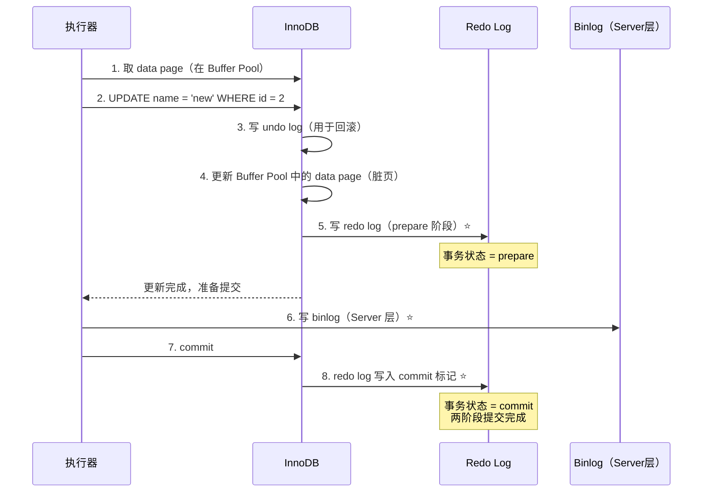

# MySQL 核心原理

## 概述

MySQL 是互联网行业使用最广泛的关系型数据库，面试中几乎必问。本章从三个维度切入：**架构概览**（全局视角）、**存储引擎对比**（选型决策）、**SQL 执行流程**（调优基础），帮助你建立完整的 MySQL 知识框架。

::: tip 学习目标
能够画出 MySQL 整体架构图，说清一条 SQL 从客户端到存储引擎的完整路径，并根据业务场景选择合适的存储引擎。
:::

---

## 一、架构概览

⭐ **MySQL 采用插件式存储引擎架构，Server 层与存储引擎层分离。**



### 1.1 各组件职责

| 组件 | 职责 | 关键点 |
|------|------|--------|
| **连接器** | 建立连接、权限验证、维持连接 | `wait_timeout` 默认 8 小时；长连接导致 OOM |
| **查询缓存** | SQL 与结果集的 KV 映射 | MySQL 8.0 彻底移除（弊大于利） |
| **分析器** | 词法分析 + 语法分析 | 将 SQL 解析为 AST（抽象语法树） |
| **优化器** | 选择索引、决定 Join 顺序 | ⭐ 核心：基于成本模型（CBO）选择执行计划 |
| **执行器** | 调用存储引擎 API 逐行操作 | 返回结果前做权限校验 |
| **存储引擎** | 数据读写、事务管理、锁控制 | 插件式架构，可动态切换 |

::: warning 面试追问
**Q: 为什么 MySQL 8.0 移除了查询缓存？**

A: 查询缓存的失效非常频繁——只要表上有任何更新，这张表的整个查询缓存都会被清空。在写密集型业务中（如秒杀、交易系统），命中率极低反而增加了维护开销。推荐业务层使用 Redis 替代。
:::

---

## 二、存储引擎对比：InnoDB vs MyISAM

⭐ **这是面试中的"送分题"，必须烂熟于心。**

### 2.1 核心对比表

| 对比维度 | InnoDB（⭐ 默认引擎） | MyISAM |
|----------|----------------------|--------|
| **事务支持** | 支持 ACID（MVCC + redo/undo log） | 不支持 |
| **锁粒度** | 行级锁（通过索引实现） | 表级锁 |
| **外键** | 支持 | 不支持 |
| **崩溃恢复** | 支持（redo log 崩溃恢复） | 不支持（崩溃后需手动修复） |
| **MVCC** | 支持（RC/RR 隔离级别） | 不支持 |
| **索引结构** | 聚簇索引（数据即索引） | 非聚簇索引（索引与数据分离） |
| **数据文件** | `.ibd`（表空间） | `.MYD`（数据）+ `.MYI`（索引） |
| **全文索引** | 5.6 开始支持 | 原生支持 |
| **count(*)** | 需要遍历（MVCC 导致无计数器） | `O(1)`（维护了行计数器） |
| **压缩** | 页级压缩（`COMPRESSED` 行格式） | 表压缩（`myisampack`） |
| **适用场景** | OLTP（高并发读写） | 读多写少、日志记录、数据仓库 |

### 2.2 MyISAM 的"快"是真的吗？

```
场景类比：MyISAM 就像没有交规的马路——看着快，一出事故全堵死。

MyISAM 的优势场景：
  纯 SELECT 查询（无并发写）
  count(*) 极快（维护行计数器）
  
MyISAM 的致命缺陷：
  写操作加表锁 → 所有读被阻塞 → 并发性能崩塌
  无崩溃恢复 → 断电丢数据
```

::: danger 生产事故案例
某电商平台早期使用 MyISAM 存储商品表。大促期间，运营批量更新商品价格（UPDATE 加表锁），导致所有用户浏览商品详情页（SELECT）全部阻塞，整个交易线瘫痪。

**教训：OLTP 场景一律用 InnoDB。**
:::

### 2.3 如何选择存储引擎

```sql
-- 查看当前数据库支持的引擎
SHOW ENGINES;

-- 查看某张表的引擎
SHOW TABLE STATUS LIKE 'orders';

-- 修改表的存储引擎
ALTER TABLE orders ENGINE = InnoDB;
```

| 业务场景 | 推荐引擎 | 原因 |
|----------|---------|------|
| 订单、交易、用户系统 | **InnoDB** | 需要事务 + 行锁 + 崩溃恢复 |
| 日志记录、审计流水 | **MyISAM** 或 **Archive** | 只追加不修改，Archive 压缩率极高 |
| 临时统计表、Session | **Memory** | 数据重启丢失，适合临时计算 |
| 全文搜索 | **InnoDB / Elasticsearch** | 大型全文搜索用 ES 更专业 |

### 2.4 InnoDB 内存结构概览



::: tip Buffer Pool 调优关键参数
```sql
-- 通常设置为物理内存的 50% ~ 80%
SET GLOBAL innodb_buffer_pool_size = 8G;

-- 允许多个 Buffer Pool 实例，减少并发竞争（MySQL 5.6+）
SET GLOBAL innodb_buffer_pool_instances = 8;
```
:::

---

## 三、一条 SQL 的执行流程

⭐ **这是面试中展现"系统性理解"的高光题，要从连接建立讲到磁盘 IO。**

### 3.1 查询语句执行流程



### 3.2 更新语句执行流程（含两阶段提交）

⭐ **更新涉及 redo log（存储引擎层）+ binlog（Server 层），两者协调使用"两阶段提交"。**



::: danger 为什么需要两阶段提交？

**问题**：如果先写 redo log 再写 binlog，或反过来，崩溃恢复后 redo log 和 binlog 不一致，导致主从数据不一致。

**方案**：两阶段提交保证 redo log 和 binlog 的逻辑一致。

```
崩溃恢复判断逻辑：

重启时扫描 redo log：
  - 有 prepare + commit 标记 → 事务已提交，直接恢复
  - 有 prepare 但无 commit 标记 → 检查 binlog
    - binlog 完整 → 提交事务（redo log 补 commit）
    - binlog 不完整 → 回滚事务（undo log 回滚）
```
:::

### 3.3 优化器做了什么？

```sql
-- 示例：多索引下的选择
CREATE TABLE users (
    id INT PRIMARY KEY,
    name VARCHAR(50),
    age INT,
    INDEX idx_name (name),
    INDEX idx_age (age)
);

-- 优化器决策：走哪个索引？
EXPLAIN SELECT * FROM users WHERE name = 'Alice' AND age > 20;
```

优化器的工作：

| 优化类型 | 说明 | 示例 |
|----------|------|------|
| **索引选择** | 基于统计信息（基数/选择性）选最优索引 | `possible_keys` vs `key` |
| **Join 顺序** | 小表驱动大表（选数据量最小的作为驱动表） | t1(10行) JOIN t2(100万行) → 先扫 t1 |
| **Join 算法** | NLJ（有索引） / BNL（无索引） / BKA（5.6+ 批量取） | 详见 Join 优化章节 |
| **子查询优化** | 子查询转 semi-join（半连接）或物化 | `IN` 子查询被优化为 `EXISTS` |
| **条件下推** | 索引条件下推（ICP） | 减少回表次数 |

---

## 四、面试追问合集

### Q1: InnoDB 的一行数据最多能存多少字节？

::: details 答案
一行数据必须存放在一个数据页（默认 16KB）内。行溢出机制可以将大的 VARCHAR/TEXT/BLOB 字段溢出到额外的页中，主记录保留 768 字节前缀 + 20 字节溢出页指针。

```
行格式影响存储上限：
- COMPACT：前 768 字节在主记录，其余溢出
- DYNAMIC（5.7 默认）：全部溢出，主记录只保留 20 字节指针
- COMPRESSED：类似 DYNAMIC + 页级压缩
```
:::

### Q2: InnoDB 的表如果既没有主键也没有唯一索引，会发生什么？

::: details 答案
InnoDB 必须有聚簇索引作为数据存储的载体。策略如下：

1. 如果有主键 → 主键就是聚簇索引
2. 如果没有主键但有 NOT NULL 的唯一索引 → 第一个这样的唯一索引成为聚簇索引
3. 如果都没有 → InnoDB 自动生成一个隐藏的 6 字节 `ROW_ID` 作为聚簇索引

**生产建议**：永远显式定义主键，推荐自增 ID（顺序插入）或业务主键（避免回表）。
:::

### Q3: MySQL 的 `max_connections` 设置多大合适？

::: details 答案
```
公式：max_connections = (可用内存 - 系统预留) / 单连接内存消耗

单连接内存消耗 ≈ sort_buffer_size + join_buffer_size + read_buffer_size + 线程栈

例如：
  服务器内存 16G，系统预留 4G
  可用 = 12G
  单连接 ≈ 2M + 1M + 1M + 1M = 5M
  max_connections ≈ 12G / 5M ≈ 2450

实际生产建议：200~500（留足安全余量，避免 OOM）
```
:::

---

## 五、生产实践建议

::: tip 黄金法则
1. **所有 OLTP 表统一使用 InnoDB**，除非有特殊需求
2. **Buffer Pool 设置为物理内存的 60%（专用服务器）**，80%（混合服务器）
3. **线上禁止 `SELECT *`**，只查需要的列
4. **关闭查询缓存（8.0 已移除）**，用 Redis 做缓存层
5. **`innodb_flush_log_at_trx_commit = 1`**（强一致场景）/ `= 2`（允许断电丢 1 秒数据，性能提升显著）
6. **连接管理**：使用连接池（HikariCP / Druid），避免短连接风暴
:::

---

## 相关文档

- [索引优化详解](./index-optimization.md)