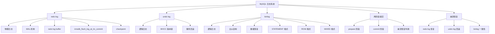

# 日志系统

## 概述
MySQL 日志系统是保证数据持久性、一致性以及实现故障恢复和主从复制的核心基础设施。本模块深入分析 redo log、undo log、binlog 三种日志的写入机制、两阶段提交协议、崩溃恢复流程，以及 binlog 三种格式的对比与选型。

---

## 一、知识图谱



---

## 二、基础到进阶学习路线

- **阶段一：基础入门** —— 理解三种日志的基本概念（redo/undo/binlog 分别是什么、存在哪里、做什么用），掌握 `innodb_flush_log_at_trx_commit` 和 `sync_binlog` 两个关键参数。
- **阶段二：原理深入** —— 理解两阶段提交的完整流程（prepare/persist/commit），掌握崩溃恢复时 redo log 和 binlog 的协调机制，理解 undo log 在 MVCC 和回滚中的双重角色。
- **阶段三：实战优化** —— 根据业务场景选择合理的刷盘策略，binlog 格式选型，误删数据恢复，日志相关性能调优。

---

## 三、核心知识详解

### 3.1 redo log（重做日志）

#### 什么是 redo log？

redo log 是 InnoDB 存储引擎层的**物理日志**，记录的是"数据页上做了什么修改"。它保证事务的**持久性（Durability）**。

#### WAL（Write-Ahead Logging）机制

```
修改流程：
1. 修改 Buffer Pool 中的数据页（脏页）
2. 写入 redo log buffer
3. 事务提交时，将 redo log 刷到磁盘
4. 后台线程异步将脏页刷到磁盘（checkpoint）
```

::: tip WAL 核心思想
先写日志，后写数据。即使数据页还没刷到磁盘，只要 redo log 持久化了，崩溃后就能通过 redo log 恢复数据。
:::

#### 关键参数：`innodb_flush_log_at_trx_commit`

| 值 | 含义 | 性能 | 安全性 |
|----|------|------|--------|
| **0** | 每秒将 redo log buffer 刷到磁盘（OS cache）并 fsync | 最高 | 可能丢失 1 秒数据 |
| **1**（默认） | 每次提交都刷到磁盘并 fsync | 最低 | 不丢数据 |
| **2** | 每次提交写到 OS cache，每秒 fsync | 中等 | MySQL 宕机不丢，OS 宕机丢 1 秒 |

```sql
-- 查看与设置
SHOW VARIABLES LIKE 'innodb_flush_log_at_trx_commit';
SET GLOBAL innodb_flush_log_at_trx_commit = 1;
```

#### redo log 的循环写结构

```
redo log 文件（固定大小，如 ib_logfile0、ib_logfile1）

[ checkpoint LSN ]  ────> [ write pos ]  ────> [ checkpoint LSN ]
     ↑                        ↑                      ↑
   已刷盘                   正在写入                待覆盖

write pos 追上 checkpoint → 需要强制刷脏页（checkpoint 推进）
```

#### checkpoint 机制

checkpoint 的作用是将 Buffer Pool 中的脏页刷到磁盘，推进 redo log 的 checkpoint 位置，释放 redo log 空间。

两种 checkpoint：
- **Sharp Checkpoint**：全部脏页刷盘，发生在关闭数据库时
- **Fuzzy Checkpoint**：部分脏页刷盘，后台持续进行

### 3.2 undo log（回滚日志）

#### 什么是 undo log？

undo log 是 InnoDB 存储引擎层的**逻辑日志**，记录的是"修改前的数据"，用于事务**回滚（原子性）**和 **MVCC（一致性读）**。

#### undo log 的双重作用

| 作用 | 说明 |
|------|------|
| **事务回滚** | 将数据恢复到修改前的状态 |
| **MVCC 快照读** | 通过 undo log 版本链，其他事务可以读到历史版本 |

#### undo log 的存储

```
undo log 存储在 undo 表空间中（MySQL 8.0 默认独立表空间）

undo 表空间
  ├── rollback segment 1
  │     ├── undo slot 1
  │     └── undo slot 2
  ├── rollback segment 2
  └── ...
```

```sql
-- 查看 undo 表空间配置
SHOW VARIABLES LIKE 'innodb_undo%';
-- innodb_undo_tablespaces: 默认 2
-- innodb_undo_directory: 存储路径
```

#### undo log 的清理

undo log 不能无限增长。当事务提交后，undo log 不再需要用于回滚，但如果有其他事务的 ReadView 还在引用它，就还不能删除。InnoDB 有专门的 purge 线程负责清理不再需要的 undo log。

### 3.3 binlog（二进制日志）

#### 什么是 binlog？

binlog 是 MySQL Server 层的**逻辑日志**，记录的是所有可能引起数据变更的 SQL 语句（或行变更）。它用于**主从复制**和**基于时间点的数据恢复**。

#### binlog 与 redo log 的核心区别

| 维度 | redo log | binlog |
|------|----------|--------|
| **所属层** | InnoDB 存储引擎层 | MySQL Server 层 |
| **日志类型** | 物理日志（数据页修改） | 逻辑日志（SQL 或行变更） |
| **写入方式** | 循环写（固定大小） | 追加写（文件滚动） |
| **用途** | 崩溃恢复（crash-safe） | 主从复制、数据恢复 |
| **记录内容** | "在页 N 偏移 M 处写入值 V" | "UPDATE users SET name='X' WHERE id=1" |

#### binlog 三种格式

| 格式 | 记录方式 | 优点 | 缺点 |
|------|---------|------|------|
| **STATEMENT** | 记录 SQL 语句原文 | 日志量小 | 主从不一致风险（UUID、NOW()等） |
| **ROW**（推荐） | 记录每行数据变更 | 主从一致性好 | 日志量大（UPDATE/DELETE 全表时） |
| **MIXED** | 默认 STATEMENT，必要时 ROW | 折中 | 判断逻辑复杂，不够透明 |

```sql
-- 查看 binlog 格式
SHOW VARIABLES LIKE 'binlog_format';

-- 查看 binlog 文件列表
SHOW BINARY LOGS;

-- 查看 binlog 内容
mysqlbinlog --base64-output=DECODE-ROWS -v mysql-bin.000001
```

#### binlog 写入策略

```sql
-- sync_binlog 控制 binlog 刷盘策略
-- 0：由 OS 决定何时 fsync（性能最优，可能丢日志）
-- 1：每次提交都 fsync（默认，不丢日志）
-- N：每 N 次提交后 fsync

SHOW VARIABLES LIKE 'sync_binlog';
SET GLOBAL sync_binlog = 1;
```

::: danger 关键配置建议
 **`innodb_flush_log_at_trx_commit = 1` + `sync_binlog = 1`** = 双 1 配置，保证数据不丢失。这是金融级场景的标准配置，但会牺牲写入性能。非关键业务可适当放宽。
:::

#### binlog 的 row_image 参数

```sql
-- MySQL 5.7+ 支持控制 ROW 格式下记录的前镜像/后镜像
-- FULL（默认）：记录所有列的前后值
-- MINIMAL：只记录变更列和主键
-- NOBLOB：不记录未变更的 BLOB/TEXT 列

SET GLOBAL binlog_row_image = MINIMAL;
```

### 3.4 两阶段提交

#### 为什么需要两阶段提交？

redo log 和 binlog 是两个独立的日志系统。如果先写 binlog 再写 redo log，或反过来，崩溃时可能导致两个日志不一致：

- 如果 redo log 写了但 binlog 没写：主库通过 redo log 恢复了数据，但 binlog 没有这条记录，从库缺失数据
- 如果 binlog 写了但 redo log 没写：从库通过 binlog 同步了数据，但主库崩溃恢复后数据丢失

#### 两阶段提交流程

```
事务提交过程：

Phase 1 - Prepare（准备阶段）：
  1. 写入 redo log，标记为 prepare 状态
  2. 此时 redo log 中记录了事务 ID 和 binlog 位置

Phase 2 - Commit（提交阶段）：
  3. 写入 binlog（此时 binlog 记录了完整的事务信息）
  4. 将 redo log 中的事务标记为 commit 状态
```

```
时间线：

  ┌──────────┐     ┌──────────┐     ┌──────────┐
  │ 写 redo  │ ──> │ 写 binlog │ ──> │ 标记     │
  │ (prepare)│     │          │     │ commit   │
  └──────────┘     └──────────┘     └──────────┘
      Phase 1         Phase 2.1       Phase 2.2
```

#### 崩溃恢复判断逻辑

```
崩溃恢复时，扫描 redo log 中 prepare 状态的事务：

1. 若 binlog 中也有该事务 → 提交（redo log 标记为 commit）
2. 若 binlog 中没有该事务 → 回滚（undo log 回滚数据）

这样保证了：
- redo log 和 binlog 的一致性
- 主从数据的一致性
```

#### 组提交（Group Commit）

MySQL 5.6+ 引入组提交优化，将多个事务的刷盘操作合并为一次，减少 fsync 次数：

```
三阶段组提交：
  Flush 阶段 → 批量刷 redo log
  Sync 阶段   → 批量刷 binlog
  Commit 阶段 → 批量标记 commit
```

```sql
-- 组提交相关参数
SHOW VARIABLES LIKE 'binlog_group_commit_sync_delay';      -- 延迟等待微秒数
SHOW VARIABLES LIKE 'binlog_group_commit_sync_no_delay_count';  -- 累积事务数阈值
```

### 3.5 崩溃恢复流程

```
MySQL 启动 → 崩溃恢复流程：

Step 1: redo log 恢复
  - 从最后一个 checkpoint 开始，应用 redo log 到数据页
  - 此时所有已提交和未提交的事务修改都被恢复

Step 2: undo log 回滚
  - 扫描 redo log 中 prepare 状态的事务
  - 结合 binlog 判断哪些事务需要回滚
  - 通过 undo log 回滚未提交的事务

Step 3: 清理
  - 释放 undo 段
  - 更新 checkpoint
```

### 3.6 一条 UPDATE 语句的完整日志流程

```
UPDATE users SET name = 'Bob' WHERE id = 1;

执行流程与日志写入：

1. 执行器调用 InnoDB 接口，找到 id=1 的行
2. 将数据页加载到 Buffer Pool
3. 记录 undo log（旧值 'Alice'）        ← 逻辑日志
4. 修改 Buffer Pool 中的数据页（name='Bob'）
5. 记录 redo log（页修改）              ← 物理日志
6. 准备提交：
   a. redo log 写入 prepare 状态        ← 两阶段提交 Phase 1
   b. binlog 写入（记录行变更）          ← 逻辑日志
   c. redo log 标记 commit              ← 两阶段提交 Phase 2
7. 返回客户端"更新成功"
```

---

## 四、经典应用场景与解决方案

### 场景一：误删数据恢复

**问题背景**：运维人员误执行 `DELETE FROM orders WHERE id < 10000`，删除了 5000 条数据，需要恢复。

**方案一：利用 binlog 闪回**

```bash
# 1. 找到误删操作对应的 binlog 文件和位置
mysqlbinlog --start-datetime="2024-01-15 14:00:00" \
            --stop-datetime="2024-01-15 14:05:00" \
            --base64-output=DECODE-ROWS -v mysql-bin.000010 > binlog.txt

# 2. 使用工具将 DELETE 反转为 INSERT
# 推荐工具：MyFlash（美团开源）、binlog2sql
python binlog2sql.py -h localhost -P 3306 -u root \
  --start-file='mysql-bin.000010' \
  --start-position=1234 --stop-position=5678 \
  -d test -t orders --sql-type=DELETE -B > rollback.sql

# 3. 执行回滚 SQL
mysql -u root < rollback.sql
```

**方案二：延迟从库**

```sql
-- 设置从库延迟复制
CHANGE MASTER TO MASTER_DELAY = 3600;  -- 延迟 1 小时

-- 误删后立即停止从库 SQL 线程
STOP SLAVE SQL_THREAD;

-- 从延迟从库导出数据，恢复到主库
```

### 场景二：binlog 格式选型与数据一致性

**问题背景**：从 STATEMENT 切换到 ROW 格式，评估对业务的影响。

**STATEMENT 格式的不安全语句示例**：

```sql
-- 以下语句在 STATEMENT 格式下可能导致主从不一致

-- 1. 使用了系统函数
UPDATE users SET login_time = NOW();  -- 主从 NOW() 值不同

-- 2. 使用了 LIMIT 但没有 ORDER BY
DELETE FROM logs LIMIT 1000;  -- 主从删除的行可能不同

-- 3. 使用了 UUID
INSERT INTO orders (id) VALUES (UUID());  -- 主从 UUID 值不同

-- 4. 使用了用户变量
SET @row_num = 0;
UPDATE users SET rank = (@row_num := @row_num + 1);  -- 执行顺序不确定
```

**切换建议**：生产环境统一使用 ROW 格式，配合 `binlog_row_image = MINIMAL` 减少日志量。

---

## 五、高频面试题

### Q1: redo log 和 binlog 的区别？

::: details 答案
| 维度 | redo log | binlog |
|------|----------|--------|
| **所属层次** | InnoDB 存储引擎层 | MySQL Server 层 |
| **日志类型** | 物理日志（记录数据页的物理修改） | 逻辑日志（记录 SQL 或行变更） |
| **写入方式** | 循环写（固定大小，写满后从头覆盖） | 追加写（文件滚动，不会覆盖） |
| **产生时机** | 事务执行过程中持续写入 | 事务提交时一次性写入 |
| **主要用途** | 崩溃恢复（crash-safe） | 主从复制、数据恢复（PITR） |
| **能否关闭** | 不能 | 可以（但不推荐） |
| **文件管理** | 固定大小和数量（ib_logfile） | 按大小或时间滚动（mysql-bin.xxx） |

**核心区别**：redo log 保证"不丢数据"（持久性），binlog 保证"数据可复制、可恢复"（归档性）。
:::

### Q2: 两阶段提交为什么需要？流程是怎样的？

::: details 答案
**为什么需要**：redo log 和 binlog 是两个独立的日志系统，必须保证两者的一致性。如果只写一个，崩溃时会导致：
- 只写 redo log 不写 binlog：主库恢复了但从库没有，主从不一致
- 只写 binlog 不写 redo log：从库同步了但主库恢复后丢失，主从不一致

**两阶段提交流程**：

1. **Prepare 阶段**：InnoDB 将 redo log 写入磁盘，标记事务为 prepare 状态，记录对应的 binlog 位置。

2. **Commit 阶段**：
   - 写入 binlog（此时事务完整信息已记录在 binlog 中）
   - 将 redo log 中该事务标记为 commit 状态

**崩溃恢复判断**：
- 如果 redo log 中事务是 prepare 状态，且 binlog 中有对应记录 → 提交
- 如果 redo log 中事务是 prepare 状态，但 binlog 中无对应记录 → 回滚

**为什么不是三阶段提交**：分布式事务需要三阶段提交（3PC）来解决协调者单点故障问题，而 MySQL 的两阶段提交是单机内部协调，没有协调者故障问题，两阶段足够。
:::

### Q3: binlog 三种格式对比？如何选择？

::: details 答案
| 格式 | 记录内容 | 日志量 | 一致性 | 适用场景 |
|------|---------|--------|--------|---------|
| **STATEMENT** | 原始 SQL 语句 | 小 | 可能不一致 | 基本淘汰 |
| **ROW** | 每行变更的前后镜像 | 大（UPDATE/DELETE 全表时） | 完全一致 | 生产推荐 |
| **MIXED** | 默认 STATEMENT，不安全时 ROW | 中等 | 通常一致 | 过渡方案 |

**STATEMENT 的问题**：
- 带有 `NOW()`、`UUID()`、`LIMIT` 无 `ORDER BY` 等语句会导致主从不一致
- 即使 MySQL 官方也在逐步淘汰此格式

**ROW 的优势**：
- 记录行的实际变更，主从绝对一致
- 支持闪回（将 DELETE 反转为 INSERT）

**ROW 的优化**：
- `binlog_row_image = MINIMAL`：只记录变更列，减少日志量
- 配合 MySQL 8.0 的 binlog 压缩功能

**建议**：生产环境统一使用 ROW 格式。
:::

### Q4: 一条 UPDATE 语句涉及几次日志写入？

::: details 答案
以 `UPDATE users SET name = 'Bob' WHERE id = 1` 为例：

**执行阶段**（修改数据，不刷盘）：
1. 写入 undo log（记录旧值，用于回滚和 MVCC）
2. 写入 redo log（记录 undo 页的修改 + 数据页的修改）

**提交阶段**（两阶段提交，刷盘）：
3. Prepare：redo log 刷盘（标记 prepare）
4. 写入 binlog（刷盘）
5. Commit：redo log 刷盘（标记 commit）

**总结**：一条 UPDATE 涉及 **3 次日志写入（undo/redo/binlog）**，其中 **2 次 redo log 刷盘**（prepare + commit），**1 次 binlog 刷盘**。如果开启组提交，多个事务的刷盘可以合并，减少实际 fsync 次数。

注意：步骤 1 和 2 是写内存（log buffer），不涉及磁盘 I/O；步骤 3-5 才是真正的刷盘。
:::

### Q5: 如何恢复误删数据？

::: details 答案
**前提条件**：binlog 开启且格式为 ROW。

**方法一：binlog 闪回**
1. 定位误删操作对应的 binlog 文件和位置
2. 使用 `mysqlbinlog` 解析 binlog 内容
3. 使用闪回工具（如 MyFlash、binlog2sql）将 DELETE 反转为 INSERT
4. 执行回滚 SQL，恢复数据

**方法二：延迟从库**
1. 设置从库延迟复制（`MASTER_DELAY = N` 秒）
2. 误删后立即 `STOP SLAVE SQL_THREAD`
3. 从延迟从库导出被删除的数据
4. 恢复到主库

**方法三：全量备份 + binlog 恢复**
1. 找到最近的全量备份
2. 恢复全量备份
3. 从备份时间点开始，应用 binlog 到误删前一刻
4. 跳过误删语句，继续应用后续 binlog

**预防措施**：
- 必须开启 binlog（`log_bin = ON`）
- 使用 ROW 格式
- 生产环境建议使用延迟从库
- 上线前做 SQL 审核（如 Inception、Yearning）
:::

### Q6: undo log 什么时候会被清理？

::: details 答案
undo log 的清理由 InnoDB 的 **purge 线程** 负责，时机取决于：

1. **事务提交后**：undo log 不再需要用于回滚，但可能仍被其他事务的 ReadView 引用（MVCC 需要）。

2. **所有引用该 undo log 的 ReadView 都已关闭**：purge 线程会定期扫描 undo log，清理那些不再被任何事务引用的历史版本。

3. **purge 相关参数**：
   ```sql
   -- purge 线程数量
   innodb_purge_threads = 4
   
   -- 每次 purge 操作处理的 undo 页数
   innodb_purge_batch_size = 300
   ```

**注意**：长事务是 undo log 膨胀的罪魁祸首。一个事务开启后，即使什么都没做，它持有的 ReadView 会阻止 purge 清理 undo log。因此，生产环境必须监控并杀死长事务。

```sql
-- 查看当前活跃的长事务
SELECT * FROM information_schema.innodb_trx
WHERE TIME_TO_SEC(TIMEDIFF(NOW(), trx_started)) > 60;
```
:::

### Q7: redo log 写满了怎么办？

::: details 答案
redo log 是循环写，固定大小。写满时触发 checkpoint 机制：

1. **write pos 追上 checkpoint**：说明 redo log 空间即将耗尽
2. **强制刷脏页**：InnoDB 暂停用户写入，强制将 Buffer Pool 中的脏页刷到磁盘，推进 checkpoint 位置
3. **释放 redo log 空间**：被 checkpoint 覆盖的 redo log 空间可以被复用

**影响**：redo log 写满时，所有 DML 操作都会被阻塞，直到 checkpoint 完成。表现为数据库瞬间"卡住"。

**解决方案**：
- 增大 redo log 文件：`innodb_log_file_size`（MySQL 8.0.30+ 通过 `innodb_redo_log_capacity` 设置）
- 增大 redo log 文件数量：`innodb_log_files_in_group`
- 优化 checkpoint 触发条件，合理设置 `innodb_max_dirty_pages_pct`

```sql
-- MySQL 8.0.30+ 推荐方式
SET GLOBAL innodb_redo_log_capacity = 8589934592;  -- 8G
```
:::

---

## 六、选型指南

- **适用场景**：所有需要持久化和数据恢复的 MySQL 生产环境都依赖日志系统
- **不适用场景**：无（日志系统是 MySQL 的基础设施，无法绕开）
- **配置建议**：
  - 金融级：`innodb_flush_log_at_trx_commit = 1` + `sync_binlog = 1` + `binlog_format = ROW`
  - 互联网级：`innodb_flush_log_at_trx_commit = 1` + `sync_binlog = 1000` + `binlog_format = ROW`
  - 日志分析/非关键业务：`innodb_flush_log_at_trx_commit = 2` + `sync_binlog = 0`
  - `binlog_row_image = MINIMAL`：减少 ROW 格式日志量
  - `innodb_redo_log_capacity`：8.0.30+ 建议 4G~16G
  - `binlog_expire_logs_seconds`：设置 binlog 自动清理时间（8.0 替代 `expire_logs_days`）

---

## 相关文档
- [事务与锁](./transaction-locking)
- [主从复制](./replication)
- [SQL 优化](./sql-optimization)
- [MySQL 选型指南](./selection)