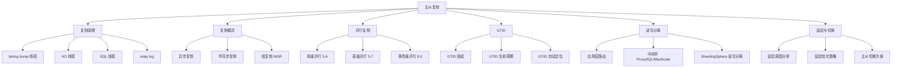

# 主从复制

## 概述
主从复制是 MySQL 实现高可用、读写分离和数据冗余的核心技术。本模块从复制原理（三步骤）、复制模式（异步/半同步/组复制）、并行复制演进、GTID 机制、读写分离架构到主从延迟优化，系统梳理主从复制的完整知识体系。

---

## 一、知识图谱



---

## 二、基础到进阶学习路线

- **阶段一：基础入门** —— 理解主从复制三步骤（binlog dump → I/O 线程 → SQL 线程），掌握 relay log 的作用，会搭建基本的主从复制环境。
- **阶段二：原理深入** —— 理解异步/半同步/组复制的区别和适用场景，掌握 GTID 的工作原理和自动故障转移，理解并行复制的演进（库级→表级→事务级）。
- **阶段三：实战优化** —— 主从延迟的诊断与优化，读写分离架构设计，主从切换方案（MHA/Orchestrator），高可用架构选型。

---

## 三、核心知识详解

### 3.1 主从复制原理（三步骤）

```
主库                              从库
┌──────────────┐                ┌──────────────┐
│  binlog      │ ──── Step 1 ──>│  I/O 线程    │
│  dump 线程   │    binlog 传输  │  (接收)      │
│  (发送)      │                │              │
│              │                │  relay log   │
│              │                │  (中继日志)   │
│              │                │      │       │
│              │                │      ▼       │
│              │                │  SQL 线程    │
│              │                │  (回放)      │
└──────────────┘                └──────────────┘

Step 1: 主库 binlog dump 线程读取 binlog 并发送给从库
Step 2: 从库 I/O 线程接收并写入 relay log
Step 3: 从库 SQL 线程读取 relay log 并回放执行
```

#### 各线程详细说明

| 线程 | 位置 | 职责 |
|------|------|------|
| **Binlog Dump** | 主库 | 读取 binlog 并发送给从库 I/O 线程 |
| **I/O 线程** | 从库 | 接收主库发送的 binlog 事件，写入 relay log |
| **SQL 线程** | 从库 | 读取 relay log 中的事件，在从库上回放执行 |

#### 查看复制状态

```sql
-- 从库查看复制状态
SHOW SLAVE STATUS\G
-- 关键字段：
-- Slave_IO_Running: Yes/No    -- I/O 线程是否运行
-- Slave_SQL_Running: Yes/No   -- SQL 线程是否运行
-- Seconds_Behind_Master: 0    -- 主从延迟（秒）
-- Master_Log_File / Read_Master_Log_Pos  -- I/O 线程读取位置
-- Relay_Master_Log_File / Exec_Master_Log_Pos  -- SQL 线程执行位置
```

### 3.2 复制模式对比

#### 异步复制（Asynchronous）

```
主库提交事务后立即返回，不等待从库确认。

优点：主库性能不受从库影响
缺点：主库宕机可能丢失数据（已提交但未同步到从库的事务）
```

```sql
-- 默认就是异步复制，无需额外配置
```

#### 半同步复制（Semi-Synchronous）

```
主库提交事务后，等待至少一个从库确认收到 binlog 后才返回。

流程：
1. 主库事务提交，写入 binlog
2. 主库等待从库确认收到 binlog
3. 从库将 binlog 写入 relay log 后，发送 ACK
4. 主库收到 ACK 后，返回客户端

优点：数据不丢失（至少一个从库有完整数据）
缺点：主库性能受从库网络延迟影响
```

```sql
-- 主库安装半同步插件
INSTALL PLUGIN rpl_semi_sync_master SONAME 'semisync_master.so';
SET GLOBAL rpl_semi_sync_master_enabled = ON;

-- 从库安装半同步插件
INSTALL PLUGIN rpl_semi_sync_slave SONAME 'semisync_slave.so';
SET GLOBAL rpl_semi_sync_slave_enabled = ON;

-- 半同步超时时间（ms），超时后降级为异步
SET GLOBAL rpl_semi_sync_master_timeout = 10000;
```

#### 组复制（MGR - MySQL Group Replication）

```
基于 Paxos 协议的多数派提交机制。

流程：
1. 事务在一个节点执行
2. 广播给组内其他节点
3. 多数派节点确认后，事务提交
4. 所有节点应用事务

优点：强一致性、自动故障转移、多主写入
缺点：性能受限于网络延迟和多数派确认
```

```sql
-- 组复制核心配置（my.cnf）
-- plugin_load_add = 'group_replication.so'
-- loose-group_replication_group_name = "aaaaaaaa-aaaa-aaaa-aaaa-aaaaaaaaaaaa"
-- loose-group_replication_start_on_boot = OFF
-- loose-group_replication_bootstrap_group = OFF
-- loose-group_replication_single_primary_mode = ON
```

#### 三种模式对比总结

| 维度 | 异步复制 | 半同步复制 | 组复制（MGR） |
|------|---------|-----------|--------------|
| **数据一致性** | 可能丢数据 | 不丢数据 | 强一致性（多数派） |
| **主库性能** | 最高 | 中等（等待 ACK） | 较低（多数派确认） |
| **故障转移** | 手动 | 手动/半自动 | 自动 |
| **网络延迟影响** | 无 | 有 | 大 |
| **适用场景** | 读写分离、报表 | 金融、核心交易 | 高可用要求极高 |

### 3.3 并行复制演进

#### 问题：单线程 SQL 回放瓶颈

```
传统复制（MySQL 5.5 及之前）：
  SQL 线程是单线程的，主库多线程并发写入，从库单线程回放
  → 如果主库并发高，从库回放速度跟不上 → 主从延迟
```

#### MySQL 5.6：库级并行复制

```sql
-- 不同库的事务可以并行回放
-- 配置：slave_parallel_workers > 0
SET GLOBAL slave_parallel_workers = 4;
```

**限制**：只有跨库的事务才能并行，同库事务仍然串行。

#### MySQL 5.7：基于组提交的并行复制（LOGICAL_CLOCK）

```sql
-- 同一个组提交组内的事务可以并行回放
-- 这些事务在主库上已经证明没有锁冲突
SET GLOBAL slave_parallel_workers = 4;
SET GLOBAL slave_parallel_type = LOGICAL_CLOCK;
```

**原理**：主库上同一组提交（group commit）内的事务之间没有锁冲突，可以在从库上并行回放。

#### MySQL 8.0：基于写集合的并行复制（WRITESET）

```sql
-- 进一步扩大并行度：不同事务修改的行不重叠，就可以并行
SET GLOBAL slave_parallel_workers = 8;
SET GLOBAL slave_parallel_type = LOGICAL_CLOCK;
SET GLOBAL binlog_transaction_dependency_tracking = WRITESET;
```

**WRITESET 原理**：将每个事务修改的行的主键/唯一键哈希值作为"写集合"，两个事务的写集合不重叠就可以并行回放。

#### 并行复制演进对比

| 版本 | 并行粒度 | 并行度 | 配置 |
|------|---------|--------|------|
| 5.5 及之前 | 无（单线程） | 1 | 无 |
| 5.6 | 库级 | 库数 | `slave_parallel_workers` |
| 5.7 | 组提交 | 组提交内事务数 | `LOGICAL_CLOCK` |
| 8.0 | 写集合 | 最高（无冲突即并行） | `WRITESET` |

### 3.4 GTID（全局事务标识符）

#### 什么是 GTID？

GTID 是全局唯一的事务标识符，格式为 `server_uuid:transaction_id`，如 `3E11FA47-71CA-11E1-9E33-C80AA9429562:1-5`。

```sql
-- 开启 GTID 模式（my.cnf）
-- gtid_mode = ON
-- enforce_gtid_consistency = ON

-- 查看已执行的 GTID 集合
SHOW MASTER STATUS;
SELECT @@gtid_executed;
```

#### GTID 的核心优势

| 传统复制（基于位点） | GTID 复制 |
|---------------------|-----------|
| 需要手动记录 binlog 文件和位置 | 自动定位，无需人工指定位点 |
| 主从切换时需要手动 `CHANGE MASTER` 指定位置 | 自动找到缺失的事务并补齐 |
| 容易因位点错误导致数据不一致 | 事务级别追踪，不会重复执行 |

```sql
-- 传统方式：需要指定文件和位置
CHANGE MASTER TO
    MASTER_HOST = '192.168.1.101',
    MASTER_LOG_FILE = 'mysql-bin.000010',
    MASTER_LOG_POS = 1234;

-- GTID 方式：自动定位
CHANGE MASTER TO
    MASTER_HOST = '192.168.1.101',
    MASTER_AUTO_POSITION = 1;
```

#### GTID 生命周期

```
1. 主库执行事务，生成 GTID
2. GTID 和事务一起写入 binlog
3. 从库接收到 binlog 事件，读取 GTID
4. 从库检查 gtid_executed 集合，判断是否需要执行
5. 若未执行过，则执行事务，并将 GTID 加入 gtid_executed
```

### 3.5 读写分离架构

#### 架构一：应用层路由

```
应用层
  ├── 写请求 → 主库
  └── 读请求 → 从库（轮询/随机/权重）
```

**优点**：简单直接，无额外组件
**缺点**：代码侵入性强，切换逻辑与应用耦合

```java
// 应用层读写分离示例（Spring 动态数据源）
@Configuration
public class DataSourceConfig {
    @Bean
    @Primary
    public DataSource routingDataSource() {
        Map<Object, Object> targetDataSources = new HashMap<>();
        targetDataSources.put("master", masterDataSource());
        targetDataSources.put("slave", slaveDataSource());

        AbstractRoutingDataSource routingDataSource = new AbstractRoutingDataSource() {
            @Override
            protected Object determineCurrentLookupKey() {
                return TransactionSynchronizationManager.isActualTransactionActive()
                    ? "master" : "slave";  // 事务中走主库
            }
        };
        routingDataSource.setTargetDataSources(targetDataSources);
        routingDataSource.setDefaultTargetDataSource(masterDataSource());
        return routingDataSource;
    }
}
```

#### 架构二：中间件代理

```
应用层 → ProxySQL/MaxScale/ShardingSphere-Proxy → 主库
                                                  → 从库1
                                                  → 从库2
```

**优点**：对应用透明，支持 SQL 解析路由，健康检查
**缺点**：增加网络跳转，中间件本身需要高可用

#### 架构三：ShardingSphere 读写分离

```yaml
spring:
  shardingsphere:
    rules:
      readwrite-splitting:
        data-sources:
          ds_master_slave:
            type: Static
            props:
              write-data-source-name: ds_master
              read-data-source-names: ds_slave0, ds_slave1
            load-balancer-name: round_robin
```

### 3.6 主从延迟

#### 延迟原因

| 原因 | 说明 | 影响程度 |
|------|------|---------|
| **从库硬件差** | 从库 CPU/内存/磁盘配置低于主库 | 高 |
| **从库承担读压力** | 从库还要处理大量读请求，与 SQL 线程竞争资源 | 高 |
| **大事务** | 主库一个事务修改千万行，从库回放耗时长 | 极高 |
| **DDL 操作** | 大表 DDL 在从库上串行回放，阻塞后续 | 极高 |
| **网络延迟** | 主从之间网络带宽或延迟 | 低（通常） |
| **锁冲突** | 从库 SQL 线程被其他查询阻塞 | 中 |

#### 延迟监控与优化

```sql
-- 监控主从延迟
SHOW SLAVE STATUS\G
-- 关注 Seconds_Behind_Master
-- 注意：这个值可能不准确（网络延迟、大事务中）

-- 更精确的延迟监控（Percona Toolkit）
-- pt-heartbeat --update -h master --create-table
-- pt-heartbeat --monitor -h slave
```

#### 延迟优化策略

1. **升级并行复制**：MySQL 5.7+ 使用 `LOGICAL_CLOCK`，8.0 使用 `WRITESET`
2. **拆大事务**：避免一个事务操作大量数据
3. **从库硬件对齐主库**：确保从库 IO 能力不弱于主库
4. **使用半同步复制**：确保数据不丢，但不能解决回放延迟
5. **读写分离策略**：对延迟敏感的业务强制走主库

```sql
-- 读写分离中的延迟感知
-- ProxySQL 支持 max_replication_lag 配置
-- 当从库延迟超过阈值，自动从读池中剔除
```

### 3.7 主从切换方案

#### 方案一：MHA（Master High Availability）

```
MHA 切换流程：
1. 监控主库状态
2. 检测到主库故障
3. 选出数据最新的从库作为新主库
4. 从其他从库补齐差异 relay log
5. 切换 VIP，完成故障转移
```

#### 方案二：Orchestrator

```
Orchestrator 特点：
- 可视化拓扑管理
- 自动故障检测与恢复
- 支持 GTID 和传统复制
- 支持自定义恢复策略
```

#### 方案三：MGR 自动切换

```
组复制内置故障转移：
- 单主模式下，主库故障自动选举新主
- 多主模式下，任意节点可读写
- 切换时间通常在秒级
```

---

## 四、经典应用场景与解决方案

### 场景：千万级用户系统的读写分离架构

**问题背景**：用户系统日均 1000 万次读请求，100 万次写请求，单库无法承载。需要实现读写分离来分担读压力。

**方案设计**：

```
架构拓扑：
  应用层
    │
    ▼
  ShardingSphere-Proxy（读写分离 + 负载均衡）
    │
    ├── 主库（写）
    │
    ├── 从库 1（读，权重 3）
    ├── 从库 2（读，权重 3）
    └── 从库 3（读，权重 1，延迟从库，延迟 1 小时）

关键设计：
1. 写操作：全部走主库
2. 读操作：轮询从库，权重分配
3. 事务中读写：都走主库（避免读到自己刚写但未同步的数据）
4. 延迟敏感读：业务主动指定走主库（Hint 机制）
5. 延迟从库：用于数据误删恢复
```

```sql
-- 关键参数配置
-- 主库
innodb_flush_log_at_trx_commit = 1
sync_binlog = 1
binlog_format = ROW

-- 从库
slave_parallel_workers = 8
slave_parallel_type = LOGICAL_CLOCK
binlog_transaction_dependency_tracking = WRITESET  -- 8.0
read_only = ON
```

---

## 五、高频面试题

### Q1: 主从复制原理是什么？

::: details 答案
MySQL 主从复制基于 binlog，分为三个步骤：

**Step 1：主库 binlog dump**
- 主库上有一个 binlog dump 线程
- 当从库连接主库时，dump 线程读取 binlog 中的事件并发送给从库
- 如果从库断连重连，dump 线程从上次位置继续发送

**Step 2：从库 I/O 线程写入 relay log**
- 从库的 I/O 线程接收主库发送的 binlog 事件
- 将事件写入 relay log（中继日志）
- relay log 的格式与 binlog 一致

**Step 3：从库 SQL 线程回放**
- 从库的 SQL 线程读取 relay log 中的事件
- 在从库上执行这些事件（重放）
- 执行完成后从 relay log 中删除

**关键点**：
- 主库的 binlog dump 是**推送**模式（不是从库拉取）
- I/O 线程和 SQL 线程是独立的，可以并行工作
- 如果 SQL 线程回放慢，relay log 会堆积
:::

### Q2: 异步复制、半同步复制、组复制对比？

::: details 答案
| 维度 | 异步复制 | 半同步复制 | 组复制（MGR） |
|------|---------|-----------|--------------|
| **数据一致性** | 可能丢数据 | 至少一个从库有完整数据 | 多数派确认，强一致性 |
| **主库性能** | 最高 | 中等（等待 ACK） | 较低（多数派确认） |
| **故障转移** | 手动 | 手动/半自动 | 自动（秒级） |
| **网络要求** | 低 | 低 | 高（低延迟 LAN） |
| **最小节点数** | 2 | 2 | 3（推荐） |
| **多主写入** | 不支持 | 不支持 | 支持 |
| **适用场景** | 读写分离、报表 | 金融、核心交易 | 高可用 + 强一致性 |

**异步复制**：主库提交即返回，不等待从库。性能最高，但主库宕机可能丢失已提交但未同步的事务。

**半同步复制**：主库等待至少一个从库确认收到 binlog 后才返回。保证数据不丢（至少一个从库有完整数据），但主库性能受从库网络延迟影响。超时后自动降级为异步。

**组复制**：基于 Paxos 协议，事务需要多数派节点确认。强一致性，自动故障转移，但性能最低，且要求网络延迟低（通常 < 10ms）。
:::

### Q3: 主从延迟的原因和优化策略？

::: details 答案
**延迟原因**：

1. **从库硬件差**：从库 CPU/内存/IO 能力弱于主库，SQL 线程回放速度跟不上
2. **大事务**：主库一个事务修改千万行，binlog 事件量大，从库回放耗时长
3. **DDL 操作**：大表 DDL 在主库可能很快（Online DDL），但从库是串行回放
4. **从库读压力**：从库还要处理大量读请求，与 SQL 线程竞争 CPU 和 IO
5. **锁冲突**：从库 SQL 线程被其他查询的锁阻塞
6. **单线程回放**：MySQL 5.5 之前 SQL 线程是单线程，主库并发写入无法并行回放

**优化策略**：

1. **升级并行复制**：MySQL 5.7+ 使用 `LOGICAL_CLOCK`，8.0 使用 `WRITESET`，设置 `slave_parallel_workers = 8~16`
2. **拆大事务**：将大事务拆成多个小事务，减小单次 binlog 事件量
3. **从库硬件对齐主库**：特别是磁盘 IO（SSD 必须）
4. **使用半同步复制**：确保数据不丢，但不能解决回放延迟本身
5. **延迟敏感业务走主库**：在读写分离中，对实时性要求高的查询强制走主库
6. **监控告警**：设置 `Seconds_Behind_Master` 告警阈值，及时发现问题
:::

### Q4: 读写分离为什么读到过期数据？

::: details 答案
读写分离读到过期数据（Stale Read）的根本原因是**主从延迟**：

1. 应用写入主库后，立刻去从库读取
2. 此时写入的数据可能还没同步到从库
3. 从库返回的是旧数据

**解决方案**：

**方案一：强制走主库**

写入后立即读，强制走主库：
```java
@Transactional
public void createOrder() {
    orderDao.insert(order);           // 写主库
    Order result = orderDao.selectById(order.getId());  // 也走主库
}
```

**方案二：延迟读从库**

写入后等待一段时间再读从库（不推荐，无法保证）：

```java
orderDao.insert(order);
Thread.sleep(100);  // 等 100ms
Order result = orderDao.selectById(order.getId());  // 读从库
```

**方案三：关键业务走主库**

识别出对实时性要求高的业务场景，这些场景的读操作始终走主库。

**方案四：从库延迟感知**

中间件（如 ProxySQL）支持设置 `max_replication_lag`，当从库延迟超过阈值时自动将其从读池中剔除。

**方案五：GTID 等待**

MySQL 5.7+ 支持 `WAIT_FOR_EXECUTED_GTID_SET` 函数，应用在写入后获取 GTID，读从库时等待该 GTID 被回放：
```sql
SELECT WAIT_FOR_EXECUTED_GTID_SET('3E11FA47-...:1-5', 1);
```
:::

### Q5: 主从切换方式有哪些？如何保证数据不丢？

::: details 答案
**切换方式**：

1. **手动切换**：修改应用配置，将写流量指向新主库。风险高，需要人工操作。

2. **MHA（Master High Availability）**：自动故障检测和切换，补齐 relay log 差异，切换 VIP。适合传统异步/半同步复制。

3. **Orchestrator**：GitHub 开源的 MySQL 拓扑管理工具，支持自动故障恢复，可视化拓扑管理。

4. **MGR 自动切换**：组复制内置故障转移，单主模式下主库故障自动选举新主。

5. **Keepalived + VIP**：通过 VIP 漂移实现切换，简单但需要手动处理数据一致性。

**如何保证数据不丢**：

1. **半同步复制**：主库提交前等待从库确认，确保至少一个从库有完整数据。切换时选择最新从库作为新主。

2. **MHA 的 relay log 补齐**：旧主库故障时，MHA 尝试从旧主库上拉取未同步的 binlog，补齐到新主库。

3. **GTID**：新主库根据 GTID 集合判断缺失的事务，从其他从库自动补齐。

4. **延迟从库**：延迟复制的从库可以在误操作时提供数据恢复。

5. **双 1 配置**：`innodb_flush_log_at_trx_commit = 1` + `sync_binlog = 1`，确保主库宕机不丢数据。
:::

### Q6: GTID 相比传统位点复制的优势？

::: details 答案
**传统位点复制的问题**：

1. 需要手动指定 binlog 文件名和偏移量（`MASTER_LOG_FILE` + `MASTER_LOG_POS`）
2. 主从切换时，需要准确知道新主库的 binlog 位置
3. 容易因位点错误导致数据不一致（漏执行或重复执行）
4. 级联复制（A→B→C）中，B 故障后 C 要重新指定位点，非常复杂

**GTID 的优势**：

1. **自动定位**：`CHANGE MASTER TO MASTER_AUTO_POSITION = 1`，从库自动找到缺失的事务
2. **幂等性**：每个事务有全局唯一标识，已执行过的事务不会重复执行
3. **简化故障转移**：新主库不需要知道 binlog 位点，从库自动追问新主库
4. **简化级联复制**：中间从库故障后，下游从库可以自动连接到新上游
5. **便于监控**：`gtid_executed` 集合清晰展示了复制进度

**示例**：
```sql
-- 传统方式：从库重新指向新主库
CHANGE MASTER TO
    MASTER_HOST = '192.168.1.102',
    MASTER_LOG_FILE = 'mysql-bin.000015',
    MASTER_LOG_POS = 4567;  -- 需要准确知道这个位置！

-- GTID 方式：自动定位，无需关心位置
CHANGE MASTER TO
    MASTER_HOST = '192.168.1.102',
    MASTER_AUTO_POSITION = 1;
```
:::

### Q7: MySQL 8.0 的 WRITESET 并行复制原理？

::: details 答案
WRITESET 是 MySQL 8.0 引入的并行复制优化，通过分析事务的"写集合"来判断事务是否可以并行回放。

**原理**：

1. 主库上每个事务提交时，计算其"写集合"——即事务修改的所有行的主键/唯一键的哈希值。

2. 如果两个事务的写集合没有重叠（即没有修改同一行），那么它们就不存在锁冲突，可以在从库上并行回放。

3. 相比 5.7 的 LOGICAL_CLOCK（只能在同一组提交组内并行），WRITESET 大大扩展了并行范围。

**配置**：
```sql
SET GLOBAL slave_parallel_workers = 8;
SET GLOBAL slave_parallel_type = LOGICAL_CLOCK;
SET GLOBAL binlog_transaction_dependency_tracking = WRITESET;

-- 写集合哈希算法
SET GLOBAL transaction_write_set_extraction = XXHASH64;
```

**效果对比**：
- 5.6（库级并行）：并行度 = 库的数量
- 5.7（LOGICAL_CLOCK）：并行度 = 组提交内的事务数
- 8.0（WRITESET）：并行度 = 无冲突的事务数（理论上接近主库并发度）

**限制**：
- 需要主键或唯一键（没有的话无法计算写集合）
- 外键约束的事务不能并行
- DDL 不能与任何事务并行
:::

---

## 六、选型指南

- **适用场景**：读写分离（读多写少）、数据备份与容灾、报表/数据分析（从库执行）、高可用架构
- **不适用场景**：对数据一致性要求极高且不允许任何延迟的场景（考虑使用分布式数据库或 MGR）
- **配置建议**：
  - 复制模式：一般业务异步复制，核心业务半同步复制，高可用要求极高选 MGR
  - 并行复制：MySQL 8.0 + `WRITESET` + `slave_parallel_workers = 8~16`
  - 从库数量：通常 2~4 个，过多会增加主库 binlog dump 线程压力
  - 读写分离中间件：ProxySQL（功能最全）、ShardingSphere-Proxy（与分库分表统一）、MaxScale（MariaDB 生态）
  - 主从切换：MHA（传统复制）、Orchestrator（可视化）、MGR（自动切换）

---

## 相关文档
- [日志系统](./logging-system)
- [事务与锁](./transaction-locking)
- [分库分表](./sharding)
- [SQL 优化](./sql-optimization)
- [MySQL 选型指南](./selection)