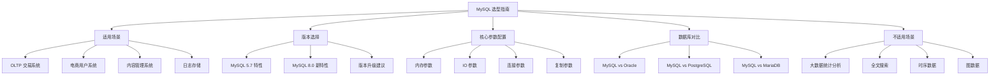

# MySQL 选型指南

## 概述
技术选型是架构决策中最重要的一环。本模块从 MySQL 的适用场景、版本选择、核心参数配置、与 Oracle/PostgreSQL 的对比等维度，为高级工程师提供全面的 MySQL 选型决策参考，帮助在面对不同业务场景时做出合理的技术判断。

---

## 一、知识图谱



---

## 二、基础到进阶学习路线

- **阶段一：基础入门** —— 了解 MySQL 的典型适用场景（OLTP、电商、用户系统），掌握基本的版本选择依据，知道哪些场景不适合 MySQL。
- **阶段二：原理深入** —— 理解核心参数（`innodb_buffer_pool_size`、`innodb_flush_log_at_trx_commit` 等）的底层原理，掌握 MySQL 8.0 的关键新特性，理解与 Oracle/PostgreSQL 的架构差异。
- **阶段三：实战优化** —— 根据业务场景定制参数配置，制定版本升级策略，做技术选型的 trade-off 分析。

---

## 三、核心知识详解

### 3.1 MySQL 适用场景

#### OLTP 交易系统

MySQL + InnoDB 是 OLTP 场景的黄金组合：

- 支持 ACID 事务、行级锁、MVCC
- 适合高并发短事务（每笔交易毫秒级）
- 电商下单、支付、库存扣减

```sql
-- 典型的 OLTP 场景
BEGIN;
SELECT stock FROM products WHERE id = 1001 FOR UPDATE;
UPDATE products SET stock = stock - 1 WHERE id = 1001 AND stock > 0;
INSERT INTO orders (product_id, user_id, quantity) VALUES (1001, 2001, 1);
COMMIT;
```

#### 电商用户系统

- 用户注册、登录、个人信息管理
- 数据量中等（百万~千万），查询模式简单
- 需要高可用（主从复制 + 读写分离）

#### 内容管理系统

- 文章、评论、标签等结构化数据
- 读写比例高（读远多于写）
- 通过缓存（Redis）可以大幅减轻数据库压力

#### 日志/流水存储

- 适合中小规模流水数据
- 大规模（日均亿级）需要考虑分库分表或换用 ClickHouse/TiDB

### 3.2 MySQL 不适用场景

| 场景 | 为什么不适用 | 替代方案 |
|------|------------|---------|
| **大数据统计分析** | 缺少列式存储、向量化执行、MPP 并行 | ClickHouse、Doris、StarRocks |
| **全文搜索** | 内置全文索引功能弱，中文分词差 | Elasticsearch、Meilisearch |
| **时序数据** | 不适合高吞吐写入和时序压缩 | TimescaleDB、InfluxDB、TDengine |
| **图数据** | 关系模型不适合图遍历查询 | Neo4j、NebulaGraph |
| **海量数据实时分析** | 单表查询性能有限，无法横向扩展到百节点 | Presto、Trino、Apache Doris |
| **KV 存储** | InnoDB 写入放大 + 事务开销 | Redis、RocksDB |

### 3.3 版本选择：5.7 vs 8.0

#### MySQL 5.7 特性（2015 年发布，已进入 Extended Support）

| 特性 | 说明 |
|------|------|
| InnoDB 全文索引 | 支持中文分词（ngram parser） |
| JSON 数据类型 | 原生 JSON 支持，JSON 函数 |
| 多源复制 | 一个从库可复制多个主库 |
| 在线 DDL 增强 | 更多 DDL 操作支持 INPLACE 算法 |
| 组复制 | MGR 初版，基本可用 |

#### MySQL 8.0 新特性（2018 年发布，推荐版本）

| 特性 | 说明 | 重要程度 |
|------|------|---------|
| **原子 DDL** | DDL 操作原子性，失败自动回滚 | 极高 |
| **窗口函数** | `ROW_NUMBER()`、`RANK()`、`LAG()` 等 | 高 |
| **CTE 公共表表达式** | `WITH` 递归查询 | 高 |
| **隐藏索引** | 索引设为不可见，验证后再删除 | 高 |
| **降序索引** | 支持 `ORDER BY col DESC` 真正使用索引 | 中 |
| **索引跳跃扫描** | 复合索引前缀列区分度低时自动优化 | 中 |
| **直方图统计** | 非等值分布列的精确统计信息 | 中 |
| **Hash Join** | 替代 BNL，等值 JOIN 性能大幅提升 | 极高 |
| **资源组** | 线程级别的 CPU 资源隔离 | 中 |
| **克隆插件** | 在线克隆整个实例，替代 XtraBackup | 高 |
| **角色管理** | 授权角色，简化权限管理 | 中 |
| **双密码** | 支持双密码，无缝密码轮换 | 中 |
| **redo log 动态调整** | 8.0.30+ `innodb_redo_log_capacity` | 高 |
| **UTF8MB4 默认** | 默认字符集升级为 utf8mb4 | 高 |

#### 8.0 代码示例：窗口函数

```sql
-- 5.7 实现部门内薪资排名（需要子查询或变量）
SELECT d.name, e.name, e.salary,
       (SELECT COUNT(*) FROM employees e2
        WHERE e2.department_id = e.department_id
        AND e2.salary >= e.salary) AS ranking
FROM employees e JOIN departments d ON e.department_id = d.id;

-- 8.0 使用窗口函数（简洁高效）
SELECT d.name, e.name, e.salary,
       RANK() OVER (PARTITION BY e.department_id ORDER BY e.salary DESC) AS ranking
FROM employees e JOIN departments d ON e.department_id = d.id;
```

#### 8.0 代码示例：CTE 递归查询

```sql
-- 8.0 递归查询组织架构树
WITH RECURSIVE org_tree AS (
    SELECT id, name, parent_id, 1 AS level
    FROM departments WHERE parent_id IS NULL
    UNION ALL
    SELECT d.id, d.name, d.parent_id, t.level + 1
    FROM departments d
    JOIN org_tree t ON d.parent_id = t.id
)
SELECT * FROM org_tree ORDER BY level, name;
```

#### 版本升级建议

| 当前版本 | 建议 |
|---------|------|
| 5.5 及以下 | 立即升级（已停止支持） |
| 5.6 | 计划升级到 8.0（5.6 已停止支持） |
| 5.7 | 制定升级计划（5.7 进入 Extended Support，2025 年 10 月 EOL） |
| 8.0 | 保持最新小版本 |

::: danger 升级注意事项
- 5.7 → 8.0 的 `sql_mode` 变化可能导致 SQL 行为不同
- 8.0 的认证插件从 `mysql_native_password` 改为 `caching_sha2_password`，客户端驱动需更新
- 8.0 移除了 `query_cache`（用 Redis 替代）
- 8.0 的 `innodb_buffer_pool_instances` 默认从 1 改为自适应
- 建议使用 `mysqlcheck` 或 `mysql_upgrade` 检查兼容性
:::

### 3.4 核心参数配置建议

#### 内存参数

```ini
[mysqld]
# InnoDB 缓冲池大小：可用内存的 50%~70%
# 这是 InnoDB 最重要的参数，直接影响性能
innodb_buffer_pool_size = 8G

# 缓冲池实例数：建议 <= 8，将缓冲池分段减少锁竞争
innodb_buffer_pool_instances = 8

# 排序缓冲区：每个需要排序的会话分配
sort_buffer_size = 2M

# Join 缓冲区：每个 Join 操作分配
join_buffer_size = 2M

# 临时表内存大小
tmp_table_size = 64M
max_heap_table_size = 64M
```

#### IO 参数

```ini
[mysqld]
# ★★★ 双 1 配置（金融级），保证数据不丢失
innodb_flush_log_at_trx_commit = 1
sync_binlog = 1

# 互联网级（折中）
# innodb_flush_log_at_trx_commit = 1
# sync_binlog = 1000

# redo log 文件大小（MySQL 8.0.30+）
innodb_redo_log_capacity = 4G

# IO 容量（SSD 建议 2000~4000）
innodb_io_capacity = 2000
innodb_io_capacity_max = 4000

# 自适应刷盘
innodb_adaptive_flushing = ON
```

#### 连接参数

```ini
[mysqld]
# 最大连接数（根据实际并发量设置，不宜过大）
max_connections = 1000

# 连接超时
wait_timeout = 600
interactive_timeout = 600

# 线程缓存（减少线程创建开销）
thread_cache_size = 100
```

#### 复制参数

```ini
[mysqld]
# binlog 格式
binlog_format = ROW

# GTID 模式
gtid_mode = ON
enforce_gtid_consistency = ON

# 并行复制（从库）
slave_parallel_workers = 8
slave_parallel_type = LOGICAL_CLOCK
binlog_transaction_dependency_tracking = WRITESET
```

#### 通用配置模板

```ini
# ===== MySQL 8.0 生产配置模板 =====

[mysqld]
# 基础配置
server_id = 1
character_set_server = utf8mb4
collation_server = utf8mb4_unicode_ci
default_time_zone = '+08:00'

# 内存
innodb_buffer_pool_size = 8G
innodb_buffer_pool_instances = 8

# 日志
innodb_flush_log_at_trx_commit = 1
sync_binlog = 1
binlog_format = ROW
innodb_redo_log_capacity = 4G

# 连接
max_connections = 1000

# 表
innodb_file_per_table = ON
innodb_autoinc_lock_mode = 2

# 安全
sql_mode = 'STRICT_TRANS_TABLES,NO_ZERO_IN_DATE,NO_ZERO_DATE,ERROR_FOR_DIVISION_BY_ZERO,NO_ENGINE_SUBSTITUTION'
```

### 3.5 数据库对比

#### MySQL vs Oracle

| 维度 | MySQL | Oracle |
|------|-------|--------|
| **许可证** | 开源免费（GPL）/ 商业版 | 商业授权，费用高 |
| **架构** | 插件式存储引擎（InnoDB 为主） | 一体化架构 |
| **事务** | InnoDB ACID 事务 | 完整 ACID 事务 |
| **SQL 功能** | 8.0 大幅增强，但仍有差距 | 功能最全（分析函数、物化视图等） |
| **高可用** | 主从复制/MGR/第三方工具 | RAC/Data Guard（成熟稳定） |
| **性能** | OLTP 场景性能优秀 | OLTP 性能优秀，分析能力更强 |
| **运维** | 相对简单 | 需要专业 DBA |
| **适用场景** | 互联网、中小企业 | 金融、政府、大型企业 |

#### MySQL vs PostgreSQL

| 维度 | MySQL | PostgreSQL |
|------|-------|-----------|
| **SQL 标准** | 逐步完善（8.0 大幅改进） | 最接近 SQL 标准 |
| **扩展性** | 插件式存储引擎 | 丰富的扩展（PostGIS、TimescaleDB） |
| **JSON 支持** | 8.0 支持 JSON 函数和索引 | 原生 JSONB（性能更好） |
| **全文搜索** | 内置但功能弱 | 内置功能更强 |
| **并发模型** | 线程模型（多线程） | 进程模型（多进程） |
| **MVCC** | undo log 版本链 | 多版本直接存储（无 undo 膨胀问题） |
| **复制** | 原生主从复制，生态成熟 | 流复制，逻辑复制（10.0+） |
| **连接池** | 需要外部连接池（ProxySQL） | 内置连接池（PgBouncer） |
| **GIS** | 基础支持 | PostGIS 业界标准 |
| **生态** | 互联网生态最广泛 | 快速增长，数据分析生态强 |

#### MySQL vs MariaDB

| 维度 | MySQL | MariaDB |
|------|-------|---------|
| **关系** | Oracle 维护 | MySQL 创始人 Monty 创建，MySQL 分支 |
| **存储引擎** | InnoDB 为主 | 更多选择（Aria、ColumnStore、MyRocks 等） |
| **兼容性** | 标准 MySQL | 兼容 MySQL 协议和 SQL |
| **版本号** | 5.7 → 8.0 | 10.x 系列（跳跃式版本号） |
| **优化器** | 8.0 优化器改进大 | 有独立的优化器改进 |
| **企业支持** | Oracle 商业支持 | MariaDB Corporation 商业支持 |
| **选择建议** | 跟随 Oracle 主线 | 希望避免 Oracle 锁定的替代选择 |

---

## 四、经典应用场景与解决方案

### 场景：新项目数据库选型决策

**问题背景**：团队需要为一个中等规模的电商平台（日均订单 10 万，用户 500 万）选择数据库。业务包括：商品管理、订单交易、用户系统、营销活动、后台报表。

**选型分析**：

```
业务需求分析：
├── 商品管理：结构化数据，读多写少，MySQL 适用
├── 订单交易：ACID 事务，强一致性，MySQL InnoDB 适用
├── 用户系统：中等数据量，简单查询，MySQL 适用
├── 营销活动：高并发读写，需要缓存 + 异步，MySQL 做持久化
└── 后台报表：复杂分析查询，MySQL 不适合 → ClickHouse/Doris

最终选型：
  核心交易：MySQL 8.0（主库 + 读写分离 + 缓存）
  搜索功能：Elasticsearch
  报表分析：ClickHouse
  缓存：Redis
  消息队列：RocketMQ
```

**关键决策理由**：

1. 选择 MySQL 8.0 而非 5.7：原子 DDL、Hash Join、窗口函数、克隆插件等新特性能显著降低运维和开发成本。
2. 不用分区表：分区表在 MySQL 8.0 场景下大部分需求用分库分表更灵活。
3. 报表分析不用 MySQL：MySQL 缺少列式存储和向量化执行，千万级聚合查询性能差。

---

## 五、高频面试题

### Q1: 什么时候选择 MySQL？什么时候不选？

::: details 答案
**选择 MySQL 的场景**：

1. **OLTP 交易系统**：MySQL + InnoDB 是 OLTP 场景的黄金组合，支持 ACID 事务、行级锁、MVCC，适合高并发短事务（电商下单、支付、库存扣减）。

2. **互联网应用**：MySQL 生态最成熟，连接池、ORM、监控、运维工具丰富，工程师资源充足。

3. **中小规模数据**：单表百万到千万级，通过索引优化 + 读写分离 + 缓存即可满足需求。

4. **需要 SQL 的关系型场景**：结构化数据、多表关联查询、事务一致性要求高的场景。

**不选择 MySQL 的场景**：

1. **大数据统计分析**：缺少列式存储和向量化执行，不适合 PB 级多维分析。应选 ClickHouse、Doris、StarRocks。

2. **全文搜索**：内置全文索引功能弱，中文分词差。应选 Elasticsearch。

3. **时序数据**：应选 TimescaleDB、InfluxDB、TDengine。

4. **超高并发 KV 存储**：Redis 性能远超 MySQL。

5. **图数据**：应选 Neo4j、NebulaGraph。

**总结**：MySQL 是 OLTP 的瑞士军刀，但不是万能工具。关键判断依据是：**数据是否结构化、是否需要事务、查询模式是否以关联查询为主**。
:::

### Q2: MySQL vs Oracle 怎么选？

::: details 答案
| 维度 | MySQL | Oracle |
|------|-------|--------|
| **成本** | 开源免费（或商业版几千美元/年） | 商业授权（数十万~数百万/年） |
| **功能** | 8.0 大幅增强，但仍有差距 | 功能最全（物化视图、分析函数、高级分区等） |
| **高可用** | 主从/MGR/MHA，需自己搭建 | RAC/Data Guard，开箱即用 |
| **性能** | OLTP 优秀 | OLTP 优秀，分析能力更强 |
| **运维** | 相对简单，工程师多 | 需要专业 DBA，成本高 |
| **审计合规** | 需要企业版 | 内置审计功能 |
| **序列** | 8.0 不支持（用 AUTO_INCREMENT） | 原生 SEQUENCE |

**选择 MySQL**：
- 互联网/创业公司，预算有限
- 技术栈以开源为主
- 不需要 Oracle 高级特性（物化视图、RAC 等）
- 工程师对 MySQL 更熟悉

**选择 Oracle**：
- 金融/政府/大型企业，有预算
- 需要 Oracle 高级特性（RAC、Data Guard、高级分区）
- 合规要求高（审计、加密）
- 有专业的 Oracle DBA 团队

**趋势**：越来越多的企业从 Oracle 迁移到 MySQL/PostgreSQL，主要驱动力是成本和技术自主可控。
:::

### Q3: InnoDB 关键参数如何配置？

::: details 答案
**内存参数**：

```ini
# innodb_buffer_pool_size：InnoDB 最重要的参数
# 设置为可用内存的 50%~70%
# 例如：16G 内存的服务器设为 10G
innodb_buffer_pool_size = 10G

# innodb_buffer_pool_instances：缓冲池分段
# 大于 1G 时建议分段，减少锁竞争
# 建议值：min(8, innodb_buffer_pool_size / 1G)
innodb_buffer_pool_instances = 8
```

**IO 参数**：

```ini
# 双 1 配置（金融级）：保证数据不丢失
innodb_flush_log_at_trx_commit = 1
sync_binlog = 1

# IO 容量：SSD 建议 2000~4000，HDD 建议 200
innodb_io_capacity = 2000
innodb_io_capacity_max = 4000
```

**redo log 配置**：

```ini
# MySQL 8.0.30+ 推荐方式
# 高写入场景建议 4G~16G
innodb_redo_log_capacity = 8G

# 8.0.30 之前
# innodb_log_file_size = 2G
# innodb_log_files_in_group = 2
```

**连接参数**：

```ini
# 最大连接数：按需设置，不宜过大（每个连接占用内存）
max_connections = 1000

# 连接超时：避免空闲连接占用资源
wait_timeout = 600
```

**关键原则**：
1. `innodb_buffer_pool_size` 是影响性能最大的参数，优先保证
2. `innodb_flush_log_at_trx_commit` 和 `sync_binlog` 决定数据安全性和写入性能的平衡
3. `innodb_redo_log_capacity` 影响写入性能和崩溃恢复时间
4. 不要盲目调大 `max_connections`，可能耗尽内存
:::

### Q4: MySQL 8.0 有哪些关键新特性？

::: details 答案
**最值得关注的新特性（按重要性排序）**：

1. **原子 DDL**：解决了 MySQL 历史上最大的运维痛点之一——DDL 操作中途失败导致数据字典不一致。现在 `CREATE TABLE`、`DROP TABLE`、`ALTER TABLE` 等 DDL 操作都是原子的，失败自动回滚。

2. **Hash Join**：替代了传统的 BNL（Block Nested Loop Join），等值 JOIN 性能有数量级提升。特别是大表 JOIN 场景，不再需要为每行被驱动表数据重新扫描。

3. **窗口函数**：`ROW_NUMBER()`、`RANK()`、`DENSE_RANK()`、`LAG()`、`LEAD()` 等，大幅简化了排名、环比、同比等分析场景的 SQL 编写。

4. **CTE 递归查询**：`WITH RECURSIVE` 支持层级数据查询（组织架构、菜单树、地区层级），不再需要复杂的存储过程。

5. **隐藏索引**：将索引设为 `INVISIBLE`，观察性能影响后再决定是否删除。这是安全删除索引的最佳实践。

6. **克隆插件**：在线克隆整个 MySQL 实例，替代 XtraBackup 用于搭建从库。8.0.17+ 引入。

7. **直方图统计**：解决非等值分布列的统计信息不准问题，让优化器做出更准确的选择。

8. **降序索引**：真正支持 `ORDER BY col DESC` 使用索引，8.0 之前降序索引会被忽略。

9. **双密码**：支持为账户设置主密码和备用密码，实现无缝密码轮换。

10. **redo log 动态调整**：8.0.30+ 通过 `innodb_redo_log_capacity` 动态调整 redo log 大小，无需重启。
:::

### Q5: 什么时候不适合 MySQL？替代方案是什么？

::: details 答案
| 场景 | 为什么不合适 | 替代方案 |
|------|------------|---------|
| **PB 级实时分析** | 缺少列式存储、向量化执行、MPP 并行 | ClickHouse、Doris、StarRocks |
| **全文搜索** | 内置全文索引功能弱，不支持分布式索引 | Elasticsearch、Meilisearch |
| **时序数据** | 写入放大严重，缺少时序压缩和降采样 | TimescaleDB、InfluxDB、TDengine |
| **图数据** | 关系模型处理图遍历需要多次 JOIN | Neo4j、NebulaGraph |
| **超高并发 KV** | 事务和锁开销大，QPS 有上限 | Redis、Aerospike |
| **海量非结构化数据** | 表结构固定，不适合 schema-less 数据 | MongoDB、Cassandra |
| **事件溯源/CQRS** | 不可变事件流，需要事件查询 | EventStoreDB、Kafka + KSQL |
| **多数据中心强一致** | 异步/半同步复制无法满足跨地域延迟要求 | CockroachDB、TiDB、Spanner |

**核心判断标准**：
- 如果数据是**结构化**的、需要**事务**、以**关联查询**为主 → MySQL
- 如果数据是**海量分析**为主 → ClickHouse/Doris
- 如果**搜索**是核心功能 → Elasticsearch
- 如果**时序**特征明显 → TimescaleDB/TDengine
:::

### Q6: MySQL 和 PostgreSQL 怎么选？

::: details 答案
| 维度 | MySQL | PostgreSQL |
|------|-------|-----------|
| **上手难度** | 简单 | 稍高（概念更多） |
| **SQL 标准** | 逐步完善（8.0 改进大） | 最接近标准 |
| **MVCC** | undo log 版本链（有膨胀风险） | 多版本直接存储（无 undo 膨胀） |
| **JSON** | 8.0 支持，但弱于 PG | JSONB 性能更好，支持索引 |
| **GIS** | 基础支持 | PostGIS 业界标准 |
| **扩展** | 插件机制 | 丰富的扩展生态 |
| **复制** | 生态成熟（主从/MGR） | 流复制 + 逻辑复制 |
| **并发** | 线程模型（轻量） | 进程模型（更稳定隔离） |
| **连接池** | 需外部（ProxySQL） | 内置 PgBouncer |
| **分析能力** | 弱 | 较强（支持并行查询） |
| **国内生态** | 最广泛 | 快速增长 |
| **许可证** | GPL | PostgreSQL License（更宽松） |

**选择 MySQL**：
- 互联网/电商标准技术栈，工程师多
- 需要成熟的运维工具链（MHA、ProxySQL、pt-toolkit）
- 团队对 MySQL 更熟悉

**选择 PostgreSQL**：
- 需要高级 SQL 特性（窗口函数、CTE、数组等）
- GIS 地理信息场景
- 对数据一致性要求更高
- 希望避免 Oracle 的开源许可证风险
- 团队愿意学习新技术

**趋势**：PostgreSQL 在快速增长，很多新项目选择 PostgreSQL。但 MySQL 在互联网领域仍然占据主导地位。
:::

### Q7: 新项目建议用 MySQL 5.7 还是 8.0？

::: details 答案
**强烈建议 MySQL 8.0**，理由如下：

1. **生命周期**：MySQL 5.7 将于 2025 年 10 月 End of Life，届时不再发布安全补丁。新项目选择 5.7 意味着上线后不久就需要升级。

2. **原子 DDL**：这是 8.0 最实用的特性，解决了 DDL 操作中途失败导致字典不一致的长期痛点。

3. **Hash Join**：大表 JOIN 性能有数量级提升，直接影响业务体验。

4. **窗口函数 + CTE**：大幅简化复杂 SQL 的编写，提高开发效率。

5. **克隆插件**：搭建从库不再需要 XtraBackup，运维更简单。

6. **性能提升**：8.0 的优化器、并行查询、InnoDB 引擎都有显著改进。

**如果已经在用 5.7**：制定升级计划，但不需要恐慌。5.7 仍然稳定，有两年的 Extended Support 窗口。关键是做好兼容性测试（特别是 `sql_mode` 和认证插件的变化）。

**唯一的例外**：如果团队依赖的某些第三方工具/驱动不支持 8.0 的认证插件（`caching_sha2_password`），可以先评估替代方案，不要因此放弃 8.0。
:::

---

## 六、选型指南

- **适用场景**：OLTP 交易系统、电商/用户/内容管理、中小规模的结构化数据存储、需要 SQL 关联查询和事务一致性的场景
- **不适用场景**：大数据统计分析（ClickHouse/Doris）、全文搜索（Elasticsearch）、时序数据（TDengine）、图数据（Neo4j）、超高并发 KV（Redis）
- **配置建议**：
  - 版本：新项目必须 MySQL 8.0，已有 5.7 项目制定升级计划
  - 内存：`innodb_buffer_pool_size = 可用内存 * 50%~70%`
  - 持久性：核心业务双 1 配置（`innodb_flush_log_at_trx_commit=1` + `sync_binlog=1`）
  - binlog：`ROW` 格式 + `binlog_row_image = MINIMAL`
  - GTID：必须开启
  - 字符集：`utf8mb4` + `utf8mb4_unicode_ci`

---

## 相关文档
- [SQL 优化](./sql-optimization)
- [事务与锁](./transaction-locking)
- [日志系统](./logging-system)
- [分库分表](./sharding)
- [主从复制](./replication)