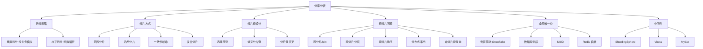

# 分库分表

## 概述
分库分表是应对单库单表数据量过大、性能瓶颈的横向扩展方案。本模块从垂直拆分与水平拆分的选择、分片策略（范围/哈希/一致性哈希）、分片键设计、跨分片问题（Join/分页/排序）到全局唯一 ID 生成，系统梳理分库分表的完整知识体系。

---

## 一、知识图谱



---

## 二、基础到进阶学习路线

- **阶段一：基础入门** —— 理解为什么要分库分表（数据量/并发量瓶颈），掌握垂直拆分和水平拆分的核心区别，了解常见的分片策略。
- **阶段二：原理深入** —— 掌握分片键选择原则，理解一致性哈希的虚拟节点机制，全局唯一 ID 的生成原理（雪花算法/号段模式），跨分片问题（Join/分页/分布式事务）的解决方案。
- **阶段三：实战优化** —— ShardingSphere 等中间件的使用，分片键变更方案，平滑扩容策略，非分片键查询的优化。

---

## 三、核心知识详解

### 3.1 为什么需要分库分表？

#### 单库单表的瓶颈

| 瓶颈类型 | 具体表现 | 分库分表对策 |
|----------|---------|-------------|
| **数据量** | 单表超过 500 万~2000 万行，索引 B+Tree 层级增加，查询变慢 | 水平拆分 |
| **并发量** | 单库连接数有限（通常 2000~5000），高并发扛不住 | 分库分担连接 |
| **磁盘 IO** | 单表数据文件过大，备份恢复慢 | 水平拆分减小单表 |
| **业务耦合** | 不同业务模块共用一库，互相影响 | 垂直拆分解耦 |

#### 拆分时机

::: tip 不是越早越好
分库分表引入分布式复杂度，不应过早优化。建议的单表阈值：
- 流水/日志类：2000 万~5000 万行
- 订单/用户/商品类：500 万~2000 万行
- 优先考虑：读写分离、缓存、索引优化、冷热分离
:::

### 3.2 垂直拆分 vs 水平拆分

#### 垂直拆分（Vertical Sharding）

按业务模块将不同的表分配到不同的库：

```
拆分前：                    拆分后：
┌─────────────────────┐    ┌──────────┐ ┌──────────┐ ┌──────────┐
│ 单库                  │    │ 用户库    │ │ 订单库    │ │ 商品库    │
│ ├── users            │    │ users    │ │ orders   │ │ products │
│ ├── orders           │    │ accounts │ │ payments │ │ inventory│
│ ├── products         │    └──────────┘ └──────────┘ └──────────┘
│ └── inventory        │
└─────────────────────┘
```

**优点**：业务解耦，各模块独立扩展
**缺点**：跨库 Join 无法使用，需要应用层聚合

#### 水平拆分（Horizontal Sharding）

按某种规则将同一张表的数据分散到多个库/表中：

```
拆分前：                    拆分后：
orders 表（1亿行）           db_0.orders_0  db_0.orders_1
                           db_1.orders_0  db_1.orders_1
```

**优点**：解决单表数据量过大问题，线性扩展
**缺点**：引入分布式复杂度（跨分片查询、全局 ID、分布式事务）

### 3.3 分片策略

#### 范围分片（Range Sharding）

```sql
-- 按时间范围分片
-- 2023 年数据 → db_0
-- 2024 年数据 → db_1
-- 2025 年数据 → db_2
```

**优点**：天然支持范围查询，扩容简单（追加新库）
**缺点**：热点数据集中（最新数据都在一个库），老数据闲置

#### 哈希分片（Hash Sharding）

```sql
-- 按 user_id 哈希取模
-- 分片键 = user_id % 4
-- 分片 0: user_id % 4 == 0
-- 分片 1: user_id % 4 == 1
-- 分片 2: user_id % 4 == 2
-- 分片 3: user_id % 4 == 3
```

**优点**：数据均匀分布，热点分散
**缺点**：扩容时需要重新哈希（数据迁移），不支持范围查询

#### 一致性哈希（Consistent Hashing）

```
传统哈希取模扩容问题：
  4 分片 → 5 分片，约 80% 数据需要迁移

一致性哈希：
  使用哈希环 + 虚拟节点
  4 分片 → 5 分片，仅约 20% 数据需要迁移
```

```
哈希环示意（0 ~ 2^32-1）：

       0
   ┌─────────┐
   │  node_1 │
   │    ●    │
   │         │
   │  node_2 │
   │    ●    │
   └─────────┘
      2^32-1

虚拟节点：每个物理节点对应多个虚拟节点，均匀分布在环上
```

#### 复合分片

```sql
-- 先按范围，再按哈希
-- 2023 年数据 → db_0，再按 user_id % 4 分 4 张表
-- 2024 年数据 → db_1，再按 user_id % 4 分 4 张表
```

### 3.4 分片键选择原则

::: danger 分片键是最关键的设计决策
分片键一旦确定，后期变更代价极大（需要全量数据迁移）。
:::

**选择原则**：

1. **高区分度**：数据能均匀分布到各分片，避免热点
2. **查询高频**：大多数查询都带有分片键，路由到单个分片
3. **业务不变性**：分片键值不随业务变化（如 user_id 不变，但手机号可能变）
4. **避免跨分片**：关联查询尽量在同一分片内完成

**常见分片键选择**：

| 业务场景 | 推荐分片键 | 原因 |
|---------|-----------|------|
| 订单系统 | `user_id` | 用户查自己的订单最频繁 |
| 电商平台 | `buyer_id` | 买家视角查询为主 |
| 社交系统 | `user_id` | 用户数据围绕用户聚合 |
| 日志系统 | `create_time` | 范围查询为主，按时间分区 |

### 3.5 跨分片问题解决方案

#### 跨分片 Join

```sql
-- 问题：用户表和订单表按不同分片键分片，无法 Join
SELECT u.name, o.amount FROM users u JOIN orders o ON u.id = o.user_id;

-- 解决方案一：冗余存储（推荐）
-- 将 user_name 冗余到订单表，避免 Join
-- orders 表增加 user_name 字段

-- 解决方案二：应用层聚合
-- 1. 先查用户表，获取用户信息
-- 2. 再查订单表，获取订单列表
-- 3. 应用层组装结果

-- 解决方案三：使用中间件（ShardingSphere 支持绑定表）
-- 将 users 和 orders 按相同分片键分片，配置为绑定表
```

#### 跨分片分页

```sql
-- 问题：LIMIT 100, 20 需要全局排序才能确定第 100 条的位置

-- 解决方案一：禁止跳页（推荐）
-- 只支持上一页/下一页，使用游标分页
SELECT * FROM orders WHERE user_id = ? AND id > ? ORDER BY id LIMIT 20;

-- 解决方案二：二次查询法
-- 1. 每个分片取前 N+offset 条
-- 2. 汇总后全局排序，取 offset 到 offset+limit 条
-- 3. 如果数据不够，扩大范围重新查询

-- 解决方案三：中间件支持
-- ShardingSphere 支持流式归并和内存归并分页
```

#### 非分片键查询

```sql
-- 问题：按非分片键查询，需要扫描所有分片

-- 解决方案一：ES 辅助（推荐）
-- 将需要搜索的字段同步到 ES，ES 返回 ID 列表，再到各分片查详情

-- 解决方案二：基因法
-- 将 user_id 编码到 order_id 中
-- 例如：order_id = 雪花ID（高位放 user_id 的后几位）
-- 这样从 order_id 可以反推出 user_id，定位分片

-- 解决方案三：全分片查询 + 聚合
-- 遍历所有分片查询，应用层聚合
```

### 3.6 全局唯一 ID 生成

#### 雪花算法（Snowflake）

```
64 位 ID 结构：
┌─────┬──────────────────────┬────────────┬──────────┐
│ 1bit │      41bit          │  10bit     │  12bit   │
│ 符号 │    时间戳（ms）       │ 机器 ID    │ 序列号    │
└─────┴──────────────────────┴────────────┴──────────┘

优点：高性能、趋势递增、不依赖外部系统
缺点：依赖机器时钟，时钟回拨会导致 ID 重复
```

```java
// 雪花算法核心逻辑（伪代码）
public synchronized long nextId() {
    long currentTime = System.currentTimeMillis();
    if (currentTime < lastTimestamp) {
        // 时钟回拨处理：等待或抛异常
        throw new RuntimeException("Clock moved backwards");
    }
    if (currentTime == lastTimestamp) {
        sequence = (sequence + 1) & sequenceMask;
        if (sequence == 0) {
            // 当前毫秒序列号用完，等待下一毫秒
            currentTime = waitNextMillis(lastTimestamp);
        }
    } else {
        sequence = 0;
    }
    lastTimestamp = currentTime;
    return (currentTime - epoch) << timestampShift
         | workerId << workerIdShift
         | sequence;
}
```

#### 数据库号段模式

```sql
-- 号段表设计
CREATE TABLE id_generator (
    biz_type VARCHAR(32) PRIMARY KEY COMMENT '业务类型',
    max_id   BIGINT NOT NULL COMMENT '当前最大ID',
    step     INT NOT NULL COMMENT '号段长度',
    version  INT NOT NULL COMMENT '乐观锁版本号'
);

-- 获取号段（用乐观锁）
UPDATE id_generator
SET max_id = max_id + step, version = version + 1
WHERE biz_type = 'order' AND version = @old_version;
-- affected_rows == 1 则获取成功，应用层使用 [max_id, max_id + step) 区间
```

#### 各方案对比

| 方案 | 优点 | 缺点 | 适用场景 |
|------|------|------|---------|
| **雪花算法** | 高性能、不依赖 DB | 时钟回拨问题 | 通用推荐 |
| **数据库号段** | 严格递增、简单可靠 | 依赖 DB，有单点 | 需要趋势递增 |
| **UUID** | 简单、无中心 | 字符串、无序、索引不友好 | 小型系统 |
| **Redis 自增** | 简单、高性能 | 依赖 Redis 持久化 | 已有 Redis 的系统 |

### 3.7 ShardingSphere 简介

ShardingSphere 是 Apache 顶级项目，提供分库分表、读写分离、数据加密等能力。

#### 核心概念

```yaml
# ShardingSphere-JDBC 配置示例
spring:
  shardingsphere:
    datasource:
      names: ds0, ds1
    rules:
      sharding:
        tables:
          t_order:
            actual-data-nodes: ds$->{0..1}.t_order_$->{0..1}
            database-strategy:
              standard:
                sharding-column: user_id
                sharding-algorithm-name: database-inline
            table-strategy:
              standard:
                sharding-column: order_id
                sharding-algorithm-name: table-inline
        sharding-algorithms:
          database-inline:
            type: INLINE
            props:
              algorithm-expression: ds$->{user_id % 2}
          table-inline:
            type: INLINE
            props:
              algorithm-expression: t_order_$->{order_id % 2}
```

#### 支持的 SQL 归并类型

| 归并类型 | 说明 |
|---------|------|
| **流式归并** | 边获取边归并，内存占用小 |
| **内存归并** | 全部加载后归并，适合小结果集 |
| **分组归并** | GROUP BY 结果合并 |
| **排序归并** | ORDER BY 全局排序 |
| **分页归并** | LIMIT 跨分片归并 |

---

## 四、经典应用场景与解决方案

### 场景：订单系统分库分表方案设计

**问题背景**：电商订单表日增 100 万行，单表已超过 2 亿行，查询和写入性能下降严重。

**方案设计**：

```
分片策略：
  分库分表键：user_id（买家 ID）
  分库：user_id % 4 → 4 个库
  分表：order_id % 16 → 每库 16 张表
  总计：4 库 × 16 表 = 64 个分片

全局 ID：
  使用雪花算法生成 order_id
  其中 worker_id 的低位与分片对应

查询路由：
  - 买家查订单：WHERE user_id = ? → 精确定位分片
  - 卖家查订单：ES 索引 → 获取 order_id → 反解 user_id → 定位分片
  - 运营后台：全分片扫描 → 聚合（低频，可接受）

订单号设计：
  order_id 中嵌入 user_id 的基因（后 4 位）
  通过 order_id 位运算即可反推 user_id，定位分片
```

```sql
-- 通过 order_id 基因法反推 user_id，定位分片
-- 假设 order_id 结构：高 40 位时间戳 + 10 位机器 + 4 位 user_id 基因 + 10 位序列
-- 提取 user_id 基因：order_id & 0xF  → 得到 user_id 后 4 位
-- 分片定位：user_id_gene % 4 → 确定分库
```

---

## 五、高频面试题

### Q1: 分库分表为什么要分？什么时候分？

::: details 答案
**为什么要分**：

1. **数据量瓶颈**：单表过亿后，B+Tree 索引层级增加（从 3 层到 4 层甚至 5 层），查询 IO 次数增加，性能下降。DDL 操作（如加索引）耗时数小时甚至不可完成。

2. **并发瓶颈**：单库连接数有限（通常 2000~5000），高并发下连接耗尽。单库的写入 TPS 有上限（受限于磁盘 IO 和锁竞争）。

3. **可用性**：单库故障影响全部业务，分库可以隔离故障范围。

**什么时候分**：

- 先优化：读写分离、缓存、索引优化、冷热分离、垂直拆分（按业务模块）
- 当单表 > 2000 万行且索引优化已到极限，或单库 QPS 接近上限时，再考虑水平拆分
- 原则：**不要过早优化**，分库分表带来的分布式复杂度远大于其表面收益
:::

### Q2: 分片键如何选择？

::: details 答案
分片键是分库分表设计中最重要的决策，选择原则：

1. **高区分度**：数据能均匀分布到各分片。如果某个分片键值的数据量远超其他分片，就会产生热点。例如，不要用 `status`（几个值）做分片键。

2. **查询高频**：绝大多数查询都带有分片键，能路由到单个分片。这是分库分表的前提——如果不能路由到单分片，分库分表的意义就大打折扣。

3. **业务不变性**：分片键值不应随业务变更。例如，`user_id` 不变，而 `phone` 可能换绑。

4. **关联查询亲和性**：有关联关系的表尽量使用相同的分片键，配置为"绑定表"，避免跨分片 Join。

**常见选择**：
- 订单系统 → `user_id`（买家 ID）
- 社交系统 → `user_id`
- 日志系统 → `create_time`（范围分片）
- 电商商品 → `category_id`（垂直拆分）或 `shop_id`（水平拆分）

**反例**：用 `update_time` 做分片键，每次更新数据可能换分片。
:::

### Q3: 全局 ID 怎么生成？各方案优缺点？

::: details 答案
| 方案 | 原理 | 优点 | 缺点 |
|------|------|------|------|
| **雪花算法** | 时间戳 + 机器 ID + 序列号 | 高性能、趋势递增 | 时钟回拨问题 |
| **数据库号段** | 批量预分配 ID 区间 | 严格递增、简单 | 单点依赖、不够灵活 |
| **UUID** | 随机生成 128 位 | 无中心、简单 | 字符串、无序、索引不友好 |
| **Redis 自增** | `INCR` 命令 | 简单、高性能 | 依赖 Redis 持久化 |

**雪花算法时钟回拨解决方案**：
1. 短暂等待，等待时间追上（回拨时间短时）
2. 使用备用 worker_id（美团 Leaf 方案）
3. 抛异常，拒绝服务（回拨时间过长时）
4. 使用 NTP 时间同步，配合 `ntpd -x` 渐进式调整

**推荐**：优先使用雪花算法（或美团的 Leaf-segment 方案），既能保证高性能，又能保证趋势递增。
:::

### Q4: 跨分片分页怎么处理？

::: details 答案
跨分片分页是分库分表中最棘手的问题之一，因为每个分片的数据是局部有序但全局无序的。

**方案一：禁止跳页（推荐）**

使用游标分页，只支持上一页/下一页：
```sql
SELECT * FROM orders WHERE user_id = ? AND id > ? ORDER BY id LIMIT 20;
```

**方案二：二次查询法**

1. 第一轮：每个分片取 `offset + limit` 条数据
2. 汇总排序，取全局第 `offset` 到 `offset + limit` 条
3. 如果某个分片数据不够，需要扩大范围重新查询

**方案三：全局排序表**

单独维护一张全局排序表（或 ES 索引），存储排序键和分片信息，分页查询时先查全局排序表拿到分片和 ID，再回分片查详情。

**方案四：中间件归并**

ShardingSphere 等中间件支持流式归并和内存归并分页，但内存归并在大 offset 时性能仍然很差。

**核心原则**：尽量让分页查询带上分片键，避免跨分片分页。
:::

### Q5: 非分片键如何查询？

::: details 答案
非分片键查询意味着无法定位到具体分片，需要扫描所有分片，性能开销大。

**解决方案**：

1. **ES 辅助索引（推荐）**：将需要搜索的字段实时同步到 Elasticsearch，ES 返回主键列表，再到各分片按主键查询详情。这是互联网公司最常用的方案。

2. **基因法**：将分片键的信息编码到主键中。例如，在 order_id 中嵌入 user_id 的后 4 位，通过位运算即可反推 user_id，定位分片。

3. **冗余存储**：将高频查询的关联字段冗余到分片表中。例如，订单表冗余 `user_name`，避免跨分片查用户表。

4. **全分片查询 + 聚合**：遍历所有分片查询，应用层聚合结果。只适用于低频查询或后台运营场景。

5. **二级索引表**：维护一张"非分片键 → 分片键"的映射表，先查映射表定位分片，再查数据。
:::

### Q6: 分片键变更怎么做？

::: details 答案
分片键变更是分库分表中最复杂的运维操作，本质是**全量数据迁移**。

**方案一：双写 + 灰度切换**

1. 新老分片规则同时存在，双写新老两套分片
2. 后台任务将历史数据按新规则迁移到新分片
3. 读流量逐步切到新分片（灰度放量）
4. 验证无问题后，下线老分片

**方案二：数据冗余 + 逐步迁移**

1. 在新分片规则下创建新表
2. 业务代码同时写新老两套表
3. 后台任务全量迁移历史数据
4. 数据校验一致后，读流量切换
5. 下线老表

**方案三：停机迁移**

对于允许短暂停机的业务，在维护窗口内：
1. 停服
2. 数据导出
3. 按新规则重新导入
4. 验证后启动

**关键原则**：分片键变更 = 数据迁移，必须做好数据校验、灰度切换、回滚方案。
:::

### Q7: 分布式事务在分库分表场景下怎么处理？

::: details 答案
跨分片的事务操作需要分布式事务保证一致性。

**方案一：最终一致性（推荐）**

通过消息队列实现：
1. 本地事务 + 消息表（事务消息）
2. 消费方保证幂等
3. 定时任务对账补偿

**方案二：Seata AT 模式**

通过 undo log 实现自动回滚，对业务代码侵入小：
```java
@GlobalTransactional
public void createOrder() {
    // 操作分片 A
    orderDao.insert(order);
    // 操作分片 B
    inventoryDao.deduct(productId, quantity);
}
```

**方案三：TCC（Try-Confirm-Cancel）**

每个操作都需要实现 Try、Confirm、Cancel 三个接口，业务侵入性大，但一致性最高。

**方案四：事务消息**

使用 RocketMQ 的事务消息，保证本地事务和消息发送的原子性。

**建议**：分库分表后尽量避免跨分片事务，通过业务设计（如将相关数据放在同一分片）来规避。
:::

---

## 六、选型指南

- **适用场景**：单表数据量超过千万级且索引优化已到极限、单库 QPS 接近上限、需要水平扩展的 OLTP 系统
- **不适用场景**：数据量在百万级以内（读写分离 + 缓存即可）、复杂的多表关联查询场景、OLAP 分析型系统（考虑 ClickHouse 等）
- **配置建议**：
  - 分片数量：建议 2 的幂次（2/4/8/16），方便扩容
  - 中间件选择：ShardingSphere-JDBC（轻量，适合 Java 项目）、ShardingSphere-Proxy（跨语言，独立部署）、Vitess（大规模、云原生）
  - 全局 ID：雪花算法（高性能）或数据库号段（严格递增）
  - 非分片键查询：配合 ES 做辅助索引
  - 分片键：选择区分度高、查询高频、不变的字段

---

## 相关文档
- [SQL 优化](./sql-optimization)
- [主从复制](./replication)
- [事务与锁](./transaction-locking)
- [MySQL 选型指南](./selection)