# SQL 优化

## 概述
SQL 优化是 MySQL 性能调优的核心环节，直接影响系统的响应时间和吞吐量。本模块从慢查询定位、执行计划分析、Join 算法原理到深分页优化等实战场景，系统梳理 SQL 优化的完整知识体系，目标是让读者能独立完成 SQL 层面的性能瓶颈诊断与优化。

---

## 一、知识图谱

```mermaid
graph TD
    A[SQL 优化] --> B[慢查询定位]
    A --> C[执行计划分析]
    A --> D[Join 优化]
    A --> E[子查询优化]
    A --> F[分页优化]
    A --> G[特殊场景优化]
    
    B --> B1[slow_query_log]
    B --> B2[long_query_time]
    B --> B3[log_queries_not_using_indexes]
    
    C --> C1[EXPLAIN]
    C --> C2[SHOW PROFILE]
    C --> C3[optimizer_trace]
    C --> C4[索引选择偏差]
    
    D --> D1[NLJ 嵌套循环连接]
    D --> D2[BNL 块嵌套循环]
    D --> D3[BKA Batched Key Access]
    D --> D4[MRR 多范围读取]
    
    E --> E1[子查询 vs JOIN 等价改写]
    E --> E2[派生表优化]
    
    F --> F1[OFFSET 偏移问题]
    F --> F2[游标分页]
    F --> F3[延迟关联]
    
    G --> G1[大 IN 优化]
    G --> G2[大表数据清理]
    G --> G3[COUNT 优化]
```



---

## 二、基础到进阶学习路线

- **阶段一：基础入门** —— 掌握 `EXPLAIN` 字段解读（type/rows/key/Extra），开启慢查询日志，使用 `SHOW PROFILE` 定位耗时阶段。
- **阶段二：原理深入** —— 理解 Join 算法的底层执行流程（NLJ/BNL/BKA/MRR），掌握优化器索引选择机制和 `optimizer_trace` 分析。
- **阶段三：实战优化** —— 深分页、大 IN 列表、大表数据清理等高频线上问题的完整解决方案。

---

## 三、核心知识详解

### 3.1 慢查询定位

#### slow_query_log 配置

```sql
-- 开启慢查询日志（动态设置，重启失效）
SET GLOBAL slow_query_log = 'ON';
SET GLOBAL long_query_time = 1;           -- 阈值 1 秒
SET GLOBAL log_queries_not_using_indexes = 'ON';
SET GLOBAL log_slow_admin_statements = 'ON';

-- 查看日志文件路径
SHOW VARIABLES LIKE 'slow_query_log_file';
```

::: tip 提示
`long_query_time` 支持小数点，如 `0.1` 表示 100ms。新连接生效，已有连接需 `SET SESSION long_query_time = 0.1`。
:::

#### pt-query-digest 分析工具

Percona Toolkit 的 `pt-query-digest` 是慢查询分析的标准工具：

```bash
# 分析慢查询日志
pt-query-digest /var/log/mysql/mysql-slow.log > slow_report.txt

# 按响应时间排序，分析最近 12 小时
pt-query-digest --since=12h /var/log/mysql/mysql-slow.log
```

### 3.2 SHOW PROFILE 分析

```sql
-- 开启 profiling（MySQL 5.7，8.0 已废弃，推荐 performance_schema）
SET profiling = 1;

SELECT * FROM orders WHERE user_id = 1001 ORDER BY create_time DESC LIMIT 10;

-- 查看所有查询的 Query_ID
SHOW PROFILES;

-- 查看指定查询的详细耗时分布
SHOW PROFILE CPU, BLOCK IO FOR QUERY 42;
```

输出示例及关注点：

| 阶段 | 含义 | 正常范围 |
|------|------|---------|
| `starting` | 连接/初始化 | < 0.1ms |
| `checking permissions` | 权限校验 | < 0.01ms |
| `Opening tables` | 打开表 | < 1ms |
| `init` | 初始化执行引擎 | < 0.1ms |
| `System lock` | 系统锁等待 | < 0.1ms |
| `optimizing` | SQL 优化 | < 1ms |
| `statistics` | 统计信息计算 | < 1ms |
| `preparing` | 执行准备 | < 0.1ms |
| **`executing`** | **实际执行** | **与数据量相关** |
| `Sending data` | 结果传输 | 关注 |
| `end` / `query end` | 收尾 | < 0.1ms |
| `removing tmp table` | 清理临时表 | < 0.1ms |

::: warning 注意
MySQL 8.0 已废弃 `SHOW PROFILE`，推荐使用 `performance_schema` 中的 `events_statements_*` 系列表进行更精细的分析。
:::

### 3.3 优化器索引选择

#### 索引选择偏差的常见原因

1. **统计信息不准**：`innodb_stats_persistent` 持久化统计信息未及时更新
2. **回表代价估算偏差**：优化器错误估算索引区分度
3. **前缀索引**：对区分度计算的影响

```sql
-- 强制统计信息更新
ANALYZE TABLE orders;

-- 使用 optimizer_trace 查看优化器决策过程
SET optimizer_trace = 'enabled=on';
SELECT * FROM orders WHERE status = 'paid' AND user_id = 1001;
SELECT * FROM information_schema.OPTIMIZER_TRACE\G
```

#### 索引选择干预手段

```sql
-- 1. FORCE INDEX（强制）
SELECT * FROM orders FORCE INDEX(idx_user_id) WHERE user_id = 1001;

-- 2. USE INDEX（建议）
SELECT * FROM orders USE INDEX(idx_user_id) WHERE user_id = 1001;

-- 3. IGNORE INDEX（忽略）
SELECT * FROM orders IGNORE INDEX(idx_status) WHERE status = 'paid';
```

### 3.4 Join 算法详解

#### NLJ（Nested Loop Join）

最基本的嵌套循环连接，驱动表每行去被驱动表匹配一次：

```
for each row r in 驱动表:
    for each row s in 被驱动表 where r.key = s.key:
        输出 (r, s)
```

::: warning 限制
被驱动表 Join 列必须建索引，否则退化为 SNLJ（Simple NLJ），即全表扫描被驱动表。
:::

#### BNL（Block Nested Loop Join）

被驱动表无索引时，将驱动表数据分批加载到 `join_buffer`，减少被驱动表扫描次数：

```
扫描次数 = 驱动表总行数 / join_buffer 批次数
```

```sql
-- 查看 join_buffer_size
SHOW VARIABLES LIKE 'join_buffer_size';  -- 默认 256K

-- 适当增大（Session 级别）
SET SESSION join_buffer_size = 4194304;  -- 4M
```

#### BKA（Batched Key Access）

在 NLJ 基础上，结合 MRR 优化，批量获取被驱动表数据：

1. 将驱动表 Join Key 批量存入 `join_buffer`
2. 通过 MRR 接口按主键顺序批量回表
3. 减少随机 I/O，利用磁盘顺序读

```sql
-- 启用 BKA（MySQL 5.6+，需配合 MRR）
SET optimizer_switch = 'batched_key_access=on,mrr=on,mrr_cost_based=off';
```

#### MRR（Multi-Range Read）

将随机 I/O 转化为顺序 I/O 的优化技术：

```
传统流程：
  二级索引 → [随机 I/O] → 聚簇索引（回表）

MRR 流程：
  二级索引 → 按 RowID 排序 → [顺序 I/O] → 聚簇索引（回表）
```

```sql
-- 查看 MRR 状态
SELECT @@optimizer_switch LIKE '%mrr%';

-- 强制启用
SET optimizer_switch = 'mrr=on,mrr_cost_based=off';
```

### 3.5 子查询优化

#### 子查询性能陷阱

```sql
-- ❌ 低效：相关子查询，每行外层数据都执行一次内层
SELECT * FROM orders o
WHERE o.amount > (
    SELECT AVG(amount) FROM orders WHERE user_id = o.user_id
);

-- ✅ 改进：用派生表 + JOIN
SELECT o.* FROM orders o
JOIN (
    SELECT user_id, AVG(amount) AS avg_amount
    FROM orders GROUP BY user_id
) t ON o.user_id = t.user_id AND o.amount > t.avg_amount;
```

#### MySQL 5.6/5.7 vs 8.0 的子查询优化差异

| 场景 | MySQL 5.6 | MySQL 5.7 | MySQL 8.0 |
|------|-----------|-----------|-----------|
| `IN (SELECT ...)` | 可能半连接物化 | 半连接优化增强 | 支持更多半连接策略 |
| `NOT IN (SELECT ...)` | 可能反连接 | 反连接优化 | 哈希反连接 |
| 派生表合并 | 不支持 | 不支持 | 支持（自动上拉） |

### 3.6 深分页优化

#### 问题分析

```sql
-- 传统分页：OFFSET 越大越慢
SELECT * FROM orders ORDER BY id LIMIT 1000000, 20;
-- 需要扫描前 1000020 行，丢弃前 1000000 行
```

#### 方案一：游标分页（推荐）

```sql
-- 基于上一页最后一条的主键/排序键
SELECT * FROM orders
WHERE id > 1000000    -- 上一页最后一条的 id
ORDER BY id LIMIT 20;

-- 时间排序场景
SELECT * FROM orders
WHERE (create_time, id) > ('2024-01-15 23:59:59', 999999)
ORDER BY create_time, id LIMIT 20;
```

#### 方案二：延迟关联

```sql
-- 先在索引上完成分页，再回表取数据
SELECT o.* FROM orders o
INNER JOIN (
    SELECT id FROM orders
    ORDER BY id LIMIT 1000000, 20
) tmp ON o.id = tmp.id;
```

#### 方案三：覆盖索引 + 子查询

```sql
SELECT * FROM orders
WHERE id >= (SELECT id FROM orders ORDER BY id LIMIT 1000000, 1)
ORDER BY id LIMIT 20;
```

### 3.7 大 IN 列表优化

```sql
-- ❌ IN 列表过大导致 SQL 解析耗时、索引效率低
SELECT * FROM orders WHERE user_id IN (1,2,3,...,5000);

-- ✅ 方案一：分批处理
-- 将 5000 个 ID 拆成每批 500 个
SELECT * FROM orders WHERE user_id IN (1,2,...,500);
SELECT * FROM orders WHERE user_id IN (501,502,...,1000);
-- ...

-- ✅ 方案二：改用临时表 JOIN
CREATE TEMPORARY TABLE tmp_ids (user_id INT PRIMARY KEY);
INSERT INTO tmp_ids VALUES (1),(2),(3),...,(5000);
SELECT o.* FROM orders o INNER JOIN tmp_ids t ON o.user_id = t.user_id;
DROP TEMPORARY TABLE tmp_ids;

-- ✅ 方案三：范围分段（如果 ID 连续）
SELECT * FROM orders WHERE user_id BETWEEN 1 AND 5000;
```

### 3.8 大表数据清理

::: danger 风险提示
`DELETE FROM big_table WHERE ...` 直接删除千万级数据会导致：长事务占用 undo log、主从延迟、锁表、IO 飙升。
:::

#### 安全清理方案

```sql
-- 步骤一：基于主键分批删除（推荐工具 pt-archiver）
-- 模拟 pt-archiver 逻辑的存储过程
DELIMITER //
CREATE PROCEDURE batch_delete()
BEGIN
    DECLARE affected_rows INT DEFAULT 1;
    WHILE affected_rows > 0 DO
        DELETE FROM orders
        WHERE status = 'expired' AND id < 10000000
        LIMIT 1000;
        SET affected_rows = ROW_COUNT();
        DO SLEEP(0.1);  -- 每次间隔 100ms，控制 IO 压力
        COMMIT;
    END WHILE;
END //
DELIMITER ;

-- 推荐使用 pt-archiver
-- pt-archiver --source h=localhost,D=test,t=orders \
--   --purge --where "status='expired'" --limit 1000 --sleep 0.1
```

#### 删除前的衰减策略

```sql
-- 1. 先创建归档表
CREATE TABLE orders_archive LIKE orders;

-- 2. 迁移有效数据
INSERT INTO orders_archive SELECT * FROM orders WHERE status != 'expired';

-- 3. 断崖切换（业务低峰期）
RENAME TABLE orders TO orders_bak, orders_archive TO orders;

-- 4. 确认后删除备份表
DROP TABLE orders_bak;
```

---

## 四、经典应用场景与解决方案

### 场景：千万级订单表的深分页性能优化

**问题背景**：运营后台需要对订单表（1亿+ 行）按创建时间倒序查看，传统 `LIMIT offset, 20` 在翻到后面时一次查询超过 30 秒。

**完整方案**：

```sql
-- 原始慢查询（30s+）
SELECT * FROM orders
WHERE status = 'paid'
ORDER BY create_time DESC LIMIT 5000000, 20;

-- 优化后的游标分页方案（< 50ms）
-- 1. 建立复合索引
ALTER TABLE orders ADD INDEX idx_status_time (status, create_time, id);

-- 2. 使用游标分页
SELECT * FROM orders
WHERE status = 'paid'
  AND (create_time, id) < ('2024-01-15 10:00:00', 1234567)
ORDER BY create_time DESC, id DESC
LIMIT 20;
```

**关键要点**：
- 必须使用复合索引覆盖 `WHERE` 条件 + `ORDER BY` 字段
- `(create_time, id)` 的元组比较避免同时间戳的数据遗漏
- 前端需要维护"上一页最后一条"的游标值

---

## 五、高频面试题

### Q1: 深分页怎么优化？

::: details 答案
深分页慢的根本原因是 `LIMIT N, M` 需要扫描并丢弃前 N 行。优化策略：

1. **游标分页（首选）**：基于排序键 + 上一页最后一条记录的键值，将 `OFFSET` 转化为范围查询 `WHERE key > last_value`，时间复杂度从 O(N) 降为 O(log N)。

2. **延迟关联**：先在覆盖索引上完成分页（只扫描索引，I/O 小），再通过主键 JOIN 回表取完整数据。

3. **子查询定位**：用子查询快速定位起始 ID，再取范围。

4. **业务限制**：限制最大翻页数（如只允许翻前 100 页），配合 ES 等搜索引擎做全量检索。

5. **降级方案**：对于低频的后台运营分页，接受游标分页但需放弃"总页数"和"跳页"功能。

核心思想：**避免大量无效行的扫描和丢弃**。
:::

### Q2: 为什么不建议用子查询？

::: details 答案
并非绝对不建议，而是需要理解子查询的性能陷阱：

1. **相关子查询**：内层子查询依赖外层每行数据，外层每扫描一行都要执行一次内层查询，相当于 O(N*M)。MySQL 5.6 之前优化器对此类查询处理能力很弱。

2. **物化子查询的代价**：`NOT IN (SELECT ...)` 等反连接场景，MySQL 可能要先将子查询结果物化到临时表，如果子查询结果集很大，内存放不下则落盘，性能骤降。

3. **优化器局限性**：早期版本（< 5.7）对子查询的查询重写（半连接转换）不完善，导致选择了次优的执行计划。

MySQL 8.0 大幅改进了子查询优化，支持派生表条件上拉（Derived Condition Pushdown）、哈希反连接等。在 8.0 中 `IN (SELECT ...)` 形式的半连接通常可以被自动优化，但 **可读性上 JOIN 通常更清晰**。推荐原则：优先用 JOIN 表达，仅在逻辑上确实适合子查询的场景（如标量子查询）才使用。
:::

### Q3: 什么是索引跳跃扫描（Index Skip Scan）？

::: details 答案
索引跳跃扫描是 MySQL 8.0.13 引入的新优化策略。当复合索引 `(a, b)` 前缀列 `a` 区分度很低（如 gender 只有 M/F），但查询只用到 `b` 作为条件时，优化器不再走全表扫描，而是：

1. 枚举前缀列 `a` 的所有 distinct 值（如 M、F）
2. 对每个 distinct 值，使用 `(a=value, b=condition)` 进行索引范围扫描
3. 合并各分片结果（UNION ALL）

**条件**：
- 复合索引前缀列 distinct 值少
- 查询只用到后缀列
- 优化器评估索引跳跃扫描成本低于全表扫描

**示例**：
```sql
-- 索引 idx_gender_age (gender, age)
-- 传统（MySQL 5.7）：不会走这个索引，全表扫描
-- MySQL 8.0：可能走 Index Skip Scan
SELECT * FROM users WHERE age > 25;
```

**开关**：`optimizer_switch` 中 `skip_scan=on|off`。
:::

### Q4: 如何分析慢查询？

::: details 答案
完整分析流程：

**第一步：捕获**
- 开启 `slow_query_log`，设置合理的 `long_query_time`（如 0.1s）
- 同时开启 `log_queries_not_using_indexes`

**第二步：统计分析**
- 使用 `pt-query-digest` 生成摘要报告，按总耗时排序找出 Top N
- 关注 `Rows_examined`（扫描行数）远大于 `Rows_sent`（返回行数）的查询

**第三步：单条深入**
- 使用 `EXPLAIN` 查看执行计划，重点关注：`type`（ALL/INDEX 需优化）、`key`（是否使用正确的索引）、`Extra`（Using filesort/Using temporary 是危险信号）
- 使用 `EXPLAIN FORMAT=JSON` 获取更详细的成本信息
- 使用 `optimizer_trace` 查看优化器为何选择此计划

**第四步：定位瓶颈点**
- `SHOW PROFILE`（5.7）或 `performance_schema.events_statements_*`（8.0）分析各阶段耗时
- 区分是执行扫描慢、排序慢、还是网络传输慢

**第五步：优化与验证**
- 改写 SQL / 添加索引 / 调整参数
- 使用 `EXPLAIN` 对比优化前后
- 压测验证性能提升
:::

### Q5: 大表数据清理如何不影响线上？

::: details 答案
核心原则：**化整为零 + 控制 IO + 避免长事务 + 降低锁影响**。

**分批删除**：
- 每次 `DELETE LIMIT 500~2000`，控制单次事务大小
- 批次间 `SLEEP(0.1~0.5)` 秒，限制 IO 吞吐
- 推荐使用 `pt-archiver` 工具自动化

**断崖切换（表重命名）**：
- 创建新表，只写入有效数据
- 业务低峰期做 `RENAME TABLE` 原子切换
- 风险低，但需要短暂写停

**分区表裁剪**：
- 如果表已按时间范围分区，直接 `DROP PARTITION` 是瞬间完成的 DDL
- 这是最优雅的大表清理方式（O(1) 操作）

**注意事项**：
- 清理前确认 `innodb_flush_log_at_trx_commit` 和 `sync_binlog` 设置，避免刷盘成为瓶颈
- 监控主从延迟，避免从库被 delete 事件堆满 relay log
- 分批删除建议用脚本，且每批自己 `COMMIT`，避免产生大事务
- 清理后执行 `OPTIMIZE TABLE` 回收表空间（注意会锁表，需在低峰期）
:::

### Q6: COUNT(*) 和 COUNT(1) 和 COUNT(column) 有什么区别？

::: details 答案
1. **`COUNT(*)`**：统计所有行数（包括 NULL 行），MySQL 优化器会选取最小的二级索引扫描。速度最快。

2. **`COUNT(1)`**：等价于 `COUNT(*)`，MySQL 优化器会将其等同处理。

3. **`COUNT(column)`**：只统计该列非 NULL 的行数。如果该列有索引，走索引；没有则走全表扫描。

4. **`COUNT(DISTINCT column)`**：统计该列去重后非 NULL 的值的个数，可能用临时表。

**性能建议**：
- 精确计数使用 `COUNT(*)`
- 大表近似计数可用 `SHOW TABLE STATUS` 或 `EXPLAIN SELECT COUNT(*)` 获取估算值
- MyISAM 的 `COUNT(*)` 是 O(1)（元数据存储），InnoDB 必须扫描索引
:::

### Q7: JOIN 驱动表怎么选？

::: details 答案
优化器基于成本模型自动选择，但了解原则有助于人工干预：

1. **NLJ 场景（被驱动表有索引）**：
   - 驱动表越小越好（减少外层循环次数）
   - 也就是 **小表驱动大表**

2. **BNL 场景（被驱动表无索引）**：
   - 驱动表越大越好？不！驱动表行数 ÷ join_buffer 批次数 决定了扫描被驱动表的次数
   - 仍然是 **小表驱动大表** 更优

3. **`LEFT JOIN`**：强制左表为驱动表。

4. **`STRAIGHT_JOIN`**：强制左表为驱动表，等同于 `LEFT JOIN` 但不改变 NULL 语义。

**原则总结**：不管什么 Join 算法，**小表驱动大表**总是正确的方向。
:::

---

## 六、选型指南

- **适用场景**：OLTP 系统的高频小查询、后台管理系统的数据报表、需要精确关联查询的数据检索
- **不适用场景**：纯文本模糊搜索（应使用 Elasticsearch）、超大数据量离线分析（应使用 OLAP 引擎如 ClickHouse）、实时流计算
- **配置建议**：
  - `join_buffer_size`：256K~4M，按需调整，不宜过大（每个 Join 都会分配）
  - `sort_buffer_size`：256K~2M，按需调整
  - `tmp_table_size` / `max_heap_table_size`：根据临时表大小需求调整
  - `eq_range_index_dive_limit`：200（默认），IN 列表元素数量超过此值时使用索引统计信息估算而非逐个 dive

---

## 相关文档
- [事务与锁](./transaction-locking)
- [日志系统](./logging-system)
- [分库分表](./sharding)
- [主从复制](./replication)
- [MySQL 选型指南](./selection)