# 事务与锁

## 概述
事务与锁是 MySQL InnoDB 存储引擎保证数据一致性和并发安全的核心机制。本模块从 ACID 四大特性出发，深入隔离级别、MVCC 多版本并发控制、锁体系（行锁/表锁/间隙锁/临键锁/意向锁）以及死锁诊断，构建完整的并发控制知识体系。

---

## 一、知识图谱

```mermaid
graph TD
    A[事务与锁] --> B[ACID 特性]
    A --> C[隔离级别]
    A --> D[MVCC 机制]
    A --> E[锁体系]
    A --> F[死锁]
    
    B --> B1[Atomicity 原子性]
    B --> B2[Consistency 一致性]
    B --> B3[Isolation 隔离性]
    B --> B4[Durability 持久性]
    
    C --> C1[READ UNCOMMITTED]
    C --> C2[READ COMMITTED]
    C --> C3[REPEATABLE READ 默认]
    C --> C4[SERIALIZABLE]
    
    D --> D1[undo log 版本链]
    D --> D2[ReadView 可见性判断]
    D --> D3[当前读 vs 快照读]
    
    E --> E1[行锁 Record Lock]
    E --> E2[间隙锁 Gap Lock]
    E --> E3[临键锁 Next-Key Lock]
    E --> E4[表锁 Table Lock]
    E --> E5[意向锁 Intention Lock]
    E --> E6[共享锁/排他锁 S/X]
    
    F --> F1[死锁条件]
    F --> F2[死锁检测]
    F --> F3[死锁排查]
```



---

## 二、基础到进阶学习路线

- **阶段一：基础入门** —— 理解 ACID 四大特性含义，掌握四种隔离级别的区别和现象（脏读/不可重复读/幻读），熟悉 `BEGIN`/`COMMIT`/`ROLLBACK` 基础用法。
- **阶段二：原理深入** —— 理解 MVCC 的实现原理（undo log 版本链 + ReadView），掌握行锁/间隙锁/临键锁的作用范围，理解当前读与快照读的区别。
- **阶段三：实战优化** —— 死锁排查与预防，高并发下的锁优化策略，事务隔离级别的选择权衡。

---

## 三、核心知识详解

### 3.1 ACID 四大特性

| 特性 | 含义 | InnoDB 实现机制 |
|------|------|----------------|
| **Atomicity（原子性）** | 事务要么全部成功，要么全部失败回滚 | undo log 保证回滚 |
| **Consistency（一致性）** | 事务前后数据满足完整性约束 | 由其他三个特性共同保证 |
| **Isolation（隔离性）** | 并发事务之间互不干扰 | MVCC + 锁机制 |
| **Durability（持久性）** | 事务提交后数据永久保存 | redo log + 双写缓冲 |

::: tip 提示
"一致性"是 ACID 的终极目标，原子性、隔离性、持久性是实现一致性的手段。说"InnoDB 通过 XXX 保证一致性"是不准确的——一致性是结果，其他三个是手段。
:::

### 3.2 四种隔离级别

#### 隔离级别与并发问题对照表

| 隔离级别 | 脏读 | 不可重复读 | 幻读 | 实现方式 |
|----------|------|-----------|------|----------|
| **READ UNCOMMITTED** | 可能 | 可能 | 可能 | 无锁，直接读最新版本 |
| **READ COMMITTED** | 不可能 | 可能 | 可能 | 每次语句生成新 ReadView |
| **REPEATABLE READ（默认）** | 不可能 | 不可能 | **部分解决** | 事务开始生成一个 ReadView |
| **SERIALIZABLE** | 不可能 | 不可能 | 不可能 | 所有读加共享锁，自动降级 |

```sql
-- 查看当前隔离级别
SELECT @@transaction_isolation;  -- MySQL 8.0
SELECT @@tx_isolation;           -- MySQL 5.7

-- 设置隔离级别
SET SESSION TRANSACTION ISOLATION LEVEL READ COMMITTED;
SET GLOBAL TRANSACTION ISOLATION LEVEL REPEATABLE READ;
```

#### 三种并发问题的定义

- **脏读（Dirty Read）**：事务 A 读到了事务 B 未提交的数据，B 回滚后 A 读到的数据就是"脏"的。
- **不可重复读（Non-Repeatable Read）**：同一事务内两次相同的查询，读到的结果不同（被其他事务 UPDATE 了）。
- **幻读（Phantom Read）**：同一事务内两次相同的范围查询，结果集的行数不同（被其他事务 INSERT 了）。

::: info RR 如何解决幻读？
InnoDB 的 RR 级别通过 **临键锁（Next-Key Lock）** 解决了大部分幻读问题。对于 `SELECT ... FOR UPDATE` 等当前读，会对查询范围加间隙锁，阻止其他事务插入。但对于快照读（普通 SELECT），如果事务中先快照读再当前读，仍可能出现幻读现象。
:::

### 3.3 MVCC 原理

#### 核心组成

```
MVCC = undo log 版本链 + ReadView 可见性判断
```

#### undo log 版本链

每行数据有两个隐藏列：
- **`DB_TRX_ID`**（6 字节）：最近修改该行的事务 ID
- **`DB_ROLL_PTR`**（7 字节）：指向 undo log 的回滚指针

```
聚簇索引记录                           undo log 链
┌─────────────────────────┐     ┌──────────────────┐
│ id=1, name='Alice'      │     │ trx_id=100       │
│ DB_TRX_ID = 200         │<────│ name='Bob'       │
│ DB_ROLL_PTR ────────────┘     │ roll_ptr ────────┼──> ...
└─────────────────────────┘     └──────────────────┘
```

#### ReadView 可见性判断

ReadView 包含四个关键字段（以 RR 级别为例）：

| 字段 | 含义 |
|------|------|
| `m_ids` | 创建 ReadView 时所有活跃事务 ID 列表 |
| `min_trx_id` | `m_ids` 中的最小值 |
| `max_trx_id` | 系统下一个将分配的事务 ID |
| `creator_trx_id` | 创建 ReadView 的事务 ID |

**可见性判断规则**：

```
对于版本链中的某条记录，其 trx_id：
1. trx_id == creator_trx_id  → 可见（自己修改的）
2. trx_id < min_trx_id       → 可见（已提交）
3. trx_id >= max_trx_id      → 不可见（未来的事务）
4. min_trx_id <= trx_id < max_trx_id：
   - 若 trx_id 在 m_ids 中   → 不可见（未提交）
   - 若 trx_id 不在 m_ids 中  → 可见（已提交）
```

#### RC 与 RR 的 ReadView 生成时机差异

```sql
-- RC：每次 SELECT 生成新的 ReadView
-- RR：事务中第一次 SELECT 生成 ReadView，后续复用

-- 验证 RR 的 ReadView 复用
-- 事务 A：
BEGIN;
SELECT * FROM users WHERE id = 1;  -- 此时生成 ReadView
-- 事务 B：UPDATE users SET name = 'Changed' WHERE id = 1; COMMIT;
SELECT * FROM users WHERE id = 1;  -- 仍读到旧值，复用同一个 ReadView
```

### 3.4 当前读 vs 快照读

| 读类型 | 触发语句 | 读取的数据版本 | 是否加锁 |
|--------|---------|---------------|---------|
| **快照读** | 普通 `SELECT` | 基于 ReadView 的历史版本 | 否 |
| **当前读** | `SELECT ... FOR UPDATE` | 最新已提交版本 | 是 |
| **当前读** | `SELECT ... LOCK IN SHARE MODE` | 最新已提交版本 | 是（共享锁） |
| **当前读** | `INSERT/UPDATE/DELETE` | 最新已提交版本 | 是 |

::: warning 注意
`UPDATE` 和 `DELETE` 内部先执行当前读拿到最新数据，再修改。这也是为什么在 RR 级别下，`UPDATE` 能正确更新别的事务刚提交的数据——因为它用的是当前读。
:::

```sql
-- 快照读（无锁）
SELECT * FROM accounts WHERE id = 1;

-- 当前读（加排他锁）
SELECT * FROM accounts WHERE id = 1 FOR UPDATE;

-- 当前读（加共享锁）
SELECT * FROM accounts WHERE id = 1 LOCK IN SHARE MODE;
-- MySQL 8.0 推荐写法：
SELECT * FROM accounts WHERE id = 1 FOR SHARE;
```

### 3.5 锁体系详解

#### 锁的层次结构

```
全局锁 (FLUSH TABLES WITH READ LOCK)
  └── 表级锁
        ├── 表锁 (LOCK TABLES ... READ/WRITE)
        ├── 意向锁 (IS/IX)
        ├── AUTO-INC 锁
        └── 元数据锁 (MDL)
              └── 行级锁
                    ├── 记录锁 (Record Lock)
                    ├── 间隙锁 (Gap Lock)
                    ├── 临键锁 (Next-Key Lock)
                    └── 插入意向锁 (Insert Intention Lock)
```

#### 行锁（Record Lock）

锁定单条索引记录。**注意：InnoDB 行锁是加在索引上的，不是加在数据行上。**

```sql
-- 对 id=1 的索引记录加排他锁
SELECT * FROM users WHERE id = 1 FOR UPDATE;

-- 如果 where 条件不走索引，行锁升级为表锁！
-- 极其危险：全表扫描 + 所有行被锁
SELECT * FROM users WHERE name = 'Alice' FOR UPDATE;  -- name 无索引
```

#### 间隙锁（Gap Lock）

锁定索引记录之间的间隙，防止其他事务在间隙中插入数据。**间隙锁之间不冲突**。

```sql
-- 假设表中有 id = 5, 10, 15 三条记录
-- 间隙分布：(-∞, 5), (5, 10), (10, 15), (15, +∞)

-- 对 id > 10 AND id < 15 的范围加锁
-- 锁住间隙 (10, 15)
SELECT * FROM users WHERE id > 10 AND id < 15 FOR UPDATE;
```

#### 临键锁（Next-Key Lock）

**记录锁 + 间隙锁的组合**。是 InnoDB RR 级别的默认行锁算法，用于解决幻读。

```
临键锁 = 记录锁（锁定当前记录） + 间隙锁（锁定当前记录之前的间隙）
```

```sql
-- 假设 id = 5, 10, 15
-- 临键锁范围：
-- (-∞, 5], (5, 10], (10, 15], (15, +∞)

-- 等值查询唯一索引 → 退化为记录锁
SELECT * FROM users WHERE id = 10 FOR UPDATE;  -- 只锁 id=10

-- 等值查询非唯一索引 → 临键锁 + 下一个间隙锁
-- 假设 age 索引值为 20, 20, 30, 40
SELECT * FROM users WHERE age = 20 FOR UPDATE;
-- 加锁范围：(上一个值, 20] + (20, 30) = 锁住所有 age=20 的记录 + 到 30 的间隙
```

#### 意向锁（Intention Lock）

表级锁，表示"事务打算在更细粒度上加锁"。用于表锁和行锁的共存检测。

| 意向锁类型 | 含义 | 冲突关系 |
|-----------|------|---------|
| **IS（意向共享锁）** | 事务打算在某些行加 S 锁 | 与 X/IX 冲突 |
| **IX（意向排他锁）** | 事务打算在某些行加 X 锁 | 与 S/X/IS 冲突 |

::: tip 意向锁的作用
意向锁的存在使得加表锁时不需要逐行检查是否有行锁冲突，只需检查表级意向锁即可。例如，`LOCK TABLES t WRITE` 只需要检查表 t 上是否有 IS/IX 锁，而不需要遍历所有行。
:::

#### 锁兼容矩阵

|  | S | X | IS | IX |
|--|---|---|----|----|
| **S** | 兼容 | 冲突 | 兼容 | 冲突 |
| **X** | 冲突 | 冲突 | 冲突 | 冲突 |
| **IS** | 兼容 | 冲突 | 兼容 | 兼容 |
| **IX** | 冲突 | 冲突 | 兼容 | 兼容 |

### 3.6 死锁

#### 死锁产生的四个必要条件

1. **互斥**：资源一次只能被一个事务使用
2. **持有并等待**：事务持有资源的同时等待其他资源
3. **不可剥夺**：资源不能被强制释放
4. **循环等待**：事务间形成等待环路

#### 死锁检测与排查

```sql
-- 查看当前锁等待信息（MySQL 8.0）
SELECT * FROM performance_schema.data_locks;

-- 查看锁等待关系
SELECT * FROM performance_schema.data_lock_waits;

-- 查看 InnoDB 最近一次死锁信息
SHOW ENGINE INNODB STATUS\G
-- 关注 LATEST DETECTED DEADLOCK 部分

-- 开启死锁日志到错误日志
SET GLOBAL innodb_print_all_deadlocks = ON;

-- 设置死锁检测超时
SET GLOBAL innodb_lock_wait_timeout = 50;  -- 默认 50 秒
```

#### 死锁经典案例

```sql
-- 场景：两个事务交叉更新相同行

-- 事务 A                      | -- 事务 B
BEGIN;                         | BEGIN;
UPDATE users SET age=26        |
WHERE id = 1;  -- 持有 id=1 锁 |
                               | UPDATE users SET age=31
                               | WHERE id = 2;  -- 持有 id=2 锁
UPDATE users SET age=26        |
WHERE id = 2;  -- 等待 id=2 锁  |
                               | UPDATE users SET age=31
                               | WHERE id = 1;  -- 等待 id=1 锁
                               |
-- 死锁！InnoDB 自动回滚代价较小的事务
```

#### 死锁预防策略

1. **固定加锁顺序**：所有事务按相同顺序访问资源（如按主键升序）
2. **减少事务粒度**：事务越小、越快提交，死锁概率越低
3. **使用索引**：让锁范围更精确，减少锁冲突
4. **降低隔离级别**：RC 级别没有间隙锁，死锁概率更低
5. **合理使用 `SELECT ... FOR UPDATE`**：只在必要时加悲观锁

---

## 四、经典应用场景与解决方案

### 场景：库存扣减的并发安全

**问题背景**：电商秒杀场景中，多个请求同时扣减库存，需要保证不超卖。

**方案一：悲观锁（`SELECT ... FOR UPDATE`）**

```sql
-- 开启事务
BEGIN;

-- 当前读 + 行锁，阻止其他事务同时扣减
SELECT stock FROM products WHERE id = 1001 FOR UPDATE;

-- 应用层检查库存
-- if stock >= quantity:
UPDATE products SET stock = stock - 1 WHERE id = 1001;

COMMIT;
```

**方案二：乐观锁（版本号）**

```sql
-- 使用版本号或库存值作为条件
UPDATE products
SET stock = stock - 1, version = version + 1
WHERE id = 1001 AND stock >= 1 AND version = @old_version;

-- 检查 affected_rows
-- 若为 0，说明库存不足或版本冲突，重试或返回失败
```

**方案三：MySQL 原子更新（推荐）**

```sql
-- 利用行锁的原子性，一行 SQL 搞定
UPDATE products
SET stock = stock - 1
WHERE id = 1001 AND stock >= 1;

-- 检查 affected_rows，若为 0 则库存不足
```

**三种方案对比**：

| 方案 | 优点 | 缺点 | 适用场景 |
|------|------|------|---------|
| 悲观锁 | 逻辑简单，不会冲突重试 | 并发低，排队等待 | 冲突概率高的场景 |
| 乐观锁 | 无锁等待，并发高 | 冲突时需要重试 | 冲突概率低的场景 |
| 原子更新 | 一行 SQL 最简单 | 复杂逻辑无法内嵌 | 简单的增减操作 |

---

## 五、高频面试题

### Q1: 什么是 MVCC？它的实现原理是什么？

::: details 答案
MVCC（Multi-Version Concurrency Control，多版本并发控制）是 InnoDB 实现非锁定读（快照读）的核心机制，通过维护数据的多个版本来实现读写不冲突。

**实现原理**：

1. **undo log 版本链**：每行数据有两个隐藏列 `DB_TRX_ID`（最近修改的事务 ID）和 `DB_ROLL_PTR`（指向 undo log 的指针）。每次修改都会在 undo log 中记录旧版本，形成版本链。

2. **ReadView**：快照读时生成一个 ReadView（读视图），包含活跃事务列表。通过可见性判断规则确定当前事务能看到哪个版本：
   - 版本 `trx_id` 等于当前事务 ID → 可见
   - 版本 `trx_id` 小于最小活跃事务 ID → 可见（已提交）
   - 版本 `trx_id` 大于等于下一个分配的事务 ID → 不可见（未来事务）
   - 在活跃列表中 → 不可见（未提交），沿版本链往前找

3. **RC vs RR 的核心区别**：RC 每次 SELECT 生成新 ReadView，RR 事务中第一次 SELECT 生成一个 ReadView 后复用。这决定了 RC 能看到别的事务提交的更新，而 RR 不能。
:::

### Q2: RR 级别如何解决幻读？

::: details 答案
InnoDB 在 RR 级别下通过 **临键锁（Next-Key Lock）** 解决幻读，但并非完全消除。

**临键锁的工作原理**：
- 临键锁 = 记录锁 + 间隙锁
- 对索引记录加记录锁，同时对该记录之前的间隙加间隙锁
- 例如 `WHERE id BETWEEN 10 AND 20 FOR UPDATE`，会锁住 (5, 10], (10, 15], (15, 20] 以及 (20, 25) 的间隙

**为什么是"部分解决"**：
- 对于 `SELECT ... FOR UPDATE`（当前读），临键锁完全阻止了幻读
- 对于普通 `SELECT`（快照读），RR 的 ReadView 机制保证了不会读到新插入的行
- 但如果事务中先快照读（看不到新行），再当前读（能看到新行），就会出现"幻读"现象

**示例**：
```sql
-- 事务 A
BEGIN;
SELECT * FROM users WHERE age > 20;  -- 快照读，返回 3 行
-- 事务 B 插入一条 age=25 的数据并提交
SELECT * FROM users WHERE age > 20;  -- 快照读，仍返回 3 行
SELECT * FROM users WHERE age > 20 FOR UPDATE;  -- 当前读，返回 4 行！
```

因此严格来说，RR 级别下快照读不会幻读，但"先快照读再当前读"仍可能幻读。
:::

### Q3: 什么是间隙锁？它有什么作用？

::: details 答案
间隙锁（Gap Lock）是 InnoDB 在 RR 隔离级别下使用的一种锁，锁定索引记录之间的间隙，而不是锁定记录本身。

**作用**：
- 防止其他事务在间隙中 INSERT 新记录
- 是 RR 级别解决幻读的核心手段

**特性**：
- **间隙锁之间不冲突**：两个事务可以同时持有同一个间隙的间隙锁
- 间隙锁只阻止 INSERT，不阻止 SELECT 和 UPDATE
- 间隙锁在 RC 级别下不存在

**示例**：
```sql
-- 表中 id 有 5, 10, 15
-- 间隙：(-∞, 5), (5, 10), (10, 15), (15, +∞)

-- 事务 A 锁住 (10, 15) 间隙
SELECT * FROM t WHERE id = 12 FOR UPDATE;  -- id=12 不存在，退化为间隙锁

-- 事务 B 尝试插入
INSERT INTO t VALUES (13);  -- 被阻塞！因为 (10, 15) 间隙被锁
```

**注意事项**：
- 间隙锁在唯一索引等值查询且命中记录时退化为记录锁
- 间隙锁可能导致死锁（插入意向锁与间隙锁冲突）
- 大范围查询会导致大量间隙被锁，影响并发
:::

### Q4: 意向锁的作用是什么？

::: details 答案
意向锁（Intention Lock）是表级锁，用于协调行锁和表锁的共存。

**核心问题**：如果一个事务想要加表锁（如 `LOCK TABLES t WRITE`），它需要知道表里是否有行锁存在。如果没有意向锁，就需要遍历所有行来检查——这是不可接受的。

**解决方案**：
- 事务加行锁之前，先在表上加意向锁（IS 或 IX）
- 加表锁时，只需检查表上是否有冲突的意向锁

**IS 与 IX 的区别**：
- IS（意向共享锁）：事务打算在某些行加 S 锁
- IX（意向排他锁）：事务打算在某些行加 X 锁

**兼容性**：
- IS 和 IX 之间兼容（多事务可以同时持有不同行的锁）
- 表级 S 锁与 IX 冲突（有事务要写行，就不能锁整个表来读）
- 表级 X 锁与 IS、IX 都冲突（有事务在读/写行，就不能排他锁整个表）

**实用意义**：意向锁是 InnoDB 自动维护的，开发者无需手动操作。理解它的存在有助于理解 `SHOW ENGINE INNODB STATUS` 中的锁信息。
:::

### Q5: 死锁怎么排查？如何预防？

::: details 答案
**排查步骤**：

1. **查看死锁日志**：
   ```sql
   SHOW ENGINE INNODB STATUS\G
   ```
   关注 `LATEST DETECTED DEADLOCK` 部分，详细记录了死锁涉及的事务、持有的锁、等待的锁。

2. **开启死锁日志**：
   ```sql
   SET GLOBAL innodb_print_all_deadlocks = ON;
   ```
   所有死锁信息写入 MySQL 错误日志。

3. **实时监控锁等待**（MySQL 8.0）：
   ```sql
   SELECT * FROM performance_schema.data_locks;
   SELECT * FROM performance_schema.data_lock_waits;
   ```

4. **分析死锁日志**：
   - 找出涉及的事务和 SQL
   - 分析锁的持有和等待关系
   - 确定是哪种锁冲突导致

**预防策略**：

1. **固定访问顺序**：所有事务按相同顺序访问资源（如按主键升序更新），打破循环等待。
2. **缩小事务**：事务越小、提交越快，死锁概率越低。
3. **使用索引**：确保 WHERE 条件走索引，避免行锁升级为表锁。
4. **降低隔离级别**：RC 级别没有间隙锁，死锁概率显著降低。
5. **合理使用 `SELECT ... FOR UPDATE`**：不必要的悲观锁会增加死锁风险。
6. **拆分大事务**：将一个大事务拆成多个小事务，减少锁持有时间。
7. **添加重试机制**：应用层捕获死锁异常（Error 1213），自动重试。
:::

### Q6: 当前读和快照读的区别？

::: details 答案
| 维度 | 快照读 | 当前读 |
|------|--------|--------|
| **触发语句** | 普通 `SELECT` | `SELECT ... FOR UPDATE`、`INSERT`、`UPDATE`、`DELETE` |
| **读取数据** | 基于 MVCC ReadView 的历史版本 | 最新已提交版本 |
| **是否加锁** | 不加锁 | 加行锁（S 或 X） |
| **阻塞关系** | 不阻塞写，也不被写阻塞 | 阻塞其他写操作 |
| **一致性** | 事务内一致（RR 级别） | 总是最新数据 |

**关键点**：
- `UPDATE` 内部先执行当前读拿到最新数据，再修改
- 这也是为什么 RR 级别下 `UPDATE` 可以正确更新其他事务刚提交的数据
- 快照读是 MVCC 的体现，当前读是锁机制的体现
:::

### Q7: 为什么 MySQL 选 RR 而不是 RC 作默认隔离级别？

::: details 答案
这是一个经典的历史遗留问题，而非技术优越性选择。

**历史原因**：
MySQL 5.0 之前，binlog 只有 STATEMENT 格式。在 RC 级别下，STATEMENT 格式的 binlog 会导致主从数据不一致。例如：
- 主库 RC 级别下，一个事务中的两次相同 SELECT 可能返回不同结果
- STATEMENT binlog 只记录 SQL，从库重放时可能得到不同结果
- RR 级别下同一事务内结果一致，STATEMENT binlog 重放结果也一致

**当前状态**：
- MySQL 5.7+ 默认 binlog 格式是 ROW，ROW 格式记录的是行变更而非 SQL，不受隔离级别影响
- 因此使用 ROW 格式 binlog 时，RC 和 RR 都不会导致主从不一致
- 许多互联网公司（如阿里、腾讯）将默认隔离级别改为 RC

**RC 的优势**：
- 没有间隙锁，减少死锁概率
- 并发性能更好
- 配合 ROW 格式 binlog 完全安全

**建议**：新项目如果使用 ROW 格式 binlog，可以考虑使用 RC 级别以获得更好的并发性能。
:::

---

## 六、选型指南

- **适用场景**：任何需要数据一致性的 OLTP 场景（电商交易、金融记账、用户系统）
- **不适用场景**：纯日志写入（可考虑 `innodb_flush_log_at_trx_commit=0` 提升性能）、海量数据离线分析
- **配置建议**：
  - `transaction_isolation`：默认 REPEATABLE-READ，高并发可考虑 READ-COMMITTED（需配合 ROW 格式 binlog）
  - `innodb_lock_wait_timeout`：默认 50 秒，高并发建议 5~10 秒
  - `innodb_deadlock_detect`：默认 ON，超高并发（>1000 QPS 同一行）可考虑关闭
  - `innodb_print_all_deadlocks`：生产环境建议 ON，便于排查死锁

---

## 相关文档
- [日志系统](./logging-system)
- [SQL 优化](./sql-optimization)
- [主从复制](./replication)
- [MySQL 选型指南](./selection)