# 备份恢复

## 概述
本模块深入解析 Oracle 备份恢复体系，涵盖 RMAN 备份恢复技术、Data Pump 逻辑备份、闪回技术、归档模式配置等核心内容。学习目标：能够独立完成数据库恢复、掌握各种闪回技术的使用场景，理解归档模式对备份恢复的意义。

---

## 一、知识图谱

```mermaid
graph TB
    subgraph 日志模式
        ARCH[归档模式 ARCHIVELOG]
        NOARCH[非归档模式 NOARCHIVELOG]
    end
    subgraph RMAN备份
        FULL[全量备份 Full]
        INC[增量备份 Incremental]
        DIFF[差异增量 Differential]
        CUM[累积增量 Cumulative]
        REC[恢复目录 Recovery Catalog]
        NOCAT[NOCATALOG 模式]
    end
    subgraph 逻辑备份
        DP[Data Pump expdp/impdp]
        OLD[传统 exp/imp]
    end
    subgraph 恢复类型
        COMPLETE[完全恢复 Complete Recovery]
        INCOMPLETE[不完全恢复 Incomplete]
        TIME[基于时间]
        SCN[基于 SCN]
        CANCEL[基于 Cancel]
        CHANGE[基于变更]
    end
    subgraph 闪回技术
        FQ[闪回查询 Flashback Query]
        FT[闪回表 Flashback Table]
        FD[闪回删除 Flashback Drop]
        FDB[闪回数据库 Flashback Database]
        FVP[闪回版本查询 Flashback Versions Query]
        FQT[闪回事务查询 Flashback Transaction Query]
    end

    ARCH --> COMPLETE
    ARCH --> INCOMPLETE
    FULL --> RMAN
    DIFF --> INC
    CUM --> INC
    FQ --> UNDO
    FT --> UNDO
    FD --> 回收站
    FDB --> 闪回日志
    DP --> DATA_PUMP_DIR
```



---

## 二、基础到进阶学习路线

- **阶段一：基础入门** —— 理解归档模式与非归档模式区别，掌握 RMAN 基本备份语法，了解 Data Pump 基本用法。
- **阶段二：原理深入** —— 理解 RMAN 增量备份的块变化跟踪（Block Change Tracking）、差异增量与累积增量区别、恢复目录的作用。
- **阶段三：实战优化** —— 制定备份恢复策略、使用 RMAN 恢复不完全恢复、应用闪回技术快速恢复误操作。

---

## 三、核心知识详解

### 3.1 归档模式 vs 非归档模式

**归档模式（ARCHIVELOG）：**

- 当联机重做日志写满切换时，ARCn 进程将日志归档到磁盘，保留所有日志变更
- 支持全量备份 + 增量备份 + 不完全恢复 + 点-in-time 恢复
- **生产环境必须开启**

**非归档模式（NOARCHIVELOG）：**

- 联机重做日志直接被覆盖，不保留历史变更
- 只能做全库冷备份，不支持点-in-time 恢复
- **仅用于开发测试环境**

```sql
-- 查看当前日志模式
SELECT name, log_mode FROM v$database;

-- 切换到归档模式（需要重启到 MOUNT 状态）
SHUTDOWN IMMEDIATE;
STARTUP MOUNT;
ALTER DATABASE ARCHIVELOG;
ALTER DATABASE OPEN;

-- 查看归档位置
SELECT name FROM v$archive_dest WHERE dest_name = 'LOG_ARCHIVE_DEST_1';
```

::: danger 生产环境禁止非归档模式
生产环境一旦发生数据文件损坏，非归档模式下只能恢复到上次全备份时间点，之后的数据全部丢失。**生产环境必须开启归档模式**。
:::

### 3.2 RMAN（Recovery Manager）备份恢复

RMAN 是 Oracle 官方推荐的备份恢复工具，提供增量备份、压缩、块恢复等高级功能。

#### 3.2.1 RMAN 连接方式

```bash
# 连接本地数据库
rman target /

# 连接远程数据库
rman target sys/password@tnsname
rman target sys/password@tnsname catalog rman/rman@rcat
```

#### 3.2.2 RMAN 备份级别

| 级别 | 说明 |
|------|------|
| 0 级 | 全量备份，包含所有块 |
| 1 级 | 增量备份，仅备份自上次备份以来变化的块 |

**两种增量备份策略：**

| 策略 | 说明 | 特点 |
|------|------|------|
| **差异增量（Differential）** | 备份上次 0 级或 1 级备份以来变化的块 | 备份快，但恢复慢（需要多个增量备份层） |
| **累积增量（Cumulative）** | 备份上次 0 级备份以来所有变化的块 | 备份慢，但恢复快（只需要 0 级 + 最后一次累积） |

```sql
-- 0 级全量备份
RMAN> BACKUP AS COMPRESSED BACKUPSET DATABASE
       FORMAT '/backup/rman/full_%d_%T_%U.bkp';

-- 1 级差异增量（默认）
RMAN> BACKUP AS COMPRESSED BACKUPSET INCREMENTAL LEVEL 1 DATABASE
       FORMAT '/backup/rman/inc1_%d_%T_%U.bkp';

-- 1 级累积增量
RMAN> BACKUP AS COMPRESSED BACKUPSET INCREMENTAL LEVEL 1 CUMULATIVE DATABASE
       FORMAT '/backup/rman/cum1_%d_%T_%U.bkp';

-- 备份归档日志
RMAN> BACKUP ARCHIVELOG ALL;

-- 备份当前控制文件和 spfile
RMAN> BACKUP CURRENT CONTROLFILE SPFILE;
```

#### 3.2.3 块变化跟踪（Block Change Tracking，BCT）

用于加快增量备份速度，只扫描变化过的数据块，避免扫描整个数据文件：

```sql
-- 启用块变化跟踪
ALTER DATABASE ENABLE BLOCK CHANGE TRACKING
USING FILE '/u01/oradata/orcl/btc.chg';

-- 查看是否启用
SELECT status, filename FROM v$block_change_tracking;
```

**性能收益：** 开启 BCT 后，RMAN 增量备份速度提升 5-10 倍。

#### 3.2.4 RMAN 恢复目录（Recovery Catalog）

**恢复目录的作用：**
- 存储多个目标数据库的备份元数据（默认备份元数据只存控制文件）
- 保留超过控制文件保留周期的备份记录
- 支持存储脚本和报告功能
- 对于 RAC 和多数据库环境推荐使用

```sql
-- 创建恢复目录用户
CREATE TABLESPACE rcat_ts DATAFILE ...;
CREATE USER rman IDENTIFIED BY rman
DEFAULT TABLESPACE rcat_ts
QUOTA UNLIMITED ON rcat_ts;
GRANT RECOVERY_CATALOG_OWNER TO rman;

-- 在 RMAN 中创建恢复目录
RMAN> CONNECT CATALOG rman/rcat@rcdb;
RMAN> CREATE CATALOG;

-- 注册目标数据库
RMAN> REGISTER DATABASE;
```

::: tip NOCATALOG vs CATALOG
- **NOCATALOG**：备份元数据存在控制文件中，简单够用，单实例小型系统推荐
- **CATALOG**：适合企业级多数据库环境，保留完整备份历史，推荐生产环境使用
:::

### 3.3 不完全恢复

不完全恢复是将数据库恢复到过去某个时间点，而不是最新状态：

| 不完全恢复类型 | 说明 | 适用场景 |
|----------------|------|----------|
| 基于时间（Until Time） | 恢复到指定时间点之前 | 误操作后，知道大概时间 |
| 基于 SCN（Until SCN） | 恢复到指定 SCN 之前 | 精确恢复，需要知道错误发生前的 SCN |
| 基于 Cancel（Until Cancel） | 恢复到遇到用户取消操作时 | 恢复到特定日志序列号 |
| 基于变更（Until Change） | 等价于 Until SCN | 同上 |

```sql
-- 基于时间的不完全恢复
RMAN> STARTUP MOUNT;
RMAN> RESTORE DATABASE;
RMAN> RECOVER DATABASE UNTIL TIME "TO_DATE('2024-06-01 10:00:00','YYYY-MM-DD HH24:MI:SS')";
RMAN> ALTER DATABASE OPEN RESETLOGS;
```

::: warning RESETLOGS 警告
不完全恢复后必须 `ALTER DATABASE OPEN RESETLOGS`，这会重置日志序列号，生成新的日志流。所有以前的备份在 RESETLOGS 后仍然有效，RMAN 会自动处理跨 incarnation 的恢复。
:::

### 3.4 逻辑备份（Data Pump）

Data Pump（expdp/impdp）是 Oracle 10g 引入的新一代逻辑备份工具，替代传统的 exp/imp。

**Data Pump 优点：**
- 速度比传统 exp/imp 快很多（直接路径加载）
- 支持并行、过滤、重映射
- 可以通过 `IMPDP` 进行各种转换

```sql
-- 创建目录对象
CREATE DIRECTORY data_pump_dir AS '/backup/dpump';
GRANT READ, WRITE ON DIRECTORY data_pump_dir TO scott;
```

**导出示例：**

```bash
# 全库导出
expdp system/password full=y
directory=data_pump_dir
dumpfile=full.dmp
logfile=expdp_full.log

# Schema 导出
expdp system/password schemas=scott
directory=data_pump_dir
dumpfile=scott.dmp
logfile=expdp_scott.log

# 表导出
expdp system/password tables=scott.employees,scott.departments
directory=data_pump_dir
dumpfile=tables.dmp
```

**导入示例：**

```bash
# 导入并重映射 Schema
impdp system/password
directory=data_pump_dir
dumpfile=scott.dmp
remap_schema=scott:hr
remap_tablespace=users:users2
logfile=impdp_scott.log
```

**Data Pump vs 传统 exp/imp：**

| 特性 | Data Pump expdp/impdp | 传统 exp/imp |
|------|-----------------------|-------------|
| 速度 | 快（直接路径） | 慢 |
| 并行 | 支持 | 不支持 |
| 导出到本地文件 | 需要目录对象 | 直接写客户端 |
| 重映射 | 支持（remap_schema 等） | 不支持 |
| 大文件 | 支持 | 有限制 |
| 状态 | 支持实时查看进度 | 不支持 |

**结论：** Data Pump 全面优于传统工具，现在生产环境只推荐使用 Data Pump。

### 3.5 闪回技术

Oracle 的闪回技术是一组功能，用于快速从误操作中恢复，不完全依赖备份。

| 闪回技术 | 依赖 | 用途 | 需要开启 |
|----------|------|------|----------|
| 闪回查询（Flashback Query） | UNDO | 查询过去某个时间点的数据 | 不需要 |
| 闪回表（Flashback Table） | UNDO | 将表恢复到过去时间点 | 需要行移动 |
| 闪回删除（Flashback Drop） | 回收站 | 恢复误删除的表 | 不需要（默认开启） |
| 闪回数据库（Flashback Database） | 闪回日志 | 将整个数据库闪回过去 | 需要开启 |
| 闪回版本查询 | UNDO | 查看数据行的历史版本 | 不需要 |
| 闪回事务查询 | UNDO | 查询事务的历史变更 | 不需要 |

#### 3.5.1 闪回删除（Flashback Drop）

误删表后，Oracle 将表放入回收站（Recycle Bin），可以快速恢复：

```sql
-- 误删表
DROP TABLE employees;

-- 查看回收站
SELECT original_name, object_name, droptime
FROM user_recyclebin;

-- 恢复表
FLASHBACK TABLE employees TO BEFORE DROP;

-- 恢复并重命名
FLASHBACK TABLE employees TO BEFORE DROP RENAME TO employees_old;
```

#### 3.5.2 闪回查询

```sql
-- 查询 5 分钟前的 emp_id=100 数据
SELECT * FROM employees
AS OF TIMESTAMP (SYSTIMESTAMP - INTERVAL '5' MINUTE)
WHERE emp_id = 100;

-- 基于 SCN 查询
SELECT * FROM employees
AS OF SCN 123456
WHERE emp_id = 100;
```

#### 3.5.3 闪回表

```sql
-- 开启行移动（必须）
ALTER TABLE employees ENABLE ROW MOVEMENT;

-- 闪回表到 1 小时前
FLASHBACK TABLE employees TO TIMESTAMP (SYSTIMESTAMP - INTERVAL '1' HOUR);
```

#### 3.5.4 闪回数据库

将整个数据库闪回过去某个时间点，比 RMAN 不完全恢复快得多：

```sql
-- 开启闪回数据库（需要在 MOUNT 状态）
SHUTDOWN IMMEDIATE;
STARTUP MOUNT;
ALTER DATABASE FLASHBACK ON;
ALTER DATABASE OPEN;

-- 查看闪回恢复区
SELECT name, space_limit, space_used FROM v$recovery_file_dest;

-- 闪回数据库到 1 小时前
SHUTDOWN IMMEDIATE;
STARTUP MOUNT;
FLASHBACK DATABASE TO TIMESTAMP (SYSTIMESTAMP - INTERVAL '1' HOUR);
ALTER DATABASE OPEN RESETLOGS;
```

::: tip 闪回数据库适用场景
闪回数据库比 RMAN 恢复快得多，但只能闪回回退变更，不能恢复数据文件损坏。它最适合在测试环境做 DDL/DML 测试后快速回退，或者生产环境误操作后快速恢复。
:::

---

## 四、经典应用场景与解决方案

### 场景：误删表后快速恢复

**问题背景：**
DBA 不小心在生产库执行了 `DROP TABLE orders`，该表包含近亿条数据，需要尽可能快速恢复，最小化停机时间。

**完整方案：**

```sql
-- Step 1：确认表在回收站
SELECT original_name, object_name, ts_name, droptime
FROM dba_recyclebin
WHERE original_name = 'ORDERS' AND owner = 'SCOTT';

-- 可以看到：
-- ORIGINAL_NAME: ORDERS
-- OBJECT_NAME: BIN$xxxxx==$0
-- DROPTIME: 2024-06-01 10:05:00

-- Step 2：使用闪回删除恢复
FLASHBACK TABLE scott.orders TO BEFORE DROP;

-- 如果表空间不够，可以在恢复时移动到其他表空间：
FLASHBACK TABLE scott.orders TO BEFORE DROP
REMAP TABLESPACE USERS:DATA01;

-- Step 3：验证数据完整性
SELECT count(*) FROM scott.orders;
SELECT max(order_id) FROM scott.orders;

-- 验证索引、约束、触发器等
SELECT index_name FROM dba_indexes WHERE table_name = 'ORDERS';
```

**恢复时间：** 几乎秒级完成（只是改名操作，不需要物理移动数据）。

::: danger 注意事项
- 如果 DROP 后执行了 `PURGE RECYCLEBIN` 或空间不足覆盖了，就无法闪回了
- 如果使用 `DROP TABLE ... PURGE`，直接跳过回收站，也无法恢复
- 必须用闪回删除，不要用 RMAN 恢复（慢很多，影响可用性）
:::

---

## 五、高频面试题

### Q1: RMAN 增量备份中，差异增量和累积增量的区别是什么？
::: details 答案
**差异增量（Differential Incremental）：**
- 默认模式
- 备份**自上次任何备份（0级或1级）以来变化**的块
- 每周策略示例：周日0级，周一到周六每天差异增量

**累积增量（Cumulative Incremental）：**
- 备份**自上次0级备份以来所有变化**的块
- 每周策略示例：周日0级，周一到周六每天累积增量

**恢复复杂度：**

| 策略 | 恢复步骤 | 恢复时间 | 备份时间 |
|------|----------|----------|----------|
| 差异增量 | 0级 → 所有增量层依次应用 | 慢 | 每天快 |
| 累积增量 | 0级 → 最后一次累积增量应用 | 快 | 每天越来越慢 |

**推荐策略：**
一周：周日0级，周一到周六每天差异增量
一个月：每月第一个周日0级，每周日累积增量，其余天差异增量
:::

### Q2: Data Pump 和传统的 exp/imp 有什么区别？为什么推荐 Data Pump？
::: details 答案
**核心区别：**

| 维度 | Data Pump expdp/impdp | 传统 exp/imp |
|------|-----------------------|-------------|
| 架构 | 服务器端进程 | 客户端进程 |
| 速度 | 快很多（支持直接路径加载，避免 SQL 层） | 慢，所有数据都通过 SQL 层 |
| 并行 | 支持 `PARALLEL=n` 并行导出导入 | 不支持 |
| 过滤 | 可以按表、Schema、分区、查询条件过滤 | 有限过滤能力 |
| 重映射 | 支持 `remap_schema`、`remap_tablespace` | 不支持 |
| 空间估算 | 可以预估空间需求 | 不支持 |
| 暂停/恢复 | 支持 `ATTACH` 到现有作业 | 不支持 |
| 大对象 | 很好支持 | 有大小限制 |

**为什么推荐 Data Pump：**
1. 速度快一个数量级以上，尤其大数据量场景
2. 功能更丰富（并行、重映射、过滤、作业管理）
3. Oracle 官方持续维护，新特性只在 Data Pump 中支持
4. 传统 exp/imp 已经废弃，仅用于向后兼容

**结论：** 现在所有逻辑备份都应该使用 Data Pump，不要再使用传统 exp/imp。
:::

### Q3: Oracle 有哪些闪回技术？各适用于什么场景？
::: details 答案
Oracle 一共提供 6 种闪回技术：

| 技术 | 依赖 | 适用场景 | 恢复范围 |
|------|------|----------|----------|
| **闪回查询** | UNDO | 查询历史数据，确认误操作前的数据 | 单查询 |
| **闪回版本查询** | UNDO | 查看数据行的所有版本，追踪变更历史 | 多行历史 |
| **闪回事务查询** | UNDO | 查询事务的详细信息，分析误操作 | 事务级别 |
| **闪回表** | UNDO | 将单个表恢复到过去时间点，恢复误删/误改 | 单表 |
| **闪回删除** | 回收站 | 快速恢复误 DROP 的表 | 整个表 |
| **闪回数据库** | 闪回日志 | 将整个数据库闪回过去时间点 | 整个库 |

**典型场景选择：**
1. 误删一行 → 闪回查询查出，手动插入回去
2. 误删整个表 → 闪回删除（最快秒级恢复）
3. 误删一个表的数据（COMMIT 了）→ 闪回表恢复
4. 误删整个库的大量数据 → 闪回数据库恢复（比 RMAN 快很多）
5. 需要回退所有变更到测试前 → 闪回数据库
:::

### Q4: 归档模式和非归档模式的核心区别是什么？生产环境为什么必须归档？
::: details 答案
**核心区别：**
- **非归档模式**：写满的联机重做日志直接被覆盖，不保留历史变更。只能做冷备份，只能恢复到备份点，之后的数据全部丢失。
- **归档模式**：写满的联机重做日志由 ARCn 进程复制到归档位置，保留所有变更历史。支持点-in-time 恢复，可以恢复到任意时间点。

**生产环境为什么必须归档：**
1. **点-in-time 恢复能力**：误操作后可以恢复到误操作前一刻，最大限度减少数据丢失
2. **在线热备份**：RMAN 热备份只能在归档模式下进行，不中断业务
3. **Data Guard 备库同步**：DG 需要归档日志进行实时应用，非归档模式无法使用 DG
4. **增量备份和块恢复**：RMAN 增量备份和块介质恢复（Block Media Recovery）依赖归档日志
5. **灾难恢复**：存储故障后，可以从备份恢复 + 应用归档日志到最新状态

**不归档的后果：**
如果数据文件损坏，只能恢复到上次全备份时间点，从备份到故障之间的所有数据变更全部丢失，对于生产系统这是无法接受的。
:::

### Q5: 什么是不完全恢复？什么时候需要做不完全恢复？怎么做？
::: details 答案
**不完全恢复：** 将数据库恢复到**过去某个时间点**，而不是恢复到最新状态。不完全恢复之后必须 `RESETLOGS` 打开数据库。

**什么时候需要不完全恢复：**
1. **误操作**：误执行了 `DROP TABLE` 或 `DROP USER`，需要恢复到误操作前
2. **日志损坏**：当前联机日志损坏，无法继续前滚，只能恢复到损坏前
3. **备份后归档日志缺失**：有些归档日志丢失，只能恢复到缺失前
4. **测试**：测试前恢复到某个状态，测试后再恢复回去
5. **逻辑损坏扩散**：错误数据已经提交扩散，需要回退到错误发生前

**不完全恢复的类型：**
- `UNTIL TIME`：恢复到指定时间点之前（最常用）
- `UNTIL SCN`：恢复到指定 SCN 之前（最精确）
- `UNTIL CANCEL`：恢复到用户取消（基于日志序列号恢复）

**操作步骤（以 RMAN 基于时间为例）：**
```sql
1. SHUTDOWN IMMEDIATE;
2. STARTUP MOUNT;
3. RESTORE DATABASE;
4. RECOVER DATABASE UNTIL TIME "TO_DATE('2024-06-01 10:00:00','YYYY-MM-DD HH24:MI:SS')";
5. ALTER DATABASE OPEN RESETLOGS;
```

**关键点：**
- 不完全恢复必须有完整的归档日志从备份点到恢复点
- `RESETLOGS` 后所有后续日志都需要重新生成，不会影响之前的备份
- RMAN 自动支持跨 incarnation 恢复，可以在 RESETLOGS 后正确恢复
:::

### Q6: RMAN 恢复目录有什么作用？什么时候需要使用恢复目录？
::: details 答案
**RMAN 恢复目录的作用：**
1. **存储备份元数据**：默认 RMAN 将备份元数据存在目标数据库的控制文件中，恢复目录是额外的、独立的存储位置
2. **保留更长的备份历史**：控制文件有保留周期（默认备份信息保留 7 天），恢复目录可以永久保留所有备份记录
3. **存储 RMAN 脚本**：可以在恢复目录中存储和管理 RMAN 脚本
4. **支持多数据库管理**：可以同时管理多个目标数据库的备份信息
5. **保留更完整的历史**：RESETLOGS 后可以保留完整的 incarnation 历史

**什么时候需要使用恢复目录：**
- 企业级生产环境，多个数据库需要统一管理备份
- 需要保留超过控制文件保留周期的备份记录
- 需要使用存储脚本功能
- 需要定期做跨数据库恢复验证
- RAC 环境或 Data Guard 环境推荐使用

**什么时候可以不用恢复目录：**
- 单实例小型系统，备份保留周期不长
- 测试开发环境，不需要复杂管理
- NOCATALOG 模式足够简单够用

**对比：**

| 特性 | NOCATALOG | CATALOG |
|------|-----------|---------|
| 元数据存储 | 目标库控制文件 | 独立恢复目录库 |
| 备份历史保留 | 受控制文件保留周期限制 | 永久保留 |
| 多数据库管理 | 不支持 | 支持 |
| RMAN 脚本 | 不支持 | 支持 |
| 复杂度 | 简单 | 需要额外维护一个库 |
:::

---

## 六、选型指南

- **适用场景**：生产环境所有数据库都需要完备的备份恢复策略，RMAN 用于物理备份，Data Pump 用于逻辑备份，闪回技术用于快速误操作恢复。
- **不适用场景**：测试环境可以使用非归档 + 每周一次全备份，降低运维复杂度。
- **配置建议**：
  - 生产环境必须开启归档模式
  - 推荐 RMAN 全备 + 每日增量备份策略，开启块变化跟踪
  - 企业级环境推荐使用 RMAN 恢复目录
  - 开启闪回区（Fast Recovery Area），推荐大小为数据文件大小的 1-2 倍
  - 每日使用 Data Pump 逻辑备份元数据（表结构、存储过程等）
  - 定期做恢复演练（非常重要，备份再全，不能恢复就是没用）

---

## 相关文档
- [Oracle 核心架构](./index)
- [存储结构与表空间](./storage)
- [事务与锁机制](./transaction)
- [优化器与执行计划](./optimizer)
- [性能调优](./performance)
- [Oracle 选型指南](./selection)
- [上一级：数据库](../index)