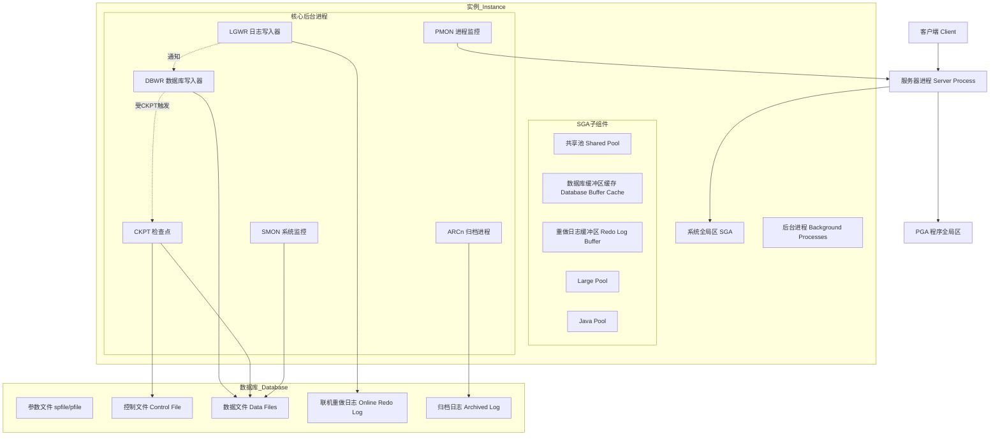
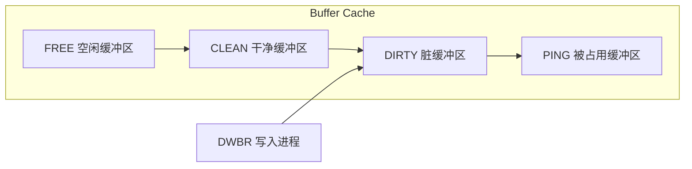

# Oracle 核心架构

## 概述
本模块深入解析 Oracle 数据库核心架构，涵盖实例（Instance）与数据库（Database）的本质区别、内存结构（SGA/PGA）组成、核心后台进程及其协作机制。学习目标：理解 Oracle 的多进程架构设计哲学，能清晰对比 Oracle 与 MySQL 架构差异，为后续深入调优和故障排查打下基础。

---

## 一、知识图谱



---

## 二、基础到进阶学习路线

- **阶段一：基础入门** —— 理解 Instance vs Database 的区别，认识核心后台进程和内存结构的名称与职责。
- **阶段二：原理深入** —— 深入 SGA 各组件的工作机制、DBWR/LGWR/CKPT 之间的协同写入流程、PGA 在排序和哈希连接中的作用。
- **阶段三：实战优化** —— 调整 SGA 参数（SGA_TARGET、SGA_MAX_SIZE）、PGA 调优（PGA_AGGREGATE_TARGET）、连接模式选型、进程数规划。

---

## 三、核心知识详解

### 3.1 实例（Instance）与数据库（Database）的区别

这是 Oracle 最基础也是最核心的概念区分：

| 维度 | 实例（Instance） | 数据库（Database） |
|------|------------------|-------------------|
| 本质 | 内存结构 + 后台进程的组合 | 磁盘上的物理文件集合 |
| 组成 | SGA + PGA + Background Processes | 数据文件、控制文件、重做日志文件 |
| 生命周期 | 启动/关闭，可重建 | 持久存在，无法随意重建 |
| 标识符 | SID（实例名）、ORACLE_SID | DB_NAME、DBID |
| 关系 | 一个实例通常只挂载一个数据库 | RAC 中可被多个实例同时访问 |

::: tip 关键理解
启动 Oracle 等于先启动实例（nomount 状态），再挂载数据库（mount 状态），最后打开数据库（open 状态）。实例是"引擎"，数据库是"燃料"。
:::

**单实例 vs RAC：**

```sql
-- 查看当前实例名
SELECT instance_name FROM v$instance;

-- 查看数据库名
SELECT name FROM v$database;

-- RAC 环境下查看所有实例
SELECT inst_id, instance_name, host_name FROM gv$instance;
```

### 3.2 SGA（System Global Area）系统全局区

SGA 是一组共享内存结构，所有服务器进程和后台进程都可以访问。核心组件如下：

#### 3.2.1 共享池（Shared Pool）

共享池是 SGA 中最关键的组件之一，由 **Library Cache** 和 **Data Dictionary Cache** 组成。

| 子组件 | 功能 | 关键指标 |
|--------|------|----------|
| Library Cache | 缓存已解析的 SQL 语句、PL/SQL 代码、执行计划 | Library Cache Hit Ratio 应 > 95% |
| Data Dictionary Cache（Row Cache） | 缓存数据字典信息（表结构、权限等） | Dictionary Cache Hit Ratio 应 > 95% |
| Result Cache | 缓存 SQL 查询结果和 PL/SQL 函数结果 | 11g 后引入 |

**硬解析 vs 软解析 vs 软软解析：**

```sql
-- 硬解析：SQL 完全未解析过，需要语法检查、语义检查、生成执行计划
SELECT * FROM employees WHERE emp_id = 100;

-- 软解析：SQL 文本已存在于共享池，直接复用执行计划（需变量值不同才算相同SQL）
SELECT * FROM employees WHERE emp_id = 200;

-- 使用绑定变量促进软解析
SELECT * FROM employees WHERE emp_id = :b1;
-- 执行时传入不同值：:b1 = 100, :b1 = 200 都算同一条SQL
```

::: danger 硬解析的危害
高并发 OLTP 系统中，大量硬解析会导致 Library Cache Latch 争用，CPU 使用率飙升，是整个系统性能的最大杀手之一。「硬解析」是 Oracle 优化的第一号公敌。
:::

#### 3.2.2 数据库缓冲区缓存（Database Buffer Cache）

缓存从数据文件读取的数据块，是 Oracle 最耗内存的部分。

**Buffer Cache 的内部结构：**



- **FREE**：未使用或可被覆盖的缓冲区
- **CLEAN**：数据与磁盘一致，可被覆盖
- **DIRTY**：数据已被修改且未写入磁盘，不可被覆盖
- **PING/WRITE**：正在被 DBWR 写入磁盘

**缓冲区的管理算法 —— LRU + LRUW 双链表：**

```sql
-- 查看 Buffer Cache 命中率
SELECT 1 - (physical_reads / (db_block_gets + consistent_gets)) AS buffer_hit_ratio
FROM v$buffer_pool_statistics;
-- 理想值 > 90%
```

**Buffer Cache 的多池配置：**

```sql
-- 可配置三个独立的缓存池
ALTER SYSTEM SET db_keep_cache_size = 200M;    -- 保留池：常驻热数据
ALTER SYSTEM SET db_recycle_cache_size = 100M; -- 回收池：大表全扫不污染主池
-- 其余为 db_cache_size（默认池）
```

#### 3.2.3 重做日志缓冲区（Redo Log Buffer）

记录所有数据变更的"重做向量"，是 Oracle 实现事务持久性（Durability）的核心。

```sql
-- 查看当前 Redo Log Buffer 大小
SELECT name, value FROM v$parameter WHERE name = 'log_buffer';
-- 默认值通常较小（如 16M），高并发系统建议 32M-64M
```

**LGWR 触发写入磁盘的条件（满足任一即触发）：**
1. 用户提交事务（COMMIT）
2. Redo Log Buffer 使用量达到 1/3
3. DBWR 要写脏缓冲前（Write-Ahead-Log 协议：日志先行）
4. 每 3 秒超时
5. 写入数据量达到 1MB

#### 3.2.4 Large Pool

用于分配大块连续内存，避免在共享池中产生碎片。主要使用者：

- **RMAN 备份恢复** 的 I/O Buffer
- **共享服务器模式** 下的 UGA（User Global Area）
- **并行查询** 的消息缓冲区

```sql
ALTER SYSTEM SET large_pool_size = 256M;
```

#### 3.2.5 Java Pool

为 JVM 中的 Java 代码（Oracle 内置 Java 存储过程）提供内存支持。如果不需要 Java 存储过程，可以将其设为较小值。

```sql
ALTER SYSTEM SET java_pool_size = 64M;
```

#### 3.2.6 SGA 的自动内存管理（ASMM）

10g 起，Oracle 支持 SGA 自动共享内存管理：

```sql
-- 启用 ASMM
ALTER SYSTEM SET sga_target = 4G;
ALTER SYSTEM SET sga_max_size = 4G;
-- sga_target 为 0 时表示手动管理模式
```

**手动与自动管理对比：**

| 模式 | 优势 | 劣势 |
|------|------|------|
| 手动管理 | 精细控制，适合资深 DBA | 需要持续监控和调整 |
| ASMM | 自动分配，减少人工干预 | 调整力度有限，特殊场景不适用 |

::: warning 注意
`sga_target` 不能超过 `sga_max_size`。修改 `sga_max_size` 需要重启实例。
:::

### 3.3 PGA（Program Global Area）程序全局区

PGA 是每个服务器进程私有的内存区，不与其它进程共享。

**PGA 的核心组成：**

| 区域 | 功能 |
|------|------|
| Private SQL Area | 绑定变量信息、游标状态 |
| Session Memory | 会话级参数和状态 |
| SQL Work Areas | 排序区（Sort Area）、哈希连接区（Hash Area）、位图合并区（Bitmap Merge Area） |

**Work Areas 的关键参数：**

```sql
-- PGA 总目标大小
ALTER SYSTEM SET pga_aggregate_target = 2G;

-- 关键指标：PGA Cache Hit %
SELECT name, value FROM v$pgastat WHERE name = 'cache hit percentage';
-- 应保持在 100%（表示所有排序/哈希操作都在内存中完成）
```

::: danger PGA 不足的后果
如果 SQL Work Area 不足以在内存中完成排序或哈希连接，Oracle 会将中间结果写入临时表空间（TEMP），导致磁盘 I/O 暴增，性能急剧下降。典型表现：大量 `direct path read temp` / `direct path write temp` 等待事件。
:::

### 3.4 核心后台进程

Oracle 是多进程架构（Windows 上可选多线程），每个后台进程有明确的职责分工：

#### PMON（Process Monitor）进程监控

- 清理异常终止的用户进程（回滚未提交事务、释放锁和资源）
- 动态注册服务到 Listener
- 重启失败的 Dispatcher 和共享服务器进程

#### SMON（System Monitor）系统监控

- 实例崩溃恢复（前滚重做日志 + 回滚未提交事务）
- 合并相邻的空闲区（表空间级别的空间合并）
- 清理不再使用的临时段

#### DBWR（Database Writer）数据库写入器

**DBWR 触发写入的条件（结合 CKPT 工作）：**

1. CKPT 发出检查点信号
2. 没有可用空闲缓冲区（Buffer Cache 中 FREE 缓冲区不足）
3. 脏缓冲区数量达到阈值（默认脏缓冲区超过 10%）
4. 每 3 秒超时
5. 表空间进入热备份模式 / 表空间 OFFLINE / DROP 等操作

::: tip 核心设计理念 — 日志先行协议（WAL）
DBWR 在写脏缓冲入磁盘前，**必须先确保对应的重做日志已被 LGWR 写入磁盘**。这就是 Write-Ahead-Log 协议的核心：日志先于数据落盘，保证崩溃恢复时可以通过重做日志恢复丢失的数据。
:::

#### LGWR（Log Writer）日志写入器

将 Redo Log Buffer 中的内容写入联机重做日志文件。详见 3.2.3 节。

#### CKPT（Checkpoint Process）检查点进程

**CKPT 是 Oracle 中最容易被低估但极其关键的进程。** 主要职责：

1. **更新控制文件和数据文件头**：标记当前 SCN（System Change Number），记录检查点位置
2. **通知 DBWR 写入脏块**：确保所有已提交数据的脏缓冲写入数据文件
3. **减少崩溃恢复时间**：检查点越频繁，恢复时需要处理的日志越少

```sql
-- 查看检查点相关信息
SELECT name, value FROM v$parameter WHERE name LIKE '%checkpoint%';
-- fast_start_mttr_target：目标恢复时间（秒），Oracle 据此调整检查点频率
ALTER SYSTEM SET fast_start_mttr_target = 300; -- 目标：5 分钟内完成崩溃恢复
```

#### ARCn（Archiver Process）归档进程

仅在数据库为 **ARCHIVELOG 模式** 时才工作。将写满的联机重做日志复制到归档位置。

```sql
-- 查看归档模式
SELECT log_mode FROM v$database;

-- 启用归档模式（需在 MOUNT 状态下执行）
-- ALTER DATABASE ARCHIVELOG;
```

### 3.5 Oracle vs MySQL 架构对比

| 维度 | Oracle | MySQL（InnoDB） |
|------|--------|----------------|
| 进程模型 | 多进程（Unix）/ 多线程（Windows） | 单进程多线程 |
| 内存结构 | SGA（共享） + PGA（私有） | InnoDB Buffer Pool + 各种缓存 |
| 日志体系 | Redo Log + Archive Log | Redo Log（ib_logfile）+ Binlog |
| 数据文件 | 数据文件（.dbf）+ 控制文件 | ibdata1（系统表空间）+ .ibd（独立表空间） |
| 实例/数据库关系 | 一个实例挂载一个数据库 | 一个实例对应多个数据库（Schema） |
| 连接池 | 默认无内置连接池 | 内置线程池 |
| 锁升级 | 不会锁升级（始终行级锁） | InnoDB 不会锁升级（Oracle 风格） |

### 3.6 连接方式

#### 专用服务器模式（Dedicated Server）

每个客户端连接对应一个独立的服务器进程：

```
Client --[TCP]--> Listener --> Fork 新的 Server Process --> 分配独立 PGA
```

- 优点：简单、稳定、故障隔离
- 缺点：每个连接消耗一个进程和独立 PGA，高并发时资源消耗大

```sql
-- 配置专用服务器模式（在 tnsnames.ora 中）
-- (SERVER = DEDICATED)
```

#### 共享服务器模式（Shared Server）

多个客户端连接共享一组预先创建的服务器进程池：

```
Client --> Dispatcher --> Request Queue --> Shared Server Processes --> Response Queue --> Client
```

- 优点：节省进程和 PGA 内存（UGA 放在 Large Pool 中），适合大量短连接场景
- 缺点：特定操作不支持（如 RMAN、管理操作），会增加复杂度
- 注意：UGA 在共享服务器模式下存储在 SGA 的 Large Pool 中，而非 PGA

::: warning 生产环境建议
大多数 OLTP 系统推荐使用专用服务器模式。共享服务器模式主要用于并发连接数达到数千的场景，且需要额外调优 Dispatcher 和 Shared Server 数量。
:::

---

## 四、经典应用场景与解决方案

### 场景：新系统上线后的内存参数规划

**问题背景：**
一个新上线的大型 OLTP 系统（Oracle 19c），初期使用默认参数启动，高峰期数据库响应缓慢。服务器物理内存 64GB，Oracle 是唯一的数据库服务。

**完整方案：**

**Step 1：调整 SGA 和 PGA 大小**

```sql
-- 物理内存 64GB，操作系统预留 8GB，Oracle 使用 56GB
-- 经验比例：OLTP 系统 SGA:PGA ≈ 4:1
ALTER SYSTEM SET sga_max_size = 44G SCOPE = SPFILE;
ALTER SYSTEM SET sga_target = 44G;

ALTER SYSTEM SET pga_aggregate_target = 12G;

-- 重启实例使 sga_max_size 生效
SHUTDOWN IMMEDIATE;
STARTUP;
```

**Step 2：验证关键组件自动分配是否合理**

```sql
-- 查看各组件实际大小
SELECT component, current_size/1024/1024 AS size_mb
FROM v$sga_dynamic_components
WHERE current_size > 0
ORDER BY current_size DESC;

-- 查看共享池命中率
SELECT namespace, gets, gethits,
       ROUND(gethits * 100 / gets, 2) AS hit_ratio
FROM v$librarycache
WHERE gets > 0;

-- 查看 Buffer Cache 命中率
SELECT name, value FROM v$sysstat
WHERE name IN ('physical reads cache', 'db block gets', 'consistent gets');
-- 计算：(db_block_gets + consistent_gets - physical_reads) / (db_block_gets + consistent_gets)
```

**Step 3：针对性优化**

```sql
-- 如果共享池命中率低，手动锁定共享池大小
ALTER SYSTEM SET shared_pool_size = 8G;

-- 如果排序/哈希频繁写 TEMP，增大 PGA
ALTER SYSTEM SET pga_aggregate_target = 16G;

-- 监控 PGA 使用情况
SELECT name, ROUND(value/1024/1024, 2) AS value_mb
FROM v$pgastat
WHERE name IN ('aggregate PGA target parameter',
               'aggregate PGA auto target',
               'total PGA allocated',
               'total PGA inuse',
               'cache hit percentage');
```

---

## 五、高频面试题

### Q1: Oracle 和 MySQL 在架构层面最核心的区别是什么？
::: details 答案
**最核心区别在于进程模型和实例-数据库关系：**

1. **进程模型**：Oracle 采用多进程架构（Unix 上每个连接 fork 一个独立进程），MySQL 采用单进程多线程架构。这导致 Oracle 的内存结构分 SGA（共享）和 PGA（私有），而 MySQL 的 InnoDB Buffer Pool 是所有线程共享的。Oracle 的多进程架构更稳定（一个进程崩溃不影响其他连接），但消耗资源更多。

2. **实例与数据库关系**：Oracle 中 Instance（内存+进程）和 Database（磁盘文件）是严格区分的概念，一个实例通常只挂载一个数据库（RAC 例外）。MySQL 中实例和数据库的边界模糊，一个 MySQL Server 可管理多个逻辑数据库（Schema），每个 Schema 可独立备份恢复。

3. **日志体系**：Oracle 只有 Redo Log，MySQL（InnoDB）有 Redo Log + Binlog 双日志体系，Binlog 用于主从复制和基于时间点的恢复。

4. **存储结构**：Oracle 使用表空间（Tablespace）管理物理存储，逻辑结构清晰（表空间 -> 段 -> 区 -> 块）。MySQL 使用表空间文件（ibdata1 或 .ibd）但抽象层次较低。

5. **事务隔离级别**：Oracle 只提供 Read Committed 和 Serializable 两种，默认 Read Committed，使用回滚段实现一致性读（不锁读）。MySQL 提供四种隔离级别，默认 Repeatable Read（更容易出现幻读）。
:::

### Q2: 请详细说明 SGA 中共享池的结构和作用
::: details 答案
共享池是 SGA 中最关键的组件之一，位于 SGA 内部，由 Library Cache、Data Dictionary Cache、Result Cache、Reserved Pool 等组成：

**Library Cache（库缓存）：**
- 存储最近执行的 SQL 语句的解析结果和执行计划
- 内部使用 Hash Bucket 结构组织，同一 Hash 值的对象挂在同一链表（Chain）上
- 每个子游标（Child Cursor）都有独立的执行计划
- 高并发下 Library Cache Latch 争用是经典性能问题

**Data Dictionary Cache（Row Cache）：**
- 缓存数据字典表的信息（如 objauth$, col$, obj$ 等系统表）
- 减少对 SYSTEM 表空间的反复查询
- 使用特殊的 LRU 算法

**共享池的两个核心性能指标：**
- Library Cache Hit Ratio 应 > 95%
- Dictionary Cache Hit Ratio 应 > 95%

**共享池碎片问题：**
当共享池内存被频繁分配和释放时，会产生内存碎片（Free Memory 总量够但没有足够大的连续块）。解决方案：
- 使用绑定变量（减少硬解析产生的碎片）
- 为大型 PL/SQL 对象使用 `DBMS_SHARED_POOL.KEEP` 固定到内存
- 设置足够的 `shared_pool_reserved_size` 保留区域
:::

### Q3: LGWR 和 DBWR 分别在什么条件下会被触发写入？它们之间的关系是什么？
::: details 答案
**LGWR 触发条件（5 种）：**
1. 用户执行 COMMIT —— 这是最基本的触发条件
2. Redo Log Buffer 使用了 1/3 时
3. DBWR 准备写脏缓冲到数据文件前（WAL 协议要求）
4. 每 3 秒超时
5. Redo Log Buffer 中数据量达到 1MB（早期版本 128KB）

**DBWR 触发条件（5 种）：**
1. CKPT 发出检查点信号
2. Buffer Cache 中没有空闲缓冲区（FREE Buffer Wait）
3. 脏缓冲区数量超过阈值（默认全局 Buffer Cache 脏块超过 10%）
4. 每 3 秒超时
5. 表空间进入热备份模式 / OFFLINE / DROP TABLE / TRUNCATE TABLE 等操作

**它们之间的关系（Write-Ahead-Log 协议）：**
- DBWR **绝对不能**在 LGWR 完成对应的重做日志写入之前写脏缓冲。原因是：如果 DBWR 先写了数据而 LGWR 还没来得及写日志时数据库崩溃，那么修改后的数据已经落盘但对应的重做日志丢失，数据库将无法恢复到一致状态。
- 因此每次 DBWR 准备写脏块时，会检查该脏块对应的重做日志的 SCN，如果 LGWR 尚未写入到该 SCN，DBWR 会通知 LGWR 立即写入，然后等待。
- CKPT 是中间的协调者，但 DBWR 和 LGWR 之间的 WAL 约束是直接强制执行的。
:::

### Q4: CKPT（检查点）进程做了什么事？为什么它很重要？
::: details 答案
CKPT 进程是 Oracle 保证数据一致性和控制恢复时间的关键进程。

**CKPT 的职责：**
1. **更新控制文件**：记录当前数据库状态和检查点信息（Checkpoint SCN、检查点队列位置）
2. **更新数据文件头**：在每个数据文件头部写入最新的检查点 SCN
3. **通知 DBWR 将脏块写入磁盘**：通过一条脏块队列（Checkpoint Queue），CKPT 会通知 DBWR 将队列中的脏块写入数据文件，直至到达目标检查点位置
4. **增量检查点**（Incremental Checkpoint）：并非一次性写所有脏块，而是每 3 秒向 DBWR 发送信号写入一批脏块，由参数 `fast_start_mttr_target` 控制检查点节奏

**为什么 CKPT 很重要：**
1. **控制崩溃恢复时间**：检查点越频繁，数据文件和重做日志之间的差距越小，崩溃时 Instance Recovery 需要处理的 Redo 越少。参数 `fast_start_mttr_target` 以秒为单位设定恢复目标。
2. **允许重用联机重做日志**：只有检查点完成后的重做日志组才可以被覆盖复用。
3. **保证实例关闭时的一致性**：执行 `SHUTDOWN NORMAL/IMMEDIATE` 时，CKPT 确保所有脏块写入磁盘后才能关闭。

**验证检查点执行情况：**
```sql
SELECT name, value FROM v$sysstat
WHERE name LIKE '%checkpoint%';
```
:::

### Q5: 请解释 Oracle 的 UNDO 表空间与 Redo Log 的关系
::: details 答案
Undo 和 Redo 是 Oracle 两个独立但协作的机制：

**本质区别：**

| 维度 | Redo Log | Undo 表空间 |
|------|----------|-------------|
| 目的 | 实现事务持久性（Durability），崩溃恢复 | 实现事务原子性（Atomicity），回滚 + 一致性读 |
| 记录内容 | 如何"重做"一个修改操作（数据变更后的值） | 如何"撤销"一个修改操作（数据变更前的值） |
| 写入时机 | 随变更操作实时写入 Redo Log Buffer | 随变更操作写入 Undo 段 |
| 存储时效 | 归档模式下可长期保留 | 由 UNDO_RETENTION 参数控制，事务提交后可被覆盖 |

**协作关系：**
当执行一条 UPDATE 语句时：
1. Oracle 先将原始数据（旧值）写入 Undo 段
2. 将 Undo 块的变更也生成 Redo 记录（Redo 保护 Undo）
3. 将数据块的变更写入 Buffer Cache，同时生成 Redo 记录
4. Commit 时，LGWR 将 Redo 刷入磁盘（但 Undo 和 Dirty Block 不一定立即写入）

**Redo 保护 Undo 的原因：**
假设数据库崩溃时，Undo 段对数据块的修改在Buffer Cache中但尚未写入磁盘。恢复时先通过 Redo 恢复Undo段，再通过 Undo 回滚未提交事务。这就是"Redo 保护 Undo，Undo 保护数据"的设计哲学。
:::

### Q6: 专用服务器和共享服务器连接模式有什么区别？各适合什么场景？
::: details 答案
**专用服务器模式（Dedicated Server）：**
- 每个客户端连接由 Listener 分配一个独立的操作系统进程（或线程）
- 该进程拥有独立的 PGA（Program Global Area）
- 连接数和进程数 1:1 映射

**共享服务器模式（Shared Server）：**
- 客户端通过 Dispatcher 连接到共享服务器进程池
- 请求放入 Request Queue，空闲的共享服务器进程从队列中取请求处理
- 多个会话可共享少数几个服务器进程
- UGA 存储在 SGA 的 Large Pool 中（而非 PGA）

**选择建议：**
- 专用服务器：OLTP 系统（并发连接 < 5000），操作简单稳定，绝大多数场景推荐
- 共享服务器：并发连接 > 5000 且大部分连接处于空闲状态的场景（如 Web 应用连接池溢出时），但需注意 RMAN、批处理等操作不支持共享服务器
:::

---

## 六、选型指南

- **适用场景**：核心金融系统（银行核心、证券交易）、电信计费系统、政府大型数据库、大型 ERP（SAP/Oracle EBS）、对 ACID 和数据一致性要求极高的大型 OLTP 系统
- **不适用场景**：小型 Web 应用、预算敏感的创业公司、已有成熟的 MySQL/PostgreSQL 技术栈、数据量较小（< 100GB）的场景
- **配置建议**：
  - 物理内存的 70-80% 分配给 Oracle（SGA + PGA）
  - OLTP 系统 SGA:PGA ≈ 4:1，OLAP 系统 SGA:PGA ≈ 1:2
  - 生产环境务必开启 ARCHIVELOG 模式
  - 至少设置 3 组联机重做日志，500MB-2GB 每组

---

## 相关文档
- [存储结构与表空间](./storage)
- [事务与锁机制](./transaction)
- [优化器与执行计划](./optimizer)
- [备份恢复](./backup-recovery)
- [性能调优](./performance)
- [Oracle 选型指南](./selection)
- [上一级：数据库](../index)