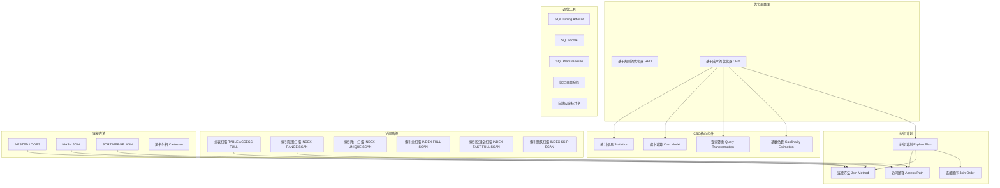

# 优化器与执行计划

## 概述
本模块深入解析 Oracle 优化器（Optimizer）的工作原理、成本计算模型、执行计划的解读方法以及 SQL 调优的核心工具。学习目标：能独立解读执行计划，理解 CBO 决策过程，掌握统计信息管理、绑定变量优化和 SQL Profile 的使用。

---

## 一、知识图谱



---

## 二、基础到进阶学习路线

- **阶段一：基础入门** —— 理解 RBO vs CBO 的区别，掌握 `EXPLAIN PLAN` 和 `DBMS_XPLAN.DISPLAY` 的基本使用，能识别常见的访问路径。
- **阶段二：原理深入** —— 理解 CBO 成本计算公式、连接方法和连接顺序的选择逻辑、统计信息对执行计划的影响。
- **阶段三：实战优化** —— 绑定变量窥探问题的诊断与修复、SQL Profile 和 SQL Plan Baseline 的应用、AWR 中 TOP SQL 的调优。

---

## 三、核心知识详解

### 3.1 RBO vs CBO 优化器

| 维度 | RBO（Rule-Based Optimizer） | CBO（Cost-Based Optimizer） |
|------|---------------------------|---------------------------|
| 决策依据 | 预定义的 15 级规则 | 统计信息 + 成本模型 |
| 优先级 | 按访问路径的固定等级 | 选择成本最低的执行计划 |
| 统计信息 | 不需要 | 依赖表和索引的统计信息 |
| 绑定变量 | 不敏感 | 窥探绑定变量值 |
| 状态 | Oracle 10g 起已废弃 | 默认且唯一推荐 |

**RBO 的 15 级规则（按优先级从高到低）：**

1. ROWID 访问（单行，最快）
2. 通过聚簇连接的 ROWID 访问
3. 通过唯一索引的 HASH KEY 访问
4. 通过主键或唯一索引访问
5. 聚簇连接
6. 哈希聚簇键
7. 索引聚簇键
8. 复合索引
9. 单列索引
10. 索引范围扫描
11. 索引全扫描
12. 排序合并连接
13. 索引列的 MAX/MIN
14. 索引列的 ORDER BY
15. 全表扫描（最慢，RBO 的第 15 级）

::: warning 注意
RBO 在 Oracle 10g 后已不再维护，所有新特性（如分区表、物化视图、索引组织表等）都不支持 RBO。面试中提及 RBO 主要是为了说明历史演进。
:::

### 3.2 CBO 成本计算模型

CBO 的成本是一个内部单位，综合了 I/O 和 CPU 的预估消耗：

```
Cost = I/O_Cost + CPU_Cost

其中：
- I/O_Cost = 单块读次数 × 单块读成本 + 多块读次数 × 多块读成本
- CPU_Cost = CPU 预估周期数 / (每秒 CPU 周期数 × 单块读时间)
```

**关键概念：**

```sql
-- 查看优化器统计信息
SELECT name, value FROM v$parameter WHERE name LIKE '%optimizer%';

-- optimizer_mode: ALL_ROWS（默认，吞吐量优先）/ FIRST_ROWS_n（响应时间优先）
-- optimizer_index_cost_adj: 索引成本调整因子（默认 100）
-- optimizer_index_caching: 索引缓存百分比（默认 0）
```

::: danger 参数调整风险
`optimizer_index_cost_adj` 和 `optimizer_index_caching` 是全局参数，修改它们会影响所有 SQL 的执行计划。**强烈不建议**在系统级别修改这些参数，应该通过 SQL Profile 或 Hint 在 SQL 级别调整。
:::

### 3.3 执行计划解读

#### 3.3.1 获取执行计划

```sql
-- 方法一：EXPLAIN PLAN（预估计划，不实际执行）
EXPLAIN PLAN FOR
SELECT e.emp_name, d.dept_name
FROM employees e JOIN departments d ON e.dept_id = d.dept_id
WHERE e.salary > 5000;

SELECT * FROM TABLE(DBMS_XPLAN.DISPLAY);

-- 方法二：DBMS_XPLAN.DISPLAY_CURSOR（从共享池获取实际执行计划）
SELECT * FROM TABLE(DBMS_XPLAN.DISPLAY_CURSOR('sql_id', NULL, 'ALLSTATS LAST'));

-- 方法三：AUTOTRACE（SQL*Plus 中）
SET AUTOTRACE ON;
SET AUTOTRACE TRACEONLY;  -- 只显示计划，不显示结果

-- 方法四：AWR 报告中的 SQL Statistics 部分
```

#### 3.3.2 执行计划输出解读

```sql
-------------------------------------------------------------------------------
| Id | Operation                    | Name          | Rows | Bytes | Cost (%CPU)|
-------------------------------------------------------------------------------
|  0 | SELECT STATEMENT             |               |  100 | 12000 |    15  (7)|
|  1 |  HASH JOIN                   |               |  100 | 12000 |    15  (7)|
|  2 |   TABLE ACCESS FULL          | DEPARTMENTS   |   10 |   300 |     3  (0)|
|  3 |   TABLE ACCESS BY INDEX ROWID| EMPLOYEES     |  100 |  9000 |    12  (8)|
|  4 |    INDEX RANGE SCAN          | EMP_SALARY_IDX|  100 |       |     2  (0)|
-------------------------------------------------------------------------------
```

**解读要点：**

| 列 | 含义 | 说明 |
|----|------|------|
| Id | 步骤编号 | 越靠右（缩进越多）越先执行 |
| Operation | 操作类型 | 访问路径 + 连接方法 |
| Name | 对象名 | 表名、索引名等 |
| Rows | 预估行数 | CBO 估算该步骤返回的行数 |
| Bytes | 预估字节数 | 该步骤返回的数据量 |
| Cost (%CPU) | 成本 | 内部成本值，越小越好 |

**执行顺序：从右到左、从上到下、从内到外：**

```
Id=4（最内层）→ Id=3 → Id=2 → Id=1 → Id=0
```

#### 3.3.3 常见访问路径

| 操作 | 说明 | 适用场景 |
|------|------|----------|
| TABLE ACCESS FULL | 全表扫描，使用多块读 | 大范围扫描、无合适索引 |
| TABLE ACCESS BY INDEX ROWID | 通过索引定位 ROWID 后回表 | 选择性高的查询 |
| INDEX UNIQUE SCAN | 唯一索引扫描 | 等值查询主键/唯一键 |
| INDEX RANGE SCAN | 索引范围扫描 | 范围查询、非唯一索引等值查询 |
| INDEX FULL SCAN | 索引全扫描（有序） | 需要排序且索引已有序 |
| INDEX FAST FULL SCAN | 索引快速全扫描（无序，多块读） | 不需要排序，只需索引列 |
| INDEX SKIP SCAN | 索引跳跃扫描 | 复合索引的前导列不在条件中 |

#### 3.3.4 连接方法对比

| 连接方法 | 原理 | 适用场景 | 性能特征 |
|----------|------|----------|----------|
| NESTED LOOPS | 外层表每行去内层表匹配（索引查找） | 小表驱动大表，内层有高效索引 | 首行返回快，适合 OLTP |
| HASH JOIN | 小表建哈希表，大表探测匹配 | 两表均较大，无高效索引 | 需要 PGA 内存，适合 OLAP |
| SORT MERGE JOIN | 两表排序后合并 | 数据已排序，或等值/非等值连接 | 排序开销大，较少使用 |

```sql
-- 强制连接方法
SELECT /*+ USE_NL(e d) */ ... FROM employees e JOIN departments d ...
SELECT /*+ USE_HASH(e d) */ ... FROM employees e JOIN departments d ...
SELECT /*+ USE_MERGE(e d) */ ... FROM employees e JOIN departments d ...
```

### 3.4 统计信息管理

统计信息是 CBO 决策的基础，不准确的统计信息是执行计划劣化的主因。

```sql
-- 收集表统计信息
EXEC DBMS_STATS.GATHER_TABLE_STATS('SCOTT', 'EMPLOYEES');

-- 收集 Schema 统计信息（estimate_percent 推荐使用 AUTO_SAMPLE_SIZE）
EXEC DBMS_STATS.GATHER_SCHEMA_STATS('SCOTT',
    estimate_percent => DBMS_STATS.AUTO_SAMPLE_SIZE,
    method_opt => 'FOR ALL COLUMNS SIZE AUTO',
    cascade => TRUE,
    degree => 4);

-- 查看统计信息
SELECT table_name, num_rows, blocks, avg_row_len,
       last_analyzed
FROM dba_tables WHERE owner = 'SCOTT';

-- 查看列的直方图（Histogram）
SELECT column_name, histogram, num_buckets, num_distinct
FROM dba_tab_col_statistics
WHERE owner = 'SCOTT' AND table_name = 'EMPLOYEES';

-- 查看索引统计信息
SELECT index_name, blevel, leaf_blocks, distinct_keys,
       clustering_factor
FROM dba_indexes WHERE owner = 'SCOTT';
```

::: tip 关键统计信息指标
- **clustering_factor**（聚簇因子）：索引顺序与表中数据物理顺序的接近程度。值越小越好（越接近表的块数），表示索引扫描效率越高。
- **blevel**（B-Tree 层级）：索引的深度，通常 2-3 层。
- **num_distinct**（不同值数量）：用于计算选择性。
- **直方图（Histogram）**：当数据分布不均匀时，直方图帮助 CBO 更准确地估算基数。
:::

### 3.5 绑定变量与绑定变量窥探

#### 3.5.1 绑定变量的好处

使用绑定变量可以让 SQL 文本相同，从而复用共享池中的执行计划，避免硬解析：

```sql
-- 不用绑定变量（导致硬解析）
SELECT * FROM employees WHERE dept_id = 10;
SELECT * FROM employees WHERE dept_id = 20;  -- 另一条 SQL！

-- 使用绑定变量（软解析）
SELECT * FROM employees WHERE dept_id = :b1;
```

#### 3.5.2 绑定变量窥探（Bind Variable Peeking）

Oracle 在第一次硬解析时会"窥探"绑定变量的实际值，根据该值生成执行计划。但后续执行使用不同绑定变量值时，仍复用第一次的执行计划。

**问题场景：**

```sql
-- 第一次执行：dept_id = 10（该部门有 50000 人），CBO 选择全表扫描
SELECT * FROM employees WHERE dept_id = :b1;  -- 窥探值 10

-- 第二次执行：dept_id = 99（该部门只有 5 人），CBO 仍使用全表扫描（不合适！）
```

::: danger 绑定变量窥探的陷阱
这是 Oracle 性能问题中最常见的原因之一。当数据分布不均匀时，第一次窥探的值可能生成对后续执行不友好的执行计划。
:::

#### 3.5.3 自适应游标共享（Adaptive Cursor Sharing，11g+）

Oracle 11g 引入自适应游标共享来解决绑定变量窥探问题：

- 当 Oracle 检测到同一个 SQL 使用不同绑定变量值导致预估行数差异很大时
- 自动为该 SQL 生成多个子游标（Child Cursor），每个子游标有独立的执行计划
- 下次执行时根据绑定变量值选择最合适的子游标

```sql
-- 查看自适应游标共享
SELECT is_bind_sensitive, is_bind_aware, is_shareable
FROM v$sql
WHERE sql_id = '&sql_id';
```

### 3.6 SQL 调优顾问与 SQL Profile

#### SQL Tuning Advisor

从 AWR 或共享池中获取 SQL，自动分析并给出优化建议：

```sql
-- 创建调优任务
DECLARE
    l_task_name VARCHAR2(30);
BEGIN
    l_task_name := DBMS_SQLTUNE.CREATE_TUNING_TASK(
        sql_id => '&sql_id',
        scope => 'COMPREHENSIVE',
        time_limit => 60
    );
    DBMS_SQLTUNE.EXECUTE_TUNING_TASK(task_name => l_task_name);
END;
/

-- 查看报告
SELECT DBMS_SQLTUNE.REPORT_TUNING_TASK('TASK_xxx') FROM DUAL;
```

#### SQL Profile

SQL Profile 是 Oracle 自动生成的辅助信息，用于修正 CBO 的基数估算错误，但**不改变 SQL 文本**。它比 Hint 更优雅，因为不需要修改应用代码。

```sql
-- 接受 SQL Profile 建议
EXEC DBMS_SQLTUNE.ACCEPT_SQL_PROFILE(
    task_name => 'TASK_xxx',
    task_owner => 'SCOTT',
    replace => TRUE
);
```

#### SQL Plan Baseline（SPM）

SQL Plan Management 是 11g 引入的执行计划稳定性机制，类似于"执行计划白名单"：

```sql
-- 从共享池加载基线
DECLARE
    l_plans_loaded PLS_INTEGER;
BEGIN
    l_plans_loaded := DBMS_SPM.LOAD_PLANS_FROM_CURSOR_CACHE(
        sql_id => '&sql_id'
    );
END;
/

-- 查看基线
SELECT sql_handle, plan_name, enabled, accepted
FROM dba_sql_plan_baselines;
```

---

## 四、经典应用场景与解决方案

### 场景：统计信息过期导致执行计划劣化

**问题背景：**
某系统每天凌晨 3 点进行大批量数据导入（INSERT 3000 万行），原有统计信息在导入前收集，导入后执行计划全部基于过期统计信息，导致大量全表扫描，系统响应时间从毫秒级变为秒级。

**完整方案：**

```sql
-- Step 1：确认统计信息过期
SELECT table_name, num_rows, last_analyzed
FROM dba_tables
WHERE owner = 'SCOTT' AND table_name = 'LARGE_TABLE';

-- Step 2：批量导入后立即收集统计信息
EXEC DBMS_STATS.GATHER_TABLE_STATS(
    ownname => 'SCOTT',
    tabname => 'LARGE_TABLE',
    estimate_percent => DBMS_STATS.AUTO_SAMPLE_SIZE,
    method_opt => 'FOR ALL COLUMNS SIZE AUTO',
    cascade => TRUE,
    no_invalidate => FALSE  -- 立即让现有游标失效
);

-- Step 3：使用锁定统计信息防止意外收集
-- 对于数据量稳定的表，锁定统计信息
EXEC DBMS_STATS.LOCK_TABLE_STATS('SCOTT', 'STABLE_TABLE');

-- Step 4：对于频繁变更的表，使用增量统计信息
EXEC DBMS_STATS.SET_TABLE_PREFS('SCOTT', 'LARGE_TABLE',
    'INCREMENTAL', 'TRUE');

-- 收集增量统计信息（仅收集变更分区的统计信息）
EXEC DBMS_STATS.GATHER_TABLE_STATS('SCOTT', 'LARGE_TABLE',
    granularity => 'APPROX_GLOBAL AND PARTITION');
```

---

## 五、高频面试题

### Q1: CBO 优化器的工作原理是什么？它如何选择执行计划？
::: details 答案
CBO（Cost-Based Optimizer）的工作流程分为以下阶段：

**1. 查询转换（Query Transformation）：**
对 SQL 进行逻辑等价转换，如视图合并（View Merging）、谓词推进（Predicate Pushing）、子查询展开（Subquery Unnesting）、星型转换（Star Transformation）等。

**2. 基数估算（Cardinality Estimation）：**
- 基于统计信息（行数、不同值数量、直方图）估算每个步骤返回的行数
- 选择性（Selectivity）= 返回行数 / 总行数
- 连接基数通过连接列的统计信息估算

**3. 成本计算（Cost Calculation）：**
- 综合 I/O 成本（单块读 + 多块读）和 CPU 成本
- 使用系统统计信息（CPU 速度、单块读时间、多块读时间）

**4. 计划搜索（Plan Search）：**
- 枚举可能的访问路径（全表扫描、各种索引扫描）
- 枚举可能的连接方法（Nested Loops、Hash Join、Sort Merge Join）
- 枚举可能的连接顺序（表排列）
- 选择总成本最低的执行计划

**关键点：** CBO 的决策质量取决于统计信息的准确性。过期的统计信息、缺少直方图、数据倾斜等都会导致 CBO 做出错误选择。
:::

### Q2: 如何解读 Oracle 执行计划？执行计划中的 Cost、Rows、Bytes 分别代表什么？
::: details 答案
**执行计划的解读方法：**

**读取顺序：** 从右到左、从上到下、从内到外。缩进最多的步骤最先执行，同级步骤中最上面的先执行。

**列的解读：**

| 列 | 含义 | 深入说明 |
|----|------|----------|
| Cost | 预估成本 | 内部单位，综合了 I/O 和 CPU 消耗。同一 SQL 的不同执行计划对比才有意义，不同 SQL 之间的 Cost 不可直接比较 |
| Rows | 预估行数 | CBO 的基数估算结果。如果 A-Rows（实际行数）与 E-Rows（预估行数）差异很大，说明统计信息不准确 |
| Bytes | 预估字节数 | 该步骤返回的数据量，影响 TEMP 空间使用和网络传输 |

**关键判断指标（使用 `ALLSTATS LAST` 查看实际执行统计）：**
- A-Rows vs E-Rows：差异大说明统计信息问题
- A-Time：实际执行时间，定位瓶颈步骤
- Buffers：逻辑读次数，主要性能指标
- Reads：物理读次数，如果很高说明 Buffer Cache 命中率低

**常见性能瓶颈信号：**
- NESTED LOOPS 的内层 A-Rows 远大于 E-Rows（实际扫描太多行）
- HASH JOIN 的 TEMP 空间使用（内存不足写磁盘）
- TABLE ACCESS FULL 的大表扫描（检查是否有合适的索引）
- 笛卡尔积（CARTESIAN）出现（通常意味着缺少连接条件）
:::

### Q3: 绑定变量窥探（Bind Variable Peeking）是什么？它会导致什么问题？如何解决？
::: details 答案
**绑定变量窥探：**
Oracle 在 SQL 第一次硬解析时，会"窥探"绑定变量的实际值，基于该值估算基数并生成执行计划。后续执行即使绑定变量值不同，也复用第一次的执行计划。

**导致的问题：**
当数据分布不均匀时，第一次窥探的值可能不具代表性：
- 例如：`WHERE dept_id = :b1`，第一次窥探值是 10（该部门 100 万人），CBO 选择全表扫描
- 后续执行 `dept_id = 99`（该部门 5 人），仍使用全表扫描，但索引范围扫描才是最优选择

**解决方案（按推荐度排序）：**

1. **自适应游标共享（ACS，11g+）：** 自动检测绑定变量敏感度，为不同值生成不同的子游标。需要统计信息准确（直方图）。

2. **SQL Plan Baseline（SPM）：** 为 SQL 创建多个执行计划基线，Oracle 自动选择最合适的。

3. **SQL Profile：** 使用 SQL Tuning Advisor 生成 SQL Profile 修正基数估算。

4. **应用层处理：** 对数据分布严重不平等的查询，不使用绑定变量或使用动态 SQL。

5. **Hint：** 使用 `/*+ FULL(employees) */` 或 `/*+ INDEX(employees emp_idx) */` 强制指定，但不推荐（维护成本高）。
:::

### Q4: 统计信息不准确会导致什么问题？如何保证统计信息的准确性？
::: details 答案
**统计信息不准确导致的典型问题：**

1. **错误的访问路径：** 应该走索引的走了全表扫描，应该全表扫描的走了索引
2. **错误的连接方法和顺序：** 小表驱动大表变成大表驱动小表
3. **错误的并行度：** 不该并行的小表启用了并行，该并行的大表却串行执行
4. **错误的 PGA 内存分配：** HASH JOIN 时内存分配不足，导致大量写 TEMP

**保证统计信息准确的方法：**

1. **自动统计信息收集任务（11g+ 默认启用）：**
```sql
-- 查看自动任务状态
SELECT client_name, status FROM dba_autotask_client;
-- 默认为周一至周五 22:00 和周末全天
```

2. **手动收集策略：**
- 批量 DML 后立即收集（`no_invalidate => FALSE`）
- 使用 `AUTO_SAMPLE_SIZE`（比固定百分比更准确）
- 对倾斜列收集直方图（`FOR ALL COLUMNS SIZE AUTO`）

3. **增量统计信息（分区表）：**
```sql
EXEC DBMS_STATS.SET_TABLE_PREFS('SCOTT', 'SALES_PART', 'INCREMENTAL', 'TRUE');
```

4. **锁定统计信息（稳定表）：**
```sql
EXEC DBMS_STATS.LOCK_TABLE_STATS('SCOTT', 'STABLE_REF_TABLE');
```

5. **监控统计信息新鲜度：**
```sql
SELECT table_name, num_rows, last_analyzed,
       stale_stats
FROM dba_tab_statistics
WHERE owner = 'SCOTT' AND stale_stats = 'YES';
```
:::

### Q5: HASH JOIN 和 NESTED LOOPS 的选择标准是什么？什么情况下应该用哪一种？
::: details 答案
**选择标准：**

| 维度 | NESTED LOOPS | HASH JOIN |
|------|-------------|-----------|
| 适用场景 | 小表驱动大表，内层有高效索引 | 两表均较大，无高效索引 |
| 典型数据量 | 外层 < 1000 行，内层通过索引返回少量行 | 外层 > 10万行，或内层无法使用索引 |
| 首行返回 | 快速（不需要等待全表扫描完成） | 慢（需要先构建哈希表） |
| 内存需求 | 低（不需要额外内存） | 高（需要在 PGA 中构建哈希表） |
| 数据排序 | 不要求 | 不要求 |
| OLTP/OLAP | 适合 OLTP | 适合 OLAP/批处理 |

**决策树：**
```
1. 内层表有高效索引（选择性高）且外层表小？
   → YES → NESTED LOOPS
   → NO → 继续

2. 需要进行非等值连接（如 t1.col > t2.col）？
   → YES → SORT MERGE JOIN（NESTED LOOPS 不支持非等值条件）
   → NO → 继续

3. 两表数据量都较大（> 10万行）？
   → YES → HASH JOIN
   → NO → NESTED LOOPS

4. 内存充足（PGA 足够容纳哈希表）？
   → YES → HASH JOIN
   → NO → NESTED LOOPS（或增大 PGA）
```

**验证方法：**
```sql
-- 使用 GATHER_PLAN_STATISTICS 获取实际执行统计
SELECT /*+ GATHER_PLAN_STATISTICS */
       e.emp_name, d.dept_name
FROM employees e JOIN departments d ON e.dept_id = d.dept_id;

SELECT * FROM TABLE(DBMS_XPLAN.DISPLAY_CURSOR(NULL, NULL, 'ALLSTATS LAST'));
```
:::

### Q6: 什么是 SQL Profile？和 SQL Plan Baseline 有什么区别？
::: details 答案
**SQL Profile：**
- 由 SQL Tuning Advisor 自动生成
- 包含辅助统计信息（如修正后的基数估算值）
- **不包含执行计划**，只是给 CBO 提供更准确的估算信息
- CBO 仍然会在每次硬解析时重新生成执行计划
- 不改变 SQL 文本，对应用完全透明
- 适用于统计信息不准确但 CBO 本身决策逻辑正确的情况

**SQL Plan Baseline（SPM）：**
- 手动或自动捕获
- 包含**具体的执行计划**
- 限制了 CBO 可选的执行计划范围（白名单机制）
- CBO 只能从已接受的基线中选择执行计划
- 适用于需要稳定执行计划、防止执行计划回归的场景
- 更"硬"的约束，但灵活性较低

**对比总结：**

| 维度 | SQL Profile | SQL Plan Baseline |
|------|------------|-------------------|
| 内容 | 辅助统计信息 | 执行计划集合 |
| 生成方式 | SQL Tuning Advisor | 手动捕获或自动捕获 |
| 管控粒度 | 修正估算，CBO 仍可自由选择 | 限制可选计划范围 |
| 适用场景 | 统计信息不准确 | 执行计划不稳定 |
| 灵活性 | 高 | 低 |

**最佳实践：** 先使用 SQL Profile 修正估算，如果仍不稳定，再使用 SQL Plan Baseline 固定执行计划。
:::

---

## 六、选型指南

- **适用场景**：需要深入 SQL 调优的 DBA 和高级开发人员、OLTP 系统的 SQL 性能优化、数据仓库的复杂查询优化
- **不适用场景**：非常简单的 CRUD 操作（CBO 已经足够智能，不需要额外干预）
- **配置建议**：
  - `optimizer_mode` 保持默认 `ALL_ROWS`（OLTP 系统也不例外）
  - 启用自动统计信息收集任务
  - 使用 `AUTO_SAMPLE_SIZE` 收集统计信息
  - 定期检查 `dba_tab_statistics` 中的 `stale_stats` 标记
  - 不要随意修改 `optimizer_index_cost_adj` 等全局参数

---

## 相关文档
- [Oracle 核心架构](./index)
- [存储结构与表空间](./storage)
- [事务与锁机制](./transaction)
- [备份恢复](./backup-recovery)
- [性能调优](./performance)
- [Oracle 选型指南](./selection)
- [上一级：数据库](../index)