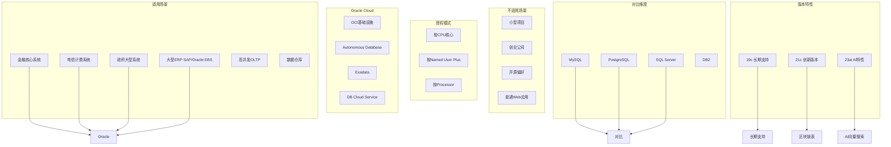

# Oracle 选型指南

## 概述
本模块从技术选型视角深入分析 Oracle 数据库的适用场景、授权模式、云平台战略，并与 MySQL、PostgreSQL 进行多维度对比。学习目标：能在项目评审中做出有理有据的数据库选型决策，理解 Oracle 的 TCO（总拥有成本）构成。

---

## 一、知识图谱



---

## 二、基础到进阶学习路线

- **阶段一：基础入门** —— 了解 Oracle 的适用和不适用场景，理解授权模式的基本概念，认识 Oracle 云平台产品线。
- **阶段二：原理深入** —— 深入对比 Oracle 与 MySQL/PostgreSQL 在架构、功能、生态上的差异，理解 Oracle 选型的成本考量。
- **阶段三：实战选型** —— 能在项目评审中完成数据库选型评估，制定迁移策略，评估 TCO。

---

## 三、核心知识详解

### 3.1 Oracle 适用场景

Oracle 在以下场景中具有不可替代的优势：

| 场景 | 典型代表 | 选择 Oracle 的理由 |
|------|----------|--------------------|
| 金融核心系统 | 银行核心、证券交易、保险清算 | ACID 极致保障、RAC 高可用、Data Guard 灾备、无锁升级设计 |
| 电信计费系统 | 移动/联通/电信 BOSS 系统 | 极高并发处理能力、RAC 水平扩展、分区表海量数据管理 |
| 政府大型系统 | 税务、社保、公安 | 合规要求、国产化替代方案、Oracle 生态成熟 |
| 大型 ERP | SAP、Oracle EBS、PeopleSoft | 深度绑定，切换成本极高，Oracle 官方支持 |
| 数据仓库 | 银行数仓、电信数仓 | 分区表、物化视图、并行查询、In-Memory 列存储 |
| 超高并发 OLTP | 支付系统、交易系统 | 行级锁不升级、一致性读不阻塞写、RAC 集群 |

### 3.2 Oracle 不适用场景

| 场景 | 原因 | 替代方案 |
|------|------|----------|
| 小型 Web 应用 | 授权成本过高，功能过剩 | MySQL、PostgreSQL |
| 创业公司 / 预算敏感 | 起步成本高，许可证费用沉重 | PostgreSQL（免费且功能接近） |
| 开源技术栈 | 团队偏好开源，技术栈不匹配 | PostgreSQL、MySQL |
| 读多写少的简单应用 | Oracle 的事务和并发优势用不上 | MySQL、Redis + MySQL |
| 微服务 / 容器化 | Oracle 的许可证管理复杂，容器化支持不如 MySQL | PostgreSQL、CockroachDB |
| 边缘计算 / IoT | 资源占用大，不适合轻量级场景 | SQLite、PostgreSQL |

### 3.3 授权模式与成本

Oracle 的授权模式是数据库选型中最重要的成本考量因素：

#### 3.3.1 主要授权模式

| 授权模式 | 计费方式 | 适用场景 |
|----------|----------|----------|
| **按 CPU（Processor）** | 按物理 CPU 核心数 × 核心因子 × 单价 | 无法确定用户数、互联网应用 |
| **按 Named User Plus（NUP）** | 按授权用户数 × 单价 | 内部系统、用户数可确定 |
| **云订阅（OCI）** | 按使用量或固定月费 | 上云场景 |

#### 3.3.2 核心因子（Core Factor）

Oracle 对不同厂商的 CPU 使用不同的核心因子来计算有效核心数：

- Intel Xeon：0.5（每 2 个物理核心算 1 个 License）
- IBM POWER：1.0（每 1 个物理核心算 1 个 License）
- SPARC：0.5 或 0.75

#### 3.3.3 版本与定价

| 版本 | 定位 | 典型价格 |
|------|------|----------|
| Oracle Database Enterprise Edition | 企业版 | 约 $47,500/CPU（Processor） |
| Oracle Database Standard Edition 2 | 标准版 | 约 $17,500/Socket |
| Oracle Database Personal Edition | 个人版 | 约 $460/NUP |
| Oracle Database Express Edition（XE） | 免费版 | 免费（限制 12GB 数据） |

::: warning 授权成本提醒
- 企业版按 CPU 授权，一个 4 路 16 核 Intel Xeon 服务器可能需要 8 个 Processor License（16 × 0.5 = 8），约 $380,000 的一次性费用
- 此外还有每年 22% 的技术支持费用
- RAC、Partitioning、In-Memory 等高级特性需要额外授权
- 务必在选型前咨询 Oracle 销售获取准确报价
:::

#### 3.3.4 高级特性的额外授权

以下特性在企业版中也需要额外付费：

| 特性 | 说明 |
|------|------|
| RAC（Real Application Clusters） | 集群高可用，约 $23,000/CPU |
| Partitioning | 分区表，约 $11,500/CPU |
| In-Memory | 内存列存储，约 $23,000/CPU |
| Advanced Security | 透明数据加密，约 $15,000/CPU |
| Active Data Guard | 实时备库，约 $11,500/CPU |
| Diagnostic Pack | AWR/ASH/ADDM，约 $7,500/CPU |
| Tuning Pack | SQL Tuning Advisor，约 $5,000/CPU |

### 3.4 Oracle 云平台

Oracle 正在大力推动云战略，Oracle Cloud Infrastructure（OCI）提供多种数据库服务：

| 服务 | 说明 | 特点 |
|------|------|------|
| **Autonomous Database** | 自治数据库（自动调优、自动备份、自动打补丁） | 零运维，按使用量付费 |
| **Exadata Cloud Service** | 软硬件一体机（Exadata）上云 | 极致性能，适合核心业务 |
| **DB Cloud Service** | 虚拟机上的 Oracle 数据库 | 传统架构上云，兼容性最好 |
| **MySQL HeatWave** | MySQL 云服务 | 内存加速分析 |

**Autonomous Database 的核心能力：**

- **Self-Driving**：自动性能调优、自动索引管理
- **Self-Securing**：自动加密、自动安全补丁
- **Self-Repairing**：自动备份、自动故障恢复

### 3.5 Oracle vs MySQL vs PostgreSQL 对比

| 维度 | Oracle | MySQL | PostgreSQL |
|------|--------|-------|------------|
| **许可证** | 商业授权（昂贵） | GPL / 商业 | PostgreSQL License（完全免费） |
| **ACID 支持** | 极致 | InnoDB 支持 | 完整支持 |
| **隔离级别** | Read Committed、Serializable | 4 种（RR 默认） | 4 种（RC 默认） |
| **并发控制** | MVCC + UNDO + 行锁不升级 | MVCC + 行锁不升级 | MVCC（无 UNDO，VACUUM 清理） |
| **高可用** | RAC（共享存储）、Data Guard | 主从复制、MGR、InnoDB Cluster | 流复制、Patroni、Logical Replication |
| **分区表** | 丰富（6 种类型） | 有限（Range/List/Hash/Key） | 丰富（声明式分区） |
| **优化器** | CBO（成熟且有 SQL Profile） | CBO（较简单） | CBO（较成熟） |
| **SQL 复杂度** | 分析函数丰富、CONNECT BY、MODEL | 较简单 | 窗口函数、CTE、递归查询 |
| **存储过程** | PL/SQL（功能强大） | 存储过程（较简单） | PL/pgSQL（功能丰富） |
| **备份恢复** | RMAN、闪回技术 | mysqldump、XtraBackup | pg_dump、WAL 归档 |
| **性能诊断** | AWR、ASH、ADDM | Performance Schema | pg_stat_statements |
| **社区生态** | 商业支持（Oracle Support） | 社区活跃 | 社区活跃 |
| **学习曲线** | 陡峭 | 平缓 | 中等 |

**选型决策树：**

```
1. 预算是否充足（每年 License + 技术支持费用）？
   → NO → PostgreSQL 或 MySQL

2. 是否需要 RAC 共享存储高可用（非主从切换）？
   → YES → Oracle（RAC 是唯一选择）

3. 是否需要极致的并发性能和事务保障？
   → YES → Oracle

4. 是否需要 Oracle EBS/SAP 等依赖 Oracle 的商业软件？
   → YES → Oracle（别无选择）

5. 是否对开源有偏好或政策要求？
   → YES → PostgreSQL（功能最接近 Oracle）

6. 业务是否简单（读多写少、Web 应用）？
   → YES → MySQL 或 PostgreSQL
```

### 3.6 Oracle 版本演进

| 版本 | 发布时间 | 状态 | 关键特性 |
|------|----------|------|----------|
| 11g R2 | 2009 | 已停止支持 | ASM、RAC 成熟、Data Guard |
| 12c R1 | 2013 | 已停止支持 | 多租户（PDB/CDB）、In-Memory |
| 12c R2 | 2017 | 已停止支持 | 在线表移动、Sharding 增强 |
| 18c | 2018 | 已停止支持 | 自治数据库、多态表函数 |
| 19c | 2019 | 长期支持（至 2027） | JSON 增强、SQL Macros |
| 21c | 2021 | 创新版本 | 区块链表、原生 JSON 类型 |
| 23ai | 2024 | 长期支持 | AI 向量搜索、JSON 关系对偶 |

**19c 的重要新特性：**

- 自动索引（Automatic Indexing）：自动创建和删除索引
- 实时统计信息：DML 操作后实时更新统计信息
- SQL 隔离的 PDB：PDB 级别的 SQL 执行计划隔离
- 混合分区表：支持外部数据的分区表

**23ai 的重要新特性：**

- AI 向量搜索（AI Vector Search）：原生支持向量嵌入和相似度搜索
- JSON 关系对偶视图（JSON Relational Duality）：JSON 和关系型数据的统一视图
- 属性图（Property Graph）：支持图形数据的存储和查询
- True Cache：内存中的一致性数据缓存

---

## 四、经典应用场景与解决方案

### 场景：从 Oracle 迁移到 PostgreSQL 的可行性评估

**问题背景：**
某中型金融科技公司，当前使用 Oracle 19c 企业版（4 CPU × 16 核），每年 License + 技术支持费用约 200 万。业务增长后费用将继续攀升，CTO 考虑迁移到 PostgreSQL 以降低成本。

**评估维度：**

**1. 功能兼容性评估：**

```sql
-- Oracle 独有的功能，迁移时需要替代方案
-- RAC → Patroni + etcd + HAProxy（共享存储变为流复制）
-- Data Guard → PostgreSQL 流复制 + WAL 归档
-- 闪回查询 → pg_dirtyread 扩展 / 时间旅行查询
-- 分区表 → PostgreSQL 声明式分区（功能接近）
-- PL/SQL → PL/pgSQL（语法接近，但需要改写）
-- AWR/ASH → pg_stat_statements + pgBadger
-- RMAN → pgBackRest / Barman
```

**2. 迁移成本评估：**

| 迁移项 | 工作量 | 风险 |
|--------|--------|------|
| DDL 转换 | 低（ora2pg 工具可自动转换） | 低 |
| PL/SQL → PL/pgSQL | 中高（部分语法需手动改写） | 中 |
| 应用层 SQL 改写 | 中（分页语法、CONNECT BY 等） | 中 |
| 性能调优 | 高（优化器行为不同） | 高 |
| 测试验证 | 高（全量数据测试） | 中 |
| 运维工具切换 | 中（备份/监控/告警） | 低 |

**3. 决策建议：**

- 如果 Oracle 费用占比超过 IT 预算的 20%，强烈建议迁移
- 如果使用了大量 RAC、Data Guard、闪回等高级特性，评估替代方案是否满足 SLA
- 迁移过程建议分阶段：先迁移非核心业务，验证后迁移核心业务
- 使用 ora2pg 工具进行兼容性评估和自动转换

---

## 五、高频面试题

### Q1: 什么时候应该选择 Oracle 而不是 MySQL 或 PostgreSQL？
::: details 答案
选择 Oracle 的典型场景：

**1. 业务要求极高的事务一致性：**
- Oracle 的一致性读机制（不阻塞读）在高并发场景下远优于 MySQL 的 MVCC 实现
- Oracle 不会锁升级，MySQL 在特定场景下会
- 金融核心交易系统必须保证 ACID 完备性

**2. 需要 RAC 共享存储集群：**
- RAC 是 Oracle 的杀手级特性，所有节点同时读写同一份数据
- MySQL 和 PostgreSQL 的主从/流复制本质上是异步/半同步，无法做到真正的多活
- 对可用性要求 99.999% 的系统几乎必须 RAC

**3. 依赖 Oracle 生态的商业软件：**
- SAP、Oracle EBS、PeopleSoft 等天然绑定 Oracle
- 迁移成本极高，通常不划算

**4. 需要某些独有功能：**
- 闪回技术（Flashback）
- 精细的审计（Fine-Grained Auditing）
- 资源管理器（Resource Manager）
- Data Guard 的 Active Standby

**5. 对技术支持有极高要求：**
- Oracle Support 提供 7x24 全球技术支持
- 开源数据库依赖社区或第三方支持

**不选 Oracle 的情况：**
- 预算有限（Oracle 的 License 费用是开源数据库的数倍到数十倍）
- 业务简单，MySQL/PostgreSQL 完全满足需求
- 技术栈偏向开源，团队没有 Oracle DBA
- 需要云原生、容器化部署（Oracle 的容器化支持不如 PostgreSQL）
:::

### Q2: Oracle 的授权模式有哪些？按 CPU 和按用户授权有什么区别？
::: details 答案
**Oracle 主要授权模式：**

**1. 按 Processor（处理器）授权：**
- 计费公式：物理 CPU 核心数 × Core Factor × 单价
- Core Factor 因厂商而异：Intel 0.5、IBM POWER 1.0、SPARC 0.5
- 适用场景：无法确定用户数量的场景（如互联网应用、公共网站）
- 典型价格：企业版约 $47,500/Processor

**2. 按 Named User Plus（NUP）授权：**
- 计费公式：授权用户数 × 单价
- 每个用户可以是人，也可以是非人类操作者（如设备）
- 最小用户数要求：企业版 25 NUP/Processor
- 适用场景：内部系统、用户数可确定的场景
- 典型价格：企业版约 $950/NUP

**3. 云订阅（OCI）：**
- 按使用量（OCPU/小时）或固定月费
- 包含 License 和技术支持
- 按需付费，灵活性高

**核心区别：**
- 按 Processor：适合互联网应用（用户数不确定），成本随 CPU 线性增长
- 按 NUP：适合企业内部系统（用户数明确），成本随用户数增长
- 云订阅：按使用量付费，适合弹性需求或短期项目

**成本计算示例：**
- 4 路 × 16 核 Intel Xeon 服务器
- Processor License = 16 × 4 × 0.5 = 32 Processor
- 企业版费用 = 32 × $47,500 = $1,520,000
- 每年技术支持 = $1,520,000 × 22% = $334,400
:::

### Q3: Oracle 和 MySQL 在选型上最核心的区别是什么？
::: details 答案
**核心区别总结：**

| 维度 | Oracle | MySQL |
|------|--------|-------|
| 成本 | 极高（License + 年维护费） | 极低（开源免费） |
| 高可用 | RAC（真正多活） | 主从复制（主从切换有延迟） |
| 事务隔离 | Read Committed 默认 | Repeatable Read 默认 |
| 并发控制 | 一致性读不阻塞写 | 一致性读不阻塞写（InnoDB） |
| 备份恢复 | 闪回技术 + RMAN | XtraBackup + Binlog |
| 性能诊断 | AWR/ASH/ADDM | Performance Schema |
| 优化器 | 成熟 CBO + SQL Profile | 较简单 CBO |
| SQL 功能 | 丰富（分析函数、CONNECT BY） | 较简单 |
| 扩展性 | 垂直扩展为主（RAC 水平） | 水平扩展（分库分表） |

**选型本质：**
- Oracle 是"用钱买可靠性"——花大量 License 费用换取极致的 ACID、高可用和性能诊断能力
- MySQL 是"用人力换成本"——节省 License 费用，但需要更多人力投入在架构设计、运维和性能调优上
- 对于金融核心、电信计费等"不能出错"的系统，Oracle 多花的钱是值得的
- 对于大多数互联网业务，MySQL 配合良好的架构设计完全可以胜任
:::

### Q4: Oracle 云数据库（Autonomous Database）有什么优势？
::: details 答案
**Autonomous Database 的核心优势：**

**1. 自治运维（Self-Driving）：**
- 自动性能调优：自动创建索引、自动调整执行计划
- 自动扩容：根据负载自动增加/减少 CPU 和存储
- 自动打补丁：在维护窗口内自动应用安全补丁

**2. 自治安全（Self-Securing）：**
- 默认加密：所有数据自动加密（TDE）
- 自动威胁检测：数据库防火墙和异常检测
- 自动审计：所有操作自动记录

**3. 自治修复（Self-Repairing）：**
- 自动备份：持续自动备份，支持任意时间点恢复
- 自动故障切换：RAC 自动故障转移
- 99.995% 可用性 SLA

**4. 成本优势：**
- 按使用量付费（OCPU/小时），无需预购 License
- 减少 DBA 人力成本（自动运维）
- 降低硬件成本（无需购买和维护服务器）

**5. 技术优势：**
- 支持多种工作负载（ATP 事务处理、ADW 数据仓库、JSON 文档）
- 内置机器学习（Oracle Machine Learning）
- 与 OCI 深度集成（对象存储、流处理、API 网关）

**局限性：**
- 数据必须存储在 OCI，不能部署在本地
- 网络延迟（对实时性要求极高的本地应用不适合）
- 供应商锁定（迁移出 OCI 的代价）
:::

### Q5: Oracle 19c 有哪些值得关注的新特性？
::: details 答案
**Oracle 19c（2019 年发布，长期支持版本）关键新特性：**

**1. 自动索引（Automatic Indexing）：**
- 数据库自动识别需要创建索引的 SQL
- 自动创建、监控和删除索引
- 大幅减少 DBA 的索引优化工作
- 默认每 15 分钟评估一次，可在 PDB 级别启用

**2. 实时统计信息（Real-Time Statistics）：**
- 传统统计信息在批量 DML 后可能过时
- 19c 的实时统计信息在 DML 操作时自动更新
- 减少因统计信息过期导致的执行计划劣化

**3. SQL 隔离（SQL Quarantine）：**
- 当 SQL 消耗过多资源时，自动将其隔离
- 防止"失控 SQL" 耗尽系统资源
- 可在 PDB 级别独立配置

**4. 混合分区表（Hybrid Partitioned Tables）：**
- 允许分区表的部分分区存储在外部（如对象存储）
- 适合冷热数据分层存储，节省成本

**5. 多租户增强：**
- 最多支持 4096 个 PDB（12c R2 为 252 个）
- PDB 之间更好的资源隔离
- 支持 PDB 级别的闪回

**6. JSON 增强：**
- SQL/JSON 函数增强
- JSON 数据类型的索引优化
- 更好的 JSON 查询性能

**7. 在线操作增强：**
- 在线表分区操作（SPLIT/MERGE）
- 在线修改列的数据类型
- 减少维护窗口时间
:::

### Q6: 如果已经在用 Oracle，什么情况下应该考虑迁移到 PostgreSQL？
::: details 答案
**应该考虑迁移的迹象：**

**1. 成本压力：**
- Oracle License + 技术支持费用超过 IT 预算的 20%
- 业务增长导致需要更多 CPU，License 费用线性增长
- 企业规模扩大后，Oracle 按 CPU 授权的模式变得不可持续

**2. 功能替代可用：**
- 不使用 RAC、Data Guard、闪回数据库等独有特性
- 不需要 Oracle 特有的高级特性（如 In-Memory、Partitioning 高级模式）
- PostgreSQL 可以满足 80% 以上的功能需求

**3. 技术栈转型：**
- 公司整体技术栈转向开源
- 团队已经具备 PostgreSQL 能力
- 新的云原生架构更适合 PostgreSQL

**4. 合规要求：**
- 国产化替代政策要求
- 数据主权和合规要求

**迁移的关键考量：**

| 考虑因素 | 评估方法 |
|----------|----------|
| 功能兼容性 | 使用 ora2pg 工具评估兼容性 |
| 性能对标 | 在 PostgreSQL 上做性能基准测试 |
| 迁移风险 | 先迁移非核心业务，验证后再迁移核心 |
| 运维能力 | 评估团队 PostgreSQL 运维能力 |
| 业务连续性 | 制定回滚方案，确保迁移失败可回退 |

**不建议迁移的情况：**
- 核心业务极度依赖 Oracle 独有特性
- 使用 Oracle EBS/SAP 等绑定 Oracle 的软件
- 性能和可用性要求超出 PostgreSQL 能力范围
- 迁移成本（人力 + 时间 + 风险）超过 License 节省费用
:::

---

## 六、选型指南

- **适用场景**：金融核心系统、电信计费、大型 ERP、对 ACID 和可用性要求极高的系统、使用 Oracle 绑定商业软件
- **不适用场景**：预算敏感、小型 Web 应用、开源技术栈、微服务/容器化架构、边缘计算
- **配置建议**：
  - 采购前务必评估准确的 License 需求（CPU 核心数 × Core Factor）
  - 关注高级特性是否需要额外授权（RAC、Partitioning、In-Memory 等）
  - 考虑 OCI 云订阅替代自建，降低前期投入
  - 如果成本压力大，评估 PostgreSQL 迁移可行性
  - 19c 是目前推荐的长期支持版本，23ai 适合尝鲜新特性

---

## 相关文档
- [Oracle 核心架构](./index)
- [存储结构与表空间](./storage)
- [事务与锁机制](./transaction)
- [优化器与执行计划](./optimizer)
- [备份恢复](./backup-recovery)
- [性能调优](./performance)
- [上一级：数据库](../index)