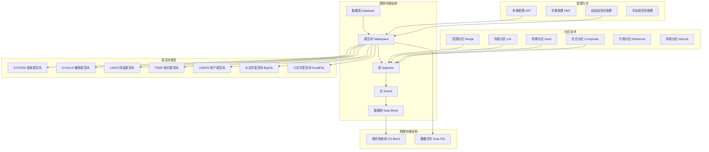

# 存储结构与表空间

## 概述
本模块深入剖析 Oracle 逻辑存储结构与物理存储结构的映射关系，涵盖表空间管理策略、分区表技术选型以及自动段空间管理（ASSM）等核心概念。学习目标：能独立完成表空间规划设计、分区方案选型，理解 Oracle 存储层次结构对性能的影响。

---

## 一、知识图谱



---

## 二、基础到进阶学习路线

- **阶段一：基础入门** —— 理解表空间、段、区、块的概念和层级关系，掌握创建表空间的基本语法。
- **阶段二：原理深入** —— 理解本地管理 vs 字典管理表空间的内部机制，掌握 ASSM 位图管理原理，深入分区表各类型的使用场景。
- **阶段三：实战优化** —— 表空间碎片检测与整理、大表分区策略设计、UNDO 表空间大小规划、临时表空间组配置。

---

## 三、核心知识详解

### 3.1 Oracle 逻辑存储结构

Oracle 的逻辑存储结构按照从大到小的层级组织：

```
数据库（Database）
  └── 表空间（Tablespace）—— 最大的逻辑存储单元
        └── 段（Segment）—— 一个表/索引占用的空间集合
              └── 区（Extent）—— 连续数据块的集合
                    └── 数据块（Data Block）—— 最小的 I/O 单元
```

| 层级 | 名称 | 说明 | 大小 |
|------|------|------|------|
| 1 | 数据库 | 所有表空间和文件的集合 | 由物理文件决定 |
| 2 | 表空间 | 逻辑存储容器，由多个数据文件组成 | 由数据文件总和决定 |
| 3 | 段 | 表、索引、UNDO 段、临时段等对象占用的空间 | 由多个区组成 |
| 4 | 区 | 连续的数据块集合 | 通常 64KB - 64MB |
| 5 | 数据块 | Oracle 最小的 I/O 单元 | 默认 8KB，可选 2K/4K/16K/32K |

**典型查询：**

```sql
-- 查看表空间及其数据文件
SELECT t.name AS tablespace_name,
       d.name AS datafile_name,
       d.bytes/1024/1024 AS size_mb
FROM v$tablespace t
JOIN v$datafile d ON t.ts# = d.ts#;

-- 查看段的空间使用情况
SELECT owner, segment_name, segment_type,
       bytes/1024/1024 AS size_mb,
       blocks, extents
FROM dba_segments
WHERE owner = 'SCOTT'
ORDER BY bytes DESC;

-- 查看数据块大小
SELECT name, value FROM v$parameter WHERE name = 'db_block_size';
```

### 3.2 表空间管理方式

#### 3.2.1 本地管理表空间（LMT - Locally Managed Tablespace）

::: tip 推荐方式
Oracle 8i 起引入，9i 起成为默认方式，**所有新建表空间都应使用 LMT**。
:::

LMT 在每个数据文件头部使用**位图（Bitmap）**来管理区的分配和释放，不再依赖数据字典表。

**LMT 的两种空间管理方式：**

```sql
-- 方式一：AUTOALLOCATE（自动分配，默认）
CREATE TABLESPACE tbs_auto
DATAFILE '/u01/oradata/orcl/tbs_auto01.dbf' SIZE 100M
EXTENT MANAGEMENT LOCAL AUTOALLOCATE;

-- 方式二：UNIFORM SIZE（固定大小）
CREATE TABLESPACE tbs_uniform
DATAFILE '/u01/oradata/orcl/tbs_uniform01.dbf' SIZE 100M
EXTENT MANAGEMENT LOCAL UNIFORM SIZE 1M;
```

| 方式 | 优势 | 劣势 |
|------|------|------|
| AUTOALLOCATE | 自动计算区大小，小表用小区，大表用大区 | 可能产生碎片 |
| UNIFORM SIZE | 消除碎片，区大小一致 | 小表浪费空间 |

#### 3.2.2 字典管理表空间（DMT - Dictionary Managed Tablespace）

**已不推荐使用**。通过数据字典表（`UET$` 和 `FET$`）管理区分配，每次分配/释放区都需要更新数据字典表，在高并发下产生 `ST Enqueue` 争用。

```sql
-- 字典管理（仅作了解，不建议使用）
CREATE TABLESPACE tbs_dict
DATAFILE '/u01/oradata/orcl/tbs_dict01.dbf' SIZE 100M
EXTENT MANAGEMENT DICTIONARY;
```

#### 3.2.3 ASSM（Automatic Segment Space Management）自动段空间管理

ASSM 是 Oracle 9i 起引入的段内空间管理方式，使用**位图块（Bitmap Block，BMB）**替代传统的**空闲列表（Free List）**来管理数据块的使用情况。

```sql
-- 创建 ASSM 表空间
CREATE TABLESPACE tbs_assm
DATAFILE '/u01/oradata/orcl/tbs_assm01.dbf' SIZE 500M
EXTENT MANAGEMENT LOCAL
SEGMENT SPACE MANAGEMENT AUTO;
```

**ASSM 工作原理：**

位图块分为三个级别，形成树状结构：
- **L1 BMB（一级位图块）**：记录一组数据块的空闲状态（0-25%、25-50%、50-75%、75-100%）
- **L2 BMB（二级位图块）**：指向多个 L1 BMB 块
- **L3 BMB（三级位图块）**：指向多个 L2 BMB 块

::: tip ASSM 的优势
- 消除 Free List 的争用（并发插入时不再需要竞争 Free List 上的空闲块）
- 自动管理 PCTFREE 和 PCTUSED
- 更好地支持 RAC 环境
:::

### 3.3 分区表（Partitioned Table）

Oracle 分区表是处理大表的核心技术，将大表物理上拆分为多个更小的、更易管理的片段。

#### 3.3.1 范围分区（Range Partition）

按某个列的值范围将数据分配到不同分区：

```sql
CREATE TABLE sales_range (
    sale_id     NUMBER,
    sale_date   DATE,
    amount      NUMBER(10,2)
)
PARTITION BY RANGE (sale_date) (
    PARTITION p_q1_2024 VALUES LESS THAN (TO_DATE('2024-04-01','YYYY-MM-DD')),
    PARTITION p_q2_2024 VALUES LESS THAN (TO_DATE('2024-07-01','YYYY-MM-DD')),
    PARTITION p_q3_2024 VALUES LESS THAN (TO_DATE('2024-10-01','YYYY-MM-DD')),
    PARTITION p_q4_2024 VALUES LESS THAN (TO_DATE('2025-01-01','YYYY-MM-DD')),
    PARTITION p_max     VALUES LESS THAN (MAXVALUE)  -- 兜底分区
);
```

**适用场景**：按时间（日/月/年）归档的历史数据、按数值范围划分的业务数据。

#### 3.3.2 列表分区（List Partition）

按离散值列表将数据分配到不同分区：

```sql
CREATE TABLE sales_list (
    sale_id     NUMBER,
    region      VARCHAR2(20),
    amount      NUMBER(10,2)
)
PARTITION BY LIST (region) (
    PARTITION p_east  VALUES ('北京', '上海', '广州'),
    PARTITION p_west  VALUES ('成都', '重庆', '西安'),
    PARTITION p_south VALUES ('深圳', '厦门', '海口'),
    PARTITION p_other VALUES (DEFAULT)  -- 默认分区
);
```

**适用场景**：按地区、部门、产品类型等离散值划分。

#### 3.3.3 哈希分区（Hash Partition）

通过哈希函数将数据均匀分散到多个分区：

```sql
CREATE TABLE orders_hash (
    order_id    NUMBER,
    customer_id NUMBER,
    order_date  DATE
)
PARTITION BY HASH (order_id)
PARTITIONS 8
STORE IN (tbs1, tbs2, tbs3, tbs4);
```

**适用场景**：主键上没有明显范围特征的超大表，需要将数据均匀分布以减少 I/O 热点。

#### 3.3.4 复合分区（Composite Partition）

先按一种方式分区，再在每个分区内按另一种方式子分区：

```sql
-- 范围-哈希复合分区（最常用）
CREATE TABLE sales_composite (
    sale_id     NUMBER,
    sale_date   DATE,
    region      VARCHAR2(20),
    amount      NUMBER(10,2)
)
PARTITION BY RANGE (sale_date)
SUBPARTITION BY HASH (sale_id) SUBPARTITIONS 4
(
    PARTITION p_2024_q1 VALUES LESS THAN (TO_DATE('2024-04-01','YYYY-MM-DD')),
    PARTITION p_2024_q2 VALUES LESS THAN (TO_DATE('2024-07-01','YYYY-MM-DD')),
    PARTITION p_2024_q3 VALUES LESS THAN (TO_DATE('2024-10-01','YYYY-MM-DD')),
    PARTITION p_2024_q4 VALUES LESS THAN (TO_DATE('2025-01-01','YYYY-MM-DD'))
);
```

**常见组合**：Range-Hash、Range-List、Range-Range、List-Hash、List-List。

#### 3.3.5 间隔分区（Interval Partition）

11g 引入，是范围分区的增强版，自动为新数据创建分区：

```sql
CREATE TABLE sales_interval (
    sale_id     NUMBER,
    sale_date   DATE,
    amount      NUMBER(10,2)
)
PARTITION BY RANGE (sale_date)
INTERVAL (NUMTOYMINTERVAL(1, 'MONTH'))  -- 每月自动创建新分区
(
    PARTITION p_init VALUES LESS THAN (TO_DATE('2024-01-01','YYYY-MM-DD'))
);
```

#### 3.3.6 分区表核心操作

```sql
-- 分区裁剪（Partition Pruning）：查询只扫描相关分区
SELECT * FROM sales_range WHERE sale_date >= DATE '2024-01-01';

-- 截断单个分区（比 DELETE 快得多）
ALTER TABLE sales_range TRUNCATE PARTITION p_q1_2024;

-- 删除分区
ALTER TABLE sales_range DROP PARTITION p_q1_2024;

-- 拆分分区
ALTER TABLE sales_range SPLIT PARTITION p_max
AT (TO_DATE('2025-07-01','YYYY-MM-DD'))
INTO (PARTITION p_2025_h1, PARTITION p_max);

-- 交换分区（将表与分区交换数据，极快）
ALTER TABLE sales_range EXCHANGE PARTITION p_q1_2024
WITH TABLE sales_temp;
```

### 3.4 UNDO 表空间

UNDO 表空间存储回滚数据，服务于三个核心目的：

1. **事务回滚（Rollback）**：撤销未提交的事务
2. **读一致性（Read Consistency）**：查询开始时构造数据快照
3. **数据库恢复（Recovery）**：从已提交事务中恢复数据一致性

```sql
-- 创建 UNDO 表空间
CREATE UNDO TABLESPACE undotbs2
DATAFILE '/u01/oradata/orcl/undotbs02.dbf' SIZE 2G
AUTOEXTEND ON NEXT 100M MAXSIZE 10G;

-- 切换到新的 UNDO 表空间
ALTER SYSTEM SET undo_tablespace = 'UNDOTBS2';

-- 设置 UNDO 保留时间（秒）
ALTER SYSTEM SET undo_retention = 3600;  -- 1小时
-- 11g 起支持自动调整
ALTER TABLESPACE undotbs2 RETENTION GUARANTEE;
```

::: danger UNDO 不足的后果
UNDO 表空间不足时，最典型的错误是 **ORA-01555: snapshot too old**。当一个查询需要读取的 UNDO 数据已经被覆盖时，就会触发此错误。解决方案：增大 UNDO 表空间、延长 `undo_retention`、优化长查询。
:::

### 3.5 临时表空间

用于存储排序、哈希连接、临时表等操作的中间结果。

```sql
-- 创建临时表空间
CREATE TEMPORARY TABLESPACE temp2
TEMPFILE '/u01/oradata/orcl/temp02.dbf' SIZE 2G
AUTOEXTEND ON NEXT 100M MAXSIZE 10G;

-- 创建临时表空间组（10g+）
CREATE TEMPORARY TABLESPACE temp3
TEMPFILE '/u01/oradata/orcl/temp03.dbf' SIZE 2G
TABLESPACE GROUP temp_group;

ALTER TABLESPACE temp2 TABLESPACE GROUP temp_group;

-- 将用户指定到临时表空间组
ALTER USER scott TEMPORARY TABLESPACE temp_group;
```

### 3.6 大文件表空间 vs 小文件表空间

| 特性 | 小文件表空间（SmallFile） | 大文件表空间（BigFile） |
|------|--------------------------|------------------------|
| 数据文件数 | 最多 1022 个 | 仅 1 个 |
| 最大容量 | 约 32TB（8KB 块 × 1022 文件 × 4M 块） | 约 128TB（8KB 块 × 1 文件 × 4G 块） |
| 管理复杂度 | 文件多，管理复杂 | 文件少，管理简单 |
| 适用场景 | 传统 OLTP 系统 | 超大型数据仓库、ASM 环境 |

```sql
-- 创建大文件表空间
CREATE BIGFILE TABLESPACE big_tbs
DATAFILE '/u01/oradata/orcl/big_tbs01.dbf' SIZE 10G
AUTOEXTEND ON NEXT 1G MAXSIZE 100G;
```

---

## 四、经典应用场景与解决方案

### 场景：电商订单表的分区设计

**问题背景：**
电商系统订单表（`orders`）日均新增 100 万条记录，累计已达 10 亿条。查询主要以 `order_date` 和 `customer_id` 为条件，需要按季度归档历史数据。

**完整方案：**

```sql
-- Step 1：创建复合分区表（Range by order_date + Hash by customer_id）
CREATE TABLE orders (
    order_id      NUMBER(18) PRIMARY KEY,
    customer_id   NUMBER(18) NOT NULL,
    order_date    DATE NOT NULL,
    status        VARCHAR2(20),
    total_amount  NUMBER(12,2),
    created_time  TIMESTAMP DEFAULT SYSTIMESTAMP
)
PARTITION BY RANGE (order_date)
INTERVAL (NUMTOYMINTERVAL(3, 'MONTH'))  -- 每季度自动创建新分区
SUBPARTITION BY HASH (customer_id) SUBPARTITIONS 8
(
    PARTITION p_2022 VALUES LESS THAN (TO_DATE('2023-01-01','YYYY-MM-DD')),
    PARTITION p_2023 VALUES LESS THAN (TO_DATE('2024-01-01','YYYY-MM-DD')),
    PARTITION p_2024 VALUES LESS THAN (TO_DATE('2025-01-01','YYYY-MM-DD'))
);

-- Step 2：创建本地分区索引（与表分区对齐）
CREATE INDEX idx_orders_customer ON orders(customer_id) LOCAL;
CREATE INDEX idx_orders_status ON orders(status) LOCAL;

-- Step 3：归档历史数据（将分区交换到归档表）
CREATE TABLE orders_archive AS SELECT * FROM orders WHERE 1=2;

ALTER TABLE orders EXCHANGE PARTITION p_2022 WITH TABLE orders_archive;
-- 此时 p_2022 的数据已在 orders_archive 中，可以导出后删除分区

-- Step 4：日常监控分区大小
SELECT table_name, partition_name,
       num_rows, blocks,
       ROUND(blocks * 8192 / 1024 / 1024, 2) AS size_mb
FROM dba_tab_partitions
WHERE table_name = 'ORDERS'
ORDER BY partition_name;
```

---

## 五、高频面试题

### Q1: 请描述 Oracle 的逻辑存储结构
::: details 答案
Oracle 的逻辑存储结构从大到小分为四个层级：

**1. 表空间（Tablespace）**：最大的逻辑存储单元，将相关逻辑结构分组。一个数据库包含多个表空间，每个表空间由多个数据文件组成。

**2. 段（Segment）**：一个表/索引/UNDO 段等对象占用的空间集合。当创建表时，Oracle 为其分配一个数据段。段由一个或多个区组成。

**3. 区（Extent）**：连续数据块的集合。区是 Oracle 给段分配空间的最小单位。当段空间不足时，以区为单位增长。在 LMT 中，区大小由 AUTOALLOCATE 或 UNIFORM SIZE 决定。

**4. 数据块（Data Block）**：Oracle 最小的 I/O 单元，对应操作系统的一个或多个 OS 块。默认大小为 8KB（由 `db_block_size` 参数决定）。每个数据块包含块头、表目录、行目录、空闲空间和行数据。

物理存储结构则包括数据文件（.dbf）、控制文件（.ctl）、联机重做日志文件（.log）等。逻辑存储结构通过映射关系与物理存储结构关联，例如一个表空间映射到多个数据文件。
:::

### Q2: 本地管理表空间（LMT）和字典管理表空间（DMT）的核心区别是什么？
::: details 答案
**核心区别在于区分配的管理方式：**

| 维度 | DMT（字典管理） | LMT（本地管理） |
|------|----------------|----------------|
| 管理方式 | 通过数据字典表 UET$（已使用区）和 FET$（空闲区）管理 | 通过数据文件头部的位图（Bitmap）管理 |
| 并发性能 | 区分配/释放需要更新数据字典表，产生 ST Enqueue 争用 | 位图操作在数据文件内完成，无数据字典竞争 |
| 碎片问题 | 容易产生碎片，需要定期 `COALESCE` 合并空闲区 | 位图自动跟踪，默认不产生碎片 |
| 递归 SQL | 每次区操作产生递归 SQL（操作数据字典） | 无递归 SQL |
| 推荐程度 | 已废弃，Oracle 9i 后不再推荐 | 推荐，9i 起为默认方式 |

**LMT 的两种子模式：**
- AUTOALLOCATE：Oracle 自动决定区大小（初始 64KB，随段增长逐渐增大）
- UNIFORM SIZE：所有区大小一致，彻底消除碎片，但可能浪费空间
:::

### Q3: 分区表的类型有哪些？各适用于什么场景？
::: details 答案
Oracle 支持以下分区类型：

**1. 范围分区（Range Partitioning）：**
按列值范围划分。最经典的分区方式。适用于：按时间归档的历史数据（如按月/季度/年分区）、按数值范围划分。

**2. 列表分区（List Partitioning）：**
按离散值列表划分。适用于：按地区、部门、产品类型等离散值划分，分区键值明确且有限。

**3. 哈希分区（Hash Partitioning）：**
通过哈希函数将数据均匀分散。适用于：没有明显范围特征的大表，需要数据均匀分布以避免 I/O 热点。也常用于复合分区的子分区。

**4. 复合分区（Composite Partitioning）：**
先按一种方式分区，再在每个分区内按另一种方式子分区。常见组合：Range-Hash（按时间主分区 + 按 ID 哈希子分区）、Range-List（按时间主分区 + 按地区列表子分区）。适用于：需要多维度数据管理的大表。

**5. 间隔分区（Interval Partitioning，11g+）：**
范围分区的增强版，自动为新数据创建分区。适用于：按时间持续增长的数据，无需手动添加分区。

**6. 引用分区（Reference Partitioning，11g+）：**
通过外键引用父表的分区策略。适用于：父子表需要相同分区方式，且分区键只在父表中。
:::

### Q4: ASSM 自动段空间管理的工作原理是什么？
::: details 答案
ASSM（Automatic Segment Space Management）是 Oracle 9i 起引入的段内空间管理方式，使用位图块（BMB）替代传统的空闲列表（Free List）。

**工作原理：**
- 位图块分为三级（L1/L2/L3），形成树状结构
- L1 BMB 记录一组数据块的空闲状态，每个数据块用 2 位表示（0-25%、25-50%、50-75%、75-100%）
- L2 BMB 指向多个 L1 BMB 块
- L3 BMB 指向多个 L2 BMB 块
- 当需要插入数据时，Oracle 从 BMB 树中查找有足够空闲空间的数据块

**相比 Free List 的优势：**
1. 消除 Free List 争用：并发插入时不需要竞争 Free List 上的空闲块
2. 更精细的空间感知：位图指示 4 级空闲度，而非 Free List 的二元状态
3. 更好的 RAC 支持：每个实例可以独立使用不同的 BMB 树分支
4. 自动管理 PCTFREE 和 PCTUSED

**注意**：ASSM 仅适用于 LMT 表空间，且不能与手动段空间管理（MSSM）混用。
:::

### Q5: UNDO 表空间的作用是什么？UNDO_RETENTION 参数的意义？
::: details 答案
UNDO 表空间服务于三个核心目的：

**1. 事务回滚（Transaction Rollback）：**
当执行 ROLLBACK 时，Oracle 使用 UNDO 数据将修改过的数据恢复到原始状态。

**2. 读一致性（Read Consistency）：**
当一个查询开始时，Oracle 确保查询看到的是查询开始时刻的数据快照。如果查询过程中数据被其他事务修改，Oracle 通过 UNDO 数据构造查询开始时的数据版本。这是 Oracle 实现"不锁读"的关键机制。

**3. 数据库恢复（Database Recovery）：**
实例恢复时，先通过 Redo Log 前滚已提交事务，再通过 UNDO 回滚未提交事务。

**UNDO_RETENTION 参数：**
指定 UNDO 数据在事务提交后保留的时间（秒）。默认 900 秒（15 分钟）。如果设置 `RETENTION GUARANTEE`，Oracle 保证在指定时间内不会覆盖 UNDO 数据。

**为什么需要保留已提交事务的 UNDO：**
- 长查询可能需要在查询开始时的数据版本
- 闪回查询（Flashback Query）需要历史 UNDO 数据
- 如果 UNDO 被覆盖，会出现 ORA-01555 错误

**ORA-01555 的典型解决方案：**
- 增大 UNDO 表空间
- 增加 `undo_retention`
- 优化长查询，尽量缩短查询时间
- 使用 `RETENTION GUARANTEE`
:::

### Q6: 如何判断一个表是否需要分区？分区后需要注意什么？
::: details 答案
**判断是否需要分区的标准：**
1. 表大小超过 2GB
2. 表中包含大量历史数据，且操作主要针对最新数据
3. 需要按时间范围批量删除/归档数据（TRUNCATE PARTITION 比 DELETE 快几个数量级）
4. 查询条件总是包含某个范围列（如日期），可以通过分区裁剪提升性能
5. 并行 DML 操作需要按分区并行执行

**分区后需要注意：**
1. 索引策略：本地索引（LOCAL）与分区对齐，全局索引在分区操作（DROP/TRUNCATE/SPLIT）后会失效，需要加上 `UPDATE GLOBAL INDEXES` 子句
2. 分区键选择：应选择查询中最常用的过滤条件列
3. 分区数不宜过多：Oracle 建议单表分区数不超过 1024K-1，实际建议控制在数百以内
4. 统计信息：分区操作后需要重新收集统计信息
5. 分区裁剪验证：使用 EXPLAIN PLAN 确认查询确实只扫描了相关分区
:::

---

## 六、选型指南

- **适用场景**：需要按时间归档的大表、需要多维度数据管理的数据仓库、需要通过分区消除扫描范围提升查询性能的 OLTP 表
- **不适用场景**：小表（< 2GB）、无明显分区键的表、频繁跨分区关联查询的表
- **配置建议**：
  - 表空间统一使用 LMT + ASSM + AUTOALLOCATE
  - UNDO 表空间大小 = 最长查询时间 × 每秒 UNDO 生成量，建议开启 `RETENTION GUARANTEE`
  - 临时表空间使用临时表空间组，避免单点瓶颈
  - 大表优先考虑间隔分区（Interval Partition），减少维护工作量

---

## 相关文档
- [Oracle 核心架构](./index)
- [事务与锁机制](./transaction)
- [优化器与执行计划](./optimizer)
- [备份恢复](./backup-recovery)
- [性能调优](./performance)
- [Oracle 选型指南](./selection)
- [上一级：数据库](../index)