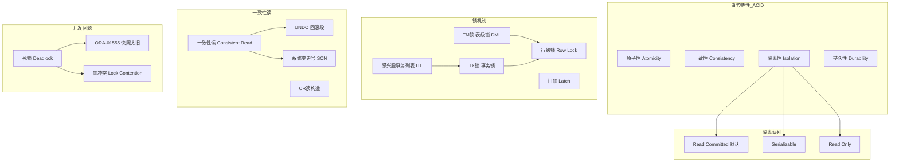
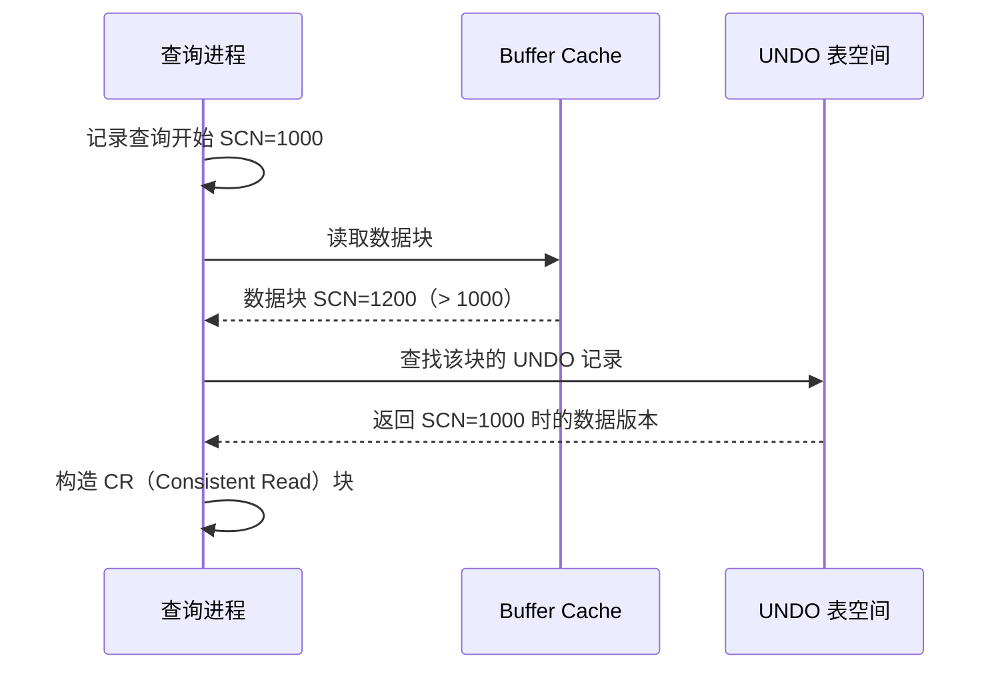

# 事务与锁机制

## 概述
本模块深入解析 Oracle 的事务隔离级别、锁机制原理、一致性读实现以及常见的并发问题。学习目标：理解 Oracle 的 MVCC 多版本并发控制机制，掌握锁诊断与死锁排查方法，能独立分析和解决 ORA-01555 等经典并发问题。

---

## 一、知识图谱



---

## 二、基础到进阶学习路线

- **阶段一：基础入门** —— 理解 Oracle 的两种事务隔离级别，掌握 TM 锁和 TX 锁的基本概念，学会使用 `v$lock` 和 `v$session` 诊断锁等待。
- **阶段二：原理深入** —— 深入理解一致性读的 CR 构造机制、ITL 的结构与作用、回滚段与 UNDO 的协作关系。
- **阶段三：实战优化** —— ORA-01555 的根因分析与解决、死锁的自动检测与预防、高并发锁竞争的优化策略。

---

## 三、核心知识详解

### 3.1 Oracle 事务隔离级别

Oracle 与 MySQL 在隔离级别上的差异是面试中的高频考点：

| 隔离级别 | Oracle 支持 | MySQL（InnoDB）支持 | 说明 |
|----------|------------|--------------------|------|
| Read Uncommitted | **不支持** | 支持 | Oracle 不允许脏读 |
| Read Committed | **支持（默认）** | 支持 | 每次查询获取最新已提交数据 |
| Repeatable Read | **不支持** | 支持（默认） | Oracle 通过 Serializable 实现类似效果 |
| Serializable | **支持** | 支持 | 事务级快照隔离 |

::: tip 关键差异
Oracle 的 Serializable 实际上是通过 **快照隔离（Snapshot Isolation）** 实现的，并非严格的 Serializable。Oracle 不提供真正的 Repeatable Read 隔离级别，因为其一致性读机制天然保证了语句级别的读一致性。
:::

**Read Committed 下的行为：**

```sql
-- 会话 A
UPDATE employees SET salary = 20000 WHERE emp_id = 100;
-- 未提交

-- 会话 B
SELECT salary FROM employees WHERE emp_id = 100;
-- 结果：看到的是修改前的旧值（通过 UNDO 构造），不会阻塞
```

**Serializable 下的行为：**

```sql
-- 会话 A
ALTER SESSION SET ISOLATION_LEVEL = SERIALIZABLE;
-- 或 SET TRANSACTION ISOLATION LEVEL SERIALIZABLE;

-- 整个事务看到的是事务开始时的数据快照
-- 如果尝试修改被其他事务修改过的数据，会报错：
-- ORA-08177: can't serialize access for this transaction
```

### 3.2 Oracle 锁机制

Oracle 的锁机制是自动管理的，这是其设计的核心理念之一。与 MySQL 不同，Oracle **永远不会升级行级锁**。

#### 3.2.1 TM 锁（表级锁 / DML 锁）

TM 锁在 DML 操作时自动获取，用于防止 DDL 操作破坏 DML 的一致性：

| TM 锁模式 | 简称 | 说明 | 触发操作 |
|----------|------|------|----------|
| 2 - Row Share (RS) | SS | 行共享锁 | SELECT ... FOR UPDATE、LOCK TABLE IN ROW SHARE MODE |
| 3 - Row Exclusive (RX) | SX | 行排他锁 | INSERT、UPDATE、DELETE |
| 4 - Share (S) | S | 共享锁 | CREATE INDEX（联机）、LOCK TABLE IN SHARE MODE |
| 5 - Share Row Exclusive (SRX) | SSX | 共享行排他锁 | LOCK TABLE IN SHARE ROW EXCLUSIVE MODE |
| 6 - Exclusive (X) | X | 排他锁 | DROP TABLE、ALTER TABLE、LOCK TABLE IN EXCLUSIVE MODE |

**锁兼容性矩阵：**

|  | RS(2) | RX(3) | S(4) | SRX(5) | X(6) |
|------|-------|-------|------|--------|------|
| RS(2) | Y | Y | Y | Y | N |
| RX(3) | Y | Y | N | N | N |
| S(4) | Y | N | Y | N | N |
| SRX(5) | Y | N | N | N | N |
| X(6) | N | N | N | N | N |

#### 3.2.2 TX 锁（事务锁）

TX 锁是事务层面的锁，每个事务拥有唯一的 TX 锁，用于标识事务并管理行级锁。

```sql
-- 查看当前锁状态
SELECT s.sid, s.serial#, s.username, s.status,
       l.type, l.lmode, l.request, l.id1, l.id2,
       l.block
FROM v$lock l
JOIN v$session s ON l.sid = s.sid
WHERE s.username IS NOT NULL
ORDER BY l.type, l.id1;

-- 查看锁等待链
SELECT blocking_session, sid, serial#, wait_class, seconds_in_wait
FROM v$session
WHERE blocking_session IS NOT NULL;
```

#### 3.2.3 行级锁（Row Lock）

Oracle 的行级锁存储在数据块中，而非锁管理器中：

- 行级锁信息存储在 **数据块头部的 ITL（Interested Transaction List）** 中
- 被锁定的行通过 **锁字节（Lock Byte）** 指向 ITL 槽位
- 这意味着 Oracle 的行级锁**不消耗额外内存**，锁数量理论上不受限制

**行级锁的重要特性：**

```sql
-- 会话 A
UPDATE employees SET salary = 20000 WHERE emp_id = 100;
-- 会话 A 获得 emp_id=100 的行级锁

-- 会话 B
UPDATE employees SET salary = 25000 WHERE emp_id = 100;
-- 会话 B 被阻塞，等待会话 A 释放锁（COMMIT 或 ROLLBACK）

-- 会话 C
SELECT salary FROM employees WHERE emp_id = 100;
-- 会话 C 不会被阻塞！通过 UNDO 读取修改前的值
```

::: tip Oracle 读不阻塞写，写不阻塞读
这是 Oracle 最大的设计优势之一。通过 UNDO 回滚段实现一致性读，读者永远不需要等待写者释放锁。
:::

#### 3.2.4 ITL（Interested Transaction List）感兴趣事务列表

ITL 是数据块头部的一个数组，每个槽位记录一个并发事务的信息：

```sql
-- 查看 ITL 相关参数
SELECT name, value FROM v$parameter WHERE name IN ('initrans', 'maxtrans');
-- initrans: 初始 ITL 槽位数（默认 1 表 / 2 索引）
-- maxtrans: 最大 ITL 槽位数（默认 255）
```

**ITL 结构：**
- ITL 槽位包含：事务 ID（XID）、UNDO 段地址、SCN、标志位等
- 每个需要修改该块的事务占用一个 ITL 槽
- 如果 ITL 槽位不足，会出现 **ITL 等待（enq: TX - allocate ITL entry）**

::: danger ITL 不足的后果
高并发下对同一个数据块的大量 DML 可能导致 ITL 槽耗尽，产生 `enq: TX - allocate ITL entry` 等待。解决方法：增大 `initrans`（需要重建表/索引）、增加 `pctfree`（让块有更多空间扩展 ITL）。
:::

### 3.3 一致性读（Consistent Read）

Oracle 的一致性读是通过回滚段（UNDO）实现的，这是与其锁机制同样重要的核心设计。

**一致性读的工作原理：**

1. 查询开始时记录当前 SCN（System Change Number）
2. 读取数据块时，检查块中数据的 SCN
3. 如果数据 SCN > 查询 SCN（数据在查询开始后被修改），则通过 UNDO 回滚段构造查询开始时的数据版本（CR 读）
4. 如果 UNDO 数据已被覆盖，则报 **ORA-01555: snapshot too old**



### 3.4 ORA-01555：快照太旧

::: danger 经典错误
ORA-01555 是 Oracle 中最经典和最难排查的错误之一，根源在于 UNDO 数据的生命周期管理。
:::

**产生原因：**

1. **UNDO 表空间太小**：已提交事务的 UNDO 数据被新事务覆盖
2. **undo_retention 设置太短**：UNDO 数据保留时间不够长
3. **长查询**：查询执行时间过长，期间 UNDO 被覆盖
4. **游标跨越多个 COMMIT**：`FETCH ACROSS COMMIT` 场景

**解决方案：**

```sql
-- 1. 增大 UNDO 表空间
ALTER DATABASE DATAFILE '/u01/oradata/orcl/undotbs01.dbf' RESIZE 10G;

-- 2. 增加 undo_retention
ALTER SYSTEM SET undo_retention = 7200;  -- 2小时

-- 3. 启用 RETENTION GUARANTEE（防止 UNDO 被强制覆盖）
ALTER TABLESPACE undotbs1 RETENTION GUARANTEE;

-- 4. 优化长查询
-- 5. 使用 LOB 段时，确保 LOB 的 PCTVERSION 或 RETENTION 设置合理
```

### 3.5 死锁检测

Oracle 自动检测死锁（通过跟踪等待图），检测到死锁时自动回滚代价最小的事务，并记录到 alert 日志。

```sql
-- 模拟死锁
-- 会话 A
UPDATE employees SET salary = 20000 WHERE emp_id = 100;
-- 会话 B
UPDATE employees SET salary = 25000 WHERE emp_id = 200;
-- 会话 A
UPDATE employees SET salary = 21000 WHERE emp_id = 200;  -- 等待 B
-- 会话 B
UPDATE employees SET salary = 26000 WHERE emp_id = 100;  -- 等待 A，死锁！
-- 其中一个会话会收到：ORA-00060: deadlock detected

-- 查看死锁日志路径
SELECT value FROM v$parameter WHERE name = 'background_dump_dest';
```

**避免死锁的最佳实践：**
- 所有事务以相同顺序访问资源
- 尽量缩短事务长度
- 避免在事务中等待用户交互

### 3.6 Oracle 不升级行锁

::: tip 核心设计
Oracle 永远不会将行级锁升级为表级锁（与 SQL Server 等数据库不同）。这是 Oracle 的锁设计哲学 —— 行级锁存储在数据块中，不消耗额外内存，因此没有必要升级。
:::

**对比 SQL Server：**

| 数据库 | 锁升级行为 | 后果 |
|--------|----------|------|
| Oracle | 永不升级 | 高并发下无锁升级风险 |
| SQL Server | 行锁 → 页锁 → 表锁自动升级 | 可能因锁升级导致大范围阻塞 |
| MySQL InnoDB | 永不升级（Oracle 风格） | 与 Oracle 一致 |

---

## 四、经典应用场景与解决方案

### 场景：高并发账户更新导致的热块竞争

**问题背景：**
某支付系统需要对账户余额进行高并发更新，高峰时段大量事务同时更新同一批热点账户，导致 `enq: TX - row lock contention` 等待严重，TPS 急剧下降。

**完整方案：**

```sql
-- Step 1：诊断锁等待
SELECT blocking_session, sid, serial#, event,
       seconds_in_wait, sql_id
FROM v$session
WHERE blocking_session IS NOT NULL;

-- Step 2：查看热点 SQL
SELECT sql_id, executions, buffer_gets, rows_processed
FROM v$sql
WHERE sql_id = '&sql_id';

-- Step 3：优化方案 —— 减小事务粒度 + 异步化
-- 方案 A：将单笔大事务拆分为多个小事务
-- 伪代码：
-- BEGIN
--   UPDATE accounts SET balance = balance - 100 WHERE account_id = 1;
--   COMMIT;  -- 立即提交，释放锁
--   UPDATE accounts SET balance = balance + 100 WHERE account_id = 2;
--   COMMIT;
-- END;

-- 方案 B：使用队列解耦
-- 将扣款请求写入队列表，由后台进程异步处理
CREATE TABLE payment_queue (
    queue_id    NUMBER PRIMARY KEY,
    from_acct   NUMBER,
    to_acct     NUMBER,
    amount      NUMBER,
    status      VARCHAR2(10) DEFAULT 'PENDING',
    created_at  TIMESTAMP DEFAULT SYSTIMESTAMP
);

-- 后台 Job 逐条处理，避免锁冲突
```

---

## 五、高频面试题

### Q1: Oracle 的隔离级别和 MySQL 有什么不同？为什么 Oracle 没有 Repeatable Read？
::: details 答案
**Oracle 仅支持两种隔离级别：Read Committed（默认）和 Serializable。**

**与 MySQL 的核心差异：**

| 维度 | Oracle | MySQL（InnoDB） |
|------|--------|----------------|
| 支持级别 | Read Committed、Serializable | Read Uncommitted、Read Committed、Repeatable Read、Serializable |
| 默认级别 | Read Committed | Repeatable Read |
| 一致性读实现 | UNDO 回滚段（CR 读） | MVCC（ReadView + Undo Log） |
| 幻读处理 | Serializable 级别通过谓词锁 | Repeatable Read 通过 Next-Key Lock 部分解决 |

**为什么 Oracle 没有 Repeatable Read：**

Oracle 的 Read Committed 已经通过 UNDO 机制保证了语句级一致性读。而 Repeatable Read 要求事务级一致性读，Oracle 的 Serializable 通过快照隔离实现了这个效果。Oracle 认为没有必要在 Read Committed 和 Serializable 之间再增加一个中间级别，因为 Oracle 的 Serializable 本身即是通过快照实现的，开销较小，如果需要事务级一致性直接使用 Serializable 即可。

**一个关键区别：** Oracle 的 Serializable 不会产生写偏（Write Skew）问题，但执行时可能收到 ORA-08177 错误（序列化冲突），需要应用程序重试。
:::

### Q2: TM 锁和 TX 锁有什么区别？分别什么场景下产生？
::: details 答案
**TM 锁（表级锁 / DML 锁）：**
- 作用：保护表结构不被 DDL 操作破坏
- 产生时机：任何 DML（INSERT/UPDATE/DELETE/SELECT FOR UPDATE）操作时自动获取
- 最常见模式：RX（Row Exclusive，模式 3），由 INSERT/UPDATE/DELETE 产生
- 在 `v$lock` 中 type='TM'，id1 为 object_id
- 作用范围：整个表

**TX 锁（事务锁）：**
- 作用：标识事务，管理行级锁
- 产生时机：事务开始时自动分配（从 UNDO 段中分配事务槽）
- 在 `v$lock` 中 type='TX'，id1 为 UNDO 段号 + 槽号，id2 为序列号
- 作用范围：事务级别

**关键区别：**
1. TM 锁是表级别的，TX 锁是事务级别的
2. 一个事务只有一个 TX 锁，但每操作一个表就获得一个 TM 锁
3. 等待 TM 锁通常是因为 DDL 操作（如在线 DDL 等待 DML 完成）
4. 等待 TX 锁通常是因为行级锁冲突（enq: TX - row lock contention）
5. TX 锁的 id1/id2 组合可以唯一标识一个事务

**诊断 SQL：**
```sql
-- 查看 TM 锁等待
SELECT s.sid, s.username, o.object_name,
       DECODE(l.lmode, 2,'RS',3,'RX',4,'S',5,'SRX',6,'X') AS lock_mode,
       l.request
FROM v$lock l
JOIN v$session s ON l.sid = s.sid
JOIN dba_objects o ON l.id1 = o.object_id
WHERE l.type = 'TM';
```
:::

### Q3: ITL 是什么？ITL 不足会导致什么问题？
::: details 答案
**ITL（Interested Transaction List）** 是数据块头部的固定大小数组，每个槽位记录一个并发事务的信息。

**ITL 槽位包含：**
- 事务 ID（XID）：由 UNDO 段号、槽号、序列号组成
- UNDO 段地址（UBA）：指向该事务的 UNDO 记录
- 提交 SCN（仅当事务已提交时）
- 标志位（活动/已提交等）

**ITL 的作用：**
1. 行级锁的实现基础：被锁定的行通过锁字节指向 ITL 槽位
2. 一致性读：CR 读时需要 ITL 中的信息来定位 UNDO 记录
3. 事务恢复：崩溃恢复时通过 ITL 识别需要回滚的事务

**ITL 不足的后果：**
- 等待事件：`enq: TX - allocate ITL entry`
- 高并发下对同一个数据块的 DML 操作超过 ITL 槽位数量时发生
- 即使数据块有足够的空闲空间，ITL 槽位用完也无法容纳更多并发事务

**参数与解决方案：**
```sql
-- initrans：初始 ITL 槽位数（表默认 1，索引默认 2）
-- maxtrans：最大 ITL 槽位数（默认 255）

-- 增大 initrans（需要重建表）
ALTER TABLE hot_table INITRANS 10 PCTFREE 20;
-- PCTFREE 留出空间给 ITL 扩展
```
:::

### Q4: ORA-01555（快照太旧）的产生原因和完整解决方案是什么？
::: details 答案
**ORA-01555: snapshot too old** 是 Oracle 中最经典的并发错误之一。

**产生原因（根因）：**
查询需要读取的数据版本（通过 UNDO 构造）已经被覆盖。具体场景：
1. 长查询执行期间，UNDO 被其他事务覆盖
2. `undo_retention` 设置过短
3. 游标 `FETCH ACROSS COMMIT`：在游标 FETCH 循环中执行 COMMIT，导致自己的 UNDO 被覆盖
4. 延迟块清除（Delayed Block Cleanout）：查询触发了块清除，但需要的 UNDO 已不可用

**完整解决方案：**

**1. 调整 UNDO 配置：**
```sql
ALTER SYSTEM SET undo_retention = 7200;  -- 增加到 2 小时
ALTER TABLESPACE undotbs1 RETENTION GUARANTEE;
```

**2. 增大 UNDO 表空间：**
```sql
-- 使用 UNDO 顾问（Undo Advisor）计算建议大小
SELECT * FROM v$undostat;
-- 或使用 OEM 的 Undo Advisor
```

**3. 优化查询：**
- 缩短查询执行时间（添加索引、优化 SQL）
- 避免在游标循环中 COMMIT
- 将大查询拆分为多个小查询，分批提交

**4. LOB 段特殊处理：**
```sql
-- LOB 段使用 RETENTION 而非 PCTVERSION
ALTER TABLE t MODIFY LOB (doc) (RETENTION);
```

**5. 应用层重试：**
捕获 ORA-01555 并重新执行查询。
:::

### Q5: Oracle 为什么不会升级行锁？这有什么好处？
::: details 答案
Oracle 永不升级行级锁的核心原因在于其锁的存储方式：

**技术原因：**
- Oracle 的行级锁信息存储在数据块头部，而非集中的锁管理器
- 锁信息仅占用数据块中的锁字节（1-2 字节），指向 ITL 槽位
- 无论有多少行被锁定，Oracle 不会因此消耗额外内存
- 因此没有"锁资源耗尽"的问题，也就没有锁升级的必要

**对比：**
SQL Server 的锁存储在内存的锁管理器中，每个锁都消耗内存。当锁数量过多时，SQL Server 会自动将行锁升级为页锁或表锁，以减少内存消耗——但这会导致并发度大幅下降。

**好处：**
1. 高并发 DML 不会因锁升级导致大范围阻塞
2. 应用程序不需要担心锁升级问题
3. Oracle 可以支持极高并发的行级操作
4. 简化了应用程序的锁管理逻辑

**注意：**
虽然 Oracle 不升级行锁，但 TM 锁（表级锁）仍然存在。DDL 操作（如 ALTER TABLE）会请求排他 TM 锁，如果表上有 DML 操作，DDL 会等待。这是需要在运维中注意的。
:::

### Q6: Oracle 如何检测和处理死锁？
::: details 答案
**死锁检测机制：**

Oracle 通过维护一个**等待图（Wait-For Graph）**来检测死锁。每个事务在等待锁时会记录它等待哪个事务。Oracle 定期扫描这个等待图，如果发现环（Cycle），则判定发生死锁。

**检测时机：**
- 不是实时检测，而是周期性的（每 3 秒左右）
- 当事务请求锁并被阻塞时，Oracle 在该等待链上检查是否存在环

**处理方式：**
- 检测到死锁后，Oracle 自动选择**代价最小**的事务进行回滚
- 代价最小 = UNDO 数据量最少的事务（即修改了最少数据的事务）
- 被回滚的会话收到错误：`ORA-00060: deadlock detected while waiting for resource`
- 同时将死锁信息记录到 alert 日志

**查看死锁信息：**
```sql
-- 查看最近死锁的 trace 文件
SELECT value FROM v$parameter WHERE name = 'background_dump_dest';
```

**避免死锁的最佳实践：**
1. 所有事务以相同顺序访问资源
2. 尽量缩短事务长度
3. 避免在事务中等待用户交互
4. 使用 `SELECT ... FOR UPDATE NOWAIT` 或 `WAIT n` 快速失败而不是等待
5. 对于高度争用的资源，使用应用层排队机制
:::

---

## 六、选型指南

- **适用场景**：需要高并发读写且不希望读写互锁的应用、需要严格 ACID 事务保证的金融系统、需要乐观锁/悲观锁灵活选择的业务场景
- **不适用场景**：对事务隔离级别有 REPEATABLE READ 硬性要求的应用（需评估改为 Serializable 的代价）
- **配置建议**：
  - UNDO 表空间设置为数据文件总大小的 20-30%
  - `undo_retention` 设置为最长查询执行时间的 2 倍
  - 启用 `RETENTION GUARANTEE`
  - 高并发表设置 `INITRANS` 为预估并发数（如 10-50）
  - 使用 `DBMS_LOCK` 包实现应用层自定义锁

---

## 相关文档
- [Oracle 核心架构](./index)
- [存储结构与表空间](./storage)
- [优化器与执行计划](./optimizer)
- [备份恢复](./backup-recovery)
- [性能调优](./performance)
- [Oracle 选型指南](./selection)
- [上一级：数据库](../index)