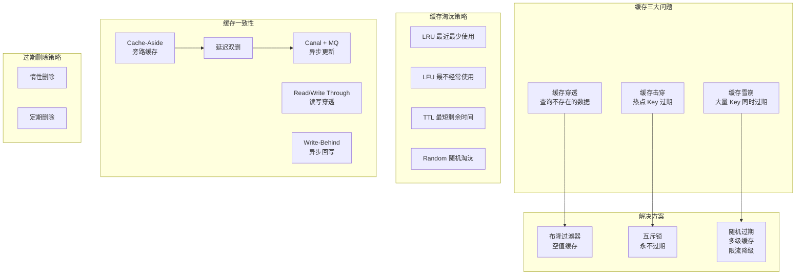

# 缓存策略与一致性

## 概述

缓存是 Redis 最核心的应用场景，但缓存架构中的"三座大山"（穿透、击穿、雪崩）以及缓存与数据库的一致性问题，是每个高级工程师必须深入掌握的领域。本章从原理到方案，系统阐述缓存防护策略、淘汰策略、更新策略和一致性保障，帮助你在面试和架构设计中游刃有余。

---

## 一、知识图谱



---

## 二、基础到进阶学习路线

- **阶段一：基础入门** -- 理解缓存穿透、击穿、雪崩的概念和基本解决方案，能够独立排查线上缓存问题
- **阶段二：原理深入** -- 掌握布隆过滤器的原理与实现，理解 LRU/LFU 淘汰算法的内部实现差异，理解 Cache-Aside 模式下的一致性问题根因
- **阶段三：实战优化** -- 掌握延迟双删、Canal + MQ 异步更新等高阶一致性方案，能够设计多级缓存架构，理解过期删除策略的底层实现

---

## 三、核心知识详解

### 3.1 缓存穿透

**定义**：查询一个数据库中也不存在的数据，缓存中自然没有，每次请求都穿透缓存直接打到数据库。

```
高并发场景下的穿透问题：

  客户端
    │
    ▼
  缓存查询（不存在）→ 每次都 Miss
    │
    ▼
  数据库查询（也不存在）→ 每次都查库
    │
    ▼
  数据库压力过大 → 可能被拖垮
```

#### 解决方案一：布隆过滤器（Bloom Filter）

布隆过滤器是一种空间效率极高的概率型数据结构，用于判断一个元素**可能**在集合中，或**一定不在**集合中。

```
布隆过滤器原理：

1. 初始化：m 位的位数组，全部置 0

2. 添加元素：用 k 个哈希函数对元素求哈希值，
   将对应的 k 个位置设为 1

   添加 "hello"：
   hash1("hello") % m = 3  →  bit[3] = 1
   hash2("hello") % m = 7  →  bit[7] = 1
   hash3("hello") % m = 11 → bit[11] = 1

3. 查询元素：用同样的 k 个哈希函数计算，
   如果所有 k 个位置都是 1 → 可能存在（可能误判）
   如果任意一个位置是 0 → 一定不存在
```

```
布隆过滤器参数计算：

m = -(n * ln(p)) / (ln(2))^2
k = (m / n) * ln(2)

其中：
  n = 预计元素数量
  p = 期望误判率
  m = 位数组大小
  k = 哈希函数个数

示例：n=1000 万，p=0.01（1% 误判率）
  m = -(10000000 * ln(0.01)) / (ln(2))^2
    ≈ 95850584 bit ≈ 11.4 MB
  k = (95850584 / 10000000) * ln(2) ≈ 7

即：11.4 MB 内存，7 个哈希函数，实现 1% 误判率
```

```java
// Redisson 布隆过滤器使用示例
@Service
public class BloomFilterService {
    
    @Autowired
    private RedissonClient redissonClient;
    
    private RBloomFilter<String> productBloomFilter;
    
    @PostConstruct
    public void init() {
        // 预计 1000 万商品，误判率 1%
        productBloomFilter = redissonClient.getBloomFilter("product:bloom");
        productBloomFilter.tryInit(10_000_000L, 0.01);
        
        // 预加载所有商品 ID
        List<String> productIds = loadAllProductIds();
        productIds.forEach(productBloomFilter::add);
    }
    
    public Product getProduct(String productId) {
        // 1. 布隆过滤器快速判断
        if (!productBloomFilter.contains(productId)) {
            return null; // 一定不存在，直接返回
        }
        
        // 2. 查缓存
        String cacheKey = "product:" + productId;
        Product product = (Product) redisTemplate.opsForValue().get(cacheKey);
        if (product != null) {
            return product;
        }
        
        // 3. 查数据库
        product = productMapper.selectById(productId);
        if (product != null) {
            redisTemplate.opsForValue().set(cacheKey, product, 1, TimeUnit.HOURS);
        }
        return product;
    }
}
```

#### 解决方案二：空值缓存

```java
// 查询数据库也不存在时，缓存空值
public Product getProduct(String productId) {
    String cacheKey = "product:" + productId;
    Product product = (Product) redisTemplate.opsForValue().get(cacheKey);
    if (product != null) {
        // 判断是否为 null 标记
        if (product.getId() == null) {
            return null; // 缓存的空值
        }
        return product;
    }
    
    product = productMapper.selectById(productId);
    if (product != null) {
        redisTemplate.opsForValue().set(cacheKey, product, 1, TimeUnit.HOURS);
    } else {
        // 缓存空值，设置较短的过期时间（防止攻击）
        redisTemplate.opsForValue().set(cacheKey, new Product(), 5, TimeUnit.MINUTES);
    }
    return product;
}
```

| 方案 | 优点 | 缺点 | 适用场景 |
|------|------|------|----------|
| 布隆过滤器 | 内存占用极小，不缓存空值 | 有误判率，删除元素困难 | 数据量大、Key 固定 |
| 空值缓存 | 实现简单，100% 准确 | 内存占用随空值增多 | 空值不多、Key 变化 |

### 3.2 缓存击穿

**定义**：热点 Key 在过期的瞬间，大量并发请求同时查询数据库，给数据库带来巨大压力。

```
缓存击穿场景：

  热点 Key（如爆款商品详情）
    缓存过期时间：3600s
    并发请求数：10000 QPS

  时间轴：
  T0: Key 过期
  T1: 10000 个请求同时查询缓存，全部 Miss
  T2: 10000 个请求全部打到数据库
  → 数据库瞬间压力过大
```

#### 解决方案一：互斥锁（Mutex Lock）

```java
public Product getProductWithMutex(String productId) {
    String cacheKey = "product:" + productId;
    Product product = (Product) redisTemplate.opsForValue().get(cacheKey);
    if (product != null) {
        return product;
    }
    
    // 互斥锁 Key
    String lockKey = "lock:product:" + productId;
    try {
        // 尝试获取锁，最多等 3 秒
        boolean locked = redisTemplate.opsForValue()
            .setIfAbsent(lockKey, "1", 3, TimeUnit.SECONDS);
        
        if (locked) {
            // 拿到锁，查询数据库并重建缓存
            product = productMapper.selectById(productId);
            if (product != null) {
                redisTemplate.opsForValue()
                    .set(cacheKey, product, 1, TimeUnit.HOURS);
            }
        } else {
            // 没拿到锁，等一会再重试
            Thread.sleep(50);
            return getProductWithMutex(productId); // 递归重试
        }
    } catch (InterruptedException e) {
        Thread.currentThread().interrupt();
    } finally {
        redisTemplate.delete(lockKey);
    }
    return product;
}
```

#### 解决方案二：永不过期 + 异步更新

```
方案设计：

1. 缓存不设置过期时间（逻辑过期替代物理过期）
2. 在 Value 中存储过期时间戳
3. 读取时判断是否过期：
   - 未过期：直接返回
   - 已过期：返回旧值 + 异步更新缓存
```

```java
@Data
public class CacheWrapper<T> {
    private T data;             // 实际数据
    private long expireAt;      // 逻辑过期时间戳
}

public Product getProductLogicalExpire(String productId) {
    String cacheKey = "product:" + productId;
    CacheWrapper<Product> wrapper = 
        (CacheWrapper<Product>) redisTemplate.opsForValue().get(cacheKey);
    
    if (wrapper == null) {
        return loadAndCache(productId);
    }
    
    // 判断是否逻辑过期
    if (System.currentTimeMillis() > wrapper.getExpireAt()) {
        // 异步更新缓存
        String lockKey = "lock:product:" + productId;
        boolean locked = redisTemplate.opsForValue()
            .setIfAbsent(lockKey, "1", 3, TimeUnit.SECONDS);
        if (locked) {
            threadPool.execute(() -> {
                loadAndCache(productId);
                redisTemplate.delete(lockKey);
            });
        }
        // 返回旧值（保证可用性）
    }
    return wrapper.getData();
}
```

### 3.3 缓存雪崩

**定义**：大量 Key 在同一时间过期，或 Redis 服务宕机，导致所有请求直接打到数据库。

```
缓存雪崩的两种场景：

场景一：大量 Key 同时过期
  Key 过期时间都一样（如 1 小时），
  整点过期 → 瞬间海量请求打到数据库

场景二：Redis 服务宕机
  所有缓存不可用 → 100% 请求打到数据库
```

#### 解决方案

```java
// 方案一：随机过期时间
public void setCacheWithRandomExpire(String key, Object value, long baseExpire) {
    // 在基础过期时间上增加随机偏移（±30%）
    long randomOffset = ThreadLocalRandom.current()
        .nextLong((long)(baseExpire * 0.3));
    long actualExpire = baseExpire + randomOffset;
    redisTemplate.opsForValue().set(key, value, actualExpire, TimeUnit.SECONDS);
}

// 方案二：多级缓存 + 降级
@Service
public class MultiLevelCacheService {
    
    @Autowired
    private RedisTemplate<String, Object> redisTemplate;
    
    // 本地缓存（Caffeine）
    private Cache<String, Object> localCache = Caffeine.newBuilder()
        .maximumSize(10000)
        .expireAfterWrite(5, TimeUnit.MINUTES)
        .build();
    
    public Product getProduct(String productId) {
        String cacheKey = "product:" + productId;
        
        // 一级缓存：本地缓存
        Product product = (Product) localCache.getIfPresent(cacheKey);
        if (product != null) {
            return product;
        }
        
        try {
            // 二级缓存：Redis
            product = (Product) redisTemplate.opsForValue().get(cacheKey);
            if (product != null) {
                localCache.put(cacheKey, product);
                return product;
            }
        } catch (Exception e) {
            // Redis 不可用，降级到数据库
            log.warn("Redis unavailable, fallback to DB", e);
        }
        
        // 三级：数据库
        product = productMapper.selectById(productId);
        if (product != null) {
            localCache.put(cacheKey, product);
            try {
                redisTemplate.opsForValue()
                    .set(cacheKey, product, 1, TimeUnit.HOURS);
            } catch (Exception ignored) {
                // Redis 不可用，忽略
            }
        }
        return product;
    }
}
```

```
多级缓存架构：

  请求 → 本地缓存(Caffeine) → Redis → 数据库
          ↓ Hit              ↓ Hit    ↓
         返回               返回     返回+回填缓存

  降级策略：
  Redis 不可用 → 跳过 Redis，本地缓存 + 数据库
  数据库也不可用 → 返回本地缓存中的旧数据（兜底）
```

### 3.4 缓存淘汰策略

Redis 提供 8 种内存淘汰策略，核心是 LRU 和 LFU。

```
淘汰策略分类：

noeviction（默认）
  └── 不淘汰，内存满时写操作报错

volatile-*（仅对设置了过期时间的 Key）
  ├── volatile-lru：最近最少使用
  ├── volatile-lfu：最不经常使用
  ├── volatile-random：随机
  └── volatile-ttl：TTL 最短的先淘汰

allkeys-*（对所有 Key）
  ├── allkeys-lru：最近最少使用
  ├── allkeys-lfu：最不经常使用
  └── allkeys-random：随机
```

#### LRU 实现原理

Redis 的 LRU 是**近似 LRU**，不是标准的精确 LRU。

```
近似 LRU 算法：

1. 每个 RedisObject 维护一个 lru 字段（24 bit），
   记录上次访问时间（秒级时间戳）

2. 淘汰时，随机采样 N 个 Key（maxmemory-samples，默认 5）

3. 比较采样 Key 的 lru 值，淘汰最久未访问的那个

4. 采样数越大，越接近精确 LRU，但 CPU 开销也越大

为什么不实现精确 LRU？
  - 精确 LRU 需要维护双向链表，每次访问都要移动节点
  - 内存开销大（每个 Key 需要额外指针）
  - 近似 LRU 在 maxmemory-samples=10 时，效果接近精确 LRU
```

```
LRU 的局限性（为什么需要 LFU）：

场景：缓存热点数据 + 偶尔的批量冷数据访问

  时间线：
  T1: 缓存 100 个热点 Key，内存满
  T2: 批量扫描 100 个冷数据 Key（如报表查询）
      → LRU 将 100 个热点 Key 淘汰（它们"最近"没被访问）
      → 冷数据占据了缓存
  T3: 正常流量回来，热点 Key 全部 Miss

  LFU 不会出现这个问题：冷数据访问频率低，
  即使"最近"被访问了，LFU 计数也不高，不会被优先保留
```

#### LFU 实现原理

```
LFU 计数器（Redis 4.0+）：

RedisObject 的 lru 字段（24 bit）被重新解释：

  +--------------------+---------------------+
  | 高 16 bit：ldt     | 低 8 bit：logc       |
  |（上次衰减时间）     |（对数计数器）         |
  +--------------------+---------------------+

logc（对数计数器）：
  - 不是精确的访问次数，而是概率性的对数计数
  - 每次访问：
    1. 取 0~1 之间的随机数 r
    2. 比较 r 与 1/(counter * lfu_log_factor + 1)
    3. 如果 r 小，counter +1
  - 计数增长越来越难（对数特性），防止高频 Key 无限增长

ldt（上次衰减时间）：
  - 每隔 lfu_decay_time 分钟（默认 1），counter -1
  - 模拟访问频率的"衰减"效应
  - 长期不访问的 Key，counter 逐渐降低
```

| 策略 | 适用场景 | 注意事项 |
|------|----------|----------|
| allkeys-lru | 热点数据明显，时效性强 | 偶发冷数据可能挤掉热点 |
| allkeys-lfu | 热点数据明显，避免偶发冷数据干扰 | 新 Key 可能被误淘汰 |
| volatile-ttl | 业务能接受数据过期淘汰 | 无过期时间的 Key 不会被淘汰 |
| noeviction | 数据不能丢失 | 内存满时拒绝写入 |

### 3.5 缓存更新策略

#### Cache-Aside（旁路缓存）-- 最常用

```
Cache-Aside 模式：

  读操作：
  1. 从缓存读取
  2. 缓存命中 → 返回
  3. 缓存未命中 → 从数据库读取 → 写入缓存 → 返回

  写操作：
  1. 更新数据库
  2. 删除缓存（不是更新缓存）

  为什么是删除缓存而不是更新缓存？
  - 更新缓存可能产生并发问题（先更新数据库还是先更新缓存？）
  - 删除缓存是幂等操作，并发安全
  - 缓存的数据可能是计算/聚合结果，更新逻辑复杂
```

#### Read/Write Through（读写穿透）

```
Read Through：
  缓存层代理数据库读取，调用方只和缓存交互
  缓存 Miss → 缓存层自动查数据库并回填

Write Through：
  调用方只写缓存，缓存层同步写数据库
  写入完成时，缓存和数据库同时更新

优点：调用方代码简单，不需要关心数据库
缺点：缓存层实现复杂，需要处理同步写入的失败
```

#### Write-Behind（异步回写）

```
Write-Behind（Write-Back）：

  调用方只写缓存，立即返回成功
  缓存层异步批量写入数据库

优点：写入延迟极低，吞吐量高
缺点：数据可能丢失（缓存宕机，未写入数据库的数据丢失）
适用：非关键数据、允许少量丢失的场景（如页面浏览计数）
```

### 3.6 缓存一致性问题

#### 问题分析：为什么会有不一致？

```
Cache-Aside 模式下，更新数据库 + 删除缓存的顺序问题：

方案A：先删除缓存，再更新数据库
  T1: 线程 A 删除缓存
  T2: 线程 B 读缓存（Miss），查数据库（旧值），写缓存（旧值）
  T3: 线程 A 更新数据库（新值）
  结果：缓存 → 旧值，数据库 → 新值 → 不一致！

方案B：先更新数据库，再删除缓存
  T1: 线程 A 读缓存（Miss），查数据库（旧值）
  T2: 线程 B 更新数据库（新值）
  T3: 线程 B 删除缓存
  T4: 线程 A 写缓存（旧值）
  结果：缓存 → 旧值，数据库 → 新值 → 不一致！
  
  但方案B 的概率远低于方案A（需要 T1 读发生在 T2 更新之前，
  且 T4 写发生在 T3 删除之后，时间窗口极小）
```

#### 解决方案：延迟双删

```java
public void updateProduct(Product product) {
    String cacheKey = "product:" + product.getId();
    
    // 1. 第一次删除缓存
    redisTemplate.delete(cacheKey);
    
    // 2. 更新数据库
    productMapper.updateById(product);
    
    // 3. 延迟后再删除一次（异步）
    scheduler.schedule(() -> {
        redisTemplate.delete(cacheKey);
    }, 500, TimeUnit.MILLISECONDS); // 延迟 500ms，覆盖读请求的写缓存时间
    
    // 为什么延迟？给读请求留出"写缓存"的时间窗口，
    // 确保读请求写入的旧值被第二次删除覆盖
}
```

#### 高级方案：Canal + MQ 异步更新

```
Canal + MQ 架构：

┌──────────┐     ┌──────────┐     ┌──────────┐     ┌──────────┐
│  MySQL   │────>│  Canal   │────>│  RocketMQ │────>│  消费者   │
│ (binlog) │     │ (伪装Slave)│    │  (消息队列)│    │ (更新缓存) │
└──────────┘     └──────────┘     └──────────┘     └──────────┘

原理：
1. Canal 伪装成 MySQL Slave，订阅 binlog
2. 解析 binlog 中的增删改事件
3. 发送到 MQ（RocketMQ / Kafka）
4. 消费者消费消息，更新/删除 Redis 缓存

优点：
- 业务代码解耦：不需要在业务代码中维护缓存
- 最终一致性：binlog 保证不丢数据，MQ 保证消息可靠投递
- 高可用：Canal 支持 HA 部署
```

```java
// Canal 消费者处理器
@CanalEventHandler
public class ProductCacheHandler {
    
    @Autowired
    private RedisTemplate<String, Object> redisTemplate;
    
    @EventHandler(table = "product")
    public void handleProductChange(CanalEntry entry) {
        String productId = entry.getAfterColumn("id");
        String cacheKey = "product:" + productId;
        
        switch (entry.getEventType()) {
            case UPDATE:
            case DELETE:
                redisTemplate.delete(cacheKey);
                break;
            case INSERT:
                // 更新缓存（或直接删除，等下次查询时回填）
                redisTemplate.delete(cacheKey);
                break;
        }
    }
}
```

### 3.7 过期删除策略

Redis 采用**惰性删除 + 定期删除**的组合策略。

```
为什么不用定时删除？
  - 为每个 Key 创建定时器，CPU 开销太大
  - 如果有 10 万个过期 Key，就要创建 10 万个定时器

惰性删除（被动删除）：
  每次访问 Key 时，检查是否过期
  过期 → 删除并返回空
  优点：CPU 友好
  缺点：内存泄露（不访问的过期 Key 一直占用内存）

定期删除（主动删除）：
  每秒执行 serverCron → activeExpireCycle
  1. 从过期字典中随机取 20 个 Key
  2. 删除其中过期的
  3. 如果过期比例 > 25%，重复步骤 1
  4. 限制执行时间 ≤ 25ms（每次循环）
  5. 如果超时，下次继续从上次位置开始
```

```
定期删除的时间限制：

#define ACTIVE_EXPIRE_CYCLE_SLOW_TIME_PERC 25  // 25% CPU 时间

serverCron 每秒执行 10 次（hz 10），每次 100ms：
  定期删除可用时间 = 100ms * 25% = 25ms

如果 25ms 内未完成，记录当前进度，下次继续。
这保证了定期删除不会阻塞主线程过长时间。
```

---

## 四、经典应用场景与解决方案

### 场景：商品详情页高并发缓存架构

**问题背景**

某电商平台商品详情页 QPS 峰值达到 10 万，包含商品基础信息、库存、价格、促销标签等多个数据源。要求缓存命中率 99% 以上，页面响应时间 < 50ms，且缓存与数据库数据最终一致性延迟 < 5s。

**架构设计**

```
多级缓存架构：

┌──────────────────────────────────────────────────────┐
│                    CDN（静态资源）                      │
└──────────────────────┬───────────────────────────────┘
                       │
                       v
┌──────────────────────────────────────────────────────┐
│               Nginx 本地缓存（热点商品）                │
│               proxy_cache / lua-resty-lrucache        │
└──────────────────────┬───────────────────────────────┘
                       │
                       v
┌──────────────────────────────────────────────────────┐
│              Redis Cluster（分布式缓存）               │
│  ┌─────────┐  ┌─────────┐  ┌─────────┐               │
│  │ 分片 1  │  │ 分片 2  │  │ 分片 3  │               │
│  └─────────┘  └─────────┘  └─────────┘               │
└──────────────────────┬───────────────────────────────┘
                       │
                       v
┌──────────────────────────────────────────────────────┐
│                MySQL 主从 + 读写分离                    │
└──────────────────────────────────────────────────────┘
```

**缓存一致性方案**

```
┌──────────┐    binlog     ┌──────────┐    消息     ┌──────────┐
│  MySQL   │ ────────────> │  Canal   │ ──────────> │ RocketMQ │
└──────────┘               └──────────┘             └────┬─────┘
      │                                                    │
      │ 更新商品                                           │
      v                                                    v
┌──────────┐                                     ┌─────────────────┐
│ 商品服务  │                                     │ 缓存更新消费者    │
└──────────┘                                     │ 1. 删除 Redis   │
                                                  │ 2. 更新本地缓存  │
                                                  └─────────────────┘
```

**关键配置**

```conf
# Redis 淘汰策略
maxmemory-policy allkeys-lru
maxmemory-samples 10

# 过期时间配置
# 商品基础信息：1 小时
# 库存信息：10 秒（实时性要求高）
# 价格信息：30 秒
# 促销标签：5 分钟

# 缓存穿透防护
# 使用布隆过滤器预加载所有商品 ID
```

---

## 五、高频面试题

### Q1: 缓存穿透怎么解决？布隆过滤器的原理是什么？

::: details 答案

**缓存穿透**：查询一个数据库中也不存在的数据，缓存中始终没有，每次请求都穿透缓存打到数据库。

**解决方案**：

1. **布隆过滤器（首选）**：
   - 原理：使用 m 位的位数组和 k 个哈希函数。添加元素时，用 k 个哈希函数计算出 k 个位置，全部置为 1。查询时，如果 k 个位置都是 1 则"可能存在"（有误判），如果任意位置为 0 则"一定不存在"
   - 空间效率：1000 万数据，1% 误判率，仅需约 11.4 MB
   - 限制：有误判率，不能删除元素（可用 Counting Bloom Filter 解决）
   - 适用：数据量大、Key 集合相对固定

2. **空值缓存**：
   - 查询数据库也不存在时，缓存一个空值，设置较短的过期时间
   - 优点：实现简单，100% 准确
   - 缺点：内存占用随空值增多，可能被恶意攻击利用（大量不存在的 Key）
   - 适用：空值不多的场景

3. **接口层校验**：
   - 在接口层做基础校验（ID 格式、范围等），过滤明显非法的请求
   - 结合布隆过滤器实现双重防护

**布隆过滤器关键参数**：
- m（位数组大小）= -(n * ln(p)) / (ln(2))^2
- k（哈希函数个数）= (m / n) * ln(2)
- 误判率 p 和 m 成反比，m 越大，p 越小
:::

### Q2: 缓存击穿和缓存雪崩有什么区别？各自的解决方案是什么？

::: details 答案

**缓存击穿**：单个热点 Key 在过期的瞬间，大量并发请求同时查询数据库。

**缓存雪崩**：大量 Key 在同一时间过期，或 Redis 服务宕机，导致所有请求打到数据库。

| 维度 | 缓存击穿 | 缓存雪崩 |
|------|----------|----------|
| 影响范围 | 单个热点 Key | 大批量 Key 或整个 Redis |
| 触发条件 | 热点 Key 过期 | 大量 Key 同时过期 / Redis 宕机 |
| 危害程度 | 数据库瞬时压力大（单点） | 数据库可能崩溃（全面） |

**缓存击穿解决方案**：

1. **互斥锁**：查询数据库前加分布式锁，只有一个请求能查库并重建缓存，其他请求等待或返回旧值
2. **永不过期**：不设置物理过期时间，在 Value 中存储逻辑过期时间。读取时发现逻辑过期，返回旧值 + 异步更新缓存

**缓存雪崩解决方案**：

1. **随机过期时间**：在基础过期时间上增加随机偏移（如 ±30%），避免大量 Key 同时过期
2. **多级缓存**：本地缓存（Caffeine/Guava） + Redis + 数据库，Redis 不可用时降级到本地缓存
3. **限流降级**：在网关层做限流（令牌桶/漏桶），对超过阈值的请求直接返回降级响应
4. **Redis 高可用**：使用 Redis Cluster 或 Sentinel，避免单点故障
5. **缓存预热**：系统启动时预加载热点数据到缓存
:::

### Q3: 延迟双删为什么能解决缓存一致性问题？还有其他方案吗？

::: details 答案

**问题背景**：在 Cache-Aside 模式下，更新数据库 + 删除缓存的操作无法做到真正的原子性。无论先删缓存还是先更新数据库，在并发场景下都可能出现短暂的不一致。

**延迟双删原理**：

```java
// 1. 删除缓存（清除可能存在的旧值）
redis.delete(key);

// 2. 更新数据库
db.update(data);

// 3. 延迟 N 毫秒后再次删除缓存
Thread.sleep(500);
redis.delete(key);
```

**为什么有效**：延迟双删的核心思路是**容忍短暂的不一致，通过第二次删除来修正**。

具体场景分析：
```
T1: 线程 A 删除缓存
T2: 线程 B 读缓存（Miss），查数据库（旧值）
T3: 线程 A 更新数据库（新值）
T4: 线程 B 将旧值写入缓存 → 缓存中是旧值
T5: 线程 A 延迟后再次删除缓存 → 旧值被清除
T6: 后续请求查缓存（Miss），查数据库（新值），写入缓存（新值）
```

第二次删除覆盖了 T2~T4 这个并发窗口，保证最终一致性。

**延迟时间的设置**：需要大于"读请求查库 + 写缓存"的时间，通常 300~1000ms。

**其他方案**：

1. **Canal + MQ 异步更新**（推荐）：
   - Canal 监听 MySQL binlog，数据变更时发 MQ 消息
   - 消费者消费消息，删除/更新 Redis 缓存
   - 优点：业务代码解耦，可靠性高
   - 缺点：架构复杂，有延迟（秒级）

2. **分布式事务**（不推荐）：
   - 使用 Seata 等分布式事务框架保证缓存和数据库的原子性
   - 缺点：性能开销大，不适合高并发缓存场景

3. **Write-Through 缓存**：
   - 缓存层代理数据库写入，保证同步更新
   - 缺点：实现复杂，需要维护缓存层状态

4. **设置合理的过期时间**：
   - 即使出现不一致，过期后自动恢复
   - 作为兜底策略，配合其他方案使用
:::

### Q4: LRU 和 LFU 的区别是什么？Redis 是如何实现它们的？

::: details 答案

**概念区别**：

| 维度 | LRU（Least Recently Used） | LFU（Least Frequently Used） |
|------|---------------------------|------------------------------|
| 淘汰依据 | 最近最少使用（时间维度） | 最不经常使用（频率维度） |
| 核心思想 | 最近没被访问的数据，将来也不太可能被访问 | 访问频率低的数据，价值较低 |
| 计数器 | 记录上次访问时间 | 记录访问频率（对数计数） |
| 典型问题 | 偶发性批量访问会挤掉热点 | 新 Key 可能被误淘汰 |

**Redis 近似 LRU 实现**：

Redis 不实现精确 LRU（需要双向链表，开销大），而是使用近似 LRU：

1. 每个 RedisObject 维护一个 `lru` 字段（24 bit），记录上次访问时间（秒级时间戳）
2. 淘汰时，随机采样 N 个 Key（`maxmemory-samples`，默认 5）
3. 比较采样 Key 的 `lru` 值，淘汰最久未访问的那个
4. `maxmemory-samples=10` 时，效果接近精确 LRU

**Redis LFU 实现**（4.0+）：

RedisObject 的 `lru` 字段被重新解释：
- 高 16 bit：`ldt`（上次衰减时间）
- 低 8 bit：`logc`（对数计数器）

访问时更新计数器：
- 概率性增加：`1/(counter * lfu_log_factor + 1)` 的概率 +1
- 对数增长：counter 越大，增长越慢，防止高频 Key 无限增长

衰减机制：
- 每隔 `lfu_decay_time` 分钟（默认 1），counter -1
- 长期不访问的 Key，counter 逐渐降低

**选择建议**：
- 时效性强的热点数据（如新闻、热搜）→ LRU
- 避免偶发冷数据干扰（如报表查询）→ LFU
- `allkeys-lfu` 最适合大多数业务场景
:::

### Q5: Redis 的过期删除策略是怎样的？为什么不用定时删除？

::: details 答案

Redis 采用**惰性删除 + 定期删除**的组合策略。

**惰性删除（被动删除）**：
- 每次访问 Key 时，检查 `expires` 字典中该 Key 是否过期
- 过期则删除 Key，返回空
- 实现：`expireIfNeeded()` 函数，在 `lookupKeyRead()` / `lookupKeyWrite()` 中调用
- 优点：CPU 友好，只在访问时才检查
- 缺点：内存不友好，不访问的过期 Key 一直占用内存

**定期删除（主动删除）**：
- `serverCron` 每秒执行 10 次（`hz 10`），调用 `activeExpireCycle()`
- 每次从过期字典中随机取 20 个 Key
- 删除其中过期的 Key
- 如果过期比例 > 25%，继续循环
- 限制每次执行时间 ≤ 25ms（`ACTIVE_EXPIRE_CYCLE_SLOW_TIME_PERC = 25%`）
- 超时后记录进度，下次继续

**为什么不用定时删除？**

定时删除是指为每个设置了过期时间的 Key 创建一个定时器，到期时自动删除。Redis 不使用这种方式的原因：

1. **CPU 开销巨大**：如果有 10 万个过期 Key，就需要创建 10 万个定时器。定时器的创建、管理和触发都会消耗大量 CPU 资源，严重影响 Redis 的吞吐量

2. **与单线程模型冲突**：Redis 是单线程处理命令的，大量定时器到期时的回调会阻塞主线程

3. **内存开销**：每个定时器本身需要内存存储（timer 结构体），数万个定时器本身消耗可观的内存

**Redis 折衷方案的优势**：
- 惰性删除保证 CPU 不被浪费（只检查访问的 Key）
- 定期删除保证内存不被浪费（主动清理过期 Key）
- 两者结合，在 CPU 和内存之间取得平衡
:::

### Q6: 缓存和数据库的一致性如何保证？有哪些方案对比？

::: details 答案

缓存一致性是分布式系统中经典的难题，本质上是 CAP 理论的体现：无法同时保证强一致性和高可用性。

**方案对比**：

| 方案 | 一致性级别 | 复杂度 | 性能 | 适用场景 |
|------|-----------|--------|------|----------|
| 先删缓存再更新 DB | 弱 | 低 | 高 | 一致性要求低 |
| 先更新 DB 再删缓存 | 最终一致 | 低 | 高 | 大多数场景 |
| 延迟双删 | 最终一致 | 中 | 高 | 并发写入场景 |
| Canal + MQ | 最终一致（秒级） | 高 | 高 | 复杂业务、多服务 |
| 分布式事务 | 强一致 | 极高 | 低 | 金融、支付 |
| 设置过期时间 | 最终一致 | 极低 | 高 | 兜底策略 |

**推荐组合方案**（从低到高）：

1. **基础方案**：先更新 DB，再删缓存 + 设置合理的过期时间（兜底）
2. **进阶方案**：延迟双删（解决并发读写导致的不一致）
3. **高级方案**：Canal + MQ 异步更新（解耦业务代码，可靠投递）
4. **兜底方案**：缓存过期时间 + 定时任务全量同步（如凌晨对账）

**关键认知**：
- 缓存和数据库的强一致性代价极高，大多数场景下最终一致性足够
- 过期时间是最终一致性的天然保障（即使所有方案都失败，过期后也会恢复）
- 权衡：业务能接受多长的不一致窗口？是否能接受偶尔读到旧数据？
:::

---

## 六、选型指南

### 适用场景

| 场景 | 推荐缓存策略 | 淘汰策略 |
|------|-------------|----------|
| 读多写少（商品详情） | Cache-Aside + 先更新 DB 再删缓存 | allkeys-lru |
| 高并发读（热点数据） | 多级缓存 + 永不过期（逻辑过期） | allkeys-lfu |
| 写多读少（日志计数） | Write-Behind 异步回写 | volatile-lfu |
| 实时性要求高（库存） | 短过期时间 + 互斥锁防击穿 | volatile-ttl |
| 复杂业务（订单） | Canal + MQ 异步更新 | allkeys-lru |

### 不适用场景

- 强一致性要求的场景（如金融交易核心数据）
- 数据量极大且访问模式不可预测（缓存命中率低，收益小）
- 写入频繁但读取很少的数据（缓存维护成本 > 收益）
- 数据结构复杂、查询条件多变的场景（缓存命中率低）

### 配置建议

```conf
# 缓存淘汰策略（推荐 allkeys-lfu）
maxmemory-policy allkeys-lfu
maxmemory-samples 10

# LFU 参数
lfu-log-factor 10       # 计数器增长因子（越大增长越慢，默认 10）
lfu-decay-time 1        # 衰减时间（分钟，默认 1）

# 过期删除频率
hz 10                   # 每秒执行 10 次定期删除

# 内存上限（建议设为物理内存的 70%）
maxmemory 4gb
```

---

## 相关文档

- [Redis 核心原理](./index)
- [高级数据结构详解](./data-structure)
- [分布式锁](./distributed-lock)
- [集群方案](./cluster)