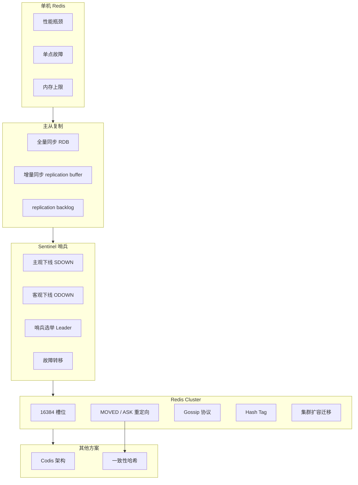

# 集群方案

## 概述

从单机 Redis 到支撑亿级流量的分布式集群，主从复制、Sentinel 哨兵、Redis Cluster 构成了 Redis 高可用架构的三大支柱。本章深入剖析每种方案的架构原理、数据同步机制、故障转移流程和扩容方案，帮助你在面试中系统阐述 Redis 从单点到分布式的演进路径。

---

## 一、知识图谱



---

## 二、基础到进阶学习路线

- **阶段一：基础入门** -- 理解主从复制的配置和基本原理，掌握 Sentinel 的部署和故障转移流程
- **阶段二：原理深入** -- 理解全量同步与增量同步的内部机制，掌握 replication buffer 和 backlog 的区别，理解 Sentinel 的选举算法
- **阶段三：实战优化** -- 掌握 Redis Cluster 的 16384 槽位设计、MOVED/ASK 重定向、Gossip 协议、hash tag 和集群扩容流程，能够对比 Codis 和一致性哈希方案

---

## 三、核心知识详解

### 3.1 主从复制

主从复制是 Redis 高可用的基础，通过将主节点的数据异步复制到从节点，实现读写分离和数据冗余。

```
主从复制架构：

  ┌──────────┐
  │  Master  │ ← 读写
  └────┬─────┘
       │ 异步复制
   ┌───┼───┐
   │   │   │
   v   v   v
┌──────┐ ┌──────┐ ┌──────┐
│Slave1│ │Slave2│ │Slave3│ ← 只读
└──────┘ └──────┘ └──────┘
```

#### 全量同步（Full Resynchronization）

```
全量同步流程：

  Slave                                    Master
    │                                         │
    │──── PSYNC ? -1 ────────────────────────>│  1. 从节点首次连接，发送 PSYNC
    │                                         │
    │                                         │  2. 主节点执行 BGSAVE
    │                                         │     生成 RDB 快照
    │                                         │
    │<─── FULLRESYNC {replid} {offset} ───────│  3. 返回全量同步响应
    │                                         │
    │                                         │  4. 主节点发送 RDB 文件
    │<─────── RDB File ───────────────────────│
    │                                         │
    │  5. 从节点清空旧数据，加载 RDB            │
    │                                         │
    │                                         │  6. 主节点发送缓冲区中的增量命令
    │<─────── Buffer Commands ────────────────│
    │                                         │
    │  7. 从节点执行增量命令，完成同步           │
```

**触发全量同步的场景**：
1. 从节点首次连接主节点
2. 从节点的 `replication offset` 不在主节点的 `replication backlog` 范围内
3. 从节点报告的 `replication id` 与主节点不匹配

#### 增量同步（Partial Resynchronization）

```
增量同步依赖三个核心组件：

1. replication id（复制 ID）
   - 每个 Master 实例的唯一标识（40 位十六进制）
   - Slave 保存 Master 的 replication id

2. replication offset（复制偏移量）
   - 主节点和从节点各自维护一个 offset
   - 主节点：记录已发送给从节点的字节数
   - 从节点：记录已接收到的字节数

3. replication backlog（复制积压缓冲区）
   - 主节点维护的固定大小环形缓冲区（默认 1MB）
   - 记录最近的写命令
   - 如果从节点的 offset 还在 backlog 中 → 增量同步
   - 如果从节点的 offset 不在 backlog 中 → 全量同步
```

```
增量同步流程：

  Slave                                    Master
    │                                         │
    │──── PSYNC {replid} {offset} ───────────>│  1. 发送 replid + offset
    │                                         │
    │                                         │  2. 检查 replid 是否匹配
    │                                         │     检查 offset 是否在 backlog 中
    │                                         │
    │<─── CONTINUE {replid} ──────────────────│  3. 增量同步
    │                                         │
    │<─── Backlog Commands ───────────────────│  4. 发送 offset 之后的命令
    │                                         │
    │  5. 从节点执行增量命令                   │
```

```
replication buffer vs replication backlog：

┌────────────────────────────────────────────────────────────┐
│                    replication buffer                      │
│  每个 Slave 独享一个 buffer                                │
│  用于在 BGSAVE 期间暂存客户端写命令                         │
│  全量同步完成后，将 buffer 内容发送给 Slave                 │
│  大小：client-output-buffer-limit slave 256mb 64mb 60      │
├────────────────────────────────────────────────────────────┤
│                   replication backlog                      │
│  所有 Slave 共享一个环形缓冲区                              │
│  记录最近的写命令数据                                       │
│  用于支持增量同步（断线重连）                               │
│  大小：repl-backlog-size 1mb                               │
│  时间：repl-backlog-ttl 3600                               │
└────────────────────────────────────────────────────────────┘
```

#### 主从复制配置

```conf
# 从节点配置
replicaof 192.168.1.100 6379     # 指定主节点
masterauth "your_password"       # 主节点密码

# 主节点配置
repl-backlog-size 64mb           # 积压缓冲区大小（增大可减少全量同步）
repl-backlog-ttl 3600            # 积压缓冲区释放时间（秒）
min-replicas-to-write 1          # 至少 1 个从节点在线才接受写入
min-replicas-max-lag 10          # 从节点延迟超过 10s 拒绝写入
```

### 3.2 Sentinel 哨兵

Sentinel 是 Redis 官方提供的高可用方案，通过监控、通知、自动故障转移实现主从架构的自动化运维。

```
Sentinel 架构：

  ┌──────────────┐  ┌──────────────┐  ┌──────────────┐
  │  Sentinel 1  │  │  Sentinel 2  │  │  Sentinel 3  │
  │  (26379)     │  │  (26380)     │  │  (26381)     │
  └──────┬───────┘  └──────┬───────┘  └──────┬───────┘
         │                 │                 │
         └─────────────────┼─────────────────┘
                           │ 监控
              ┌────────────┼────────────┐
              │            │            │
              v            v            v
        ┌──────────┐ ┌──────────┐ ┌──────────┐
        │  Master  │ │  Slave1  │ │  Slave2  │
        │  (6379)  │ │  (6380)  │ │  (6381)  │
        └──────────┘ └──────────┘ └──────────┘
```

#### 主观下线（SDOWN）与客观下线（ODOWN）

```
主观下线（Subjectively Down）：
  单个 Sentinel 在指定时间内（down-after-milliseconds）
  未收到目标实例的有效响应，则认为该实例"主观下线"。

  检测方式：每秒发送一次 PING，如果超时未收到 PONG，
  则标记为 SDOWN

客观下线（Objectively Down）：
  当 Sentinel 将某个 Master 标记为 SDOWN 后，
  询问其他 Sentinel 对该 Master 的看法。
  
  如果超过 quorum 个 Sentinel 认为该 Master 已下线，
  则标记为 ODOWN，触发故障转移。

  quorum 配置：sentinel monitor mymaster 127.0.0.1 6379 2
  这里的 2 就是 quorum（法定人数）
```

#### 哨兵选举 Leader

```
Sentinel 故障转移需要选举一个 Leader 来执行：

1. 发现 Master ODOWN 的 Sentinel 向其他 Sentinel 发送
   SENTINEL is-master-down-by-addr 命令，请求投票

2. 其他 Sentinel 响应投票（先到先得原则）

3. 获得票数 >= max(quorum, N/2+1) 的 Sentinel 成为 Leader

4. Leader 执行故障转移：
   a. 从所有 Slave 中选出新的 Master
   b. 让其他 Slave 复制新的 Master
   c. 将旧 Master 降级为 Slave（如果恢复）

为什么需要 Sentinel 集群？
  - 单个 Sentinel 可能误判或自身故障
  - 需要多个 Sentinel 协商达成共识
  - 推荐部署至少 3 个 Sentinel（奇数个）
```

#### 故障转移流程

```
故障转移完整流程：

1. Sentinel 检测到 Master SDOWN
2. 确认 ODOWN（>= quorum 个 Sentinel 同意）
3. 选举 Sentinel Leader
4. Leader 选择新 Master：
   ┌────────────────────────────────────────────────┐
   │ 选择标准（优先级从高到低）：                      │
   │ 1. slave-priority 配置最低的优先               │
   │ 2. 复制偏移量最大的（数据最新）                  │
   │ 3. runid 最小的（字典序）                       │
   └────────────────────────────────────────────────┘
5. Leader 向新 Master 发送 SLAVEOF NO ONE
6. Leader 向其他 Slave 发送 SLAVEOF {new_master_ip} {port}
7. Leader 监控旧 Master，恢复后将其降级为 Slave
```

### 3.3 Redis Cluster

Redis Cluster 是 Redis 官方提供的分布式方案，通过数据分片实现水平扩展。

```
Redis Cluster 架构：

┌──────────────────────────────────────────────────────┐
│                  Redis Cluster                       │
│                                                      │
│  ┌──────────┐  ┌──────────┐  ┌──────────┐           │
│  │ Master A │  │ Master B │  │ Master C │           │
│  │ Slot     │  │ Slot     │  │ Slot     │           │
│  │ 0-5460   │  │ 5461-    │  │ 10923-   │           │
│  │          │  │ 10922    │  │ 16383    │           │
│  └────┬─────┘  └────┬─────┘  └────┬─────┘           │
│       │             │             │                  │
│  ┌────┴─────┐  ┌────┴─────┐  ┌────┴─────┐           │
│  │ Slave A1 │  │ Slave B1 │  │ Slave C1 │           │
│  └──────────┘  └──────────┘  └──────────┘           │
│                                                      │
│  Gossip 协议互联（所有节点互相通信）                    │
└──────────────────────────────────────────────────────┘
```

#### 16384 槽位设计

```
为什么是 16384 个槽位？

1. 心跳消息大小考虑：
   每个节点的心跳消息包含槽位位图（bitmap）
   16384 / 8 / 1024 = 2 KB（位图大小）
   65536 / 8 / 1024 = 8 KB（如果 65536 个槽位）

   2KB 的心跳消息更合理，8KB 太大

2. 节点数限制：
   官方建议集群不超过 1000 个节点
   16384 个槽位足够均匀分配
   65536 个槽位对 1000 节点来说槽位过多，浪费

3. 压缩率：
   槽位位图在心跳包中可被压缩
   16384 个槽位在 1000 节点环境下压缩率很高
```

```
槽位分配与路由：

  CRC16(key) % 16384 → slot → 节点

  客户端缓存槽位映射表（slot → node）
  每次查询时：
  1. 计算 key 的 CRC16 哈希 → slot
  2. 查找本地缓存的 slot → node 映射
  3. 直接向目标节点发送请求
```

#### MOVED 与 ASK 重定向

```
MOVED 重定向（永久重定向）：

  场景：槽位已迁移到其他节点
  客户端向节点 A 请求 slot 5000 的数据
  但 slot 5000 已经迁移到节点 B
  节点 A 返回：MOVED 5000 192.168.1.101:6379
  客户端更新本地槽位映射表
  客户端向节点 B 重新发送请求

ASK 重定向（临时重定向）：

  场景：槽位正在迁移中
  节点 A 正在将 slot 5000 迁移到节点 B
  请求的 key 已经迁移到节点 B，但 slot 还在 A 上
  节点 A 返回：ASK 5000 192.168.1.101:6379
  客户端向节点 B 发送 ASKING 命令 + 原请求
  注意：ASKING 是一次性的，不更新槽位映射表
```

| 维度 | MOVED | ASK |
|------|-------|-----|
| 触发场景 | 槽位已完成迁移 | 槽位正在迁移中 |
| 槽位映射 | 更新本地缓存 | 不更新 |
| 后续请求 | 自动发往新节点 | 仍发往旧节点（直到槽位迁移完成） |
| 命令前缀 | 无需 | 需要先发送 ASKING |

#### Gossip 协议

```
Gossip 协议消息类型：

1. PING：定期向其他节点发送（包含自身信息和已知节点信息）
2. PONG：响应 PING / MEET 消息
3. MEET：邀请新节点加入集群
4. FAIL：通知其他节点某个节点已下线
5. PUBLISH：集群间广播 Pub/Sub 消息

Gossip 工作流程：

  每个节点每秒随机选择 5 个节点（1 个疑似下线 + 4 个随机）
  发送 PING 消息（包含 ping_sent 时间戳）

  节点收到 PING 后，回复 PONG（包含自己的信息）

  节点收到 PONG 后，更新本地节点状态表

  通过这种"闲聊"方式，集群状态最终在 O(log N) 轮内收敛
```

```
Gossip 协议中的故障检测：

1. 节点 A 发送 PING 给节点 B，超时未收到 PONG
2. 节点 A 在 gossip 消息中标记节点 B 为 PFAIL（疑似下线）
3. 其他节点收到 A 的 PING/PONG 后，知道 A 认为 B 是 PFAIL
4. 当大多数 Master 认为 B 是 PFAIL 时
5. 某个节点将 B 标记为 FAIL，通过 gossip 广播
6. 所有节点收到 FAIL 消息后，将 B 标记为 FAIL
7. B 的 Slave 发起故障转移
```

#### Hash Tag

```
Hash Tag 原理：

  { } 之间的内容用于计算 slot

  示例：
  user:{1001}:name   → 计算 hash("1001") → slot
  user:{1001}:age    → 计算 hash("1001") → 同一个 slot
  order:{1001}:items → 计算 hash("1001") → 同一个 slot

  这三个 Key 会落在同一个 slot（同一个节点），
  可以安全地使用 MGET、事务、Lua 脚本等跨 Key 操作。
```

```redis
-- 使用 Hash Tag 确保同一用户的多个 Key 在同一节点
SET user:{1001}:name "张三"
SET user:{1001}:age 25
SET user:{1001}:city "北京"

-- 可以安全使用 MGET
MGET user:{1001}:name user:{1001}:age user:{1001}:city

-- 可以在 Lua 脚本中操作
EVAL "
    local name = redis.call('GET', KEYS[1])
    local age = redis.call('GET', KEYS[2])
    return name .. ':' .. age
" 2 user:{1001}:name user:{1001}:age
```

#### 集群扩容与数据迁移

```
集群扩容流程：

1. 新节点加入集群：
   CLUSTER MEET {new_ip} {new_port}

2. 分配槽位：
   CLUSTER ADDSLOTS {slot} 或
   redis-cli --cluster reshard {ip}:{port}

3. 数据迁移（slot 迁移）：
   源节点：
     CLUSTER SETSLOT {slot} MIGRATING {target_node_id}
   目标节点：
     CLUSTER SETSLOT {slot} IMPORTING {source_node_id}
   获取槽位中的 Key：
     CLUSTER GETKEYSINSLOT {slot} {count}
   逐个迁移 Key：
     MIGRATE {target_ip} {target_port} {key} 0 {timeout}

4. 更新槽位配置：
   CLUSTER SETSLOT {slot} NODE {target_node_id}
```

```
迁移过程的状态转换：

  ┌─────────┐     MIGRATING    ┌─────────┐
  │ 源节点   │ ───────────────> │ 目标节点 │
  │ (NODE)  │                  │ (NODE)  │
  │         │ <─────────────── │         │
  └─────────┘     IMPORTING    └─────────┘

  迁移中的请求处理：
  - 源节点收到请求 → Key 已迁移？（ASKING 重定向）→ 目标节点
  - 源节点收到请求 → Key 未迁移？→ 正常处理
  - 目标节点收到请求 → slot 还在迁移？→ 需要 ASKING
  - 目标节点收到请求 → slot 已确认？→ 正常处理
```

### 3.4 槽分片 vs 一致性哈希

```
一致性哈希：

  将所有节点映射到哈希环上（0 ~ 2^32-1）
  Key 也映射到哈希环上
  顺时针找到第一个节点 = 目标节点

  优点：
  - 增删节点时只影响相邻节点（最小化数据迁移）
  - 适合节点动态变化的场景

  缺点：
  - 数据分布不均匀（需要虚拟节点优化）
  - 热点数据无法处理
  - 实现复杂

Redis Cluster 槽分片：

  预先划分 16384 个固定槽位
  每个节点负责一部分槽位
  CRC16(key) % 16384 → slot

  优点：
  - 实现简单，数据分布均匀
  - 支持 hash tag（控制 Key 分布）
  - 迁移粒度可控（按槽位迁移）

  缺点：
  - 槽位数量固定（16384），不能动态增减
  - 单节点故障影响多个槽位
```

### 3.5 Codis 架构

Codis 是豌豆荚开源的 Redis 分布式中间件方案，通过 Proxy 层实现透明分片。

```
Codis 架构：

  ┌──────────────────────────────────────────────┐
  │                   Client                      │
  └──────────────────┬───────────────────────────┘
                     │
                     v
  ┌──────────────────────────────────────────────┐
  │              Codis Proxy（多实例）              │
  │  - 路由转发                                    │
  │  - 无状态，可水平扩展                           │
  └──────────────────┬───────────────────────────┘
                     │
                     v
  ┌──────────────────────────────────────────────┐
  │              Codis Dashboard                  │
  │  - 槽位管理                                    │
  │  - 扩容迁移协调                                │
  └──────────────────┬───────────────────────────┘
                     │
         ┌───────────┼───────────┐
         v           v           v
  ┌──────────┐ ┌──────────┐ ┌──────────┐
  │Codis-Group│ │Codis-Group│ │Codis-Group│
  │ Master   │ │ Master   │ │ Master   │
  │ Slave    │ │ Slave    │ │ Slave    │
  └──────────┘ └──────────┘ └──────────┘
```

| 维度 | Redis Cluster | Codis |
|------|---------------|-------|
| 架构 | P2P 无中心 | Proxy 中心化 |
| 槽位数 | 16384 固定 | 1024 固定 |
| 客户端 | 需要 Smart Client | 支持任意客户端（通过 Proxy） |
| 扩容 | 在线迁移，业务无感知 | Dashboard 统一管理 |
| 事务 | 不支持跨 slot | 不支持跨 slot |
| 多 Key 操作 | 需要 hash tag | 需要 hash tag |
| 成熟度 | 官方维护，更成熟 | 社区维护，更新较慢 |

---

## 四、经典应用场景与解决方案

### 场景：从单机到集群的平滑迁移

**问题背景**

某电商平台 Redis 从单机 16GB 逐步演进到 200GB 集群。要求在迁移过程中业务不中断，数据不丢失，且支持灰度切换。

**迁移方案**

```
迁移步骤：

  阶段一：双写阶段（1 周）
  ┌──────────────────────────────────────────────────────┐
  │  业务代码                                            │
  │  ├── 读：先读集群，Miss 再读单机                      │
  │  └── 写：同时写单机 + 集群（异步）                    │
  └──────────────────────────────────────────────────────┘

  阶段二：数据同步（1 天）
  使用 redis-shake 工具将单机数据全量同步到集群
  同步期间的增量数据通过双写保证

  阶段三：灰度切换（3 天）
  逐步增加集群的流量比例：10% → 30% → 50% → 100%
  监控集群的延迟、错误率、内存使用

  阶段四：下线单机（1 天）
  确认集群稳定后，停止双写，下线单机
```

```bash
# redis-shake 数据迁移
wget https://github.com/alibaba/RedisShake/releases/download/v3.0.0/redis-shake.tar.gz
tar -xzf redis-shake.tar.gz

# 配置 redis-shake.toml
[sync_reader]
address = "192.168.1.100:6379"  # 源单机

[redis_writer]
address = "192.168.1.200:6379"  # 目标集群任一节点
cluster = true                   # 目标为集群模式
```

**Key 迁移注意事项**

```
1. 大 Key 处理：
   - 使用 redis-cli --bigkeys 扫描大 Key
   - 大 Key 拆分或使用 UNLINK 异步删除

2. 热点 Key 处理：
   - 热点 Key 使用 hash tag 固定到特定节点
   - 或使用本地缓存（Caffeine）减少集群压力

3. 过期 Key 处理：
   - 迁移前确认过期时间正确传递
   - redis-shake 默认同步过期时间
```

---

## 五、高频面试题

### Q1: Redis Cluster 为什么是 16384 个槽位？

::: details 答案

Redis Cluster 使用 16384（2^14）个槽位而非 65536（2^16），主要基于以下考量：

**1. 心跳消息大小**
每个节点定期发送 PING/PONG 消息，其中包含本节点负责的槽位位图（bitmap）。槽位位图大小 = 槽位数 / 8 字节：
- 16384 槽位：16384 / 8 = 2048 字节 = 2KB
- 65536 槽位：65536 / 8 = 8192 字节 = 8KB

2KB 的心跳消息大小是合理的，8KB 则偏大。在 1000 个节点的集群中，每个节点每秒发送的 gossip 消息量会显著增长。

**2. 节点数量限制**
Redis 官方设计集群规模上限约为 1000 个节点。16384 个槽位分配到 1000 个节点，每个节点约 16 个槽位，分布足够均匀。65536 个槽位对于 1000 节点来说槽位过多，每个节点约 65 个槽位，对分布均匀性提升有限，但心跳消息却增大了 4 倍。

**3. 压缩效率**
槽位位图在心跳消息中可以被压缩传输。16384 个槽位在节点数较少时（如 10 个节点），每个节点负责连续的大段槽位，位图中有大段连续的 1 和 0，压缩率很高。65536 个槽位虽然也能压缩，但原始数据量更大。

**4. CRC16 的天然匹配**
Redis 使用 CRC16 哈希算法，输出范围是 0~65535。取模 16384 后哈希分布均匀，且 CRC16 的计算效率高。

**总结**：16384 是心跳消息大小、节点数量、哈希分布三者之间的最佳平衡点。
:::

### Q2: MOVED 和 ASK 重定向有什么区别？

::: details 答案

MOVED 和 ASK 都是 Redis Cluster 中客户端重定向的机制，但场景和语义不同。

| 维度 | MOVED | ASK |
|------|-------|-----|
| **触发时机** | 槽位已完全迁移到新节点 | 槽位正在迁移中 |
| **语义** | 槽位永久归新节点负责 | 仅当前请求的 Key 在新节点，槽位仍在迁移 |
| **客户端行为** | 更新本地槽位映射表，后续请求直接发往新节点 | 不更新槽位映射表，仅本次请求发往新节点 |
| **命令前缀** | 不需要 | 需要先发送 `ASKING` 命令 |
| **后续请求** | 自动路由到新节点 | 仍发往旧节点（直到迁移完成） |

**详细场景分析**：

**MOVED 场景**：
```
客户端缓存：slot 5000 → 节点 A
实际状态：slot 5000 已迁移到节点 B

客户端向节点 A 请求 slot 5000 的数据
→ 节点 A 返回：MOVED 5000 192.168.1.101:6379
→ 客户端更新缓存：slot 5000 → 节点 B
→ 客户端向节点 B 重新发送请求
→ 后续 slot 5000 的请求直接发往节点 B
```

**ASK 场景**：
```
迁移中：slot 5000 正在从节点 A 迁移到节点 B
部分 Key 已迁移到 B，但 slot 归属仍为 A

客户端向节点 A 请求已迁移的 Key
→ 节点 A 返回：ASK 5000 192.168.1.101:6379
→ 客户端向节点 B 发送 ASKING 命令
→ 客户端向节点 B 发送原请求
→ 节点 B 执行请求（因为收到 ASKING 后，允许处理正在导入的 slot）

注意：客户端不更新槽位映射表
后续 slot 5000 的请求仍发往节点 A
如果 Key 还在 A 上，A 直接处理
如果 Key 已迁移到 B，再次返回 ASK 重定向
```

**为什么 ASK 不更新槽位映射表？**
因为迁移是动态过程，slot 5000 中的 Key 可能部分在 A、部分在 B。如果客户端更新了映射表，下次请求 slot 5000 中仍在 A 上的 Key 时，会错误地发往 B。
:::

### Q3: Sentinel 的故障转移流程是怎样的？

::: details 答案

Sentinel 故障转移是一个多阶段、协商式的过程：

**阶段一：主观下线检测（SDOWN）**

每个 Sentinel 每秒向所有监控的实例（Master + Slave + 其他 Sentinel）发送 PING 命令。如果 Master 在 `down-after-milliseconds` 时间内未回复有效 PONG，该 Sentinel 将其标记为 SDOWN。

**阶段二：客观下线确认（ODOWN）**

标记 SDOWN 的 Sentinel 向其他 Sentinel 发送 `SENTINEL is-master-down-by-addr` 命令，询问它们对 Master 状态的判断。如果 >= `quorum` 个 Sentinel 认为 Master 下线，则标记为 ODOWN。

**阶段三：Leader 选举**

确认 ODOWN 后，Sentinel 之间通过 Raft-like 协议选举一个 Leader 来执行故障转移：
1. 发现 ODOWN 的 Sentinel 向其他 Sentinel 请求投票
2. 每个 Sentinel 在每个 epoch 中只能投一票（先到先得）
3. 获得 >= max(quorum, N/2+1) 票的 Sentinel 成为 Leader

**阶段四：选择新 Master**

Leader Sentinel 从所有 Slave 中选择新 Master，选择标准（优先级从高到低）：
1. `slave-priority` 配置最小的优先
2. 复制偏移量最大的（数据最新）
3. `runid` 字典序最小的

**阶段五：执行切换**

1. 向新 Master 发送 `SLAVEOF NO ONE`，使其成为独立 Master
2. 向其他 Slave 发送 `SLAVEOF {new_master_ip} {new_master_port}`，使其复制新 Master
3. 持续监控旧 Master，如果恢复，将其降级为新 Master 的 Slave

**关键时间参数**：
- `down-after-milliseconds`：30000（30 秒无响应判定 SDOWN）
- `failover-timeout`：180000（故障转移超时 3 分钟）
- `parallel-syncs`：1（同时向新 Master 同步的 Slave 数量）

**为什么需要多个 Sentinel？**
- 防止单 Sentinel 的网络分区导致误判
- 多个 Sentinel 协商保证故障转移决策的正确性
- 推荐至少 3 个 Sentinel（奇数个），避免脑裂
:::

### Q4: Redis Cluster 的 Gossip 协议是如何工作的？

::: details 答案

Gossip 协议是 Redis Cluster 中节点间通信的核心协议，用于节点发现、状态同步和故障检测。

**消息类型**：

| 消息 | 方向 | 说明 |
|------|------|------|
| PING | 发送 | 定期发送，包含自身信息和已知节点信息 |
| PONG | 回复 | 响应 PING 或 MEET |
| MEET | 发送 | 邀请新节点加入集群 |
| FAIL | 广播 | 宣告某节点已确认下线 |
| PUBLISH | 广播 | 转发 Pub/Sub 消息 |

**通信频率**：

每个节点每秒随机选择 5 个节点发送 PING（1 个疑似下线节点 + 4 个随机节点）。PING 消息包含：
- 本节点负责的槽位位图（2KB）
- 本节点 IP 和端口
- 本节点视角下部分其他节点的状态（随机选择 3 个节点）

**故障检测流程**：

1. 节点 A 向节点 B 发送 PING，超时未收到 PONG
2. 节点 A 将 B 标记为 PFAIL（疑似下线），在后续 PING/PONG 消息中携带此信息
3. 其他节点收到 A 的 gossip 消息后，知道 A 认为 B 是 PFAIL
4. 当集群中大多数 Master 都认为 B 是 PFAIL（`cluster-node-timeout * 2` 时间内）
5. 某个节点将 B 标记为 FAIL，通过 gossip 广播 FAIL 消息
6. 所有节点收到 FAIL 消息后，将 B 标记为 FAIL
7. B 的 Slave 发起故障转移，选举新 Master

**Gossip 协议的优势**：
- 去中心化：无需中心协调节点
- 最终一致性：信息通过多轮传播最终收敛
- 容错性好：单个节点故障不影响整体通信
- 低开销：每个节点每秒只发送少量消息

**Gossip 协议的局限**：
- 收敛需要时间（O(log N) 轮），不适合实时性要求极高的场景
- 节点数量过大时，消息量增大（建议集群不超过 1000 节点）
:::

### Q5: 集群扩容时数据如何迁移？迁移过程中客户端请求如何处理？

::: details 答案

**数据迁移流程**：

1. **准备阶段**：使用 `redis-cli --cluster reshard` 或手动执行迁移命令

2. **设置迁移状态**：
   ```
   源节点：CLUSTER SETSLOT {slot} MIGRATING {target_node_id}
   目标节点：CLUSTER SETSLOT {slot} IMPORTING {source_node_id}
   ```

3. **获取槽位中的 Key**：
   ```
   CLUSTER GETKEYSINSLOT {slot} {count}
   ```
   返回槽位中的 count 个 Key 名称

4. **逐个迁移 Key**：
   ```
   MIGRATE {target_ip} {target_port} {key} 0 {timeout} [REPLACE]
   ```
   MIGRATE 是原子操作，在源节点删除 Key 并在目标节点创建

5. **完成迁移**：
   ```
   源节点 + 目标节点：
   CLUSTER SETSLOT {slot} NODE {target_node_id}
   ```
   将槽位正式归属于目标节点，并通知所有节点

**迁移中客户端请求的处理**：

```
场景一：请求的 Key 还在源节点
  客户端 → 源节点（slot 的 MIGRATING 状态）
  源节点查找 Key → 存在 → 正常处理 → 返回结果

场景二：请求的 Key 已迁移到目标节点
  客户端 → 源节点（slot 的 MIGRATING 状态）
  源节点查找 Key → 不存在 → 返回 ASK 重定向
  客户端 → 目标节点：ASKING + 原请求
  目标节点（slot 的 IMPORTING 状态）→ 正常处理 → 返回结果

场景三：请求的 Key 在目标节点新增
  客户端 → 目标节点（slot 的 IMPORTING 状态）
  需要先发送 ASKING 命令
  目标节点正常处理

场景四：请求的 slot 还未迁移
  客户端 → 源节点（slot 还是 NODE 状态）
  源节点正常处理
```

**迁移过程中的一致性保障**：
- MIGRATE 命令是原子操作（源删 + 目标建）
- 迁移期间，源节点和目标节点都知道该 slot 的迁移状态
- ASK 重定向保证客户端能正确访问到已迁移的 Key
- 迁移完成后，通过 Gossip 协议广播新槽位配置
- 如果迁移中断，槽位状态回退到源节点

**扩容建议**：
- 在低峰期进行扩容迁移
- 逐个槽位迁移，控制迁移速度（避免影响正常业务）
- 监控迁移过程中的网络流量和延迟
- 确保目标节点有足够内存
:::

### Q6: 16384 槽位和一致性哈希有什么区别？各有什么优缺点？

::: details 答案

**一致性哈希**：

将所有节点和 Key 映射到同一个哈希环（0 ~ 2^32-1），Key 顺时针寻找最近的节点。

```
哈希环示意：
         0
    ┌─────────┐
    │   Node A │
    │          │
    │  Node C  │
    │          │
    │   Node B │
    └─────────┘
        2^32-1
```

优点：
- 增删节点时只影响相邻节点，数据迁移量最小
- 适合节点动态频繁变化的场景
- 配合虚拟节点可实现较好的负载均衡

缺点：
- 数据分布不均匀（需要足够多的虚拟节点优化）
- 无法控制特定 Key 的分布（无 hash tag 机制）
- 实现复杂，客户端需要维护哈希环

**槽位分片（Redis Cluster）**：

预先划分 16384 个固定槽位，每个节点负责一部分槽位。

优点：
- 实现简单，数据分布均匀
- 支持 hash tag（`{user_id}`），控制多 Key 在同一节点
- 迁移粒度可控（以槽位为单位）
- 协议层原生支持，Smart Client 自动路由

缺点：
- 槽位数量固定（16384），不能动态调整
- 增删节点时需要手动 rebalance
- 单节点故障影响多个槽位（需配合 Slave 高可用）

**对比总结**：

| 维度 | 一致性哈希 | 槽位分片 |
|------|-----------|----------|
| 数据分布 | 不均匀（需虚拟节点） | 均匀 |
| 增删节点影响 | 仅相邻节点 | 多个节点数据迁移 |
| 迁移粒度 | 按 Key | 按槽位（一批 Key） |
| Hash Tag | 不支持 | 支持 |
| 实现复杂度 | 高 | 低 |
| 代表方案 | Memcached 客户端 | Redis Cluster |

**选择建议**：
- 节点频繁变化、对数据迁移量敏感 → 一致性哈希
- 需要可控的 Key 分布、官方支持 → Redis Cluster 槽位分片
:::

---

## 六、选型指南

### 适用场景

| 场景 | 推荐方案 | 理由 |
|------|----------|------|
| 数据量 < 10GB，需高可用 | 主从 + Sentinel | 简单可靠，满足大部分需求 |
| 数据量 10~100GB，需水平扩展 | Redis Cluster | 官方原生支持，自动分片 |
| 数据量 > 100GB，需透明扩容 | Codis 或 Proxy 方案 | 管理方便，运维友好 |
| 仅需读写分离 | 主从复制 | 无需哨兵，手动切换 |
| 跨机房容灾 | 主从 + Sentinel（多机房） | 哨兵分布在不同机房 |

### 不适用场景

- 数据量极小（< 1GB）且无高可用需求 -- 单机即可
- 需要强一致性的事务场景 -- 考虑关系型数据库
- 需要跨 slot 的事务/Lua 脚本 -- Redis Cluster 不支持，需 hash tag

### 配置建议

```conf
# ========== Redis Cluster 配置 ==========
cluster-enabled yes
cluster-config-file nodes.conf
cluster-node-timeout 15000          # 节点超时 15 秒
cluster-migration-barrier 1         # 迁移屏障
cluster-require-full-coverage yes   # 所有槽位覆盖才接受请求

# ========== Sentinel 配置 ==========
sentinel monitor mymaster 192.168.1.100 6379 2
sentinel down-after-milliseconds mymaster 30000
sentinel failover-timeout mymaster 180000
sentinel parallel-syncs mymaster 1

# ========== 主从配置 ==========
repl-backlog-size 64mb
repl-backlog-ttl 3600
min-replicas-to-write 1
min-replicas-max-lag 10
```

---

## 相关文档

- [Redis 核心原理](./index)
- [持久化机制](./persistence)
- [分布式锁](./distributed-lock)
- [Redis 选型指南](./selection)