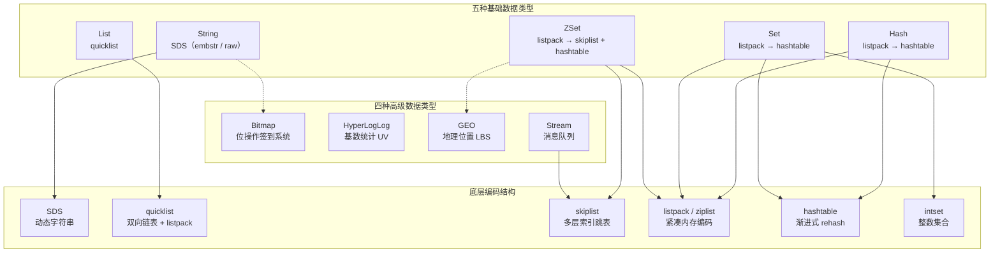

# 高级数据结构详解

## 概述

深入剖析 Redis 五种基础数据类型和四种高级数据类型的底层编码实现原理，理解 SDS、quicklist、skiplist、listpack、hashtable 等核心内部结构的设计思想与性能优势。掌握这些底层原理，能够在面试中清晰地解释 Redis 为什么快、为什么省内存，以及对高级工程师而言关键的 "知其然更知其所以然"。

---

## 一、知识图谱



---

## 二、基础到进阶学习路线

- **阶段一：基础入门** -- 熟练掌握五种基础类型的 API、使用场景和 Key 设计规范，能够在日常开发中正确选型
- **阶段二：原理深入** -- 理解每种数据类型的底层编码结构（SDS / quicklist / skiplist / listpack / hashtable），明白 Redis 在不同数据规模下自动切换编码的阈值策略
- **阶段三：实战优化** -- 掌握 Bitmap、HyperLogLog、GEO、Stream 四种高级类型的高阶用法；能够分析内存占用并给出优化方案；理解 Stream 消费者组与消息确认机制

---

## 三、核心知识详解

### 3.1 SDS（Simple Dynamic String）

SDS 是 Redis 中 String 类型的底层实现，用于替代 C 语言原生字符串。它不是简单的 `char*` 封装，而是一个经过精心设计的数据结构。

```
SDS 结构（Redis 3.2+ 按长度分为 5 种）：

sdshdr5  → flags(1B) + buf[]        （长度 < 32）
sdshdr8  → len(1B) + alloc(1B) + flags(1B) + buf[]  （长度 < 256）
sdshdr16 → len(2B) + alloc(2B) + flags(1B) + buf[]
sdshdr32 → len(4B) + alloc(4B) + flags(1B) + buf[]
sdshdr64 → len(8B) + alloc(8B) + flags(1B) + buf[]

核心字段：
  - len：已使用字节数（O(1) 获取长度）
  - alloc：已分配总字节数（不含头结构和结尾 '\0'）
  - flags：低 3 位标识类型，高 5 位未使用
  - buf：柔性数组，存放实际数据（二进制安全，末尾额外 1 字节 '\0'）
```

| 特性 | C 原生字符串 | SDS |
|------|-------------|-----|
| 获取长度 | O(n)，遍历到 `\0` | O(1)，读取 `len` 字段 |
| 缓冲区溢出 | 手动管理，容易溢出 | 自动扩容（预分配 + 惰性空间释放） |
| 二进制安全 | 不安全，`\0` 被当作结束符 | 安全，以 `len` 界定数据边界 |
| 修改操作 | N 次拼接需 N 次 `realloc` | 预分配减少内存重分配次数 |
| 内存碎片 | 频繁 `malloc/free` 产生碎片 | 惰性释放 + 预分配策略 |

#### 扩容策略

```
扩容规则（sdsMakeRoomFor）：

1. 如果新长度 < 1MB（SDS_MAX_PREALLOC）：
     新容量 = 新长度 * 2（翻倍）
2. 如果新长度 >= 1MB：
     新容量 = 新长度 + 1MB（每次 +1MB，避免内存浪费）

示例：
  原 len=6, alloc=6 → append 4 字节 → 新长度 10
  → 10 * 2 = 20，分配 20 字节

  原 len=2MB, alloc=2MB → append 1MB → 新长度 3MB
  → 3MB + 1MB = 4MB，分配 4MB
```

#### embstr vs raw 编码

```
编码选择逻辑（object.c）：

  String 长度 ≤ OBJ_ENCODING_EMBSTR_SIZE_LIMIT（44 字节）→ embstr
  String 长度 > 44 字节 → raw

embstr 优势：
  - 一次内存分配，RedisObject + SDS 在连续内存中
  - 缓存友好（CPU 缓存局部性更好）
  - 只读编码，修改时自动转为 raw

raw 特点：
  - 两次内存分配，RedisObject 与 SDS 分开
  - 可修改，复用内存
```

### 3.2 quicklist -- List 的底层实现

Redis 3.2 之前 List 使用 ziplist + linkedlist 混合实现，3.2 开始统一使用 quicklist。

```
quicklist 结构：

  quicklist
    ├── head → quicklistNode → [listpack 节点0]
    │                          ├─ entry0: "data1"
    │                          ├─ entry1: "data2"
    │                          └─ entry2: "data3"
    ├── ...  → quicklistNode → [listpack 节点1]
    │                          ├─ entry0: "data4"
    │                          └─ entry1: "data5"
    └── tail → quicklistNode → [listpack 节点2]
                               └─ entry0: "data6"
```

```
quicklist 核心字段（quicklist.h）：

typedef struct quicklist {
    quicklistNode *head;        // 链表头
    quicklistNode *tail;        // 链表尾
    unsigned long count;        // 所有 entry 总数
    unsigned long len;          // quicklistNode 数量
    int fill : QL_FILL_BITS;    // 每个节点填充因子
    unsigned int compress : QL_COMP_BITS;  // 两端不压缩的节点数
    ...
} quicklist;

typedef struct quicklistNode {
    struct quicklistNode *prev; // 前驱指针
    struct quicklistNode *next; // 后继指针
    unsigned char *entry;       // 指向 listpack 的数据指针
    size_t sz;                  // listpack 字节大小
    unsigned int count : 16;    // 当前节点中 entry 数量
    unsigned int encoding : 2;  // 编码方式：RAW=1 / LZF=2
    ...
} quicklistNode;
```

#### 为什么 quicklist 优于 ziplist + linkedlist？

| 维度 | ziplist + linkedlist | quicklist |
|------|---------------------|-----------|
| 内存效率 | linkedlist 每个节点 2 个指针（16B），小元素场景指针开销 > 数据 | 每个节点存多个元素（listpack 批量存储），指针开销被分摊 |
| 操作性能 | 头尾 O(1)，中间 O(n) 遍历链表节点 | 头尾 O(1)，中间查找先定位到 quicklistNode，再遍历 listpack，更少的指针跳转 |
| 压缩能力 | 无法压缩 | LZF 压缩中间节点（两端保持解压状态，保证头尾操作性能） |
| 链式存储 | 元素少时 ziplist 紧凑但修改代价高；元素多时 linkedlist 内存碎片多 | 折衷方案，可调节 fill 参数控制每个节点 entry 数量 |

```
list-max-ziplist-size（Redis 7.0 中改为 list-max-listpack-size）：
  -1：每个 quicklistNode 最大 4KB
  -2：每个 quicklistNode 最大 8KB（默认）
  -3：每个 quicklistNode 最大 16KB
  -4：每个 quicklistNode 最大 32KB
  -5：每个 quicklistNode 最大 64KB
  正数：每个 quicklistNode 最多 N 个 entry

list-compress-depth：
  0：不压缩（默认）
  1：两端各 1 个节点不压缩，中间 LZF 压缩
  2：两端各 2 个节点不压缩，中间 LZF 压缩
  ...
```

#### LZF 压缩原理

```
LZF（Lempel-Ziv-Findlay）是一种轻量级无损压缩算法：

特点：
  - 压缩/解压速度极快（适合热数据场景）
  - 压缩率适中（通常 40%~60%）
  - 算法简单（约 200 行 C 代码）

quicklist 中的使用策略：
  - 只压缩中间节点（list-compress-depth 控制两端保留不压缩节点数）
  - 读操作时按需解压（懒惰解压）
  - 写操作前检查是否需要重新压缩
```

### 3.3 skiplist -- ZSet 的核心引擎

跳表是一种随机化的多层链表结构，通过在不同层级建立索引，将查找时间复杂度从 O(n) 降到 O(log n)。

```
跳表结构示意（level=4，p=0.25）：

Level 3:  head ────────────────────────────────> 20 ──────────> NULL
Level 2:  head ────────> 7 ────────────────────> 20 ──────────> NULL
Level 1:  head ──> 3 ──> 7 ──────> 12 ────────> 20 ──> 25 ──> NULL
Level 0:  head ──> 3 ──> 7 ──> 9 ──> 12 ──> 18 ──> 20 ──> 25 ──> NULL

每个节点在创建时随机分配层数（几何分布），高层的节点充当"快速通道"。
```

```
Redis 跳表结构（server.h）：

// 跳表节点
typedef struct zskiplistNode {
    sds ele;                          // 成员对象（member）
    double score;                     // 分值
    struct zskiplistNode *backward;   // 后退指针（Level 0 双向链表）
    struct zskiplistLevel {
        struct zskiplistNode *forward;// 前进指针
        unsigned long span;           // 跨度（两个节点之间的节点数）
    } level[];                        // 柔性数组，多层索引
} zskiplistNode;

// 跳表
typedef struct zskiplist {
    struct zskiplistNode *header, *tail;
    unsigned long length;             // 节点总数
    int level;                        // 当前最高层数
} zskiplist;
```

#### 插入过程详解

```
插入 score=15, member="data15" 的过程：

1. 随机生成层数：
   while (random() & 0xFFFF) < (ZSKIPLIST_P * 0xFFFF)  // p=0.25
       level++;
   最大层数：ZSKIPLIST_MAXLEVEL = 32

2. 从高层向低层查找每层的前驱节点（update[] 数组）：
   Level 3: head → 20（15 < 20，update[3]=head）
   Level 2: head → 7 → 20（15 < 20，update[2]=7 所在节点）
   Level 1: head → 3 → 7 → 12 → 20（15 < 20，update[1]=12 所在节点）
   Level 0: ... 12 → 18（15 < 18，update[0]=12 所在节点）

3. 计算 span（排名跨度）：
   对于每一层 level[i]：
     span = update[i]->level[i].span - (rank[0] - rank[i])
     rank[i] 是从 header 到 update[i] 经过的总节点数

4. 将新节点插入各层：
   node->level[i].forward = update[i]->level[i].forward
   update[i]->level[i].forward = node

5. 如果新节点层数 > 当前最高层，更新 header 的高层 forward 指向新节点
```

#### 查找过程

```
查找 score=12 的节点：

1. 从最高层（Level 3）开始：
   cur = header→level[3].forward = 20
   12 < 20，下降到 Level 2

2. Level 2：
   cur = header→level[2].forward = 7
   12 > 7，cur = 7→level[2].forward = 20
   12 < 20，下降到 Level 1

3. Level 1：
   cur = 7→level[1].forward = 12
   12 == 12，命中！

4. 继续沿 Level 0 向前，找到所有 score=12 的节点（同分值按 member 字典序排列）

时间复杂度：O(log N)
```

#### 为什么用跳表而不是红黑树？

| 维度 | 跳表 | 红黑树 |
|------|------|--------|
| 实现复杂度 | 简单（约 200 行），无旋转/染色 | 复杂（约 400 行），插入需平衡旋转 |
| 范围查询 | `ZRANGEBYSCORE` 只需找到区间起点，沿 Level 0 顺序遍历即可 | 需要中序遍历，实现复杂，效率不如跳表的顺序链表 |
| 并发友好性 | 插入只影响局部节点（前驱和后继），锁粒度小 | 旋转可能影响大量节点，锁粒度大 |
| 内存占用 | 每个节点平均 p/(1-p)=0.33 个额外指针（p=0.25），约多 33% | 每个节点 3 个指针（left/right/parent）+ 1 byte 颜色 |
| 排名查询 | span 字段天然支持 O(logN) 排名计算 | 需要额外维护子树节点计数 |

::: tip 关键理解
ZSet 同时使用 skiplist + hashtable（dict）：
- **hashtable**：通过 member 查 score，O(1)，用于 `ZSCORE`、`ZRANK` 等精确查询
- **skiplist**：通过 score 查 member，O(logN)，用于 `ZRANGEBYSCORE`、`ZREVRANGE` 等范围查询

两者结合，各取所长。member → score 映射存在 hashtable 中，score → member 的顺序关系存在 skiplist 中。
:::

### 3.4 listpack -- 紧凑内存编码

Redis 7.0 中 listpack 全面替代 ziplist，成为 Hash、Set、ZSet 在小数据量时的默认编码。

```
ziplist 的问题（为什么被废弃）：
  - 连锁更新（cascade update）：
    每个 entry 存储前一个 entry 的长度，
    当某个 entry 从 253→254 字节时，
    下一个 entry 的 prevlen 字段从 1B 变为 5B，
    触发连锁扩容 → 所有后续 entry 位置偏移 → 大量内存重分配

listpack 结构：

  +--------+--------+--------+--------+-----+--------+--------+
  | tot-bytes| num-ele| entry1 | entry2 | ... | entryN | end-byte|
  +--------+--------+--------+--------+-----+--------+--------+

  entry 结构：
  +-----------+-----------+-----------+
  | encoding  | data      | backlen   |
  +-----------+-----------+-----------+

  backlen（反向长度）：记录当前 entry 的总字节数（而不是前一个的长度）
  从 entry 末尾向前读取 backlen，即可知道当前 entry 占多少字节，
  进而定位到前一个 entry，「不需要」知道前一个 entry 的长度。
  
  关键优势：当前 entry 变化只影响自己的 backlen，
           不会触发下一个 entry 的重写 → 消除连锁更新！
```

| 编码 | 条件 | 配置参数 |
|------|------|----------|
| Hash → listpack | 字段数 ≤ 512 且单值 ≤ 64B | `hash-max-listpack-entries` / `hash-max-listpack-value` |
| Hash → hashtable | 超过任一阈值 | 同上 |
| Set → listpack | 元素数 ≤ 128 且单元素 ≤ 64B | `set-max-listpack-entries` / `set-max-listpack-value` |
| Set → hashtable | 超过任一阈值 | 同上 |
| ZSet → listpack | 元素数 ≤ 128 且单值 ≤ 64B | `zset-max-listpack-entries` / `zset-max-listpack-value` |
| ZSet → skiplist + hashtable | 超过任一阈值 | 同上 |

### 3.5 hashtable -- 渐进式 rehash

Redis 的字典采用链地址法解决哈希冲突，核心特色是**渐进式 rehash**。

```
dict 结构：

typedef struct dict {
    dictType *type;       // 类型特定函数
    void *privdata;       // 私有数据
    dictht ht[2];         // 两个哈希表（用于渐进式 rehash）
    long rehashidx;       // rehash 索引，-1 表示不在 rehash
    int16_t pauserehash;  // rehash 暂停标志
} dict;

typedef struct dictht {
    dictEntry **table;    // 哈希表数组
    unsigned long size;   // 哈希表大小
    unsigned long sizemask; // 掩码 = size - 1
    unsigned long used;   // 已使用节点数
} dictht;
```

#### 渐进式 rehash 流程

```
为什么需要渐进式 rehash？
  如果哈希表中有数百万个键值对，
  一次性 rehash 会阻塞主线程数秒，
  导致所有客户端请求超时。

rehash 步骤：

1. 为 ht[1] 分配空间：
    扩容：ht[1].size = 第一个大于等于 ht[0].used * 2 的 2^n
    缩容：ht[1].size = 第一个大于等于 ht[0].used 的 2^n
  设置 rehashidx = 0

2. 渐进式迁移：
   每次对字典执行增删改查操作时，顺带将 ht[0][rehashidx] 上的所有
   键值对 rehash 到 ht[1]，然后 rehashidx++

3. 迁移完成：
   当 ht[0].used == 0，释放 ht[0].table
   将 ht[1] 赋值给 ht[0]，重置 ht[1] 和 rehashidx = -1

定时辅助 rehash：
  serverCron 每 100ms 执行 1ms 的辅助 rehash
  即 databasesCron → incrementallyRehash
```

```
rehash 期间的查找逻辑：
  1. 先在 ht[0] 中查找
  2. 如果没找到且 rehashidx != -1，再到 ht[1] 中查找

rehash 期间的插入逻辑：
  新键值对统一插入 ht[1]，保证 ht[0] 只减不增
```

### 3.6 Bitmap -- 签到系统

Bitmap 底层就是 String，通过操作 bit 位实现极致的空间效率。

```redis
-- ========== 用户签到系统 ==========

-- 用户 1001 在 2024-06-06 签到（一年第 157 天）
SETBIT checkin:user:1001:2024 157 1

-- 查询某天是否签到
GETBIT checkin:user:1001:2024 157          -- 1（已签到）

-- 统计全年签到天数
BITCOUNT checkin:user:1001:2024

-- 首次签到的日期（第一个 1 的位置）
BITPOS checkin:user:1001:2024 1            -- 返回 offset

-- ========== 统计连续签到用户 ==========

-- 6月5日和6月6日都签到的用户
BITOP AND continuous:checkin:0605-0606 checkin:date:20240605 checkin:date:20240606
BITCOUNT continuous:checkin:0605-0606

-- 6月1日~7日任意一天签到的用户
BITOP OR week:active checkin:date:20240601 checkin:date:20240602 \
                     checkin:date:20240603 checkin:date:20240604 \
                     checkin:date:20240605 checkin:date:20240606 \
                     checkin:date:20240607
```

```
空间计算：
  1 亿用户 × 365 天 = 365 亿 bit
  365亿 bit ÷ 8 ÷ 1024 ÷ 1024 ≈ 4.35 GB

  但如果按年分 Key（每个用户一个 Key），
  每个 Key = 365 bit ≈ 46 byte + 元数据 ≈ 70 byte
  1 亿用户 × 70 byte ≈ 6.5 GB（Redis 内存占用，不是纯数据）

  更优方案：按天分 Key（每天一个 Bitmap）：
  checkin:date:20240606 → 1 亿 bit ≈ 12 MB
  365 天 × 12 MB ≈ 4.38 GB
```

### 3.7 HyperLogLog -- UV 统计

HyperLogLog 是一种基数估计算法，以极小的误差换取了极致的空间效率。

```
核心原理（简化理解）：

1. 对每个元素进行哈希（64 位）
2. 取哈希值低位 N 位作为桶编号（N=14，共 16384 个桶）
3. 剩余位中，记录第一个 1 出现的位置（ρ 值）
4. 每个桶保留最大的 ρ 值

   例如：hash(user_1001) = ...000100110...
        第一个 1 在位置 4 → ρ = 4
        如果桶 0 当前 max_ρ = 3，更新为 4

5. 调和平均数聚合：
   基数 ≈ constant × 16384² / Σ(2^(-ρ[i]))

为什么 12KB？
  16384 个桶 × 6bit（每个桶存 0~63 的 ρ 值）
  = 98304 bit = 12288 byte = 12 KB
```

| 特性 | Set | HyperLogLog |
|------|-----|-------------|
| 精确度 | 100% 精确 | 标准误差 0.81% |
| 内存占用 | 随元素数量线性增长 | 固定 12 KB |
| 单元素判断 | 支持（SISMEMBER） | 不支持 |
| 合并操作 | SINTER / SUNION（O(N)） | PFMERGE（O(1)，12KB 固定） |
| 适用场景 | 精确去重、标签系统 | UV 统计、大流量基数估计 |

```redis
-- ========== 页面 UV 统计 ==========

-- 记录每天 UV
PFADD uv:page:home:20240606 user:1001 user:1002 user:1003

-- 当天 UV 数（估算值）
PFCOUNT uv:page:home:20240606          -- 约 3

-- 合并一周 UV（自动去重）
PFMERGE uv:page:home:week24 \
    uv:page:home:20240603 \
    uv:page:home:20240604 \
    uv:page:home:20240605 \
    uv:page:home:20240606 \
    uv:page:home:20240607
PFCOUNT uv:page:home:week24            -- 周 UV
```

::: warning HyperLogLog 使用注意
1. **结果有误差**：标准误差 0.81%，不适合财务审计等精确场景
2. **不能判断元素是否存在**：用 Set 或 Bloom Filter
3. **基数很小时误差较大**：Redis 对基数 < 10000 使用稀疏矩阵，基数很小时退化为精确计数
4. **PFMERGE 性能**：合并操作是 O(1)（固定 12KB 拷贝），非常快
:::

### 3.8 GEO -- 地理位置

GEO 底层基于 ZSet 实现，通过 GeoHash 算法将经纬度编码为一维整数作为 score。

```
GeoHash 编码原理（以 5 位 GeoHash 为例）：

Step 1: 经纬度二分逼近
  经度范围 [-180, 180]，不断二分：
    在左区间 → bit=0，在右区间 → bit=1
  
  经度 116.404：
    0: [0, 180]       → bit=1
    1: [90, 180]      → bit=1
    2: [90, 135]      → bit=0
    ...
  得到经度二进制：11010 01011 00101 ...

  纬度 39.915（范围[-90, 90]）：
    0: [0, 90]        → bit=1
    1: [0, 45]        → bit=0
    2: [22.5, 45]     → bit=1
    ...
  得到纬度二进制：10111 00011 00110 ...

Step 2: 交叉编码（经度占偶数位，纬度占奇数位）
  经度: 1  1  0  1  0  0  1  0 ...
  纬度: 1  0  1  1  1  0  0  0 ...
  结果: 11 01 10 11 01 00 10 00 ...

Step 3: Base32 编码 → 字符串（如 wx4g0）
  ZSet score = GeoHash 整数（52 位有效位）
```

```
距离计算（Haversine 公式）：

a = sin²(Δlat/2) + cos(lat1) * cos(lat2) * sin²(Δlon/2)
c = 2 * atan2(√a, √(1-a))
d = R * c   （R = 6371 km，地球半径）

GEORADIUS 查询流程：
  1. 计算目标点的 GeoHash（作为中心）
  2. 利用 GeoHash 前缀相同 ≈ 地理位置接近的特性，
     扩展查询周围 8 个相邻 GeoHash 区域
  3. 用 ZRANGEBYSCORE 在这些区域中检索
  4. 对结果进行精确距离过滤（Haversine 公式计算）
```

```redis
-- ========== LBS 附近商家 ==========

-- 添加商家位置
GEOADD shops 116.404 39.915 "shop:001:星巴克国贸店"
GEOADD shops 116.410 39.920 "shop:002:瑞幸国贸二店"
GEOADD shops 116.398 39.908 "shop:003:Manner建外SOHO"
GEOADD shops 121.473 31.230 "shop:004:星巴克南京西路"

-- 查询国贸（116.404, 39.915）附近 3km 的商家
GEORADIUS shops 116.404 39.915 3 km \
    WITHDIST WITHCOORD ASC COUNT 10

-- 以"星巴克国贸店"为基准查附近
GEORADIUSBYMEMBER shops "shop:001:星巴克国贸店" 2 km WITHDIST

-- 计算两个商家之间的距离
GEODIST shops "shop:001:星巴克国贸店" "shop:002:瑞幸国贸二店" km

-- 获取商家经纬度
GEOPOS shops "shop:001:星巴克国贸店"
```

### 3.9 Stream -- 消息队列

Redis 5.0 引入的 Stream 是真正意义上支持持久化、消费者组、ACK 确认的消息队列数据结构。

```
Stream 结构：

  stream
    ├── rax（基数树）→ 按消息 ID 索引 → 每个消息是一个 listpack
    ├── cgroups（消费者组字典）
    │   ├── group_A
    │   │   ├── pel（Pending Entries List -- 挂起队列）
    │   │   ├── consumers[]
    │   │   │   ├── consumer_A1 → pel
    │   │   │   └── consumer_A2 → pel
    │   │   └── last_id（最后投递的消息 ID）
    │   └── group_B
    │       └── ...
    └── length（消息总数）

消息 ID 格式：<millisecondsTime>-<sequenceNumber>
  例如：1718000000000-0
  时间部分保证单调递增，序号部分在同毫秒内自增
```

#### 消费者组与挂起队列（PEL）

```
消费者组工作机制：

1. 消息投递：
   XREADGROUP GROUP group_A consumer_A1 STREAMS mystream >
   - ">" 表示只消费从未投递过的新消息
   - 消息被投递后，记录到 group_A 的 PEL（Pending Entries List）

2. 消息确认：
   XACK mystream group_A 1718000000000-0
   - 从 PEL 中移除该消息
   - 消息本身不删除（Stream 可以独立设置 MAXLEN 限制长度）

3. PEL（挂起队列）：
   - 记录已投递但未确认的消息
   - 消费者崩溃恢复后，可以重新认领（XCLAIM）未确认的消息
   - 超时未确认 → 其他消费者可以认领

4. 消息认领（故障转移）：
   XPENDING mystream group_A                    -- 查看 PEL
   XCLAIM mystream group_A consumer_A2 60000 1718000000000-0  -- 认领
   - 60000ms 超时未确认的消息可以被其他消费者认领
```

```redis
-- ========== Stream 消息队列 ==========

-- 生产者：添加消息
XADD order:stream * type "create" order_id "1001" amount 99.9
-- "*" 表示自动生成 ID

-- 创建消费者组
XGROUP CREATE order:stream order:group $ MKSTREAM
-- "$" 表示从当前最新消息开始消费

-- 消费者 A1 读取新消息（阻塞等待）
XREADGROUP GROUP order:group consumer:A1 \
    BLOCK 5000 COUNT 2 STREAMS order:stream >

-- 消费者 A1 确认消息
XACK order:stream order:group 1718000000000-0

-- 查看挂起队列
XPENDING order:stream order:group - + 10

-- 查看特定挂起消息详情
XPENDING order:stream order:group - + 10 consumer:A1

-- 消费者崩溃恢复：将超时未确认的消息转给消费者 A2
XCLAIM order:stream order:group consumer:A2 60000 \
    1718000000000-0
```

::: info Stream vs List 做消息队列

| 维度 | List（BLPOP） | Stream |
|------|--------------|--------|
| ACK 确认 | 无，消息弹出即丢失 | 支持，XACK 确认后才从 PEL 移除 |
| 消费者组 | 无，一个消费者消费后其他消费者看不到 | 支持，同组内负载均衡 |
| 消息回溯 | 不支持 | 支持，消息不因消费而删除 |
| 消息持久化 | 依赖 RDB/AOF | 依赖 RDB/AOF |
| 阻塞读取 | BLPOP | XREAD BLOCK |
| 适用场景 | 简单队列、无 ACK 要求 | 可靠消息投递、需要消费者组 |
:::

---

## 四、经典应用场景与解决方案

### 场景：千万级用户连续签到统计

**问题背景**

一个社交平台需要统计用户的连续签到天数、最长连续签到记录，以及全平台当天签到人数。用户量级在千万级别，对性能和存储空间要求极高。

**方案设计**

```
架构方案：

┌─────────────────────────────────────────────┐
│                  签到请求                      │
└─────────────────┬───────────────────────────┘
                  │
                  v
    ┌─────────────────────────┐
    │     Redis Bitmap        │
    │  checkin:date:{date}    │  ← 每日签到 Bitmap（千万级用户 = 1~2 MB）
    └────────────┬────────────┘
                  │
                  │ BITCOUNT 当天签到人数
                  │ BITOP AND 连续签到
                  │
                  v
    ┌─────────────────────────┐
    │     Redis String        │
    │  checkin:streak:{uid}   │  ← 缓存用户当前连续签到天数
    │  EX 86400（当天有效）    │
    └─────────────────────────┘
```

**实现代码**

```redis
-- 1. 签到操作
SETBIT checkin:date:20240606 1001 1

-- 2. 统计当天签到人数（全平台）
BITCOUNT checkin:date:20240606

-- 3. 统计连续 7 天都签到的用户数
BITOP AND streak:7days \
    checkin:date:20240531 \
    checkin:date:20240601 \
    checkin:date:20240602 \
    checkin:date:20240603 \
    checkin:date:20240604 \
    checkin:date:20240605 \
    checkin:date:20240606
BITCOUNT streak:7days

-- 4. 查询用户连续签到天数（通过 Lua 脚本计算）
EVAL "
    local uid = KEYS[1]
    local today = ARGV[1]
    local streak = 0
    local date = today
    for i = 1, 365 do
        local bit = redis.call('GETBIT', 'checkin:date:' .. date, uid)
        if bit == 1 then
            streak = streak + 1
            date = redis.call('GET', 'prev_date:' .. date)
            if not date then break end
        else
            break
        end
    end
    return streak
" 1 1001 20240606

-- 5. 每天定时清理过期 Bitmap Key
-- 设置 Key 的过期时间（保留近 90 天数据）
EXPIRE checkin:date:20240606 7776000  -- 90 天
```

::: tip 优化要点
- Bitmap offset 与用户 ID 绑定，需要内部维护 ID → offset 的映射（可以给用户分配递增的数字 ID）
- 连续签到统计可以维护一个 `checkin:streak:{uid}` 的缓存，每天凌晨批量更新
- 如需查询"任意连续 N 天签到的用户"，可以使用 `BITOP AND` 对连续 N 天的 Bitmap 做与运算
:::

---

## 五、高频面试题

### Q1: SDS 相比 C 字符串有哪些优势？

::: details 答案

SDS（Simple Dynamic String）是 Redis 自定义的字符串实现，相比 C 原生字符串有以下核心优势：

**1. O(1) 获取字符串长度**
C 字符串需要遍历到 `\0`（O(n)），SDS 内部维护 `len` 字段，读取长度直接返回 `len`，O(1)。这对 Redis 高频使用 `STRLEN` 命令至关重要。

**2. 杜绝缓冲区溢出**
C 字符串拼接（`strcat`）时如果目标缓冲区不足，会写入相邻内存导致缓冲区溢出。SDS 在执行拼接前自动检查剩余空间，空间不足时自动扩容，从 API 层面杜绝了溢出风险。

**3. 减少内存重分配次数**
C 字符串每次修改都需要重新分配内存（`realloc`）。SDS 采用两种策略：
- **空间预分配**：扩容时额外分配空间（新长度 < 1MB 时翻倍，>= 1MB 时 +1MB），将 N 次拼接的内存重分配次数从 N 次降为最多 N 次
- **惰性空间释放**：缩短字符串时不立即释放多余空间，而是用 `alloc` 记录，供后续拼接复用

**4. 二进制安全**
C 字符串以 `\0` 作为结束符，无法存储包含 `\0` 的二进制数据。SDS 使用 `len` 字段界定数据边界，可以存储任意二进制数据（如图片序列化、Protobuf 编码等）。

**5. 兼容 C 字符串函数**
SDS 的 `buf` 数组末尾额外保存一个 `\0`（不计入 `len`），使其可直接传递给 `printf` 等 C 标准库函数，兼容性良好。

**6. 内存友好设计（3.2+）**
Redis 3.2 之后根据字符串长度分为 sdshdr5/8/16/32/64 五种类型，短字符串使用更小的头结构（sdshdr8 仅 3 字节头），避免空间浪费。
:::

### Q2: Redis 为什么用跳表而不是红黑树实现 ZSet？

::: details 答案

Redis 选择跳表而非红黑树主要基于以下考量：

**1. 范围查询天然高效**
ZSet 的核心操作之一是 `ZRANGEBYSCORE`（按分数范围查询）。跳表只需找到区间起点（O(logN)），然后沿 Level 0 的顺序指针向后遍历即可获取范围内所有元素。红黑树需要中序遍历，实现更复杂且不如跳表的顺序链表直观高效。

**2. 实现简单，代码量少**
跳表的核心实现约 200 行 C 代码，无需处理红黑树的旋转、染色等复杂平衡逻辑。在需要高度稳定性（少 Bug）的基础组件中，简单性本身就是重要的工程优势。

**3. 天然支持排名查询**
跳表的 `span` 字段记录了每一层两个节点之间的跨度（中间经过的节点数），可以在 O(logN) 时间内计算任意节点的排名（`ZRANK`）。红黑树需要额外在每个节点维护子树节点数量，增加了实现复杂度。

**4. 并发友好的扩展潜力**
虽然 Redis 本身是单线程模型，但跳表的插入操作只影响局部节点（前驱和后继），天然适合细粒度加锁并发改造。红黑树的旋转可能影响从叶子到根的路径上大量节点，不利于并发优化。

**5. 空间开销可接受**
跳表每个节点平均有 1/(1-p) ≈ 1.33 层（p=0.25），即平均多约 33% 的指针开销。这个空间开销在 Redis 偏向性能优先的设计中是完全可以接受的。

**补充：ZSet 为什么还要搭配 hashtable？**
跳表通过 score 查找 member 是 O(logN)，但通过 member 查询 score（`ZSCORE`）需要遍历。加上 hashtable 后，member → score 的映射可以 O(1) 完成，两者互补。
:::

### Q3: Stream 和 List 做消息队列有什么本质区别？

::: details 答案

Stream 比 List 更适合做可靠消息队列，区别主要体现在以下几个方面：

**1. 消息确认机制（ACK）**
- List：`BLPOP` 弹出消息后立即删除，消费者崩溃导致消息永久丢失
- Stream：消费后消息不删除，消费者需显式 `XACK` 确认；未确认的消息保存在 PEL（Pending Entries List）中，支持重新投递

**2. 消费者组**
- List：无消费者组概念，一条消息只能被一个消费者取出
- Stream：支持多个消费者组独立消费同一 Stream（类似 Kafka 的消费者组）；组内消费者负载均衡，消息不会重复消费

**3. 消息持久化**
- List：消息被 `BLPOP` 弹出后即消失
- Stream：消息独立于消费状态存在，可以通过 `MAXLEN` 控制 Stream 长度，消息可以被多个消费者组重复消费、回溯历史消息

**4. 故障恢复**
- List：消费者崩溃后，已弹出但未处理的消息彻底丢失
- Stream：通过 `XPENDING` 查看挂起消息，`XCLAIM` 将超时未确认的消息转交给其他消费者，实现故障转移

**5. 消息阻塞读取**
- List：`BLPOP` 只能监听一个 Key，多个 Key 按优先级依次监听
- Stream：`XREAD BLOCK` 可同时监听多个 Stream

**6. 适用场景差异**
- List：适合简单任务队列（如异步日志）、不要求 ACK 的轻量场景
- Stream：适合订单处理、消息通知等需要可靠投递、支持消费者组、故障恢复的复杂场景

**Stream 的局限**：不支持分区（Partition），因此水平扩展能力受限；消息积压时大量消息存储在内存中，不适合超高吞吐的日志场景（不如 Kafka）。
:::

### Q4: HyperLogLog 为什么能在 12KB 内存下统计 2^64 个不同元素？

::: details 答案

HyperLogLog 通过概率算法用 12KB 固定内存统计任意规模数据集的基数，核心原理如下：

**1. 伯努利试验与基数估计**
将每个元素哈希成一个 64 位二进制串。哈希函数的特性保证每一位 "0" 或 "1" 的概率相等。一个基数为 N 的数据集中，约有一半的元素哈希值第一位是 1，约 1/4 的元素前两位是 10... 换句话说，出现最长 "前导零序列" 长度为 k 的概率约为 2^(-k)。如果观察到最大前导零长度 k_max ≈ 6，则可以估计 N ≈ 2^6 = 64。

**2. 分桶平均减少方差**
单一估计波动太大。HyperLogLog 将哈希值分为两部分：低 14 位作为桶编号（共 16384 个桶），高 50 位用于计算前导零。每个桶独立记录其元素中最大的前导零长度。最终使用调和平均数（不是算术平均，因为调和平均对离群值不敏感）聚合所有桶的估计值。

**3. 调和平均数公式**
基数估计值 = alpha * m^2 / Σ(2^(-M[j]))，其中 m=16384，alpha 是修正常数（约 0.7213），M[j] 是每个桶的最大前导零长度。

**4. 空间计算**
16384 个桶，每个桶存储的值范围为 0~50（50 位中最大前导零），只需 6 bit（2^6=64）。总空间 = 16384 × 6 bit = 98304 bit = 12288 byte = 12KB。无论统计 100 个还是 100 亿个不同元素，始终 12KB。

**5. 误差控制**
标准误差 = 1.04 / sqrt(m) = 1.04 / 128 ≈ 0.81%。Redis 还对基数较小（< 10000）的情况做了稀疏优化，退化为精确计数。

**本质权衡**：用 0.81% 的误差换取 12KB 到 12MB → 12KB 的空间缩减（以统计 1 亿 UV 为例，Set 需约 1GB，HLL 只需 12KB），空间效率提升了约 85000 倍。
:::

### Q5: quicklist 的结构是怎样的？为什么能兼顾内存和性能？

::: details 答案

quicklist 是 Redis 3.2 引入的 List 底层实现，设计目标是解决 ziplist + linkedlist 双编码方案中"内存效率与操作性能不可兼得"的问题。

**结构设计**

quicklist 是一个双向链表，每个节点（quicklistNode）内部存储的不是单个元素，而是一个 listpack（或 ziplist，旧版本），里面打包了多个元素。

```
quicklist
  ├── quicklistNode[0] → listpack["elem1", "elem2", ..., "elemN"]
  ├── quicklistNode[1] → listpack["elemN+1", ..., "elem2N"]
  └── quicklistNode[k] → listpack[...]
```

每个 quicklistNode 的 listpack 大小由 `list-max-listpack-size` 控制（默认 -2，即 8KB）。

**内存效率如何保证？**
- 传统的 linkedlist 每个元素都是一个独立节点，有 prev/next 两个 8 字节指针 + value 指针 + 对象头，仅指针开销就 24+ 字节/元素。100 字节的字符串中指针开销占 24%
- quicklist 将 N 个元素打包在一个 listpack 中，一个 quicklistNode 仅 2 个指针（prev/next），N 个元素分摊了这 16 字节的指针开销。N 越大，指针开销占比越低
- 通过 `list-compress-depth` 配置，可以 LZF 压缩中间节点，进一步节省内存（适合 List 头尾热数据、中间冷数据的访问模式）

**操作性能如何保证？**
- 头尾操作（LPUSH/RPOP 等）：O(1) -- 直接定位 head 或 tail 节点，操作其 listpack
- 中间访问（LINDEX）：先定位到 quicklistNode（O(链表节点数)），再在 listpack 中查找（O(节点内元素数)）。由于每个节点存多个元素，链表节点数远小于元素总数，遍历效率比纯 linkedlist 高很多
- 懒惰解压：中间被压缩的节点只有在被访问时才解压，访问完可重新压缩

**关键配置调优**
- `list-max-listpack-size -2`：节点大小 8KB。值越小，节点越多（链表变长但 listpack 更紧凑）；值越大，节点越少（链表更短但 listpack 修改代价高）
- `list-compress-depth 0`：不压缩。设为 1 时，两端各有 1 个节点不压缩（保证 LPUSH/RPOP 高效），中间节点 LZF 压缩

**总结**：quicklist 是 ziplist（节省内存）和 linkedlist（高性能头尾操作）的折衷方案，通过"分段打包 + 按需压缩"兼顾了两者的优势。
:::

### Q6: Redis 7.0 用 listpack 替代 ziplist 解决了什么问题？

::: details 答案

listpack 在 Redis 7.0 中全面替代 ziplist，核心解决的是 ziplist 的**连锁更新（cascade update）**问题。

**ziplist 连锁更新机制**

ziplist 中每个 entry 存储两个关键字段：
- `previous_entry_length`（prevlen）：前一个 entry 的长度
- 如果前一个 entry 长度 < 254 字节，prevlen 占 1 字节；否则占 5 字节

连锁更新触发场景：
1. 初始状态下，所有 entry 都是 253 字节，prevlen 各占 1 字节
2. 在头部插入一个 254+ 字节的 entry，第二个 entry 的 prevlen 从 1 字节变成 5 字节
3. 第二个 entry 从 253+1=254 字节变成 253+5=257 字节
4. 第三个 entry 的 prevlen 也需要从 1 字节变成 5 字节
5. 以此类推，连锁反应，可能导致 O(N^2) 的内存重分配

**listpack 的解决方案**

listpack 改变了对前一个 entry 的定位方式：不再存储前一个 entry 的长度，而是存储**当前 entry 的长度（backlen）**。定位前一个 entry 时，从当前 entry 末尾向前读 backlen，就能知道当前 entry 占多少字节，从而计算出前一个 entry 的位置。

```
ziplist entry 结构：
  [prevlen][encoding][data]

  问题：当前 entry 长度变化 → 下一个 entry 的 prevlen 需要重写 → 连锁

listpack entry 结构：
  [encoding][data][backlen]

  优势：当前 entry 长度变化 → 只更新自己的 backlen → 不影响其他 entry → 无连锁更新
```

**额外收益**
- listpack 的 entry 结构更简洁，编码更紧凑
- 消除了连锁更新，在大 List/Hash/ZSet 场景下性能更稳定
- 代码更简单，减少了维护成本

:::

---

## 六、选型指南

### 适用场景

| 数据结构 | 适用场景 | 不适用场景 |
|----------|----------|------------|
| String + SDS | 缓存、计数器、分布式锁、Session | 存储大对象（>10KB 建议用 Hash 分字段） |
| quicklist | 消息队列（简单）、最新动态列表、时间线 | 需要 ACK 的可靠消息队列（用 Stream） |
| skiplist | 排行榜、延迟队列、范围查询 | 单元素精确查询（hashtable 更优） |
| Bitmap | 签到、活跃用户统计、权限位图 | 用户 ID 稀疏的情况（浪费空间） |
| HyperLogLog | UV 统计、大流量去重计数 | 需要精确数字的场景 |
| GEO | LBS 附近搜索、配送范围 | 复杂多边形地理围栏 |
| Stream | 可靠消息队列、事件溯源 | 超高吞吐日志（Kafka 更合适） |

### 配置建议

```conf
# ========== 编码阈值配置 ==========

# Hash 使用 listpack 的阈值
hash-max-listpack-entries 512
hash-max-listpack-value 64

# Set 使用 listpack 的阈值
set-max-listpack-entries 128
set-max-listpack-value 64

# ZSet 使用 listpack 的阈值
zset-max-listpack-entries 128
zset-max-listpack-value 64

# List 使用 quicklist 的配置
list-max-listpack-size -2       # 每个 quicklistNode 最大 8KB
list-compress-depth 1           # 两端各保留 1 个解压节点

# Stream 消息队列
# 限制单个 Stream 最大长度（~ 表示近似裁剪）
XADD mystream MAXLEN ~ 100000 * field value
```

---

## 相关文档

- [Redis 核心原理](./index)
- [持久化机制](./persistence)
- [缓存策略与一致性](./cache-strategy)
- [集群方案](./cluster)