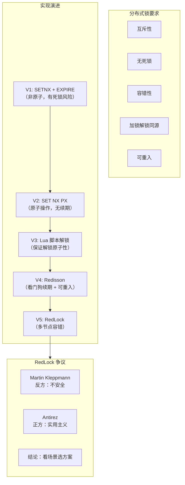

# 分布式锁

## 概述

分布式锁是分布式系统中协调多个节点对共享资源互斥访问的核心机制。Redis 是实现分布式锁最流行的方案，从简单的 `SET NX EX` 到 RedLock 算法再到 Redisson 的工业级实现，这条演进路径是高级工程师面试中必问的经典话题。本章将从原理到实践，完整呈现分布式锁的设计演进、安全争议和生产落地。

---

## 一、知识图谱



---

## 二、基础到进阶学习路线

- **阶段一：基础入门** -- 掌握 `SET key value NX EX seconds` 原子加锁，理解为什么 `SETNX` + `EXPIRE` 是非原子操作以及会导致的死锁问题
- **阶段二：原理深入** -- 理解 Lua 脚本解锁的原子性保证，掌握 Redisson 的看门狗续期机制、可重入锁的实现原理，理解 RedLock 算法在多主节点下的容错设计
- **阶段三：实战优化** -- 理解 Martin Kleppmann 对 RedLock 的批判，能够根据业务场景（强一致性 vs 效率优先）选择合适的分布式锁方案，处理锁超时、主从切换等边界情况

---

## 三、核心知识详解

### 3.1 分布式锁需要满足的条件

一个合格的分布式锁必须满足以下条件：

| 条件 | 说明 | 违反后果 |
|------|------|----------|
| **互斥性** | 任意时刻只有一个客户端持有锁 | 多个客户端同时操作共享资源，数据错乱 |
| **无死锁** | 即使持有锁的客户端崩溃，锁也必须能被释放 | 资源永远被锁定，系统不可用 |
| **容错性** | 只要大部分 Redis 节点存活，锁服务就可用 | 单点故障导致锁服务不可用 |
| **加锁解锁同源** | 只能由持有锁的客户端释放锁 | 客户端 A 误删客户端 B 的锁 |
| **可重入**（可选）| 同一客户端可多次获取同一把锁 | 递归调用或嵌套业务逻辑死锁 |

### 3.2 实现演进：从 SETNX 到 RedLock

#### V1：SETNX + EXPIRE（错误方案）

```redis
-- 错误示范：两步操作不是原子的
SETNX lock:order:1001 "client-uuid-001"
EXPIRE lock:order:1001 10
```

::: danger 致命缺陷
如果 `SETNX` 成功后 Redis 崩溃或网络中断，`EXPIRE` 未执行，锁永远不会释放，导致死锁。
:::

#### V2：SET NX PX（正确的基础方案）

```redis
-- 正确方案：原子操作
SET lock:order:1001 "client-uuid-001" NX PX 10000
-- NX: 仅当 Key 不存在时设置
-- PX 10000: 过期时间 10000 毫秒
```

```java
// Java 实现
public boolean tryLock(String lockKey, String clientId, long expireMs) {
    String result = jedis.set(lockKey, clientId, 
        SetParams.setParams().nx().px(expireMs));
    return "OK".equals(result);
}
```

#### V3：Lua 脚本保证解锁原子性

```
解锁需要两步操作：
  1. GET lock:order:1001  → 检查值是否等于 client-uuid-001
  2. DEL lock:order:1001  → 如果匹配则删除

如果这两步不是原子操作，可能出现：
  客户端 A 检查通过 → 锁刚好过期 → 客户端 B 获取锁
  → 客户端 A 执行 DEL → 误删了客户端 B 的锁
```

```redis
-- Lua 脚本保证原子解锁
EVAL "
    if redis.call('GET', KEYS[1]) == ARGV[1] then
        return redis.call('DEL', KEYS[1])
    else
        return 0
    end
" 1 lock:order:1001 "client-uuid-001"
```

```java
// Java 实现
private static final String UNLOCK_SCRIPT =
    "if redis.call('GET', KEYS[1]) == ARGV[1] then " +
    "    return redis.call('DEL', KEYS[1]) " +
    "else " +
    "    return 0 " +
    "end";

public boolean unlock(String lockKey, String clientId) {
    Object result = jedis.eval(UNLOCK_SCRIPT,
        Collections.singletonList(lockKey),
        Collections.singletonList(clientId));
    return "1".equals(result.toString());
}
```

#### 锁超时问题：业务执行时间 > 锁过期时间

```
问题场景：

时间轴：
  0s:  客户端 A 获取锁，锁过期时间 10s
  8s:  客户端 A 业务还在执行（GC 停顿 / 网络延迟）
  10s: 锁自动过期释放
  11s: 客户端 B 获取锁成功
  12s: 客户端 A 业务执行完毕，解锁（误删了 B 的锁！）
        → 如果用 Lua 脚本解锁，A 无法删除 B 的锁（值不匹配）
        → 但 B 持有锁期间，A 和 B 同时操作共享资源 → 数据错乱

解决方案：
  1. 锁续期（看门狗）：定期检查并延长锁的过期时间
  2. 锁标识：即使用 Lua 脚本防止误删，也无法解决并发安全问题
```

#### V4：Redisson（工业级实现）

Redisson 是 Redis 官方推荐的 Java 客户端，提供了完整的分布式锁实现。

```
Redisson 分布式锁架构：

┌─────────────────────────────────────────────────────┐
│                   RedissonLock                       │
├─────────────────────────────────────────────────────┤
│                                                      │
│  ┌─────────────┐     ┌──────────────────────────┐   │
│  │  lock()      │     │  Watchdog 看门狗           │   │
│  │  tryLock()   │     │  ┌──────────────────────┐ │   │
│  │  unlock()    │     │  │ 每 10 秒续期一次       │ │   │
│  └─────────────┘     │  │ 续期到 30 秒           │ │   │
│                       │  │ 锁释放时自动取消续期    │ │   │
│  ┌─────────────┐     │  └──────────────────────┘ │   │
│  │ 可重入计数   │     └──────────────────────────┘   │
│  │ (Redis Hash) │                                     │
│  └─────────────┘     ┌──────────────────────────┐   │
│                       │  Pub/Sub 锁释放通知        │   │
│                       │  等待锁的客户端订阅通知     │   │
│                       └──────────────────────────┘   │
└─────────────────────────────────────────────────────┘
```

**Redisson 加锁的底层数据结构**：

```
Redisson 使用 Redis Hash 存储锁信息：

Key: lock:order:1001
Hash:
  field: client-uuid-001:thread-1
  value: 1（重入次数）

第一次加锁：
  HSET lock:order:1001 "client-uuid-001:thread-1" 1
  PEXPIRE lock:order:1001 30000  ← 默认 30 秒

重入加锁：
  HINCRBY lock:order:1001 "client-uuid-001:thread-1" 1
  → value 变为 2

解锁（重入减 1）：
  HINCRBY lock:order:1001 "client-uuid-001:thread-1" -1
  → value 变为 1（还有一层锁未释放）

完全解锁（value 变为 0）：
  DEL lock:order:1001
```

**看门狗（Watchdog）机制**：

```
看门狗工作原理：

1. 加锁成功后，启动一个后台定时任务（Netty Timer）
2. 每 lockWatchdogTimeout/3 = 10 秒执行一次续期
3. 续期脚本（Lua）：
   if redis.call('HEXISTS', KEYS[1], ARGV[2]) == 1 then
       return redis.call('PEXPIRE', KEYS[1], ARGV[1])
   end
   → 将锁过期时间重置为 30 秒

4. 解锁时取消定时任务

关键设计：
  - 只有未指定 leaseTime 时才启用看门狗
  - 如果指定了 leaseTime，锁在到期后自动释放，不续期
  - 看门狗续期是异步的，不会阻塞业务线程
```

**Redisson 公平锁与读写锁**：

```java
// 公平锁：按请求顺序排队获取锁
RLock fairLock = redisson.getFairLock("lock:order:1001");
fairLock.lock();

// 读写锁：允许多个读锁同时持有，写锁独占
RReadWriteLock rwLock = redisson.getReadWriteLock("lock:order:1001");
// 读锁
RLock readLock = rwLock.readLock();
readLock.lock();
// 写锁
RLock writeLock = rwLock.writeLock();
writeLock.lock();
```

#### V5：RedLock 算法

RedLock 是 Redis 作者 Antirez 提出的多节点分布式锁算法，解决单节点 Redis 故障导致的锁安全性问题。

```
RedLock 算法流程（N 个独立 Redis 节点，通常 N=5）：

1. 获取当前时间戳 t1（毫秒）

2. 依次向 N 个 Redis 节点尝试获取锁：
   SET lock:resource "client-uuid" NX PX 10000
   - 设置超时时间远小于锁过期时间（如 5~50ms）
   - 如果某个节点不可用，立即尝试下一个

3. 计算获取锁的总耗时：
   elapsed = t2 - t1（t2 为获取完成后时间戳）

4. 判断是否成功：
   - 在 N/2 + 1 个节点（即大多数）上获取锁成功
   - 且 elapsed < lockValidityTime（锁有效时间）
   → 认为获取锁成功

5. 如果获取成功，锁的实际有效时间：
   actualValidity = lockValidityTime - elapsed

6. 如果获取失败（未达到大多数或超时）：
   向所有节点发送解锁命令（即使未成功获取锁的节点）
```

```
RedLock 为什么需要 N/2 + 1 个节点成功？

  假设 N=5，客户端 A 在 3 个节点上获取锁成功：
  ┌───┐  ┌───┐  ┌───┐  ┌───┐  ┌───┐
  │ A │  │ A │  │ A │  │   │  │   │
  └───┘  └───┘  └───┘  └───┘  └───┘

  此时客户端 B 尝试获取锁，最多只能在 2 个节点上成功：
  ┌───┐  ┌───┐  ┌───┐  ┌───┐  ┌───┐
  │ A │  │ A │  │ A │  │ B │  │ B │
  └───┘  └───┘  └───┘  └───┘  └───┘

  2 < 3 (N/2+1)，B 获取锁失败 → 保证互斥性
```

### 3.3 RedLock 争议

Martin Kleppmann（《设计数据密集型应用》作者）在 2016 年发表文章，对 RedLock 的安全性提出质疑。

| 争议点 | Martin Kleppmann（反方） | Antirez（正方） |
|--------|--------------------------|-----------------|
| **时钟跳跃** | 系统时钟跳跃（NTP 调整）会导致锁过期时间计算错误 | 实践中时钟跳跃很少发生，现代系统用单调时钟 |
| **GC 停顿** | 客户端 GC 停顿超时后，锁已过期，但客户端还不知道 | 使用 fencing token（递增令牌）可解决 |
| **本质问题** | Redis 不具备强一致性，不应作为分布式锁的唯一依赖 | 分布式锁是效率工具，不是正确性工具 |
| **替代方案** | ZooKeeper / etcd 的 CP 系统更适合需要强一致性的锁 | ZooKeeper 性能差、部署复杂，不适合高并发场景 |

::: info 结论
**RedLock 不是银弹，需要根据场景选择**：

- **效率优先**（避免重复计算、控制并发任务）：Redis 单节点 + Redisson 足够
- **正确性优先**（库存扣减、金融交易）：推荐 ZooKeeper / etcd，或使用数据库乐观锁 + Redis 作为性能优化
- **折衷方案**：Redis 分布式锁 + fencing token + 业务层校验
:::

### 3.4 锁释放异常处理

```
常见异常场景与处理：

1. 锁过期但业务未完成
   → 看门狗自动续期（Redisson 默认方案）
   → 或设置足够长的锁过期时间（保守策略）

2. 主从切换导致锁丢失
   ┌────────────────────────────────────────────────┐
   │ 客户端 A 在 Master 上获取锁                      │
   │ Master 异步复制到 Slave（还未完成）              │
   │ Master 宕机                                     │
   │ Slave 提升为新 Master（锁数据丢失）              │
   │ 客户端 B 在新 Master 上获取同一把锁 → 成功！      │
   │ → A 和 B 同时持有锁 → 互斥性被破坏               │
   └────────────────────────────────────────────────┘
   
   解决方案：
   - 使用 RedLock（多个独立 Master）
   - 使用 Redis Cluster 的 WAIT 命令强制同步复制
   - 业务层增加版本号 / fencing token 校验

3. 锁被误删
   → Lua 脚本验证 value（clientId）后再删除
   → 每个客户端使用唯一标识（UUID + 线程 ID）

4. 网络分区导致锁状态不一致
   → 设置合理的锁超时时间
   → 客户端获取锁后校验锁的有效性
```

---

## 四、经典应用场景与解决方案

### 场景：高并发秒杀库存扣减

**问题背景**

电商秒杀场景中，库存扣减是典型的分布式锁应用场景。同一商品可能被数万用户同时抢购，必须保证库存扣减的原子性和一致性。

**方案设计**

```
架构设计：

┌──────────────────────────────────────────────────────┐
│                   秒杀请求                             │
└───────────────────┬──────────────────────────────────┘
                    │
                    v
    ┌───────────────────────────────┐
    │      Nginx 负载均衡            │
    └───────────────┬───────────────┘
                    │
        ┌───────────┼───────────┐
        v           v           v
    ┌─────────┐ ┌─────────┐ ┌─────────┐
    │ 订单服务 │ │ 订单服务 │ │ 订单服务 │
    │ 实例 A  │ │ 实例 B  │ │ 实例 C  │
    └────┬────┘ └────┬────┘ └────┬────┘
         │           │           │
         └───────────┼───────────┘
                     │
                     v
         ┌───────────────────────┐
         │   Redis 分布式锁       │
         │   lock:seckill:{skuId} │
         └───────────┬───────────┘
                     │
                     v
         ┌───────────────────────┐
         │   Redis 库存缓存       │
         │   stock:{skuId}        │
         └───────────┬───────────┘
                     │
                     v
         ┌───────────────────────┐
         │   MySQL 库存持久化     │
         └───────────────────────┘
```

**实现代码**

```java
@Service
public class SeckillService {
    
    @Autowired
    private RedissonClient redissonClient;
    
    @Autowired
    private StringRedisTemplate redisTemplate;
    
    /**
     * 秒杀扣减库存 -- 使用 Redisson 分布式锁
     */
    public Result seckill(String skuId, String userId) {
        String lockKey = "lock:seckill:" + skuId;
        RLock lock = redissonClient.getLock(lockKey);
        
        try {
            // 尝试获取锁，最多等待 3 秒，锁 10 秒后自动释放
            boolean acquired = lock.tryLock(3, 10, TimeUnit.SECONDS);
            if (!acquired) {
                return Result.fail("系统繁忙，请稍后重试");
            }
            
            // 扣减库存
            String stockKey = "stock:" + skuId;
            Long stock = redisTemplate.opsForValue().decrement(stockKey);
            
            if (stock == null || stock < 0) {
                // 库存不足，恢复
                redisTemplate.opsForValue().increment(stockKey);
                return Result.fail("库存不足");
            }
            
            // 异步写入 MySQL（保证最终一致性）
            asyncDeductStock(skuId, userId);
            
            return Result.success("抢购成功");
            
        } catch (InterruptedException e) {
            Thread.currentThread().interrupt();
            return Result.fail("系统异常");
        } finally {
            // 确保释放锁（Redisson 自动处理同源释放）
            if (lock.isHeldByCurrentThread()) {
                lock.unlock();
            }
        }
    }
}
```

**关键优化要点**

1. **库存预热**：将 MySQL 库存加载到 Redis，减少数据库压力
2. **锁粒度**：按 SKU 加锁（`lock:seckill:{skuId}`），避免全局锁影响并发
3. **超时兜底**：锁超时后自动释放，防止死锁；看门狗机制防止业务未完成时锁过期
4. **异步写库**：Redis 扣减成功后异步写 MySQL，保证最终一致性
5. **限流保护**：在 Nginx 或网关层做令牌桶限流，减少 Redis 压力

::: tip 为什么不用 RedLock？
秒杀场景对延迟敏感，RedLock 需要向多个节点获取锁，延迟较高。使用单节点 Redis + Redisson 看门狗 + 数据库乐观锁做最终一致性保障，是更实际的选择。
:::

---

## 五、高频面试题

### Q1: Redis 分布式锁的实现演进过程是怎样的？

::: details 答案

**V1：SETNX + EXPIRE（错误方案）**
```redis
SETNX lock:key "client-id"
EXPIRE lock:key 10
```
问题：两步操作不是原子的。如果 SETNX 成功后服务崩溃，EXPIRE 未执行，锁永远不会释放（死锁）。

**V2：SET NX PX（原子操作）**
```redis
SET lock:key "client-id" NX PX 10000
```
Redis 2.6.12 起，SET 命令支持 NX 和 PX 参数，一条命令完成加锁和设置过期时间。解决了死锁问题，但还有两个缺陷：
- 解锁需要验证持有者（防止误删）
- 无法处理业务执行时间 > 锁过期时间的情况

**V3：Lua 脚本解锁（原子解锁）**
```redis
if redis.call('GET', KEYS[1]) == ARGV[1] then
    return redis.call('DEL', KEYS[1])
else
    return 0
end
```
保证验证和删除是原子操作，防止客户端 A 误删客户端 B 的锁。但锁超时后业务未完成的问题仍未解决。

**V4：Redisson（看门狗 + 可重入 + 公平锁）**
- 看门狗机制：后台线程每 10 秒续期，锁过期时间重置为 30 秒
- 可重入锁：基于 Redis Hash 存储重入计数
- 公平锁：按请求顺序排队
- 自动释放：客户端断开连接时，锁自动释放

**V5：RedLock（多节点容错）**
N 个独立 Redis 主节点（N=5），在 N/2+1 个节点上获取锁成功才算成功。解决单节点故障导致的锁丢失问题。但 RedLock 存在争议（时钟跳跃、GC 停顿等），不是银弹。
:::

### Q2: RedLock 算法有什么争议？Martin Kleppmann 为什么认为它不安全？

::: details 答案

Martin Kleppmann 在 2016 年的文章《How to do distributed locking》中对 RedLock 提出了以下质疑：

**核心论点：RedLock 依赖于不安全的假设**

1. **时钟跳跃风险**：RedLock 依赖过期时间保证安全性，如果系统时钟发生跳跃（NTP 校时），可能导致锁提前过期。Kleppmann 认为在分布式系统中不能假设时钟是可靠的，而 RedLock 没有使用单调时钟。

2. **GC 停顿问题**：客户端获取锁后，可能因为 Full GC 停顿数秒。当 GC 结束后，锁已经过期并被其他客户端获取，但该客户端并不知道，仍然认为自己持有锁。这种情况下互斥性被破坏。

3. **Fencing Token 的必要性**：Kleppmann 认为任何分布式锁方案都应该配合 fencing token（递增令牌）使用。资源服务器在收到请求时检查 fencing token，拒绝旧 token 的请求。RedLock 本身没有提供 fencing token 机制。

**Antirez 的反驳**：

1. 时钟跳跃在实践中很少发生，且现代系统通常使用单调时钟
2. GC 停顿是所有分布式锁方案的共同问题，不是 RedLock 特有的
3. 分布式锁分为两种用途：效率优化（避免重复工作）和正确性保证（保证数据一致性）。RedLock 适合前者，对于后者需要配合 fencing token 或其他方案

**结论**：
- RedLock 不是数学上完美的分布式共识算法
- 但作为实用工程方案，在大多数场景下足够可靠
- 对于需要强一致性的场景（如金融交易），推荐 ZooKeeper 或 etcd 的 CP 方案
- 对于高并发、效率优先的场景（如避免重复计算），RedLock 是合理的选择
:::

### Q3: Redisson 的看门狗（Watchdog）机制是如何工作的？

::: details 答案

**看门狗解决的问题**：锁的过期时间无法精确预估。设置太短，业务未完成锁就过期了；设置太长，客户端崩溃后锁长时间不释放。

**工作原理**：

1. **加锁时启动**：当调用 `lock()` 方法（不指定 `leaseTime`）时，Redisson 在加锁成功后启动一个后台定时任务

2. **定时续期**：
   - 默认续期间隔：`lockWatchdogTimeout / 3 = 10 秒`（`lockWatchdogTimeout` 默认 30 秒）
   - 每次续期将锁过期时间重置为 `lockWatchdogTimeout`（30 秒）
   - 续期使用 Lua 脚本：
     ```lua
     if redis.call('HEXISTS', KEYS[1], ARGV[2]) == 1 then
         return redis.call('PEXPIRE', KEYS[1], ARGV[1])
     end
     return 0
     ```

3. **可重入锁支持**：Redisson 使用 Redis Hash 存储锁信息，`field` 为 `clientId:threadId`，`value` 为重入次数。续期时检查对应的 field 是否存在。

4. **解锁时取消**：调用 `unlock()` 后，取消定时任务（Netty `Timeout.cancel()`），停止续期。

5. **不指定 leaseTime 才启用**：如果 `tryLock(waitTime, leaseTime, unit)` 指定了 `leaseTime`，锁在到期后自动释放，不会续期。

**关键设计考量**：
- 续期操作是异步的，不阻塞业务线程
- 如果 Redis 连接断开，续期失败，锁将在 30 秒后自动释放（安全兜底）
- 看门狗使用 Netty 的 `HashedWheelTimer`，单线程处理所有锁的续期任务，效率高

**配置参数**：
```java
Config config = new Config();
config.setLockWatchdogTimeout(30000); // 默认 30 秒
```
:::

### Q4: 锁超时了业务还没执行完怎么办？如何优雅处理？

::: details 答案

锁超时导致的问题可以分为两类：**锁被误删**和**并发安全问题**。

**场景分析**：
```
客户端 A 获取锁，锁过期时间 10s
8s 时 A 的业务还在执行（GC / 慢查询）
10s 锁自动过期，客户端 B 获取锁成功
12s 客户端 A 执行完毕，尝试解锁
```

**问题一：A 误删 B 的锁**

解决方案：Lua 脚本解锁时验证 value（clientId）。
```lua
if redis.call('GET', KEYS[1]) == ARGV[1] then
    return redis.call('DEL', KEYS[1])
end
```
A 的 clientId 与 B 的不匹配，无法删除 B 的锁。但问题二仍然存在。

**问题二：A 和 B 同时操作共享资源**

解决方案：

1. **看门狗自动续期（推荐）**：Redisson 的 Watchdog 机制，每 10 秒自动续期到 30 秒。只要业务线程存活，锁就不会过期。这是最优雅的解决方案。

2. **设置足够长的过期时间**：保守估计业务最大执行时间，设置 2~3 倍的过期时间。缺点：如果客户端崩溃，锁长时间不释放。

3. **Fencing Token（递增令牌）**：每次获取锁时返回一个递增的 token，操作共享资源时校验 token 是否最新。如果 token 过期，拒绝操作。
   ```
   客户端 A 获取锁 → token = 1
   客户端 A GC 停顿，锁过期
   客户端 B 获取锁 → token = 2
   客户端 A GC 恢复，用 token=1 操作资源 → 存储系统拒绝（token < 2）
   ```

4. **业务层幂等性**：共享资源操作本身具有幂等性，即使并发执行也不会产生错误结果。例如，使用数据库的乐观锁（version 字段）。

**最佳实践**：
- 优先使用 Redisson 看门狗（适合大多数场景）
- 对锁持有时间设置合理的预估，避免在锁内执行耗时操作（如 RPC 调用）
- 在锁内只做最核心的互斥操作，其他逻辑移到锁外
:::

### Q5: 主从切换时 Redis 分布式锁为什么会丢失？如何解决？

::: details 答案

**问题场景**：

```
时间轴：
T1: 客户端 A 在 Master 上成功获取锁 lock:order:1001
T2: Master 将写操作异步复制给 Slave（还未到达 Slave）
T3: Master 宕机
T4: Sentinel 将 Slave 提升为新 Master
T5: 客户端 B 向新 Master 请求获取锁 lock:order:1001 → 成功！
    （因为 Slave 上没有 A 的锁数据）

结果：A 和 B 同时持有锁，互斥性被破坏
```

**根本原因**：Redis 主从复制是**异步**的，Master 上的写操作不保证已经同步到 Slave。

**解决方案**：

1. **RedLock 算法**：使用多个独立的 Redis Master 节点（非主从结构），在大多数节点上获取锁成功才算成功。即使一个 Master 宕机，其他节点不受影响。
   ```
   配置：5 个独立 Redis 实例（无主从关系）
   获取锁：至少在 3 个实例上成功
   效果：单实例故障不影响整体
   ```

2. **WAIT 命令强制同步**（Redis 3.0+）：
   ```redis
   SET lock:order:1001 "client-id" NX PX 10000
   WAIT 1 1000  -- 等待至少 1 个 Slave 确认，超时 1000ms
   ```
   缺点：增加延迟（等待 Slave 确认），降低吞吐量。

3. **使用 CP 系统**：ZooKeeper / etcd 基于 Raft/ZAB 共识协议，写操作需要多数节点确认，天然保证一致性。
   - ZooKeeper 临时顺序节点 + Watch 机制，实现分布式锁
   - 缺点：性能远低于 Redis，不适合高并发锁场景

4. **业务层兜底**：
   - 使用数据库乐观锁（version 字段）作为最终一致性保障
   - Redis 分布式锁作为性能优化（减少数据库压力），不作为唯一依赖

**选择建议**：
- 大部分场景：Redis 单节点 + Redisson 足够（主从切换概率低，影响可控）
- 对一致性要求极高的场景：ZooKeeper / etcd 或数据库乐观锁
- 折衷方案：RedLock（有争议，但比单节点更安全）
:::

### Q6: 分布式锁的可重入性是如何实现的？公平锁和读写锁呢？

::: details 答案

**可重入锁实现原理**（Redisson）：

使用 Redis Hash 数据结构存储锁信息：
```
Key: lock:order:1001
Hash:
  field: "client-uuid:thread-1"
  value: 重入次数
```

**加锁逻辑**（Lua 脚本）：
```lua
-- 如果锁不存在，直接获取
if redis.call('EXISTS', KEYS[1]) == 0 then
    redis.call('HINCRBY', KEYS[1], ARGV[2], 1)
    redis.call('PEXPIRE', KEYS[1], ARGV[1])
    return nil
end
-- 如果锁存在且是当前线程持有，重入计数 +1
if redis.call('HEXISTS', KEYS[1], ARGV[2]) == 1 then
    redis.call('HINCRBY', KEYS[1], ARGV[2], 1)
    redis.call('PEXPIRE', KEYS[1], ARGV[1])
    return nil
end
-- 锁被其他线程持有，返回锁剩余时间
return redis.call('PTTL', KEYS[1])
```

**解锁逻辑**：
```lua
-- 重入计数 -1
local counter = redis.call('HINCRBY', KEYS[1], ARGV[2], -1)
if counter > 0 then
    -- 还有重入层，续期但不删除
    redis.call('PEXPIRE', KEYS[1], ARGV[1])
    return 0
else
    -- 完全释放
    redis.call('DEL', KEYS[1])
    -- 发布释放通知（通知等待的客户端）
    redis.call('PUBLISH', KEYS[2], ARGV[3])
    return 1
end
```

**公平锁实现**：
- 使用 Redis 的 List + 队列模式
- 等待的客户端在 Redis List 中排队
- 当前持有者释放锁时，通知队列头部的客户端获取锁
- 保证按请求顺序获取锁（FIFO）

**读写锁实现**：
- 读锁：多个客户端可同时持有（共享），使用 Hash 记录读锁持有者和数量
- 写锁：独占，与读锁和其他写锁互斥
- 读锁释放时，如果所有读锁都释放了，通知等待的写锁
- 写锁释放时，优先通知等待的写锁，再通知等待的读锁（防止写饥饿）
:::

---

## 六、选型指南

### 适用场景

| 场景 | 推荐方案 | 理由 |
|------|----------|------|
| 避免重复计算（定时任务） | Redis 单节点 + Redisson | 效率优先，偶尔重复执行影响不大 |
| 秒杀库存扣减 | Redis + Redisson + 数据库乐观锁 | Redis 做性能优化，数据库做最终一致性 |
| 分布式任务调度 | Redisson 公平锁 | 按顺序执行，避免竞争 |
| 高并发限流 | Redis 单节点 + 简单 SET NX | 不需要续期，锁持有时间短 |
| 金融交易 | ZooKeeper / etcd | 强一致性要求，Redis 不合适 |

### 不适用场景

- 需要强一致性保障的互斥操作（如会计记账）
- 锁持有时间不确定且可能很长（不适合 RedLock）
- 系统对延迟极度敏感且 RedLock 多节点耗时不可接受

### 配置建议

```java
// Redisson 推荐配置
Config config = new Config();
config.useSingleServer()
    .setAddress("redis://127.0.0.1:6379")
    .setConnectionPoolSize(64)
    .setConnectionMinimumIdleSize(10)
    .setTimeout(3000);           // 命令超时 3s
config.setLockWatchdogTimeout(30000); // 看门狗超时 30s

// 获取锁的推荐方式
RLock lock = redissonClient.getLock("lock:business:key");
// tryLock(等待时间, 锁过期时间, 时间单位)
// 不指定 leaseTime 时启用看门狗
boolean acquired = lock.tryLock(3, TimeUnit.SECONDS);
```

---

## 相关文档

- [Redis 核心原理](./index)
- [高级数据结构详解](./data-structure)
- [缓存策略与一致性](./cache-strategy)
- [集群方案](./cluster)