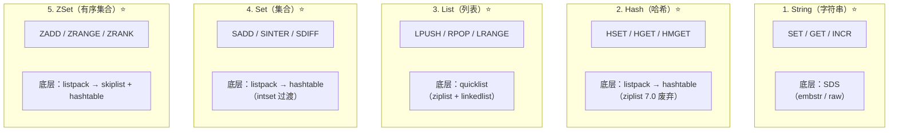
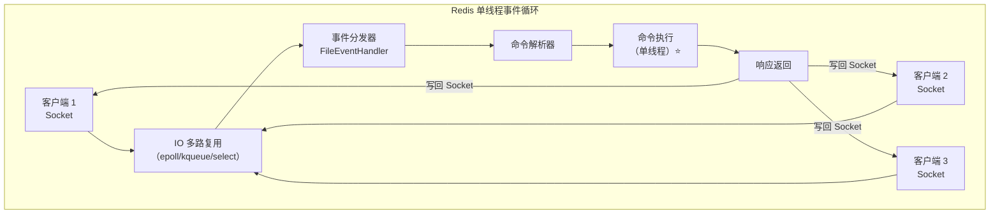

# Redis 核心原理

## 概述

Redis（Remote Dictionary Server）是业界最流行的内存数据库，面试中与 MySQL 并列为必问项。本章聚焦三个维度：**8 种数据类型**（5 种基础 + 3 种高级）、**单线程模型**（为什么快）、**使用场景**（知道数据类型还要知道怎么用）。

::: tip 学习目标
能说出每种数据类型的底层编码结构，理解单线程 IO 多路复用模型，针对业务场景选择合适的 Redis 数据类型并设计合理的 Key 结构。
:::

---

## 一、5 种基本数据类型

⭐ **先把 5 种基本类型吃透，面试中 80% 的问题都围绕它们展开。**



### 1.1 String（字符串）

⭐ **最基础的类型，也是分布式锁、计数器、缓存对象的基础。**

```
编码结构：SDS（Simple Dynamic String）

传统 C 字符串的问题：
  获取长度 O(n) → SDS 维护 len 字段 → O(1)
  缓冲区溢出    → SDS 自动扩容
  二进制不安全  → SDS 用 len 界定长度，可存任意二进制

编码选择：
  长度 ≤ 44 字节 → embstr 编码（一次内存分配，只读）
  长度 > 44 字节 → raw 编码（两次内存分配，可修改）
```

| 命令 | 说明 | 时间复杂度 |
|------|------|------------|
| `SET key value [EX seconds]` | 设置值，可带过期时间 | O(1) |
| `GET key` | 获取值 | O(1) |
| `INCR key` / `DECR key` | 原子增减 | O(1) |
| `SETNX key value` | 不存在才设置（分布式锁基础） | O(1) |
| `MGET k1 k2 ...` | 批量获取（减少 RTT） | O(N) |
| `GETRANGE key start end` | 截取子串 | O(N) |

```redis
-- 基础读写
SET user:1001:name "张三" EX 3600
GET user:1001:name

-- ⭐ 分布式锁（SET NX EX 原子操作）
SET lock:order:1001 "uuid-xxxx" NX EX 10

-- 计数器（文章阅读量）
INCR article:998:views

-- 批量获取（减少网络往返）
MGET user:1001:name user:1002:name user:1003:name
```

::: warning 面试高频问题
**Q: `SETNX` + `EXPIRE` 为什么不能分开写？**

A: 不是原子操作。如果 `SETNX` 成功后服务宕机，`EXPIRE` 未执行，锁永远不会释放 → 死锁。必须用 `SET key value NX EX seconds`。
:::

### 1.2 Hash（哈希）

⭐ **适合存储"对象"，比 String 序列化 JSON 更节省内存。**

| 命令 | 说明 | 时间复杂度 |
|------|------|------------ |
| `HSET key field value` | 设置字段 | O(1) |
| `HGET key field` | 获取字段 | O(1) |
| `HGETALL key` | 获取所有字段 | O(N) |
| `HMGET key f1 f2 ...` | 批量获取 | O(N) |
| `HINCRBY key field N` | 原子增减 | O(1) |

```redis
-- 用户信息（用 Hash 存对象，比 JSON String 更灵活）
HSET user:1001 name "张三" age 25 city "北京"
HGET user:1001 name
HMGET user:1001 name age city

-- 购物车（用户ID → {商品ID: 数量}）
HSET cart:1001 sku:998 2 sku:997 1
HINCRBY cart:1001 sku:998 1   -- 数量 +1
```

```
编码演进：
  字段少/值小 → listpack（紧凑连续内存，节省空间）
  超过阈值    → hashtable（标准哈希表，O(1) 查找）

阈值配置：
  hash-max-listpack-entries 512  （字段数上限）
  hash-max-listpack-value 64     （单字段值长度上限）
```

### 1.3 List（列表）

⭐ **底层是 quicklist，兼顾了内存效率和操作性能。**

```
quicklist 结构：

  quicklist
      │
      ├── quicklistNode → [ziplist] → 元素1..元素N
      ├── quicklistNode → [ziplist] → 元素N+1..元素2N
      ├── quicklistNode → [ziplist] → ...
      └── quicklistNode → [ziplist] → ...

每个节点存一个压缩列表（listpack/ziplist），双向链表串联：
  - 头/尾操作 O(1)
  - 中间节点按需解压（懒惰解压）
```

| 命令 | 说明 | 时间复杂度 |
|------|------|------------|
| `LPUSH / RPUSH key val` | 左/右入队 | O(1) |
| `LPOP / RPOP key` | 左/右出队 | O(1) |
| `LRANGE key start end` | 范围获取 | O(S+N) |
| `LTRIM key start end` | 裁剪列表 | O(N) |
| `BLPOP key timeout` | 阻塞出队（消息队列核心） | O(1) |

```redis
-- 最新评论列表（LPUSH + LTRIM 保持固定长度）
LPUSH article:998:comments "{user:'张三',text:'写得好'}"
LPUSH article:998:comments "{user:'李四',text:'学习了'}"
LTRIM article:998:comments 0 99    -- 只保留最新 100 条
LRANGE article:998:comments 0 9    -- 分页查询第 1 页

-- ⭐ 简单消息队列（BLPOP 阻塞等待）
-- 生产者
LPUSH task:queue "task_data_1"
-- 消费者（阻塞 5 秒等待消息）
BLPOP task:queue 5
```

::: warning 慎用场景
List 做消息队列没有 ACK 机制，消费者崩溃消息丢失。生产环境消息队列建议用 Redis Stream 或 RabbitMQ / Kafka。
:::

### 1.4 Set（集合）

⭐ **无序、不重复，核心价值是 O(1) 的交并差集运算。**

| 命令 | 说明 | 时间复杂度 |
|------|------|------------|
| `SADD key member` | 添加成员 | O(1) |
| `SISMEMBER key member` | 判断成员是否存在 | O(1) |
| `SINTER k1 k2` | 交集 | O(N*M) |
| `SUNION k1 k2` | 并集 | O(N) |
| `SDIFF k1 k2` | 差集 | O(N) |
| `SCARD key` | 集合大小 | O(1) |
| `SRANDMEMBER key N` | 随机取 N 个 | O(N) |
| `SPOP key N` | 随机弹出 N 个（抽奖） | O(N) |

```redis
-- 点赞用户集合
SADD article:998:likes user:1001 user:1002 user:1003
SISMEMBER article:998:likes user:1001  -- 检查是否点过赞

-- ⭐ 共同好友（交集）
SINTER user:1001:friends user:1002:friends

-- 可能认识的人（差集：我的好友有，你的好友没有）
SDIFF user:1001:friends user:1002:friends

-- ⭐ 抽奖（随机弹出 N 个）
SPOP lottery:pool 3
```

### 1.5 ZSet（有序集合）

⭐ **ZSet 是 Redis 的杀手锏数据结构，排行榜、延迟队列、热搜榜都靠它。**

```
⭐ 底层结构：skiplist（跳表）+ hashtable（字典）

为什么要同时用两种结构？
  - hashtable：按 member 查 score → O(1)
  - skiplist：按 score 范围查 member → O(logN)

如果只用 skiplist：查 score 需要遍历
如果只用 hashtable：范围查询需要全量排序
两者组合 → 各取所长
```

```
跳表结构示意（level = 3）：

Level 2:  1 ──────────────────> 9 ──────────────> nil
Level 1:  1 ─────> 5 ──────────> 9 ──> 12 ──────> nil
Level 0:  1 ─> 3 ─> 5 ─> 7 ─> 9 ─> 10 ─> 12 ─> nil

查找 score = 10：
  L2: 1→9→nil（10在9和nil之间，下降）
  L1: 9→12（10在9和12之间，下降）
  L0: 9→10 找到！

时间复杂度：O(logN)
空间复杂度：O(N)（每个节点平均 1/(1-p) ≈ 2 个指针，p=0.5）
```

| 命令 | 说明 | 时间复杂度 |
|------|------|------------|
| `ZADD key score member` | 添加 | O(logN) |
| `ZRANGE key s e [WITHSCORES]` | 按排名范围查 | O(logN+M) |
| `ZRANGEBYSCORE key min max` | 按分数范围查 | O(logN+M) |
| `ZRANK key member` | 查排名 | O(logN) |
| `ZSCORE key member` | 查分数 | O(1) |
| `ZINCRBY key N member` | 增减分数 | O(logN) |
| `ZREMRANGEBYRANK key s e` | 按排名删除 | O(logN+M) |

```redis
-- ⭐ 排行榜（文章热度榜）
ZADD hot:articles 1000 article:998 800 article:997 1200 article:996
-- 热度 Top 10（倒序取）
ZREVRANGE hot:articles 0 9 WITHSCORES
-- 给文章加热度
ZINCRBY hot:articles 1 article:998
-- 查某篇文章的排名
ZREVRANK hot:articles article:998

-- ⭐ 延迟队列（score = 执行时间戳）
ZADD delay:queue 1718000000 "send_sms:1001"
ZADD delay:queue 1718003600 "send_sms:1002"
-- 拿到期任务（score <= 当前时间戳）
ZRANGEBYSCORE delay:queue 0 1718001800 LIMIT 0 10
-- 消费后删除
ZREM delay:queue "send_sms:1001"
```

::: warning 面试追问
**Q: 为什么 ZSet 用跳表而不是红黑树？**

A: 跳表实现简单（无需复杂的旋转/染色），支持范围查询（`ZRANGEBYSCORE`），且查找/插入/删除都是 O(logN)。红黑树范围查询需要中序遍历，不如跳表高效。此外跳表天然支持并发（插入只影响相邻节点），Redis 虽单线程，但社区实现（如 Redis 集群）更友好。
:::

---

## 二、3 种高级数据类型

⭐ **高级数据类型数量不多，但每个都很精妙。**

### 2.1 Bitmap（位图）

⭐ **极致节省空间，1 亿用户签到只需 12MB。**

```
原理：
  底层就是一个 String，每个 bit 代表一个布尔值

  用户 ID = 1001，第 1001 位 = 1（已签到）

  offset:   0  1  2  ... 1001 1002 1003 ...
  bit:     0  0  0  ...   1    0    1  ...

空间计算：1 亿 bit / 8 / 1024 / 1024 ≈ 12 MB
```

```redis
-- ⭐ 签到系统
-- 用户 1001 在 2024-06-06 签到（第 157 天）
SETBIT checkin:20240606 1001 1

-- 查询用户 1001 是否签到
GETBIT checkin:20240606 1001   -- 返回 1（已签）

-- 统计当天签到人数
BITCOUNT checkin:20240606

-- ⭐ 连续签到天数（两个 Bitmap 做与运算）
BITOP AND result checkin:20240605 checkin:20240606
BITCOUNT result   -- 连续两天都签到的用户数
```

### 2.2 HyperLogLog（基数统计）

⭐ **统计 UV 的神器，12KB 内存即可统计 2^64 个不同元素。**

```
原理：
  基于概率算法，使用调和平均数估计基数
  标准误差：0.81%

空间占用：
  无论数据量多大，固定 12KB（2^14 个 6bit 寄存器）
```

```redis
-- ⭐ 页面 UV 统计
PFADD page:home:uv user:1001 user:1002 user:1003 ...
PFCOUNT page:home:uv   -- 返回去重后的 UV 数量

-- 合并多天 UV
PFMERGE page:home:uv:week page:home:uv:mon page:home:uv:tue ...
```

::: danger 使用注意事项
- `PFCOUNT` 返回的是**估算值**，有 0.81% 误差，不适用于精确计数（如财务审计）
- 不适合获取单元素是否存在的判断（用 Set 或 Bitmap）
- 数据量大时 `PFMERGE` 可能较慢
:::

### 2.3 GEO（地理位置）

⭐ **基于 ZSet 实现，用 GeoHash 编码经纬度为 score。**

```
GeoHash 编码原理：

  地球经度 [-180, 180]，纬度 [-90, 90]
  不断二分区间：
    0  → 左区间
    1  → 右区间
    
  经度 + 纬度交叉编码 → 一个长整数 → ZSet 的 score
  
  空间填充曲线：Z 字形，相邻区域 GeoHash 前缀相同
```

```redis
-- ⭐ 附近的人 / LBS 应用

-- 添加位置（商户、用户等）
GEOADD locations 116.404 39.915 "beijing" 121.473 31.230 "shanghai"
GEOADD locations 113.264 23.129 "guangzhou" 114.057 22.543 "shenzhen"

-- 获取经纬度
GEOPOS locations beijing

-- 计算两地距离
GEODIST locations beijing shanghai km   -- 返回约 1067km

-- ⭐ 查附近（北京方圆 2000km 内的城市）
GEORADIUS locations 116.404 39.915 2000 km WITHCOORD WITHDIST
GEORADIUS locations 116.404 39.915 2000 km ASC COUNT 5  -- 最近 5 个

-- ⭐ 以"上海"为中心，查附近 300km 内的城市
GEORADIUSBYMEMBER locations shanghai 300 km
```

---

## 三、单线程模型

⭐ **Redis 为什么用单线程还这么快？几乎是必问面试题。**



### 3.1 为什么快？

| 原因 | 说明 | 深度理解 |
|------|------|----------|
| ⭐ 纯内存操作 | 大部分请求在内存中完成 | 时间复杂度是关键，O(N) 命令要谨慎 |
| ⭐ 单线程无锁 | 无上下文切换、无竞争开销 | 实际上 4.0+ 有后台线程（异步删除、AOF 刷盘） |
| ⭐ IO 多路复用 | epoll 管理海量连接 | 一个线程监听多个 Socket，事件驱动 |
| 高效数据结构 | SDS、quicklist、skiplist | 针对 Redis 场景高度优化 |

### 3.2 单线程的瓶颈

```
CPU 瓶颈：
  - 单个 Redis 实例只能利用单核 CPU
  - 解决方案：多实例部署（不同端口）+ 集群方案

慢命令阻塞：
  - KEYS *（O(N)全量扫描）
  - HGETALL 大 Hash（O(N)返回所有字段）
  - DEL 大 Key（4.0 前同步删除会阻塞，4.0+ 用 UNLINK 异步删除）
```

::: danger 生产事故：KEYS *
```redis
-- ❌ 绝对禁止在生产环境执行
KEYS *

-- ✅ 使用 SCAN 游标迭代
SCAN 0 MATCH user:* COUNT 100
```

一次 `KEYS *` 可能阻塞数秒，期间所有请求排队等待，极端情况下触发故障转移。
:::

---

## 四、使用场景速查表

| 场景 | 数据类型 | Key 设计 | 核心命令 |
|------|----------|----------|----------|
| ⭐ 缓存对象 | String | `user:info:{uid}` | SETEX / GET |
| ⭐ 分布式锁 | String | `lock:order:{oid}` | SET NX EX |
| ⭐ 计数器/限流 | String | `counter:pv:{article_id}` | INCR / EXPIRE |
| ⭐ 用户信息 | Hash | `user:{uid}` | HMSET / HMGET |
| ⭐ 购物车 | Hash | `cart:{uid}` | HSET / HINCRBY |
| ⭐ 消息队列 | List | `queue:task` | LPUSH / BLPOP |
| ⭐ 最新列表 | List | `timeline:{uid}` | LPUSH / LTRIM |
| ⭐ 用户标签 | Set | `tags:{uid}` | SADD / SMEMBERS |
| ⭐ 共同好友 | Set | `friend:{uid}` | SINTER |
| ⭐ 抽奖 | Set | `lottery:pool` | SRANDMEMBER / SPOP |
| ⭐ 排行榜 | ZSet | `rank:score` | ZADD / ZREVRANGE |
| ⭐ 延迟队列 | ZSet | `delay:queue` | ZADD / ZRANGEBYSCORE |
| ⭐ 签到 | Bitmap | `checkin:{date}` | SETBIT / BITCOUNT |
| ⭐ UV 统计 | HyperLogLog | `uv:{page}:{date}` | PFADD / PFCOUNT |
| ⭐ 附近的人 | GEO | `geo:shops` | GEOADD / GEORADIUS |
| Session 共享 | String | `session:{token}` | SETEX / GET |

---

## 五、面试追问合集

### Q1: Redis 的数据"过期策略"是怎样的？

::: details 答案
**惰性删除 + 定期删除**，两者结合。

**惰性删除**：访问 Key 时检查是否过期，过期则删除。优点：CPU 友好；缺点：内存可能泄露（垃圾 Key 一直不访问）。

**定期删除**：每秒 10 次（`hz 10`），随机取一批 Key 检查并删除过期的。限制执行时长不超过 25ms。

```
定期删除流程：
1. 随机取 20 个 Key
2. 删除其中过期的
3. 如果过期比例 > 25%，继续步骤 1
4. 但如果执行时间 > 25ms，强制退出
```
:::

### Q2: Redis 的内存淘汰策略有哪些？

::: details 答案

| 策略 | 说明 |
|------|------|
| `noeviction` | 不淘汰，写请求报错（默认） |
| `allkeys-lru` | ⭐ 所有 Key 中 LRU 淘汰 |
| `volatile-lru` | 过期 Key 中 LRU 淘汰 |
| `allkeys-lfu` | ⭐ 所有 Key 中 LFU 淘汰（4.0+） |
| `volatile-lfu` | 过期 Key 中 LFU 淘汰（4.0+） |
| `allkeys-random` | 所有 Key 随机淘汰 |
| `volatile-random` | 过期 Key 随机淘汰 |
| `volatile-ttl` | 过期 Key 中 TTL 最短的淘汰 |

LRU vs LFU：
- LRU：最近最少使用（适合时效性强的热点数据）
- LFU：最不常使用（适合高频访问数据，防止偶发性冷数据挤掉热数据）
:::

### Q3: 大 Key 有什么危害？如何发现和处理？

::: details 答案

**危害**：
- 读取阻塞：单次操作耗时过长（如 `HGETALL` 返回百万条）
- 删除阻塞：`DEL` 大 Key 时阻塞主线程
- 迁移困难：集群迁移 / 主从同步耗时
- 内存倾斜：某些分片内存使用率过高

**发现方式**：
```bash
# Redis 自带的 BigKeys 扫描
redis-cli --bigkeys

# 分析 RDB 文件
rdb -c memory dump.rdb --bytes 10240 -f memory.csv
```

**处理方案**：
- `UNLINK`（4.0+）替代 `DEL`（异步删除，非阻塞）
- Hash 大 Key：按 field 拆分（`user:{uid}:info`）
- List 大 Key：按日期分片（`timeline:{uid}:{month}`）
- Set/ZSet 大 Key：按 hash tag 路由到不同分片
:::

---

## 六、生产实践建议

::: tip 黄金法则
1. **Key 命名规范**：`业务:模块:标识`（如 `order:detail:1001`），禁止无意义 Key
2. **必须设过期时间**：除少数持久化场景，所有 Key 加 TTL
3. **禁用危险命令**：`RENAME` 命令将 `KEYS / FLUSHALL / FLUSHDB` 改名
4. **Pipeline 批量操作**：减少网络 RTT（Round-Trip Time），但注意单次 Pipeline 不要过大
5. **连接池合理配置**：`maxTotal` = 业务峰值 QPS / 单 Redis 实例 QPS 极限 × 1.5
6. **慢查询监控**：`slowlog get 100`，关注超过 1ms 的命令
7. **内存规划**：预留 30% 内存给 fork 操作（bgsave / rewrite）
:::

---

## 相关面试题速记

```
Redis 为什么快？
  → 纯内存 + 单线程无锁 + IO 多路复用 + 高效数据结构

ZSet 底层是什么？
  → skiplist + hashtable（范围查 + 精确查）

Redis 怎么做分布式锁？
  → SET NX EX + Lua 解锁 / Redisson（续期 + 可重入）

缓存穿透/击穿/雪崩怎么解决？
  → 穿透：布隆过滤器 / 空值缓存
  → 击穿：互斥锁 / 永不过期
  → 雪崩：随机 TTL / 多级缓存 / 限流降级

Redis 持久化方式？
  → RDB（快照，bgsave fork 子进程）
  → AOF（写日志，everysec 策略）
  → 混合持久化（4.0+，RDB + AOF 补增量）
```