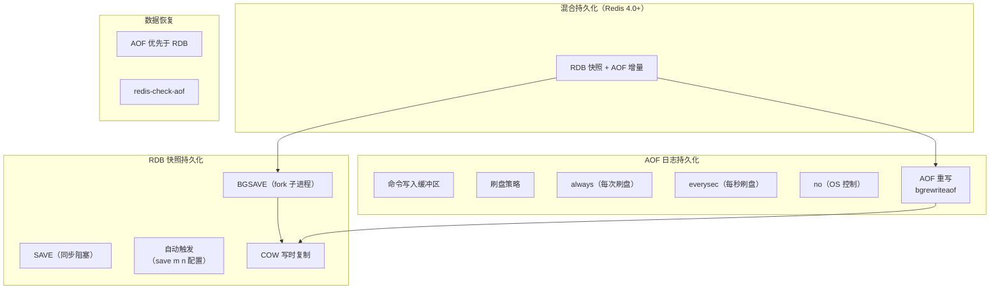

# 持久化机制

## 概述

Redis 作为内存数据库，所有数据存在于内存中，一旦进程退出或服务器宕机，数据将全部丢失。持久化机制是 Redis 从"缓存"跨越到"数据库"的关键能力。本章深入剖析 RDB 快照、AOF 日志、混合持久化三种方案的设计原理、性能影响和故障恢复策略，帮助你在面试中全面阐述 Redis 的数据可靠性保障。

---

## 一、知识图谱



---

## 二、基础到进阶学习路线

- **阶段一：基础入门** -- 理解 RDB 和 AOF 的基本概念，掌握配置方法，能独立开启持久化并验证数据恢复
- **阶段二：原理深入** -- 理解 fork 子进程的 COW 机制，掌握 AOF 三种刷盘策略的写入路径，理解 AOF 重写的触发条件和执行流程
- **阶段三：实战优化** -- 掌握混合持久化的配置与优势，能够根据业务场景设计持久化策略，具备 Redis 数据恢复的故障排查能力

---

## 三、核心知识详解

### 3.1 RDB（Redis Database）

RDB 是 Redis 的**快照持久化**机制，将某一时刻的内存数据以二进制格式写入 `.rdb` 文件。

```
RDB 执行流程（BGSAVE）：

  主进程                      fork 子进程
  ┌──────────┐               ┌──────────────────┐
  │ 1. 检查   │               │ 4. 遍历所有 DB    │
  │ 已有子进程 │               │ 5. 遍历所有 Key   │
  │ 则返回    │               │ 6. 写入临时文件   │
  └─────┬────┘               │    temp-{pid}.rdb │
        │                    │ 7. 原子 rename    │
        v                    │    → dump.rdb     │
  ┌──────────┐               └──────────────────┘
  │ 2. fork()│ ── 创建子进程 ──→
  └─────┬────┘
        │
        v
  ┌──────────┐
  │ 3. 继续   │
  │ 处理请求  │ ← 主进程与子进程共享内存页（COW）
  └──────────┘
```

#### 触发时机

| 触发方式 | 命令/配置 | 是否阻塞 | 说明 |
|----------|-----------|----------|------|
| 手动同步 | `SAVE` | **阻塞主线程** | 生产环境禁用，仅调试用 |
| 手动异步 | `BGSAVE` | 不阻塞，fork 阶段短暂停顿 | **生产环境推荐** |
| 配置自动 | `save 900 1`（900 秒内 1 次修改） | 自动触发 BGSAVE | 可配置多条规则 |
| 配置自动 | `save 300 10`（300 秒内 10 次修改） | 同上 | 多条规则 OR 关系 |
| 配置自动 | `save 60 10000`（60 秒内 10000 次修改） | 同上 | 满足任一即触发 |
| 主从全量同步 | 从节点请求全量同步 | 主节点自动 BGSAVE | 生成 RDB 发给从节点 |
| 关闭时 | `SHUTDOWN`（未开启 AOF） | 自动 BGSAVE | 保证优雅关闭不丢数据 |
| `FLUSHALL` | 清空所有数据后 | 自动 BGSAVE | 生成空 RDB（慎用） |

#### COW（Copy-On-Write）写时复制

```
COW 原理：

  fork() 之后，父子进程共享同一块物理内存。

  父进程（主进程）               子进程（BGSAVE）
  ┌─────────────────┐          ┌─────────────────┐
  │ 页表 → 物理页    │          │ 页表 → 物理页    │
  │ Page 0: R        │ ─共享── │ Page 0: R        │
  │ Page 1: R        │ ─共享── │ Page 1: R        │
  │ Page 2: R        │ ─共享── │ Page 2: R        │
  └─────────────────┘          └─────────────────┘

  父进程收到写请求（修改 Page 1）：
  ┌─────────────────┐          ┌─────────────────┐
  │ Page 0: R        │ ─共享── │ Page 0: R        │
  │ Page 1: W        │          │ Page 1: R（副本） │ ← 复制一份给子进程
  │ Page 2: R        │ ─共享── │ Page 2: R        │
  └─────────────────┘          └─────────────────┘

  操作系统将 Page 1 复制一份，父进程修改新副本，
  子进程继续读取旧副本 → 子进程看到的是 fork 时刻的快照
```

::: warning fork 对性能的影响
`fork()` 调用本身会阻塞主线程，阻塞时间取决于页表大小，与 Redis 实例内存大小成正比：

- 10GB 内存 → fork 约 20ms
- 50GB 内存 → fork 约 100ms
- 建议单个 Redis 实例内存不超过 10GB（或启用 `vm.overcommit_memory = 1`）

COW 期间额外内存开销：如果 fork 后大量写操作，需要复制大量内存页，极端情况下可能导致内存使用量翻倍（OOM）。建议预留 30%~50% 内存。
:::

#### RDB 优缺点

| 优点 | 缺点 |
|------|------|
| 文件紧凑，适合备份和灾难恢复 | 两次快照之间的数据可能丢失（取决于配置） |
| 恢复速度极快（直接加载二进制） | fork 子进程内存开销大 |
| 对主进程性能影响小（子进程完成） | 频繁 fork 可能导致延迟毛刺 |
| 适合冷备、异地容灾 | 不适合实时持久化要求高的场景 |

### 3.2 AOF（Append Only File）

AOF 记录所有写命令，以 Redis 协议格式追加到日志文件中。

```
AOF 写入流程：

  客户端写命令
       │
       v
  ┌──────────────┐
  │ 1. 执行命令   │  ← 主线程执行
  │    更新内存   │
  └──────┬───────┘
         │
         v
  ┌──────────────┐
  │ 2. 写入 AOF   │  ← 追加到 aof_buf（内存缓冲区）
  │    缓冲区     │
  └──────┬───────┘
         │
         v
  ┌──────────────┐
  │ 3. 同步到磁盘 │  ← 根据 appendfsync 策略决定
  └──────────────┘
```

#### 三种刷盘策略

| 策略 | 配置值 | 行为 | 数据安全性 | 性能 |
|------|--------|------|------------|------|
| always | `appendfsync always` | 每条写命令同步刷盘 | 最高，最多丢 1 条命令 | 最差（磁盘 IO 瓶颈） |
| **everysec** | `appendfsync everysec` | 每秒刷盘一次（**推荐**） | 较高，最多丢 1 秒数据 | 较好（折衷方案） |
| no | `appendfsync no` | 操作系统决定刷盘时机 | 最差，可能丢 30 秒数据 | 最好（纯内存） |

```
everysec 的深入理解：

Redis 主线程将命令写入 aof_buf 后，由后台线程每秒执行一次 fsync()。
如果上一次 fsync 还在进行中，本次 fsync 会被跳过。

关键：everysec 不是"严格每秒一次"，而是"最多每秒一次"。
如果磁盘 IO 很慢，两次 fsync 间隔可能 > 1 秒。

极端情况：
  磁盘 IO 阻塞 → fsync 超过 2 秒 → Redis 为保证数据安全，
  阻塞写入直到 fsync 完成（Redis 2.6+）
```

#### AOF 重写（bgrewriteaof）

```
为什么需要 AOF 重写？

  原始 AOF 记录的是增量命令，随着时间推移文件不断膨胀：

  SET counter 0
  INCR counter       ← 1
  INCR counter       ← 2
  ...（100 万次 INCR）
  INCR counter       ← 1000000

  重写后：
  SET counter 1000000  ← 一条命令替代 100 万条

  重写不是分析旧 AOF，而是读取当前内存数据生成新 AOF。
```

```
AOF 重写流程（bgrewriteaof）：

  主进程                          子进程
  ┌──────────────┐               ┌──────────────────┐
  │ 1. fork()    │ ── 创建子进程 ──→ │ 4. 遍历所有 DB    │
  └──────┬───────┘               │ 5. 生成新 AOF 命令  │
         │                       │ 6. 写入临时文件    │
         v                       └──────────────────┘
  ┌──────────────┐
  │ 2. 继续处理   │  ← 期间的新命令写入 AOF 重写缓冲区
  │    请求       │
  └──────┬───────┘
         │
         v
  ┌──────────────┐
  │ 3. 子进程结束 │
  │ 主进程收到信号 │
  │ 将重写缓冲区  │
  │ 追加到新 AOF  │
  │ 原子 rename   │
  └──────────────┘
```

```
AOF 重写触发条件（自动触发）：

auto-aof-rewrite-percentage 100
  当前 AOF 文件大小 > 上次重写后大小的 100%（即翻倍）

auto-aof-rewrite-min-size 64mb
  当前 AOF 文件大小 > 64MB（避免小文件频繁重写）

两个条件同时满足才触发。
```

### 3.3 混合持久化（Redis 4.0+）

混合持久化结合了 RDB 的快速恢复和 AOF 的数据完整性。

```
混合持久化原理：

  开启：aof-use-rdb-preamble yes

  AOF 重写时，子进程的行为：
  1. 将当前内存数据以 RDB 格式写入 AOF 文件开头
  2. 将重写缓冲区中的增量命令以 AOF 格式追加到文件末尾

  最终 AOF 文件结构：
  ┌────────────────────────────────────────────┐
  │ [RDB 数据块]  │  [AOF 增量命令]  │  [AOF 增量] │
  │（快照部分）   │  （重写期间的命令）│  （后续写入） │
  └────────────────────────────────────────────┘

  恢复时：
  1. 先加载 RDB 部分（快速恢复大部分数据）
  2. 再回放 AOF 部分（恢复增量数据）
```

| 方案 | 文件大小 | 恢复速度 | 数据丢失 | 重写性能 |
|------|----------|----------|----------|----------|
| 纯 RDB | 最小 | 最快 | 可能丢失较多 | 子进程生成，主进程无影响 |
| 纯 AOF | 最大 | 最慢 | 最少（everysec 最多 1s） | 子进程生成，主进程无影响 |
| 混合持久化 | 中等 | 快（接近 RDB） | 最少 | 同 AOF 重写 |

### 3.4 持久化对性能的影响

```
性能影响分析矩阵：

  写入场景分析（以 appendfsync everysec 为例）：

  ┌──────────────┬──────────────┬──────────────┬──────────────┐
  │              │  无持久化     │  RDB         │  AOF + RDB   │
  ├──────────────┼──────────────┼──────────────┼──────────────┤
  │ 普通写入     │ 无影响        │ 无影响        │ 轻微影响      │
  │ fork 瞬间    │ 无            │ 阻塞 ~20ms   │ 阻塞 ~20ms   │
  │ COW 内存     │ 无            │ 30%~50% 额外 │ 同 RDB        │
  │ 磁盘 IO      │ 无            │ 间歇性         │ 持续写入      │
  │ 恢复时间     │ 无法恢复      │ 秒级          │ 秒级         │
  └──────────────┴──────────────┴──────────────┴──────────────┘
```

::: danger 生产环境陷阱
1. **RDB 和 AOF 同时开启时，不要频繁手动 BGSAVE**：每次 BGSAVE 都会 fork 子进程，CPU 和内存压力叠加
2. **AOF 文件过大导致恢复时间过长**：合理设置 `auto-aof-rewrite-percentage` 和 `auto-aof-rewrite-min-size`
3. **磁盘性能不足**：AOF everysec 需要磁盘能稳定在 1 秒内完成 fsync；使用 SSD 或云盘高性能型
4. **code=0 的 BGSAVE 但数据丢失**：检查 `vm.overcommit_memory` 是否为 1，fork 失败时不会报错
:::

### 3.5 数据恢复优先级

```
Redis 启动时的数据恢复流程：

  1. 检查 AOF 是否开启
     ├── 是 → 加载 AOF 文件（优先）
     │        ├── AOF 文件损坏？ → redis-check-aof --fix 修复
     │        └── 加载成功 → 启动完成
     └── 否 → 检查 RDB 文件是否存在
              ├── 是 → 加载 RDB 文件
              │        └── 加载成功 → 启动完成
              └── 否 → 以空数据库启动

  为什么 AOF 优先于 RDB？
  AOF 数据更完整（everysec 最多丢 1 秒），
  RDB 可能丢失更多（取决于 save 配置的间隔）。
```

---

## 四、经典应用场景与解决方案

### 场景：电商秒杀活动的持久化策略设计

**问题背景**

某电商平台在大促期间，Redis 承担着库存扣减、限流计数、用户 Session 等核心业务。要求：
- 宕机后数据丢失不超过 1 秒（RPO < 1s）
- 恢复时间不超过 30 秒（RTO < 30s）
- 不能因为持久化导致写入性能下降超过 10%

**方案设计**

```conf
# ========== 持久化配置 ==========

# 1. 开启混合持久化（Redis 4.0+）
aof-use-rdb-preamble yes

# 2. AOF 配置
appendonly yes
appendfsync everysec

# 3. AOF 重写策略
auto-aof-rewrite-percentage 100
auto-aof-rewrite-min-size 64mb

# 4. 同时开启 RDB（作为冷备）
save 900 1
save 300 10
save 60 10000

# 5. 操作系统配置
# 确保 vm.overcommit_memory = 1
# 关闭 Transparent Huge Pages（THP）
# echo never > /sys/kernel/mm/transparent_hugepage/enabled
```

```
架构设计：

  ┌──────────────────────────────────────────────────────┐
  │                    Redis 集群                          │
  │                                                       │
  │  ┌─────────┐  ┌─────────┐  ┌─────────┐               │
  │  │ Master  │  │ Master  │  │ Master  │               │
  │  │  分片1  │  │  分片2  │  │  分片3  │               │
  │  └────┬────┘  └────┬────┘  └────┬────┘               │
  │       │            │            │                     │
  │  ┌────┴────┐  ┌────┴────┐  ┌────┴────┐               │
  │  │ Slave   │  │ Slave   │  │ Slave   │  ← 从节点也开启持久化  │
  │  └─────────┘  └─────────┘  └─────────┘               │
  │                                                       │
  │  AOF 文件 → 定时备份到 OSS/S3（异地容灾）              │
  └──────────────────────────────────────────────────────┘
```

**关键措施**

1. **混合持久化**：RDB 快照 + AOF 增量，恢复时先加载 RDB 再回放 AOF，兼顾速度与完整性
2. **从节点分摊持久化**：主节点可以关闭持久化或降低持久化频率，由从节点承担 BGSAVE 和 AOF 重写的开销
3. **定时冷备**：每小时将 RDB/AOF 文件备份到对象存储，保留最近 7 天
4. **监控告警**：监控 `aof_current_size`、`aof_last_rewrite_time_sec`、`latest_fork_usec` 等指标

```bash
# 定时备份脚本（crontab 每小时执行）
#!/bin/bash
BACKUP_DIR="/backup/redis/$(date +%Y%m%d)"
mkdir -p $BACKUP_DIR
cp /data/redis/dump.rdb $BACKUP_DIR/dump_$(date +%H).rdb
cp /data/redis/appendonly.aof $BACKUP_DIR/appendonly_$(date +%H).aof

# 保留最近 7 天
find /backup/redis/ -type d -mtime +7 -exec rm -rf {} \;
```

---

## 五、高频面试题

### Q1: RDB 和 AOF 的区别是什么？应该怎么选择？

::: details 答案

**RDB（快照持久化）**：
- 将某一时刻的全量内存数据以二进制格式保存到磁盘
- 优点：文件紧凑，恢复速度快（直接加载二进制），适合冷备和灾难恢复
- 缺点：两次快照之间可能丢失数据（取决于 `save` 配置），fork 子进程有内存和 CPU 开销

**AOF（日志持久化）**：
- 记录所有写命令，以 Redis 协议格式追加到文件
- 优点：数据更安全（everysec 最多丢 1 秒），文件可读（Redis 协议文本），支持自动重写压缩
- 缺点：文件通常比 RDB 大，恢复速度比 RDB 慢（逐条回放命令）

**选择策略**：

| 场景 | 推荐方案 |
|------|----------|
| 纯缓存，数据可丢失 | 关闭持久化 |
| 要求数据安全，可接受恢复慢 | 仅 AOF（everysec） |
| 能接受少量数据丢失，要求恢复快 | 仅 RDB（save 配置） |
| 既要求数据安全又要求恢复快 | **混合持久化（RDB + AOF everysec）** |

**生产环境最佳实践**：开启混合持久化 + AOF everysec，同时保留 RDB 的 save 配置作为备份冗余。从节点可以承担持久化开销，主节点适当降低持久化频率。
:::

### Q2: BGSAVE 的 fork 操作对性能有什么影响？如何优化？

::: details 答案

**fork 的影响**：

1. **fork 调用本身阻塞主线程**：操作系统需要复制父进程的页表。页表大小与 Redis 实例内存成正比。
   - 10GB 内存实例 → fork 约 20ms
   - 50GB 内存实例 → fork 可能超过 100ms
   - 在此期间，Redis 无法处理任何请求

2. **COW 内存开销**：fork 后，父子进程共享物理内存页。当父进程执行写操作时，操作系统复制被修改的内存页（Copy-On-Write）。
   - 如果 fork 期间写入量大，需要复制大量内存页
   - 极端情况下，内存使用量可能翻倍，触发 OOM

3. **CPU 开销**：子进程将内存数据写入磁盘，消耗 CPU 和 IO 资源

**优化策略**：

1. **控制实例内存大小**：单个 Redis 实例内存不超过 10GB，避免 fork 时间过长
2. **操作系统配置**：
   ```bash
   # 允许内存过量分配（关键！）
   vm.overcommit_memory = 1
   
   # 关闭透明大页（减少 fork 时的内存复制）
   echo never > /sys/kernel/mm/transparent_hugepage/enabled
   ```
3. **从节点分担**：让从节点执行 BGSAVE，主节点关闭自动 RDB 或降低频率
4. **错峰执行**：避免在业务高峰期触发 BGSAVE（可以手动控制 `save` 配置定时在低峰期）
5. **监控 fork 耗时**：
   ```redis
   INFO stats | grep latest_fork_usec
   ```
   如果 fork 耗时持续增长，考虑拆分实例或升级硬件
6. **使用混合持久化**：减少 BGSAVE 频率（混合持久化在 AOF 重写时生成 RDB 头，无需单独 BGSAVE）
:::

### Q3: 混合持久化的原理是什么？有什么优势？

::: details 答案

**混合持久化原理**（Redis 4.0+，`aof-use-rdb-preamble yes`）：

AOF 重写时，子进程不再逐条生成 AOF 命令，而是：
1. 将当前内存数据以 **RDB 二进制格式**写入 AOF 文件开头
2. 将重写期间父进程积累的增量命令以 **AOF 文本格式**追加到文件末尾

最终文件结构：
```
[RDB 数据块] + [AOF 增量命令]
```

**优势**：

1. **恢复速度极大提升**：大部分数据以 RDB 二进制格式加载（远快于逐条回放 AOF 命令），仅少量增量部分需要回放
2. **数据完整性高**：增量部分用 AOF 格式记录，不丢数据（everysec 最多丢 1 秒）
3. **文件体积适中**：RDB 格式比 AOF 文本命令更紧凑，文件比纯 AOF 小
4. **向后兼容**：旧版本 Redis 无法识别混合格式，可以禁用回退；新版本默认开启

**对比**：

| 维度 | 纯 RDB | 纯 AOF | 混合持久化 |
|------|--------|--------|------------|
| 文件大小 | 小 | 大 | 中 |
| 恢复速度 | 快 | 慢 | 快（接近 RDB） |
| 数据丢失 | 多（取决于配置） | 少（最多 1 秒） | 少（最多 1 秒） |
| 兼容性 | 好 | 好 | 4.0+ |

**注意事项**：混合持久化文件的前半部分是不可读的 RDB 二进制格式，不能直接 `cat` 查看。但尾部的 AOF 增量部分是文本格式，可以通过 `redis-check-aof` 工具修复。
:::

### Q4: AOF 重写的机制是怎样的？触发条件和执行流程？

::: details 答案

**为什么需要重写**：AOF 文件记录的是增量命令，随着时间推移会不断膨胀。例如，一个计数器被 INCR 了 100 万次，AOF 会记录 100 万条命令，而实际上只需要一条 `SET counter 1000000`。

**AOF 重写不是分析旧 AOF 文件**，而是读取当前内存数据，生成最小化的写命令集合。

**触发条件**（自动触发，需同时满足）：

```conf
auto-aof-rewrite-percentage 100  # 当前 AOF 大小 > 上次重写后大小的 100%（翻倍）
auto-aof-rewrite-min-size 64mb   # 当前 AOF 大小 > 64MB
```

也可手动触发：`BGREWRITEAOF`

**执行流程**：

1. **fork 子进程**：主进程 fork 一个子进程，子进程拥有 fork 时刻的内存快照
2. **子进程工作**：遍历所有数据库和 Key，生成最小化命令集，写入临时 AOF 文件
3. **主进程继续服务**：期间收到的写命令同时写入：
   - `aof_buf`（原有 AOF 缓冲区，保证旧 AOF 正常写入）
   - `aof_rewrite_buf`（重写缓冲区，收集重写期间的增量命令）
4. **子进程完成**：通知主进程，主进程将 `aof_rewrite_buf` 中的增量命令追加到临时 AOF 文件末尾
5. **原子替换**：`rename` 临时文件 → 正式 AOF 文件

**关键设计**：
- 重写期间主进程不阻塞（除了 fork 阶段）
- 重写缓冲区保证了重写期间的数据完整性
- 原子 rename 保证了文件替换的安全性

**性能影响**：重写过程中，子进程写入磁盘消耗 IO，主进程需要额外维护重写缓冲区（内存开销）。如果 AOF 文件很大，重写可能耗时较长（数秒到数十秒），但不会阻塞主进程。
:::

### Q5: 如何根据业务场景选择持久化策略？

::: details 答案

**核心决策树**：

```
业务场景分析
    │
    ├── 纯缓存场景（session、临时数据）
    │   → 关闭持久化，最大性能
    │   → 可以接受数据全部丢失
    │
    ├── 缓存 + 少量持久化需求（计数器、排行榜）
    │   → 仅 RDB，save 900 1（15 分钟内最多丢 1 次修改）
    │   → 接受少量数据丢失，需要快速恢复
    │
    ├── 需要高数据安全性（订单、库存、用户数据）
    │   → 混合持久化（aof-use-rdb-preamble yes）
    │   → appendfsync everysec
    │   → 同时保留 RDB 配置作为冷备冗余
    │
    └── 金融级数据安全（支付、账务）
        → appendfsync always（性能代价大，谨慎使用）
        → 或不在 Redis 层面保证，交给数据库（MySQL）持久化
        → Redis 仅做缓存，数据以数据库为准
```

**具体建议**：

| 场景 | RDB | AOF | appendfsync | 混合持久化 | 备注 |
|------|-----|-----|-------------|------------|------|
| 纯缓存 | 关闭 | 关闭 | - | - | 最高性能 |
| 会话管理 | 开启 | 可选 | everysec | 可选 | 会话丢失影响用户体验 |
| 排行榜 | 开启 | 关闭 | - | - | 可从数据库重建 |
| 计数器 | 开启 | 开启 | everysec | 推荐 | 丢失计数器影响业务 |
| 分布式锁 | 不需要 | 不需要 | - | - | 锁不需要持久化 |
| 消息队列 | 开启 | 开启 | everysec | 推荐 | 消息丢失不可接受 |
| 库存扣减 | 开启 | 开启 | everysec | 推荐 | 以数据库为最终一致性保障 |

**关键原则**：
1. 持久化策略越强，性能损失越大，需要根据业务 RPO/RTO 权衡
2. 能由数据库保证的数据，Redis 可以降低持久化级别
3. 从节点分担持久化开销是通用的优化手段
4. 定期验证恢复流程，确保 RDB/AOF 文件可正常加载
:::

### Q6: AOF 的三种刷盘策略 always / everysec / no 各自的写入路径是怎样的？

::: details 答案

**写入路径**：一条写命令在 Redis 中经过以下路径才到达磁盘：

```
客户端 → 命令执行 → aof_buf（内存缓冲区）→ write()（OS 内核缓冲区）→ fsync()（磁盘）
```

三种策略的差异在于 **fsync() 的调用时机**：

| 策略 | fsync 调用时机 | 写入路径 |
|------|---------------|----------|
| **always** | 每条命令执行后立即 fsync | 命令 → aof_buf → write → fsync 阻塞等待 → 返回客户端 |
| **everysec** | 后台线程每秒调用一次 fsync | 命令 → aof_buf → write（异步）→ 返回客户端；后台线程每秒 fsync |
| **no** | 不调用 fsync，由 OS 决定 | 命令 → aof_buf → write（异步）→ 返回客户端；OS 约 30 秒自动刷盘 |

**always 的详细过程**：
```c
// 伪代码
void feedAppendOnlyFile(command) {
    aof_buf_append(command);   // 写入 aof_buf 缓冲区
    flushAppendOnlyFile();     // 调用 write() + fsync()
}
```
每条命令都阻塞等待 fsync 完成才返回客户端。写入性能完全受限于磁盘 IOPS。

**everysec 的详细过程**：
```c
// 伪代码
void feedAppendOnlyFile(command) {
    aof_buf_append(command);   // 写入 aof_buf 缓冲区
    // 不立即 fsync，返回客户端
}

// 后台线程（每秒执行）
void aof_background_fsync() {
    write(aof_buf, fd);        // 写入 OS 内核缓冲区
    fsync(fd);                 // 刷到磁盘
}
```

**everysec 的异常处理**：
- 如果上一次 fsync 尚未完成，本次 fsync 会被跳过
- 如果 fsync 耗时超过 2 秒，Redis 会阻塞写入直到 fsync 完成（防止 aof_buf 无限增长）
- 如果 fsync 耗时超过 2 秒，`INFO persistence` 中 `aof_delayed_fsync` 计数器 +1

**no 策略的风险**：
- 数据存在于 OS 内核缓冲区，尚未写入磁盘
- 如果操作系统崩溃（非 Redis 进程崩溃），内核缓冲区中的数据丢失
- Linux 默认约 30 秒刷新一次脏页（`/proc/sys/vm/dirty_writeback_centisecs`）

**选择建议**：生产环境几乎总是选 **everysec**，它提供了性能与数据安全的最佳平衡点。
:::

---

## 六、选型指南

### 适用场景

| 场景 | 推荐方案 | 关键配置 |
|------|----------|----------|
| 纯缓存，可丢失 | 无持久化 | `save ""` + `appendonly no` |
| 缓存 + 可重建 | 仅 RDB | `save 900 1` |
| 需要数据安全 | 混合持久化 | `aof-use-rdb-preamble yes` + `appendfsync everysec` |
| 金融级可靠性 | RDB + AOF always | `appendfsync always`（性能代价大） |

### 不适用场景

- 持久化存储大数据（应使用 MySQL / RocksDB 等磁盘数据库）
- Redis 作为唯一数据源且无法接受任何数据丢失（应使用数据库 + Redis 缓存架构）
- 磁盘 IO 性能极差的环境（everysec 无法保证）

### 配置建议

```conf
# ========== 推荐的生产环境配置 ==========

# --- RDB 配置 ---
save 900 1
save 300 10
save 60 10000
stop-writes-on-bgsave-error yes   # BGSAVE 失败时拒绝写入（安全）
rdbcompression yes                 # 压缩 RDB 文件
rdbchecksum yes                    # 校验 RDB 文件完整性

# --- AOF 配置 ---
appendonly yes
appendfsync everysec
no-appendfsync-on-rewrite no       # 重写期间也执行 fsync（安全优先）
auto-aof-rewrite-percentage 100
auto-aof-rewrite-min-size 64mb
aof-load-truncated yes             # 允许加载截断的 AOF 文件

# --- 混合持久化 ---
aof-use-rdb-preamble yes

# --- 目录配置 ---
dir /data/redis
dbfilename dump.rdb
appendfilename "appendonly.aof"
```

---

## 相关文档

- [Redis 核心原理](./index)
- [高级数据结构详解](./data-structure)
- [集群方案](./cluster)
- [Redis 选型指南](./selection)