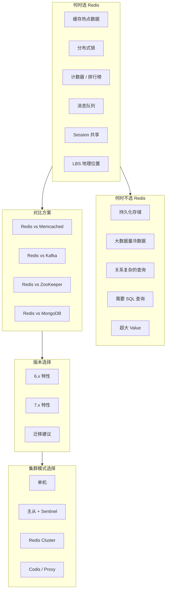

# Redis 选型指南

## 概述

在技术选型面试中，"什么时候用 Redis？什么时候不用？为什么选 Redis 而不是 Memcached？" 是高频问题。本章从适用场景、版本选择、集群模式、内存估算等维度，建立完整的 Redis 选型决策框架，帮助你在面试中有理有据地阐述技术选型背后的考量。

---

## 一、知识图谱



---

## 二、基础到进阶学习路线

- **阶段一：基础入门** -- 了解 Redis 的核心适用场景和不适用场景，能够回答"为什么用 Redis"的基本问题
- **阶段二：原理深入** -- 掌握 Redis vs Memcached / Kafka / ZooKeeper 的对比维度，理解版本差异（6.x vs 7.x）
- **阶段三：实战优化** -- 能够根据业务需求（数据量、QPS、一致性要求）做出合理的集群模式选择，进行内存估算和容量规划

---

## 三、核心知识详解

### 3.1 Redis 适用场景

| 场景 | 说明 | 典型用例 | 选型理由 |
|------|------|----------|----------|
| **缓存** | 热点数据缓存，减少数据库压力 | 商品详情、用户信息、配置数据 | 丰富的数据结构，支持多种淘汰策略 |
| **分布式锁** | 跨节点互斥访问 | 库存扣减、定时任务互斥 | 单线程 + 原子操作 + Lua 脚本 |
| **计数器** | 高并发原子计数 | 阅读量、点赞数、限流计数器 | INCR 原子操作，O(1) |
| **排行榜** | 实时排名 | 游戏排行榜、文章热度榜 | ZSet 的 skiplist 天然支持 |
| **消息队列** | 异步解耦 | 订单处理、消息通知 | Stream 支持消费者组和 ACK |
| **Session 共享** | 分布式 Session | 用户登录态 | 过期时间 + 高性能读写 |
| **LBS 应用** | 地理位置服务 | 附近的人、配送范围 | GEO 底层基于 ZSet + GeoHash |
| **UV 统计** | 大数据基数统计 | 页面 UV、独立访客 | HyperLogLog 12KB 统计 2^64 元素 |
| **签到系统** | 大规模位操作 | 连续签到、活跃用户 | Bitmap 极致节省空间 |
| **延迟队列** | 定时任务 | 订单超时取消、延迟通知 | ZSet score = 执行时间戳 |

### 3.2 Redis 不适用场景

| 场景 | 为什么不适用 | 替代方案 |
|------|-------------|----------|
| **持久化存储** | 内存有限，数据可能丢失（RDB 间隔） | MySQL / PostgreSQL |
| **大数据量冷数据** | 内存成本高，访问频率低的数据不值得 | MySQL + 归档 |
| **关系复杂的查询** | 不支持 JOIN、子查询、聚合 | MySQL / PostgreSQL |
| **需要 SQL 查询** | 无 SQL 支持 | 关系型数据库 |
| **超大 Value** | 单个 Key 过大会导致阻塞（如 HGETALL 大 Hash） | 对象存储（OSS/S3）+ URL 引用 |
| **全文搜索** | 无倒排索引，LIKE 效率低 | Elasticsearch |
| **时序数据** | 无降采样、自动过期聚合 | InfluxDB / TDengine |
| **强一致性交易** | 异步复制可能丢数据 | 数据库 + 分布式事务 |

### 3.3 Redis vs Memcached

| 维度 | Redis | Memcached |
|------|-------|-----------|
| **数据结构** | String、Hash、List、Set、ZSet、Stream、GEO、Bitmap、HyperLogLog | 仅 String（Key-Value） |
| **持久化** | RDB + AOF + 混合持久化 | 不支持 |
| **集群** | Redis Cluster（官方）、Sentinel | 客户端一致性哈希 |
| **线程模型** | 单线程（6.0+ 支持 IO 多线程） | 多线程 |
| **内存管理** | jemalloc，多种编码优化 | Slab Allocation（固定大小） |
| **过期策略** | 惰性删除 + 定期删除 | 惰性删除（LRU 淘汰时检查） |
| **淘汰策略** | 8 种（LRU/LFU/TTL/Random） | 仅 LRU |
| **Value 大小** | 最大 512MB | 最大 1MB（slab 限制） |
| **事务** | 支持（MULTI/EXEC + Lua） | 不支持 |
| **发布订阅** | 支持 | 不支持 |
| **Lua 脚本** | 支持（原子执行） | 不支持 |
| **性能** | 单线程瓶颈（10 万+ QPS 单实例） | 多线程可突破 100 万 QPS |

```
选型决策树：

  需要复杂数据结构？
  ├── 是 → Redis
  └── 否 → 需要持久化？
            ├── 是 → Redis
            └── 否 → Value > 1MB？
                      ├── 是 → Redis
                      └── 否 → 需要极致性能？
                                ├── 是 → Memcached
                                └── 否 → Redis（功能和生态更好）
```

### 3.4 Redis vs Kafka（消息队列场景）

| 维度 | Redis Stream | Kafka |
|------|-------------|-------|
| **消息持久化** | 依赖 RDB/AOF（内存） | 磁盘存储（顺序写） |
| **吞吐量** | 中（10 万级 QPS） | 高（百万级 QPS） |
| **分区** | 不支持 Partition | 支持多 Partition 并行 |
| **消息回溯** | 支持（消息不删除） | 支持（磁盘存储，可回溯任意 offset） |
| **消费者组** | 支持 | 支持 |
| **ACK 机制** | XACK 确认 | Offset Commit |
| **水平扩展** | 受限于槽位 | 增加 Partition 即可 |
| **适用场景** | 轻量级消息队列、低延迟 | 高吞吐日志、事件溯源 |

### 3.5 Redis vs ZooKeeper（分布式协调场景）

| 维度 | Redis | ZooKeeper |
|------|-------|-----------|
| **一致性** | 最终一致性（异步复制） | 强一致性（ZAB 协议） |
| **分布式锁安全** | 有争议（RedLock 不安全） | 临时顺序节点 + Watch，安全 |
| **性能** | 高（10 万+ QPS） | 低（万级 QPS） |
| **部署复杂度** | 简单 | 复杂（需要 Java 环境） |
| **适用场景** | 高并发锁、效率优先 | 强一致性锁、服务发现、配置中心 |

### 3.6 版本选择：6.x vs 7.x

#### Redis 6.0 关键特性

| 特性 | 说明 |
|------|------|
| **IO 多线程** | 读写网络数据多线程处理，命令执行仍单线程 |
| **ACL** | 细粒度权限控制（用户 + 命令 + Key 前缀） |
| **RESP3** | 新协议，支持更丰富的数据类型返回 |
| **Client-Side Caching** | 客户端缓存，减少网络往返 |
| **SSL/TLS** | 加密传输 |
| **Cluster Proxy** | 官方 Proxy，非 Cluster 客户端也能访问集群 |

#### Redis 7.0 关键特性

| 特性 | 说明 |
|------|------|
| **Redis Functions** | 服务端函数（替代 Lua 脚本的更好方案） |
| **ACL v2** | 更细粒度的权限控制（Key 权限 + Selector） |
| **Sharded Pub/Sub** | 分片发布订阅（集群模式下按 slot 分发，减少跨节点广播） |
| **Multi-Part AOF** | 多部分 AOF（基础文件 + 增量文件，减少重写频率） |
| **listpack 全面替代 ziplist** | 彻底解决连锁更新问题 |
| **MP-SC License** | 变更开源协议（RSALv2 + SSPLv1 双许可） |
| **性能提升** | 相比 6.0 提升 10%~20% |
| **SORT_RO** | 只读排序命令 |

#### 版本选择建议

| 场景 | 推荐版本 | 理由 |
|------|----------|------|
| 新项目 | 7.0+ | 最新特性，listpack 优化，性能提升 |
| 稳定优先 | 6.2 | 经过长期验证，生态成熟 |
| 已有 6.x 项目 | 暂不升级 | 6.x 仍长期维护，7.0 协议变更需评估 |
| 需要企业支持 | Redis Enterprise / 云服务 | 商业支持，SLA 保障 |

::: danger 协议变更注意
Redis 7.0 开始采用 RSALv2 + SSPLv1 双许可，如果你计划基于 Redis 构建云服务，需要仔细评估许可合规性。许多云厂商已经转向 Valkey 等开源分支。
:::

### 3.7 集群模式选择

| 模式 | 适用场景 | 数据量 | 高可用 | 复杂度 |
|------|----------|--------|--------|--------|
| **单机** | 开发测试、数据量小、无高可用需求 | < 10GB | 无 | 极低 |
| **主从复制** | 读写分离、数据备份 | < 10GB | 手动切换 | 低 |
| **主从 + Sentinel** | 中小规模、需要自动故障转移 | < 10GB | 自动 | 中 |
| **Redis Cluster** | 大数据量、高并发、需水平扩展 | > 10GB | 自动 | 高 |
| **Codis / Proxy** | 超大集群、透明访问 | > 100GB | 自动 | 很高 |

```
集群模式决策树：

  数据量？
  ├── < 10GB → 需要高可用？
  │             ├── 是 → 主从 + Sentinel
  │             └── 否 → 单机 / 主从
  └── > 10GB → 需要水平扩展？
                ├── 是 → 技术团队能力？
                │        ├── 强 → Redis Cluster
                │        └── 一般 → Codis / 云服务
                └── 否 → 垂直扩展（加大内存）
```

### 3.8 内存估算与配置建议

#### 内存估算方法

```
内存估算公式：

单 Key 内存占用 = 基础开销 + 数据大小

基础开销：
  - RedisObject：约 16 字节
  - dictEntry：约 24 字节（哈希表中的条目）
  - Key 本身：SDS 头 + 数据
  - Value 本身：取决于数据结构编码

示例：保存 100 万条 String 类型的 Key-Value
  Key 格式：user:info:{uid}（约 15 字节）
  Value 格式：JSON 用户信息（约 200 字节）

  单 Key 内存：
    RedisObject: 16B
    dictEntry: 24B
    Key SDS: 3B(头) + 15B(数据) = 18B
    Value SDS: 3B(头) + 200B(数据) = 203B
    总计：约 261B

  100 万条：261B × 1,000,000 ≈ 261 MB
  实际考虑内存碎片（jemalloc 约 1.3x）：261 × 1.3 ≈ 340 MB
```

#### 配置建议

```conf
# ========== 内存配置 ==========
maxmemory 4gb                      # 最大内存（建议物理内存的 60%~70%）
maxmemory-policy allkeys-lfu       # 淘汰策略
maxmemory-samples 10               # LRU/LFU 采样数

# ========== 连接配置 ==========
timeout 300                        # 空闲连接超时（秒）
tcp-keepalive 300                  # TCP keepalive
maxclients 10000                   # 最大客户端连接数

# ========== 慢查询配置 ==========
slowlog-log-slower-than 10000     # 慢查询阈值（微秒），10ms
slowlog-max-len 128               # 慢查询日志最大长度

# ========== 持久化配置 ==========
# 根据场景参考持久化章节

# ========== 安全配置 ==========
requirepass "strong_password"      # 密码
rename-command FLUSHDB ""         # 禁用危险命令
rename-command FLUSHALL ""
rename-command KEYS ""

# ========== 性能优化 ==========
# 6.0+ 开启 IO 多线程
io-threads 4
io-threads-do-reads yes

# 关闭 THP（操作系统层面）
# echo never > /sys/kernel/mm/transparent_hugepage/enabled
```

---

## 四、经典应用场景与解决方案

### 场景：创业公司技术栈选型

**问题背景**

某创业公司正在搭建电商平台技术栈，需要评估以下需求：
- 用户量：预计 100 万 DAU
- 核心场景：商品缓存、购物车、分布式 Session、实时排行榜、秒杀库存扣减
- 团队规模：5 人后端团队
- 预算：有限，优先使用开源方案

**选型方案**

```
┌─────────────────────────────────────────────────────────────┐
│                    电商平台 Redis 选型                        │
├─────────────────────────────────────────────────────────────┤
│                                                              │
│  场景一：商品详情缓存                                        │
│  ├── 方案：Redis String + Hash                               │
│  ├── 淘汰策略：allkeys-lfu                                   │
│  ├── 过期时间：1 小时（基础信息）/ 30 秒（库存）              │
│  └── 数据量估算：10 万商品 × 5KB ≈ 500MB                     │
│                                                              │
│  场景二：购物车                                              │
│  ├── 方案：Redis Hash（cart:{uid}）                          │
│  ├── 持久化：AOF everysec（购物车数据不可丢失）               │
│  └── 数据量估算：100 万用户 × 2KB ≈ 2GB                      │
│                                                              │
│  场景三：分布式 Session                                      │
│  ├── 方案：Redis String（UUID + JSON）                       │
│  ├── 过期时间：30 分钟（自动续期）                            │
│  └── 数据量估算：100 万 × 1KB ≈ 1GB                          │
│                                                              │
│  场景四：实时排行榜                                          │
│  ├── 方案：Redis ZSet                                        │
│  ├── 更新频率：实时 ZINCRBY                                  │
│  └── 数据量估算：1000 条 × 500B ≈ 500KB                      │
│                                                              │
│  场景五：秒杀库存扣减                                        │
│  ├── 方案：Redis String（INCR）+ Redisson 分布式锁           │
│  ├── 一致性：Redis 扣减 + 异步写 MySQL                       │
│  └── 数据量估算：1000 商品 × 100B ≈ 100KB                    │
│                                                              │
├──────────────────────────────────────────────────────────────┤
│  总内存估算：500MB + 2GB + 1GB + 0.5MB + 0.1MB ≈ 3.5GB       │
│  预留 30% 内存（fork / 碎片）：3.5GB × 1.3 ≈ 4.5GB           │
│  推荐配置：8GB 实例（留有余量应对增长）                       │
├──────────────────────────────────────────────────────────────┤
│  集群方案：主从 + Sentinel（数据量 < 10GB，无需分片）         │
│  版本选择：Redis 7.0（新项目，享受最新优化）                  │
│  持久化：混合持久化（aof-use-rdb-preamble yes）              │
└──────────────────────────────────────────────────────────────┘
```

---

## 五、高频面试题

### Q1: 什么时候选 Redis？什么时候不适合 Redis？

::: details 答案

**适合选 Redis 的场景**：

1. **高性能缓存**：需要亚毫秒级响应，减轻数据库压力的热点数据访问
2. **高并发计数**：点赞、阅读量、限流计数等需要原子递增的场景
3. **分布式锁**：跨服务协调的互斥操作
4. **实时排行榜**：需要实时更新和查询的排名数据
5. **轻量级消息队列**：不需要高吞吐、可接受消息丢失的异步解耦
6. **Session 共享**：分布式系统中的用户登录态管理
7. **去重/基数统计**：UV 统计、布隆过滤器去重
8. **地理位置服务**：附近的人、配送范围

**不适合选 Redis 的场景**：

1. **持久化主存储**：数据量巨大且需要复杂的 SQL 查询 -- 用 MySQL/PostgreSQL
2. **大数据量冷数据**：访问频率低的大量历史数据 -- 内存成本太高
3. **关系复杂的查询**：需要 JOIN、子查询、聚合 -- 用关系型数据库
4. **全文搜索**：需要倒排索引和分词 -- 用 Elasticsearch
5. **超大 Value**：单个 Key 超过 10MB -- 降低性能，阻塞风险
6. **强一致性交易**：金融支付等需要 ACID 事务 -- 用数据库
7. **时序数据**：需要降采样和自动过期 -- 用 InfluxDB/TDengine
8. **需要持久化的消息队列**：高吞吐、消息不可丢失 -- 用 Kafka

**核心判断标准**：数据是否适合全内存存储？访问模式是否以简单 KV 操作为主？能否接受最终一致性？
:::

### Q2: Redis 和 Memcached 有什么区别？为什么选 Redis？

::: details 答案

**核心差异**：

| 维度 | Redis | Memcached |
|------|-------|-----------|
| 数据结构 | 9 种丰富类型 | 仅 String |
| 持久化 | 支持 | 不支持 |
| 集群方案 | 官方 Cluster + Sentinel | 客户端一致性哈希 |
| 线程模型 | 单线程（6.0+ IO 多线程） | 多线程 |
| 内存管理 | jemalloc，多编码优化 | Slab Allocation |
| Value 上限 | 512MB | 1MB |
| 事务/Lua | 支持 | 不支持 |
| 发布订阅 | 支持 | 不支持 |
| 淘汰策略 | 8 种（LRU/LFU/TTL） | 仅 LRU |

**为什么选 Redis**：

1. **数据结构丰富**：Hash 存对象、ZSet 做排行榜、Stream 做消息队列，一个 Redis 替代多种中间件
2. **持久化能力**：RDB + AOF 混合持久化，可做轻度数据存储
3. **官方集群方案**：Redis Cluster 和 Sentinel 是官方维护，稳定性有保障
4. **生态丰富**：Redisson、RedLock、Lua 脚本，开箱即用
5. **活跃社区**：GitHub 60k+ Star，更新频繁，文档完善
6. **6.0+ IO 多线程**：弥补了单线程的网络 IO 瓶颈

**为什么有些场景仍选 Memcached**：
- 需求简单（仅 KV 缓存），多线程在特定场景下吞吐量更高
- 内存管理更可预测（Slab Allocation 预分配，碎片少）
- 已经在用且稳定运行，迁移成本高
:::

### Q3: Redis 7.0 有哪些重要新特性？值得升级吗？

::: details 答案

**Redis 7.0 核心新特性**：

1. **Redis Functions**：服务端函数，相比 Lua 脚本的优势：
   - 持久化存储（随 RDB/AOF 持久化）
   - 可版本管理
   - 更好的代码组织和复用
   - 支持库（library）概念

2. **ACL v2**：增强的权限控制
   - 支持 Key 权限（`~*` 通配符）
   - 支持 Selector（多种权限规则组合）
   - 更细粒度的命令 + Key 控制

3. **Sharded Pub/Sub**：集群模式下按 slot 分发 Pub/Sub 消息
   - 解决集群广播的性能问题
   - 消息只发送到持有对应 slot 的节点
   - 使用 `SSUBSCRIBE` / `SPUBLISH` 命令

4. **Multi-Part AOF**：多部分 AOF 文件
   - 基础文件（base）+ 增量文件（incr）
   - 减少 AOF 重写频率
   - 增量文件达到阈值时自动合并到基础文件

5. **listpack 全面替代 ziplist**：彻底消除连锁更新问题

6. **性能提升**：相比 6.2 提升 10%~20%

7. **协议变更**：RSALv2 + SSPLv1 双许可（开源协议变更）

**是否值得升级**：

| 情况 | 建议 |
|------|------|
| 新项目 | 推荐 7.0+，享受最新优化 |
| 已有 6.x 稳定运行 | 暂不升级，6.x 仍长期维护 |
| 集群 Pub/Sub 性能瓶颈 | 7.0 的 Sharded Pub/Sub 是重点升级理由 |
| 大量使用 Lua 脚本 | 7.0 的 Functions 可简化脚本管理 |
| 云服务/商业产品 | 关注协议变更，考虑 Valkey 等分支 |

**升级注意事项**：
- 7.0 的 AOF 格式与 6.x 不兼容，需要重新生成 AOF
- 部分命令行为变更（如 `SORT` 默认不返回排序结果）
- 协议变更可能影响商业使用
:::

### Q4: 集群模式怎么选？Sentinel vs Cluster vs 单机？

::: details 答案

**选择决策框架**：

```
数据量评估：
  ├── < 10GB → 单机或主从
  │   └── 需要高可用？
  │       ├── 是 → 主从 + Sentinel
  │       └── 否 → 单机
  │
  └── > 10GB → 需要水平扩展
      └── 需要跨 Key 操作？
          ├── 是（事务、Lua、MGET）→ 评估是否可用 hash tag
          │   └── 数据量继续增长？
          │       ├── 是 → Redis Cluster + hash tag
          │       └── 否 → 垂直扩展（加大内存）
          └── 否 → Redis Cluster
```

**各模式对比**：

| 模式 | 适用数据量 | 高可用 | 水平扩展 | 运维复杂度 | 典型场景 |
|------|-----------|--------|----------|------------|----------|
| 单机 | < 10GB | 无 | 否 | 极低 | 开发测试 |
| 主从 | < 10GB | 手动 | 否 | 低 | 小型网站 |
| Sentinel | < 10GB | 自动 | 否 | 中 | 中小规模生产 |
| Cluster | > 10GB | 自动 | 是 | 高 | 大规模生产 |
| Codis | > 100GB | 自动 | 是 | 很高 | 超大规模/透明访问 |

**具体建议**：

- **创业初期**（< 10GB）：主从 + Sentinel，简单可靠
- **快速增长期**（10~50GB）：Redis Cluster 3 主 3 从，预留扩容空间
- **成熟期**（> 50GB）：Redis Cluster + 多级缓存（本地缓存 + Redis），配合 Codis/Proxy 做透明访问
- **内存不够**：优先考虑淘汰策略优化和数据压缩，再考虑扩容

**关键考量**：
- Redis Cluster 不支持跨 slot 事务/Lua 脚本（需 hash tag）
- Sentinel 架构下所有数据在每个从节点都有完整副本，内存利用率低
- Cluster 架构下每个节点只存部分数据，内存利用率高
- 从 Sentinel 迁移到 Cluster 需要数据迁移，成本较高
:::

### Q5: 如何估算 Redis 的内存使用量？有哪些优化手段？

::: details 答案

**内存估算方法**：

1. **基础公式**：
   ```
   总内存 ≈ 数据量 × (1 + 内存碎片率) × (1 + 预留比例)
   ```

2. **单 Key 内存组成**：
   ```
   String 类型：
     RedisObject（16B）+ dictEntry（24B）+ Key SDS（3B头 + 数据）
     + Value SDS（3B头 + 数据）

   Hash 类型（listpack 编码）：
     更紧凑，元素打包存储，无 dictEntry 开销

   Hash 类型（hashtable 编码）：
     每个 field-value 都有独立的 dictEntry 和 RedisObject
   ```

3. **实际估算示例**：
   ```
   100 万条 String Key-Value：
   Key 平均 20B，Value 平均 200B
   单条：16 + 24 + 23 + 203 ≈ 266B
   总计：266 × 1,000,000 ≈ 266 MB
   加碎片 1.3x：266 × 1.3 ≈ 346 MB
   预留 30%：346 × 1.3 ≈ 450 MB
   → 推荐至少 512MB 实例
   ```

**内存优化手段**：

1. **数据结构优化**：
   - 用 Hash 代替多个 String Key（如 `user:{uid}:name` → `user:{uid}` hash 的 field）
   - 优先使用 listpack 编码（小数据量时自动启用）
   - 用 intset 编码存储纯整数 Set

2. **Key 设计优化**：
   - 缩短 Key 名称（`u:1001:n` 代替 `user:1001:name`）
   - 使用数字 ID 代替长字符串作为 Key 前缀

3. **编码阈值调优**：
   ```conf
   hash-max-listpack-entries 512   # 适当增大，更多数据用 listpack
   hash-max-listpack-value 128     # 适当增大单值上限
   ```

4. **过期时间策略**：
   - 所有 Key 设置合理的过期时间
   - 使用 `allkeys-lfu` 淘汰策略（优先淘汰低频数据）

5. **内存碎片优化**：
   ```conf
   activedefrag yes                # 开启自动内存碎片整理
   active-defrag-ignore-bytes 100mb  # 碎片 > 100MB 开始整理
   active-defrag-threshold-lower 10  # 碎片率 > 10% 开始整理
   ```

6. **压缩**：
   - 使用 snappy/LZ4 压缩大 Value（应用层）
   - 用 Bitmap 代替 Set 存储布尔状态
   - 用 HyperLogLog 代替 Set 统计 UV

7. **监控工具**：
   ```bash
   redis-cli --bigkeys            # 扫描大 Key
   redis-cli --memkeys            # 内存分析
   INFO memory                    # 查看内存使用详情
   ```
:::

### Q6: 新项目选 Redis 7.0 还是 6.2？有什么风险？

::: details 答案

**推荐选择 7.0 的理由**：

1. **性能提升**：相比 6.2 提升 10%~20%，尤其在大量小 Key 场景
2. **listpack 替代 ziplist**：彻底解决连锁更新问题，内存和性能更稳定
3. **Redis Functions**：替代 Lua 脚本的更好方案，持久化、可版本管理
4. **Sharded Pub/Sub**：集群模式下 Pub/Sub 性能大幅提升
5. **Multi-Part AOF**：减少 AOF 重写频率，降低磁盘 IO 压力
6. **ACL v2**：更灵活的权限控制

**选择 6.2 的理由**：

1. **稳定性**：经过 2 年+ 生产验证，社区 bug 修复更充分
2. **兼容性**：部分客户端库可能未适配 7.0 新特性
3. **协议稳定性**：7.0 的 RESP3 和命令变更需要评估影响
4. **团队熟悉度**：已有 6.x 运维经验，降低迁移风险

**7.0 的风险与应对**：

| 风险 | 影响 | 应对 |
|------|------|------|
| 协议变更（RSALv2+SSPLv1） | 商业/云服务可能违规 | 评估许可合规性，考虑 Valkey |
| AOF 格式不兼容 | 6.x → 7.0 升级需重新生成 AOF | 计划升级窗口，从节点先升级 |
| 命令行为变更 | SORT 等命令默认行为变化 | 测试所有使用的命令 |
| 客户端库兼容 | 旧客户端可能不支持新特性 | 升级客户端库到最新版本 |
| 生产环境验证不足 | 可能存在未知 bug | 先在预发布环境充分测试 |

**推荐策略**：

- **新项目**：直接选 7.0（或 7.2），享受最新优化
- **已有项目**：6.2 继续稳定运行，等 7.0 成熟后再评估
- **云服务场景**：使用云厂商的 Redis 兼容版（如阿里云 Tair、AWS ElastiCache），它们通常处理了版本兼容性
- **关注 Valkey**：作为 Redis 7.0 协议变更后的主要开源分支，值得关注
:::

---

## 六、选型指南

### 快速决策矩阵

```
┌─────────────────────────────────────────────────────────────────┐
│                    Redis 选型决策矩阵                             │
├────────────────┬────────────────┬────────────────┬──────────────┤
│   需求          │ 推荐方案        │ 版本           │ 集群模式      │
├────────────────┼────────────────┼────────────────┼──────────────┤
│ 简单缓存        │ Redis          │ 7.0            │ 单机/Sentinel │
│ 复杂数据结构    │ Redis          │ 7.0            │ Cluster      │
│ 纯 KV + 极致性能│ Memcached      │ latest         │ 客户端哈希    │
│ 可靠消息队列    │ Kafka          │ -              │ -            │
│ 强一致性锁      │ ZooKeeper      │ -              │ -            │
│ 全文搜索        │ Elasticsearch  │ -              │ -            │
│ 持久化存储      │ MySQL/PG       │ -              │ -            │
│ 时序数据        │ InfluxDB       │ -              │ -            │
└────────────────┴────────────────┴────────────────┴──────────────┘
```

### 配置建议总结

```conf
# ========== 推荐的生产环境配置模板 ==========

# 基础配置
port 6379
bind 0.0.0.0
protected-mode yes
daemonize yes
logfile /var/log/redis/redis.log

# 内存配置
maxmemory 4gb
maxmemory-policy allkeys-lfu
maxmemory-samples 10

# 持久化（混合）
save 900 1
save 300 10
save 60 10000
appendonly yes
appendfsync everysec
aof-use-rdb-preamble yes

# 安全
requirepass "your_strong_password"
rename-command FLUSHDB ""
rename-command FLUSHALL ""
rename-command KEYS ""

# 性能
io-threads 4
io-threads-do-reads yes
slowlog-log-slower-than 10000
slowlog-max-len 128

# 复制
repl-backlog-size 64mb
min-replicas-to-write 1
min-replicas-max-lag 10
```

---

## 相关文档

- [Redis 核心原理](./index)
- [高级数据结构详解](./data-structure)
- [持久化机制](./persistence)
- [分布式锁](./distributed-lock)
- [缓存策略与一致性](./cache-strategy)
- [集群方案](./cluster)
- [数据库选型速查](../index)