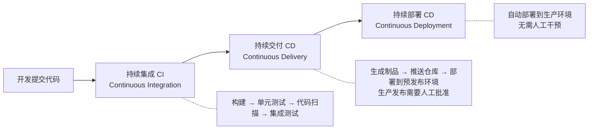
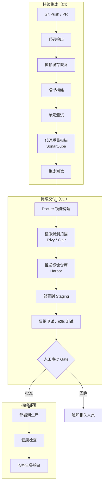
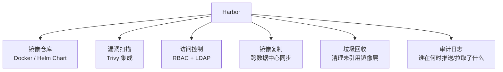
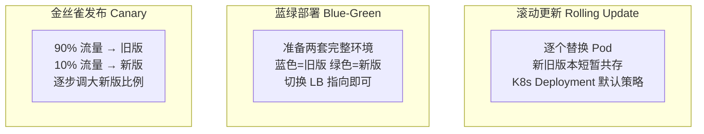

# CI/CD 流水线

## ⭐ 面试重点速览

| 考点 | 频率 | 难度 | 考察方式 |
|------|------|------|----------|
| 持续集成 vs 持续交付 vs 持续部署的区别 | ⭐⭐⭐⭐⭐ | ⭐⭐⭐ | 概念辨析，画图说明三者边界 |
| GitHub Actions 工作流语法与最佳实践 | ⭐⭐⭐⭐ | ⭐⭐⭐ | 给场景，设计 workflow YAML |
| Jenkins Pipeline（Declarative/Scripted） | ⭐⭐⭐⭐ | ⭐⭐⭐⭐ | Jenkinsfile 编写、共享库设计 |
| 镜像仓库 Harbor 的权限与安全策略 | ⭐⭐⭐ | ⭐⭐⭐ | Harbor 相比 Docker Hub 的优势？ |
| 蓝绿部署 vs 金丝雀发布 vs 滚动更新 | ⭐⭐⭐⭐⭐ | ⭐⭐⭐⭐ | 对比三种策略的优缺点和适用场景 |
| CI/CD 流水线的安全检查点 | ⭐⭐⭐ | ⭐⭐⭐⭐ | 镜像漏洞扫描、密钥管理、SBOM |

---

## 一、概念辨析：CI vs CD vs CD



| 概念 | 定义 | 关键特征 | 生产发布 |
|------|------|----------|----------|
| **持续集成（CI）** | 频繁将代码合并到主干，自动构建和测试 | 每次提交触发构建+测试，快速反馈 | 不涉及 |
| **持续交付（CD）** | 代码随时处于可发布状态 | 自动化到预发布环境，**人工决策**是否发布 | 手动触发 |
| **持续部署（CD）** | 通过测试的变更自动发布到生产 | 全自动化，无人工干预 | **自动** |

::: tip 现实选择
大多数企业处于"持续交付"阶段——自动化到预发布环境，生产发布保留人工审批。持续部署对测试覆盖率、监控告警、回滚能力要求极高，通常只有顶级互联网公司（Netflix、Amazon）能做到。
:::

---

## 二、CI/CD 流水线全景



::: danger 流水线安全红线
1. 密钥（数据库密码、API Token）**不能**硬编码在代码或 CI 配置中——使用 Secrets Manager。
2. 镜像必须经过**漏洞扫描**（Trivy/Clair）才能推送仓库。
3. 生产部署必须有**回滚预案**和**快速回滚能力**。
:::

---

## 三、GitHub Actions

### 3.1 核心概念

| 概念 | 说明 |
|------|------|
| **Workflow** | 自动化流程，由 `.github/workflows/*.yml` 定义 |
| **Event** | 触发条件：`push`、`pull_request`、`schedule`、`workflow_dispatch` |
| **Job** | Workflow 中的执行单元，默认并行，可设置依赖串行 |
| **Step** | Job 中的执行步骤，`run` 执行命令或 `uses` 引用 Action |
| **Runner** | 执行环境：`ubuntu-latest` / `windows-latest` / 自托管 Runner |
| **Action** | 可复用的步骤单元（如 `actions/checkout@v4`） |

### 3.2 完整 CI/CD 示例

```yaml
# .github/workflows/ci-cd.yml
name: CI/CD Pipeline

on:
  push:
    branches: [main, develop]
  pull_request:
    branches: [main]

env:
  REGISTRY: harbor.example.com
  IMAGE_NAME: myapp

jobs:
  # ======= CI 阶段 =======
  build-and-test:
    runs-on: ubuntu-latest
    steps:
      - uses: actions/checkout@v4

      - name: Set up JDK 17
        uses: actions/setup-java@v4
        with:
          java-version: '17'
          distribution: 'temurin'
          cache: 'maven'

      - name: Build with Maven
        run: mvn verify -B -DskipTests=false

      - name: Upload test report
        if: always()
        uses: actions/upload-artifact@v4
        with:
          name: test-report
          path: target/surefire-reports/

  # ======= 镜像构建与推送 =======
  build-and-push:
    needs: build-and-test
    if: github.ref == 'refs/heads/main'
    runs-on: ubuntu-latest
    steps:
      - uses: actions/checkout@v4

      - name: Log in to Harbor
        uses: docker/login-action@v3
        with:
          registry: ${{ env.REGISTRY }}
          username: ${{ secrets.HARBOR_USERNAME }}
          password: ${{ secrets.HARBOR_PASSWORD }}

      - name: Extract metadata
        id: meta
        uses: docker/metadata-action@v5
        with:
          images: ${{ env.REGISTRY }}/${{ env.IMAGE_NAME }}
          tags: |
            type=sha,prefix=
            type=ref,event=branch
            type=semver,pattern={{version}}

      - name: Build and push Docker image
        uses: docker/build-push-action@v5
        with:
          context: .
          push: true
          tags: ${{ steps.meta.outputs.tags }}
          labels: ${{ steps.meta.outputs.labels }}
          cache-from: type=gha
          cache-to: type=gha,mode=max

  # ======= 部署到 Staging =======
  deploy-staging:
    needs: build-and-push
    runs-on: ubuntu-latest
    environment:
      name: staging
      url: https://staging.example.com
    steps:
      - name: Deploy to K8s Staging
        uses: azure/k8s-deploy@v4
        with:
          namespace: staging
          manifests: k8s/deployment.yaml
          images: ${{ env.REGISTRY }}/${{ env.IMAGE_NAME }}:${{ github.sha }}

  # ======= 部署到 Production（需要审批） =======
  deploy-prod:
    needs: deploy-staging
    runs-on: ubuntu-latest
    environment:
      name: production
      url: https://api.example.com
    steps:
      - name: Deploy to K8s Production
        uses: azure/k8s-deploy@v4
        with:
          namespace: production
          manifests: k8s/deployment.yaml
          images: ${{ env.REGISTRY }}/${{ env.IMAGE_NAME }}:${{ github.sha }}
```

::: tip GitHub Actions 缓存策略
1. **Maven/Gradle 依赖**：`actions/setup-java` 的 `cache: 'maven'` 自动缓存 `~/.m2`。
2. **Docker 层缓存**：使用 `type=gha`（GitHub Actions Cache）或 `type=registry`（缓存到镜像仓库）。
3. **node_modules**：`actions/setup-node` 的 `cache: 'npm'`。
:::

---

## 四、Jenkins Pipeline

### 4.1 Declarative vs Scripted

| 维度 | Declarative Pipeline | Scripted Pipeline |
|------|---------------------|-------------------|
| 语法 | 结构化、声明式 DSL | Groovy 脚本 |
| 学习曲线 | 低，类似 YAML | 高，需 Groovy 知识 |
| 适用场景 | 标准 CI/CD 流水线 | 复杂自定义逻辑 |
| 错误检查 | 解析阶段验证 | 运行时才发现错误 |
| 推荐度 | **首选** | 复杂逻辑才用 |

### 4.2 Declarative Pipeline 示例

```groovy
// Jenkinsfile
pipeline {
    agent {
        kubernetes {
            yaml '''
apiVersion: v1
kind: Pod
spec:
  containers:
    - name: maven
      image: maven:3.9-eclipse-temurin-17
      command: ['sleep']
      args: ['infinity']
    - name: docker
      image: docker:24-dind
      securityContext:
        privileged: true
'''
        }
    }

    environment {
        HARBOR_REGISTRY = 'harbor.example.com'
        APP_NAME = 'myapp'
    }

    stages {
        stage('Checkout') {
            steps {
                checkout scm
            }
        }

        stage('Build & Test') {
            steps {
                container('maven') {
                    sh 'mvn verify -B'
                }
            }
            post {
                always {
                    junit 'target/surefire-reports/**/*.xml'
                }
            }
        }

        stage('Build & Push Image') {
            when {
                branch 'main'
            }
            steps {
                container('docker') {
                    script {
                        def tag = "${env.BUILD_NUMBER}-${env.GIT_COMMIT.take(7)}"
                        sh """
                            docker build -t ${HARBOR_REGISTRY}/${APP_NAME}:${tag} .
                            docker push ${HARBOR_REGISTRY}/${APP_NAME}:${tag}
                        """
                    }
                }
            }
        }

        stage('Deploy to K8s') {
            when {
                branch 'main'
            }
            steps {
                script {
                    // 使用 withCredentials 管理 kubeconfig
                    withCredentials([file(credentialsId: 'kubeconfig', variable: 'KUBECONFIG')]) {
                        sh "kubectl set image deployment/${APP_NAME} ${APP_NAME}=${HARBOR_REGISTRY}/${APP_NAME}:${tag} -n production"
                    }
                }
            }
        }
    }

    post {
        failure {
            // 发送通知到企业微信/钉钉/Slack
            emailext(
                subject: "Pipeline Failed: ${env.JOB_NAME} #${env.BUILD_NUMBER}",
                body: "Check ${env.BUILD_URL} for details.",
                to: 'dev-team@example.com'
            )
        }
        success {
            echo 'Pipeline succeeded!'
        }
    }
}
```

::: tip Jenkins 共享库
团队多个项目复用 Pipeline 逻辑时，使用 Jenkins Shared Library。将常用步骤（如 `dockerBuild()`、`k8sDeploy()`、`notifyWechat()`）封装为 Groovy 函数，所有项目的 Jenkinsfile 只需调用这些函数——流水线即代码的极致复用。
:::

---

## 五、镜像仓库 Harbor

Harbor 是企业级私有镜像仓库，弥补 Docker Hub 在企业场景的不足。



**Harbor 安全策略示例：**

| 策略 | 配置 |
|------|------|
| **漏洞阻止** | 高危（High）及以上漏洞禁止拉取 |
| **镜像签名** | Notary 内容信任，仅允许签名镜像部署 |
| **保留策略** | 保留最近 30 个 Tag，自动清理旧版本 |
| **配额** | 每个项目限制 100GB 存储 |
| **代理缓存** | 代理 Docker Hub，减少外网依赖和速率限制 |

::: danger Harbor 高可用提醒
Harbor 本身是一个有状态应用。生产部署需要：（1）数据库（PostgreSQL）做主从或使用外部高可用 PG；（2）镜像存储后端使用 S3 兼容对象存储（MinIO/Ceph）而非本地磁盘；（3）Redis 用于缓存和任务队列，需要持久化配置。
:::

---

## 六、部署策略对比



| 策略 | 原理 | 回滚速度 | 资源成本 | 适用场景 |
|------|------|----------|----------|----------|
| **滚动更新** | 逐个替换实例 | 中等（逐步替换） | 低 | 普通应用更新 |
| **蓝绿部署** | 两套完整环境，LB 切换 | **秒级** | **高**（双倍资源） | 关键应用、不能有停机 |
| **金丝雀发布** | 小比例流量验证，逐步放量 | 秒级（切回旧版） | 中 | 需要真实流量验证的场景 |

::: tip 金丝雀发布的进阶玩法
结合 Service Mesh（如 Istio），可实现基于 Header/Cookie 的金丝雀发布——将特定用户或测试账号路由到新版服务，不影响其他用户。比基于百分比的流量分割更精细。
:::

---

## 七、与相关模块的交叉引用

| 知识点 | 相关模块 |
|--------|----------|
| 多阶段 Docker 镜像构建 | [Docker 核心原理](./docker-core.md) |
| Docker Compose 与容器编排 | [Docker 网络](./docker-network.md) |
| K8s Deployment 滚动更新与金丝雀发布 | [K8s 核心概念](./k8s-core.md) |
| Helm + CI/CD 自动化部署 | [K8s 进阶](./k8s-advanced.md) |
| SonarQube 代码质量扫描 | [代码质量](../../software-engineering/code-quality.md) |

---

## 八、高频面试题

### Q1：持续集成、持续交付、持续部署三者有什么区别？
**答案：** **持续集成（CI）** 指频繁将代码合并到主干，每次提交自动触发构建和测试，核心目标是快速发现集成问题。**持续交付（CD）** 在 CI 基础上，确保代码随时处于可发布状态——自动构建、测试、生成制品并部署到类生产环境，但生产发布需要人工审批。**持续部署（CD）** 更进一步，将通过测试的变更自动部署到生产环境，无需人工干预。三者的演进路径：CI 解决集成问题、持续交付解决发布准备问题、持续部署解决发布自动化问题。大多数企业处于持续交付阶段。

### Q2：GitHub Actions 的 workflow 如何实现多环境（dev/staging/prod）部署？
**答案：** 使用 **Environment** 功能。（1）在仓库 Settings → Environments 中创建 `dev`、`staging`、`production` 三个环境。（2）为每个环境配置专属的 Secrets 和 Variables（如不同环境的 kubeconfig、数据库连接串）。（3）为 `production` 环境设置保护规则——必需审批人（Required reviewers）和等待时间（Wait timer）。（4）workflow 中 `jobs.<id>.environment` 指定目标环境，GitHub 自动注入对应 Secrets。dev/staging 环境可自动部署，production 环境需要人工审批后才能继续执行。

### Q3：Jenkins Declarative Pipeline 和 Scripted Pipeline 如何选择？
**答案：** **Declarative Pipeline** 是首选。它提供结构化、声明式语法，错误在解析阶段就能发现，支持 `when` 条件执行、`post` 后置操作（通知/清理），并且内置 `checkout scm`、`junit` 等常用步骤。**Scripted Pipeline** 基于 Groovy 脚本，灵活性更高但复杂度大，错误在运行时才发现。推荐策略：90% 的场景用 Declarative；复杂的条件分支、循环、动态生成 Stage 等场景用 Scripted（或 Declarative 中嵌入 `script {}` 块）。团队应建立共享库（Shared Library）封装复用逻辑，降低 Jenkinsfile 的复杂度。

### Q4：Harbor 相比 Docker Hub 在企业场景有什么优势？
**答案：** （1）**安全扫描**：Harbor 内置 Trivy 镜像漏洞扫描，可按漏洞级别设置阻止拉取策略，Docker Hub 免费版无此功能。（2）**RBAC 权限控制**：Harbor 支持项目级、用户级权限和 LDAP 集成，Docker Hub 团队版才有类似功能。（3）**镜像复制**：支持跨数据中心、跨云的镜像同步（Push/Pull 模式），满足多地部署需求。（4）**审计日志**：完整记录谁在何时推送/拉取了什么镜像，满足合规要求。（5）**无速率限制**：自建仓库无 Docker Hub 的 pull rate limit 问题。（6）**Helm Chart 仓库**：Harbor 原生支持 Helm Chart 管理。

### Q5：蓝绿部署和金丝雀发布各自的优缺点和适用场景是什么？
**答案：** **蓝绿部署**的优势是回滚速度极快（秒级 LB 切换），环境完全隔离、互不影响；缺点是资源成本高（需要两套完整环境）。适用于不能接受任何停机或回滚延迟的关键应用。**金丝雀发布**的优势是渐进式验证，新版本先用小比例真实流量验证，发现问题影响范围可控；缺点是策略配置和实施较复杂，两套版本需要同时运行一段时间。适用于需要真实流量验证又想控制风险的场景。两者并非互斥，可以在金丝雀方案中同时使用蓝绿的思想——先切 5% 流量到新版环境，逐步放量。

### Q6：CI/CD 流水线中应加入哪些安全检查点？
**答案：** 关键检查点包括：（1）**SAST（静态安全扫描）**——代码阶段用 SonarQube/Semgrep 扫描安全漏洞和不安全编码模式。（2）**SCA（依赖扫描）**——用 Snyk/OWASP Dependency-Check 扫描第三方依赖的已知漏洞（CVE）。（3）**密钥扫描**——用 GitLeaks/truffleHog 扫描代码中是否包含硬编码密码/Token。（4）**镜像漏洞扫描**——用 Trivy/Clair 扫描 Docker 镜像中的操作系统和语言层漏洞，高危以上阻断流水线。（5）**镜像签名**——用 Cosign/Notary 对镜像签名，部署时验证签名确保镜像未被篡改。（6）**IaC 扫描**——用 Checkov/Terrascan 扫描 K8s YAML/Terraform 中的不安全配置（如 privileged 容器、未限制 resources）。

### Q7：CI/CD 流水线速度太慢，有哪些优化策略？
**答案：** （1）**并行化**：将独立的测试任务并行执行（如单元测试和集成测试同时跑）。（2）**缓存优化**：缓存 Maven/Gradle 依赖（`~/.m2`）、Docker 层（BuildKit cache）、npm `node_modules`。（3）**增量构建**：只构建变更的模块（Maven `-pl` 参数、Gradle build cache）。（4）**测试分层**：快速单元测试在前，慢速集成/E2E 测试在后并可并行。（5）**按需运行**：非主干分支只跑单元测试，PR 合并后才跑完整流水线。（6）**Runner 规格**：使用更高配置的 Runner（更多 CPU/内存）缩短编译和测试时间。（7）**拆分为多 Stage**：将大流水线拆分为 CI（快速反馈）和 CD（完整部署）两个独立流程。