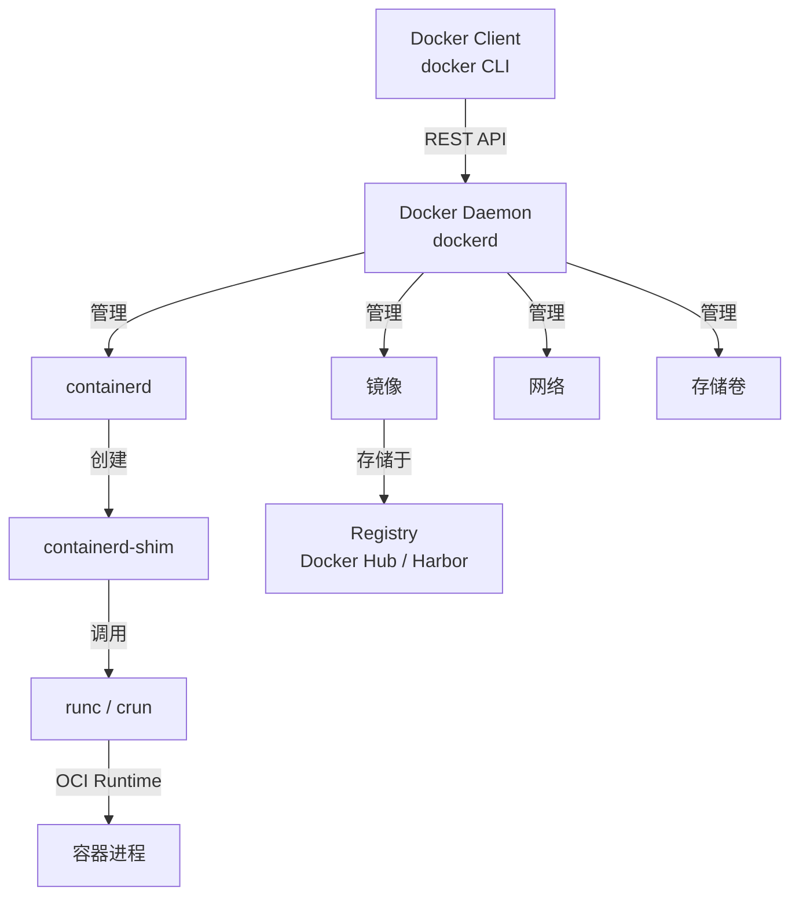
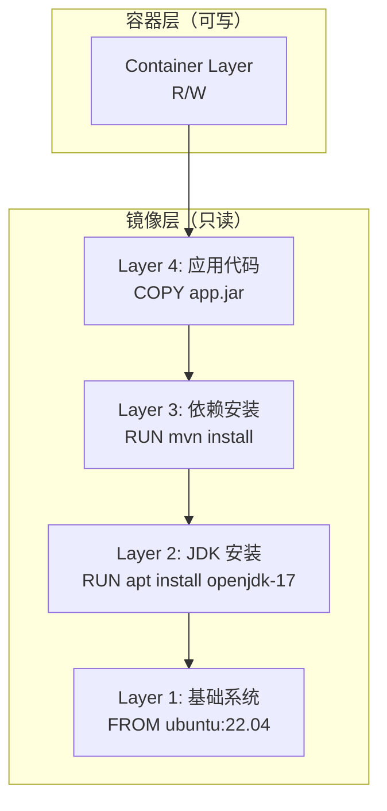
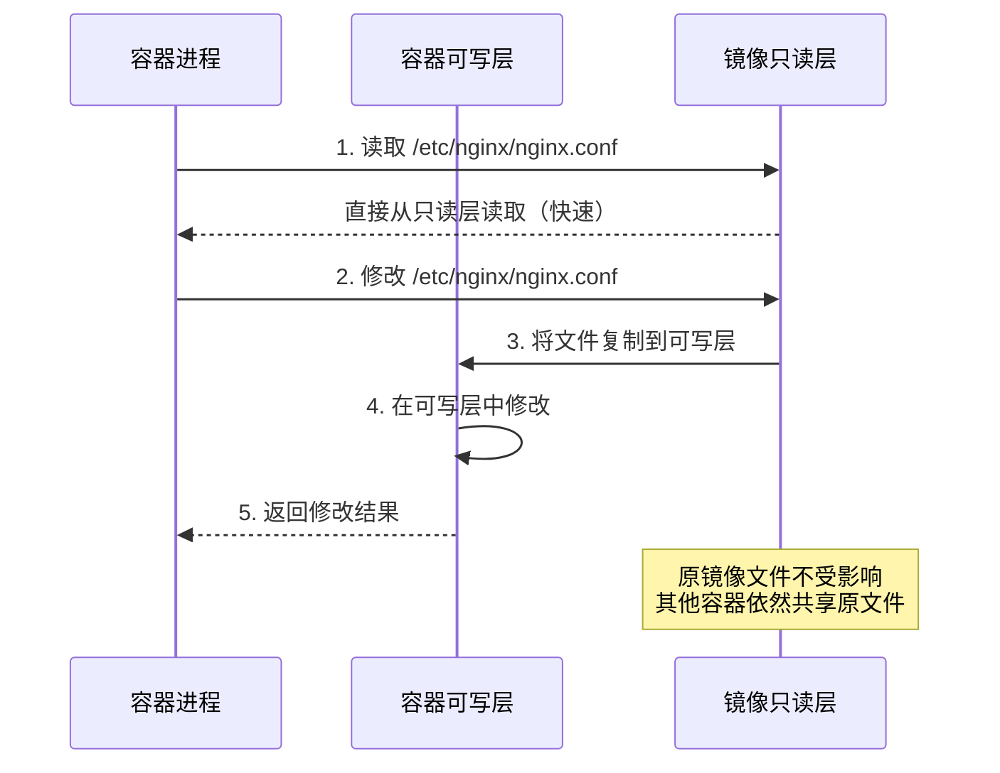

# Docker 核心原理

## ⭐ 面试重点速览

| 考点 | 频率 | 难度 | 考察方式 |
|------|------|------|----------|
| 镜像分层与 UnionFS 原理 | ⭐⭐⭐⭐⭐ | ⭐⭐⭐⭐ | 解释 docker build 的缓存机制，为什么改一行代码要重新下载依赖？ |
| 写时复制（CoW）机制 | ⭐⭐⭐⭐⭐ | ⭐⭐⭐⭐ | 容器为什么启动快？修改容器内文件会影响镜像吗？ |
| Dockerfile 最佳实践 | ⭐⭐⭐⭐⭐ | ⭐⭐⭐ | 给出 Dockerfile 找问题，命令顺序、层数优化 |
| 多阶段构建 | ⭐⭐⭐⭐ | ⭐⭐⭐ | 为什么需要多阶段构建？解决了什么问题？ |
| 镜像体积优化 | ⭐⭐⭐⭐ | ⭐⭐⭐ | 你的镜像从 800MB 优化到 100MB，做了什么？ |
| Namespace 与 Cgroup 隔离 | ⭐⭐⭐⭐⭐ | ⭐⭐⭐⭐ | Docker 和虚拟机的本质区别？ |

---

## 一、Docker 架构概览

Docker 采用 Client-Server 架构，核心由三部分组成：



::: tip 演进历史
早期 Docker Daemon 直接通过 LXC 管理容器。2015 年后拆分为 containerd + runc，符合 OCI（Open Container Initiative）标准。现在 containerd 已成为 CNCF 毕业项目，可独立使用（如 K8s 的 CRI 运行时）。
:::

---

## 二、镜像分层与联合文件系统

### 2.1 UnionFS 原理

Docker 镜像采用**分层存储**，每一层是只读的文件系统快照。底层是 UnionFS（Union File System），将多个目录/文件系统联合挂载为单一视图。



**关键结论：**
- **写时复制（CoW）**：当容器需要修改镜像中的文件时，先将文件从只读层复制到可写层，再在可写层修改。原镜像层不受影响。
- **层共享**：同一台宿主机上的多个容器，如果基于相同的基础镜像层，这些层在磁盘上只存一份，共享使用。
- **缓存加速**：`docker build` 时，若某一层未变化，Docker 直接复用缓存，跳过该层的构建。

### 2.2 存储驱动

Docker 支持多种 storage driver，推荐选择如下：

| 驱动 | 文件系统 | 适用场景 | 备注 |
|------|----------|----------|------|
| overlay2 | xfs / ext4 | **首选，所有主流发行版** | 内核 4.0+，性能最好 |
| devicemapper | direct-lvm | 旧版 CentOS/RHEL | 已弃用 |
| aufs | ext4/xfs | 旧版 Ubuntu | 已从主线内核移除 |
| btrfs / zfs | btrfs / zfs | 需要快照等高级功能 | 生产较少用 |

::: warning overlay2 注意
宿主机 `/var/lib/docker` 分区必须使用 xfs 或 ext4。若使用 xfs，格式化时需加 `-n ftype=1` 参数，否则 overlay2 无法工作。
:::

---

## 三、写时复制（Copy-on-Write）深入

CoW 是容器轻量化的核心机制。当容器需要修改文件时：



**实践影响：**
- 容器删除后，可写层的数据全部丢失。持久化数据必须通过 **Volume** 或 **Bind Mount**。
- 频繁写的目录（如日志、数据库）不应放在容器层，应挂载 Volume，避免 CoW 开销。
- `docker commit` 会将当前可写层固化为新的镜像层。
- 容器被删除后，可写层数据丢失。持久化需要 Volume。
- 写密集型目录（日志、数据库）应挂载 Volume，避免 CoW 性能开销。

---

## 四、Dockerfile 最佳实践

### 4.1 黄金法则

```dockerfile
# ❌ 反模式：一个 RUN 多层，缓存失效后全部重跑
FROM openjdk:17
RUN apt-get update
RUN apt-get install -y curl vim
RUN apt-get clean
COPY target/app.jar /app/app.jar
CMD ["java", "-jar", "/app/app.jar"]

# ✅ 最佳实践：合并 RUN、利用缓存
FROM openjdk:17-slim
RUN apt-get update && apt-get install -y --no-install-recommends \
    curl \
    && rm -rf /var/lib/apt/lists/*
    # 合并为单层，减少镜像层数；同时清理 apt 缓存减小体积
COPY target/app.jar /app/app.jar
CMD ["java", "-jar", "/app/app.jar"]
```

### 4.2 核心原则

| 原则 | 说明 | 实践 |
|------|------|------|
| **减少层数** | 每个指令产生一层，合并相关命令 | 多个 RUN 用 `&&` 连接 |
| **利用构建缓存** | 变动少的指令放前面 | 先 COPY `pom.xml`，再 `RUN mvn install`，最后 COPY 源码 |
| **最小化基础镜像** | `alpine` / `slim` 比 `latest` 小 90%+ | Java 项目用 `eclipse-temurin:17-jre-alpine` |
| **.dockerignore** | 排除不需要的文件 | 排除 `target/`、`.git/`、`node_modules/`、`*.log` |
| **非 root 运行** | 安全最佳实践 | `USER 1000` 或 `USER appuser` |
| **明确版本标签** | 避免 `latest` 漂移 | 使用 `openjdk:17.0.9-jre-slim` |

### 4.3 利用缓存的正确姿势

```dockerfile
# ✅ 利用 Docker 分层缓存：先复制依赖描述文件
FROM maven:3.9-eclipse-temurin-17 AS build
WORKDIR /app
# 第一步：只复制 pom.xml，下载依赖（这一层被缓存，除非 pom.xml 变更）
COPY pom.xml .
RUN mvn dependency:go-offline -B
# 第二步：复制源码并构建（源码变更，缓存失效，但依赖已缓存）
COPY src ./src
RUN mvn package -DskipTests -B
```

::: tip 缓存失效规则
一旦某一层发生变化，其后的所有层缓存全部失效。这就是为什么要把最不常变的操作放在前面——最大化缓存命中率。
:::

---

## 五、多阶段构建

多阶段构建在单个 Dockerfile 中使用多个 `FROM` 指令，**编译环境**与**运行环境**分离。

```dockerfile
# ============ 阶段一：构建阶段 ============
FROM maven:3.9-eclipse-temurin-17 AS builder
WORKDIR /app
COPY pom.xml .
RUN mvn dependency:go-offline -B
COPY src ./src
RUN mvn package -DskipTests -B

# ============ 阶段二：运行阶段 ============
FROM eclipse-temurin:17-jre-alpine AS runtime
WORKDIR /app
# 安装必要的运行时依赖（如字体、CA证书）
RUN apk add --no-cache ttf-dejavu ca-certificates
# 创建非 root 用户
RUN addgroup -S appgroup && adduser -S appuser -G appgroup
# 从构建阶段复制产物
COPY --from=builder /app/target/*.jar app.jar
USER appuser
EXPOSE 8080
# JVM 参数优化容器环境
CMD ["java", "-XX:+UseContainerSupport", "-XX:MaxRAMPercentage=75.0", "-jar", "app.jar"]
```

**多阶段构建的价值：**
1. **镜像体积缩小 80%+**：最终镜像不包含 JDK、Maven、源码、编译中间产物
2. **安全性提升**：攻击面减少（不包含编译工具链和源码）
3. **构建可复现**：构建环境和运行环境版本锁定

::: danger 常见错误
不要在 `runtime` 阶段 `COPY` 整个项目目录再编译，那样多阶段构建就失去了意义。只在 `builder` 阶段编译，`runtime` 阶段只复制最终产物。
:::

---

## 六、镜像优化技巧汇总

| 技巧 | 效果 | 示例 |
|------|------|------|
| **选择瘦基础镜像** | 体积从 600MB → 150MB | `eclipse-temurin:17-jre-alpine` |
| **多阶段构建** | 剔除编译工具链 | 见上节 |
| **合并 RUN 层** | 减少层数，缩小体积 | `RUN cmd1 && cmd2 && rm -rf /tmp/*` |
| **apt/apk 清理缓存** | 减少 50-200MB | `rm -rf /var/lib/apt/lists/*` |
| **--no-install-recommends** | 减少非必要依赖 | `apt install --no-install-recommends` |
| **JRE 代替 JDK** | 减少 100-200MB | 运行环境用 JRE 而非 JDK |
| **JLink 定制 JRE** | 只保留用到的模块 | `jlink --add-modules java.base,java.sql` |
| **.dockerignore** | 避免无用文件进镜像 | 排除 `.git/`、`target/`、`*.md` |
| **Docker Squash** | 合并所有层为单层 | `docker build --squash`（实验性） |

::: tip 实战建议
建议在你的 CI 流水线中增加镜像体积检查步骤（如 `docker image inspect` 取 Size 字段），当镜像超过阈值时阻断流水线，倒逼团队持续优化。
:::

---

## 七、与相关模块的交叉引用

| 知识点 | 相关模块 |
|--------|----------|
| Linux Namespace 隔离（PID/NET/MNT/UTS/IPC/User） | [Linux - 进程管理](./linux/process-management.md) |
| Cgroup 资源限制（CPU/内存/IO） | [Linux - 系统调优](./linux/system-tuning.md) |
| overlay2 存储驱动底层机制 | [Linux - 磁盘与 IO](./linux/disk-io.md) |
| 镜像仓库 Harbor 搭建 | [CI/CD 流水线](./cicd-pipeline.md) |
| 容器网络模型（CNM） | [Docker 网络](./docker-network.md) |

---

## 八、高频面试题

### Q1：Docker 镜像分层原理是什么？有什么好处？
**答案：** Docker 镜像由多个只读层叠加组成，每层对应 Dockerfile 中的一条指令（RUN/COPY/ADD）。底层采用 UnionFS 技术（如 overlay2）将多个目录联合挂载为一个视图。好处：（1）**层复用**——多个镜像可共享相同的基础层，节省磁盘空间和拉取带宽；（2）**构建缓存**——未变更的层直接复用缓存，加速构建；（3）**增量分发**——`docker push/pull` 只传输变更的层。

### Q2：写时复制（CoW）是如何工作的？容器删除后数据还在吗？
**答案：** 容器启动时，Docker 在镜像层之上添加一个薄的可写层（Container Layer）。当容器进程读取文件时，直接从只读镜像层读取；当需要修改文件时，先将文件从只读层**复制**到可写层，再在可写层中修改——这就是"写时复制"。删除容器后，可写层随之删除，其中的所有修改都会丢失。这就是为什么持久化数据必须使用 Volume 或 Bind Mount。

### Q3：多阶段构建解决什么问题？你的 Dockerfile 如何优化镜像体积？
**答案：** 多阶段构建解决了**构建依赖污染运行镜像**的问题。传统做法是在一个 Dockerfile 中完成编译和打包，最终镜像包含 JDK、Maven、源码等不必要的文件。多阶段构建用多个 `FROM` 指令分离编译环境（builder）和运行环境（runtime），最终镜像只包含运行时产物。典型优化路径：`openjdk:17`(600MB) → `openjdk:17-slim`(400MB) → `eclipse-temurin:17-jre-alpine`(180MB) → 多阶段构建+JLink裁剪(80MB)。

### Q4：Dockerfile 中 CMD 和 ENTRYPOINT 的区别？
**答案：** `CMD` 定义默认的容器启动命令和参数，可以被 `docker run` 后面的命令行参数覆盖。`ENTRYPOINT` 定义容器的主进程，不会被 `docker run` 参数覆盖（除非使用 `--entrypoint` 显式指定）。最佳实践：用 `ENTRYPOINT` 指定固定执行程序，用 `CMD` 指定默认参数。例如 `ENTRYPOINT ["java", "-jar", "app.jar"]` + `CMD ["--spring.profiles.active=prod"]`，用户可以通过 `docker run image --spring.profiles.active=dev` 覆盖参数但不会改变主程序。

### Q5：Docker 和虚拟机的本质区别是什么？
**答案：** 虚拟机在宿主机 OS 之上运行完整的 Guest OS（含独立内核），通过 Hypervisor 虚拟化硬件资源。Docker 容器直接共享宿主机内核，通过 Linux Namespace 实现进程/网络/文件系统等资源的隔离，通过 Cgroup 实现资源的限制。关键差异：（1）启动速度：容器秒级、虚拟机分钟级；（2）资源开销：容器几乎无额外开销、虚拟机需预留内存和磁盘；（3）隔离性：虚拟机强隔离（独立内核）、容器弱隔离（共享内核）；（4）跨平台：虚拟机可运行不同 OS、容器必须与宿主机同内核。

### Q6：如何排查 docker build 缓存未命中的问题？
**答案：** （1）用 `docker build --no-cache` 先确认是缓存问题；（2）检查 Dockerfile 中变动指令及其之前所有层的 hash 是否变化；（3）`COPY` / `ADD` 指令会计算源文件的 checksum，即使内容相同、时间戳不同也会导致缓存失效；（4）检查 `.dockerignore` 是否包含了无关文件导致上下文变化；（5）使用 `docker history <image>` 查看每层的构建时间和大小，定位重构建的层。