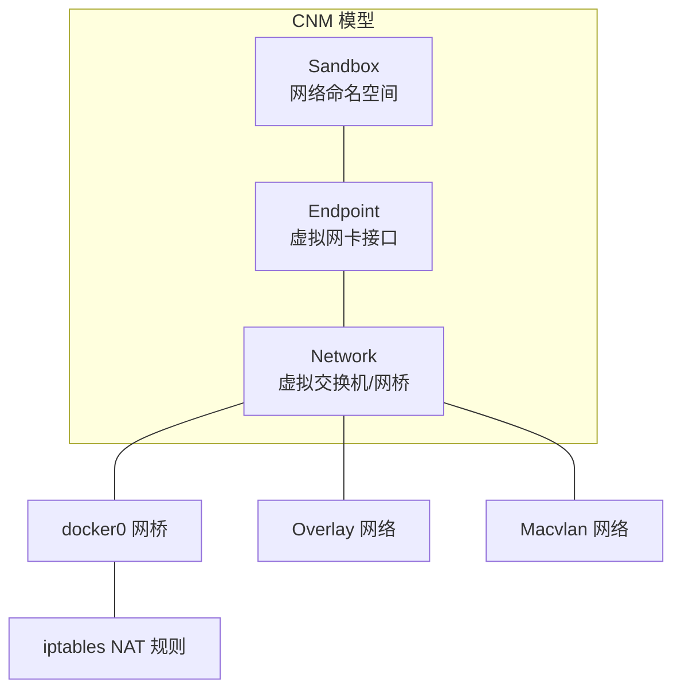
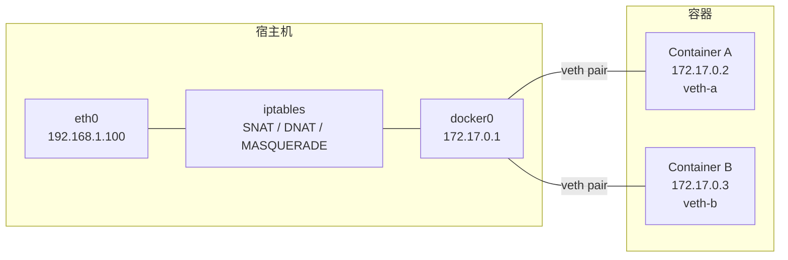
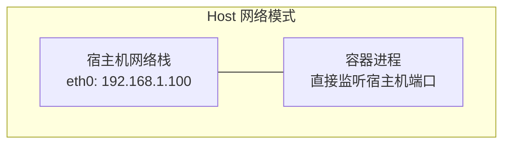
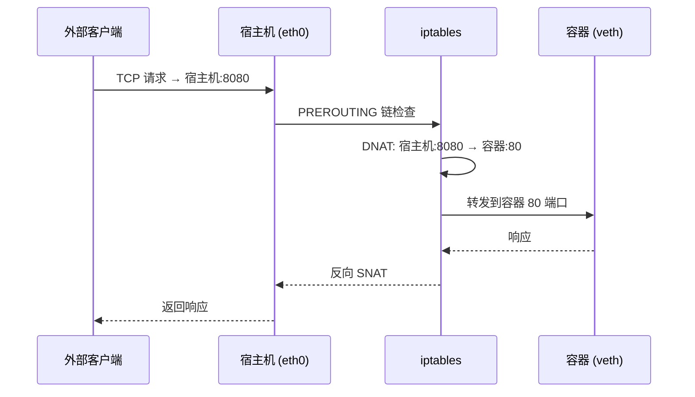
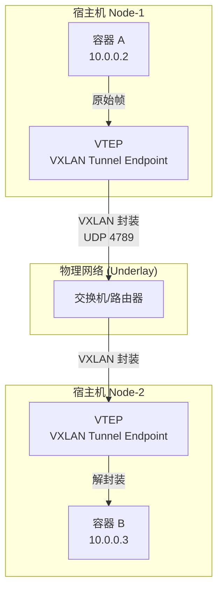
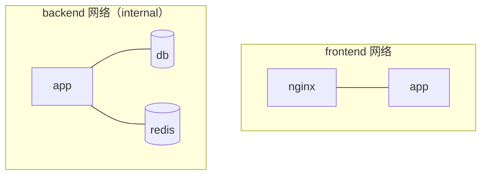

# Docker 网络

## ⭐ 面试重点速览

| 考点 | 频率 | 难度 | 考察方式 |
|------|------|------|----------|
| bridge / host / overlay / macvlan 四种模式区别 | ⭐⭐⭐⭐⭐ | ⭐⭐⭐⭐ | 给场景，选网络模式并解释理由 |
| 容器间通信原理（--link / 自定义网络 / DNS） | ⭐⭐⭐⭐ | ⭐⭐⭐ | 两个容器如何互相访问？ |
| 端口映射机制（-p 与 iptables DNAT） | ⭐⭐⭐⭐ | ⭐⭐⭐⭐ | `-p 8080:80` 背后发生了什么？ |
| docker-compose 网络默认行为 | ⭐⭐⭐⭐ | ⭐⭐⭐ | compose 中的服务如何互相发现？ |
| overlay 跨主机通信原理（VXLAN） | ⭐⭐⭐ | ⭐⭐⭐⭐⭐ | Swarm/K8s 中跨节点容器通信机制 |

---

## 一、Docker 网络模型总览

Docker 使用 CNM（Container Network Model）抽象网络，核心组件：



Docker 内置 5 种网络驱动：

| 驱动 | 通信范围 | 适用场景 |
|------|----------|----------|
| **bridge** | 单机容器间 | 默认模式，开发/测试环境 |
| **host** | 直接使用宿主机网络栈 | 高性能场景（网络密集型） |
| **none** | 无网络 | 安全隔离，仅需计算的容器 |
| **overlay** | 跨主机容器间 | Swarm 集群，多节点通信 |
| **macvlan** | 容器直接暴露在物理网络 | 需要物理网络直连的遗留系统 |

---

## 二、Bridge 网络模式（默认）

### 2.1 默认网桥 docker0



**默认 bridge 网络的特点：**
- 自动分配 `172.17.0.0/16` 网段
- 容器间通过 IP 通信，**不支持 DNS 自动服务发现**
- 出站流量通过 iptables MASQUERADE 做源地址转换（SNAT）
- 端口映射（`-p 8080:80`）通过 iptables DNAT 实现

```bash
# 查看 iptables 中 docker 的 NAT 规则
iptables -t nat -L DOCKER -n -v
```

::: warning 默认 bridge 的限制
默认 bridge 网络的容器间只能用 IP 互访，不支持 `--name` DNS 解析。生产环境强烈建议创建**自定义 bridge 网络**。
:::

### 2.2 自定义 Bridge 网络

```bash
# 创建自定义网络
docker network create --driver bridge \
  --subnet=10.10.0.0/16 \
  --gateway=10.10.0.1 \
  my-net

# 启动容器并加入自定义网络
docker run -d --name app-a --network my-net nginx
docker run -d --name app-b --network my-net nginx

# app-a 内部可直接通过容器名 ping app-b
docker exec app-a ping app-b  # ✅ 成功！
```

**自定义 bridge 的优势：**
- **内建 DNS 解析**：容器名自动解析为 IP（通过嵌入式 DNS 服务器 `127.0.0.11`）
- **网络隔离**：不同自定义网络间的容器默认无法通信
- **灵活配置**：可自定义子网、网关、IP 分配范围

---

## 三、Host 网络模式

Host 模式下，容器与宿主机**共享网络命名空间**，容器直接使用宿主机的 IP 和端口。

```bash
docker run --network host nginx
# nginx 直接监听宿主机的 80 端口，无需 -p 映射
```



::: danger Host 模式的坑
- **端口冲突**：容器端口直接占用宿主机端口，多容器不能同时监听同一端口
- **安全性**：容器绕过 Docker 网络隔离，拥有宿主机的网络权限
- **仅 Linux 支持**：macOS/Windows 上的 Docker Desktop 不支持真正的 host 模式（因为有 VM 中间层）
:::

**适用场景：** 网络密集型应用（如 API 网关、代理服务），需要极致网络性能，且端口规划不会冲突。

---

## 四、端口映射原理

`docker run -p 8080:80` 本质是在 iptables 中添加了两条规则：

```bash
# 实际执行的 iptables 规则（简化版）：
# 1. DNAT：将到达宿主机 8080 端口的流量转发到容器 IP 的 80 端口
iptables -t nat -A PREROUTING  -p tcp --dport 8080 -j DNAT \
  --to-destination 172.17.0.2:80
# 2. 允许转发该流量
iptables -t filter -A FORWARD -p tcp -d 172.17.0.2 --dport 80 -j ACCEPT
```



::: tip 随机端口映射
使用 `-P`（大写）自动将 Dockerfile 中 EXPOSE 的端口映射到宿主机随机高端口。适用于快速测试，生产环境建议显式指定。
:::

---

## 五、Overlay 网络（跨主机通信）

Overlay 网络使不同宿主机上的容器能直接通信，底层通过 **VXLAN 隧道**封装二层帧。



**Overlay 网络的特点：**
- 容器间通过 VXLAN 隧道透明通信，对应用层完全无感
- 需要 KV 存储（Consul/etcd/ZooKeeper）做服务发现和网络状态同步
- Docker Swarm 模式下自动创建 `ingress` overlay 网络
- K8s 的 Flannel/Calico 插件也基于类似的 Overlay 原理

::: warning 性能开销
VXLAN 封装/解封装带来 CPU 和 MTU 开销。MTU 需要降低 50 字节（VXLAN 头部），否则会导致分片，进一步降低性能。高性能场景可考虑 macvlan 或 Calico BGP 模式。
:::

---

## 六、Macvlan 网络

Macvlan 让容器直接获得物理网络的 MAC 地址和 IP，如同直接插在物理交换机上。

```bash
# 创建 macvlan 网络
docker network create -d macvlan \
  --subnet=192.168.1.0/24 \
  --gateway=192.168.1.1 \
  -o parent=eth0 \
  my-macvlan
```

**适用场景：**
- 遗留应用需要固定物理 IP
- 容器需要直接暴露在物理网络中（如监控、抓包）
- 性能要求极高，不能接受 NAT 和 Overlay 的开销

::: danger Macvlan 的局限
- 容器无法直接与宿主机通信（这是 macvlan 的设计特性，需要子接口或 macvlan bridge 模式解决）
- 需要网卡开启混杂模式（云环境通常不支持）
- 每个容器消耗物理网络的一个 IP 地址
:::

---

## 七、Docker Compose 网络

Docker Compose 默认会为每个项目创建一个独立的 bridge 网络。

```yaml
# docker-compose.yml
version: "3.8"
services:
  app:
    build: .
    ports:
      - "8080:8080"
    networks:
      - frontend
      - backend
    depends_on:
      - db
      - redis

  db:
    image: mysql:8.0
    environment:
      MYSQL_ROOT_PASSWORD: secret
    networks:
      - backend

  redis:
    image: redis:7-alpine
    networks:
      - backend

  nginx:
    image: nginx:alpine
    ports:
      - "80:80"
    networks:
      - frontend

networks:
  frontend:
    driver: bridge
  backend:
    driver: bridge
    internal: true  # 禁止出站流量，仅内部通信用
```



**Compose 网络的核心规则：**
- 不显式声明 `networks` 时，所有服务加入同一个默认网络，可通过**服务名**互相访问
- `internal: true` 让网络只能内网通信，不能访问外网——适合数据库网络
- 服务可同时加入多个网络，实现精细的网络隔离（如 app 同时连 frontend 和 backend）

::: tip Compose DNS 发现
Compose 内建 DNS 服务器，服务名即域名。`app` 服务访问数据库，直接用 `jdbc:mysql://db:3306/mydb`。
:::

---

## 八、与相关模块的交叉引用

| 知识点 | 相关模块 |
|--------|----------|
| iptables NAT 规则（DNAT/SNAT/MASQUERADE） | [Linux - 网络排障](./linux/network-troubleshooting.md) |
| VXLAN 隧道封装原理 | [Linux - 网络排障](./linux/network-troubleshooting.md) |
| K8s CNI 网络插件（Calico/Flannel） | [K8s 核心概念](./k8s-core.md) |
| Docker 核心概念（Namespace 网络隔离） | [Docker 核心原理](./docker-core.md) |
| 微服务间 RPC 调用与容器网络 | [微服务方法论 - 服务治理](../../spring-ecosystem/microservice-methodology/governance.md) |

---

## 九、高频面试题

### Q1：Docker 的 bridge、host、none 三种网络模式有什么区别？
**答案：** **bridge**（默认）为容器创建独立的网络命名空间，通过虚拟网桥 docker0 和 iptables NAT 规则实现容器间、容器与外界的通信。**host** 模式下容器与宿主机共享网络命名空间，直接使用宿主机 IP 和端口，性能最高但无网络隔离且端口易冲突。**none** 模式不给容器配置任何网络，只有 lo 回环接口，适用于不需要网络或需要自行配置网络的场景。选择策略：开发测试用 bridge，高性能网络服务用 host，安全沙箱用 none。

### Q2：docker run -p 8080:80 背后发生了什么？
**答案：** Docker 在 iptables 的 NAT 表和 Filter 表添加规则。（1）在 PREROUTING 链添加 DNAT 规则，将到达宿主机 8080 端口的 TCP 流量目标地址改写为容器 IP 的 80 端口。（2）在 FORWARD 链添加 ACCEPT 规则，允许转发该流量。（3）在 POSTROUTING 链通过 MASQUERADE 做源地址转换，确保响应流量能正确返回。可以通过 `iptables -t nat -L DOCKER -n` 查看具体规则。

### Q3：自定义 bridge 网络和默认 bridge 网络有什么区别？
**答案：** 核心区别有四点。（1）**DNS 解析**：自定义 bridge 支持内建 DNS（`127.0.0.11`），容器间可通过容器名互相通信；默认 bridge 只能用 IP 互访。（2）**网络隔离**：不同自定义网络间天然隔离；默认 bridge 上所有容器互通。（3）**配置灵活性**：自定义网络可指定子网、网关、IP 范围等参数。（4）**热连接**：自定义网络支持容器运行时动态加入/离开；默认 bridge 需要停止容器后重新连接。

### Q4：docker-compose 中多个服务如何互相发现？
**答案：** Docker Compose 默认创建一个以项目名命名的 bridge 网络，所有服务自动加入该网络。Compose 内置 DNS 服务器，将**服务名**解析为容器 IP。例如 `app` 服务连接 `db` 服务，直接用 `db:3306` 作为数据库地址（Dockerfile 中写 `jdbc:mysql://db:3306/mydb`）。可以定义多个自定义网络实现网络隔离——如让 `app` 连接 `frontend` 和 `backend` 两个网络，而 `db` 只连 `backend`。

### Q5：Overlay 网络是如何实现跨主机容器通信的？
**答案：** Overlay 网络通过 VXLAN（Virtual Extensible LAN）技术实现。核心机制：（1）在每个节点创建 VTEP（VXLAN Tunnel Endpoint），作为 VXLAN 隧道的出口/入口。（2）容器发出的二层以太网帧被 VTEP 封装在 UDP 包中（目标端口 4789），通过物理网络（Underlay）传输到目标节点。（3）目标节点的 VTEP 解封装 VXLAN 包，还原原始二层帧并转发给目标容器。整个过程对容器透明，容器以为自己在同一个二层网络中。Docker Swarm 和 K8s 的 Flannel 都基于此原理。

### Q6：如何排查容器网络不通的问题？
**答案：** 按以下顺序排查。（1）`docker inspect <container>` 检查容器的网络配置（IP、网关、DNS）是否正确。（2）`docker exec <container> ping <target_ip>` 测试网络层连通性。（3）`docker exec <container> nslookup <target_name>` 测试 DNS 解析是否正常。（4）宿主机上 `iptables -t nat -L -n -v` 检查 NAT 规则是否正确。（5）`tcpdump -i docker0` 在宿主机 docker0 网桥上抓包分析流量走向。（6）检查 `ip_forward`（`sysctl net.ipv4.ip_forward`）是否开启，它是容器出站流量的前提。