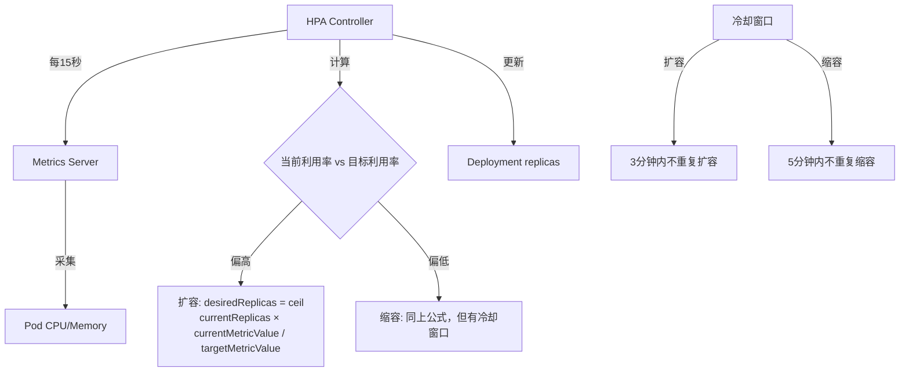
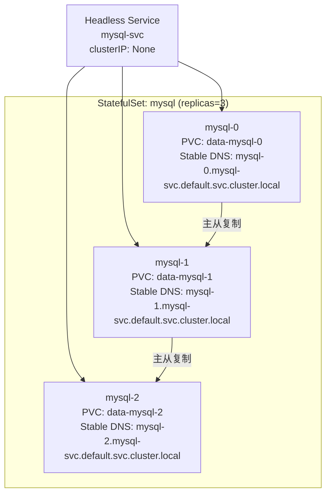
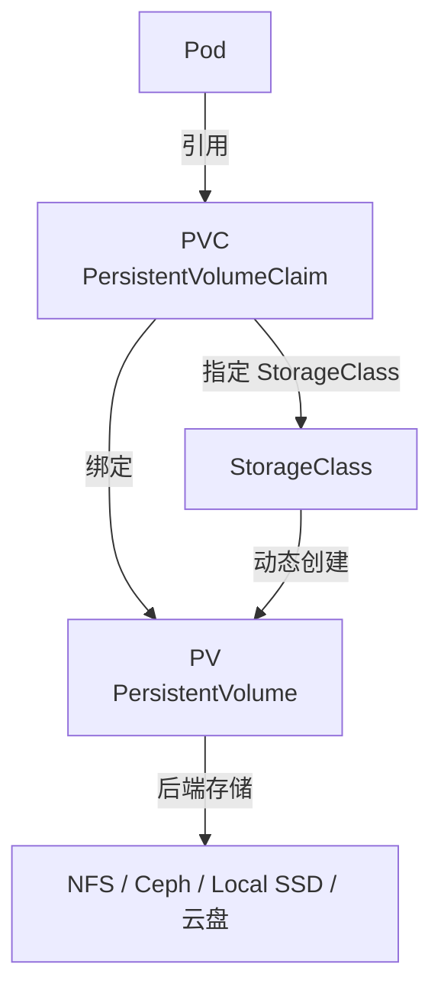
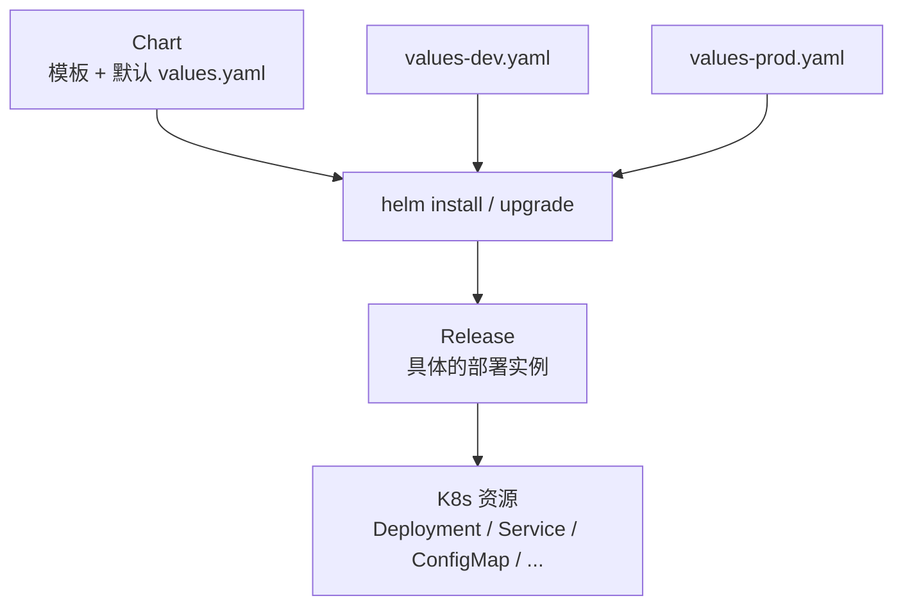
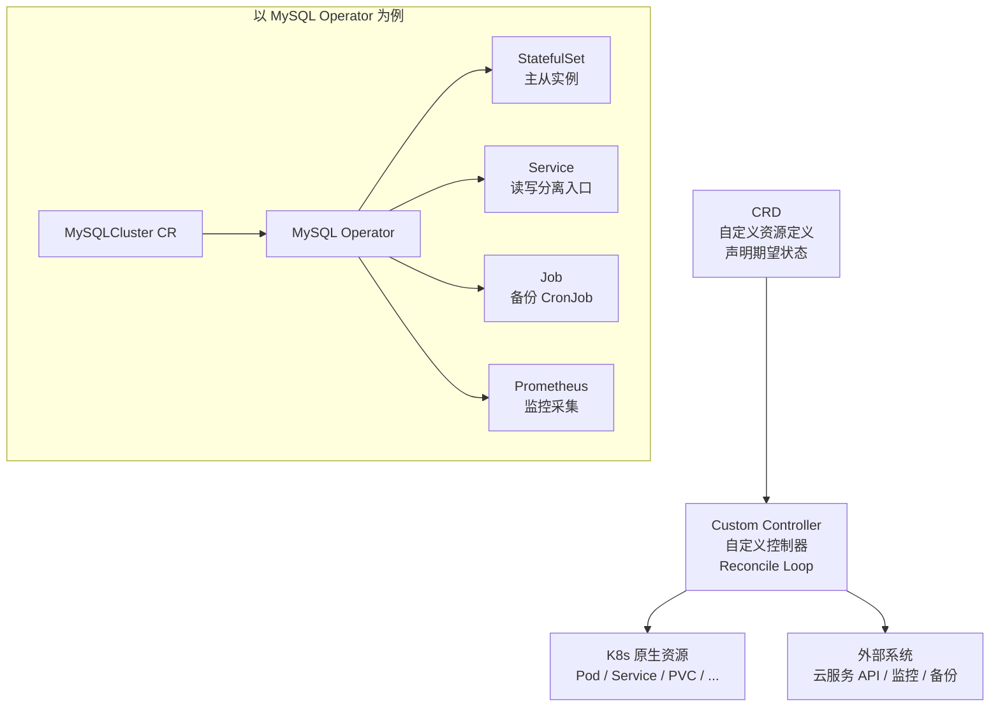

# Kubernetes 进阶

## ⭐ 面试重点速览

| 考点 | 频率 | 难度 | 考察方式 |
|------|------|------|----------|
| HPA 原理与扩缩容决策过程 | ⭐⭐⭐⭐⭐ | ⭐⭐⭐⭐ | HPA 如何计算目标副本数？怎么和 VPA 配合？ |
| StatefulSet 的 Pod 命名与启动顺序 | ⭐⭐⭐⭐ | ⭐⭐⭐ | 为什么说 StatefulSet Pod 有"身份"？与 Deployment 的区别？ |
| PV/PVC/StorageClass 动态供给 | ⭐⭐⭐⭐⭐ | ⭐⭐⭐⭐ | PVC 处于 Pending 状态的排查思路？ |
| Helm Chart 结构与模板语法 | ⭐⭐⭐⭐ | ⭐⭐⭐ | 如何用 Helm 管理多环境（dev/staging/prod）？ |
| Operator 模式与 CRD | ⭐⭐⭐ | ⭐⭐⭐⭐⭐ | Operator 解决了什么问题？和 Helm 的区别？ |
| 资源配额与 LimitRange | ⭐⭐⭐ | ⭐⭐⭐ | 如何防止某个 Pod 吃光集群资源？ |

---

## 一、HPA —— 水平自动扩缩容

HPA（Horizontal Pod Autoscaler）根据观察到的指标（CPU/内存/自定义指标）自动调整 Deployment 或 StatefulSet 的副本数。



**HPA 配置示例：**

```yaml
apiVersion: autoscaling/v2
kind: HorizontalPodAutoscaler
metadata:
  name: my-app-hpa
spec:
  scaleTargetRef:
    apiVersion: apps/v1
    kind: Deployment
    name: my-app
  minReplicas: 2
  maxReplicas: 10
  metrics:
    - type: Resource
      resource:
        name: cpu
        target:
          type: Utilization
          averageUtilization: 70       # 目标 CPU 使用率 70%
    - type: Resource
      resource:
        name: memory
        target:
          type: Utilization
          averageUtilization: 80       # 目标内存使用率 80%
  behavior:
    scaleDown:
      stabilizationWindowSeconds: 300 # 缩容前观察 5 分钟，避免抖动
      policies:
        - type: Percent
          value: 50                    # 每次最多缩容 50% 的 Pod
          periodSeconds: 60
    scaleUp:
      stabilizationWindowSeconds: 0
      policies:
        - type: Percent
          value: 100                   # 每次最多翻倍
          periodSeconds: 30
```

**扩容公式：**

```
期望副本数 = ceil(当前副本数 × 当前指标值 / 目标指标值)

例如：当前 2 个 Pod，CPU 使用率 90%，目标 70%
期望副本数 = ceil(2 × 90 / 70) = ceil(2.57) = 3
```

::: warning HPA 的前提条件
1. 必须部署 **Metrics Server**（`kubectl top pods` 能显示数据）。
2. Pod 必须设置 **resources.requests**（否则 HPA 无法计算使用率，基于请求值的百分比才有意义）。
3. 应用架构必须支持水平扩展（无状态、无本地会话依赖）。
:::

::: tip HPA + VPA 组合
HPA 处理流量波动（加 Pod），VPA（Vertical Pod Autoscaler）处理资源配置（调 CPU/内存 request）。两者互补，但需注意同时使用时的冲突——VPA 调整资源会滚动更新 Pod，可能与 HPA 决策窗口重叠。
:::

---

## 二、StatefulSet —— 有状态应用

StatefulSet 专为有状态应用设计（数据库、消息队列、分布式存储），每个 Pod 拥有**稳定身份**。



**StatefulSet 核心特性：**

| 特性 | Deployment | StatefulSet |
|------|------------|-------------|
| Pod 命名 | 随机后缀 `my-app-6d4f8c9b-xyz` | 有序序号 `mysql-0`, `mysql-1`, `mysql-2` |
| Pod 网络标识 | IP 可变，无稳定 DNS | 稳定的 DNS 名称（即使重建，名称不变） |
| 存储 | 共享 PVC 或无存储 | 每个 Pod 独立 PVC，重建后绑定同一 PVC |
| 启动/停止顺序 | 并行 | 顺序启动（0→1→2），逆序停止（2→1→0） |
| 扩缩容 | 任意 Pod 可随时增删 | 只能从最大序号开始缩容 |

```yaml
apiVersion: apps/v1
kind: StatefulSet
metadata:
  name: mysql
spec:
  serviceName: mysql-svc       # 关联 Headless Service
  replicas: 3
  podManagementPolicy: OrderedReady  # 或 Parallel（并行启动）
  selector:
    matchLabels:
      app: mysql
  template:
    metadata:
      labels:
        app: mysql
    spec:
      containers:
        - name: mysql
          image: mysql:8.0
          volumeMounts:
            - name: data
              mountPath: /var/lib/mysql
  volumeClaimTemplates:        # 为每个 Pod 自动创建 PVC
    - metadata:
        name: data
      spec:
        accessModes: ["ReadWriteOnce"]
        resources:
          requests:
            storage: 50Gi
```

::: danger StatefulSet 缩容的危险
StatefulSet 缩容时从最大序号开始，且**不会自动删除对应的 PVC**——这是故意设计的，防止误删数据。手动删除 PVC 才能彻底清理数据。
:::

---

## 三、PV / PVC / StorageClass —— 持久化存储

K8s 的存储抽象层次：



### 3.1 静态供给

管理员手动创建 PV，用户创建 PVC 绑定 PV：

```yaml
# PV（管理员创建）
apiVersion: v1
kind: PersistentVolume
metadata:
  name: nfs-pv
spec:
  capacity:
    storage: 100Gi
  accessModes:
    - ReadWriteMany
  nfs:
    server: 192.168.1.100
    path: /data/nfs
---
# PVC（用户创建）
apiVersion: v1
kind: PersistentVolumeClaim
metadata:
  name: my-pvc
spec:
  accessModes:
    - ReadWriteMany
  resources:
    requests:
      storage: 50Gi       # 请求 50G，会绑定到 100G 的 PV（最佳匹配）
```

### 3.2 动态供给（推荐）

通过 StorageClass 自动创建 PV，无需管理员手动干预：

```yaml
apiVersion: storage.k8s.io/v1
kind: StorageClass
metadata:
  name: fast-ssd
provisioner: kubernetes.io/aws-ebs   # 或 ceph.com/rbd、nfs-client 等
parameters:
  type: gp3
  fsType: ext4
reclaimPolicy: Delete               # 删除 PVC 时自动删除 PV
allowVolumeExpansion: true          # 允许在线扩容
---
# PVC 指定 StorageClass，自动触发动态创建 PV
apiVersion: v1
kind: PersistentVolumeClaim
metadata:
  name: dynamic-pvc
spec:
  storageClassName: fast-ssd        # 关联 StorageClass
  accessModes:
    - ReadWriteOnce
  resources:
    requests:
      storage: 20Gi
```

**AccessMode 说明：**

| 模式 | 缩写 | 说明 |
|------|------|------|
| ReadWriteOnce | RWO | 单个节点读写挂载（最常见） |
| ReadOnlyMany | ROX | 多节点只读挂载 |
| ReadWriteMany | RWX | 多节点读写挂载（需要 NFS/CephFS 等共享文件系统） |

::: tip PVC Pending 排查清单
1. 检查 StorageClass 是否存在、provisioner 是否正常运行。2. 检查 PVC 的 accessModes 和 storage 是否有匹配的 PV 或 StorageClass 能动态创建。3. 检查后端存储配额是否用完。4. `kubectl describe pvc` 查看 Events 中的具体错误信息。
:::

---

## 四、Helm —— K8s 包管理器

Helm 之于 K8s，就像 apt/yum 之于 Linux。它用 Chart 模板化 K8s 资源清单，用 Release 管理部署实例。



**Chart 目录结构：**

```
my-chart/
├── Chart.yaml          # Chart 元数据（名称、版本、依赖）
├── values.yaml         # 默认配置值
├── templates/          # K8s 资源模板（Go Template 语法）
│   ├── deployment.yaml
│   ├── service.yaml
│   ├── configmap.yaml
│   ├── ingress.yaml
│   ├── _helpers.tpl   # 可复用的模板函数
│   └── NOTES.txt      # 安装后的提示信息
└── charts/            # 子 Chart 依赖
```

**模板示例：**

```yaml
# templates/deployment.yaml
apiVersion: apps/v1
kind: Deployment
metadata:
  name: {{ .Release.Name }}-{{ .Chart.Name }}
spec:
  replicas: {{ .Values.replicaCount }}
  template:
    spec:
      containers:
        - name: {{ .Chart.Name }}
          image: "{{ .Values.image.repository }}:{{ .Values.image.tag }}"
          resources:
            {{- toYaml .Values.resources | nindent 12 }}
# - 表示删除前后空白字符
# toYaml 将 Values 中的 map 转换为 YAML 形式
# nindent 12 表示缩进 12 个空格
```

**多环境管理：**

```bash
# 安装到开发环境
helm install my-app ./my-chart -f values-dev.yaml -n dev --create-namespace

# 安装到生产环境
helm install my-app ./my-chart -f values-prod.yaml -n prod --create-namespace

# 滚动升级
helm upgrade my-app ./my-chart -f values-prod.yaml -n prod

# 回滚到上一版本
helm rollback my-app 1 -n prod
```

::: tip Helm vs Kustomize
Helm 适合打包分发（公共 Chart 仓库），模板化能力强但语法复杂；Kustomize 适合配置覆盖（base + overlay 模式），纯 YAML，已内置在 kubectl 中（`kubectl apply -k`）。团队内部管理建议 Kustomize，对外分发用 Helm。
:::

---

## 五、Operator 模式简介

Operator 是 K8s 的最高级抽象——用 CRD（Custom Resource Definition）+ 自定义控制器，将运维操作编码为软件。



**Operator 与 Helm 的区别：**

| 维度 | Helm | Operator |
|------|------|----------|
| 处理时机 | 安装/升级时一次性 | **持续运行**，全生命周期管理 |
| 运维知识 | 人工掌握 | 编码进 Operator |
| 复杂操作 | 不支持（如主从切换、数据备份） | 支持（自动化 Day 2 操作） |
| 适用场景 | 无状态应用 | 有状态应用（数据库、中间件） |
| 开发难度 | 低（模板语法） | 高（需要编写控制器逻辑） |

::: tip Operator 生态
流行的 Operator：Prometheus Operator（自动管理 Prometheus 实例和规则）、Strimzi（Kafka Operator）、Zalando Postgres Operator、Elastic Cloud on Kubernetes（ECK）。OperatorHub.io 是 Operator 的公共市场。
:::

---

## 六、资源配额与 LimitRange

防止资源滥用是生产集群的必备措施：

```yaml
# ResourceQuota —— 限制整个 Namespace 的资源总量
apiVersion: v1
kind: ResourceQuota
metadata:
  name: team-quota
  namespace: team-a
spec:
  hard:
    requests.cpu: "20"
    requests.memory: 40Gi
    limits.cpu: "40"
    limits.memory: 80Gi
    persistentvolumeclaims: "10"
    pods: "50"
    services: "10"
---
# LimitRange —— 给 Pod 设置默认的 request/limit
apiVersion: v1
kind: LimitRange
metadata:
  name: default-limits
  namespace: team-a
spec:
  limits:
    - type: Container
      default:
        cpu: "500m"
        memory: "512Mi"
      defaultRequest:
        cpu: "200m"
        memory: "256Mi"
      max:
        cpu: "4"
        memory: "8Gi"
      min:
        cpu: "50m"
        memory: "64Mi"
```

::: danger OOMKilled 的根源
Pod 的 memory limit 设置过低，一旦超过就被 OOM Killer 杀掉。表现为 Pod 反复重启，Events 中显示 `OOMKilled`。解决方案：增大 limit 或优化应用内存使用。Java 应用设置 `-XX:MaxRAMPercentage=75.0` 让 JVM 在容器限制内工作。
:::

---

## 七、与相关模块的交叉引用

| 知识点 | 相关模块 |
|--------|----------|
| K8s 核心资源（Pod/Deployment/Service） | [K8s 核心概念](./k8s-core.md) |
| 存储底层（NFS/Ceph/本地磁盘） | [Linux - 磁盘与 IO](./linux/disk-io.md) |
| Helm 与 CI/CD 集成 | [CI/CD 流水线](./cicd-pipeline.md) |
| 微服务容器化部署策略 | [微服务方法论](../../spring-ecosystem/microservice-methodology/index.md) |
| 高并发下的弹性伸缩 | [高并发架构](../../high-concurrency/index.md) |

---

## 八、高频面试题

### Q1：HPA 如何决定何时扩缩容？有哪些防止抖动的机制？
**答案：** HPA 每 15 秒从 Metrics Server 获取指标数据并计算：`期望副本数 = ceil(当前副本数 × 当前指标值 / 目标指标值)`。例如 CPU 目标 70%，当前 90%，副本数 2，则期望 = ceil(2 × 90/70) = 3。防抖机制包括：（1）**冷却窗口**——扩容后 3 分钟内不再扩容，缩容后 5 分钟内不再缩容；（2）**缩容稳定窗口**——缩容前连续观察 5 分钟（默认 300 秒），指标持续低于阈值才执行；（3）**扩缩容策略**——可配置每次扩缩容的绝对数量或百分比上限。K8s 1.18+ 还支持基于自定义指标（Prometheus、Kafka Lag）的 HPA。

### Q2：StatefulSet 的 Pod 为什么有"稳定身份"？与 Deployment 的本质区别？
**答案：** StatefulSet 的每个 Pod 有稳定的序号（0, 1, 2...）和基于序号的 DNS 名称（如 `mysql-0.mysql-svc.default.svc.cluster.local`）。即使 Pod 被删除重建，名称、DNS、绑定的 PVC 都不变。Deployment 的 Pod 名称包含随机后缀，每次重建都变化。本质区别：StatefulSet 假定 Pod 是**不可互换**的（mysql-0 是主库，mysql-1 是从库），Deployment 假定 Pod 是**完全可互换**的（任何一个 Pod 都能处理请求）。因此 StatefulSet 适用于数据库、消息队列等有状态应用。

### Q3：PVC 处于 Pending 状态怎么排查？
**答案：** 按以下顺序排查。（1）`kubectl describe pvc <name>` 查看 Events 消息。（2）如果是静态供给：检查是否有 PV 满足 PVC 的 accessModes、storage 要求，PV 是否已被其他 PVC 绑定。（3）如果是动态供给：检查指定的 StorageClass 是否存在且 provisioner 正在运行（`kubectl get pods -n kube-system | grep provisioner`）。（4）检查 provisioner 的日志是否有错误（如云厂商 API 配额耗尽、后端存储容量不足）。（5）确认 PVC 的 accessModes 被后端存储支持——本地磁盘不支持 RWX。

### Q4：Helm 的 values.yaml、Chart.yaml、templates/ 分别是什么作用？
**答案：** **Chart.yaml** 是 Chart 的元数据文件，包含 Chart 名称、版本号（semver）、API 版本（v2）、依赖声明等。**values.yaml** 是默认配置值文件，模板中 `{ { .Values.xxx } }` 引用的默认值都由此文件提供。**templates/** 目录存放 K8s 资源模板，使用 Go Template 语法，结合 values.yaml 的值渲染出最终的 K8s YAML。用户可通过 `-f custom-values.yaml` 或 `--set key=value` 覆盖默认值。三者关系：Chart.yaml 定义我是谁，values.yaml 定义默认配置，templates/ 定义资源结构。

### Q5：Operator 模式是什么？解决了什么问题？
**答案：** Operator 模式 = CRD（自定义资源） + 自定义控制器。它将人类运维知识编码为软件，实现有状态应用的自动化运维。解决的问题：Helm 只能处理 Day 1 操作（安装、升级），无法处理 Day 2 操作（主从切换、数据备份恢复、滚动扩缩容等复杂运维）。例如 MySQL Operator 会监控 MySQL 集群状态，主库故障时自动执行选举和切换，配置读写分离入口，定期备份并验证恢复。Operator 的核心就是持续运行的 Reconcile Loop：观察当前状态 → 对比期望状态 → 执行操作使两者一致。

### Q6：Pod 被 OOMKilled 该如何分析和解决？
**答案：** （1）`kubectl describe pod` 查看 State 中是否有 `OOMKilled` 和 Exit Code 137（128+9，SIGKILL）。（2）`kubectl top pod` 观察当前内存使用是否接近 limit。（3）检查 `resources.limits.memory` 设置是否合理——Java 应用的 JVM 堆 + Metaspace + 堆外内存的总和不要超过 limit。（4）Java 应用添加 `-XX:+UseContainerSupport -XX:MaxRAMPercentage=75.0` 让 JVM 感知容器内存限制。（5）分析内存泄漏：dump 堆快照（`jmap`）或开启 Native Memory Tracking。（6）短期解决：增大 memory limit；长期解决：定位并修复内存问题。