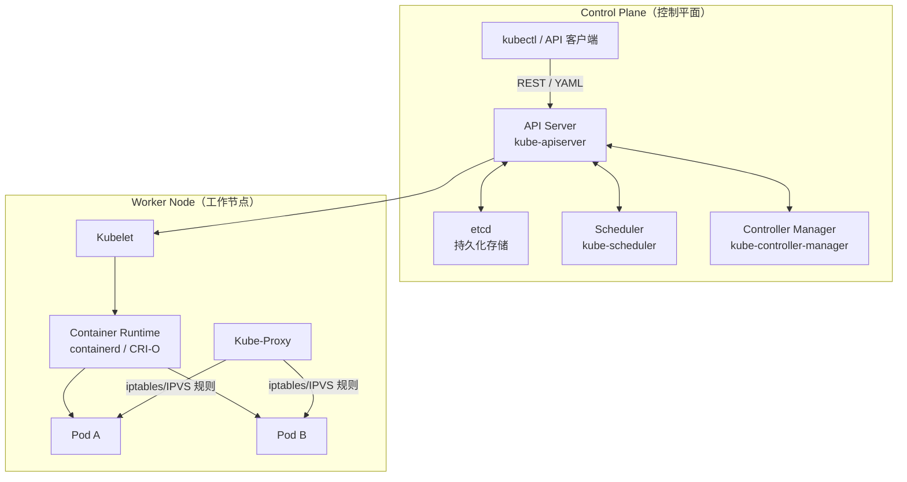
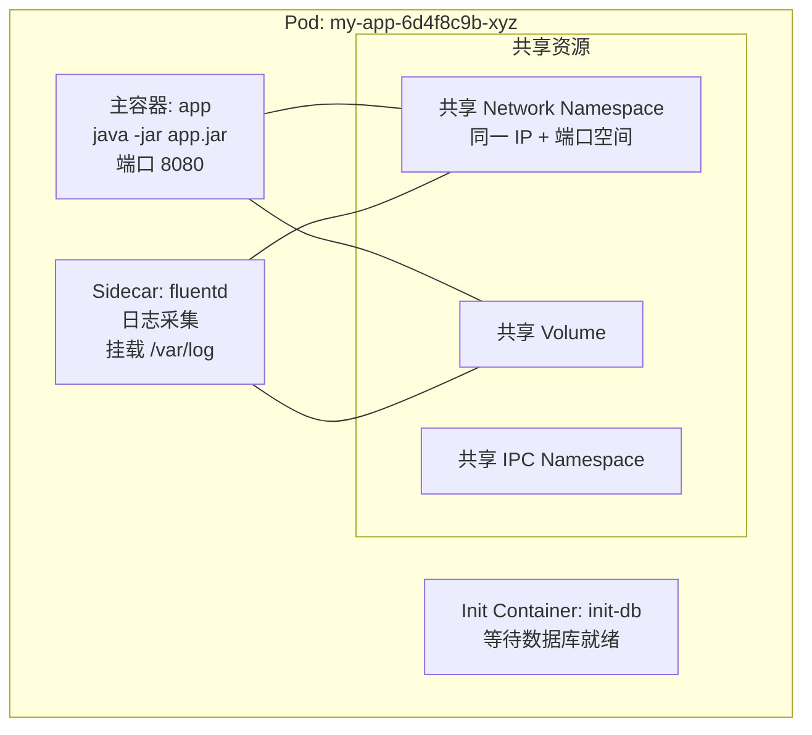
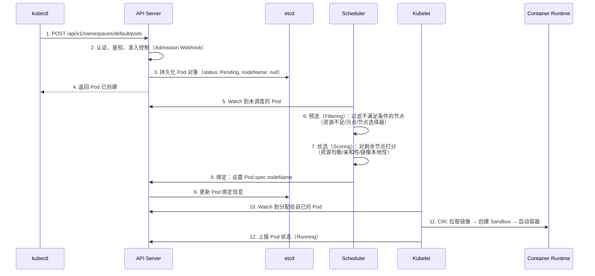
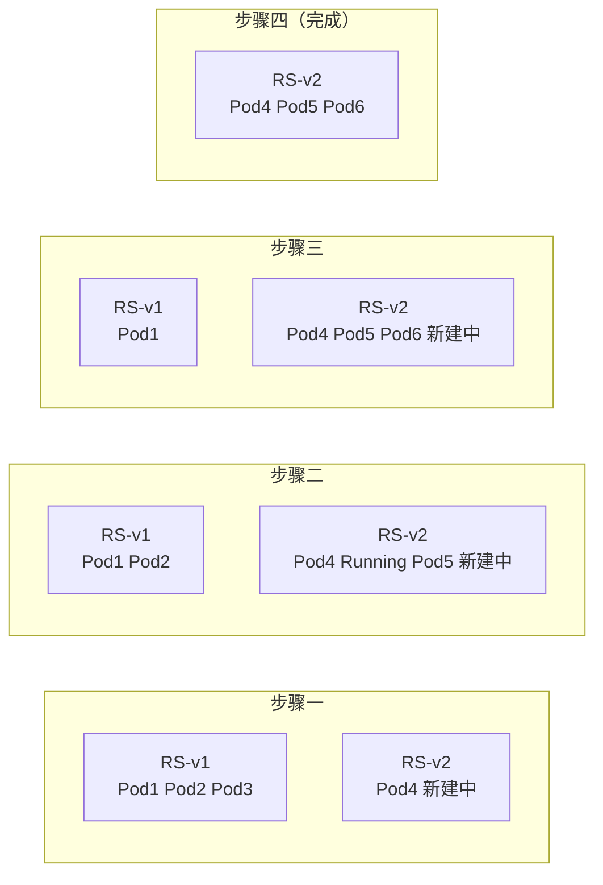
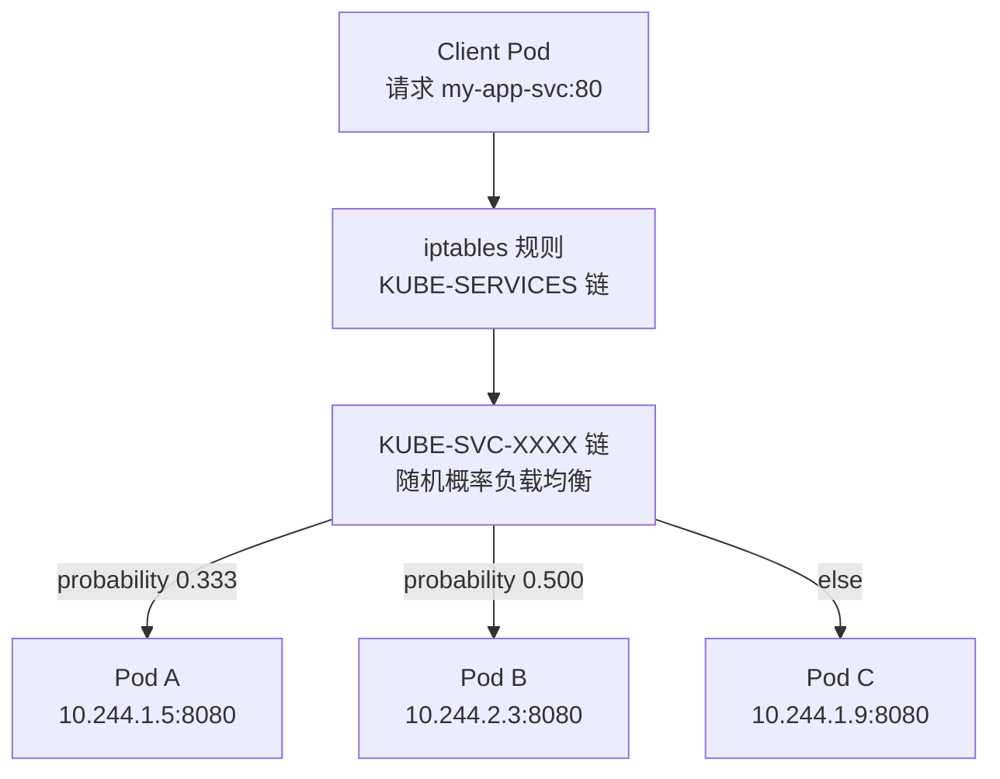
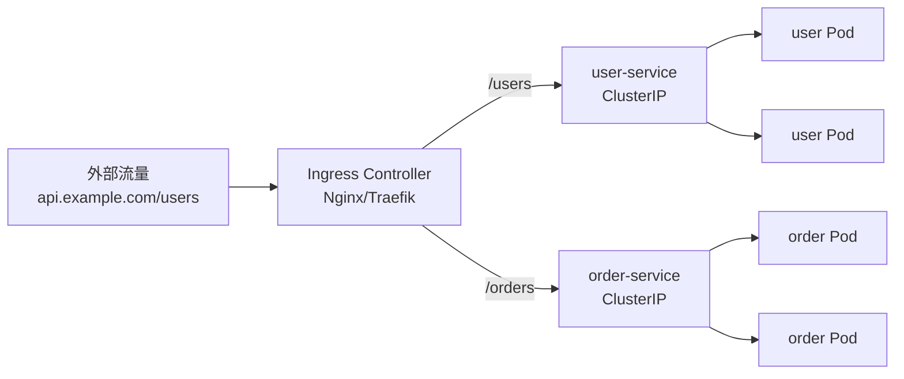
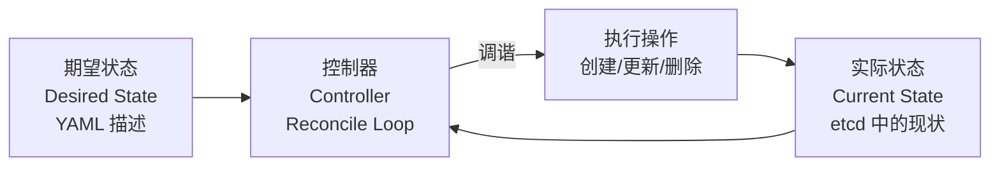

# Kubernetes 核心概念

## ⭐ 面试重点速览

| 考点 | 频率 | 难度 | 考察方式 |
|------|------|------|----------|
| Pod 创建全流程（API Server → Scheduler → Kubelet） | ⭐⭐⭐⭐⭐ | ⭐⭐⭐⭐⭐ | 画出完整流程图，解释每一步的组件和交互 |
| Deployment 滚动更新机制（maxSurge/maxUnavailable） | ⭐⭐⭐⭐⭐ | ⭐⭐⭐⭐ | 给定参数，算出滚动更新期间的 Pod 数量变化 |
| Service 负载均衡原理（iptables vs IPVS） | ⭐⭐⭐⭐⭐ | ⭐⭐⭐⭐ | ClusterIP 如何实现？为什么 Service 没有"慢启动"？ |
| Ingress 与 Service 的关系 | ⭐⭐⭐⭐ | ⭐⭐⭐ | Ingress 如何将外部流量路由到 Service？ |
| ConfigMap / Secret 的使用和更新 | ⭐⭐⭐⭐ | ⭐⭐⭐ | ConfigMap 更新后 Pod 如何感知？ |
| 声明式 API 与控制器模式 | ⭐⭐⭐⭐ | ⭐⭐⭐⭐ | 为什么 K8s 是声明式而非命令式？这个设计的好处？ |

---

## 一、K8s 架构总览



::: tip 控制平面组件
Master 节点上的四个核心组件：**API Server**（一切交互的入口）、**etcd**（存储所有集群状态）、**Scheduler**（决定 Pod 调度到哪个节点）、**Controller Manager**（运行各种控制器，确保实际状态向期望状态收敛）。
:::

---

## 二、Pod —— 最小调度单元

Pod 是 K8s 中**可调度的最小单元**，包含一个或多个紧密耦合的容器。



**Pod 的设计哲学：**
- 同一 Pod 内的容器共享 Network Namespace，通过 `localhost` 互访
- 同一 Pod 内的容器共享存储卷，适合 Sidecar 模式（日志采集、代理注入）
- Pod 是临时性的，随时可能被驱逐、重建，IP 会变化
- Init Container 在主容器启动前按序执行，可用于初始化操作

```yaml
apiVersion: v1
kind: Pod
metadata:
  name: sidecar-demo
spec:
  initContainers:
    - name: init-check
      image: busybox
      command: ['sh', '-c', 'until nslookup mydb; do sleep 2; done']
  containers:
    - name: app
      image: myapp:latest
      ports:
        - containerPort: 8080
    - name: log-collector
      image: fluentd:latest
      volumeMounts:
        - name: log-volume
          mountPath: /var/log
  volumes:
    - name: log-volume
      emptyDir: {}
```

---

## 三、Pod 调度全流程



::: warning 调度失败的原因
常见调度失败：（1）资源不足（CPU/内存请求无法满足）；（2）节点有污点（Taint）且 Pod 无容忍（Toleration）；（3）NodeSelector / NodeAffinity 不匹配；（4）PVC 需要的 StorageClass 在节点不可用。通过 `kubectl describe pod` 查看 Events 可定位原因。
:::

---

## 四、Deployment —— 无状态应用控制器

Deployment 管理 ReplicaSet，ReplicaSet 管理 Pod。三层抽象共同实现了声明式副本管理。

```yaml
apiVersion: apps/v1
kind: Deployment
metadata:
  name: my-app
spec:
  replicas: 3
  selector:
    matchLabels:
      app: my-app
  strategy:
    type: RollingUpdate
    rollingUpdate:
      maxSurge: 1        # 滚动更新期间最多超出期望副本数 1 个
      maxUnavailable: 0  # 滚动更新期间最多不可用副本数为 0
  template:
    metadata:
      labels:
        app: my-app
    spec:
      containers:
        - name: app
          image: myapp:v2
          ports:
            - containerPort: 8080
          readinessProbe:
            httpGet:
              path: /actuator/health
              port: 8080
            initialDelaySeconds: 10
            periodSeconds: 5
```

**滚动更新过程（replicas=3, maxSurge=1, maxUnavailable=0）：**



::: tip Readiness Probe 的重要性
没有 Readiness Probe 时，容器启动即被加入 Service 的 Endpoint，可能接收到流量但应用尚未初始化完成，导致请求失败。务必配置 Readiness Probe 确保流量只到达就绪的 Pod。
:::

---

## 五、Service —— 服务发现与负载均衡

Pod IP 会变，Service 提供稳定的虚拟 IP（ClusterIP）和负载均衡。

```yaml
apiVersion: v1
kind: Service
metadata:
  name: my-app-svc
spec:
  type: ClusterIP           # 也可选 NodePort / LoadBalancer
  selector:
    app: my-app
  ports:
    - protocol: TCP
      port: 80              # Service 对外暴露的端口
      targetPort: 8080      # Pod 实际监听的端口
```

**Service 的三种类型：**

| 类型 | 访问方式 | 使用场景 |
|------|----------|----------|
| **ClusterIP** | 仅集群内部可访问 | 服务间内部调用（默认） |
| **NodePort** | NodeIP:NodePort（30000-32767） | 开发测试、简单外部访问 |
| **LoadBalancer** | 云厂商 LB → NodePort | 生产环境外部入口 |

**ClusterIP 实现原理（iptables 模式）：**



::: warning iptables vs IPVS
iptables 模式在大规模集群（1000+ Service）时规则数量暴增，性能下降明显。IPVS 模式使用内核的负载均衡模块，支持更多调度算法（rr/wrr/lc/wlc/sh/dh），性能更好。K8s 1.11+ 推荐使用 IPVS 模式（kube-proxy `--proxy-mode=ipvs`）。
:::

---

## 六、Ingress —— 七层路由

Ingress 是 K8s 的 HTTP/HTTPS 路由入口，提供基于域名和路径的七层转发。

```yaml
apiVersion: networking.k8s.io/v1
kind: Ingress
metadata:
  name: my-ingress
  annotations:
    nginx.ingress.kubernetes.io/rewrite-target: /
spec:
  ingressClassName: nginx
  tls:
    - hosts:
        - api.example.com
      secretName: tls-secret
  rules:
    - host: api.example.com
      http:
        paths:
          - path: /users
            pathType: Prefix
            backend:
              service:
                name: user-service
                port:
                  number: 80
          - path: /orders
            pathType: Prefix
            backend:
              service:
                name: order-service
                port:
                  number: 80
```



::: tip Ingress Controller 是核心
Ingress 只是路由规则的定义，实际流量处理由 **Ingress Controller**（如 Nginx Ingress、Traefik、Istio Gateway）完成。安装 Ingress 资源前必须先部署 Controller。
:::

---

## 七、ConfigMap 与 Secret

### 7.1 ConfigMap

```yaml
apiVersion: v1
kind: ConfigMap
metadata:
  name: app-config
data:
  application.yml: |
    server:
      port: 8080
    spring:
      datasource:
        url: jdbc:mysql://mysql-svc:3306/mydb
---
# Pod 中使用 ConfigMap
spec:
  containers:
    - name: app
      image: myapp:latest
      envFrom:
        - configMapRef:
            name: app-config
      volumeMounts:
        - name: config-volume
          mountPath: /app/config
  volumes:
    - name: config-volume
      configMap:
        name: app-config
```

### 7.2 Secret

```yaml
apiVersion: v1
kind: Secret
metadata:
  name: db-secret
type: Opaque
data:
  username: cm9vdA==      # echo -n 'root' | base64
  password: c2VjcmV0      # echo -n 'secret' | base64
```

::: danger Secret 安全提醒
Secret 默认仅做 Base64 编码（非加密），以明文存储在 etcd 中。生产环境必须：（1）开启 etcd 静态加密（EncryptionConfiguration）；（2）使用 RBAC 严格限制 Secret 的访问权限；（3）考虑使用外部密钥管理工具（如 Vault、Sealed Secrets）。
:::

---

## 八、声明式 API 与控制器模式

**声明式 API** 是 K8s 最重要的设计理念：



**声明式 vs 命令式：**

| 维度 | 命令式 | 声明式（K8s） |
|------|--------|---------------|
| 你说的是 | 怎么做（步骤） | 要什么（结果） |
| 示例 | `kubectl run`、`kubectl expose` | `kubectl apply -f deployment.yaml` |
| 幂等性 | 难保证 | 天然支持（期望状态不变即无操作） |
| 自愈 | 需要外部脚本 | 控制器持续调谐，自动修复 |
| 版本管理 | 困难 | YAML 文件即声明，可 Git 管理 |

::: tip 设计启示
声明式 API + 控制器模式 = **期望状态驱动**。你只需描述"我希望有 3 个副本"，控制器持续确保实际副本数等于 3——多删、少补。这种模式是 K8s 自愈能力和 GitOps 的基础。
:::

---

## 九、与相关模块的交叉引用

| 知识点 | 相关模块 |
|--------|----------|
| K8s 网络模型（CNI、Calico/Flannel） | [Docker 网络](./docker-network.md) |
| 容器运行时（containerd、CRI） | [Docker 核心原理](./docker-core.md) |
| HPA 自动扩缩容 | [K8s 进阶](./k8s-advanced.md) |
| CI/CD 部署到 K8s | [CI/CD 流水线](./cicd-pipeline.md) |
| 高并发下的 Pod 扩缩容 | [高并发架构](../../high-concurrency/index.md) |

---

## 十、高频面试题

### Q1：Pod 从创建到运行经历了哪些步骤？
**答案：** 完整流程涉及 5 个组件。（1）kubectl 将 YAML 提交到 API Server。（2）API Server 经认证、鉴权、准入控制后，将 Pod 对象持久化到 etcd，初始状态 Pending。（3）Scheduler Watch 到未调度的 Pod，经过预选（过滤不满足条件的节点）和优选（对候选节点打分），选出最佳节点，将绑定结果写回 API Server。（4）目标节点的 Kubelet Watch 到分配给自己的 Pod，调用 CRI 接口：拉取镜像 → 创建 Sandbox（Pause 容器）→ 启动 Init 容器 → 启动主容器。（5）Kubelet 持续上报 Pod 状态到 API Server，直到 Running。

### Q2：Deployment 滚动更新中 maxSurge 和 maxUnavailable 的含义？
**答案：** 这两个参数控制滚动更新的节奏。（1）**maxSurge**：滚动更新期间允许超出期望副本数的最大 Pod 数量。例如 replicas=10, maxSurge=3，更新期间最多可有 13 个 Pod 同时存在。（2）**maxUnavailable**：滚动更新期间允许不可用的最大 Pod 数量。例如 replicas=10, maxUnavailable=2，更新期间至少 8 个 Pod 保持可用。常见的保守配置是 maxSurge=1, maxUnavailable=0——一次只新建一个 Pod，旧 Pod 在新 Pod Ready 后才删除。

### Q3：K8s Service 的 ClusterIP 是如何实现负载均衡的？
**答案：** ClusterIP 是一个虚拟 IP，由 kube-proxy 在每台节点上通过 iptables（或 IPVS）规则实现。（1）kube-proxy Watch API Server 中的 Service 和 Endpoints 变化。（2）为每个 Service 创建 iptables 规则链，将访问 ClusterIP:Port 的流量随机转发到后端 Pod IP。（3）iptables 模式下负载均衡是随机的（基于 `statistic` 模块的概率匹配），不支持加权轮询等高级算法。IPVS 模式支持更多调度算法，且使用内核哈希表而非线性规则链，大规模下性能更好。

### Q4：ConfigMap 更新后，挂载到 Pod 中的文件多久会更新？
**答案：** 以 Volume 方式挂载的 ConfigMap，文件内容会在 **kubelet 同步周期（默认约 1 分钟）**后自动更新（symlink 机制，并非 inotify）。但应用进程不会自动感知文件变更——除非应用有热加载机制。以 `envFrom` 方式注入的环境变量，Pod 运行期间**不会更新**，必须重启 Pod。最佳实践：使用 `kubectl rollout restart deployment` 触发滚动更新来应用配置变更。

### Q5：Ingress 和 Service（LoadBalancer）有什么区别？什么时候用哪个？
**答案：** 核心区别在于 OSI 层级。（1）Service LoadBalancer 工作在**四层（TCP/UDP）**，云厂商为每个 Service 分配一个独立的 LB 实例，成本高（每个 LB 单独计费），但配置简单。（2）Ingress 工作在**七层（HTTP/HTTPS）**，一个 Ingress Controller 处理所有 Ingress 规则，基于域名和路径路由到不同的 Service，成本低但需要额外的 Controller 部署。选型建议：多服务共享一个域名/入口、需要路径路由和 TLS 终端时用 Ingress；需要四层代理（如 MySQL/Redis 外部访问）、或云原生网关（如 Istio Gateway）时用 LoadBalancer。

### Q6：Deployment、StatefulSet、DaemonSet 分别适用于什么场景？
**答案：** **Deployment** 适用于无状态应用（如 Web API），Pod 完全可互换，通过标签匹配管理 Pod。**StatefulSet** 适用于有状态应用（如数据库、消息队列），Pod 有稳定的网络标识（`pod-name-0`, `pod-name-1`）和持久化存储（每个 Pod 绑定独立的 PVC），Pod 按序启动/停止。**DaemonSet** 确保每个（或部分）节点运行一个 Pod 副本，适用于节点级守护进程（如日志采集 Fluentd、监控 Node Exporter、CNI 网络插件）。