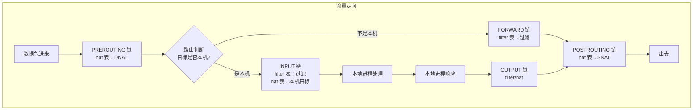

# 网络排障

## ⭐ 面试重点速览

| 考点 | 频率 | 难度 | 考察方式 |
|------|------|------|----------|
| netstat vs ss 区别 | ⭐⭐⭐⭐⭐ | ⭐⭐ | ss 为什么比 netstat 快 |
| tcpdump 抓包实战 | ⭐⭐⭐⭐ | ⭐⭐⭐⭐ | 过滤条件编写，SYN 重传分析 |
| iptables 四表五链 | ⭐⭐⭐⭐ | ⭐⭐⭐⭐ | PREROUTING/INPUT/OUTPUT/FORWARD/POSTROUTING 作用 |
| curl 调试 HTTP | ⭐⭐⭐⭐⭐ | ⭐⭐⭐ | -I/-v/-H/-X 参数用法 |
| 网络问题排查流程 | ⭐⭐⭐⭐⭐ | ⭐⭐⭐⭐ | 分层排查思路，从链路到应用 |
| TIME_WAIT 过多问题 | ⭐⭐⭐⭐ | ⭐⭐⭐ | 优化方案 |

---

## 一、ss —— Socket 统计（推荐替代 netstat）

```bash
# 常用命令
ss -tulnp                     # 所有监听 TCP/UDP，显示进程名
ss -a                        # 所有 socket
ss -t                        # 只显示 TCP
ss -u                        # 只显示 UDP
ss -l                        # 只显示 LISTEN 状态
ss -n                        # 不解析域名（加速）
ss -p                        # 显示进程名和 PID

# 高级筛选
ss -t state established      # 已建立连接
ss -t state time-wait        # TIME_WAIT 连接
ss -t state syn-sent         # SYN 已发送
ss -n sport :8080           # 源端口 8080
ss -n dport :8080           # 目的端口 8080
ss -t '( dport = :http or sport = :http )'

# 统计各状态连接数
$ ss -tua | awk '{print $1}' | sort | uniq -c
# 输出：
#  123 ESTAB
#   45 TIME-WAIT
#    5 LISTEN
```

```bash
# 实战：查看 80 端口是否被占用
$ ss -tulnp | grep ':80'
LISTEN 0      128                *:80              *:*    users:(("nginx",pid=1234,fd=6))
```

::: tip ss 为什么比 netstat 快？
netstat 遍历 `/proc/net/` 和 `/proc/PID` 挨个解析，速度慢。ss 直接从内核获取所有 socket 信息（`/proc/net/netlink`），批量读取，快很多。生产环境推荐 ss。
:::

---

## 二、tcpdump —— 抓包分析

### 2.1 基础语法

```bash
# 语法：tcpdump [选项] [过滤表达式]
tcpdump -i eth0               # 监听指定网卡
tcpdump -i any                # 监听所有网卡
tcpdump -n                    # 不解析域名
tcpdump -nn                    # 不解析域名和端口名
tcpdump -c 100                # 抓 100 个包后停止
tcpdump -w capture.pcap       # 保存到文件（后续 Wireshark 分析）
tcpdump -r capture.pcap       # 从文件读取

# 常用过滤表达式
tcpdump host 192.168.1.100     # 只看和该主机的通信
tcpdump port 80                # 只看该端口
tcpdump src 192.168.1.100      # 源 IP 过滤
tcpdump dst 10.0.0.1           # 目的 IP 过滤
tcpdump tcp port 80            # TCP 端口 80
tcpdump icmp                   # 只抓 ICMP
tcpdump 'tcp[tcpflags] & tcp-syn != 0'  # 只抓 SYN 包
```

### 2.2 实战案例

```bash
# 实战 1：排查端口连接不上，抓 SYN 包看是否到达
tcpdump -i eth0 tcp port 8080 and 'tcp[tcpflags] & tcp-syn != 0'
# 抓了半天没任何输出 → 说明 SYN 根本没到服务器，大概率防火墙拦截

# 实战 2：统计 SYN 重传次数（排查网络丢包）
tcpdump -i eth0 'tcp[tcpflags] & tcp-syn != 0 and tcp[th_flags] & ack = 0'
# 如果短时间内同一个源 IP 多次发 SYN 却没有 ACK 回来，说明有丢包

# 实战 3：抓 HTTP GET 请求，看 Host 和 URL
tcpdump -A -s 1500 -i eth0 tcp port 80 and tcp[13] & 8 != 0
# -A 输出 ASCII，-s 1500 抓足够多内容，tcp[13] & 8 != 0 表示 PSH 标志位，有数据

# 输出示例：
09:45:12.123456 IP 192.168.1.100.54321 > 10.0.0.1.80: Flags [P.], seq 1:200, ack 1, win 65535, length 199
E..l..@.@..{... ........P..GET /api/user HTTP/1.1
Host: api.example.com
User-Agent: curl/7.68.0
Accept: */*
```

::: warning 生产环境注意
抓包会捕获明文流量，如果 HTTPS 没有加密路径，抓包可能泄露敏感信息。抓包文件不要留在服务器上，分析完成后删除。
:::

---

## 三、curl 与 wget —— 接口测试

### 3.1 curl 常用选项

```bash
# 基本用法
curl http://example.com                    # GET 请求，输出响应
curl -X POST -d '{"key":"val"}' http://example.com/api  # POST JSON
curl -H "Content-Type: application/json"   # 指定请求头
curl -i                                   # 输出响应头 + 响应体
curl -I                                   # 只输出响应头（HEAD 请求）
curl -v                                   # 详细调试（握手、SSL、响应头）
curl -o page.html                         # 保存到文件（类似 wget）
curl -u username:password                 # HTTP 认证
curl -L                                   # 跟随重定向
curl -k                                   # 跳过 SSL 证书验证（调试用）
curl -w "time_namelookup: %{time_namelookup}\nconnect: %{time_connect}\ntotal: %{time_total}\n"  # 统计各阶段耗时

# 实战：HTTP 接口性能分析
$ curl -o /dev/null -s -w \
"DNS: %{time_namelookup}s\nConnect: %{time_connect}s\nSSL: %{time_appconnect}s\nTTFB: %{time_starttransfer}s\nTotal: %{time_total}s\n" \
https://example.com
# 输出：
# DNS: 0.023456s
# Connect: 0.056789s
# SSL: 0.123456s
# TTFB: 0.156789s
# Total: 0.178901s
```

### 3.2 wget 常用场景

```bash
wget -O output.html http://example.com    # 下载并重命名
wget -c http://example.com/largefile       # 断点续传
wget -r -l 2 http://example.com            # 递归下载（深度 2）
```

---

## 四、iptables —— 防火墙规则

### 4.1 四表五链模型



| 表 | 用途 |
|----|------|
| `filter` （过滤表） | 核心，规则过滤（ACCEPT/DROP/REJECT） |
| `nat` （地址转换） | NAT（SNAT/DNAT），端口映射 |
| `mangle` | 篡改 IP 头（TTL/TOS 等） |
| `raw` | 关闭连接跟踪 |

### 4.2 常用操作

```bash
# 查看规则
iptables -L -n -v --line-numbers      # 显示行号，不解析域名
iptables -t nat -L -n                 # 查看 nat 表

# 添加规则
iptables -A INPUT -p tcp --dport 22 -j ACCEPT  # 允许 SSH
iptables -A INPUT -p tcp --dport 80 -j ACCEPT
iptables -A INPUT -s 192.168.0.0/16 -j ACCEPT  # 允许内网
iptables -I INPUT 1 -j DROP            # 拒绝所有（插入在第一行）

# 删除规则
iptables -D INPUT 5                    # 删除 INPUT 链第 5 条规则
iptables -F                             # 清空所有规则（危险操作，先保存）

# 保存规则（不同发行版不一样）
iptables-save > /etc/sysconfig/iptables   # CentOS
iptables-save > /etc/iptables/rules.v4     # Debian/Ubuntu
```

::: danger 实战误区
如果 SSH 连接到服务器，执行 `iptables -F; iptables -P INPUT DROP` 会立即断开连接，再也连不上。必须先把规则写对，不要随便清空规则然后默认拒绝。正确顺序：先加允许 SSH 规则，再加 DROP 规则。
:::

### 4.3 排障流程

1. **检查是否有规则阻挡**：`iptables -L INPUT -n | grep DROP`
2. **临时清空所有规则测试**：`iptables -F && iptables -P INPUT ACCEPT`
3. 如果测试正常，说明确实是 iptables 阻挡，逐步恢复规则定位具体哪一条
4. 不要忘记其他防火墙（firewalld、ufw、云平台安全组）

---

## 五、标准排障流程（分层排查）

### 5.1 第一层：物理层/链路层

```bash
# 检查网卡是否 up
ip addr show eth0
# 或
ifconfig eth0

# 检查连接是否正常
ethtool eth0          # 看 Speed/Duplex 等
# 输出：
#   Speed: 1000Mb/s
#   Duplex: Full
#   Link detected: yes
```

### 5.2 第二层：IP 连通性

```bash
# ping 网关和目标 IP
ping 8.8.8.8
# 看丢包率，time 波动大说明网络不稳定

# traceroute/mtr 追踪路由
mtr --report 10.0.0.1
# 每一跳的丢包率都显示，比 traceroute 更详细
```

### 5.3 第三层：端口连通性

```bash
# 检查端口监听
ss -tulnp | grep :8080

# 测试 TCP 连接
nc -zv 10.0.0.1 8080
# nc 不可用时（Alpine）
bash -c "echo > /dev/tcp/10.0.0.1/8080" && echo "ok" || echo "fail"
```

### 5.4 第四层：应用层

```bash
# HTTP 测试
curl -v http://10.0.0.1:8080/health
# HTTPS
curl -v https://example.com/health

# DNS 解析问题排查
dig example.com
nslookup example.com
```

---

## 六、与相关模块的交叉引用

| 知识点 | 相关模块 |
|--------|----------|
| TCP 状态机、三次握手、四次挥手 | [计算机网络 - TCP](../../computer-network/transport/tcp.md) |
| TCP/UDP 端口、套接字 | [计算机网络 - 传输层](../../computer-network/transport/index.md) |
| HTTP 请求、HTTPS 握手 | [计算机网络 - HTTP](../../computer-network/application/http.md) |
| IO 多路复用、epoll | [操作系统 - IO模型](../../operating-system/io/index.md) |

---

## 七、高频面试题

### Q1：`netstat` 和 `ss` 区别？为什么 `ss` 更快？
**答案：** `netstat` 需要遍历 `/proc/net/` 下的各个文件，对每个 socket 遍历 `/proc/PID` 找进程名，O(n) 且大量文件操作，连接数多的时候速度很慢。`ss` 利用 netlink 接口直接从内核一次性获取所有 socket 信息，O(1) 批量读取，速度快得多。功能上 ss 支持更强大的状态过滤，netstat 维护较少且逐渐被替代。生产环境推荐 ss。

### Q2：tcpdump 如何过滤 SYN 包？只抓 SYN 重传？
**答案：** 过滤 SYN 包：`tcpdump 'tcp[tcpflags] & tcp-syn != 0'`。只抓 SYN 不抓 ACK：`tcpdump 'tcp[tcpflags] & (tcp-syn|tcp-ack) == tcp-syn'`。这在排查 SYN 洪水攻击或连接超时问题很有用——大量同一个源的 SYN 没有回应就是丢包或对方不响应。

### Q3：如何用 iptables 做 DNAT 端口转发？
**答案：** 示例：外网访问服务器 eth0:8080，转发给内网 192.168.1.100:80：
```
iptables -t nat -A PREROUTING -i eth0 -p tcp --dport 8080 -j DNAT --to 192.168.1.100:80
iptables -t nat -A POSTROUTING -o eth1 -j SNAT --to $(ip addr show eth0 | awk '/inet/{print $2}' | cut -d/ -f1)
iptables -A FORWARD -p tcp -d 192.168.1.100 --dport 80 -j ACCEPT
```
PREROUTING 链做 DNAT 改目的地址，POSTROUTING 链做 SNAT 改源地址，确保回程路由可达。

### Q4：网络连接超时，完整排查思路是什么？
**答案：** 分层排查法：（1）链路层：`ip addr` 确认网卡 up，`ethtool` 确认连接正常；（2）网络层：`ping` 网关和目标 IP，看是否丢包；`mtr` 看哪一跳开始丢包；（3）传输层：`ss` 确认本地端口监听；`nc`/`telnet` 从客户端测试 TCP 握手；抓包 `tcpdump` 看 SYN 到了没；检查 iptables/security group；（4）应用层：`curl`/`wget` 测试 HTTP，检查响应头，抓包看握手是否完成。

### Q5：TIME_WAIT 是什么？太多了怎么办？怎么优化？
**答案：** TCP 四次挥手时，主动关闭连接的一方会进入 TIME_WAIT，等待 2MSL（通常 2*30s = 60s），确保最后一个 ACK 能被对方收到，让老连接的报文超时消失，不影响新连接。当TIME_WAIT 过多会占用大量端口。优化方案：（1）开启 `tcp_tw_reuse = 1`，内核允许新连接复用 TIME_WAIT 状态的 socket；（2）开启 `tcp_tw_recycle = 1`（注意 NAT 环境下可能有问题，4.12 内核已移除）；（3）调大端口范围 `ip_local_port_range`；（4）服务端尽量不主动关闭连接（Nginx 反向代理默认开启 keepalive 复用连接）。参见 [系统调优](./system-tuning.md) TCP 参数优化部分。

### Q6：curl 的 `-v` 参数能看到哪些调试信息？解释下各阶段输出。
**答案：** `-v` 会输出 DNS 解析结果、TCP 握手信息、SSL 握手细节（证书链、协议版本、加密套件）、请求头、响应头、响应体。可以清晰看到哪一步慢——是 DNS 解析慢、TCP 握手慢、SSL 握手慢、还是服务器响应慢。结合 `-w` 参数可以量化各阶段耗时，方便定位性能瓶颈。实际排障中，先用 `-v` 确认是否是证书问题（自签名证书 `-k` 绕过测试）、重定向配置错误、权限问题，非常高效。