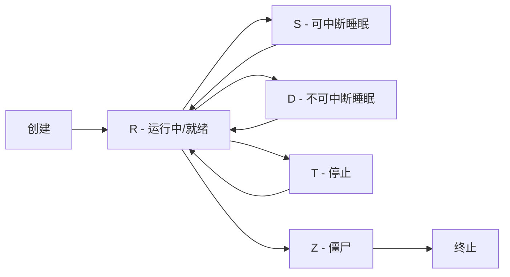

# 进程管理

## ⭐ 面试重点速览

| 考点 | 频率 | 难度 | 考察方式 |
|------|------|------|----------|
| 进程状态（R/S/D/Z/T）及转换 | ⭐⭐⭐⭐⭐ | ⭐⭐⭐ | 进程状态含义，D 状态危害，Z 状态处理 |
| ps/top 输出详解 | ⭐⭐⭐⭐⭐ | ⭐⭐⭐ | 各字段含义，VIRT/RES/SHR 区别 |
| kill 信号类型（-9/-15/-1） | ⭐⭐⭐⭐⭐ | ⭐⭐⭐ | 信号区别，SIGTERM vs SIGKILL |
| nohup、disown、screen/tmux | ⭐⭐⭐⭐ | ⭐⭐ | 后台运行方案对比 |
| systemd 服务管理 | ⭐⭐⭐⭐ | ⭐⭐⭐ | 编写 service 文件、journalctl 日志查看 |
| 孤儿进程与僵尸进程 | ⭐⭐⭐ | ⭐⭐⭐⭐ | 产生原因与处理方式 |

---

## 一、进程状态与生命周期

### 1.1 五种核心状态



| 状态 | 符号 | 含义 | 面试要点 |
|------|------|------|----------|
| Running | R | 正在运行或在运行队列中等待 | CPU 占用高，可能是计算密集型 |
| Sleeping (Interruptible) | S | 可中断睡眠，等待事件（如 IO） | 最常见状态，进程大部分时间在此 |
| Sleeping (Uninterruptible) | D | 不可中断睡眠，通常等待磁盘 IO | **危险信号**：D 状态进程无法被 kill，也接收不到信号 |
| Stopped | T | 被作业控制信号暂停（Ctrl+Z） | 可恢复，fg/bg 或 kill -CONT |
| Zombie | Z | 已终止但父进程未回收（wait） | 不占用资源但占用 PID，大量僵尸说明父进程有 bug |

```bash
# 查看进程状态
$ ps aux | head -5
USER       PID %CPU %MEM    VSZ   RSS TTY      STAT START   TIME COMMAND
root         1  0.0  0.1 225456  9488 ?        Ss   Jun01   0:23 /sbin/init
root       482  0.0  0.0      0     0 ?        I<   Jun01   0:00 [kworker/0:1H]
app       2341  0.5  8.2 5234567 673456 ?      Sl   Jun01  12:34 java -jar app.jar
```

::: danger 排障要点
如果 `ps aux` 看到大量 D 状态进程（STAT 列显示 D），说明磁盘 IO 严重阻塞。此时 `top` 中的 `wa`（iowait）会很高。需要立即用 `iostat` 和 `iotop` 排查磁盘问题。
:::

### 1.2 进程状态转换的触发条件

- **R -> S**：进程发起 IO 请求（read/write），等待数据
- **S -> R**：IO 完成，进程被唤醒
- **R -> T**：接收到 SIGSTOP/SIGTSTP 信号
- **T -> R**：接收到 SIGCONT 信号
- **R -> Z**：进程退出，向父进程发送 SIGCHLD
- **Z -> 消失**：父进程调用 wait()/waitpid() 回收

---

## 二、ps 与 top 命令详解

### 2.1 ps —— 进程快照

```bash
# 常用参数组合
ps aux          # BSD 风格，显示所有用户进程
ps -ef          # Unix 风格，显示所有进程
ps -eLf         # 显示线程（-L），每个线程一行
ps -eo pid,ppid,cmd,%mem,%cpu --sort=-%mem | head  # 自定义输出，按内存排序

# 关键字段解读
# PID    : 进程ID
# PPID   : 父进程ID
# VSZ    : 虚拟内存大小（KB），包含共享库、映射文件等
# RSS    : 常驻内存大小（KB），实际占用的物理内存
# %CPU   : CPU 使用率（自启动以来的平均值，不是瞬时值）
# %MEM   : 物理内存使用百分比
# STAT   : 进程状态（见上表），大写主状态 + 小写附加标志
# TIME   : 累计 CPU 时间
```

```bash
# 实战：查看进程树
$ ps auxf
# 或使用 pstree
$ pstree -p 1234
# 显示进程 1234 及其所有子进程的树状关系
```

### 2.2 top —— 实时监控

```bash
# top 交互界面
$ top
top - 14:32:08 up 365 days,  4:15,  3 users,  load average: 0.52, 0.38, 0.31
Tasks: 245 total,   1 running, 244 sleeping,   0 stopped,   0 zombie
%Cpu(s):  2.3 us,  1.0 sy,  0.0 ni, 96.5 id,  0.2 wa,  0.0 hi,  0.0 si,  0.0 st
MiB Mem :  15876.4 total,   1234.5 free,   8923.1 used,   5718.8 buff/cache
MiB Swap:   4096.0 total,   3890.2 free,    205.8 used.   6123.4 avail Mem

  PID USER      PR  NI    VIRT    RES    SHR S  %CPU  %MEM     TIME+ COMMAND
 2341 app       20   0 5234567 673456  12345 S   0.5   8.2  12:34.56 java
```

**top 输出详解：**

| 区域 | 字段 | 含义 |
|------|------|------|
| 系统概览 | load average | 1/5/15 分钟平均负载，超过 CPU 核数说明过载 |
| CPU 行 | us | 用户态 CPU 占用 |
| | sy | 内核态 CPU 占用 |
| | id | 空闲 CPU |
| | wa | IO 等待（**高 = 磁盘瓶颈**） |
| | st | 被 hypervisor 偷走的时间（虚拟机场景） |
| 内存行 | buff/cache | 缓存，可被回收用于进程 |
| | avail Mem | 实际可用内存（估算值，比 free 更准确） |

**top 交互快捷键：**

| 按键 | 功能 |
|------|------|
| `1` | 展开/折叠各 CPU 核心 |
| `c` | 切换完整命令行显示 |
| `M` | 按内存使用排序 |
| `P` | 按 CPU 使用排序 |
| `k` | 杀死进程（输入 PID + 信号） |
| `f` | 选择要显示的列 |
| `E` | 切换内存单位（KB/MB/GB） |

::: tip htop 推荐
`htop` 是 `top` 的增强版，支持鼠标操作、彩色显示、进程树视图、直接 strace/lsof。生产环境建议安装 `htop`。
:::

---

## 三、信号与 kill

### 3.1 常用信号

| 信号编号 | 信号名 | 默认行为 | 能否捕获 | 使用场景 |
|----------|--------|----------|----------|----------|
| 1 | SIGHUP | 终止 | 是 | 重新加载配置（nginx -s reload） |
| 2 | SIGINT | 终止 | 是 | Ctrl+C 中断 |
| 9 | SIGKILL | 终止 | **否** | 强制杀死进程（最后手段） |
| 15 | SIGTERM | 终止 | 是 | 优雅终止（默认 kill） |
| 17 | SIGCHLD | 忽略 | 是 | 子进程状态变化时父进程收到 |
| 18 | SIGCONT | 继续 | 是 | 恢复被 SIGSTOP 暂停的进程 |
| 19 | SIGSTOP | 暂停 | **否** | 暂停进程 |

```bash
# 信号发送
kill -15 1234       # 发送 SIGTERM（优雅终止，推荐）
kill -9 1234        # 发送 SIGKILL（强制终止，慎用）
kill -1 1234        # 发送 SIGHUP（重新加载配置）
kill -0 1234        # 检查进程是否存在（不发送信号，只检查权限）

# 批量操作
kill -15 $(pgrep -f "java.*app")     # 按名称匹配发信号
pkill -15 -f "java.*app"             # pkill 更简洁
killall -15 java                     # 按进程名发信号（慎用！）
```

::: danger 为什么 kill -9 是最后手段？
`kill -9`（SIGKILL）不能被进程捕获或忽略，内核直接终止进程。进程无法做清理工作（关闭文件描述符、释放锁、写入缓冲数据）。可能导致数据丢失、共享内存损坏、文件系统不一致。正确流程：先 `kill -15`（SIGTERM），等待一段时间，如果进程仍不退出，再用 `kill -9`。
:::

### 3.2 信号处理在 JVM 中的应用

```bash
# JVM 对 SIGTERM 的处理依赖 ShutdownHook
# 如果 JVM 进程卡死，SIGTERM 可能无效，需要 SIGKILL

# 查看 JVM 进程的信号处理
$ cat /proc/$(pgrep -f java)/status | grep SigCgt
# SigCgt 是 caught signals 的位掩码
```

---

## 四、后台运行方案

| 方案 | 持久性 | 适用场景 | 缺点 |
|------|--------|----------|------|
| `command &` | 终端关闭则退出 | 临时后台任务 | 不持久 |
| `nohup command &` | 终端关闭继续 | 简单后台任务 | 日志管理不便 |
| `disown` | 终端关闭继续 | 事后补救 | 已经启动后才用 |
| `screen` | 完全独立 | 交互式会话保持 | 需要额外安装 |
| `tmux` | 完全独立 | 现代化 screen 替代 | 需要额外安装 |
| `systemd service` | 开机自启 | 生产环境 | **推荐** |

```bash
# nohup - 忽略 SIGHUP 信号
nohup java -jar app.jar > app.log 2>&1 &

# disown - 将已启动的作业从 shell 作业列表中移除
java -jar app.jar &
disown %1

# tmux - 会话保持
tmux new -s myapp
java -jar app.jar
# Ctrl+B, D 分离会话
# tmux attach -t myapp 重新连接
```

---

## 五、systemd 服务管理

### 5.1 编写 Service 文件

```ini
# /etc/systemd/system/myapp.service
[Unit]
Description=My Application Service
After=network.target
Documentation=https://myapp.com/docs

[Service]
Type=simple
User=app
Group=app
WorkingDirectory=/opt/myapp
ExecStart=/usr/bin/java -Xmx2g -jar /opt/myapp/app.jar
ExecStop=/bin/kill -15 $MAINPID
Restart=on-failure
RestartSec=10
# 环境变量
Environment="JAVA_HOME=/usr/lib/jvm/java-17"
Environment="SPRING_PROFILES_ACTIVE=prod"
# 限制
LimitNOFILE=65536
LimitNPROC=4096
# 日志
StandardOutput=journal
StandardError=journal
SyslogIdentifier=myapp

[Install]
WantedBy=multi-user.target
```

```bash
# 服务管理命令
systemctl daemon-reload                # 重新加载 service 文件
systemctl enable myapp                 # 开机自启
systemctl start myapp                  # 启动服务
systemctl status myapp                 # 查看状态
systemctl stop myapp                   # 停止服务
systemctl restart myapp                # 重启服务

# 日志查看
journalctl -u myapp -f                 # 实时跟踪日志
journalctl -u myapp --since "1 hour ago"  # 最近1小时的日志
journalctl -u myapp -p err             # 只看错误级别
```

### 5.2 Service Type 对比

| Type | 行为 | 适用场景 |
|------|------|----------|
| `simple`（默认） | ExecStart 启动即认为就绪 | 大多数守护进程 |
| `forking` | 父进程 fork 后退出，子进程继续 | 传统 Unix 守护进程（nginx） |
| `oneshot` | 执行一次就退出 | 初始化脚本、定时任务 |
| `notify` | 进程通过 sd_notify 通知就绪 | 支持 systemd 通知的现代应用 |

---

## 六、与相关模块的交叉引用

| 知识点 | 相关模块 |
|--------|----------|
| 进程调度算法、上下文切换开销 | [操作系统 - 进程与线程](../../operating-system/process-thread/index.md) |
| 进程间通信（IPC） | [操作系统 - 进程间通信](../../operating-system/process-thread/ipc.md) |
| 信号机制底层实现 | [操作系统 - 进程调度](../../operating-system/scheduling/index.md) |

---

## 七、高频面试题

### Q1：进程的 D 状态是什么？为什么危险？
**答案：** D 状态（Uninterruptible Sleep）是进程在等待内核操作完成（通常是磁盘 IO）时的状态。危险在于：D 状态进程不响应任何信号（包括 SIGKILL），无法被终止。如果磁盘出现故障（如 NFS 服务器宕机、iSCSI 断连），大量进程会堆积在 D 状态，系统负载飙升但 CPU 空闲，唯一的解决办法是恢复存储或重启系统。linux 内核中 D 状态的设计初衷是防止数据损坏——在 IO 操作进行中如果进程被杀死，可能导致文件系统不一致。

### Q2：僵尸进程（Zombie）如何产生？如何处理？
**答案：** 子进程先于父进程退出，父进程没有调用 `wait()`/`waitpid()` 回收子进程的退出状态，子进程的 task_struct 残留在内核中，形成僵尸进程。僵尸进程不占用内存和 CPU，但占用 PID。处理方式：找到僵尸进程的父进程（`ps -ef | grep defunct`），向父进程发送 SIGCHLD 信号让它回收，或者直接 kill 父进程（之后僵尸进程会被 init/systemd 收养并回收）。根本解决：修改父进程代码，正确处理 SIGCHLD 信号。

### Q3：`kill -9` 和 `kill -15` 的区别？什么时候用哪个？
**答案：** `kill -15`（SIGTERM）是优雅终止信号，进程可以捕获并执行清理逻辑（关闭连接、刷新缓冲区、释放资源）。`kill -9`（SIGKILL）不能被捕获，内核直接终止进程并回收资源（但不执行进程级清理）。正确流程：先用 `kill -15`，等待 5-10 秒，如果进程仍不退出，再用 `kill -9`。对于 JVM 进程，`kill -15` 会触发 ShutdownHook；对于 Nginx，`kill -QUIT` 是优雅关闭。

### Q4：top 中 VIRT、RES、SHR 的区别？
**答案：** VIRT（Virtual Memory）是进程申请的虚拟内存总量，包括代码段、数据段、共享库、堆、栈以及已映射但未实际使用的内存。RES（Resident Memory）是进程实际占用的物理内存（RAM），不包括 swap 中的部分。SHR（Shared Memory）是 RES 中与其他进程共享的部分（主要是共享库）。三者关系：VIRT >= RES >= SHR。判断内存占用看 RES，判断内存泄漏看 VIRT 的持续增长趋势。

### Q5：`nohup` 和 `&` 的区别？`nohup command &` 为什么两个都要？
**答案：** `&` 只是将命令放到后台执行，但进程仍然属于当前 shell 的作业，终端关闭时会收到 SIGHUP 信号而退出。`nohup` 让进程忽略 SIGHUP 信号，但进程仍然在前台运行（阻塞终端）。`nohup command &` 组合使用：`nohup` 保证终端关闭后进程不退出，`&` 保证当前终端可以继续使用。生产环境推荐使用 systemd 或 supervisor 管理后台进程，而不是 nohup。

### Q6：systemd 的 Type=simple 和 Type=forking 有什么区别？Nginx 该用哪个？
**答案：** `simple` 表示 systemd 认为 ExecStart 启动的进程就是主进程，启动后立即认为服务就绪。`forking` 表示 ExecStart 启动的进程会 fork 一个子进程作为主进程，然后父进程退出，systemd 在父进程退出后才认为服务就绪。Nginx 传统上使用 daemon 模式（fork 到后台），所以应该用 `Type=forking` 并配合 `PIDFile=` 指定 PID 文件路径。现代实践中，推荐让 Nginx 以 `daemon off;` 模式运行，使用 `Type=simple`，更简单可靠。