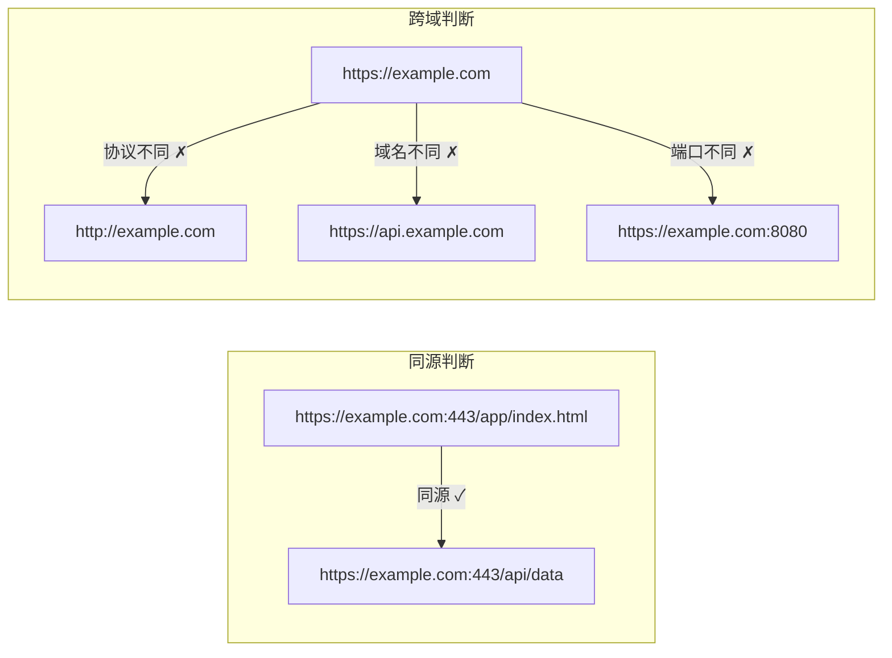
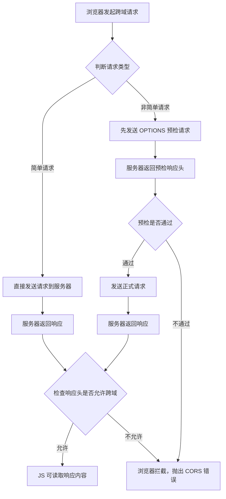
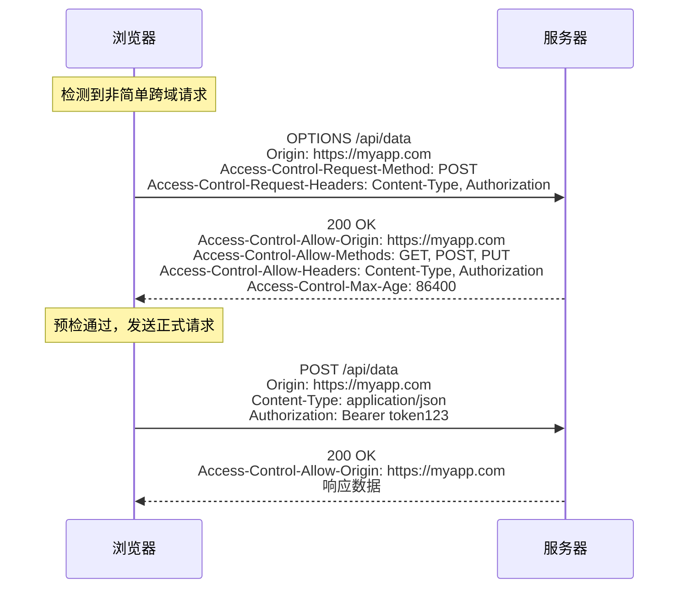

# CORS 跨域

## ⭐ 面试重点速览

| 知识模块 | 重点内容 | 面试频率 |
|----------|----------|----------|
| 同源策略 | 协议+域名+端口三者一致、为什么需要同源策略 | 极高 |
| 简单请求 vs 预检请求 | 触发条件、OPTIONS 预检流程、响应头 | 极高 |
| CORS 响应头 | Access-Control-Allow-Origin/Methods/Headers/Credentials/Max-Age | 极高 |
| 携带凭证 | withCredentials、credentials: 'include'、Access-Control-Allow-Credentials | 高 |
| 跨域解决方案 | JSONP/代理/Nginx 反向代理/CORS/WebSocket/postMessage | 极高 |
| 面试陷阱 | 通配符 * 与 credentials 冲突、预检请求缓存 | 高 |

---

## 一、同源策略（Same-Origin Policy）

### 1.1 什么是同源

**同源**是指请求 URL 的**协议（protocol）、域名（domain）、端口（port）**三者完全相同。任何一个不同，即为**跨域（Cross-Origin）**。



| 场景 | URL A | URL B | 是否同源 | 原因 |
|------|-------|-------|----------|------|
| 基础同源 | `https://a.com/path` | `https://a.com/api` | 同源 | 协议、域名、端口一致 |
| 协议不同 | `https://a.com` | `http://a.com` | 跨域 | 协议不同（https vs http） |
| 域名不同 | `https://a.com` | `https://b.com` | 跨域 | 主域名不同 |
| 子域名不同 | `https://a.com` | `https://www.a.com` | 跨域 | 子域名也算不同域名 |
| 端口不同 | `https://a.com:443` | `https://a.com:8443` | 跨域 | 端口不同 |
| 路径不同 | `https://a.com/a` | `https://a.com/b` | 同源 | 路径不影响同源判断 |

### 1.2 同源策略的限制范围

同源策略主要限制以下三种行为：

1. **Cookie、LocalStorage、IndexedDB** 等存储性内容无法跨域读取
2. **DOM 节点**无法跨域访问（iframe 跨域时无法获取对方 DOM）
3. **AJAX / Fetch 请求**无法跨域发送（请求可以发出，但浏览器拦截响应）

::: tip 同源策略的目的
同源策略是浏览器最核心的安全机制。如果没有同源策略：
- 恶意网站可以通过 AJAX 读取你的银行账户信息
- 任意网站可以读取你登录状态下的 Cookie 并伪造请求
- iframe 中的钓鱼页面可以窃取父页面的表单输入

**同源策略只限制浏览器端的跨域请求**，服务器端（如 Node.js、curl）不受此限制。
:::

---

## 二、CORS 跨域资源共享

### 2.1 CORS 整体流程

CORS（Cross-Origin Resource Sharing）是 W3C 标准，允许浏览器向跨源服务器发出 XMLHttpRequest 或 Fetch 请求。CORS 将请求分为两类：**简单请求**和**非简单请求（需预检）**。



### 2.2 简单请求（Simple Request）

同时满足以下**所有条件**的请求才是简单请求：

| 条件 | 允许的值 |
|------|----------|
| 请求方法 | `GET`、`HEAD`、`POST`（三者之一） |
| 人为设置的请求头 | 仅限 `Accept`、`Accept-Language`、`Content-Language`、`Content-Type` |
| Content-Type 值 | `text/plain`、`multipart/form-data`、`application/x-www-form-urlencoded`（三者之一） |
| 无 ReadableStream | 请求中没有使用 ReadableStream 对象 |
| 无事件监听 | 没有在 XMLHttpRequest.upload 上添加事件监听 |

::: warning 关键判断：Content-Type: application/json 触发预检！
```javascript
// ✅ 简单请求 —— 不会触发 OPTIONS 预检
fetch('https://api.example.com/data', {
    method: 'POST',
    headers: { 'Content-Type': 'application/x-www-form-urlencoded' },
    body: 'key=value'
});

// ❌ 非简单请求 —— 会触发 OPTIONS 预检（Content-Type 是 application/json）
fetch('https://api.example.com/data', {
    method: 'POST',
    headers: {
        'Content-Type': 'application/json',
        'Authorization': 'Bearer token123'  // 自定义头也触发预检
    },
    body: JSON.stringify({ key: 'value' })
});
```
:::

### 2.3 预检请求（Preflight Request）

预检请求使用 **OPTIONS** 方法，浏览器先询问服务器是否允许跨域请求，服务端许可后才发送正式请求。



预检请求的请求头：

| 请求头 | 说明 | 示例 |
|--------|------|------|
| `Origin` | 请求来源（协议+域名+端口，无路径） | `https://myapp.com` |
| `Access-Control-Request-Method` | 正式请求将使用的 HTTP 方法 | `POST` |
| `Access-Control-Request-Headers` | 正式请求将携带的自定义请求头（逗号分隔） | `Content-Type, Authorization` |

---

## 三、CORS 响应头详解

### 3.1 核心响应头一览

| 响应头 | 说明 | 示例 |
|--------|------|------|
| `Access-Control-Allow-Origin` | 允许的源（必须与请求 Origin 匹配或为 `*`） | `https://myapp.com` |
| `Access-Control-Allow-Methods` | 允许的 HTTP 方法（预检响应中使用） | `GET, POST, PUT, DELETE` |
| `Access-Control-Allow-Headers` | 允许的请求头（预检响应中使用） | `Content-Type, Authorization` |
| `Access-Control-Allow-Credentials` | 是否允许携带 Cookie（值为 `true` 时） | `true` |
| `Access-Control-Max-Age` | 预检请求缓存时间（秒），在此期间不重复预检 | `86400`（24 小时） |
| `Access-Control-Expose-Headers` | 允许 JS 读取的响应头（默认只能读取 6 个基本头） | `X-Total-Count, X-Request-Id` |

### 3.2 关键响应头配置

```nginx
# Nginx 反向代理 CORS 配置示例
server {
    location /api/ {
        # 允许的源（生产环境不要用 *）
        if ($http_origin ~* "^https?://(localhost|myapp\.com|test\.myapp\.com)$") {
            add_header Access-Control-Allow-Origin $http_origin;
            add_header Access-Control-Allow-Credentials true;
        }

        # 允许的方法
        add_header Access-Control-Allow-Methods "GET, POST, PUT, DELETE, PATCH, OPTIONS";

        # 允许的请求头
        add_header Access-Control-Allow-Headers "Content-Type, Authorization, X-Requested-With";

        # 预检缓存 24 小时
        add_header Access-Control-Max-Age 86400;

        # 处理 OPTIONS 预检请求
        if ($request_method = 'OPTIONS') {
            return 204;
        }

        # 代理到后端服务
        proxy_pass http://backend:3000;
    }
}
```

::: danger 面试陷阱：`Access-Control-Allow-Origin: *` 与 `credentials` 互斥
当请求携带凭证（Cookie 或 Authorization 头）时，`Access-Control-Allow-Origin` **不能**设置为 `*`，必须指定具体的源。同时 `Access-Control-Allow-Credentials` 必须设置为 `true`。

```javascript
// ❌ 错误：credentials 模式下 Allow-Origin 不能用 *
fetch('https://api.example.com/data', {
    credentials: 'include'
});
// 服务器如果返回 Access-Control-Allow-Origin: *，浏览器会拒绝

// ✅ 正确：必须指定具体源
// 服务器返回：
// Access-Control-Allow-Origin: https://myapp.com
// Access-Control-Allow-Credentials: true
```
:::

---

## 四、携带凭证（Credentials）

### 4.1 三种凭证模式

| 模式 | Fetch 配置 | 说明 | 跨域时 Cookie 行为 |
|------|-----------|------|-------------------|
| `omit` | `credentials: 'omit'` | 不发送任何凭证 | 不发送 Cookie |
| `same-origin` | `credentials: 'same-origin'`（默认） | 同源时发送凭证 | 跨域不发送 Cookie |
| `include` | `credentials: 'include'` | 始终发送凭证 | 跨域也发送 Cookie |

### 4.2 前端与后端配置

```javascript
// 前端 —— Fetch API 携带 Cookie
fetch('https://api.example.com/user/profile', {
    credentials: 'include',  // 跨域请求也携带 Cookie
    headers: {
        'Content-Type': 'application/json'
    }
});

// 前端 —— XMLHttpRequest 携带 Cookie
const xhr = new XMLHttpRequest();
xhr.withCredentials = true;  // 必须在 open 之前设置
xhr.open('GET', 'https://api.example.com/user/profile');
xhr.send();
```

```javascript
// 后端 —— Node.js (Express) CORS 中间件配置
const cors = require('cors');
app.use(cors({
    origin: 'https://myapp.com',     // 必须指定具体源，不能用 *
    credentials: true,                // 允许携带 Cookie
    methods: ['GET', 'POST', 'PUT', 'DELETE'],
    allowedHeaders: ['Content-Type', 'Authorization'],
    maxAge: 86400                     // 预检缓存时间
}));
```

::: tip 第三方 Cookie 的逐步淘汰
Chrome 自 2024 年起逐步淘汰第三方 Cookie。如果前端依赖跨域 Cookie 做身份认证，建议迁移到以下方案：
- 使用 `Authorization: Bearer <token>` 头传递 Token
- 使用 SameSite=None + Secure 的 Cookie（仅 HTTPS 下可用）
- 使用 `SameSite=Lax` 或 `SameSite=Strict` 限制跨站请求
:::

---

## 五、常见跨域解决方案对比

### 5.1 方案对比表

| 方案 | 原理 | 适用场景 | 限制 | 复杂度 |
|------|------|----------|------|--------|
| **CORS** | 服务端设置响应头允许跨域 | 可控后端 API | 需后端配合，IE9 以下不支持 | 低 |
| **JSONP** | 利用 `<script>` 标签不受同源限制 | 仅 GET 请求、老项目兼容 | 仅支持 GET、不安全、无错误处理 | 低 |
| **代理（devServer proxy）** | 开发服务器转发请求到目标服务器 | 本地开发环境 | 仅开发环境有效 | 低 |
| **Nginx 反向代理** | 通过 Nginx 将请求转发到同源后端 | 生产环境前后端分离 | 需运维配置 Nginx | 中 |
| **WebSocket** | WebSocket 协议不受同源策略限制 | 实时双向通信 | 需服务端支持 WebSocket | 中 |
| **postMessage** | iframe 或窗口间通信 | 跨窗口/iframe 数据传递 | 需双方配合监听 | 中 |
| **document.domain** | 设置相同主域实现子域通信 | 同主域不同子域间 | 仅限同主域、已逐渐废弃 | 低 |

### 5.2 各方案代码示例

```javascript
// 1. JSONP —— 仅支持 GET，利用 script 标签不受同源策略限制
function jsonp(url, callbackName) {
    return new Promise((resolve, reject) => {
        const script = document.createElement('script');
        // 全局回调函数
        window[callbackName] = (data) => {
            resolve(data);
            document.body.removeChild(script);
            delete window[callbackName];
        };
        script.src = `${url}?callback=${callbackName}`;
        script.onerror = () => reject(new Error('JSONP request failed'));
        document.body.appendChild(script);
    });
}

// 使用
jsonp('https://api.example.com/data', 'handleData')
    .then(data => console.log(data));
```

```javascript
// 2. Vite 开发代理配置（vite.config.js）
export default {
    server: {
        proxy: {
            '/api': {
                target: 'https://api.example.com',
                changeOrigin: true,       // 修改请求头中的 Origin 为目标地址
                rewrite: (path) => path.replace(/^\/api/, ''),
            }
        }
    }
};

// 3. Webpack devServer 代理配置
// devServer: {
//     proxy: {
//         '/api': 'http://localhost:3000'
//     }
// }
```

```nginx
# 4. Nginx 反向代理 —— 生产环境最常用方案
server {
    listen 80;
    server_name myapp.com;

    # 前端静态资源
    location / {
        root /usr/share/nginx/html;
        index index.html;
        try_files $uri $uri/ /index.html;  # SPA 路由回退
    }

    # API 反向代理到后端服务
    location /api/ {
        proxy_pass http://backend-server:3000/api/;
        proxy_set_header Host $host;
        proxy_set_header X-Real-IP $remote_addr;
        proxy_set_header X-Forwarded-For $proxy_add_x_forwarded_for;
        proxy_set_header X-Forwarded-Proto $scheme;
    }
}
# 前端请求 /api/users → Nginx 转发到 http://backend-server:3000/api/users
# 浏览器看来是同源请求，不存在跨域问题
```

```javascript
// 5. postMessage —— 跨窗口/iframe 通信
// 父页面发送消息
const iframe = document.getElementById('childFrame');
iframe.contentWindow.postMessage(
    { type: 'userData', payload: { name: 'Alice' } },
    'https://child.example.com'  // 指定目标 Origin（安全措施）
);

// 子页面接收消息
window.addEventListener('message', (event) => {
    // 必须验证消息来源！
    if (event.origin !== 'https://parent.example.com') return;
    console.log('收到消息:', event.data);
});
```

---

## 六、面试高频问题汇总

### Q1：简单请求和预检请求的区分条件是什么？

同时满足以下条件为简单请求，否则触发预检：
1. 请求方法为 `GET`、`HEAD`、`POST`
2. 仅包含 CORS 安全列出的请求头（Accept、Accept-Language、Content-Language、Content-Type）
3. Content-Type 限于 `text/plain`、`multipart/form-data`、`application/x-www-form-urlencoded`
4. 请求中没有 ReadableStream
5. XMLHttpRequest.upload 上没有事件监听器

**最常见的预检触发场景**：`Content-Type: application/json` 或携带 `Authorization` 头。

### Q2：为什么 CORS 需要预检请求？

预检请求（OPTIONS）存在的原因是**保护旧服务器**。在 CORS 标准出现之前，服务器不知道跨域请求的概念。如果浏览器直接发送 `DELETE` 或 `PUT` 请求，旧服务器可能会执行这些操作（因为旧服务器不检查 Origin），造成安全风险。预检请求先询问服务器是否支持跨域，服务器同意后才发送正式请求。

### Q3：`Access-Control-Allow-Origin: *` 有什么限制？

1. **不能携带凭证**：当 `credentials: 'include'` 时，浏览器禁止 `*` 通配符
2. **不能与 `Access-Control-Allow-Credentials: true` 同时使用**
3. 生产环境建议明确指定允许的源，而非使用 `*`

### Q4：跨域请求中，Cookie 携带的条件是什么？

- 前端：设置 `withCredentials = true`（XHR）或 `credentials: 'include'`（Fetch）
- 后端：`Access-Control-Allow-Credentials: true`
- 后端：`Access-Control-Allow-Origin` 必须指定具体值，不能用 `*`
- 后端：`Access-Control-Allow-Methods` 和 `Access-Control-Allow-Headers` 不能用 `*`
- Cookie 的 `SameSite` 属性不能是 `Strict`（跨站场景下）

### Q5：JSONP 为什么只支持 GET？

JSONP 的原理是动态创建 `<script>` 标签，将回调函数名作为参数附加到 URL 上，服务器返回 `callbackName(data)` 形式的 JS 代码。`<script>` 标签只能发起 GET 请求，无法指定请求方法，所以 JSONP 只能支持 GET。

### Q6：预检请求的缓存机制是怎样的？

`Access-Control-Max-Age` 响应头指定预检结果的有效时间（秒）。在有效期内，相同的 URL + 方法 + 请求头的组合不会再触发预检请求。Firefox 上限为 86400 秒（24 小时），Chromium 上限为 7200 秒（2 小时）。

### Q7：CORS 请求默认可以携带 Cookie 吗？

**不可以**。Fetch API 默认 `credentials: 'same-origin'`，跨域请求不会携带 Cookie。必须显式设置 `credentials: 'include'` 且后端配合才能携带。

### Q8：Nginx 反向代理解决跨域的原理是什么？

同源策略是**浏览器**的安全策略。Nginx 反向代理将前端请求转发到后端，浏览器看到的请求和响应都在同一个域名下，对浏览器而言是同源请求，不存在跨域限制。这是生产环境中最常用的跨域解决方案。