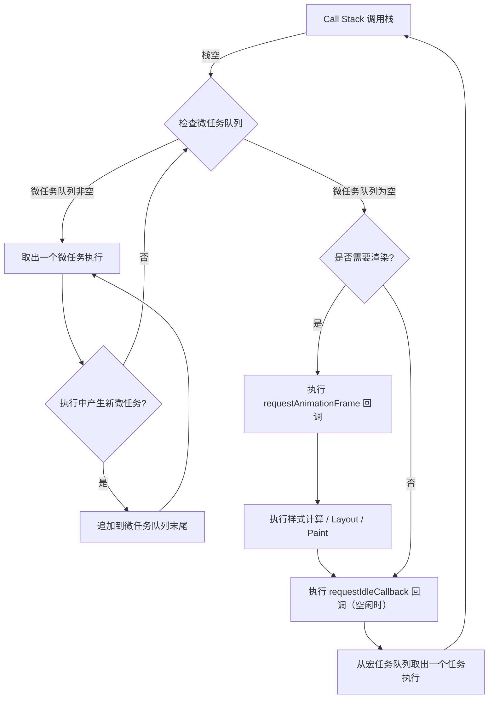
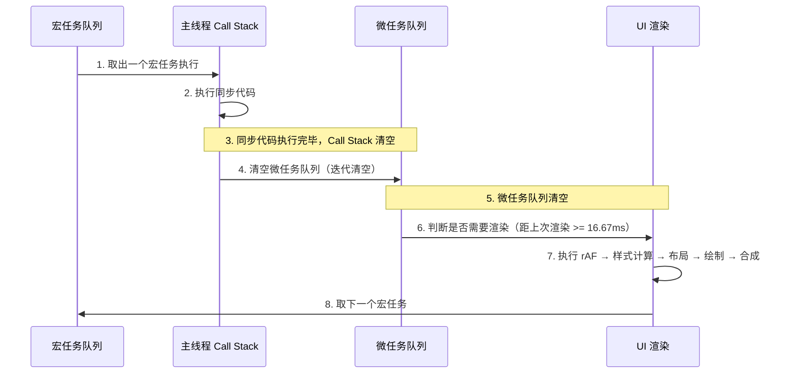
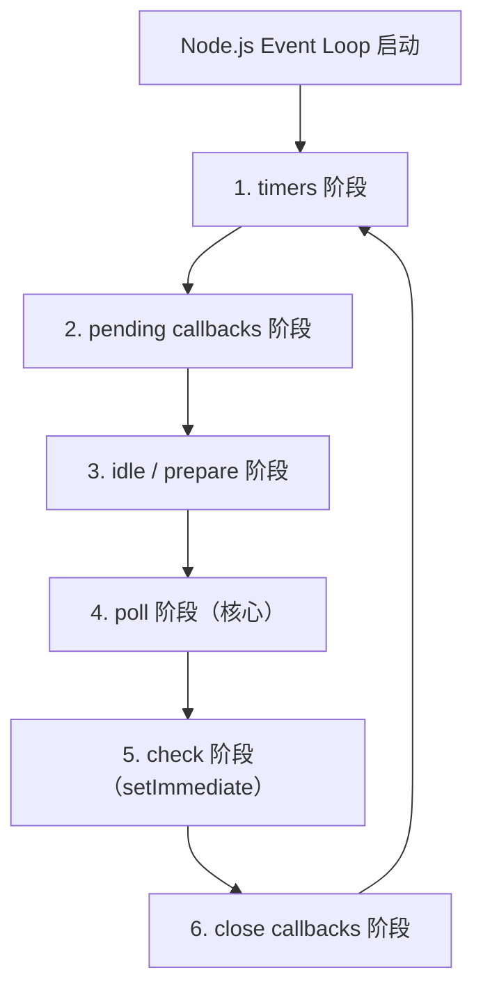

# Event Loop（事件循环）

## ⭐ 面试重点速览

| 知识模块 | 重点内容 | 面试频率 |
|----------|----------|----------|
| Event Loop 机制 | 宏任务/微任务队列、执行顺序、UI 渲染时机 | 极高 |
| 宏任务（MacroTask） | setTimeout/setInterval/IO/script/MessageChannel | 极高 |
| 微任务（MicroTask） | Promise.then/MutationObserver/queueMicrotask | 极高 |
| async/await 执行顺序 | Generator 本质、await 后的代码等价于微任务 | 极高 |
| 经典面试题 | Promise+setTimeout 嵌套、async/await 混用 | 极高 |
| Node.js Event Loop | 6 个阶段、process.nextTick、setImmediate | 高 |

---

## 一、浏览器 Event Loop 完整机制

### 1.1 核心流程图



### 1.2 一句话总结

> **Event Loop 的核心规则**：主线程执行完同步代码后，清空微任务队列（包括清空过程中产生的新微任务），然后根据需要渲染 UI，最后从宏任务队列取下一个任务执行。

```javascript
// 简化理解 —— 一轮 Event Loop 的过程
// 1. 执行一个宏任务（从宏任务队列中取出）
// 2. 执行过程中产生的所有微任务（清空微任务队列）
// 3. 如果微任务执行过程中产生了新的微任务，继续清空（直到微任务队列为空）
// 4. 判断是否需要渲染（通常 16.67ms 一次，但不一定每轮都渲染）
// 5. 如果需要渲染，执行 rAF → 样式计算 → 布局 → 绘制 → 合成
// 6. 回到步骤 1，取下一个宏任务
```

---

## 二、宏任务（MacroTask）与微任务（MicroTask）

### 2.1 任务分类表

| 类型 | 具体 API | 触发时机 | 优先级 |
|------|----------|----------|--------|
| **宏任务** | `<script>` 标签整体代码 | 页面加载时 | 最高（首个宏任务） |
| **宏任务** | `setTimeout(fn, delay)` | 延迟 delay ms 后放入宏任务队列 | 普通 |
| **宏任务** | `setInterval(fn, interval)` | 每隔 interval ms 放入宏任务队列 | 普通 |
| **宏任务** | I/O 操作（点击、网络请求回调） | 事件触发时 | 普通 |
| **宏任务** | UI 渲染（`requestAnimationFrame`） | 每帧渲染前 | 特殊（在渲染阶段执行） |
| **宏任务** | `MessageChannel.postMessage` | 立即放入宏任务队列 | 普通 |
| **宏任务** | `setImmediate`（仅 IE/Node.js） | 当前宏任务完成后立即执行 | 普通 |
| **微任务** | `Promise.then/catch/finally` | Promise 状态变更后 | 高 |
| **微任务** | `MutationObserver` | DOM 变化时 | 高 |
| **微任务** | `queueMicrotask(fn)` | 立即放入微任务队列 | 高 |
| **微任务** | `async/await`（await 后的代码） | await 表达式求值后 | 高 |

### 2.2 微任务队列的清空机制

```javascript
// 微任务队列的"清空"意味着：执行过程中产生的新微任务也会在本轮被处理
console.log('1: 同步');

Promise.resolve().then(() => {
    console.log('2: 微任务 1');
    // 在微任务中产生新的微任务
    Promise.resolve().then(() => {
        console.log('3: 微任务 1-1（嵌套微任务）');
    });
});

Promise.resolve().then(() => {
    console.log('4: 微任务 2');
});

setTimeout(() => {
    console.log('5: 宏任务 setTimeout');
}, 0);

console.log('6: 同步');

// 输出顺序：
// 1: 同步
// 6: 同步
// 2: 微任务 1
// 4: 微任务 2
// 3: 微任务 1-1（嵌套微任务）—— 注意！在微任务 2 之后执行
// 5: 宏任务 setTimeout
```

::: warning 关键理解：微任务队列的"清空"是迭代的
微任务队列不是按"当前队列快照"来清空的，而是**持续清空直到队列为空**。如果在执行微任务时产生了新的微任务，这些新微任务会在当前轮次立即被处理，不会等到下一轮事件循环。

这意味着：如果微任务中无限产生新的微任务，页面将永远无法渲染，形成**微任务死循环**。
```javascript
// ⚠️ 危险代码 —— 微任务死循环，页面永远无法渲染
function microTaskLoop() {
    Promise.resolve().then(() => {
        console.log('微任务死循环中...');
        microTaskLoop(); // 不断产生新微任务
    });
}
microTaskLoop();
// 页面卡死，用户交互无响应，因为宏任务队列永远得不到执行
```
:::

---

## 三、UI 渲染时机

UI 渲染是在**微任务队列清空后、下一个宏任务执行前**进行的，但不是每轮事件循环都会渲染。



::: tip 关键结论
- 宏任务 --> 微任务队列清空 --> **可能** UI 渲染 --> 下一个宏任务
- UI 渲染不一定每轮都发生，取决于帧率和渲染需求
- `requestAnimationFrame` 在渲染前执行，优先级高于渲染
- 如果在微任务中频繁修改 DOM，浏览器会在微任务清空后统一渲染，而不会每次修改都渲染
:::

---

## 四、经典面试题详解

### 4.1 基础题：Promise + setTimeout 嵌套

```javascript
// 经典面试题 #1
console.log('1');

setTimeout(() => {
    console.log('2');
    Promise.resolve().then(() => {
        console.log('3');
    });
}, 0);

new Promise((resolve) => {
    console.log('4');
    resolve();
}).then(() => {
    console.log('5');
});

setTimeout(() => {
    console.log('6');
}, 0);

console.log('7');

// 输出：1 4 7 5 2 3 6
// 详细分析：
// 1. 同步代码：1 → 4（Promise 构造函数同步执行）→ 7
// 2. 微任务队列清空：5（Promise.then）
// 3. 第一个宏任务 setTimeout：2 → 产生微任务 3 → 清空微任务队列：3
// 4. 第二个宏任务 setTimeout：6
```

### 4.2 进阶题：async/await 混用

```javascript
// 经典面试题 #2 —— async/await 执行顺序
async function async1() {
    console.log('a1 start');
    await async2();
    // await 后面的代码等价于 Promise.resolve().then(() => { ... })
    console.log('a1 end');
}

async function async2() {
    console.log('a2');
}

console.log('script start');

setTimeout(() => {
    console.log('setTimeout');
}, 0);

async1();

new Promise((resolve) => {
    console.log('promise1');
    resolve();
}).then(() => {
    console.log('promise2');
});

console.log('script end');

// 输出顺序分析：
// script start          -- 同步
// a1 start              -- 同步（async1 函数体，await 之前）
// a2                    -- 同步（async2 函数体，没有 await）
// promise1              -- 同步（Promise 构造函数）
// script end            -- 同步
// a1 end                -- 微任务（await 后面的代码，等价于 Promise.then）
// promise2              -- 微任务（Promise.then）
// setTimeout            -- 宏任务（下一个事件循环）

// 关键理解：
// await async2() 等价于：
//   Promise.resolve(async2()).then(() => { console.log('a1 end'); })
// async2() 返回的是已 resolve 的 Promise（或 undefined），
// 所以 console.log('a1 end') 被放入微任务队列
```

### 4.3 高难度题：多层嵌套

```javascript
// 经典面试题 #3 —— 多层 Promise + setTimeout 嵌套
Promise.resolve().then(() => {
    console.log('1');
    setTimeout(() => {
        console.log('2');
    }, 0);
});

setTimeout(() => {
    console.log('3');
    Promise.resolve().then(() => {
        console.log('4');
    });
}, 0);

Promise.resolve().then(() => {
    console.log('5');
});

// 输出：1 5 3 4 2
// 详细分析：
// 第一轮事件循环：
//   - 同步代码：无
//   - 微任务队列：[then1, then5]
//   - 执行 then1：输出 1，将 setTimeout(2) 放入宏任务队列
//   - 执行 then5：输出 5
//   - 微任务队列清空
//   - 宏任务队列：[setTimeout(3), setTimeout(2)]
//
// 第二轮事件循环：
//   - 执行 setTimeout(3)：输出 3，将 then4 放入微任务队列
//   - 清空微任务队列：输出 4
//
// 第三轮事件循环：
//   - 执行 setTimeout(2)：输出 2
```

### 4.4 综合题：async/await + Promise + setTimeout

```javascript
// 经典面试题 #4 —— 综合考察
async function foo() {
    console.log('2');
    // await 右侧表达式立即执行
    await new Promise((resolve) => {
        console.log('3');
        setTimeout(() => {
            console.log('4');
            resolve();
        }, 100);
    });
    // 这里的代码等价于 resolve 后的 .then 回调
    console.log('5');
}

console.log('1');
foo();
console.log('6');

// 输出：1 2 3 6 4 5
// 详细分析：
// 1. console.log('1') → 输出 1
// 2. foo() 执行，console.log('2') → 输出 2
// 3. await 右侧：new Promise 构造函数同步执行 → console.log('3') → 输出 3
// 4. setTimeout(100ms) 注册宏任务，Promise 处于 pending 状态
// 5. foo() 暂停，console.log('6') → 输出 6
// 6. ~100ms 后，setTimeout 触发 → 输出 4，resolve()
// 7. resolve 后，await 恢复 → console.log('5') → 输出 5
```

---

## 五、与 Node.js Event Loop 的区别

| 维度 | 浏览器 Event Loop | Node.js Event Loop |
|------|-------------------|-------------------|
| **核心机制** | 宏任务 + 微任务 + UI 渲染 | 6 个阶段循环 + 微任务 |
| **微任务时机** | 每个宏任务之后清空微任务队列 | 每个阶段之间清空微任务队列 |
| **process.nextTick** | 不支持 | 优先级高于 Promise.then（独立队列） |
| **setImmediate** | 仅 IE 支持 | 独立阶段（check 阶段） |
| **UI 渲染** | 有（微任务后、宏任务前） | 无（服务端环境） |
| **定时器精度** | 4ms 最小间隔（嵌套调用） | 1ms 最小间隔 |



```javascript
// Node.js 中 process.nextTick 和 setImmediate 的区别
// process.nextTick 不在 Event Loop 的任何阶段执行，而是在每个阶段之间执行
// setImmediate 在 check 阶段执行

setTimeout(() => console.log('1: setTimeout'), 0);
setImmediate(() => console.log('2: setImmediate'));
process.nextTick(() => console.log('3: nextTick'));
Promise.resolve().then(() => console.log('4: Promise.then'));

// Node.js 输出（非确定性，取决于 Event Loop 启动时机）：
// 3: nextTick  （独立队列，最先执行）
// 4: Promise.then （微任务队列）
// 1: setTimeout 或 2: setImmediate（取决于启动时机，通常 setImmediate 先于 setTimeout(0)）
```

::: warning 面试追问：为什么 Node.js 中 setTimeout(fn, 0) 和 setImmediate 的执行顺序不确定？
当 Event Loop 启动时，可能已经过了 setTimeout 的 0ms 时间，进入 timers 阶段；也可能还没到，进入 poll 阶段后再到 check 阶段执行 setImmediate。所以顺序取决于 Event Loop 启动的时间点。

在 I/O 回调中，setImmediate 总是先于 setTimeout，因为 I/O 回调在 poll 阶段执行，之后直接进入 check 阶段。
:::

---

## 六、面试高频问题汇总

### Q1：经典执行顺序分析题

```javascript
// 面试官最爱的题目
console.log('1');

setTimeout(() => {
    console.log('2');
    new Promise((resolve) => {
        console.log('3');
        resolve();
    }).then(() => {
        console.log('4');
    });
});

new Promise((resolve) => {
    console.log('5');
    resolve();
}).then(() => {
    console.log('6');
});

setTimeout(() => {
    console.log('7');
    new Promise((resolve) => {
        console.log('8');
        resolve();
    }).then(() => {
        console.log('9');
    });
});

console.log('10');

// 答案：1 5 10 6 2 3 4 7 8 9
// 你在面试中能准确说出每一步吗？
```

### Q2：`requestAnimationFrame` 在 Event Loop 中的位置？

`requestAnimationFrame` 在 UI 渲染之前执行，属于**渲染阶段**而非宏任务或微任务。具体位置：微任务队列清空后 → 判断是否需要渲染 → 如果需要渲染，执行 rAF 回调 → 样式计算 → 布局 → 绘制 → 合成。

### Q3：为什么 `MutationObserver` 被设计为微任务？

`MutationObserver` 监听 DOM 变化，如果设计为宏任务，可能在多次 DOM 修改后积压大量回调。设计为微任务可以在 DOM 修改后、渲染前的一次性批量处理所有变更，既保证响应及时性，又避免多次渲染。

### Q4：`queueMicrotask` 和 `Promise.resolve().then()` 的区别？

功能上几乎等价，但 `queueMicrotask` 更语义化、更高效（不需要创建 Promise 对象）。在需要将代码推迟到当前任务结束后但下一个宏任务前的场景中，优先使用 `queueMicrotask`。

### Q5：如何在微任务队列中插入一个"低优先级微任务"？

无法在微任务中区分优先级，微任务队列是 FIFO 的。如果需要延迟执行，应该使用 `setTimeout(fn, 0)` 将其放入宏任务队列。