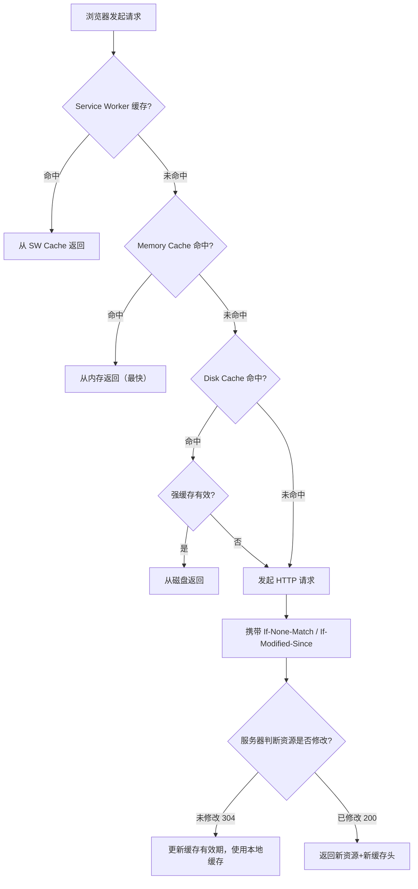
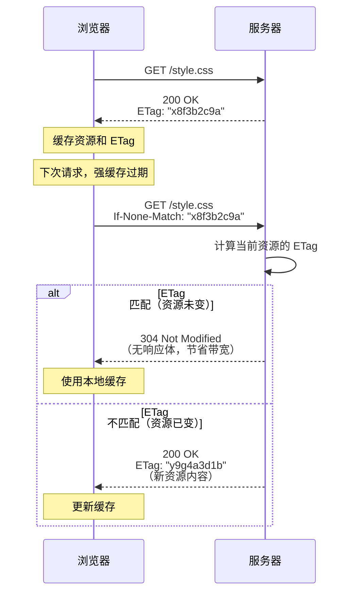

# HTTP 缓存

## ⭐ 面试重点速览

| 知识模块 | 重点内容 | 面试频率 |
|----------|----------|----------|
| 强缓存 | Cache-Control（max-age/no-cache/no-store/public/private）、Expires | 极高 |
| 协商缓存 | ETag/If-None-Match、Last-Modified/If-Modified-Since | 极高 |
| 缓存策略 | HTML 协商缓存、JS/CSS 强缓存+hash、图片强缓存 | 极高 |
| 缓存位置 | Memory Cache vs Disk Cache vs Service Worker vs Push Cache | 高 |
| 缓存流程 | 浏览器缓存查找优先级、304 状态码 | 高 |
| 实战场景 | 版本更新后的缓存清理、CDN 缓存策略 | 中高 |

---

## 一、HTTP 缓存整体流程

浏览器 HTTP 缓存分为**强缓存**和**协商缓存**两个阶段。强缓存命中时直接使用本地缓存（不发起请求），协商缓存需要向服务器验证资源是否过期。



---

## 二、强缓存（Strong Cache）

强缓存是指**浏览器在缓存有效期内，不向服务器发送请求，直接使用本地缓存**。HTTP 状态码仍显示为 200，但实际来自缓存（from disk cache 或 from memory cache）。

### 2.1 Cache-Control（HTTP/1.1，推荐使用）

| 指令 | 含义 | 使用场景 |
|------|------|----------|
| `max-age=<seconds>` | 缓存最大有效时间（秒），相对时间 | 最常用，如 `max-age=31536000`（一年） |
| `no-cache` | **可以使用缓存，但每次必须向服务器验证** | HTML 文件（确保内容最新） |
| `no-store` | **完全不缓存**，每次都请求新资源 | 敏感数据（银行、隐私信息） |
| `public` | 可以被任何中间节点缓存（CDN、代理） | 公共资源（CDN 静态文件） |
| `private` | 只能被浏览器缓存，不能被中间节点缓存 | 用户私有数据 |
| `must-revalidate` | 缓存过期后必须重新验证，不能使用过期缓存 | 时效性要求高的资源 |
| `immutable` | 资源内容不会变化，缓存期内不重新验证 | 带 hash 的静态资源 |
| `s-maxage=<seconds>` | 仅对 CDN/代理生效（覆盖 max-age） | CDN 缓存策略 |

### 2.2 Expires（HTTP/1.0，已被 Cache-Control 替代）

```http
Expires: Wed, 21 Oct 2026 07:28:00 GMT
```

`Expires` 使用**绝对时间**，依赖客户端时钟，如果客户端时间与服务器不一致会导致缓存失效。**Cache-Control 优先级高于 Expires。**

::: danger 为什么 Expires 被废弃？
1. 使用绝对时间，依赖客户端系统时钟（客户端时间可能不准）
2. HTTP/1.1 的 Cache-Control 更灵活（支持更多指令）
3. 当 Cache-Control 和 Expires 同时存在时，Cache-Control 优先
:::

### 2.3 强缓存实战配置

```nginx
# Nginx 配置示例 —— 对不同资源类型设置不同的强缓存策略
location / {
    # HTML 文件使用协商缓存（每次验证）
    if ($request_filename ~* .*\.(html|htm)$) {
        add_header Cache-Control "no-cache, must-revalidate";
    }
}

location ~* \.(js|css)$ {
    # JS/CSS 文件带 hash，内容不变，使用强缓存长期缓存
    # 文件名 hash 变化时 URL 变化，自然绕过缓存
    expires 1y;
    add_header Cache-Control "public, immutable";
}

location ~* \.(jpg|jpeg|png|gif|ico|svg|webp|woff|woff2|ttf)$ {
    # 图片和字体文件，使用强缓存
    expires 30d;
    add_header Cache-Control "public";
}
```

```javascript
// 前端工程化 —— Webpack/Vite 文件名 hash 策略
// 输出文件示例：
// main.a8f3b2c.js    —— content hash，内容变化则 hash 变化
// vendor.d4e5f6a.js  —— vendor chunk hash
// 图片通过 file-loader 同样带 hash

// 为什么 JS/CSS 可以设置强缓存一年？
// 因为文件名中的 hash 由内容决定，内容改变 → hash 改变 → 文件名改变 → URL 改变
// 新 URL 不存在缓存，自然会请求新资源
```

---

## 三、协商缓存（Negotiation Cache）

协商缓存是强缓存失效后，浏览器向服务器**验证资源是否更新**的机制。如果资源未更新，服务器返回 **304 Not Modified**，浏览器继续使用本地缓存；如果已更新，返回 **200 OK** 和新资源。

### 3.1 ETag / If-None-Match（优先级更高）



::: tip ETag 的生成方式
- **强 ETag**：基于资源内容的 hash（如 MD5/SHA1），每次内容变化都变化，保证精确匹配
- **弱 ETag**：以 `W/` 开头（如 `W/"x8f3b2c"`），语义上等价即可，不要求字节级精确匹配
- Nginx 默认使用文件的最后修改时间 + 文件大小生成 ETag
- 分布式系统中，ETag 需要保证多台服务器生成一致（否则 304 机制失效）
:::

### 3.2 Last-Modified / If-Modified-Since

```http
# 服务器响应头
Last-Modified: Tue, 15 Nov 2025 12:45:26 GMT

# 浏览器下次请求头
If-Modified-Since: Tue, 15 Nov 2025 12:45:26 GMT
```

### 3.3 ETag vs Last-Modified 对比

| 维度 | ETag / If-None-Match | Last-Modified / If-Modified-Since |
|------|---------------------|-----------------------------------|
| **精度** | 精确到内容级（hash 值） | 精确到秒级 |
| **优先级** | 更高（两者同时存在时优先使用 ETag） | 较低 |
| **局限性** | 分布式系统需要保证一致性 | 1 秒内多次修改无法检测、文件只改时间不改内容 |
| **性能** | 需要计算 hash（有 CPU 开销） | 直接读取文件时间戳（开销小） |
| **适用场景** | 对一致性要求高的资源 | 对一致性要求不高、大文件 |

::: danger ETag 的短板场景
1. **秒级高频修改**：Last-Modified 只能精确到秒，1 秒内多次修改无法感知
2. **内容不变但时间变化**：文件被 touch 命令修改时间戳但内容未变，Last-Modified 会误判
3. **分布式系统**：多台服务器生成的 ETag 不一致，导致 304 失效
4. **负载均衡**：不同服务器文件时间戳可能不同，Last-Modified 不一致
:::

---

## 四、缓存策略选型

### 4.1 资源类型与缓存策略对照表

| 资源类型 | 缓存策略 | 配置示例 | 原因 |
|----------|----------|----------|------|
| **HTML 入口文件** | 协商缓存 | `Cache-Control: no-cache` | 必须保证用户获取最新页面，否则新版 JS/CSS 可能无法加载 |
| **JS/CSS（带 hash）** | 强缓存 | `Cache-Control: max-age=31536000, immutable` | 通过文件名 hash 实现版本控制，可放心长期缓存 |
| **图片** | 强缓存 | `Cache-Control: max-age=2592000`（30 天） | 图片更新频率低，可设置较长缓存 |
| **字体文件** | 强缓存 | `Cache-Control: max-age=31536000`（一年） | 字体文件极少变化，长期缓存 |
| **API 数据接口** | 不缓存或短缓存 | `Cache-Control: no-store` 或 `max-age=0` | 数据实时性要求高 |
| **Service Worker** | 由 SW 脚本控制 | Cache API 手动管理 | 实现离线缓存、预缓存策略 |

### 4.2 最佳实践

```html
<!-- HTML 入口文件 —— 始终使用协商缓存 -->
<!-- 服务器设置：Cache-Control: no-cache -->

<!-- 关键 CSS 内联到 HTML 中，避免额外请求 -->
<style>
    /* 首屏关键 CSS（Critical CSS） */
</style>

<!-- 非关键 CSS 异步加载 -->
<link rel="preload" href="/css/main.a8f3b2c.css" as="style" onload="this.onload=null;this.rel='stylesheet'">

<!-- JS 使用 defer 或 async -->
<script src="/js/main.a8f3b2c.js" defer></script>
```

```nginx
# 完整 Nginx 缓存配置示例
server {
    # HTML: 协商缓存（每次验证）
    location / {
        add_header Cache-Control "no-cache, must-revalidate, private";
        add_header Pragma "no-cache";
        add_header Expires "0";
    }

    # 带 hash 的静态资源: 强缓存一年
    location ~* \.[a-f0-9]{8,}\.(js|css|woff2?|ttf|png|jpe?g|gif|svg|ico|webp)$ {
        expires 1y;
        add_header Cache-Control "public, immutable";
    }

    # 不带 hash 的静态资源: 短期缓存
    location ~* \.(js|css|woff2?|ttf|png|jpe?g|gif|svg|ico|webp)$ {
        expires 7d;
        add_header Cache-Control "public";
    }
}
```

---

## 五、浏览器缓存位置

浏览器从多个缓存位置按优先级查找资源：


| 缓存位置 | 存储介质 | 速度 | 容量 | 生命周期 |
|----------|----------|------|------|----------|
| **Service Worker Cache** | 磁盘（由 SW 管理） | 快 | 较大（受站点配额限制） | 由 SW 脚本控制 |
| **Memory Cache** | 内存 | 最快 | 小（约 50-100MB） | Tab 关闭即释放 |
| **Disk Cache** | 硬盘 | 较快 | 大（数百 MB） | 持久化，直到手动清理或过期 |
| **Push Cache**（HTTP/2） | 内存 | 快 | 极小 | 会话结束即释放 |

::: tip Memory Cache vs Disk Cache 的分配策略
- **Memory Cache**：优先缓存当前页面频繁使用的资源（Base64 图片、小体积 JS/CSS）
- **Disk Cache**：缓存大体积资源和不常用的资源
- 浏览器根据资源大小、使用频率、内存压力动态决定存放位置
- **刷新行为差异**：F5 刷新（跳过强缓存但使用协商缓存）vs Ctrl+F5 强制刷新（跳过所有缓存）
:::

---

## 六、面试高频问题汇总

### Q1：强缓存和协商缓存的区别？

| 维度 | 强缓存 | 协商缓存 |
|------|--------|----------|
| 是否发送请求 | **不发送** HTTP 请求 | **发送** HTTP 请求（携带验证头） |
| 状态码 | 200（from disk/memory cache） | 304 Not Modified（资源未变）或 200（资源已变） |
| 控制头 | Cache-Control / Expires | ETag / Last-Modified |
| 性能 | 最快（无网络开销） | 较快（有网络往返，但无响应体传输） |
| 适用场景 | 不常变化的资源（JS/CSS/图片） | 需要验证更新的资源（HTML） |

### Q2：如何设计缓存策略？

**核心原则**：HTML 使用协商缓存，JS/CSS/图片使用强缓存 + 文件名 hash。

1. **HTML 入口文件**：`Cache-Control: no-cache`，每次向服务器验证
2. **JS/CSS 构建产物**：文件名带 content hash，`Cache-Control: max-age=31536000, immutable`
3. **图片/字体**：`Cache-Control: max-age=2592000`（30 天），也可用 hash 做长期缓存
4. **API 数据**：根据业务需求设置，`Cache-Control: no-store` 或很短的 `max-age`
5. **CDN 层**：HTML 回源验证，静态资源 CDN 长期缓存

### Q3：用户如何强制刷新缓存？

| 操作 | 行为 | 使用场景 |
|------|------|----------|
| 正常访问 / 链接跳转 | 优先使用缓存（强缓存优先） | 日常浏览 |
| **F5 刷新** | 跳过强缓存，发送协商缓存请求（带 Cache-Control: max-age=0） | 怀疑页面不是最新 |
| **Ctrl+F5 强制刷新** | 跳过所有缓存，发送请求（带 Cache-Control: no-cache + Pragma: no-cache） | 确认获取最新资源 |
| **地址栏回车** | 同正常访问，优先使用缓存 | 重新访问 |

### Q4：版本更新后，如何让用户立即获取最新资源？

1. **文件名 Hash**：Webpack/Vite 构建时生成 content hash，内容变化则文件名变化，自然绕过缓存
2. **HTML no-cache**：入口 HTML 使用协商缓存，确保用户获取最新 HTML（从而引用最新 JS/CSS）
3. **Service Worker 更新**：SW 脚本有更新时，浏览器在后台下载新 SW，通过 `skipWaiting()` + `clients.claim()` 立即激活
4. **CDN 刷新**：CDN 控制台手动刷新缓存（或使用 API 自动刷新）

### Q5：`no-cache` 和 `no-store` 的区别？

| 指令 | 是否缓存 | 是否验证 | 使用场景 |
|------|----------|----------|----------|
| `no-cache` | **是**（缓存到本地） | **每次使用前必须验证** | HTML 入口文件 |
| `no-store` | **否**（完全不缓存） | 不适用（每次都请求新资源） | 敏感数据（银行、隐私） |

`no-cache` 并不是"不缓存"，而是"缓存但每次验证"。`no-store` 才是真正的"不缓存"。

### Q6：`max-age=0` 和 `no-cache` 有什么区别？

在浏览器行为上，`max-age=0` 和 `no-cache` 效果类似：都会向服务器发起验证请求。但语义上不同：
- `max-age=0` 表示资源立即过期，需要重新验证（但可以被 `must-revalidate` 约束）
- `no-cache` 明确表示每次使用前必须验证

在 CDN 行为上，`no-cache` 可能被 CDN 忽略（CDN 认为不可缓存），而 `max-age=0` 仍会被 CDN 缓存并验证。