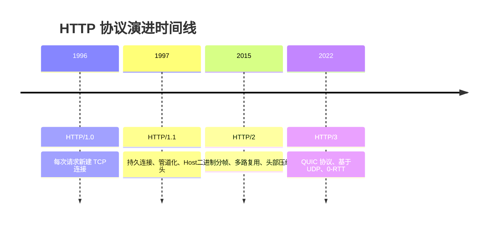
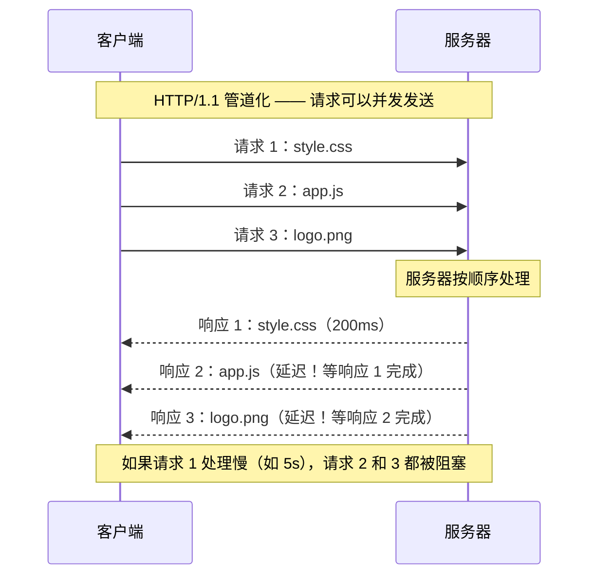
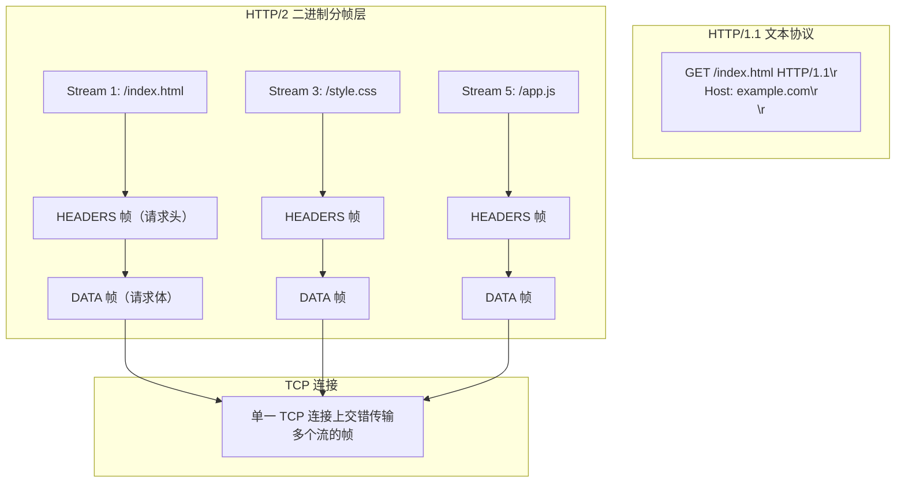
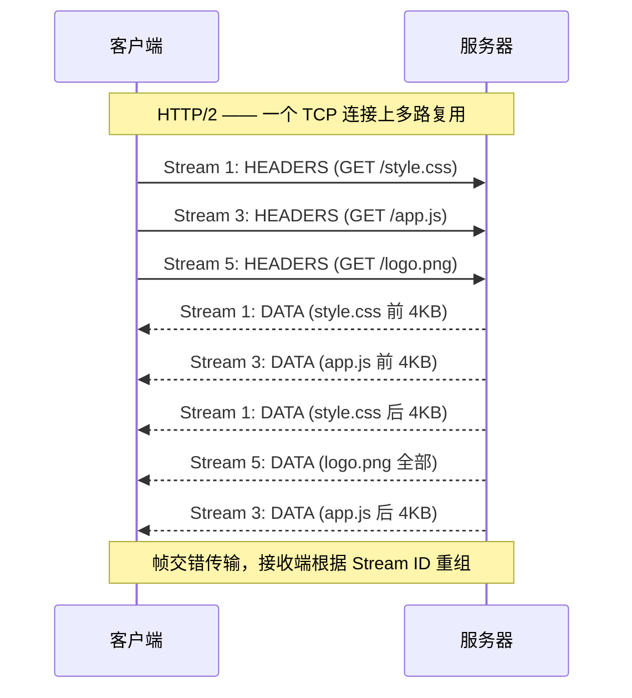
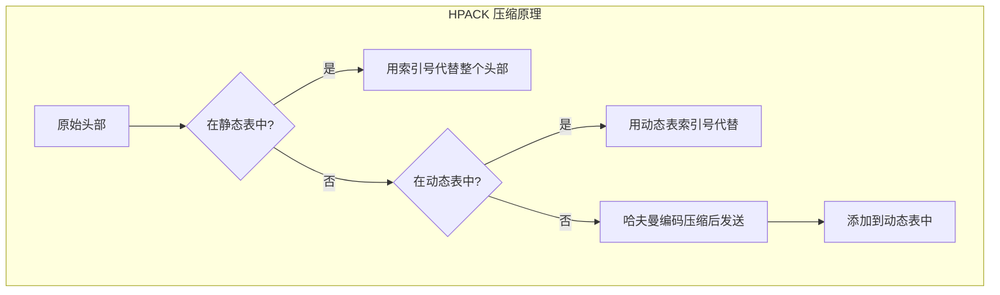
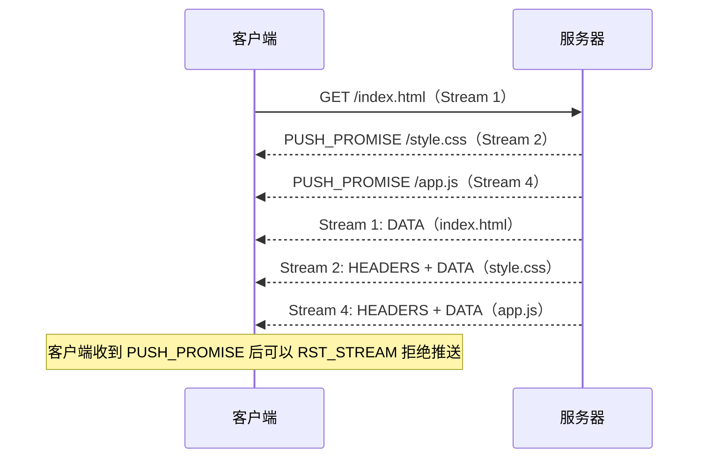
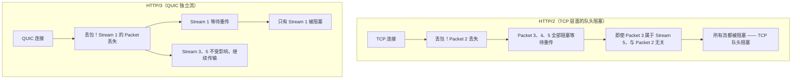
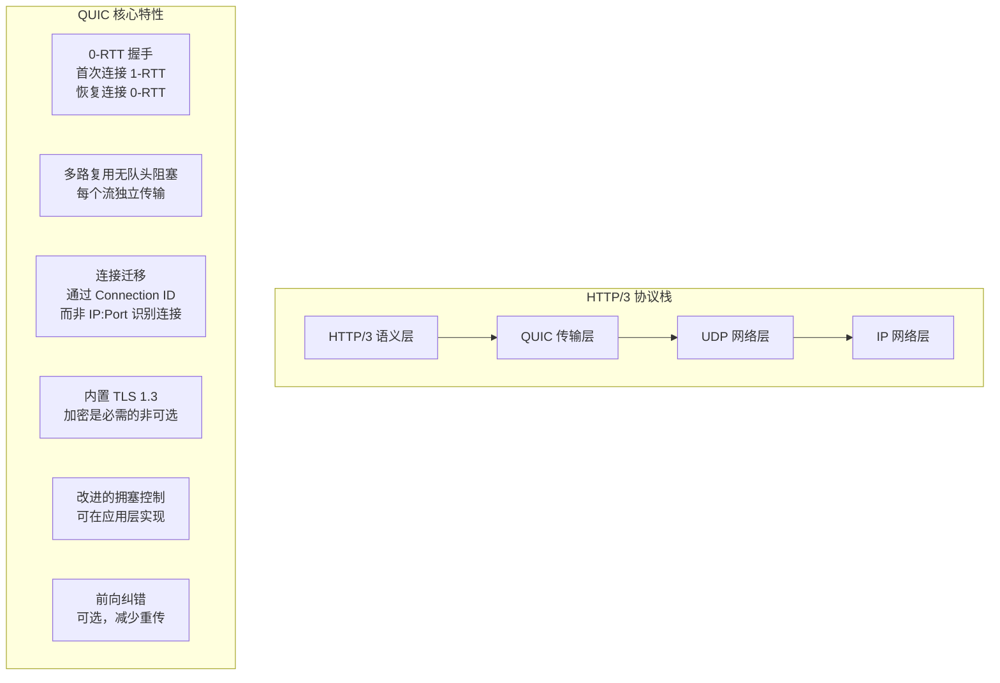
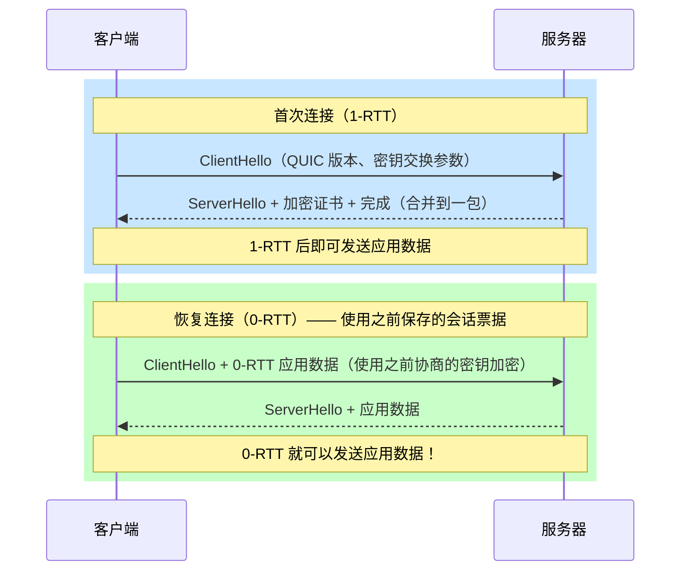
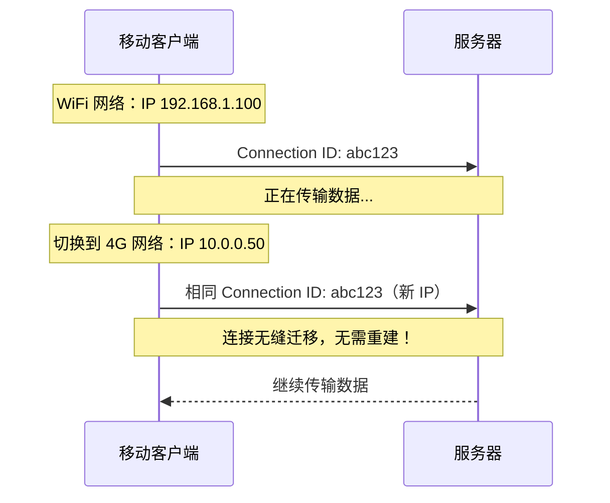

# HTTP/1.1 vs HTTP/2 vs HTTP/3

## ⭐ 面试重点速览

| 知识模块 | 重点内容 | 面试频率 |
|----------|----------|----------|
| HTTP/1.1 缺点 | 队头阻塞、TCP 连接数限制、头部冗余 | 极高 |
| HTTP/2 核心特性 | 二进制分帧、多路复用、头部压缩（HPACK）、服务器推送 | 极高 |
| HTTP/3 核心特性 | QUIC 协议、基于 UDP、0-RTT、连接迁移、彻底解决队头阻塞 | 极高 |
| 协议对比 | 队头阻塞层级、连接建立时间、传输层协议、头部压缩算法 | 极高 |
| 实际应用 | 如何升级、Nginx 配置、兼容性考量 | 高 |

---

## 一、HTTP 协议演进总览



### 核心对比速查表

| 维度 | HTTP/1.1 | HTTP/2 | HTTP/3 |
|------|----------|--------|--------|
| **传输层协议** | TCP | TCP | QUIC（基于 UDP） |
| **连接复用** | 持久连接（Keep-Alive） | 多路复用（单连接） | 多路复用（单连接） |
| **队头阻塞** | 存在（TCP 层面） | 存在（TCP 层面，但流级无阻塞） | 彻底解决（流级独立） |
| **头部压缩** | 无（每次请求带完整头部） | HPACK（静态表+动态表+哈夫曼编码） | QPACK（解决 HPACK 队头阻塞） |
| **服务器推送** | 不支持 | 支持（Server Push） | 支持（但 WebTransport 优先） |
| **连接建立** | TCP 三次握手 | TCP 三次握手 + TLS 1.2/1.3 | 0-RTT（QUIC 内置 TLS 1.3） |
| **请求优先级** | 无 | 支持（流优先级/依赖） | 支持（改进的优先级） |
| **连接迁移** | 不支持（IP 变化需重建连接） | 不支持 | 支持（Connection ID） |
| **二进制协议** | 否（文本协议） | 是（二进制帧） | 是（二进制帧） |
| **语义兼容** | — | 兼容 HTTP/1.1 语义 | 兼容 HTTP/1.1 语义 |

---

## 二、HTTP/1.1 的核心问题

### 2.1 队头阻塞（Head-of-Line Blocking）

HTTP/1.1 在同一个 TCP 连接上，请求必须**按顺序处理**。前一个请求的响应未返回，后续请求必须等待。



::: danger 队头阻塞的本质
HTTP/1.1 的队头阻塞发生在**应用层**。虽然可以开启多个 TCP 连接（浏览器通常限制为 6 个/域名），但每个连接内部仍然是串行的。更关键的是，即使 HTTP/2 解决了应用层队头阻塞，TCP 层面的队头阻塞依然存在（丢包时 TCP 必须重传，阻塞所有流）。
:::

### 2.2 头部冗余严重

```http
# HTTP/1.1 —— 每次请求都携带大量重复头部
GET /api/users HTTP/1.1
Host: example.com
User-Agent: Mozilla/5.0 ... (200+ 字节)
Accept: text/html,application/xhtml+xml,...
Accept-Language: zh-CN,zh;q=0.9,en;q=0.8
Accept-Encoding: gzip, deflate, br
Cookie: session_id=abc123... (500+ 字节)
Cache-Control: no-cache

# 每次请求，这些头部几乎完全相同，但都要重复发送
# 50 个请求 × 平均 800 字节头部 = 40KB 纯头部开销
```

### 2.3 TCP 连接数限制

浏览器对同一域名的并发 TCP 连接数有限制（通常 6 个），导致：
- 资源加载瓶颈（页面需要加载大量 JS/CSS/图片）
- 多域名拆分（domain sharding）增加 DNS 查询和 TCP 连接开销

---

## 三、HTTP/2 核心特性

### 3.1 二进制分帧（Binary Framing）

HTTP/2 将 HTTP/1.1 的文本协议改为**二进制协议**，在 TCP 连接上建立**帧（Frame）**和**流（Stream）**的概念。



**核心概念**：

| 概念 | 说明 |
|------|------|
| **帧（Frame）** | HTTP/2 的最小通信单位，每个帧属于一个流 |
| **流（Stream）** | 一个 TCP 连接上的虚拟通道，可承载双向消息，有唯一 ID |
| **消息（Message）** | 一个完整的 HTTP 请求或响应，由一个或多个帧组成 |
| **连接（Connection）** | 一个 TCP 连接，包含多个流 |

### 3.2 多路复用（Multiplexing）

多路复用允许在**单一 TCP 连接**上同时发送多个请求和响应，帧交错传输，接收方根据流 ID 重新组装。



::: tip 多路复用的优势
- **减少连接数**：一个域名只需要一个 TCP 连接
- **减少握手开销**：不需要多次 TCP + TLS 握手
- **避免头部冗余**：配合 HPACK 头部压缩
- **请求优先级**：通过流优先级控制资源加载顺序
:::

### 3.3 头部压缩（HPACK）

HTTP/2 使用 HPACK 算法压缩请求和响应头部，减少带宽消耗。



**HPACK 三大核心机制**：

| 机制 | 说明 | 示例 |
|------|------|------|
| **静态表（61 项）** | 预定义的常见头部键值对 | `:method: GET` → 索引 2 |
| **动态表** | 连接过程中动态添加的头部，双方维护 | 自定义 Cookie 首次发送后加入动态表 |
| **哈夫曼编码** | 对字符进行不等长编码，高频字符用短码 | 减少未命中表的头部体积 |

```javascript
// HPACK 压缩效果示意
// 原始头部（约 800 字节）
// :method: GET
// :scheme: https
// :path: /api/users
// :authority: example.com
// cookie: session_id=abc123...
// user-agent: Mozilla/5.0 ...

// 压缩后（约 50 字节）
// 索引 2（:method: GET）
// 索引 7（:scheme: https）
// 哈夫曼编码的 /api/users
// 索引 1（:authority 动态表已添加）
// 索引 62（cookie 动态表已添加）
```

### 3.4 服务器推送（Server Push）

服务器可以在客户端请求**之前**主动推送资源，减少往返次数。



::: warning 服务器推送的现状
虽然 HTTP/2 规范定义了 Server Push，但实际使用中问题较多：
- 浏览器可能已经缓存了资源，推送造成浪费
- 推送的资源可能不是客户端需要的（如条件加载的 CSS）
- Chrome 106+ 已默认禁用 Server Push
- 推荐使用 `<link rel="preload">` 替代，更精确可控
:::

---

## 四、HTTP/3 与 QUIC 协议

### 4.1 为什么需要 HTTP/3

HTTP/2 虽然解决了应用层队头阻塞，但**TCP 层的队头阻塞依然存在**。TCP 是可靠的字节流协议，一旦发生丢包，后续所有数据都必须等待重传，即使属于不同流的数据也会被阻塞。



### 4.2 QUIC 协议核心特性



| 特性 | HTTP/2 (TCP) | HTTP/3 (QUIC) |
|------|-------------|---------------|
| **握手延迟** | TCP + TLS 需要 2-3 RTT | 首次 1-RTT，恢复 0-RTT |
| **队头阻塞** | TCP 层面存在 | 彻底解决（流级别独立） |
| **连接迁移** | 不支持（IP 变化需重建） | 支持（Connection ID 不变） |
| **加密** | TLS 可选（HTTP/2 规范要求加密） | TLS 1.3 内置，不可关闭 |
| **拥塞控制** | 内核实现 | 用户空间实现，可灵活替换 |
| **NAT 穿透** | 较差 | 更好（UDP 本就支持） |

### 4.3 0-RTT 握手



::: warning 0-RTT 的安全风险
0-RTT 数据存在**重放攻击**风险：攻击者可以截获 0-RTT 数据包并重新发送。因此：
- 仅幂等请求（GET、HEAD）可以使用 0-RTT
- 非幂等请求（POST、PUT、DELETE）不应使用 0-RTT
- 服务器可以通过记录 ClientHello 随机数来检测重放
:::

### 4.4 连接迁移

QUIC 使用 **Connection ID** 而非 IP:Port 来标识连接，即使网络切换（如 WiFi 切换到 4G/5G），连接也不会中断。



---

## 五、实战配置

### 5.1 Nginx 启用 HTTP/2

```nginx
# Nginx 启用 HTTP/2（需要 nginx 1.9.5+，OpenSSL 1.0.2+）
server {
    listen 443 ssl http2;  # 关键：加上 http2
    server_name example.com;

    ssl_certificate     /etc/nginx/ssl/cert.pem;
    ssl_certificate_key /etc/nginx/ssl/key.pem;
    ssl_protocols       TLSv1.2 TLSv1.3;

    # HTTP/2 服务器推送（Nginx 1.13.9+）
    location / {
        http2_push /css/style.css;
        http2_push /js/app.js;
    }
}
```

### 5.2 Nginx 启用 HTTP/3

```nginx
# Nginx 启用 HTTP/3（需要 nginx 1.25.0+，编译时加 --with-http_v3_module）
server {
    # HTTP/3 使用 UDP 443 端口
    listen 443 quic reuseport;
    # HTTP/2 和 HTTP/1.1 回退
    listen 443 ssl;

    server_name example.com;

    ssl_certificate     /etc/nginx/ssl/cert.pem;
    ssl_certificate_key /etc/nginx/ssl/key.pem;

    # 告诉客户端服务器支持 HTTP/3（Alt-Svc 响应头）
    add_header Alt-Svc 'h3=":443"; ma=86400';
}
```

### 5.3 浏览器兼容性

| 协议 | Chrome | Firefox | Safari | Edge |
|------|--------|---------|--------|------|
| HTTP/2 | 41+ | 36+ | 10.1+ | 14+ |
| HTTP/3 | 87+ | 88+ | 14+ | 87+ |

---

## 六、面试高频问答

### Q1：HTTP/2 的多路复用和 HTTP/1.1 的 Keep-Alive 有什么区别？

| 维度 | HTTP/1.1 Keep-Alive | HTTP/2 多路复用 |
|------|--------------------|--------------------|
| 并发方式 | 串行（管道化不成熟） | 真正的并行（帧交错） |
| 连接数 | 通常 6 个/域名 | 1 个/域名 |
| 队头阻塞 | 严重（请求-响应必须顺序） | 应用层无队头阻塞（流独立） |
| 头部传输 | 每次完整传输 | HPACK 压缩 + 索引 |

### Q2：HTTP/2 真的解决了队头阻塞吗？

**部分解决**。HTTP/2 解决了**应用层队头阻塞**（请求-响应不再串行），但**TCP 层面的队头阻塞依然存在**。因为 HTTP/2 的所有流复用一个 TCP 连接，一旦 TCP 丢包，所有流的数据都必须等待重传。HTTP/3 基于 QUIC（UDP）才彻底解决了队头阻塞。

### Q3：HTTP/3 为什么基于 UDP 而不是 TCP？

1. **TCP 队头阻塞无法在应用层解决**：TCP 的可靠传输机制在操作系统内核中实现，无法绕过
2. **QUIC 在 UDP 之上实现了类似 TCP 的可靠传输**：拥塞控制、丢包重传、流量控制
3. **QUIC 内置 TLS 1.3**：减少握手次数
4. **连接迁移**：UDP 无连接的特性使得 Connection ID 方案成为可能
5. **快速迭代**：QUIC 在用户空间实现，无需等待操作系统内核更新

### Q4：HTTP/2 的服务器推送和预加载（preload）有什么区别？

| 维度 | Server Push | `<link rel="preload">` |
|------|-------------|------------------------|
| 发起方 | 服务器主动推送 | 浏览器根据 HTML 解析后请求 |
| 时机 | 在客户端请求之前 | 在 HTML 解析时 |
| 缓存感知 | 服务器可能推送已缓存的资源 | 浏览器可检查缓存决定是否加载 |
| 浏览器支持 | 逐渐被弃用（Chrome 106+ 已禁用） | 广泛支持，推荐使用 |

### Q5：如何判断一个网站使用的是 HTTP/2 还是 HTTP/3？

- **Chrome DevTools**：Network 面板 → 右键表头 → 勾选 Protocol 列 → 查看 `h2` / `h3` / `http/1.1`
- **命令行**：`curl -I --http2 https://example.com` 或 `curl -I --http3 https://example.com`
- **在线工具**：HTTP/2 Test、HTTP/3 Check 等

### Q6：HTTP/2 的流优先级是如何工作的？

HTTP/2 允许客户端为每个流设置优先级和依赖关系：
- 浏览器可以为关键资源（CSS、字体）设置高优先级
- 可以为非关键资源（图片、分析脚本）设置低优先级
- 服务器根据优先级调度资源发送

但实际实现中，各浏览器和服务器优先级策略差异较大，HTTP/3 进一步简化了优先级模型。

### Q7：升级到 HTTP/2 或 HTTP/3 需要修改前端代码吗？

**不需要**。HTTP/2 和 HTTP/3 完全兼容 HTTP/1.1 的语义，前端代码无需任何修改。但以下优化策略需要调整：

| HTTP/1.1 优化 | HTTP/2/3 下的建议 |
|---------------|-------------------|
| 雪碧图（CSS Sprites） | 不再需要（多路复用消除了请求开销） |
| 多域名拆分（Domain Sharding） | 应避免（增加 DNS 和连接开销） |
| 文件合并（Bundle） | 适度拆分更优（利用缓存粒度） |
| 内联资源（Inline CSS/JS） | 谨慎使用（损失了缓存独立性） |