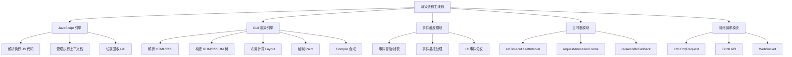
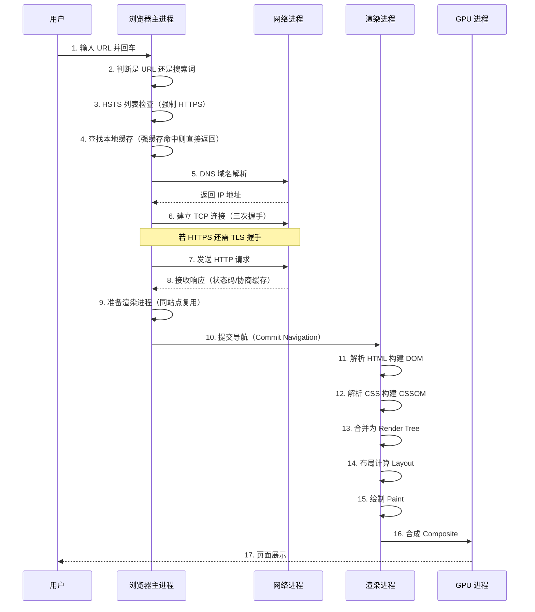
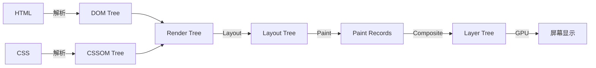

# 浏览器原理概览

## ⭐ 面试重点速览

| 知识模块 | 重点内容 | 面试频率 |
|----------|----------|----------|
| 多进程架构 | 浏览器进程/渲染进程/GPU 进程/网络进程/插件进程职责 | 极高 |
| 渲染进程主线程 | JS 引擎、GUI 渲染、事件触发、定时器、网络请求 | 极高 |
| 进程 vs 线程 | 进程隔离、沙箱机制、多进程优缺点 | 高 |
| 导航流程 | URL 输入到页面展示的完整过程 | 极高 |
| 渲染流程 | DOM/CSSOM/Render Tree/Layout/Paint/Composite | 极高 |
| HTTP 缓存 | 强缓存/协商缓存、缓存策略设计 | 极高 |
| HTTP 版本对比 | HTTP/1.1 vs HTTP/2 vs HTTP/3 核心差异 | 中高 |
| CORS 跨域 | 简单请求/预检请求、credentials 配置、常见解决方案 | 极高 |
| WebSocket | 握手过程、断线重连、心跳检测 | 中高 |
| WASM / WebGPU | WebAssembly 概念、WASI 1.0、WebGPU 算力 | 中 |
| 安全机制 | 同源策略、沙箱、站点隔离 | 中高 |

---

## 一、浏览器多进程架构

现代浏览器（以 Chrome 为代表）采用**多进程架构**，每个 Tab 页面通常对应一个独立的渲染进程。这种设计确保了某个页面崩溃不会影响其他页面。

### 1.1 各进程职责表

| 进程 | 核心职责 | 典型数量 |
|------|----------|----------|
| **浏览器主进程**（Browser Process） | 负责界面显示（地址栏、书签、前进/后退）、用户交互、子进程管理、文件存储 | 仅 1 个 |
| **渲染进程**（Renderer Process） | 负责页面渲染（HTML/CSS/JS）、运行 JavaScript、处理 DOM 操作 | 每个 Tab 一个（站点隔离下可能更多） |
| **GPU 进程**（GPU Process） | 负责 3D 绘制、合成层加速、视频解码硬件加速 | 仅 1 个 |
| **网络进程**（Network Process） | 负责网络资源加载（HTTP/HTTPS）、DNS 解析、缓存管理 | 仅 1 个 |
| **插件进程**（Plugin Process） | 负责运行浏览器插件（Flash 等），因插件易崩溃而隔离 | 每个插件一个 |
| **扩展进程**（Extension Process） | Chrome 扩展程序的运行环境 | 若干 |
| **存储进程**（Storage Process） | IndexedDB、LocalStorage 等存储操作 | 仅 1 个 |

::: tip 为什么采用多进程架构？
1. **稳定性**：单个 Tab 崩溃不影响其他页面
2. **安全性**：沙箱隔离，恶意页面无法访问系统资源
3. **性能**：充分利用多核 CPU，并行处理不同任务
4. **资源管理**：关闭 Tab 即可彻底释放内存
:::

::: danger 多进程的代价
- 内存占用高：每个进程都有独立的内存空间，基础开销约 50-100MB
- 进程间通信（IPC）开销：数据需要序列化/反序列化传递
- 启动速度慢：创建新进程比创建新线程慢
:::

### 1.2 多进程架构图

```mermaid
graph TB
    subgraph 浏览器主进程
        A1[UI 线程]
        A2[存储线程]
        A3[IO 线程]
    end

    subgraph 网络进程
        B1[网络 IO 线程]
        B2[缓存线程]
    end

    subgraph GPU 进程
        C1[合成线程]
        C2[光栅化线程]
    end

    subgraph 渲染进程1
        D1[主线程]
        D2[合成线程]
        D3[IO 线程]
        D4[Worker 线程]
    end

    subgraph 渲染进程2
        E1[主线程]
        E2[合成线程]
    end

    subgraph 插件进程
        F1[Flash 进程]
    end

    浏览器主进程 -->|IPC| 网络进程
    浏览器主进程 -->|IPC| GPU 进程
    浏览器主进程 -->|IPC| 渲染进程1
    浏览器主进程 -->|IPC| 渲染进程2
    浏览器主进程 -->|IPC| 插件进程
    网络进程 -->|数据流| 渲染进程1
    GPU 进程 -->|合成帧| 浏览器主进程
```

---

## 二、渲染进程主线程

渲染进程是前端开发者最关心的部分，其主线程负责页面的核心工作。**主线程是单线程的**，这意味着所有任务排队执行，一个长任务会阻塞后续所有操作。

### 2.1 主线程架构



### 2.2 各子模块详解

| 子模块 | 说明 | 面试关联 |
|--------|------|----------|
| **JS 引擎**（V8） | 解析和执行 JavaScript 代码，负责内存管理（GC） | V8 工作原理、JIT 编译、隐藏类 |
| **GUI 渲染引擎**（Blink） | 解析 HTML/CSS，构建 DOM 树和 CSSOM 树，执行布局和绘制 | 渲染流程、重绘回流、合成层 |
| **事件触发模块** | 管理事件循环、处理用户交互事件（click、scroll 等） | Event Loop、事件委托、事件模型 |
| **定时器模块** | 管理 setTimeout、setInterval、requestAnimationFrame 等 | 定时器精度、rAF 原理、宏任务 |
| **网络请求模块** | 处理 XMLHttpRequest、Fetch API、WebSocket 等网络请求 | HTTP 缓存、跨域、请求优先级 |

::: warning JS 和 GUI 渲染互斥
JavaScript 引擎线程和 GUI 渲染线程是**互斥**的。当 JS 执行时，GUI 渲染线程会被挂起；当 GUI 渲染执行时，JS 线程也会被挂起。这就是为什么**长任务会阻塞页面渲染**——如果 JS 执行时间超过 50ms，用户就会感知到卡顿。

```javascript
// ❌ 长任务阻塞渲染 —— 页面会卡住 3 秒
function blockingTask() {
    const start = Date.now();
    while (Date.now() - start < 3000) {
        // 持续占用主线程，渲染队列中的任务全部被阻塞
    }
    console.log('3 秒后才执行这行');
}

// ✅ 将长任务切片，让出主线程给渲染
function chunkedTask(data, chunkSize = 100) {
    let index = 0;
    function processChunk() {
        const end = Math.min(index + chunkSize, data.length);
        for (let i = index; i < end; i++) {
            // 处理 data[i]
        }
        index = end;
        if (index < data.length) {
            // 让出主线程，下一个宏任务再继续
            setTimeout(processChunk, 0);
        }
    }
    processChunk();
}
```
:::

---

## 三、从输入 URL 到页面展示 —— 完整导航流程

这是前端面试的经典压轴题，考察对浏览器整体架构的理解深度。



### 3.1 各阶段关键点

| 阶段 | 关键知识点 | 面试追问 |
|------|-----------|----------|
| DNS 解析 | 递归查询 vs 迭代查询、DNS 缓存、DNS 预解析（`<link rel="dns-prefetch">`） | DNS 解析过程？如何优化？ |
| TCP 连接 | 三次握手（SYN/SYN-ACK/ACK）、四次挥手、TCP 拥塞控制 | 为什么是三次握手不是两次？ |
| TLS 握手 | HTTPS 加密过程、证书链验证、对称/非对称加密 | HTTPS 如何保证安全？ |
| HTTP 请求 | 请求头/响应头、缓存策略、CDN、HTTP/2 多路复用 | 强缓存和协商缓存的区别？ |
| 渲染进程 | 准备渲染进程、提交导航、确认导航 | 同站点复用策略？ |
| 页面渲染 | DOM/CSSOM/Render Tree/Layout/Paint/Composite | 重绘与回流的区别？ |

::: tip 同站点进程复用
Chrome 的**站点隔离（Site Isolation）**策略：同站点（同协议+同域名+同端口）的页面复用同一个渲染进程，不同站点的页面使用独立渲染进程。这既节省了资源，又保证了安全性。

可以通过 `rel="noopener"` 或 `Cross-Origin-Opener-Policy` 头来控制进程隔离行为。
:::

---

## 四、页面渲染流程总览

详见 [渲染流程](./rendering.md) 章节，这里给出核心流程：



---

## 五、面试追问环节

**Q：Chrome 打开一个页面至少需要几个进程？**

最少 4 个：浏览器主进程（1 个）+ GPU 进程（1 个）+ 网络进程（1 个）+ 渲染进程（1 个）。如果页面有插件，还需要额外的插件进程。如果有扩展，还需要扩展进程。

**Q：为什么 JavaScript 是单线程的？**

JavaScript 最初设计用于操作 DOM，如果多线程同时操作 DOM，会出现复杂的并发问题（如一个线程删除节点，另一个线程修改节点）。单线程避免了锁竞争和状态同步的复杂性。

::: danger 面试中容易翻车的点
- **混淆进程和线程**：浏览器是"多进程架构"，渲染进程内部是"多线程"（主线程、合成线程、IO 线程等）
- **说不清 IPC 通信**：进程间通信通过 Chrome 的 Mojo IPC 框架，数据需要序列化传递
- **忽略 Service Worker**：Service Worker 运行在独立的线程中，不受页面生命周期影响
- **主线程单线程 ≠ 渲染进程单线程**：渲染进程内有多个线程，但 JS 和 GUI 渲染都在主线程
:::

**Q：如何优化首屏加载速度？从浏览器原理角度回答。**

1. **减少关键资源大小**：压缩 HTML/CSS/JS、Tree Shaking、Code Splitting
2. **减少关键资源数量**：内联关键 CSS、延迟非关键 JS（defer/async）、懒加载图片
3. **缩短网络路径**：CDN、DNS 预解析、Preconnect、HTTP/2 多路复用
4. **优化渲染路径**：避免阻塞渲染的 JS（script 标签的 async/defer）、减少重绘回流
5. **利用缓存**：强缓存（Cache-Control）、Service Worker 缓存、资源预加载（`<link rel="preload">`）

**Q：浏览器如何处理一个页面的内存？何时触发 GC？**

V8 的垃圾回收采用**分代回收**策略：
- 新生代（Young Generation）：使用 Scavenge 算法（标记-复制），存活对象晋升到老生代
- 老生代（Old Generation）：使用标记-清除 + 标记-整理算法，配合增量标记减少停顿

触发时机：内存分配失败时、空闲时（Idle Time）、显式 GC（不建议手动触发）。V8 的 Orinoco 项目引入了并行、增量、并发 GC 来减少 Stop-The-World 时间。