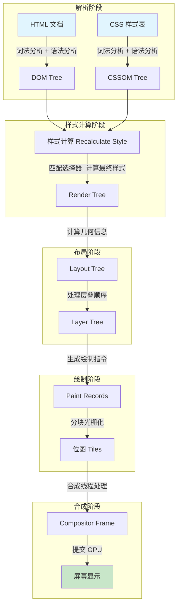
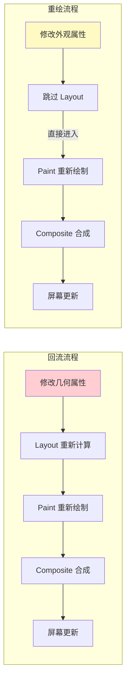
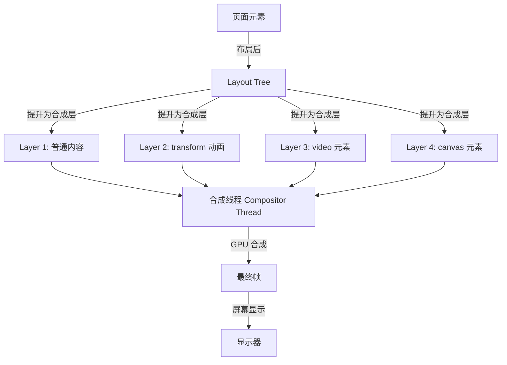

# 渲染流程

## ⭐ 面试重点速览

| 知识模块 | 重点内容 | 面试频率 |
|----------|----------|----------|
| 渲染流水线 | DOM → CSSOM → Render Tree → Layout → Paint → Composite | 极高 |
| 重绘（Repaint） | 触发条件、性能影响、优化策略 | 极高 |
| 回流（Reflow） | 触发条件、性能影响、优化策略 | 极高 |
| 合成层（Composite） | transform/opacity 触发 GPU 加速、will-change | 极高 |
| 强制同步布局 | 读写分离、FastDOM 模式、性能陷阱 | 高 |
| 性能优化 | 虚拟滚动、DocumentFragment、requestAnimationFrame | 高 |

---

## 一、完整渲染流程

浏览器渲染一个页面的完整流水线包含 6 个关键阶段，每个阶段都有明确的输入和输出。



### 1.1 各阶段详解

| 阶段 | 输入 | 输出 | 关键操作 | 可中断？ |
|------|------|------|----------|----------|
| **解析 HTML** | HTML 文本 | DOM Tree | 词法分析（Tokenizer）→ 语法分析（Tree Builder） | 是（网络加载时） |
| **解析 CSS** | CSS 文本 | CSSOM Tree | 词法分析 → 语法分析，CSS 解析**不阻塞 DOM 构建**但阻塞渲染 | 是 |
| **样式计算** | DOM + CSSOM | Render Tree | 匹配选择器（从右向左），计算每个节点的最终样式（继承、层叠） | 是 |
| **布局 Layout** | Render Tree | Layout Tree | 计算每个节点的几何位置和尺寸（盒模型），处理浮动、定位 | 否 |
| **绘制 Paint** | Layout Tree | Paint Records | 将绘制指令记录到 Display List（绘制 Z 序分 13 层：背景→边框→前景） | 否 |
| **合成 Composite** | Paint Records | 屏幕帧 | 分块光栅化 → 合成位图 → GPU 绘制，在合成线程中执行 | 否 |

::: tip CSS 解析不阻塞 DOM 构建，但阻塞渲染
- CSS 解析和 DOM 构建**并行**进行
- 但 CSSOM 构建完成前，不会进入 Render Tree 阶段（因为 CSS 可能隐藏元素 display:none）
- **CSS 会阻塞 JS 执行**（因为 JS 可能读取样式，如 `element.style.width`）
- 结论：CSS 是**渲染阻塞资源**（render-blocking resource）
:::

### 1.2 渲染流程关键代码示例

```javascript
// 演示：渲染流程中每一阶段的耗时可以通过 Performance API 观察
const observer = new PerformanceObserver((list) => {
    for (const entry of list.getEntries()) {
        console.log(`${entry.name}: ${entry.duration.toFixed(2)}ms`);
    }
});
observer.observe({ entryTypes: ['paint', 'layout-shift', 'largest-contentful-paint'] });

// 关键指标：
// - FP（First Paint）：首次绘制，页面第一个像素点渲染的时间
// - FCP（First Contentful Paint）：首次内容绘制，第一个 DOM 内容渲染的时间
// - LCP（Largest Contentful Paint）：最大内容绘制，页面主要内容渲染完成的时间
// - CLS（Cumulative Layout Shift）：累计布局偏移，衡量视觉稳定性
```

---

## 二、重绘（Repaint）与回流（Reflow）

### 2.1 核心概念

| 概念 | 定义 | 性能开销 | 触发阶段 |
|------|------|----------|----------|
| **重绘（Repaint）** | 元素外观改变但不影响布局（如颜色、背景、visibility） | 中（跳过 Layout） | 直接进入 Paint 阶段 |
| **回流（Reflow）** | 元素的几何属性改变（尺寸、位置），需要重新计算布局 | 高（重新 Layout + Paint + Composite） | 从 Layout 重新开始 |



### 2.2 回流（Reflow）触发条件

::: danger 以下操作必定触发回流（按触发频率排序）

**1. 修改元素的几何属性（最频繁）**
```javascript
// 以下任一操作都会触发回流
element.style.width = '200px';        // 修改宽度
element.style.height = '100px';       // 修改高度
element.style.margin = '10px';        // 修改外边距
element.style.padding = '20px';       // 修改内边距
element.style.border = '1px solid';   // 修改边框
element.style.fontSize = '16px';      // 修改字体大小（影响行高）
element.style.display = 'none';       // 隐藏元素
```

**2. 获取布局信息（强制同步布局）**
```javascript
// 读取这些属性会强制浏览器立即计算布局
element.offsetTop;        // 元素相对 offsetParent 的顶部距离
element.offsetLeft;       // 元素相对 offsetParent 的左侧距离
element.offsetWidth;      // 元素的布局宽度
element.offsetHeight;     // 元素的布局高度
element.scrollTop;        // 滚动位置
element.scrollLeft;
element.clientWidth;      // 可视区域宽度
element.clientHeight;
element.getBoundingClientRect(); // 元素相对视口的位置和尺寸
window.getComputedStyle(element); // 计算后的样式
```

**3. DOM 节点的增删**
```javascript
document.body.appendChild(newNode);   // 添加节点
element.removeChild(childNode);       // 删除节点
element.innerHTML = 'new content';    // 修改内容（可能改变高度）
```

**4. 窗口尺寸变化**
```javascript
// resize 事件触发时，所有元素都需要重新布局
window.addEventListener('resize', () => {
    // 此时页面发生回流
});
```
:::

### 2.3 重绘（Repaint）触发条件

::: tip 以下操作只触发重绘，不触发回流
```javascript
// 仅修改外观属性，不改变几何信息
element.style.color = 'red';           // 修改颜色
element.style.backgroundColor = '#fff'; // 修改背景色
element.style.borderColor = 'blue';    // 修改边框颜色
element.style.visibility = 'hidden';   // 隐藏（保留布局空间）
element.style.boxShadow = '0 0 10px';  // 修改阴影
element.style.outline = '1px solid';   // 修改轮廓
element.style.backgroundImage = '...'; // 修改背景图
```
:::

---

## 三、合成层（Composite）与 GPU 加速

### 3.1 合成层原理

现代浏览器将页面分解为多个**图层（Layer）**，每个图层独立光栅化，最后在合成线程中合并为最终画面。这种机制的核心优势是：**某些属性的变化只需要重新合成，跳过 Layout 和 Paint 阶段。**



### 3.2 触发合成层的条件

| 触发方式 | 示例 | 说明 |
|----------|------|------|
| **3D transform** | `transform: translateZ(0)` 或 `translate3d(0,0,0)` | 最常用的 hack 方式 |
| **will-change** | `will-change: transform` | 告知浏览器即将变化的属性 |
| **video / canvas / iframe** | 这些元素默认独立图层 | 浏览器自动处理 |
| **opacity 动画** | CSS 动画或 transition 中的 opacity | 配合 transform 使用 |
| **CSS filter** | `filter: blur(5px)` | 需要 GPU 加速计算 |
| **position: fixed** | 固定定位元素 | 滚动时需要独立层 |
| **overflow: scroll** | 滚动容器 | 需要独立层处理滚动 |

### 3.3 合成层优化实战

```css
/* ✅ 推荐：使用 transform 实现动画，跳过 Layout 和 Paint */
.animated-box {
    transition: transform 0.3s ease;
}
.animated-box:hover {
    transform: translateX(100px); /* 只触发 Composite，不触发 Layout 和 Paint */
}

/* ❌ 避免：使用 left 实现动画，触发 Layout */
.animated-box-bad {
    transition: left 0.3s ease;
}
.animated-box-bad:hover {
    left: 100px; /* 触发 Reflow → Repaint → Composite，性能差 */
}
```

```css
/* ✅ 使用 will-change 预先创建合成层 */
.optimized {
    will-change: transform, opacity;
}

/* ⚠️ 注意：不要滥用 will-change —— 过度创建合成层会导致内存暴涨 */
/* 每个合成层都需要独立的 GPU 显存，移动端尤其敏感 */
```

::: danger 合成层陷阱 —— 层爆炸（Layer Explosion）
过度使用 `will-change` 或 `translateZ(0)` 会导致**层爆炸**：
- 每个合成层消耗约 1-3MB GPU 显存（取决于层尺寸）
- 移动端 GPU 显存有限，可能导致页面崩溃
- 过多的合成层会增加合成线程的工作量，反而降低性能

**优化建议**：
- 动画结束后移除 `will-change`（或在动画期间短暂添加）
- 使用 Chrome DevTools → Layers 面板查看合成层数量
- 谨防隐式合成：一个元素提升为合成层，其后续兄弟元素也可能被隐式提升
:::

---

## 四、强制同步布局（Forced Synchronous Layout）

### 4.1 问题描述

强制同步布局是前端性能中最隐蔽的杀手之一。当你在**修改样式后立即读取布局信息**时，浏览器被迫立即执行 Layout 计算，导致性能骤降。

```javascript
// ❌ 强制同步布局 —— 每次循环触发一次回流
function resizeAllParagraphs(width) {
    for (let i = 0; i < paragraphs.length; i++) {
        paragraphs[i].style.width = width + 'px';           // 写 —— 样式失效
        console.log(paragraphs[i].offsetHeight);             // 读 —— 强制 Layout！
        // 浏览器必须立即计算布局才能返回正确的 offsetHeight
    }
}
// 这段代码在 1000 个元素时，可能触发 1000 次 Layout 计算
// 耗时：~30ms（大规模场景下可能超过 100ms）
```

```javascript
// ✅ 读写分离 —— 先批量读，再批量写
function resizeAllParagraphsOptimized(width) {
    // 第一步：批量读取所有高度（触发一次 Layout）
    const heights = [];
    for (let i = 0; i < paragraphs.length; i++) {
        heights.push(paragraphs[i].offsetHeight);
    }

    // 第二步：批量写入所有宽度（触发一次 Layout）
    for (let i = 0; i < paragraphs.length; i++) {
        paragraphs[i].style.width = width + 'px';
    }
}
// 优化后仅触发 1-2 次 Layout，性能提升 100 倍以上
```

### 4.2 FastDOM 模式

```javascript
// FastDOM 模式 —— 将读写操作分离到不同的微任务（或 requestAnimationFrame）
class FastDOM {
    constructor() {
        this.reads = [];
        this.writes = [];
        this.scheduled = false;
    }

    measure(fn) {
        this.reads.push(fn);
        this.scheduleFlush();
    }

    mutate(fn) {
        this.writes.push(fn);
        this.scheduleFlush();
    }

    scheduleFlush() {
        if (!this.scheduled) {
            this.scheduled = true;
            requestAnimationFrame(() => {
                // 先执行所有读取操作
                const reads = this.reads;
                this.reads = [];
                reads.forEach(fn => fn());

                // 再执行所有写入操作
                const writes = this.writes;
                this.writes = [];
                writes.forEach(fn => fn());

                this.scheduled = false;
            });
        }
    }
}

// 使用示例
const fastDOM = new FastDOM();
fastDOM.measure(() => {
    const h = element.offsetHeight; // 读操作
});
fastDOM.mutate(() => {
    element.style.height = '200px'; // 写操作
});
```

---

## 五、面试高频问题汇总

### Q1：重绘和回流的区别？为什么 transform 比 left/top 性能好？

| 维度 | 重绘（Repaint） | 回流（Reflow） |
|------|----------------|----------------|
| 定义 | 外观改变，不影响几何信息 | 几何信息改变，需要重新布局 |
| 触发阶段 | 跳过 Layout，进入 Paint | 从 Layout 重新开始整个流程 |
| 性能开销 | 中（仅重绘像素） | 高（重算布局 + 重绘 + 合成） |
| 典型操作 | color、background、visibility | width、height、margin、padding、left、top |

**为什么 transform 比 left/top 性能好？**

- `left/top` 修改的是元素在文档流中的位置，触发 Layout → Paint → Composite 完整流程
- `transform` 修改的是合成层的变换矩阵，在合成线程中直接处理，跳过主线程的 Layout 和 Paint
- `transform` 动画在 GPU 中执行，不占用主线程资源，可以保持 60fps 流畅度

### Q2：如何减少回流？

::: tip 减少回流的 8 个策略
1. **批量修改样式**：使用 `classList` 一次性修改 className，而非逐条修改 style
2. **读写分离**：避免在修改样式后立即读取布局属性（FastDOM 模式）
3. **离线 DOM 操作**：使用 `DocumentFragment` 或 `display: none` 离线操作后再挂载
4. **使用 CSS 动画**：优先使用 `transform` 和 `opacity` 做动画
5. **使用 `will-change`**：提前告知浏览器将要变化的属性
6. **避免使用 table 布局**：table 中一个小改动可能触发整个表格回流
7. **限制回流范围**：使用 `position: absolute/fixed` 将元素脱离文档流
8. **使用 `requestAnimationFrame`**：将 DOM 操作合并到下一帧执行
:::

```javascript
// ✅ 离线操作示例 —— 使用 DocumentFragment
const fragment = document.createDocumentFragment();
for (let i = 0; i < 1000; i++) {
    const li = document.createElement('li');
    li.textContent = `Item ${i}`;
    fragment.appendChild(li); // 在内存中操作，不触发回流
}
document.getElementById('list').appendChild(fragment); // 一次性挂载，只触发一次回流
```

### Q3：浏览器渲染一帧的时间预算是多少？

60fps 的情况下，每帧只有 **16.67ms**（1000ms / 60）。在这 16.67ms 内，浏览器需要完成：JS 执行 → 样式计算 → 布局 → 绘制 → 合成。如果 JS 执行超过 10ms，剩余时间就不足以完成渲染，导致**掉帧（Jank）**。

```
一帧的 16.67ms 时间分配：
|-- JS 执行（~5ms）--|-- 样式计算（~2ms）--|-- 布局（~3ms）--|-- 绘制（~3ms）--|-- 合成（~3.67ms）--|
```

### Q4：`requestAnimationFrame` 和 `setTimeout` 做动画的区别？

| 维度 | requestAnimationFrame | setTimeout(0) |
|------|----------------------|---------------|
| 执行时机 | 每帧渲染前执行 | 由 Event Loop 决定，可能掉帧 |
| 帧率同步 | 自动匹配屏幕刷新率（60fps/120fps） | 最小间隔约 4ms，不匹配刷新率 |
| 后台标签页 | 自动暂停，节省资源 | 继续运行（但被浏览器节流到 1s） |
| 动画流畅度 | 不会掉帧 | 可能积压多个回调，导致抖动 |
| 使用场景 | 动画、DOM 批量更新 | 延迟执行、任务分片 |

```javascript
// ✅ rAF 动画 —— 与屏幕刷新率同步
let start = null;
function animate(timestamp) {
    if (!start) start = timestamp;
    const progress = timestamp - start;
    element.style.transform = `translateX(${Math.min(progress / 10, 200)}px)`;
    if (progress < 2000) {
        requestAnimationFrame(animate);
    }
}
requestAnimationFrame(animate);
```

### Q5：`visibility: hidden` 和 `display: none` 对渲染流程的影响？

| 属性 | 占据空间 | 触发回流 | 触发重绘 | 子元素可见性 | 事件响应 |
|------|----------|----------|----------|-------------|----------|
| `display: none` | 否 | 是（Layout 阶段移除） | 是 | 不可见 | 无 |
| `visibility: hidden` | 是 | 否 | 是 | 可继承 `visible` | 无 |
| `opacity: 0` | 是 | 否 | 否（合成层处理） | 不可见 | 有 |

::: danger 面试追问：`display: none` 和 `visibility: hidden` 对页面渲染的影响路径完全不同
- `display: none`：从 Render Tree 中移除元素，触发完整的回流+重绘流程
- `visibility: hidden`：元素仍在 Render Tree 中，占据空间，仅触发重绘
- `opacity: 0`：如果元素在独立合成层中，仅触发合成，不触发 Layout 和 Paint
:::