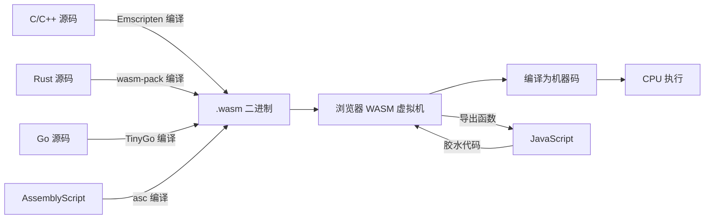
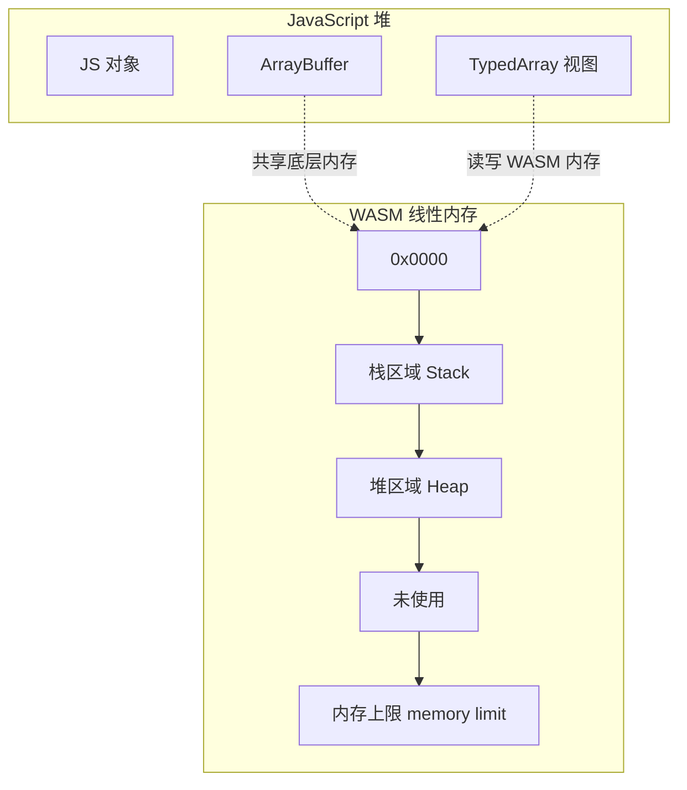
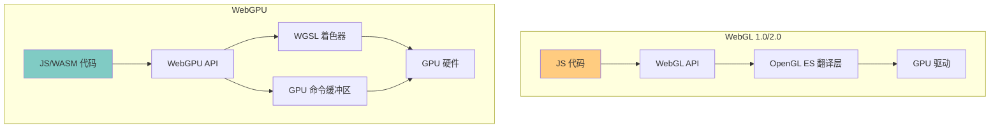

# WASM / WebGPU

## ⭐ 面试重点速览

| 知识模块 | 重点内容 | 面试频率 |
|----------|----------|----------|
| WebAssembly 概念 | 二进制格式、接近原生性能、WASI 1.0 标准化 | 中高 |
| WASM 适用场景 | 图像处理、游戏引擎、科学计算、AI 推理 | 中高 |
| WASM 与 JS 交互 | 内存模型、导入导出、性能对比 | 中 |
| WebGPU | 新一代图形 API、GPU 计算、与 WebGL 对比 | 中 |
| 未来趋势 | WASM 在浏览器外的应用（边缘计算、区块链、插件系统） | 低 |

---

## 一、WebAssembly 核心概念

### 1.1 什么是 WebAssembly？

WebAssembly（简称 WASM）是一种**低级的、类汇编的二进制指令格式**，运行在浏览器沙箱环境中，以接近原生代码的速度执行。它是 Web 平台的第四种官方语言（与 HTML、CSS、JavaScript 并列）。



::: tip WASM 的核心特点
1. **二进制格式**：体积小、解析快（比 JS 文本解析快 20 倍以上），网络传输效率高
2. **接近原生性能**：经过 JIT/AOT 编译后，性能通常达到原生 C/C++ 的 80%-95%
3. **类型安全**：强类型系统，编译时类型检查，运行时不安全的操作被沙箱拦截
4. **语言无关**：不绑定特定语言，C/C++/Rust/Go/AssemblyScript 等均可编译到 WASM
5. **沙箱隔离**：与 JS 运行在同一个安全沙箱中，不能直接访问系统资源（需通过 WASI 或 JS 桥接）
:::

### 1.2 WASM 与 JavaScript 的关系

WASM **不是要替代 JavaScript**，而是与之互补。JavaScript 负责 UI 交互和 DOM 操作，WASM 负责计算密集型任务。

| 维度 | JavaScript | WebAssembly |
|------|------------|-------------|
| **类型系统** | 动态类型 | 静态强类型 |
| **执行方式** | 解释 + JIT 编译 | 预编译为机器码（AOT） |
| **解析速度** | 慢（文本解析 + 抽象语法树） | 快（二进制解码，无需 AST） |
| **峰值性能** | 中（受限于动态类型和 GC） | 高（接近原生，无 GC 开销） |
| **DOM 操作** | 直接操作 | 通过 JS 桥接 |
| **内存管理** | 自动 GC | 手动管理（线性内存） |
| **文件体积** | 压缩后较小 | 通常较大（但 gzip 后与 JS 相当） |
| **调试体验** | 成熟（Source Map、断点） | 相对有限（正在改善） |

---

## 二、WASM 内存模型

### 2.1 线性内存（Linear Memory）

WASM 使用**线性内存模型**，即一块连续的、可增长的字节数组。WASM 模块只能访问自己的线性内存，不能访问 JS 堆或 DOM。



```javascript
// WASM 与 JS 通过共享 ArrayBuffer 进行数据交换
// 1. 创建 WASM 内存实例
const memory = new WebAssembly.Memory({
    initial: 256,  // 初始 256 页（每页 64KB = 16MB）
    maximum: 512,  // 最大 512 页（32MB）
});

// 2. JS 侧通过 TypedArray 读写 WASM 内存
const uint8View = new Uint8Array(memory.buffer);
uint8View[0] = 42; // 写入 WASM 内存

// 3. 将 memory 传递给 WASM 模块
const wasmInstance = await WebAssembly.instantiate(wasmModule, {
    env: { memory },
});

// 4. WASM 内部可以读写同一块内存，实现零拷贝数据交换
```

### 2.2 WASM 与 JS 的函数互调

```javascript
// 完整的 WASM 加载和调用流程
async function loadWasm() {
    // 1. 获取 WASM 二进制
    const response = await fetch('/module.wasm');
    const bytes = await response.arrayBuffer();

    // 2. 编译 WASM 模块（可以并行编译多个模块）
    const module = await WebAssembly.compile(bytes);

    // 3. 实例化 —— 传入导入对象（JS 函数、内存等）
    const importObject = {
        env: {
            // JS 函数传递给 WASM 调用
            logFromJS: (ptr, len) => {
                const buf = new Uint8Array(instance.exports.memory.buffer, ptr, len);
                const str = new TextDecoder().decode(buf);
                console.log('WASM says:', str);
            },
        },
    };
    const instance = await WebAssembly.instantiate(module, importObject);

    // 4. 调用 WASM 导出的函数
    const result = instance.exports.fibonacci(40);
    console.log('fibonacci(40) =', result);

    return instance;
}
```

---

## 三、WASI 1.0 标准化

### 3.1 什么是 WASI？

**WASI（WebAssembly System Interface）** 是 WASM 在浏览器之外运行时的**系统接口标准**。它定义了一套模块化的 API，让 WASM 程序可以安全地访问文件系统、网络、时钟等系统资源。

```mermaid
flowchart TD
    subgraph 浏览器环境
        A1[WASM 模块] --> B1[JS 胶水代码]
        B1 --> C1[Web APIs]
        C1 --> D1[浏览器沙箱]
    end

    subgraph 非浏览器环境（WASI）
        A2[WASM 模块] --> B2[WASI 接口]
        B2 --> C2[WASI Runtime]
        C2 --> D2[操作系统]
    end

    style A1 fill:#ffcc80
    style A2 fill:#80cbc4
```

### 3.2 WASI 的核心能力

| 能力模块 | 提供的 API | 说明 |
|----------|-----------|------|
| **wasi:io** | 标准输入/输出/错误流 | 控制台交互 |
| **wasi:filesystem** | 文件读写、目录操作 | 沙箱化文件系统访问 |
| **wasi:sockets** | TCP/UDP 网络通信 | 受控的网络访问 |
| **wasi:clocks** | 时间、计时器 | 获取当前时间、测量时间间隔 |
| **wasi:random** | 随机数生成 | 密码学安全的随机数 |
| **wasi:http** | HTTP 客户端/服务端 | 构建 Web 服务 |

::: tip WASI 的意义
WASI 让 WASM 真正成为"write once, run anywhere"的**通用运行时**。同一个 `.wasm` 文件可以运行在浏览器、服务器、边缘节点、IoT 设备上，只要目标平台有 WASM Runtime（如 Wasmtime、WasmEdge、WAMR）。

**典型应用场景**：
- **边缘计算**：在 CDN 边缘节点运行 WASM 函数（Cloudflare Workers 支持 WASM）
- **插件系统**：Envoy 代理、Istio 使用 WASM 扩展（比 Lua 性能好、更安全）
- **区块链**：以太坊 2.0 的 eWASM、Polkadot 的 ink! 合约
- **容器化**：Docker 宣布支持 WASM 作为替代运行时（比 Linux 容器更轻量、启动更快）
:::

---

## 四、WASM 适用场景

### 4.1 场景矩阵

| 场景 | 为什么适合 WASM？ | 典型案例 |
|------|-------------------|----------|
| **图像/视频处理** | 像素级操作计算密集，JS 性能不足 | Figma（设计工具）、Squoosh（图片压缩） |
| **游戏引擎** | 需要高性能渲染和物理计算 | Unity WebGL、Unreal Engine Pixel Streaming |
| **科学计算** | 大规模数值计算，需要接近原生的性能 | Pyodide（Python 在浏览器运行）、JupyterLite |
| **AI 推理** | 在浏览器端运行模型推理，保护隐私 | TensorFlow.js WASM 后端、ONNX Runtime Web |
| **音视频编解码** | 编解码算法计算密集 | FFmpeg.wasm（浏览器端视频处理） |
| **加密/压缩** | 算法固定，计算密集 | 浏览器端文件加密、ZIP 处理 |
| **CAD/3D 建模** | 几何计算复杂，需要高性能 | AutoCAD Web、SketchUp Web |

### 4.2 实战示例：Squoosh 图片压缩

```javascript
// 使用 WASM 进行图片压缩的简化流程（参考 Squoosh 架构）
async function compressImage(imageFile) {
    // 1. 将图片数据解码为原始像素
    const imageData = await decodeImage(imageFile);

    // 2. 将像素数据写入 WASM 线性内存（共享 ArrayBuffer）
    const wasmMemory = new WebAssembly.Memory({ initial: 1024 });
    const pixelBuffer = new Uint8Array(wasmMemory.buffer, 0, imageData.length);
    pixelBuffer.set(imageData);

    // 3. 调用 WASM 编码器（如 MozJPEG 或 WebP 编码器）
    const result = wasmInstance.exports.encode(
        pixelBuffer.byteOffset, // 输入数据指针
        imageData.width,
        imageData.height,
        75, // 质量参数
    );

    // 4. 从 WASM 内存中读取压缩后的数据
    const compressedSize = wasmInstance.exports.getCompressedSize();
    const compressedData = new Uint8Array(
        wasmMemory.buffer,
        result,
        compressedSize,
    );

    return new Blob([compressedData], { type: 'image/jpeg' });
}
```

---

## 五、WebGPU

### 5.1 什么是 WebGPU？

**WebGPU** 是新一代 Web 图形和计算 API，为浏览器提供**直接访问 GPU 硬件**的能力。它比 WebGL 更底层、更高效，支持现代 GPU 特性（如 Compute Shader、Ray Tracing）。



### 5.2 WebGPU vs WebGL 对比

| 维度 | WebGL 2.0 | WebGPU |
|------|-----------|--------|
| **底层 API 映射** | 基于 OpenGL ES 3.0（2012 年标准） | 基于 Vulkan / Metal / DirectX 12 |
| **Compute Shader** | 不支持（WebGL 仅支持图形渲染） | 原生支持（GPU 通用计算） |
| **多线程** | 不支持（所有操作在主线程） | 支持（可在 Worker 中提交命令） |
| **渲染管线** | 固定管线为主 | 完全可编程管线 |
| **性能开销** | 较高（状态机模型、隐式验证） | 较低（命令缓冲区、显式验证） |
| **着色器语言** | GLSL（文本编译） | WGSL（可编译为 SPIR-V 二进制） |
| **资源管理** | 手动管理（容易泄漏） | 自动引用计数（类似 RAII） |
| **Ray Tracing** | 不支持 | 实验性支持 |
| **浏览器支持** | 所有现代浏览器 | Chrome 113+、Edge 113+、Firefox Nightly |

### 5.3 WebGPU 实战：GPU 矩阵乘法

```javascript
// WebGPU 计算着色器示例 —— GPU 加速矩阵乘法
async function gpuMatrixMultiply() {
    // 1. 获取 GPU 适配器和设备
    const adapter = await navigator.gpu.requestAdapter();
    if (!adapter) throw new Error('WebGPU not supported');
    const device = await adapter.requestDevice();

    // 2. 定义 WGSL 计算着色器
    const shaderModule = device.createShaderModule({
        code: `
            @group(0) @binding(0) var<storage, read> matrixA: array<f32>;
            @group(0) @binding(1) var<storage, read> matrixB: array<f32>;
            @group(0) @binding(2) var<storage, read_write> result: array<f32>;

            @compute @workgroup_size(8, 8)
            fn main(@builtin(global_invocation_id) gid: vec3u) {
                let row = gid.x;
                let col = gid.y;
                let N = 256u; // 矩阵维度

                if (row >= N || col >= N) { return; }

                var sum: f32 = 0.0;
                for (var k = 0u; k < N; k = k + 1u) {
                    sum = sum + matrixA[row * N + k] * matrixB[k * N + col];
                }
                result[row * N + col] = sum;
            }
        `,
    });

    // 3. 创建 GPU 缓冲区并上传数据
    const N = 256;
    const bufferSize = N * N * 4; // f32 = 4 bytes
    const matrixA = new Float32Array(N * N);
    const matrixB = new Float32Array(N * N);
    // ... 填充矩阵数据

    const bufferA = createBuffer(device, matrixA);
    const bufferB = createBuffer(device, matrixB);
    const bufferResult = device.createBuffer({
        size: bufferSize,
        usage: GPUBufferUsage.STORAGE | GPUBufferUsage.COPY_SRC,
    });

    // 4. 创建计算管线、绑定组、提交命令
    const pipeline = device.createComputePipeline({
        layout: 'auto',
        compute: { module: shaderModule, entryPoint: 'main' },
    });

    const bindGroup = device.createBindGroup({
        layout: pipeline.getBindGroupLayout(0),
        entries: [
            { binding: 0, resource: { buffer: bufferA } },
            { binding: 1, resource: { buffer: bufferB } },
            { binding: 2, resource: { buffer: bufferResult } },
        ],
    });

    const commandEncoder = device.createCommandEncoder();
    const passEncoder = commandEncoder.beginComputePass();
    passEncoder.setPipeline(pipeline);
    passEncoder.setBindGroup(0, bindGroup);
    passEncoder.dispatchWorkgroups(Math.ceil(N / 8), Math.ceil(N / 8));
    passEncoder.end();

    device.queue.submit([commandEncoder.finish()]);

    // 5. 读取结果（异步）
    await device.queue.onSubmittedWorkDone();
    // ... 从 bufferResult 读取数据
}
```

### 5.4 WebGPU 的典型应用场景

| 场景 | 说明 | 技术优势 |
|------|------|----------|
| **AI 推理** | 在浏览器中运行 ONNX 模型推理 | Compute Shader 直接利用 GPU 并行计算 |
| **科学可视化** | 大规模数据实时渲染 | 独立于渲染管线的计算能力 |
| **物理模拟** | 粒子系统、流体模拟 | 每个粒子独立计算，GPU 天然并行 |
| **图像处理** | 实时滤镜、图像特效 | 比 WebGL 更灵活的管线控制 |
| **游戏渲染** | 3D 游戏引擎（Babylon.js 已支持 WebGPU） | 更低的 draw call 开销、更好的多线程支持 |

---

## 六、面试高频问题汇总

### Q1：WebAssembly 解决了什么问题？

WebAssembly 主要解决了 Web 平台上**性能密集型任务的瓶颈**问题：

1. **计算性能**：JS 的动态类型和 GC 限制了计算密集型任务的性能，WASM 提供接近原生的执行速度（通常达到 C/C++ 的 80-95%）
2. **语言多样性**：让 C/C++/Rust 等语言的成熟生态（库、工具）可以直接在 Web 上运行，无需用 JS 重写
3. **代码复用**：已有的大量 C/C++ 库（如 FFmpeg、SQLite、TensorFlow Lite）可以编译为 WASM 在浏览器中使用
4. **安全沙箱**：WASM 运行在浏览器沙箱中，比原生代码更安全，又可以获得比 JS 更好的性能

::: danger 面试追问：WASM 的局限性
1. **不能直接操作 DOM**：必须通过 JS 桥接，存在性能开销
2. **不能直接访问 Web API**：需要通过 JS 导入函数
3. **单线程模型**：WASM 目前不支持多线程（SharedArrayBuffer + Web Worker 可以绕道）
4. **文件体积较大**：即使压缩后，WASM 文件通常比等效 JS 要大
5. **调试困难**：Source Map 支持有限，断点调试不如 JS 方便
6. **GC 语言支持有限**：Java、C# 等需要 GC 的语言编译到 WASM 需要携带 GC 运行时，体积大
:::

### Q2：什么场景下应该使用 WASM 而不是 JS？

**决策框架**：当一个任务的**计算密集度**超过其**DOM 交互度**时，就应该考虑 WASM。

```
使用 WASM 的信号：
✅ 计算密集型任务（图像处理、加密、物理模拟）
✅ 需要移植现有 C/C++/Rust 代码库
✅ 对性能有极致要求（如游戏引擎、CAD 工具）
✅ 数据密集型操作（大数据量排序、压缩）

使用 JS 的信号：
✅ DOM 操作频繁（UI 交互、表单处理）
✅ 大量异步操作（网络请求、事件处理）
✅ 快速原型开发
✅ 团队不具备 WASM 相关语言技能
```

### Q3：WebGPU 和 WebGL 有什么区别？为什么需要 WebGPU？

WebGL 基于 OpenGL ES（2012 年标准），无法充分利用现代 GPU 特性。WebGPU 基于 Vulkan/Metal/DirectX 12，提供了：

1. **Compute Shader**：WebGL 只能做图形渲染，WebGPU 可以做通用 GPU 计算（AI 推理、物理模拟）
2. **更低的驱动开销**：命令缓冲区、管线状态对象，减少 draw call 开销
3. **多线程支持**：可在 Web Worker 中录制命令，不阻塞主线程
4. **显式资源管理**：自动引用计数，避免 WebGL 的内存泄漏问题
5. **标准化着色器语言**：WGSL 可编译为 SPIR-V，跨平台一致

**简单类比**：WebGL 是"给你一个画笔画画"，WebGPU 是"给你一个可编程的 GPU 计算平台"。

### Q4：WASM 的 GC 提案是什么？为什么重要？

WASM 的 GC（垃圾回收）提案允许 WASM 直接使用浏览器 GC 管理的内存，无需手动管理或自带 GC 运行时。这对于 Java、Kotlin、Dart 等 GC 语言编译到 WASM 至关重要——目前它们需要携带额外的 GC 运行时（如 Blazor 的 Mono 运行时），导致体积膨胀。

GC 提案的实现将大幅降低 GC 语言编译到 WASM 的体积和复杂度，使 WASM 对更多语言友好。

### Q5：WASM 安全性如何保证？

WASM 的安全性由多层防护保证：

1. **沙箱隔离**：WASM 运行在浏览器的沙箱环境中，与 JS 相同的安全边界
2. **线性内存隔离**：WASM 只能访问自己的线性内存，不能访问 JS 堆或系统内存
3. **类型安全验证**：WASM 模块加载时进行严格的类型验证，拒绝不安全操作
4. **控制流完整性**：WASM 的结构化控制流（无 goto）防止任意跳转攻击
5. **能力限制**：不能直接调用系统 API，必须通过显式导入的函数