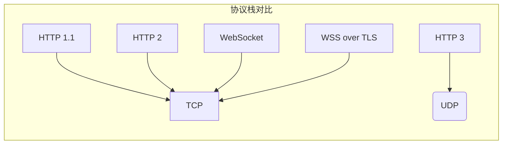
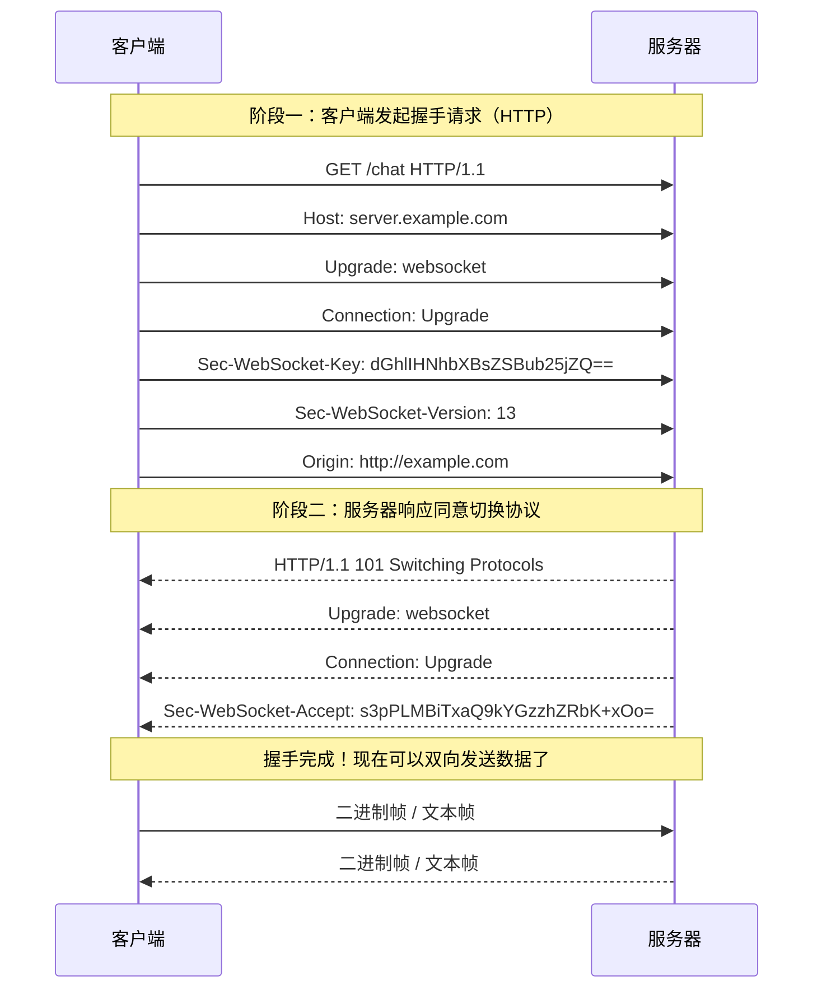
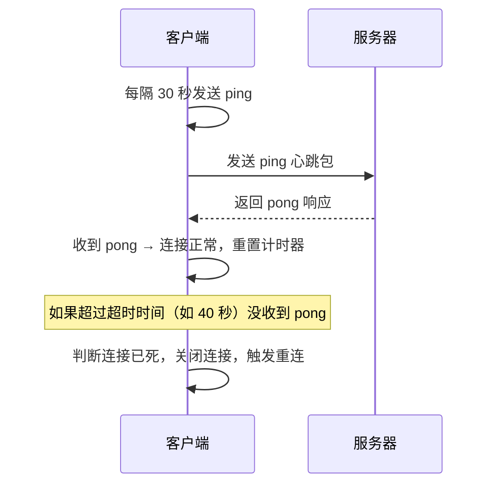

# WebSocket 原理与应用

## ⭐ 面试重点速览

| 知识模块 | 重点内容 | 面试频率 |
|----------|----------|----------|
| WebSocket 是什么 | 全双工通信、与 HTTP 的关系、对比 HTTP | 极高 |
| 握手过程 | HTTP Upgrade、101 Switching Protocols、Sec-WebSocket-Key | 极高 |
| API 使用 | readyState 四种状态、事件回调（onopen/onmessage/onclose/onerror） | 极高 |
| 断线重连 | 指数退避算法、心跳检测（ping/pong）机制 | 高 |
| 方案对比 | WebSocket vs HTTP 轮询 vs SSE | 高 |
| 面试问答 | WebSocket 和 HTTP 长轮询的区别？心跳机制的作用？ | 极高 |

---

## 一、WebSocket 是什么

WebSocket 是 HTML5 开始提供的一种**全双工通信**协议，允许浏览器与服务器建立持久连接，并可以随时由任意一方主动发送数据。

### 1.1 WebSocket 核心特性

| 特性 | 说明 |
|------|------|
| **全双工通信** | 连接建立后，客户端和服务器都可以**随时主动推送**数据，不是一问一答模式 |
| **持久连接** | 握手成功后连接保持，直到一方主动关闭，无需重复建立连接 |
| **轻量协议** | 数据帧开销小，二进制帧最小仅 2 字节，文本帧也很小 |
| **支持二进制** | 原生支持二进制数据（Blob、ArrayBuffer），无需额外编码 |
| **不受同源限制** | WebSocket 不受浏览器同源策略限制，可以跨域连接 |
| **标准化协议** | RFC 6455 标准，所有现代浏览器原生支持 |

### 1.2 WebSocket 与 HTTP 的关系

WebSocket 和 HTTP 的关系可以总结为：

1. **握手阶段依赖 HTTP**：WebSocket 握手时使用 HTTP 协议完成升级协商
2. **独立的传输层协议**：握手成功后，WebSocket 使用自己的帧格式通信，与 HTTP 无关
3. **默认端口相同**：WebSocket 默认使用 80（ws://）和 443（wss://）端口，与 HTTP/HTTPS 相同



### 1.3 WebSocket vs HTTP 对比

| 维度 | HTTP | WebSocket |
|------|------|-----------|
| 通信模式 | 请求-响应（半双工），客户端必须主动请求 | 全双工，任意一方可主动推送 |
| 连接生命周期 | 每次请求建立连接，响应后关闭 | 建立一次连接，持续保持直到关闭 |
| 数据格式 | 每次请求都带完整 HTTP 头部，开销大 | 帧头部很小（最小 2 字节），开销小 |
| 实时性 | 差，服务器不能主动推送 | 好，实时推送延迟低 |
| 适用场景 | 静态资源、REST API、一次性请求 | 聊天、实时数据推送、协作编辑 |

::: tip 为什么需要 WebSocket？
在 WebSocket 出现之前，要实现"实时推送"只能用**轮询**或**长轮询**：
- 轮询：客户端定时发请求问服务器有没有新数据，浪费带宽和服务器资源
- 长轮询：请求保持挂起，有数据才响应，响应完重新连接，仍然有开销

WebSocket 一次连接，一直保持，任意一方随时发数据，真正解决了实时通信问题。
:::

### 1.4 WebSocket 适用场景

WebSocket 最适合以下场景：

- **即时通讯**：聊天室、在线客服、私信系统
- **实时数据推送**：股票行情、汇率、直播弹幕
- **在线协作**：多人协作文档、协同编辑、白板
- **在线游戏**：多人实时游戏、游戏状态同步
- **实时监控**：物联网设备状态监控、在线日志推送
- **位置共享**：实时位置追踪、共享位置

---

## 二、握手过程

WebSocket 握手过程基于 HTTP Upgrade 机制，由客户端发起，服务器同意后切换协议。

### 2.1 完整握手流程



### 2.2 客户端握手请求头详解

| 请求头 | 必选 | 说明 |
|--------|------|------|
| `Upgrade: websocket` | ✅ | 告诉服务器要升级到 WebSocket 协议 |
| `Connection: Upgrade` | ✅ | 告诉服务器连接需要升级 |
| `Sec-WebSocket-Key` | ✅ | 随机生成的 Base64 编码的密钥，用于验证服务器是否真的支持 WebSocket |
| `Sec-WebSocket-Version` | ✅ | WebSocket 版本，必须是 13（RFC 6455） |
| `Sec-WebSocket-Extensions` | 可选 | 客户端声明支持的扩展（如 per-message-deflate 压缩） |
| `Origin` | 可选 | 客户端来源，用于服务器做跨域校验 |
| `Host` | ✅ | 服务器主机名和端口 |

### 2.3 服务器响应头详解

| 响应头 | 必选 | 说明 |
|--------|------|------|
| `101 Switching Protocols` | ✅ | HTTP 状态码，101 表示同意切换协议 |
| `Upgrade: websocket` | ✅  | 确认升级到 WebSocket |
| `Connection: Upgrade` | ✅ | 确认连接升级 |
| `Sec-WebSocket-Accept` | ✅ | 根据客户端的 Sec-WebSocket-Key 计算得出，用于验证 |

### 2.4 Sec-WebSocket-Accept 计算方法

服务器计算 `Sec-WebSocket-Accept` 的算法：

1. 取客户端发送的 `Sec-WebSocket-Key`
2. 拼接固定字符串：`258EAFA5-E914-47DA-95CA-C5AB0DC85B11`
3. 计算 SHA-1 哈希
4. 对哈希结果进行 Base64 编码
5. 结果就是 `Sec-WebSocket-Accept` 的值

```javascript
// Node.js 计算 Sec-WebSocket-Accept 示例
const crypto = require('crypto');

function computeAcceptKey(clientKey) {
    const magic = '258EAFA5-E914-47DA-95CA-C5AB0DC85B11';
    const combined = clientKey + magic;
    return crypto.createHash('sha1').update(combined).digest('base64');
}

// 示例：客户端 key 是 dGhlIHNhbXBsZSBub25jZQ==
// 计算结果应该是 s3pPLMBiTxaQ9kYGzzhZRbK+xOo=
console.log(computeAcceptKey('dGhlIHNhbXBsZSBub25jZQ=='));
// 输出: s3pPLMBiTxaQ9kYGzzhZRbK+xOo=
```

::: tip 为什么需要这个计算？
这个机制主要是为了防止**缓存攻击**和**跨协议攻击**，确保服务器确实理解 WebSocket 协议，避免误升级。这是一个简单的握手验证，不是加密。
:::

### 2.5 握手失败常见原因

| 状态码 | 原因 |
|--------|------|
| 400 Bad Request | `Sec-WebSocket-Version` 不是 13，或者缺少 `Sec-WebSocket-Key` |
| 403 Forbidden | Origin 不被允许，服务器拒绝跨源连接 |
| 503 Service Unavailable | 服务器不支持 WebSocket，或服务未启动 |
| 其他 2xx/3xx | 握手未成功，服务器返回了普通 HTTP 响应 |

如果握手失败，浏览器会触发 `error` 事件，不会建立连接。

---

## 三、API 使用

浏览器原生提供了 `WebSocket` 构造函数，API 非常简洁。

### 3.1 基本用法

```javascript
// 1. 创建 WebSocket 连接（握手异步进行）
// ws:// 非加密，wss:// 加密（基于 TLS）
const ws = new WebSocket('wss://example.com/chat');

// 2. 连接打开事件（握手成功后触发）
ws.onopen = function(event) {
    console.log('连接已建立');
    // 连接成功后发送数据
    ws.send('Hello Server!');
};

// 3. 收到消息事件
ws.onmessage = function(event) {
    // event.data 是服务器发送的数据
    // 如果是二进制，event.data 是 Blob 或 ArrayBuffer
    console.log('收到消息:', event.data);
    
    // 如果是 JSON，需要解析
    try {
        const data = JSON.parse(event.data);
        console.log('解析后:', data);
    } catch (e) {
        console.error('JSON 解析失败:', e);
    }
};

// 4. 连接关闭事件
ws.onclose = function(event) {
    console.log('连接已关闭', event.code, event.reason);
    // event.code: 关闭码（1000 表示正常关闭）
    // event.reason: 关闭原因字符串
    // event.wasClean: 是否干净关闭
};

// 5. 错误事件
ws.onerror = function(error) {
    console.error('WebSocket 错误:', error);
};
```

### 3.2 readyState 四种状态

WebSocket 对象有一个 `readyState` 属性，表示当前连接状态：

| 常量 | 值 | 状态 | 说明 |
|------|----|------|------|
| `WebSocket.CONNECTING` | 0 | 连接中 | 正在握手，还未完成 |
| `WebSocket.OPEN` | 1 | 已打开 | 连接成功，可以通信 |
| `WebSocket.CLOSING` | 2 | 关闭中 | 正在进行关闭握手 |
| `WebSocket.CLOSED` | 3 | 已关闭 | 连接已关闭 |

```javascript
// 检查连接状态再发送
if (ws.readyState === WebSocket.OPEN) {
    ws.send('数据');
} else {
    // 连接未打开，可以缓存数据等打开再发
    console.log('连接未就绪，无法发送');
}
```

::: warning 常见错误：连接未就绪就发送
如果在 `CONNECTING` 状态调用 `send()`，会抛出异常！一定要检查 `readyState` 或在 `onopen` 回调中发送。
:::

### 3.3 发送数据

`send()` 方法可以发送多种类型的数据：

```javascript
const ws = new WebSocket('wss://example.com');

// 1. 发送文本字符串
ws.send('Hello World');

// 2. 发送 JSON（需要先序列化）
ws.send(JSON.stringify({
    type: 'message',
    content: 'Hello',
    from: 'alice'
}));

// 3. 发送 Blob（二进制数据，如图片文件）
const file = document.querySelector('input[type="file"]').files[0];
ws.send(file);

// 4. 发送 ArrayBuffer（二进制数据）
const buffer = new ArrayBuffer(1024);
ws.send(buffer);

// 5. 发送 TypedArray（如 Uint8Array）
const bytes = new Uint8Array([1, 2, 3, 4]);
ws.send(bytes);
```

**发送注意事项**：

- 大数据发送：如果要发送非常大的文件（> 1MB），建议分片发送，避免阻塞
- 流量控制：如果发送速度比网络传输快，浏览器会在内存缓冲，可以监听 `bufferedAmount` 变化

### 3.4 接收二进制数据

默认情况下，二进制消息会以 `Blob` 形式交付，可以通过 `binaryType` 属性修改：

```javascript
const ws = new WebSocket('wss://example.com');

// 默认是 'blob'
console.log(ws.binaryType); // "blob"

// 修改为 ArrayBuffer
ws.binaryType = 'arraybuffer';

ws.onmessage = (event) => {
    if (event.data instanceof ArrayBuffer) {
        // 处理二进制数据
        const buffer = event.data;
        const view = new Uint8Array(buffer);
        console.log('收到二进制数据，长度:', buffer.byteLength);
    } else {
        // 文本数据
        console.log('收到文本:', event.data);
    }
};
```

可选值：
- `'blob'`：返回 Blob 对象（默认）
- `'arraybuffer'`：返回 ArrayBuffer 对象

### 3.5 关闭连接

```javascript
// 主动关闭连接
// code 是关闭码（可选，默认 1000）
// reason 是关闭原因（可选）
ws.close(1000, '客户端主动关闭');

// 常见关闭码
// 1000: 正常关闭
// 1001: 端点离开（页面关闭）
// 1006: 异常关闭（连接异常断开）
// 1008: 数据格式错误
// 1009: 消息过大，无法处理
```

### 3.6 完整封装示例

```javascript
class WebSocketClient {
    constructor(url) {
        this.url = url;
        this.ws = null;
        this.reconnectCount = 0;
        this.maxReconnect = 10;
        this.reconnectDelay = 1000; // 初始重连延迟 1 秒
        this.heartbeatInterval = 30000; // 30 秒心跳
        this.heartbeatTimer = null;
    }

    connect() {
        console.log(`正在连接 ${this.url}...`);
        this.ws = new WebSocket(this.url);

        this.ws.onopen = () => {
            console.log('连接成功');
            this.reconnectCount = 0;
            this.reconnectDelay = 1000;
            this.startHeartbeat();
            this.onOpen?.();
        };

        this.ws.onmessage = (event) => {
            this.stopHeartbeat();
            this.startHeartbeat();
            this.onMessage?.(event.data);
        };

        this.ws.onclose = (event) => {
            this.stopHeartbeat();
            console.log(`连接关闭: ${event.code} ${event.reason}`);
            
            if (this.reconnectCount < this.maxReconnect) {
                console.log(`${this.reconnectDelay}ms 后尝试重连...`);
                setTimeout(() => {
                    this.reconnectCount++;
                    this.connect();
                }, this.reconnectDelay);
                // 指数退避：下次延迟加倍
                this.reconnectDelay = Math.min(this.reconnectDelay * 2, 30000);
            } else {
                console.error('重连次数已达上限，停止重连');
                this.onFailed?.();
            }
            
            this.onClose?.(event);
        };

        this.ws.onerror = (error) => {
            console.error('连接错误:', error);
            this.onError?.(error);
        };
    }

    send(data) {
        if (this.ws?.readyState === WebSocket.OPEN) {
            this.ws.send(typeof data === 'string' ? data : JSON.stringify(data));
            return true;
        }
        console.warn('连接未就绪，发送失败');
        return false;
    }

    close(code = 1000, reason = '') {
        this.stopHeartbeat();
        this.ws?.close(code, reason);
    }

    startHeartbeat() {
        this.heartbeatTimer = setInterval(() => {
            if (this.ws.readyState === WebSocket.OPEN) {
                // 发送 ping 心跳包
                this.send(JSON.stringify({ type: 'ping' }));
            }
        }, this.heartbeatInterval);
    }

    stopHeartbeat() {
        if (this.heartbeatTimer) {
            clearInterval(this.heartbeatTimer);
            this.heartbeatTimer = null;
        }
    }
}

// 使用示例
const client = new WebSocketClient('wss://example.com/chat');
client.onMessage = (data) => {
    console.log('收到:', data);
};
client.connect();
```

---

## 四、断线重连与心跳检测

WebSocket 连接是基于 TCP 的，网络波动可能导致连接断开。生产环境必须实现**断线重连**和**心跳检测**。

### 4.1 为什么连接会断？

常见断线原因：

1. **网络切换**：WiFi 切 4G，网络地址变化
2. **长时间空闲**：防火墙/代理服务器清理空闲连接
3. **服务器重启**：服务端重启，连接断开
4. **客户端休眠**：浏览器标签页休眠，网络被暂停
5. **网络波动**：临时丢包导致连接超时

### 4.2 断线重连策略：指数退避

指数退避（Exponential Backoff）是最常用的重连策略：

- 第一次失败：等 1 秒重连
- 第二次失败：等 2 秒重连
- 第三次失败：等 4 秒重连
- 第四次失败：等 8 秒重连
- ...以此类推，直到最大延迟（通常 30 秒）

```javascript
// 指数退避重连示例
let reconnectDelay = 1000; // 初始 1 秒
const maxDelay = 30000;    // 最大 30 秒

function tryReconnect() {
    console.log(`${reconnectDelay}ms 后重连...`);
    setTimeout(() => {
        connect(); // 重连
    }, reconnectDelay);
    
    // 下次延迟加倍，但不超过最大值
    reconnectDelay = Math.min(reconnectDelay * 2, maxDelay);
}
```

指数退避的好处：

- 避免服务器大量连接同时恢复导致的惊群效应
- 网络不稳定时减少无效重连尝试
- 节省客户端和服务器资源

### 4.3 心跳检测机制

为什么需要心跳？

- 很多代理服务器会把**长时间空闲**的 TCP 连接断开，但两端都不知道连接已经断了
- 客户端需要检测连接是否存活，如果死连接及时重连

心跳机制分为 **ping/pong** 模式：



**服务器端也可以主动发心跳**，谁发 ping 不一定，约定好就行。

### 4.4 客户端心跳实现

```javascript
class HeartbeatWebSocket {
    constructor(url, options = {}) {
        this.url = url;
        this.heartbeatInterval = options.heartbeatInterval || 30000; // 30 秒发一次 ping
        this.timeout = options.timeout || 40000; // 40 秒没响应算超时
        this.pingTimer = null;
        this.pongTimer = null;
        this.ws = null;
    }

    connect() {
        this.ws = new WebSocket(this.url);
        
        this.ws.onopen = () => {
            this.startHeartbeat();
            this.onOpen?.();
        };

        this.ws.onmessage = (event) => {
            this.handleMessage(event.data);
        };

        this.ws.onclose = () => {
            this.stopHeartbeat();
            this.reconnect();
            this.onClose?.();
        };
    }

    handleMessage(data) {
        try {
            const msg = JSON.parse(data);
            if (msg.type === 'pong') {
                // 收到 pong，说明连接正常，清除超时计时器
                this.clearPongTimer();
                this.onMessage?.(msg);
            } else if (msg.type === 'ping') {
                // 服务器主动 ping，我们回复 pong
                this.send({ type: 'pong' });
                this.onMessage?.(msg);
            } else {
                this.onMessage?.(msg);
            }
        } catch (e) {
            // 不是 JSON，直接交给用户处理
            this.onMessage?.(data);
        }
    }

    startHeartbeat() {
        this.pingTimer = setInterval(() => {
            if (this.ws.readyState === WebSocket.OPEN) {
                this.send({ type: 'ping' });
                // 设置超时计时器，如果 timeout 后没收到 pong 就断开
                this.pongTimer = setTimeout(() => {
                    console.warn('心跳超时，关闭连接重连');
                    this.ws.close();
                }, this.timeout);
            }
        }, this.heartbeatInterval);
    }

    clearPongTimer() {
        if (this.pongTimer) {
            clearTimeout(this.pongTimer);
            this.pongTimer = null;
        }
    }

    stopHeartbeat() {
        if (this.pingTimer) {
            clearInterval(this.pingTimer);
            this.pingTimer = null;
        }
        this.clearPongTimer();
    }

    send(data) {
        if (this.ws.readyState === WebSocket.OPEN) {
            this.ws.send(JSON.stringify(data));
        }
    }

    reconnect() {
        // 这里使用指数退避策略
        setTimeout(() => {
            console.log('正在重连...');
            this.connect();
        }, 1000);
    }
}
```

::: tip 心跳频率建议
- 间隔不要太短（不要低于 10 秒），浪费带宽
- 间隔不要太长（不要超过 60 秒），发现死连接太慢
- 推荐：**30 秒发一次 ping，40 秒超时**比较合适
- 页面不可见时（标签页后台），浏览器会节流，可以适当延长间隔
:::

### 4.5 服务器端心跳（Node.js 示例）

```javascript
// Node.js ws 库服务端心跳示例
const WebSocket = require('ws');
const wss = new WebSocket.Server({ port: 8080 });

wss.on('connection', (ws) => {
    console.log('新连接');

    // 定时检查心跳，如果 60 秒没消息就断开
    const heartbeatInterval = setInterval(() => {
        if (ws.isAlive === false) {
            // 长时间没响应， terminated
            clearInterval(heartbeatInterval);
            return ws.terminate();
        }
        ws.isAlive = false;
        // 主动 ping 客户端
        ws.ping();
    }, 30000);

    // 收到 pong 就标记 alive
    ws.on('pong', () => {
        ws.isAlive = true;
    });

    ws.on('message', (message) => {
        // 处理消息...
        // 如果是客户端 ping，回复 pong
        try {
            const msg = JSON.parse(message);
            if (msg.type === 'ping') {
                ws.send(JSON.stringify({ type: 'pong' }));
            }
        } catch (e) {
            // 二进制消息忽略
        }
    });

    ws.on('close', () => {
        clearInterval(heartbeatInterval);
        console.log('连接关闭');
    });
});
```

---

## 五、与 HTTP 轮询/SSE 对比

实现实时推送有几种常见方案：轮询、长轮询、SSE、WebSocket。下表对比它们的优缺点：

### 5.1 四种方案对比

| 方案 | 通信方向 | 连接模型 | 实时性 | 开销 | 浏览器支持 | 优缺点 |
|------|----------|----------|--------|------|------------|--------|
| **轮询（Polling）** | 客户端 → 服务器 | 每次请求新建连接 | 差，取决于轮询间隔 | 高，很多无用请求 | 所有 | ✅ 实现简单；❌ 浪费带宽和服务器资源 |
| **长轮询（Long Polling）** | 客户端 → 服务器 | 请求挂起，有数据响应后重连 | 较好，数据产生即推送 | 中，连接建立开销 | 所有 | ✅ 兼容性好；❌ 仍然需要重复建连 |
| **SSE（Server-Sent Events）** | 服务器 → 客户端（单向） | 持久连接，仅服务器推 | 好 | 低 | 所有（除了老 IE） | ✅ 轻量、自动重连；❌ 仅支持单向 |
| **WebSocket** | 双向全双工 | 持久连接 | 极好，实时推送 | 最低 | 所有现代浏览器 | ✅ 真正双向，原生支持二进制；❌ 服务端需要保持连接 |

### 5.2 轮询 vs 长轮询

**普通轮询**：

```javascript
// 普通轮询：每隔 3 秒请求一次
setInterval(() => {
    fetch('/api/get-new-messages')
        .then(res => res.json())
        .then(data => {
            if (data.messages.length > 0) {
                updateUI(data.messages);
            }
        });
}, 3000);
```

- 优点：代码最简单
- 缺点：间隔小了请求太多，间隔大了延迟高，大部分请求返回空数据，浪费带宽

**长轮询**：

```javascript
// 长轮询：请求一直挂起，服务器有数据才返回
function longPoll() {
    fetch('/api/long-poll')
        .then(res => res.json())
        .then(data => {
            updateUI(data);
            // 处理完数据，立即发起下一次长轮询
            longPoll();
        })
        .catch(err => {
            // 出错了，等待几秒重试
            setTimeout(longPoll, 3000);
        });
}
// 启动长轮询
longPoll();
```

- 优点：比普通轮询高效，没有空请求
- 缺点：每次请求都需要重建 TCP 连接，仍然有开销，HTTP 头每次都要重发

### 5.3 SSE（Server-Sent Events）简介

SSE 是 HTML5 专门为服务器单向推送设计的协议，基于 HTTP，复用 HTTP 连接：

```javascript
// SSE 基本用法
const eventSource = new EventSource('/api/events');

// 打开连接
eventSource.onopen = () => {
    console.log('SSE 连接已打开');
};

// 收到消息
eventSource.onmessage = (event) => {
    console.log('收到:', event.data);
};

// 自定义事件类型
eventSource.addEventListener('customEvent', (event) => {
    const data = JSON.parse(event.data);
    console.log('自定义事件:', data);
});

// 错误处理
eventSource.onerror = (err) => {
    console.error('SSE 错误:', err);
};
```

**SSE 特点**：

- ✅ 基于 HTTP，不需要特殊协议
- ✅ 浏览器原生支持自动重连
- ✅ 支持事件类型（event-type）
- ❌ **只能服务器推送到客户端，客户端不能发送数据给服务器**
- ❌ 受 cookie 数量限制，不适合高并发

::: tip 什么时候用 SSE？
如果你只需要**服务器主动推送**（比如股票行情、新闻更新、日志推送），不需要客户端发消息，SSE 比 WebSocket 更轻量，开发更简单，还自动重连。
:::

### 5.4 WebSocket vs HTTP 长轮询 核心区别

| 维度 | WebSocket | HTTP 长轮询 |
|------|-----------|-------------|
| 连接 | 一次握手，持久连接，一直保持 | 每次数据响应后关闭，下次重连 |
| 通信方向 | 全双工，双方都可以主动发 | 半双工，只能客户端请求，服务器响应 |
| 开销 | 握手一次，后续数据帧头部很小 | 每次请求都带完整 HTTP 头，开销大 |
| 延迟 | 服务器有数据立即发，延迟极低 | 连接重建有开销，延迟比 WebSocket 高 |
| 扩展性 | 支持二进制，支持扩展 | 只能文本，二进制需要 base64 编码 |
| 兼容性 | 需要现代浏览器 | 所有浏览器都支持 |

**面试回答要点**：
- WebSocket 是全双工持久连接，长轮询是半双工需要重复建连
- WebSocket 开销更小，延迟更低，真正实时
- 长轮询兼容性更好，可作为降级方案

---

## 六、面试高频问题汇总

### Q1：WebSocket 和 HTTP 长轮询的区别？

**要点回答**：

1. **连接模型**：WebSocket 建立一次连接保持持久连接；长轮询每次响应后关闭，需要重复建立连接
2. **通信模式**：WebSocket 全双工，客户端和服务器都可主动发送；长轮询半双工，必须客户端先请求，服务器才能响应
3. **带宽开销**：WebSocket 数据帧头部很小（最小 2 字节）；长轮询每次请求都带完整 HTTP 头部，开销大
4. **延迟**：WebSocket 服务器有数据立即发送，延迟极低；长轮询重连过程有额外延迟
5. **适用场景**：WebSocket 适合双向实时通信（聊天、协作）；长轮询适合兼容性要求高的简单场景

### Q2：心跳机制的作用是什么？为什么需要心跳？

**要点回答**：

1. **检测死连接**：很多网络设备（防火墙、代理）会自动断开长时间空闲的 TCP 连接，但客户端和服务器可能都不知道连接已经断了。心跳能及时发现死连接。
2. **保持连接存活**：定期发送心跳包可以让中间设备知道连接还在使用，不会被回收。
3. **网络质量检测**：通过心跳往返时间可以估计当前网络延迟。
4. **及时重连**：发现连接断开后，能够立即触发重连，提高可用性。

**常见心跳方案**：客户端定时发 ping，服务器回复 pong；超时未收到 pong 则认为连接已死，关闭重连。

### Q3：WebSocket 的握手过程是怎样的？

**要点回答**：

1. 客户端发送 HTTP 请求，包含 `Upgrade: websocket`、`Connection: Upgrade`、`Sec-WebSocket-Key`、`Sec-WebSocket-Version: 13` 等头
2. 服务器验证请求，返回 `101 Switching Protocols` 状态码，包含 `Sec-WebSocket-Accept` 头
3. `Sec-WebSocket-Accept` 是由客户端 `Sec-WebSocket-Key` 拼接魔术字符串后 SHA-1 + Base64 计算得到
4. 握手完成后，切换到 WebSocket 协议，开始双向通信

### Q4：WebSocket 支持跨域吗？

**支持**。WebSocket 不受浏览器同源策略限制，可以连接任意地址。但服务器通常会检查 `Origin` 请求头，决定是否允许连接。

### Q5：WebSocket 为什么一开始要用 HTTP 握手？

这样设计的好处：

1. **复用现有HTTP基础设施**：可以跑在现有的 80/443 端口上，和 HTTP 服务共享端口
2. **兼容现有服务器**：可以由 HTTP 服务器升级到 WebSocket，不需要额外端口
3. **更容易通过防火墙**：大多数防火墙都允许 HTTP 连接，不容易被拦截
4. **握手由 HTTP 完成，协议分工清晰**：协商阶段用 HTTP，数据传输用 WebSocket 帧

### Q6：WebSocket 的 frame 帧结构是怎样的？（高级题）

WebSocket 数据帧最小 2 字节，结构简化来说：

- **FIN 位**：1 比特，表示这是不是消息的最后一帧（支持分片）
- **Opcode**：4 比特，表示帧类型（文本帧、二进制帧、连接关闭、ping、pong）
- **MASK 位**：1 比特，表示是否掩码（客户端发服务器必须掩码，服务器发客户端不掩码）
- **Payload length**：7/7+16/7+64 位，表示负载长度
- **Masking-key**：如果 MASK=1，这里有 4 字节掩码密钥
- **Payload data**：实际数据

分片允许发送大消息，不用一次性分配全部缓存。

### Q7：wss:// 和 ws:// 的区别？

- `ws://`：明文传输，基于 TCP，默认端口 80
- `wss://`：加密传输，基于 TLS/SSL，默认端口 443
- 生产环境必须用 `wss://`，防止中间人窃听和篡改

---

## 七、总结

WebSocket 是 HTML5 提供的**全双工持久通信协议**，真正解决了 Web 实时推送问题。核心要点：

- 握手基于 HTTP Upgrade，响应 `101 Switching Protocols` 完成协议切换
- API 简洁：`new WebSocket()` + `onopen/onmessage/onclose/onerror` + `send()` + `close()`
- 生产环境必须实现**指数退避重连**和**心跳检测**，保证可用性
- 对比轮询/长轮询/SSE：WebSocket 适合双向通信，SSE 适合单向推送，长轮询做降级兼容
- 面试常问：WebSocket 握手过程、和长轮询区别、心跳作用

掌握这些，就能在面试中从容应对 WebSocket 相关问题了。
