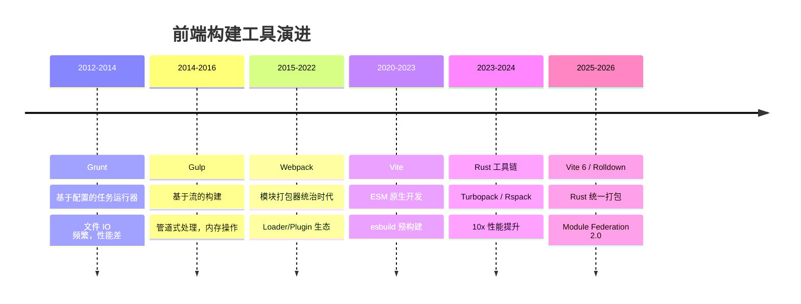
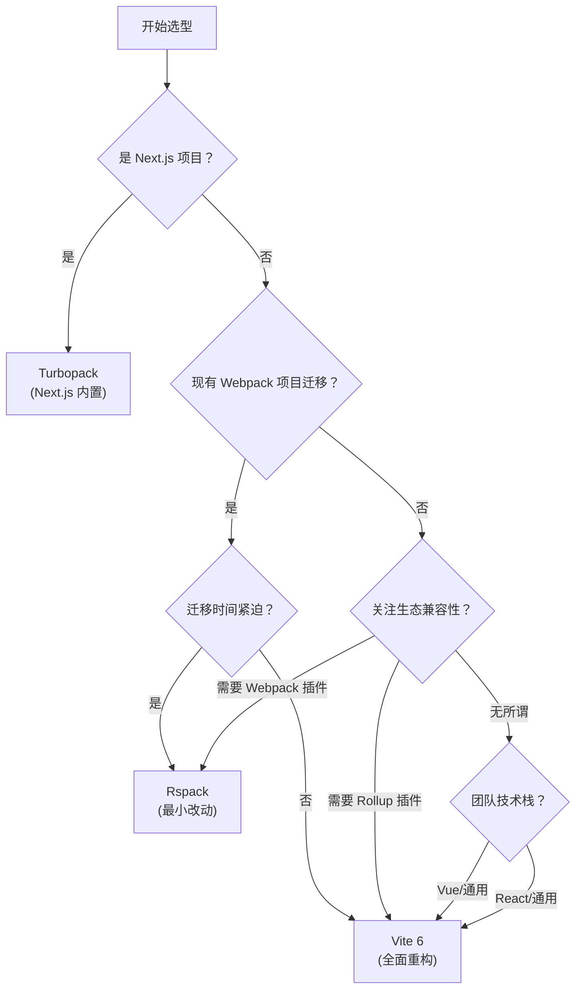

# 构建工具概览

## ⭐ 面试重点速览

| 知识模块 | 重点内容 | 面试频率 |
|----------|----------|----------|
| Vite 6 | 双引擎架构、ESM 原生开发、Rolldown Rust 打包、HMR 原理 | 极高 |
| Turbopack | Rust 增量计算、函数级缓存、Next.js 集成 | 中高 |
| Rspack | Webpack 兼容、5-10x 构建提速、迁移成本 | 高 |
| 构建工具演进 | Grunt→Gulp→Webpack→Vite→Rust 工具链 | 中 |

---

## 构建工具演进史

---

## 核心概念对比

| 概念 | Webpack 时代 | Vite 时代 | Rust 时代 |
|------|-------------|-----------|-----------|
| **开发服务器** | 先打包，再启动 | ESM 按需编译 | ESM 按需编译 + Rust 加速 |
| **冷启动** | 30s - 120s | 1s - 3s | < 1s |
| **HMR** | 随模块数增长变慢 | 常量级（只更新变更模块） | 常量级 + 更快的编译 |
| **生产打包** | JS 实现（Terser 压缩） | JS 实现 + Go 预构建 | Rust 实现（原生快） |
| **生态** | 最丰富（10年积累） | 快速成长，Rollup 兼容 | 兼容 Webpack 插件 |
| **语言** | JavaScript | JavaScript + Go | Rust |

---

## Vite 6 vs Turbopack vs Rspack 全方位对比

| 维度 | Vite 6 | Turbopack | Rspack |
|------|--------|-----------|--------|
| **冷启动（1000 模块）** | ~1.5s | ~0.8s | ~1.2s |
| **冷启动（10000 模块）** | ~3s | ~1.5s | ~2.5s |
| **HMR 速度** | < 50ms | < 30ms | < 50ms |
| **生产构建（中型项目）** | ~15s（Rolldown） | 暂不完全支持 | ~8s |
| **大型项目支持** | 优秀 | 优秀（Next.js 优化） | 优秀 |
| **Webpack 插件兼容** | 否（通过 vite-plugin） | 否 | **是（高兼容性）** |
| **Rollup 插件兼容** | **是** | 否 | 否 |
| **框架支持** | 通用（Vue/React/Svelte） | **Next.js 专属** | 通用 |
| **学习成本** | 低 | 中 | 低（Webpack 用户友好） |
| **社区生态** | 极丰富 | 起步阶段 | 快速增长 |
| **开源背景** | 社区驱动（尤雨溪） | Vercel | 字节跳动 |
| **最佳场景** | 新项目、通用场景 | Next.js 项目 | Webpack 迁移项目 |

---

## 选型决策指南

::: tip 选择建议
- **新项目**：首选 Vite 6，生态最丰富，社区最活跃
- **Next.js 项目**：直接用 Turbopack（`next dev --turbo`）
- **Webpack 迁移**：Rspack 是性价比最高的选择，Day.js 替代 Moment.js 级别的体验
- **微前端/复杂场景**：Rspack 的 Webpack 插件兼容性更有优势
:::

---

## 子页面导航

| 子页面 | 核心内容 |
|--------|----------|
| [Vite 6 核心](./vite6.md) | 双引擎架构、ESM 按需编译、依赖预构建、HMR 原理、Module Federation 2.0、插件机制 |
| [Turbopack](./turbopack.md) | Rust 增量计算、函数级缓存、请求级缓存、懒加载打包、Next.js 集成 |
| [Rspack](./rspack.md) | Webpack 兼容性、Rust 核心实现、5-10x 构建提速、迁移路径、字节跳动开源 |

---

## 面试高频问题汇总

### Q1：Webpack 的痛点是什么？

1. **冷启动慢**：大型项目（1000+ 模块）冷启动需要 30-120 秒，严重影响开发体验
2. **HMR 随规模退化**：模块数量增加，HMR 更新变慢（需要重新打包变更模块及其依赖链）
3. **配置复杂**：Loader/Plugin 配置繁琐，新手学习曲线陡峭
4. **JS 性能瓶颈**：JS 单线程语言，无法充分利用多核 CPU，大型项目构建成为瓶颈

### Q2：为什么新一代工具都选择 Rust？

**核心原因：性能差距是数量级的**

| 操作 | JavaScript | Rust |
|------|------------|------|
| 文件解析 | 慢（解释执行） | 快（编译为机器码） |
| 并行处理 | 受限于单线程 | 原生多线程，无锁并发 |
| 内存管理 | GC 暂停 | 零成本抽象，无 GC |
| 典型编译速度 | 1x（基准） | 10-50x |

Rust 的零成本抽象（Zero-cost Abstraction）意味着：写高级代码，跑出低级语言的性能。SWC（Rust 实现的 Babel 替代品）比 Babel 快 20-70 倍，这直接证明了 Rust 在前端工具链中的价值。

### Q3：Vite 和 Turbopack 的核心差异是什么？

本质上是**架构理念**的差异：

- **Vite**：拥抱标准（ESM），利用浏览器原生模块能力，开发时不打包，生产时用 Rolldown 打包
- **Turbopack**：拥抱计算（增量计算），用函数级粒度的缓存系统，只重新计算变化的部分

两者都追求**极致的开发体验**，只是路径不同。Vite 更通用，Turbopack 更深度绑定 Next.js。

---

## 面试追问环节

**Q：如果让你主导一个 Webpack → Vite 的迁移，你会怎么做？**

1. **评估阶段**：统计 Webpack 插件/loader 使用清单，确认 Vite 替代方案
2. **渐进迁移**：先迁移开发环境（`vite dev`），保留 Webpack 生产构建
3. **配置对照**：`webpack.config.js` → `vite.config.ts` 逐项转换
4. **关键差异处理**：
   - `require.context` → `import.meta.glob`
   - `process.env` → `import.meta.env`
   - CommonJS 依赖 → 依赖预构建自动处理
5. **验证**：开发/生产构建产物对比，确保功能一致
6. **上线**：灰度发布，监控错误率

**Q：Rspack 的 "Webpack 兼容" 是真的兼容吗？**

**是的，但不是 100%**。Rspack 兼容了 Webpack 最核心的 80% API（loader、plugin、resolve、module rules 等），但一些边缘 API 和较少使用的配置项可能不支持。迁移时建议：

1. 使用 `@rspack/compat` 插件提升兼容性
2. 运行 Rspack 的迁移检查工具
3. 对于不兼容的插件，使用 Rspack 原生的替代方案