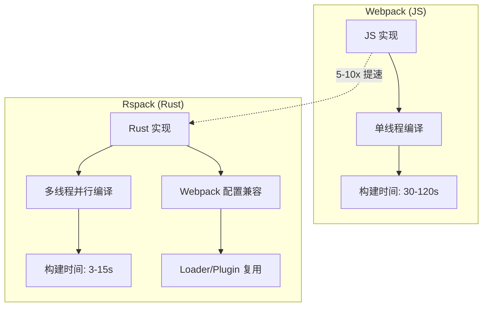
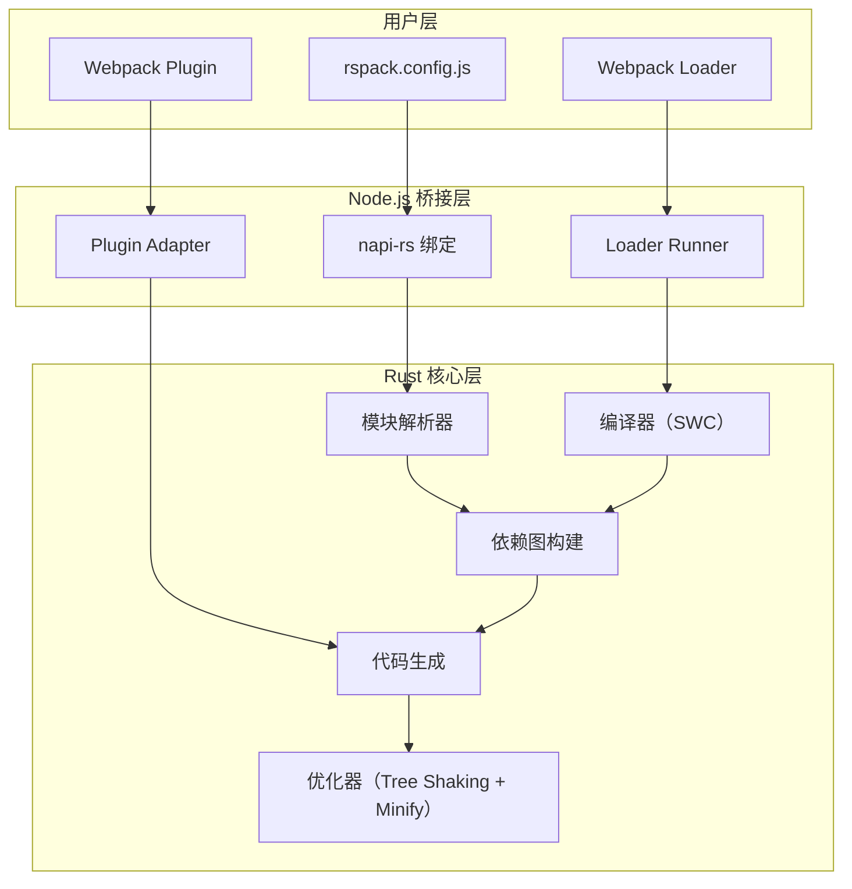

# Rspack

## ⭐ 面试重点速览

| 知识模块 | 重点内容 | 面试频率 |
|----------|----------|----------|
| Webpack 兼容性 | Loader/Plugin 生态复用、配置迁移成本 | 极高 |
| Rust 核心实现 | 5-10x 构建提速、并行编译 | 高 |
| 迁移路径 | 渐进迁移、兼容层、关键差异 | 高 |
| 字节跳动背景 | 开源动机、社区生态、与 Webpack 关系 | 中 |

---

## Rspack 概述

Rspack 是字节跳动开源的基于 Rust 的**高性能 Webpack 替代品**。它的核心设计理念是：**保持 Webpack 的 API 兼容性，用 Rust 重写核心实现，实现 5-10 倍的构建性能提升**。



---

## Webpack 兼容性

### 兼容范围

Rspack 兼容了 Webpack 最核心的配置和 API：

| 兼容项 | 兼容程度 | 说明 |
|--------|----------|------|
| `entry` / `output` | 100% | 入口和输出配置完全兼容 |
| `resolve` | 95% | 路径解析，含 alias、extensions |
| `module.rules` | 90% | Loader 规则配置 |
| `plugins` | 80% | 内置插件兼容，第三方需适配 |
| `optimization` | 85% | splitChunks、minimizer |
| `devServer` | 90% | 开发服务器 |
| `externals` | 100% | 外部依赖配置 |
| `target` | 90% | 构建目标 |

### 配置迁移示例

```javascript
// webpack.config.js → rspack.config.js
// 大部分配置可以直接复用

const rspack = require('@rspack/core')

module.exports = {
  // 入口和输出配置完全兼容
  entry: {
    main: './src/index.tsx',
  },
  output: {
    path: path.resolve(__dirname, 'dist'),
    filename: '[name].[contenthash].js',
    clean: true,
  },

  // resolve 配置兼容
  resolve: {
    extensions: ['.ts', '.tsx', '.js', '.jsx'],
    alias: {
      '@': path.resolve(__dirname, 'src'),
    },
  },

  // module.rules —— Loader 兼容
  module: {
    rules: [
      {
        test: /\.tsx?$/,
        // 使用 Rspack 内置的 SWC loader（更快）
        loader: 'builtin:swc-loader',
        options: {
          jsc: { parser: { syntax: 'typescript', tsx: true } },
        },
      },
      {
        test: /\.css$/,
        use: ['postcss-loader'],
        type: 'css',
      },
      {
        test: /\.(png|jpg|gif|svg)$/,
        type: 'asset',
      },
    ],
  },

  // 插件 —— 大部分 Webpack 插件兼容
  plugins: [
    new rspack.HtmlRspackPlugin({
      template: './public/index.html',
    }),
    new rspack.DefinePlugin({
      'process.env.NODE_ENV': JSON.stringify(process.env.NODE_ENV),
    }),
  ],

  // 优化配置
  optimization: {
    splitChunks: {
      chunks: 'all',
      cacheGroups: {
        vendor: {
          test: /[\\/]node_modules[\\/]/,
          name: 'vendors',
          chunks: 'all',
        },
      },
    },
    minimizer: [
      new rspack.SwcJsMinimizerRspackPlugin(),
      new rspack.LightningCssMinimizerRspackPlugin(),
    ],
  },

  // 开发服务器
  devServer: {
    port: 3000,
    hot: true,
    historyApiFallback: true,
  },
}
```

::: tip Rspack 内置优势
Rspack 内置了 SWC（代替 Babel）和 Lightning CSS（代替 PostCSS），这些 Rust 实现的工具比 JS 实现快 10-100 倍。迁移时建议优先使用内置工具，以获得最佳性能。
:::

---

## Rust 核心实现

### 架构设计



### 性能提升原理

| 优化点 | 实现方式 | 性能提升 |
|--------|----------|----------|
| Rust 原生编译 | 编译为机器码，无解释器开销 | 3-5x |
| 多线程并行 | 模块级并行编译 | 2-3x |
| SWC 替代 Babel | Rust 实现的 JS/TS 编译器 | 10-20x |
| Lightning CSS | Rust 实现的 CSS 处理 | 5-10x |
| 增量编译 | 仅重新编译变更模块 | 2-5x（二次构建） |

---

## 迁移路径

### 渐进迁移策略


### 阶段一：兼容性评估

```bash
# 安装 Rspack
npm install -D @rspack/cli @rspack/core

# 检查 Webpack 配置兼容性
npx rspack configcheck ./webpack.config.js
```

### 阶段二：渐进迁移

```javascript
// rspack.config.js —— 渐进迁移示例
const rspack = require('@rspack/core')

module.exports = {
  // 第一步：复用所有 Webpack 配置
  ...require('./webpack.config.js'),

  // 第二步：替换为 Rspack 内置工具
  module: {
    rules: [
      // 替换 babel-loader → builtin:swc-loader
      {
        test: /\.tsx?$/,
        loader: 'builtin:swc-loader',
        options: {
          jsc: { parser: { syntax: 'typescript', tsx: true } },
        },
      },
      // 保留不兼容的 Webpack loader
      // 某些 loader 可能需要在 Rspack 中特殊处理
    ],
  },
}
```

::: warning 迁移注意事项
- **不兼容的 Loader**：某些依赖 Webpack 内部 API 的 loader 可能无法直接使用，需要寻找替代方案
- **自定义 Plugin**：如果使用了大量自定义 Webpack Plugin，可能需要逐个适配
- **CSS 处理**：Rspack 内置了 CSS 处理，建议替换 `css-loader` + `style-loader` 为 `type: 'css'`
- **构建产物差异**：Rspack 的产物可能与 Webpack 有细微差异，需要充分测试
:::

---

## 字节跳动开源背景

Rspack 由字节跳动前端架构团队开源，背景是：

- 字节内部有大量 Webpack 项目，构建时间成为研发效率瓶颈
- 直接迁移到 Vite 成本太高（插件生态不兼容）
- 需要一个**兼容 Webpack 生态、性能大幅提升**的替代方案

Rspack 的定位很明确：**不是替代 Webpack，而是给 Webpack 用户一个更快的选择**。

::: tip Rspack 与 Webpack 的关系
Rspack 不是 Webpack 的 "fork" 或 "竞争者"，而是**互补关系**：
- Webpack 继续维护和演进，作为功能最丰富的构建工具
- Rspack 提供高性能的替代选择，适用于对构建速度有极致要求的场景
- 两者共享 Loader/Plugin 生态，用户可以自由切换
:::

---

## 面试高频问题汇总

### Q1：为什么选 Rspack 而不是从头再来？

**核心原因：Webpack 生态复用**

1. **迁移成本**：Rspack 兼容 Webpack 配置，迁移成本极低（小时级），而 Vite 需要全面重构（天/周级）
2. **插件生态**：Webpack 有 1000+ 插件，Rspack 可以复用大部分，无需重建生态
3. **团队习惯**：大量团队已经熟悉 Webpack 配置，Rspack 的学习成本几乎为零
4. **渐进迁移**：可以先用 Rspack 做开发服务器，生产构建仍用 Webpack，逐步过渡

### Q2：Rspack 和 Vite 有什么区别？

| 维度 | Rspack | Vite 6 |
|------|--------|---------|
| **设计理念** | Webpack 兼容 + Rust 加速 | ESM 原生开发 |
| **开发模式** | 打包（Rust 加速） | 不打包（ESM 按需） |
| **Webpack 兼容** | **高（90%+）** | 低（需适配） |
| **迁移成本** | 低（小时级） | 高（天/周级） |
| **最佳场景** | Webpack 项目迁移 | 新项目 |
| **冷启动** | ~1.2s（1000 模块） | ~1.5s（1000 模块） |

### Q3：Rspack 的 5-10x 提速是真实的吗？

**是的，但取决于场景**：

- **冷启动**：Rust 编译 + 多线程并行，大型项目（10000+ 模块）可达 5-10x
- **HMR**：增量编译 + 内置工具（SWC/Lightning CSS），2-5x
- **生产构建**：Tree Shaking + Minify 全链路 Rust 实现，3-8x

实际项目中，字节内部的总结是：**开发体验 3-5x 提升，生产构建 5-10x 提升**。

---

## 面试追问环节

**Q：Rspack 如何处理不兼容的 Webpack Plugin？**

1. **优先使用内置替代**：Rspack 内置了常见的 Plugin 替代品（如 `HtmlRspackPlugin`、`DefinePlugin`）
2. **兼容层适配**：`@rspack/compat` 包提供兼容层，让部分 Webpack Plugin 可以运行
3. **寻找替代方案**：社区维护了一个 Rspack 兼容的插件列表
4. **最后手段**：对于无法替代的 Plugin，保留 Webpack 用于特定场景，Rspack 用于其他场景

**Q：Rspack 的未来发展方向是什么？**

1. **提升兼容性**：持续扩大 Webpack API 兼容范围
2. **性能优化**：进一步利用 Rust 的能力提升构建速度
3. **模块联邦**：支持 Module Federation 2.0
4. **Rspress**：基于 Rspack 的静态站点生成器（类似 VitePress）
5. **Rsbuild**：基于 Rspack 的上层封装，提供更简单的配置

**Q：Rspack 和 Turbopack 有什么区别？**

本质区别：**Rspack 追求兼容，Turbopack 追求极致性能**。

- Rspack 牺牲了部分性能（相比从头设计），换取了 Webpack 生态的兼容性
- Turbopack 放弃了 Webpack 兼容性，换取了函数级缓存的极致性能
- 实际选择：Webpack 项目 → Rspack，Next.js 项目 → Turbopack