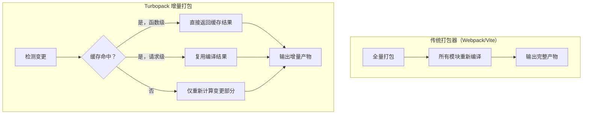
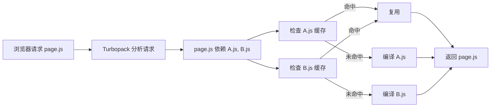
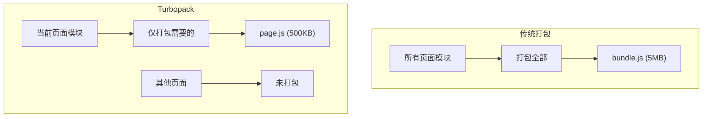

# Turbopack

## ⭐ 面试重点速览

| 知识模块 | 重点内容 | 面试频率 |
|----------|----------|----------|
| Rust 增量计算 | 函数级缓存、请求级缓存、仅重新计算变更部分 | 极高 |
| 懒加载打包 | 只打包当前页面需要的模块 | 中高 |
| Next.js 集成 | 深度优化、SSR/RSC 支持 | 高 |
| 与 Vite 对比 | 架构差异、性能数据、适用场景 | 高 |

---

## Turbopack 概述

Turbopack 是 Vercel 推出的基于 Rust 的**增量打包器**（Incremental Bundler），由 Webpack 作者 Tobias Koppers 主导开发。它并非简单的 "Webpack 用 Rust 重写"，而是一个全新的架构 —— 基于**增量计算**（Incremental Computation）理念设计。



---

## 增量计算核心

### 函数级缓存（Function-level Memoization）

Turbopack 将每个编译操作抽象为**纯函数**，每个函数都有确定性输入和输出。当输入不变时，直接返回缓存结果：

```rust
// 伪代码：Turbopack 的函数级缓存
#[memoize]  // 自动缓存，输入相同 → 直接返回缓存
fn compile_module(source: SourceFile, config: CompileConfig) -> CompiledModule {
    // 解析 → 转换 → 生成代码
    // 只有 source 或 config 变化时才重新执行
    let ast = parse(source);
    let transformed = transform(ast, config);
    generate(transformed)
}
```

::: tip 函数级缓存 vs 文件级缓存
- **文件级缓存**（Webpack 5 持久化缓存）：文件内容不变就不重新编译，粒度是文件
- **函数级缓存**（Turbopack）：每个编译步骤都是独立函数，粒度是函数调用。同一个文件的不同编译阶段（解析、转换、优化）可以独立缓存
:::

### 请求级缓存（Request-level Caching）

Turbopack 将每个 HTTP 请求也视为一个编译单元：



### 懒加载打包策略

Turbopack **只打包当前页面实际需要的模块**，而不是整个应用所有模块：



---

## Next.js 深度集成

Turbopack 与 Next.js 深度绑定，作为 Next.js 的默认开发工具（`next dev --turbo`）：

```bash
# 启用 Turbopack
next dev --turbo

# 性能对比（Next.js 15 官方数据）
# 1000 模块项目：
#   Webpack 冷启动：~12s
#   Turbopack 冷启动：~1.5s  （8x 提升）
# 10000 模块项目：
#   Webpack 冷启动：~60s
#   Turbopack 冷启动：~4s    （15x 提升）
```

### SSR / RSC 优化

Turbopack 对 Next.js 的 SSR（Server-Side Rendering）和 RSC（React Server Components）进行了针对性优化：

- **服务端模块**与**客户端模块**分离编译，避免不必要的客户端打包
- Server Actions 的端到端类型安全，编译时即可发现错误
- 流式 SSR 的 chunk 拆分优化

---

## 性能数据对比

| 场景 | Webpack 5 | Vite 5 | Turbopack | Rspack |
|------|-----------|--------|-----------|--------|
| 冷启动（1000 模块） | 12s | 1.5s | **0.8s** | 1.2s |
| 冷启动（10000 模块） | 60s | 3s | **1.5s** | 2.5s |
| 冷启动（50000 模块） | 300s+ | 15s | **5s** | 12s |
| HMR（1000 模块） | 200ms | 50ms | **30ms** | 50ms |
| HMR（10000 模块） | 2000ms | 50ms | **30ms** | 50ms |

::: warning 性能数据说明
以上数据来自 Vercel 官方和社区基准测试，实际表现因项目结构和硬件配置而异。Turbopack 在**超大项目**中的优势最明显，因为增量计算的缓存命中率随项目规模增长而提升。
:::

---

## Turbopack 与 Vite 的区别

| 维度 | Turbopack | Vite 6 |
|------|-----------|---------|
| **核心思想** | 增量计算（缓存一切） | ESM 原生开发（不打包） |
| **开发模式** | Rust 增量打包 | ESM 按需编译 |
| **性能优势来源** | 函数级缓存 + Rust | 浏览器原生 ESM + esbuild |
| **框架绑定** | **Next.js 专属** | 通用（Vue/React/Svelte 等） |
| **插件生态** | 起步阶段 | Rollup 兼容 + Vite 特有 |
| **生产构建** | 建设中 | Rolldown (Rust) |
| **学习成本** | 低（Next.js 内置） | 低 |
| **开源背景** | Vercel | 社区驱动（尤雨溪） |

::: tip Turbopack 的核心优势
1. **超大项目**：模块数 10000+ 时，增量计算的缓存命中率极高，性能远超 Vite
2. **Next.js 优化**：SSR/RSC/Server Actions 的深度集成，零配置
3. **函数级缓存**：粒度最细的缓存策略，避免重复计算
:::

::: danger Turbopack 的局限性
1. **Next.js 绑定**：目前只支持 Next.js，不能用于 Vue/Svelte 等其他框架
2. **生产构建不成熟**：生产构建功能仍在开发中，Next.js 默认仍用 Webpack/Rspack 生产构建
3. **插件生态薄弱**：相比 Webpack/Vite 的丰富插件生态，Turbopack 几乎为零
4. **不适用于非 Next.js 项目**：如果你的项目不是 Next.js，Turbopack 完全无法使用
:::

---

## 面试高频问题汇总

### Q1：Turbopack 的增量计算和 Webpack 的缓存有什么区别？

| 维度 | Webpack 5 缓存 | Turbopack 增量计算 |
|------|---------------|-------------------|
| **粒度** | 文件级（整个文件） | 函数级（每个编译步骤） |
| **缓存策略** | 持久化到磁盘 | 内存 + 可序列化 |
| **命中条件** | 文件内容不变 | 函数输入不变 |
| **跨模块复用** | 不支持 | 支持（相同输入 → 相同输出） |
| **细粒度** | 文件变更 = 全部重算 | 仅变更部分重算 |

### Q2：Turbopack 和 Vite 应该选哪个？

**核心决策因素**：

1. **Next.js 项目**：直接用 Turbopack（`next dev --turbo`），零配置
2. **非 Next.js 项目**：Turbopack 不可能，只能选 Vite
3. **超大项目（10000+ 模块）**：Turbopack 的增量计算优势明显
4. **需要丰富插件生态**：Vite 胜出

实际上，**大多数项目不需要纠结**：如果你用 Next.js，Turbopack 是默认选项；否则 Vite 是唯一选择。

### Q3：Turbopack 的 "函数级缓存" 具体是怎么实现的？

Turbopack 将每个编译步骤封装为纯函数，使用**备忘录模式**（Memoization）自动缓存：

```rust
// 伪代码：函数级缓存
// 1. 每个需要缓存的函数使用 #[memoize] 标注
// 2. 框架自动记录函数的输入参数
// 3. 下次调用时，先检查输入是否相同
// 4. 相同 → 返回缓存，不同 → 重新执行并更新缓存

#[memoize]
fn resolve_import(path: &str, from: &str) -> ResolvedPath {
    // 模块路径解析
    // 输入：import 路径 + 当前文件路径
    // 输出：解析后的绝对路径
}

#[memoize]
fn parse_module(source: &str) -> AST {
    // 输入：模块源代码
    // 输出：AST
}

#[memoize]
fn transform_module(ast: &AST, config: &Config) -> TransformedModule {
    // 输入：AST + 编译配置
    // 输出：转换后的代码
}
```

---

## 面试追问环节

**Q：Turbopack 的 "懒加载打包" 与传统 Code Splitting 有什么区别？**

- **Code Splitting**（Webpack）：需要手动配置 `splitChunks` 或使用 `React.lazy()`，在**生产构建**时拆分
- **Turbopack 懒加载**：在**开发时**自动只打包当前页面需要的模块，不需要手动配置

**Q：Turbopack 为什么选择 Rust 而不是 Go？**

1. **性能**：Rust 的零成本抽象和内存安全保证，在编译型语言中性能最优
2. **生态**：SWC（Rust 的 Babel 替代品）已经证明了 Rust 在前端工具链中的可行性
3. **并发**：Rust 的所有权模型天然避免数据竞争，适合编写高并发编译工具
4. **团队经验**：Vercel 团队在 SWC 项目中积累了丰富的 Rust 前端工具开发经验

**Q：Turbopack 会取代 Webpack 吗？**

短期内不会。原因：
1. Turbopack 目前只支持 Next.js，受众有限
2. Webpack 的插件生态（1000+ 插件）无法完全复刻
3. 大量现有项目深度依赖 Webpack 的配置和插件
4. Rspack 作为 Webpack 兼容的替代品，迁移成本更低

长期来看，Turbopack 可能成为 Next.js 的**唯一构建工具**，但不会成为通用构建工具。