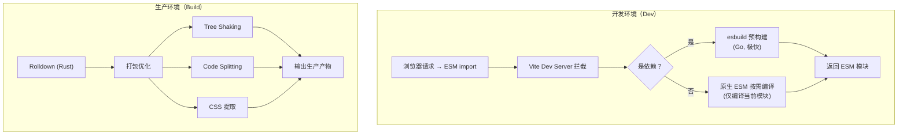
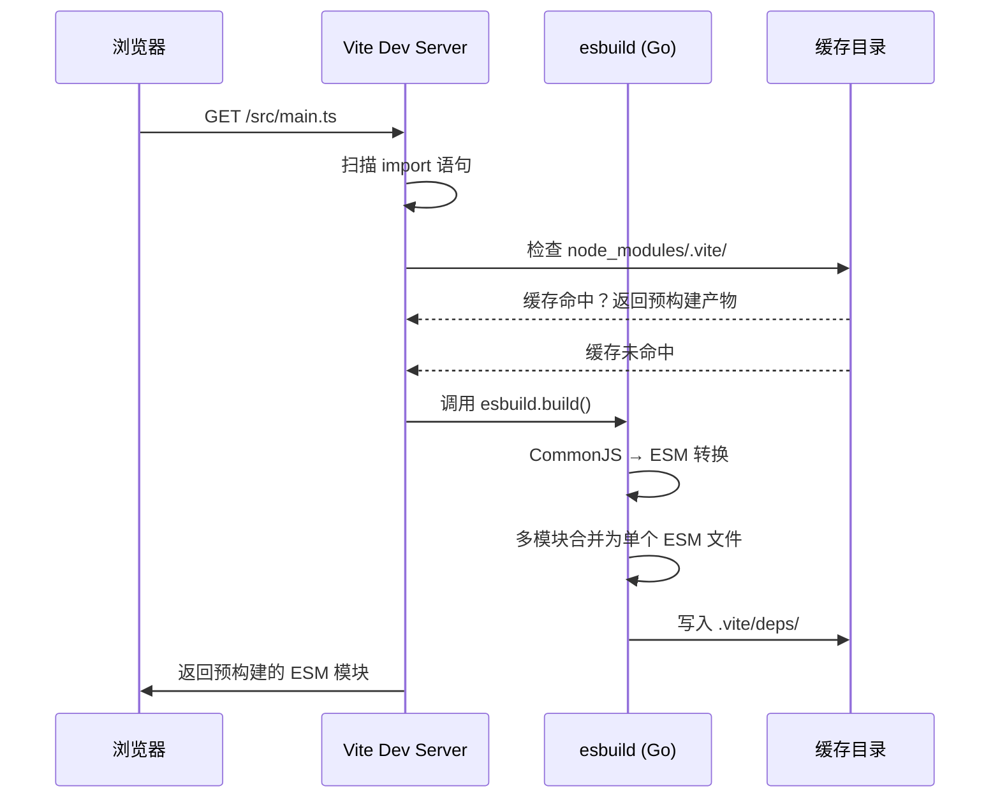
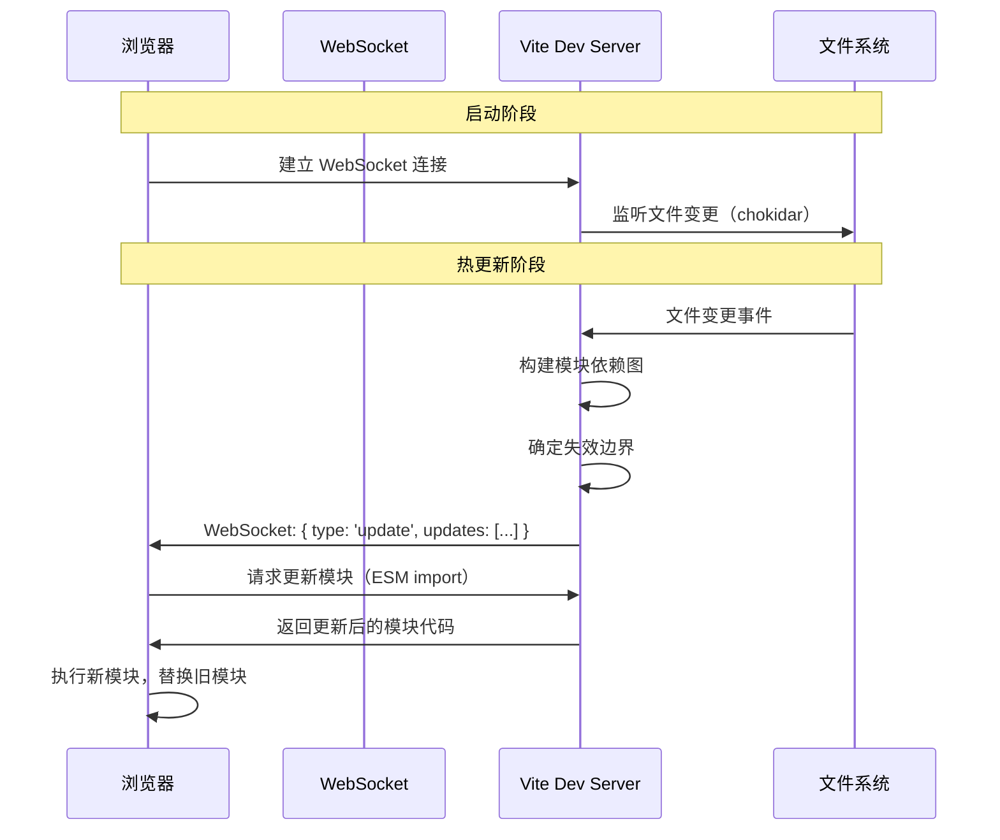

# Vite 6 核心

## ⭐ 面试重点速览

| 知识模块 | 重点内容 | 面试频率 |
|----------|----------|----------|
| 双引擎架构 | 开发 ESM 按需编译 + 生产 Rolldown Rust 打包 | 极高 |
| 依赖预构建 | esbuild 处理 CommonJS → ESM、性能提升原理 | 高 |
| HMR 原理 | WebSocket + 模块图精确更新 | 极高 |
| Module Federation 2.0 | 运行时共享模块、跨应用组件共享 | 中高 |
| 插件机制 | Rollup 兼容 + Vite 特有钩子 | 高 |

---

## Vite 6 双引擎架构



::: tip 为什么需要两套引擎？
- **开发环境**：追求速度，利用浏览器原生 ESM 能力，不做打包，每个模块独立请求
- **生产环境**：追求最优产物，需要打包优化（Tree Shaking、代码分割、压缩），减少网络请求
- **Vite 6 革新**：生产打包从 Rollup（JS）迁移到 Rolldown（Rust），构建速度大幅提升
:::

---

## 依赖预构建（Dependency Pre-bundling）

### 为什么需要预构建？

Vite 开发环境使用原生 ESM，但 `node_modules` 中的依赖存在两个问题：

1. **CommonJS 模块**：大量 npm 包使用 CommonJS 格式，浏览器无法直接执行
2. **请求瀑布**：一个包可能包含数百个内部模块，逐个请求会导致网络瀑布

### esbuild 预构建流程



::: tip esbuild 为什么这么快？

1. **Go 语言实现**：编译为原生机器码，无解释器开销
2. **并行处理**：充分利用多核 CPU
3. **无 AST 遍历**：直接生成字节码，减少中间表示
4. **内存高效**：Go 的内存管理模型比 Node.js 更高效

**性能对比**：esbuild 打包 1000 个模块约 0.1s，而传统 Webpack 需要 10-30s，差距达 100-300 倍。
:::

### 预构建配置

```typescript
// vite.config.ts
export default defineConfig({
  optimizeDeps: {
    // 强制预构建的依赖（检测不到的依赖，如动态 import）
    include: ['lodash-es', 'echarts'],
    // 排除预构建的依赖（已经是 ESM 且不需要处理）
    exclude: ['some-esm-only-package'],
    // esbuild 配置
    esbuildOptions: {
      target: 'esnext',
      // 自动处理 JSX
      jsx: 'automatic',
    },
  },
})
```

---

## HMR 原理（Hot Module Replacement）



### HMR 关键实现细节

**1. 模块图（Module Graph）**

Vite 维护一个**模块依赖图**，记录每个模块及其依赖关系：

```typescript
// Vite 内部模块图简化表示
interface ModuleNode {
  id: string                    // 模块路径
  file: string                  // 文件路径
  importers: Set<ModuleNode>    // 谁依赖了我
  importedModules: Set<ModuleNode> // 我依赖了谁
  transformResult: TransformResult | null
  isSelfAccepting: boolean      // 是否接受自身更新
}
```

**2. 失效边界传播**

当文件变更时，Vite 沿依赖图向上传播，找到最近的**接受自身更新**的模块，只更新失效范围内的模块：

```typescript
// 伪代码：失效边界传播
function propagateUpdate(mod: ModuleNode): ModuleNode[] {
  const boundary: ModuleNode[] = []

  function walk(current: ModuleNode) {
    // 如果当前模块接受自身更新，它就是边界
    if (current.isSelfAccepting) {
      boundary.push(current)
      return
    }
    // 否则继续向上传播
    for (const importer of current.importers) {
      walk(importer)
    }
  }

  walk(mod)
  return boundary
}
```

**3. HMR 客户端**

```javascript
// 简化版：HMR 客户端核心逻辑
import { createHotContext } from '/@vite/client'

const hot = createHotContext(import.meta.url)

// 注册模块自更新回调
hot.accept((newModule) => {
  // 新模块已加载，替换旧模块
  // 典型场景：Vue SFC 组件更新
})

// 注册依赖更新回调
hot.accept(['./dep.js'], ([newDep]) => {
  // dep.js 更新后的处理逻辑
})

// 模块卸载回调
hot.dispose(() => {
  // 清理副作用（如定时器、事件监听）
})
```

::: warning Vite HMR 与 Webpack HMR 的关键区别
- **Webpack HMR**：需要重新打包变更模块，模块越多越慢
- **Vite HMR**：只需要重新编译变更模块（ESM 不打包），速度恒定，不受项目规模影响
:::

---

## Module Federation 2.0（Vite 6）

Vite 6 引入了 Module Federation 2.0，支持**运行时模块共享**，允许不同应用之间动态加载和共享组件。

```typescript
// vite.config.ts - 宿主应用
import { defineConfig } from 'vite'
import federation from '@originjs/vite-plugin-federation'

export default defineConfig({
  plugins: [
    federation({
      name: 'host-app',
      remotes: {
        // 远程应用的入口
        remote_app: 'http://localhost:5001/assets/remoteEntry.js',
      },
      shared: ['react', 'react-dom', 'vue'], // 共享依赖，避免重复加载
    }),
  ],
})
```

```typescript
// 使用远程组件
import RemoteButton from 'remote_app/Button'

function App() {
  return <RemoteButton label="来自远程应用" />
}
```

```typescript
// vite.config.ts - 远程应用
export default defineConfig({
  plugins: [
    federation({
      name: 'remote_app',
      filename: 'remoteEntry.js',
      exposes: {
        './Button': './src/components/Button.vue',
        './Header': './src/components/Header.tsx',
      },
      shared: ['react', 'react-dom', 'vue'],
    }),
  ],
})
```

::: danger Module Federation 的注意事项
- **共享依赖版本**必须兼容，否则可能出现多实例问题（如 React 两个实例导致 hooks 报错）
- **CSS 隔离**：远程组件的样式可能影响宿主应用，需要 CSS Modules 或 Shadow DOM
- **路由同步**：多个应用的路由需要协调，避免冲突
:::

---

## 插件机制

Vite 插件兼容 Rollup 插件接口，同时扩展了 Vite 特有的钩子。

```typescript
// 一个简化的 Vite 插件示例
export function myVitePlugin() {
  return {
    name: 'vite-plugin-my',         // 插件名称（必须唯一）

    // === Rollup 兼容钩子 ===

    // 解析模块路径（如路径别名）
    resolveId(id, importer) {
      if (id === 'virtual:my-module') {
        return '\0virtual:my-module'  // \0 前缀表示虚拟模块
      }
    },

    // 加载模块内容（虚拟模块）
    load(id) {
      if (id === '\0virtual:my-module') {
        return 'export default "Hello from virtual module!"'
      }
    },

    // 代码转换（如 JSX → JS、TS → JS）
    transform(code, id) {
      if (id.endsWith('.custom')) {
        return {
          code: transformCustomSyntax(code),
          map: null, // source map
        }
      }
    },

    // === Vite 特有钩子 ===

    // 配置解析后（修改最终配置）
    configResolved(resolvedConfig) {
      console.log('最终配置:', resolvedConfig)
    },

    // 开发服务器启动时
    configureServer(server) {
      // 添加自定义中间件
      server.middlewares.use((req, res, next) => {
        // 自定义请求处理
        next()
      })
    },

    // HTML 转换（注入脚本、修改模板）
    transformIndexHtml(html) {
      return html.replace(
        '</head>',
        '<script>console.log("injected")</script></head>'
      )
    },

    // HMR 事件处理
    handleHotUpdate({ file, server, modules }) {
      // 自定义热更新逻辑
      // 返回空数组将阻止默认的 HMR 处理
      return modules
    },
  }
}
```

---

## 面试高频问题汇总

### Q1：Vite 为什么快？

**四个层面**：

1. **开发时不打包**：利用浏览器原生 ESM，按需编译，每个模块独立请求
2. **依赖预构建**：esbuild（Go 编写）处理 `node_modules`，速度比 JS 工具快 10-100 倍
3. **精准 HMR**：通过模块图精确确定失效边界，只更新变更的模块，不受项目规模影响
4. **Rolldown 生产打包**：Rust 实现，替代 Rollup，生产构建速度大幅提升

### Q2：Vite 的 HMR 是如何实现的？

核心流程：

1. **文件监听**：chokidar 监听文件变更
2. **模块图更新**：确认变更文件对应的模块节点
3. **失效边界传播**：沿依赖图向上找到最近的 `isSelfAccepting` 模块
4. **WebSocket 推送**：向浏览器发送更新信息（模块路径、类型）
5. **浏览器更新**：通过 ESM `import()` 重新请求变更模块，`hot.accept()` 回调执行替换

### Q3：Vite 如何处理 CommonJS 依赖？

Vite 在**依赖预构建**阶段，使用 esbuild 将 CommonJS 模块转换为 ESM 格式：

```javascript
// 原始 CommonJS 模块
const lodash = require('lodash')
module.exports = { chunk: lodash.chunk }

// esbuild 转换后 → ESM
import lodash from 'lodash'
export const chunk = lodash.chunk
```

预构建结果缓存在 `node_modules/.vite/deps/`，后续启动直接使用缓存。

---

## 面试追问环节

**Q：Vite 6 的 Rolldown 和 Rollup 有什么区别？**

Rolldown 是 Vite 团队用 Rust 重写的 Rollup 替代品：

- **语言**：Rollup 是 JS，Rolldown 是 Rust（性能 10-50x 提升）
- **API 兼容**：Rolldown 保持 Rollup 的 API 设计，现有 Rollup 插件可无缝迁移
- **定位**：Rolldown 专注于 Vite 的生产打包场景，不追求替代 Rollup 所有生态

**Q：Vite 开发环境为什么不用打包，生产环境又要打包？**

- **开发环境**：HTTP/1.1 和 HTTP/2 支持多路复用，浏览器可以高效加载大量 ESM 模块。并且开发时最重要的是**速度**，不打包意味着改一个文件只需要编译一个文件
- **生产环境**：用户网络环境不可控，HTTP/1.1 仍然广泛存在，大量小文件请求会严重影响加载性能。打包（Tree Shaking、压缩、合并）是必要的优化

**Q：Vite 的依赖预构建如何避免重复处理？**

Vite 使用**内容哈希**确定缓存是否有效：
- 预构建前扫描所有 `package.json` 中的依赖及其版本
- 计算这些信息的 hash 值
- 与 `node_modules/.vite/deps/_metadata.json` 中的 hash 比较
- 如果 hash 一致，直接使用缓存；否则重新预构建